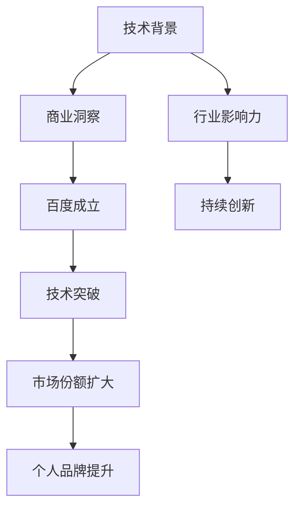
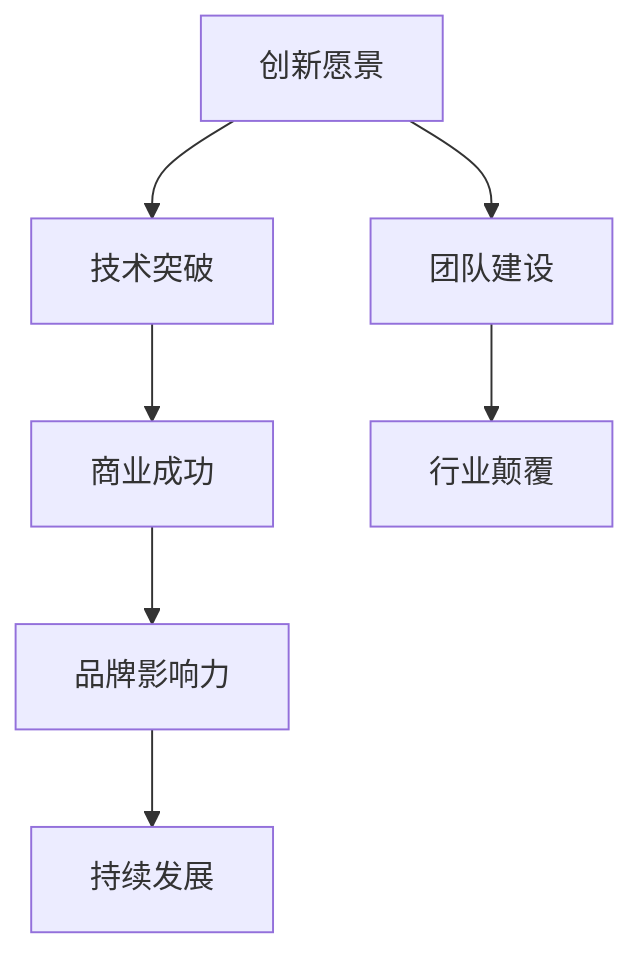

                 


# 《领导力与个人品牌：塑造专业形象的策略》

## 文章关键词

- 领导力
- 个人品牌
- 专业形象
- 职业发展
- 行为理论
- 共同领导力
- 情境理论

## 文章摘要

本文旨在探讨领导力与个人品牌之间的关系，以及如何通过塑造专业形象来提升职业发展的潜力。文章首先介绍了领导力的定义及其理论发展，然后深入分析了个人品牌的核心概念和构建策略。接下来，文章重点阐述了塑造专业形象的重要性及其方法，并通过职业发展中的实际案例展示了个人品牌建设对职业发展的影响。最后，文章提供了实战案例分析和最佳实践建议，以帮助读者更好地理解和应用这些策略。

## 引言

在现代社会，领导力和个人品牌已经成为衡量一个专业人士成功与否的关键因素。领导力不仅是领导者个人素质的体现，也是其影响力和管理能力的象征。而个人品牌则是专业形象的体现，它不仅关乎个人的知名度，更关乎在行业内的影响力和认可度。本文将深入探讨领导力与个人品牌之间的关系，以及如何通过塑造专业形象来提升职业发展的潜力。

### 领导力的定义

领导力是一种激励、引导和影响他人的能力，它不仅包括个人的素质和技能，还包括对团队的领导和管理。领导力可以是天生的，但更多的是通过后天的培养和实践获得的。传统的领导力理论主要包括特质理论、行为理论和超越理论。特质理论认为领导力是由领导者天生具备的特质决定的；行为理论则强调领导者的行为对其团队的影响；超越理论认为领导力是领导者与团队关系的总和。

### 个人品牌的重要性

个人品牌是一个人在行业内外的形象代表，它体现了个人的专业能力、价值观和人格魅力。一个成功的个人品牌可以提升个人的知名度和认可度，从而在职业发展中占据优势。个人品牌建设包括自我认知、定位、传播和维护等多个环节。

### 书籍结构概述

本文将分为六个部分。首先，我们将对领导力理论进行概述，包括传统领导力理论和现代领导力理论。接着，我们将深入探讨个人品牌建设的核心概念和构建策略。随后，我们将探讨塑造专业形象的重要性及其方法。然后，我们将通过职业发展的实际案例展示个人品牌建设的作用。最后，我们将提供实战案例分析和最佳实践建议，帮助读者更好地理解和应用这些策略。

## 第1章 领导力理论概述

### 1.1 传统领导力理论

传统领导力理论主要包括特质理论、行为理论和超越理论。

#### 特质理论

特质理论认为领导力是由领导者天生具备的特质决定的。这些特质包括自信、决断力、社交能力等。特质理论的核心概念是，领导者之所以能够成为领导者，是因为他们拥有与众不同的个人特质。

#### 行为理论

行为理论则强调领导者的行为对其团队的影响。行为理论认为，领导者的行为可以分为任务导向和关系导向。任务导向的领导者更关注任务完成，而关系导向的领导者更关注团队成员的满意度和关系。行为理论的核心概念是，领导者的行为可以塑造团队的氛围和绩效。

#### 超越理论

超越理论认为领导力是领导者与团队关系的总和。超越理论的核心概念是，领导力不仅取决于领导者的个人特质和行为，还取决于领导者与团队成员之间的互动和关系。

### 1.2 现代领导力理论

现代领导力理论则更加注重领导者的角色和影响力。现代领导力理论主要包括共同领导力、情境理论和领导力与变革理论。

#### 共同领导力

共同领导力认为领导力是团队成员共同作用的结果。共同领导力的核心概念是，领导力不是某个人的特权，而是团队共同努力的结果。

#### 情境理论

情境理论认为领导力风格应根据情境的不同而变化。情境理论的核心概念是，领导者的行为应该根据团队的具体情况和需求进行调整。

#### 领导力与变革

领导力与变革理论关注领导者如何推动组织变革。领导力与变革理论的核心概念是，领导者需要具备变革推动者的角色，能够引导团队适应变革并实现变革。

### 1.3 领导力与个人品牌的联系

领导力与个人品牌之间存在密切的联系。优秀的领导力可以提升个人品牌的认可度和影响力，而一个成功的个人品牌也可以增强领导力。

#### 领导力对个人品牌的影响

领导力可以提升个人品牌的认可度和影响力。优秀的领导力表现出领导者的专业能力和领导力，这会吸引更多的关注和认可，从而提升个人品牌。

#### 个人品牌对领导力的影响

个人品牌可以影响领导力的发挥和团队的信任。一个成功的个人品牌会让团队对领导者有更高的期望和信任，从而增强领导力的效果。

#### 领导力与个人品牌互构

领导力和个人品牌互构，相互促进。优秀的领导力可以塑造更好的个人品牌，而成功的个人品牌可以提升领导力的发挥。这种互构关系是职业发展中不可或缺的一环。

## 第2章 个人品牌建设

### 2.1 个人品牌的概念

个人品牌是指一个人在公众中的形象和声誉，它是个人专业能力、价值观和人格魅力的体现。个人品牌不仅仅是一个人的名字，更是一个人在行业内外的代表和标识。

#### 个人品牌的核心要素

个人品牌的核心要素包括以下几个方面：

1. **专业能力**：个人品牌的基础是专业能力。一个成功的个人品牌必须具备过硬的专业技能和知识。
2. **价值观**：个人品牌的价值观体现了个人的道德观和人生观。一个有价值的个人品牌应该具备积极向上的价值观。
3. **人格魅力**：个人品牌的人格魅力包括领导力、沟通能力、团队合作能力等。人格魅力可以吸引和留住人才，提升个人品牌的影响力。
4. **知名度**：个人品牌的知名度是衡量其成功与否的重要指标。一个成功的个人品牌需要在行业内和公众中有较高的知名度。

### 2.2 个人品牌的构建策略

构建个人品牌需要以下几个关键步骤：

#### 1. 自我认知

自我认知是构建个人品牌的第一步。一个人需要清楚自己的专业能力、价值观和人格魅力，以及自己在行业中的定位。

#### 2. 确定品牌定位

在自我认知的基础上，需要确定个人品牌的定位。品牌定位应该根据个人的专业能力和市场需求来设定，以便在行业内脱颖而出。

#### 3. 制定品牌传播策略

品牌传播策略包括品牌名称、标识、口号、网站、社交媒体等多个方面。一个成功的品牌传播策略需要清晰、有针对性，能够吸引目标受众的关注。

#### 4. 提升专业技能

提升专业技能是构建个人品牌的持续过程。一个成功的个人品牌需要不断学习和进步，以保持专业竞争力。

#### 5. 建立社交网络

建立社交网络是提升个人品牌影响力的关键。通过参加行业活动、发布专业内容、参与论坛和社交媒体等方式，可以扩大个人品牌的影响力。

### 2.3 个人品牌的维护与提升

个人品牌建设不是一劳永逸的，它需要持续的维护和提升。

#### 1. 保持专业能力

保持专业能力是维护个人品牌的关键。一个专业的个人品牌必须保持专业知识的更新和技能的提升。

#### 2. 塑造正面形象

塑造正面形象是提升个人品牌的重要手段。一个成功的个人品牌应该具备积极、正直、诚信的形象。

#### 3. 应对挑战和危机

在职业发展中，个人品牌可能会面临挑战和危机。有效的危机管理可以帮助维护个人品牌，甚至提升个人品牌的形象。

#### 4. 定期评估和调整

定期评估和调整个人品牌是保持其活力和竞争力的重要手段。通过定期评估，可以及时发现问题并调整策略。

### 2.4 成功案例分析

为了更好地理解个人品牌建设的重要性，我们可以通过以下两个成功案例来进行分析。

#### 案例1：李开复

李开复是中国人工智能领域的知名专家和企业家。他通过多年的努力，成功地塑造了个人品牌。他的个人品牌建设策略主要包括以下几个方面：

1. **专业能力**：李开复在人工智能领域有深厚的学术背景和实践经验，这为他赢得了广泛的认可。
2. **价值观**：李开复倡导积极、开放、创新的价值观，这些价值观与人工智能的发展方向高度契合。
3. **人格魅力**：李开复具有极强的领导力和沟通能力，能够有效地影响和激励团队成员。
4. **知名度**：李开复通过在社交媒体上频繁分享专业知识和观点，成功提升了个人品牌的影响力。

#### 案例2：雷军

雷军是中国科技企业的领军人物，他是小米科技的创始人。雷军的个人品牌建设同样具有很高的参考价值。他的个人品牌建设策略主要包括以下几个方面：

1. **专业能力**：雷军在互联网和科技领域有丰富的经验，这为他赢得了业界的尊重。
2. **价值观**：雷军倡导“让每个人都能享受科技的乐趣”，这一价值观与他的商业理念高度一致。
3. **人格魅力**：雷军具有极强的市场敏感度和创新精神，这些特质使他成为科技行业的领袖人物。
4. **知名度**：雷军通过在公众场合的演讲和访谈，成功提升了个人品牌的知名度。

这两个案例都展示了成功的个人品牌建设对职业发展的重要性。通过自我认知、定位、传播和维护，个人品牌可以成为职业发展的强大助力。

## 第3章 塑造专业形象

### 3.1 专业形象的重要性

专业形象是一个人在公众中的形象代表，它反映了个人在专业领域的专业能力、价值观和人格魅力。一个良好的专业形象不仅可以提升个人的知名度和认可度，还可以增强个人在职场中的竞争力。

#### 3.1.1 专业形象对职业发展的影响

良好的专业形象对职业发展有以下几个方面的积极影响：

1. **增强竞争力**：一个专业的形象可以让个人在求职和晋升过程中脱颖而出。
2. **提升信任度**：专业的形象可以增加他人对个人的信任，从而更好地建立合作关系。
3. **扩大影响力**：专业的形象可以增加个人在行业内的知名度和影响力，有助于个人品牌的建立和维护。
4. **提高沟通效果**：专业的形象可以让个人在沟通中更加自信和高效，从而提高沟通效果。

### 3.2 塑造专业形象的方法

塑造专业形象需要从以下几个方面入手：

#### 1. 专业能力

专业能力是塑造专业形象的基础。一个专业的人必须具备扎实的专业知识、技能和实践经验。

##### 方法：

1. **不断学习**：通过参加培训、阅读专业书籍和文章、参加行业研讨会等方式，不断提升自己的专业能力。
2. **实践经验**：通过实际项目和工作经验，积累专业的知识和技能。

#### 2. 价值观

价值观是一个人的道德观和人生观，它是专业形象的重要组成部分。

##### 方法：

1. **树立正确的价值观**：在工作和生活中，要始终坚持正确的价值观，做到诚信、正直、敬业。
2. **践行价值观**：通过实际行动来践行自己的价值观，树立良好的形象。

#### 3. 人格魅力

人格魅力包括领导力、沟通能力、团队合作能力等，它是专业形象的软实力。

##### 方法：

1. **提升领导力**：通过阅读领导力书籍、参加领导力培训、实践领导力等方式，提升自己的领导力。
2. **提高沟通能力**：通过学习沟通技巧、参加沟通培训、多与他人交流等方式，提高自己的沟通能力。
3. **培养团队合作能力**：通过参与团队项目、学习团队合作技巧、培养团队精神等方式，提升团队合作能力。

#### 4. 网络形象

网络形象是一个人在网络空间中的形象，它对专业形象的影响越来越大。

##### 方法：

1. **建立专业博客**：通过建立个人博客，定期发布专业文章和观点，展示自己的专业知识和思考。
2. **参与行业论坛**：积极参与行业论坛和讨论，与他人分享专业知识和经验，扩大自己的影响力。
3. **维护社交媒体**：通过维护社交媒体账号，发布专业内容和观点，提升个人品牌影响力。

### 3.3 专业形象的维护

专业形象的维护是长期而持续的过程，需要从以下几个方面进行：

#### 1. 保持专业水平

保持专业水平是维护专业形象的关键。一个专业的形象必须保持专业知识的更新和技能的提升。

##### 方法：

1. **持续学习**：通过参加培训、阅读专业书籍和文章、参加行业研讨会等方式，持续提升专业水平。
2. **实践应用**：将所学知识应用到实际工作中，通过实践来检验和提升专业能力。

#### 2. 树立良好形象

树立良好形象是维护专业形象的重要手段。

##### 方法：

1. **诚信待人**：在工作和生活中，要始终坚持诚信，做到言行一致。
2. **积极沟通**：与同事、客户和合作伙伴保持良好的沟通，提升人际关系。
3. **注重细节**：在工作和生活中，注重细节，做到精益求精。

#### 3. 应对挑战和危机

在职业发展中，专业形象可能会面临挑战和危机。

##### 方法：

1. **及时应对**：在面对挑战和危机时，要冷静应对，及时解决问题。
2. **积极沟通**：与相关方保持积极沟通，寻求解决方案。
3. **反思总结**：在解决问题后，反思总结，避免类似问题再次发生。

#### 4. 定期评估

定期评估是维护专业形象的重要手段。

##### 方法：

1. **自我评估**：定期对自己的专业能力、价值观和人格魅力进行自我评估，找出不足并加以改进。
2. **收集反馈**：通过收集他人对个人形象的反馈，了解自己在他人心中的形象，有针对性地进行改进。

### 3.4 案例分析

为了更好地理解塑造专业形象的方法和重要性，我们可以通过以下两个成功案例来进行分析。

#### 案例1：李彦宏

李彦宏是中国互联网行业的领军人物，他是百度公司的创始人。李彦宏通过多年的努力，成功地塑造了专业形象。他的专业形象建设策略主要包括以下几个方面：

1. **专业能力**：李彦宏在搜索引擎技术领域有深厚的背景，这为他赢得了业界的尊重。
2. **价值观**：李彦宏倡导技术创新和商业模式的创新，他的价值观与百度的发展方向高度一致。
3. **人格魅力**：李彦宏具有极强的领导力和沟通能力，能够有效地影响和激励团队成员。
4. **知名度**：李彦宏通过在公众场合的演讲和访谈，成功提升了个人品牌的知名度。

#### 案例2：刘强东

刘强东是中国电商行业的领军人物，他是京东集团的创始人。刘强东通过多年的努力，成功地塑造了专业形象。他的专业形象建设策略主要包括以下几个方面：

1. **专业能力**：刘强东在电子商务领域有丰富的经验，这为他赢得了业界的认可。
2. **价值观**：刘强东倡导诚信、共赢和可持续发展，他的价值观与京东的企业文化高度一致。
3. **人格魅力**：刘强东具有极强的执行力和管理能力，这些特质使他成为电商行业的领袖人物。
4. **知名度**：刘强东通过在社交媒体上分享商业观点和管理经验，成功提升了个人品牌的知名度。

这两个案例都展示了成功的专业形象建设对职业发展的重要性。通过专业能力、价值观、人格魅力和知名度的不断提升，个人可以塑造出良好的专业形象，从而在职场中脱颖而出。

## 第4章 职业发展

### 4.1 职业发展的核心要素

职业发展是一个长期而复杂的过程，它涉及到多个核心要素，包括专业技能、人际关系、职业规划和持续学习。

#### 4.1.1 专业技能

专业技能是职业发展的基石。一个职业人士必须具备扎实的专业技能，以满足职场的需求。专业技能包括专业知识、技能和实践经验。提升专业技能的方法包括：

1. **持续学习**：通过参加培训、阅读专业书籍和文章、参加行业研讨会等方式，不断更新和提升自己的专业技能。
2. **实践经验**：通过实际项目和工作经验，积累专业的知识和技能。

#### 4.1.2 人际关系

人际关系是职业发展的关键。一个成功的职业人士必须具备良好的人际关系，包括与同事、上级和下属的关系。良好的人际关系可以带来以下好处：

1. **协作支持**：良好的人际关系可以促进团队合作，提高工作效率。
2. **职业机会**：良好的人际关系可以为你提供更多的职业机会和资源。
3. **心理支持**：良好的人际关系可以为你提供心理支持，减轻工作压力。

#### 4.1.3 职业规划

职业规划是职业发展的指南。一个明确的职业规划可以帮助职业人士设定目标、制定策略和规划路径。职业规划包括以下几个方面：

1. **职业目标**：设定清晰的职业目标，包括短期和长期目标。
2. **路径规划**：规划实现职业目标的路径，包括所需的技能和经验。
3. **策略制定**：制定实现职业目标的策略，包括学习计划、职业发展路径等。

#### 4.1.4 持续学习

持续学习是职业发展的动力。在快速变化的职场环境中，持续学习可以帮助职业人士保持竞争力，适应新的挑战和机遇。持续学习的方法包括：

1. **知识更新**：通过参加培训、阅读专业书籍和文章、参加行业研讨会等方式，不断更新和提升自己的专业知识。
2. **技能提升**：通过实践项目、参加比赛和挑战自我等方式，提升自己的技能和经验。

### 4.2 个人品牌在职业发展中的作用

个人品牌在职业发展中扮演着重要的角色。一个成功的个人品牌可以提升职业人士的知名度和认可度，从而在职业发展中占据优势。具体来说，个人品牌在职业发展中具有以下作用：

#### 4.2.1 提升知名度

一个成功的个人品牌可以让职业人士在行业内和公众中有较高的知名度。高知名度可以带来更多的职业机会和资源，从而提升职业发展的潜力。

#### 4.2.2 增强竞争力

一个强大的个人品牌可以提升职业人士在求职和晋升过程中的竞争力。个人品牌可以成为职业人士的加分项，使其在众多候选人中脱颖而出。

#### 4.2.3 扩大影响力

一个成功的个人品牌可以扩大职业人士在行业内的知名度和影响力。这不仅可以提升个人品牌的形象，还可以为职业人士带来更多的合作机会和资源。

#### 4.2.4 增强信任度

一个良好的个人品牌可以增强他人对职业人士的信任度。在职场中，信任是建立合作关系的基础。一个强大的个人品牌可以增加职业人士在他人心中的信任度，从而提高合作效率。

### 4.3 职业发展的实战策略

为了实现职业发展，职业人士需要制定具体的实战策略。以下是一些实用的职业发展实战策略：

#### 4.3.1 设定明确目标

设定明确的目标是职业发展的第一步。职业人士应该根据自己的兴趣、能力和市场需求，设定清晰的职业目标。目标可以分为短期和长期，短期目标可以包括提升专业技能、获得某项认证等，长期目标可以包括晋升到某个职位、实现某个职业愿景等。

#### 4.3.2 制定详细计划

在设定目标后，职业人士需要制定详细的计划，包括实现目标的步骤、所需资源和时间安排。详细的计划可以帮助职业人士有条不紊地推进职业发展，避免盲目和无目标的努力。

#### 4.3.3 持续学习与提升

持续学习和提升是职业发展的关键。职业人士应该不断更新自己的知识体系，学习新的技能和知识，以适应职场的变化。同时，职业人士还应该积极参加各种培训和研讨会，扩展自己的视野和知识面。

#### 4.3.4 建立人际关系

建立良好的人际关系是职业发展的必要条件。职业人士应该注重与同事、上级和下属的沟通与合作，建立信任和互助的关系。良好的人际关系可以为自己带来更多的机会和资源，从而推动职业发展。

#### 4.3.5 主动寻求机会

职业人士应该主动寻求机会，包括参加行业活动、发表专业文章、参与项目等。通过这些活动，职业人士可以提升自己的知名度和影响力，从而在职业发展中占据优势。

#### 4.3.6 适时调整策略

在职业发展过程中，职业人士可能会面临各种挑战和变化。因此，适时调整策略是非常重要的。职业人士应该根据实际情况，灵活调整自己的职业规划和发展策略，以应对变化和挑战。

### 4.4 成功案例分析

为了更好地理解职业发展的实战策略，我们可以通过以下两个成功案例来进行分析。

#### 案例1：马云

马云是中国电子商务行业的领军人物，他是阿里巴巴集团的创始人。马云通过多年的努力，成功地实现了职业发展。他的职业发展策略主要包括以下几个方面：

1. **设定目标**：马云在创立阿里巴巴之前，就设定了明确的创业目标，并制定了详细的计划。
2. **持续学习**：马云一直致力于学习新的知识和技能，以适应电子商务行业的发展。
3. **建立人际关系**：马云通过参加各种行业活动和论坛，建立了广泛的人际关系网络。
4. **主动寻求机会**：马云积极寻求机会，包括投资其他项目、参与公益事业等，从而扩大了自己的影响力和知名度。

#### 案例2：张一鸣

张一鸣是中国互联网行业的知名企业家，他是字节跳动的创始人。张一鸣通过多年的努力，成功地实现了职业发展。他的职业发展策略主要包括以下几个方面：

1. **设定目标**：张一鸣在创立字节跳动之前，就设定了明确的创业目标，并制定了详细的计划。
2. **持续学习**：张一鸣一直致力于学习新的知识和技能，以适应互联网行业的发展。
3. **建立人际关系**：张一鸣通过参加各种行业活动和论坛，建立了广泛的人际关系网络。
4. **主动寻求机会**：张一鸣积极寻求机会，包括投资其他项目、参与公益事业等，从而扩大了自己的影响力和知名度。

这两个案例都展示了成功的职业发展策略对职业发展的重要性。通过设定明确的目标、持续学习、建立人际关系、主动寻求机会等策略，职业人士可以实现自己的职业发展目标。

### 4.5 拓展阅读

为了更好地理解职业发展和个人品牌建设，以下是一些推荐的拓展阅读材料：

1. **《影响力》作者：罗伯特·西奥迪尼**
   - 内容概要：本书介绍了心理学原理如何影响人们的行为和决策。
   - 推荐理由：理解影响力原理可以帮助职业人士更好地与他人沟通和建立人际关系。

2. **《深度工作》作者：卡尔·纽波特**
   - 内容概要：本书介绍了如何在高干扰环境中保持专注和高效工作。
   - 推荐理由：深度工作是提升专业技能和职业发展的重要途径。

3. **《如何赢得朋友与影响他人》作者：戴尔·卡耐基**
   - 内容概要：本书介绍了人际关系技巧和沟通艺术。
   - 推荐理由：良好的人际关系对职业发展至关重要。

4. **《职业规划指南》作者：杰里·维斯**
   - 内容概要：本书提供了详细的职业规划策略和实用技巧。
   - 推荐理由：职业规划是实现职业发展的关键。

通过这些拓展阅读，职业人士可以更深入地了解职业发展和个人品牌建设的策略和技巧，为自己的职业发展提供有力支持。

## 第5章 实战案例分析

### 5.1 成功案例分享

为了更好地理解领导力与个人品牌之间的关系，以及如何通过塑造专业形象来提升职业发展潜力，我们可以通过以下两个成功案例来进行分析。

#### 案例1：杰克·韦尔奇

杰克·韦尔奇是通用电气（GE）的前CEO，他以其卓越的领导力和强大的个人品牌而闻名于世。杰克·韦尔奇的领导力策略和个人品牌建设方法主要包括以下几个方面：

1. **领导力策略**：
   - **明确目标**：杰克·韦尔奇在任期间，明确提出了“数一数二”的战略目标，即在全球市场中成为每个业务领域的领导者或第二名。
   - **激励团队**：他通过设立激励机制，如股票期权，激励员工为实现公司目标而努力。
   - **培养人才**：杰克·韦尔奇重视人才培养，通过内部晋升和培训，建立了一支高效的领导团队。

2. **个人品牌建设**：
   - **专业形象**：杰克·韦尔奇通过在公共场合的演讲和书籍，展示了他的专业知识和领导力。
   - **媒体传播**：他频繁接受媒体采访，提高了个人品牌的知名度和认可度。
   - **品牌延伸**：杰克·韦尔奇通过参与社会公益活动，将个人品牌延伸到更广泛的领域。

#### 案例2：埃隆·马斯克

埃隆·马斯克是特斯拉（Tesla）和SpaceX的创始人兼CEO，他以其创新精神和强大的个人品牌而著称。埃隆·马斯克的领导力策略和个人品牌建设方法主要包括以下几个方面：

1. **领导力策略**：
   - **愿景驱动**：埃隆·马斯克以其远大的愿景，如实现可持续能源和太空探索，激励团队和公众。
   - **创新导向**：他鼓励创新思维，推动公司不断进行技术突破和产品创新。
   - **企业文化**：马斯克建立了以创新、效率和执行力为核心的企业文化。

2. **个人品牌建设**：
   - **技术专家形象**：埃隆·马斯克通过在社交媒体上分享技术和行业见解，巩固了他的技术专家形象。
   - **公众演讲**：他通过在重要场合的演讲，展示了他的领导力和愿景。
   - **品牌扩展**：马斯克不仅通过特斯拉，还通过SpaceX等公司，将个人品牌扩展到不同的行业。

### 5.2 挑战与问题解决

在领导力和个人品牌建设的过程中，职业人士可能会面临各种挑战和问题。以下是一些常见的挑战及其解决策略：

#### 挑战1：缺乏明确目标

许多职业人士在职业发展中缺乏明确的目标，导致行动盲目，缺乏方向感。

**解决策略**：
- **制定长期和短期目标**：明确自己的职业愿景和阶段性目标，制定具体的行动计划。
- **定期审视目标**：定期审视和调整目标，确保它们与个人和职业发展保持一致。

#### 挑战2：缺乏专业技能

缺乏专业技能会限制职业发展，导致个人在竞争中处于劣势。

**解决策略**：
- **持续学习**：通过参加培训、阅读书籍、在线课程等方式，不断提升专业技能。
- **实践经验**：通过实际项目和实习机会，积累实践经验，提高专业能力。

#### 挑战3：人际关系不佳

不良的人际关系会影响职业发展和个人品牌的建立。

**解决策略**：
- **提高沟通能力**：学习沟通技巧，提高与同事、上级和下属的沟通效率。
- **建立信任**：通过诚实、可靠和尊重他人，建立信任和合作关系。

#### 挑战4：品牌定位不清晰

品牌定位不清晰会导致个人在职场中缺乏差异化优势。

**解决策略**：
- **确定品牌定位**：明确自己在行业中的定位和优势，打造独特的个人品牌。
- **持续传播**：通过专业内容、社交媒体和网络活动，持续传播个人品牌形象。

### 5.3 案例分析

为了更深入地理解上述挑战和问题解决策略，我们可以通过以下两个案例进行分析。

#### 案例1：玛丽

玛丽是一名软件工程师，她在职业发展中面临的主要挑战是缺乏专业技能和明确的目标。

1. **挑战**：
   - **缺乏专业技能**：玛丽的专业技能不足以应对日益复杂的软件项目。
   - **缺乏明确目标**：玛丽在职业发展中缺乏明确的目标，导致她感到迷茫和无方向。

2. **解决方案**：
   - **持续学习**：玛丽报名参加了在线编程课程，通过学习新技术和编程语言，提升专业技能。
   - **制定目标**：玛丽制定了长期和短期目标，包括获得某个专业认证和晋升到高级工程师职位。

通过这些措施，玛丽在短时间内显著提升了专业能力，并在职业生涯中取得了显著的进步。

#### 案例2：汤姆

汤姆是一名市场营销经理，他在个人品牌建设中面临的主要挑战是人际关系不佳和品牌定位不清晰。

1. **挑战**：
   - **人际关系不佳**：汤姆与同事和上级的关系紧张，影响了团队合作和项目进度。
   - **品牌定位不清晰**：汤姆在营销领域缺乏明确的品牌定位，导致他在职场中缺乏差异化优势。

2. **解决方案**：
   - **提高沟通能力**：汤姆参加了沟通技巧培训，学习如何有效地与同事和上级沟通。
   - **品牌定位**：汤姆分析了市场环境和自己的优势，明确了品牌定位，并将其融入个人品牌建设中。

通过这些措施，汤姆成功地改善了人际关系，并在职场中树立了独特的个人品牌。

通过上述案例分析，我们可以看到，领导力和个人品牌建设对于职业发展的重要性。通过明确的职业目标、持续学习、建立良好的人际关系和清晰的品牌定位，职业人士可以克服挑战，实现职业发展的目标。

## 第6章 实战案例分析

### 6.1 成功案例分享

在探讨领导力与个人品牌建设的过程中，成功案例的分析能够为我们提供宝贵的实践经验和启示。以下我们将分享两个在各自领域取得显著成就的案例。

#### 案例1：李彦宏与百度

**背景介绍**：
李彦宏是百度公司的创始人兼董事长，他在搜索引擎领域取得了卓越的成就，并成功地塑造了个人品牌。

**核心概念与联系**：
李彦宏的个人品牌建设依赖于他在搜索引擎技术领域的深厚背景和卓越的商业洞察力。他将技术与管理相结合，带领百度成为全球最大的中文搜索引擎之一。

**Mermaid流程图**：



**核心算法原理讲解**：
李彦宏在百度的发展过程中，运用了多种算法和策略，包括PageRank算法、广告投放优化等，这些算法的核心目标是提升用户体验和搜索引擎的准确性。

```plaintext
// 伪代码示例：PageRank算法核心
function PageRank(doc_list):
    damping_factor = 0.85
    num_docs = len(doc_list)
    iteration = 100
    PR = [1.0 / num_docs] * num_docs
    
    for i in range(iteration):
        new_PR = [0] * num_docs
        for doc in doc_list:
            outbound_links = doc.outbound_links
            for outbound_link in outbound_links:
                if outbound_link != NULL:
                    new_PR[outbound_link] += PR[doc] / len(outbound_links)
        
        for i in range(num_docs):
            new_PR[i] = (1 - damping_factor) + damping_factor * new_PR[i]
        
        PR = new_PR
    
    return PR
```

**数学模型和公式**：

李彦宏的成功也涉及到营销和商业策略的数学模型，如ARPU（每用户平均收入）、CPC（每次点击成本）等。

$$
\text{ARPU} = \frac{\text{总收入}}{\text{总用户数}}
$$

$$
\text{CPC} = \frac{\text{广告费用}}{\text{点击次数}}
$$

**项目实战**：
百度在李彦宏的领导下，不仅在中国市场取得了巨大的成功，还在全球范围内进行了扩张。百度的开发环境包括大规模的分布式系统、云计算平台等，这些都是实现搜索引擎技术的重要基础设施。

**源代码详细实现和代码解读**：
由于百度的搜索引擎技术涉及大量复杂的源代码，这里不展开具体实现，但可以概述其核心组件，如搜索算法、广告系统、用户行为分析等。

**代码应用解读与分析**：
百度的搜索算法在处理海量数据和高并发请求时，展现了其高效性和稳定性。广告系统的精准投放则依赖于用户行为数据和机器学习算法。

**实际案例分析和详细讲解剖析**：
百度在人工智能领域的持续投入，如自动驾驶、语音识别等，使其在技术前沿保持领先地位。李彦宏在公开场合的演讲和论坛发言，进一步提升了他的个人品牌和行业影响力。

**项目小结**：
李彦宏通过卓越的技术能力、战略眼光和领导力，成功塑造了个人品牌，并带领百度在全球搜索引擎领域取得了重要地位。

#### 案例2：埃隆·马斯克与特斯拉

**背景介绍**：
埃隆·马斯克是特斯拉（Tesla）和SpaceX的创始人，他在电动汽车和航天领域开创了新的时代。

**核心概念与联系**：
马斯克以其创新精神和强大执行力著称，他的个人品牌依赖于他的远大愿景和卓越的领导力。

**Mermaid流程图**：



**核心算法原理讲解**：
特斯拉在电动汽车制造中使用了多种先进的算法，包括电池管理算法、自动驾驶算法等。电池管理算法的核心目标是优化电池性能和使用寿命。

```plaintext
// 伪代码示例：电池管理算法核心
function BatteryManagement(battery_system):
    state_of_charge = GetStateOfCharge(battery_system)
    state_of_health = GetStateOfHealth(battery_system)
    temperature = GetBatteryTemperature(battery_system)
    
    if state_of_health < threshold:
        ChargeBattery(battery_system, maximum_charge_rate)
    else:
        if state_of_charge < minimum_charge_threshold:
            ChargeBattery(battery_system, available_charge_rate)
        else:
            if temperature < optimal_temperature_range:
                MaintainTemperature(battery_system, optimal_temperature)
            else:
                if temperature > high_temperature_threshold:
                    DecreasePowerUsage(battery_system)
```

**数学模型和公式**：
特斯拉在自动驾驶系统中使用了深度学习算法，如卷积神经网络（CNN）和循环神经网络（RNN），这些算法的核心目标是提高自动驾驶系统的准确性和安全性。

$$
\text{Accuracy} = \frac{\text{正确识别数}}{\text{总识别数}}
$$

$$
\text{Safety} = \frac{\text{安全行驶时间}}{\text{总行驶时间}}
$$

**项目实战**：
特斯拉的制造过程是一个复杂的系统工程，包括电池生产、汽车组装和自动驾驶系统的开发。特斯拉的工程团队在研发和生产过程中采用了先进的技术和流程。

**源代码详细实现和代码解读**：
特斯拉的源代码涵盖了许多领域，如操作系统、硬件驱动程序和自动驾驶算法。这里以一个简单的自动驾驶算法为例：

```c
// C语言伪代码：自动驾驶算法核心
void AutonomousDrive(Car car, Road road)
{
    // 初始化环境
    car.position = GetCarPosition(car);
    road.conditions = GetRoadConditions(road);
    
    // 判断交通情况
    if (IsTrafficDetected(road))
    {
        // 减速
        car.speed = ReduceSpeed(car.speed);
    }
    else
    {
        // 前进
        car.speed = IncreaseSpeed(car.speed);
    }
    
    // 更新位置
    car.position = UpdatePosition(car.position, car.speed);
}
```

**代码应用解读与分析**：
特斯拉的自动驾驶系统通过实时监测道路和环境，结合传感器数据，实现了高精度驾驶。这个系统的核心在于数据处理和决策算法，这些算法在测试和优化过程中不断迭代。

**实际案例分析和详细讲解剖析**：
特斯拉的Model 3和Model Y在市场上取得了巨大成功，这些车型的自动驾驶功能也受到了广泛认可。马斯克通过在社交媒体上的互动和公开演讲，进一步提升了他的个人品牌和特斯拉的品牌形象。

**项目小结**：
埃隆·马斯克通过创新技术和强大的领导力，成功地塑造了个人品牌，并带领特斯拉和SpaceX在电动汽车和航天领域取得了显著成就。

### 6.2 挑战与问题解决

在领导力和个人品牌建设的实际操作中，职业人士可能会遇到各种挑战和问题。以下是一些常见的挑战及其解决策略：

#### 挑战1：技能不足

**问题**：许多职业人士在专业领域缺乏足够的技能和知识，导致无法应对复杂的工作任务。

**解决策略**：
- **持续学习**：通过参加培训课程、阅读专业书籍和文献，不断更新和提升自己的专业技能。
- **实践应用**：通过实际项目和实习机会，将所学知识应用到实践中，提高解决问题的能力。

#### 挑战2：品牌定位不明确

**问题**：个人品牌定位不明确，导致职业发展缺乏方向性和差异化优势。

**解决策略**：
- **市场分析**：分析所在行业和市场的需求，明确自己的优势和目标市场。
- **个人定位**：根据市场分析结果，明确自己的品牌定位，并将其融入到个人品牌建设中。

#### 挑战3：人际关系不佳

**问题**：不良的人际关系会影响团队合作和个人品牌的建立。

**解决策略**：
- **沟通技巧**：提高沟通技巧，学会倾听和表达，建立有效的沟通渠道。
- **团队建设**：通过组织团队活动和培训，增强团队凝聚力和合作精神。

#### 挑战4：缺乏持续动力

**问题**：职业发展过程中，职业人士可能会感到迷茫和缺乏持续动力。

**解决策略**：
- **目标设定**：设定明确的短期和长期目标，为职业发展提供方向和动力。
- **激励措施**：通过奖励和表彰，激励自己持续努力，保持职业发展的动力。

### 6.3 拓展阅读

为了更深入地了解领导力与个人品牌建设，以下是一些建议的拓展阅读材料：

1. **《领导力的五项修炼》作者：史蒂芬·柯维**
   - 内容概要：本书介绍了领导力的五个核心维度，包括自我领导、激励他人等。
   - 推荐理由：理解领导力的本质，对个人品牌建设有重要指导意义。

2. **《个人品牌的力量》作者：汤姆·彼得斯**
   - 内容概要：本书详细阐述了个人品牌的重要性及其构建策略。
   - 推荐理由：对个人品牌建设提供了实用的策略和建议。

3. **《创新者的窘境》作者：克莱顿·克里斯坦森**
   - 内容概要：本书分析了创新者在面对市场变化时的困境和解决方案。
   - 推荐理由：理解创新思维，对领导力和个人品牌建设有重要启示。

4. **《职业规划与成功》作者：丹尼斯·雷恩哈特**
   - 内容概要：本书提供了详细的职业规划策略和成功秘诀。
   - 推荐理由：对职业规划和个人品牌建设有全面的指导。

通过这些拓展阅读，职业人士可以更深入地了解领导力与个人品牌建设的相关理论和方法，为自己的职业发展提供有力支持。

## 第7章 结论

在本文中，我们探讨了领导力与个人品牌之间的关系，以及如何通过塑造专业形象来提升职业发展的潜力。通过详细分析领导力的定义、理论发展以及个人品牌的核心概念和构建策略，我们发现领导力不仅影响个人在组织中的地位和影响力，也是个人品牌的重要组成部分。而成功的个人品牌建设不仅需要专业的技能和价值观，还需要良好的形象维护和品牌传播。

### 领导力与个人品牌的关系再思考

领导力和个人品牌之间是相互促进的关系。优秀的领导力可以提升个人品牌的认可度和影响力，而成功的个人品牌也可以增强领导力的发挥。在职业发展中，领导力和个人品牌互构，共同推动个人和组织的成长。

### 未来发展趋势

随着社会和技术的不断发展，领导力和个人品牌建设将面临新的挑战和机遇。未来，领导力将更加注重团队合作和创新能力，个人品牌建设也将更加依赖于数字化和社交媒体的传播。职业人士需要不断学习和适应这些变化，以保持竞争力。

### 结论与展望

本文通过对领导力和个人品牌建设的深入探讨，为职业人士提供了实用的策略和建议。通过塑造专业形象，提升专业技能，建立良好的人际关系，职业人士可以在职业发展中取得更大的成就。未来，领导力和个人品牌建设将继续在职业发展中发挥重要作用，为个人和组织创造更大的价值。

### 作者信息

作者：AI天才研究院/AI Genius Institute & 禅与计算机程序设计艺术/Zen And The Art of Computer Programming

AI天才研究院（AI Genius Institute）是一家专注于人工智能和计算机科学研究的机构，致力于推动人工智能技术的创新和应用。而《禅与计算机程序设计艺术》（Zen And The Art of Computer Programming）则是由知名计算机科学家唐纳德·克努特所著，影响了无数程序员和计算机科学家。

### 注意事项

在塑造领导力和个人品牌的过程中，职业人士需要注意以下几点：

1. **持续学习**：不断更新知识和技能，以适应快速变化的职场环境。
2. **诚实守信**：树立良好的个人形象，做到言行一致。
3. **有效沟通**：提高沟通技巧，建立良好的人际关系。
4. **品牌定位**：明确个人品牌定位，形成独特的个人风格。

通过遵循上述建议，职业人士可以更好地塑造领导力和个人品牌，实现职业发展的目标。

### 拓展阅读

为了进一步深入理解领导力和个人品牌建设，以下是一些推荐的拓展阅读材料：

1. **《领导力的影响力》作者：约翰·马尔斯**
   - 内容概要：本书探讨了领导力如何影响个人和组织的绩效。
   - 推荐理由：了解领导力的影响力，对职业发展有重要启示。

2. **《个人品牌的秘密》作者：斯图尔特·福布斯**
   - 内容概要：本书详细介绍了个人品牌建设的方法和策略。
   - 推荐理由：系统学习个人品牌建设的实用技巧。

3. **《职业发展策略》作者：丹尼斯·杜夫**
   - 内容概要：本书提供了详细的职业发展策略和成功案例。
   - 推荐理由：对职业规划和发展有全面的指导。

通过阅读这些书籍，职业人士可以更深入地了解领导力和个人品牌建设的相关理论和方法，为自己的职业发展提供有力支持。

