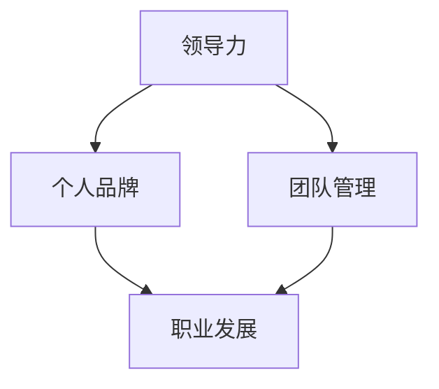
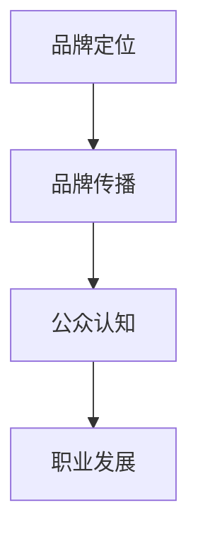
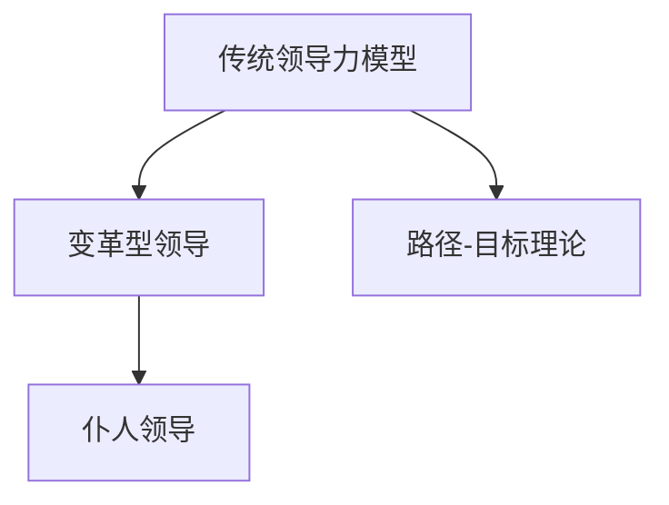
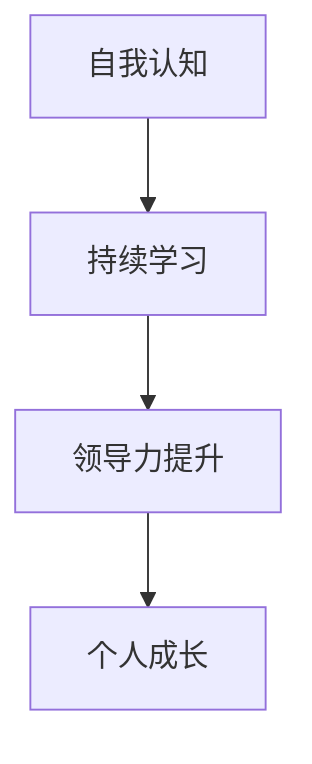
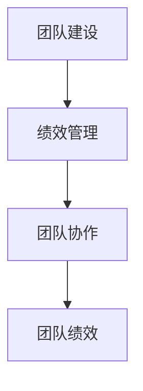
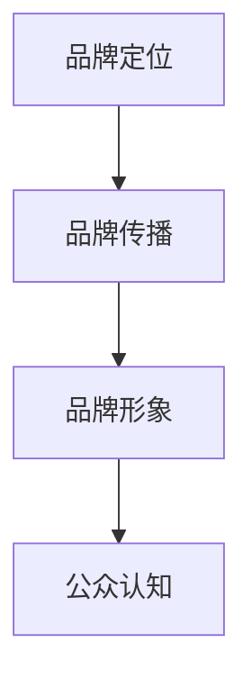
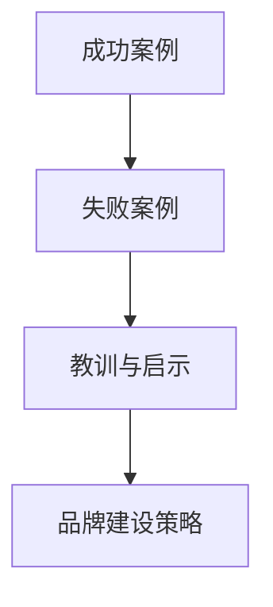
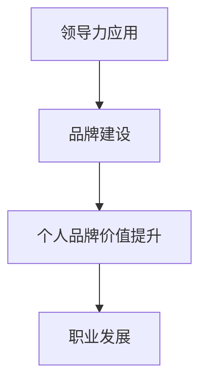
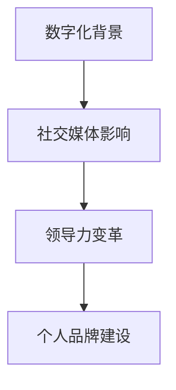
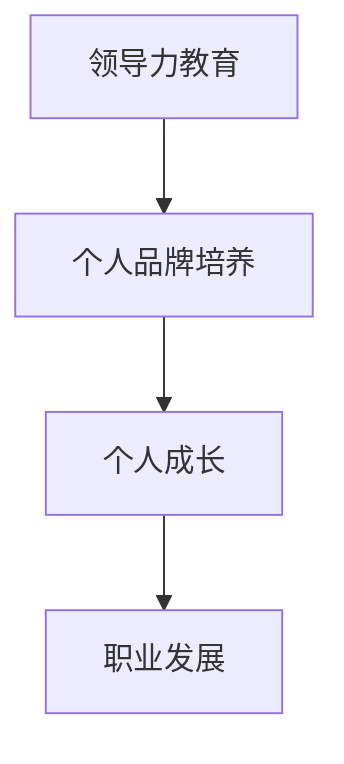

                 

### 文章标题：领导力与个人品牌：树立专业形象

关键词：领导力，个人品牌，专业形象，职业发展，团队管理，品牌建设

摘要：本文将探讨领导力与个人品牌之间的密切联系，解释如何通过树立专业形象来提升个人品牌。文章将分为四个主要部分：首先介绍领导力和个人品牌的定义及其重要性；然后深入探讨如何建立和维护个人品牌；接着分析领导力模型及其在不同情境下的应用；最后，分享一些个人品牌建设的最佳实践和注意事项。通过这些分析，我们希望能帮助读者在职业发展中树立起强大的个人品牌，提升领导力，实现职业目标。

### 第一部分：领导力基础理论

#### 第1章：领导力的定义与重要性

**背景介绍**

领导力是任何组织成功的关键因素。它不仅仅涉及如何指导和管理团队，更关乎如何激发团队成员的潜能，实现共同的目标。在科技飞速发展的今天，领导力在企业和个人职业发展中的重要性愈发凸显。

**核心概念与联系**

- **领导力（Leadership）**：指一个人在组织中，通过影响力、激励和指引，推动团队实现目标的能力。
- **个人品牌（Personal Brand）**：个人品牌是个人在职业生涯中的独特形象、声誉和价值体系的集合。

**Mermaid 流程图**



**核心算法原理讲解**

- **影响力模型**：领导力模型主要基于影响力理论，即通过建立信任、明确目标、激励员工等方式，提升个人影响力。
- **激励理论**：领导力中常用到激励理论，如赫兹伯格的双因素理论，通过满足员工的内在需求，提高工作满意度。

**数学模型和公式 & 详细讲解 & 举例说明**

- **信任度公式**：信任度 = (信任行为 + 诚信度) / (风险暴露 + 信息透明度)
  - **举例**：一位领导者在项目中始终保持透明度，并采取一系列诚信行为，从而提升了团队的信任度。

#### 第2章：个人品牌的建立与维护

**背景介绍**

个人品牌是个人在职业生涯中的重要资产，它能够帮助个人在职场中脱颖而出，获得更多的机会。建立和维护个人品牌需要系统性的规划和持续的努力。

**核心概念与联系**

- **品牌定位**：品牌定位是指个人在公众心目中的独特形象和认知。
- **品牌传播**：品牌传播是通过多种渠道传递个人品牌信息，建立公众认知。

**Mermaid 流程图**



**核心算法原理讲解**

- **品牌传播算法**：品牌传播算法涉及内容创作、渠道选择、互动管理等多个方面，通过数据分析和反馈优化，提高品牌传播效果。

**数学模型和公式 & 详细讲解 & 举例说明**

- **品牌影响力公式**：品牌影响力 = (内容质量 × 内容传播力) / (负面信息 × 频率)
  - **举例**：一位技术专家通过高质量的技术文章和积极参与技术论坛，提高了个人品牌的影响力和认可度。

#### 第3章：领导力模型解析

**背景介绍**

领导力模型是指导领导者在不同情境下运用领导力理论进行管理和决策的工具。不同的领导力模型适用于不同的组织环境和团队状况。

**核心概念与联系**

- **传统领导力模型**：如领导生命周期理论、路径-目标理论等。
- **新兴领导力模型**：如变革型领导、仆人领导等。

**Mermaid 流程图**



**核心算法原理讲解**

- **变革型领导算法**：变革型领导通过激发员工的内在动机，推动团队创新和变革。
- **仆人领导算法**：仆人领导通过关注团队成员的需求，提供支持和资源，促进团队协作。

**数学模型和公式 & 详细讲解 & 举例说明**

- **团队绩效模型**：团队绩效 = (个体绩效 + 团队协作) / (冲突管理 + 外部干扰)
  - **举例**：在一个项目团队中，通过高效的协作和有效的冲突管理，提高了团队的绩效。

#### 第4章：领导力与个人成长

**背景介绍**

个人成长是领导力的基础，领导者需要不断提升自身的能力和素质，以适应不断变化的环境和挑战。

**核心概念与联系**

- **自我认知**：自我认知是领导者了解自身优势和不足，进行自我提升的关键。
- **持续学习**：持续学习是个人成长的动力，有助于提升领导者的知识储备和创新能力。

**Mermaid 流流程图**



**核心算法原理讲解**

- **自我评估算法**：通过定期的自我评估，领导者可以识别自身的优势和改进领域。
- **学习曲线算法**：学习曲线反映了个体在不同阶段的学习速度和效果。

**数学模型和公式 & 详细讲解 & 举例说明**

- **学习速度公式**：学习速度 = (新知识吸收率 + 经验积累率) / (遗忘速度)
  - **举例**：一位领导者通过每天阅读技术书籍和参与技术论坛，加快了其学习速度。

#### 第5章：领导力在团队管理中的应用

**背景介绍**

团队管理是领导力的核心应用领域之一，领导者需要运用各种领导力理论和管理技巧，提升团队绩效和成员满意度。

**核心概念与联系**

- **团队建设**：团队建设是通过建立信任、提高协作，增强团队凝聚力。
- **绩效管理**：绩效管理是通过设定目标、评估绩效，激励团队成员。

**Mermaid 流程图**



**核心算法原理讲解**

- **团队建设算法**：团队建设算法通过组织团队建设活动，提高团队凝聚力和协作效率。
- **绩效管理算法**：绩效管理算法通过设定明确的目标和科学的评估方法，提高团队成员的工作动力。

**数学模型和公式 & 详细讲解 & 举例说明**

- **团队绩效公式**：团队绩效 = (团队目标达成率 + 成员满意度) / (冲突率 + 外部干扰)
  - **举例**：在一个开发团队中，通过设立明确的目标和定期的绩效评估，提高了团队的绩效。

### 第二部分：个人品牌建设实践

#### 第6章：个人品牌建设策略

**背景介绍**

个人品牌建设策略是提升个人品牌影响力的重要手段。有效的品牌建设策略需要考虑品牌定位、传播渠道和形象塑造等多个方面。

**核心概念与联系**

- **品牌定位**：品牌定位是确定个人在公众心中的独特形象和认知。
- **品牌传播**：品牌传播是通过多种渠道传递个人品牌信息，建立公众认知。

**Mermaid 流程图**



**核心算法原理讲解**

- **内容创作算法**：通过高质量的内容创作，提升个人品牌的认知度和影响力。
- **渠道选择算法**：根据目标受众的特点，选择最合适的传播渠道。

**数学模型和公式 & 详细讲解 & 举例说明**

- **品牌知名度公式**：品牌知名度 = (内容曝光率 + 互动参与度) / (负面信息曝光率)
  - **举例**：一位技术专家通过在多个技术平台上发布高质量的技术文章，提高了个人品牌的知名度。

#### 第7章：个人品牌案例分析

**背景介绍**

案例分析是学习和借鉴成功品牌建设经验的重要方法。本节将分析几个成功的个人品牌案例，并探讨其成功要素。

**核心概念与联系**

- **成功案例**：成功案例是指那些在个人品牌建设中取得显著成果的个人或团队。
- **失败案例**：失败案例是指那些在品牌建设中遇到挫折的个人或团队。

**Mermaid 流程图**



**核心算法原理讲解**

- **成功要素分析算法**：通过分析成功案例，提取其成功的关键因素。
- **失败原因分析算法**：通过分析失败案例，找出其失败的主要原因。

**数学模型和公式 & 详细讲解 & 举例说明**

- **成功概率公式**：成功概率 = (成功要素总和) / (总尝试次数)
  - **举例**：一位创业者在尝试了多种品牌建设策略后，通过数据分析，确定了最有效的策略。

#### 第8章：领导力与个人品牌整合实践

**背景介绍**

领导力与个人品牌的整合实践是提升个人领导力和品牌影响力的关键。领导者需要将领导力理论应用于个人品牌建设中，实现二者的有机结合。

**核心概念与联系**

- **领导力应用**：将领导力理论应用于个人品牌建设中，提升个人影响力。
- **品牌建设**：通过有效的品牌建设策略，提升个人品牌价值。

**Mermaid 流程图**



**核心算法原理讲解**

- **整合实践算法**：通过系统性的整合实践，将领导力理论应用于个人品牌建设中。
- **效果评估算法**：通过效果评估，持续优化个人品牌建设策略。

**数学模型和公式 & 详细讲解 & 举例说明**

- **品牌价值公式**：品牌价值 = (品牌知名度 + 品牌信任度) × (品牌忠诚度 + 品牌影响力)
  - **举例**：一位领导者通过有效的品牌建设策略，提升了个人品牌的价值，从而在职业发展中取得了显著成果。

### 第三部分：领导力与个人品牌未来展望

#### 第9章：领导力与个人品牌的发展趋势

**背景介绍**

随着科技的不断进步和社会的快速变化，领导力与个人品牌也在不断发展。了解这些趋势有助于我们更好地应对未来的挑战。

**核心概念与联系**

- **数字化背景**：数字化背景下，领导力和个人品牌的建设方式发生了显著变化。
- **社交媒体影响**：社交媒体对个人品牌的影响日益增大，成为品牌建设的重要渠道。

**Mermaid 流程图**



**核心算法原理讲解**

- **数字化领导力模型**：基于数据分析的领导力模型，通过数据驱动的决策，提高领导效果。
- **社交媒体品牌传播算法**：利用社交媒体平台，通过大数据分析和算法优化，提高品牌传播效果。

**数学模型和公式 & 详细讲解 & 举例说明**

- **社交媒体影响力公式**：社交媒体影响力 = (粉丝互动率 × 内容曝光率) / (负面信息率)
  - **举例**：一位技术专家通过在社交媒体上发布高质量的技术文章，提高了其社交媒体影响力。

#### 第10章：领导力与个人品牌的教育与培养

**背景介绍**

领导力与个人品牌的教育与培养是提升个人综合素质的重要途径。有效的教育与培养有助于个人在职业发展中取得更大的成就。

**核心概念与联系**

- **领导力教育**：领导力教育是通过系统性的学习和实践，提升领导者的能力和素质。
- **个人品牌培养**：个人品牌培养是通过品牌定位、品牌传播和品牌形象塑造，提升个人品牌价值。

**Mermaid 流程图**



**核心算法原理讲解**

- **领导力培养算法**：通过情景模拟、案例分析、实践操作等方式，提升领导者的实际能力。
- **品牌培养算法**：通过内容创作、渠道选择、互动管理等方式，提升个人品牌的认知度和影响力。

**数学模型和公式 & 详细讲解 & 举例说明**

- **领导力提升模型**：领导力提升模型 = (学习投入 × 实践机会) / (挑战难度 × 反馈及时性)
  - **举例**：一位领导者通过积极参与领导力培训课程和实践项目，提升了其领导力水平。

### 附录

**附录A：领导力与个人品牌工具与资源**

- **领导力评估工具**：介绍几种常用的领导力评估工具，如360度反馈、领导力问卷等。
- **个人品牌建设工具**：介绍个人品牌建设所需的各种工具，如社交媒体管理工具、内容创作工具等。
- **相关书籍与资料推荐**：推荐一些关于领导力与个人品牌的经典书籍和资料，供读者进一步学习。

### 作者信息

作者：AI天才研究院/AI Genius Institute & 禅与计算机程序设计艺术 /Zen And The Art of Computer Programming

----------------------------------------------------------------

### 文章标题：领导力与个人品牌：树立专业形象

### 关键词：领导力，个人品牌，专业形象，职业发展，团队管理，品牌建设

### 摘要

在当今快速变化的商业环境中，领导力和个人品牌已成为职业成功的关键因素。本文将探讨领导力与个人品牌之间的密切联系，解释如何通过树立专业形象来提升个人品牌。文章分为四个主要部分：首先介绍领导力和个人品牌的定义及其重要性；然后深入探讨如何建立和维护个人品牌；接着分析领导力模型及其在不同情境下的应用；最后，分享一些个人品牌建设的最佳实践和注意事项。通过这些分析，我们希望能帮助读者在职业发展中树立起强大的个人品牌，提升领导力，实现职业目标。

## 第一部分：领导力基础理论

### 第1章：领导力的定义与重要性

**背景介绍**

领导力是任何组织成功的关键因素。它不仅仅涉及如何指导和管理团队，更关乎如何激发团队成员的潜能，实现共同的目标。在科技飞速发展的今天，领导力在企业和个人职业发展中的重要性愈发凸显。

**核心概念与联系**

- **领导力（Leadership）**：指一个人在组织中，通过影响力、激励和指引，推动团队实现目标的能力。
- **个人品牌（Personal Brand）**：个人品牌是个人在职业生涯中的独特形象、声誉和价值体系的集合。

**Mermaid 流程图**


**核心算法原理讲解**

- **影响力模型**：领导力模型主要基于影响力理论，即通过建立信任、明确目标、激励员工等方式，提升个人影响力。
- **激励理论**：领导力中常用到激励理论，如赫兹伯格的双因素理论，通过满足员工的内在需求，提高工作满意度。

**数学模型和公式 & 详细讲解 & 举例说明**

- **信任度公式**：信任度 = (信任行为 + 诚信度) / (风险暴露 + 信息透明度)
  - **举例**：一位领导者在项目中始终保持透明度，并采取一系列诚信行为，从而提升了团队的信任度。

### 第2章：个人品牌的建立与维护

**背景介绍**

个人品牌是个人在职业生涯中的重要资产，它能够帮助个人在职场中脱颖而出，获得更多的机会。建立和维护个人品牌需要系统性的规划和持续的努力。

**核心概念与联系**

- **品牌定位**：品牌定位是指个人在公众心目中的独特形象和认知。
- **品牌传播**：品牌传播是通过多种渠道传递个人品牌信息，建立公众认知。

**Mermaid 流程图**


**核心算法原理讲解**

- **品牌传播算法**：品牌传播算法涉及内容创作、渠道选择、互动管理等多个方面，通过数据分析和反馈优化，提高品牌传播效果。

**数学模型和公式 & 详细讲解 & 举例说明**

- **品牌影响力公式**：品牌影响力 = (内容质量 × 内容传播力) / (负面信息 × 频率)
  - **举例**：一位技术专家通过高质量的技术文章和积极参与技术论坛，提高了个人品牌的影响力和认可度。

### 第3章：领导力模型解析

**背景介绍**

领导力模型是指导领导者在不同情境下运用领导力理论进行管理和决策的工具。不同的领导力模型适用于不同的组织环境和团队状况。

**核心概念与联系**

- **传统领导力模型**：如领导生命周期理论、路径-目标理论等。
- **新兴领导力模型**：如变革型领导、仆人领导等。

**Mermaid 流程图**


**核心算法原理讲解**

- **变革型领导算法**：变革型领导通过激发员工的内在动机，推动团队创新和变革。
- **仆人领导算法**：仆人领导通过关注团队成员的需求，提供支持和资源，促进团队协作。

**数学模型和公式 & 详细讲解 & 举例说明**

- **团队绩效模型**：团队绩效 = (个体绩效 + 团队协作) / (冲突管理 + 外部干扰)
  - **举例**：在一个项目团队中，通过高效的协作和有效的冲突管理，提高了团队的绩效。

### 第4章：领导力与个人成长

**背景介绍**

个人成长是领导力的基础，领导者需要不断提升自身的能力和素质，以适应不断变化的环境和挑战。

**核心概念与联系**

- **自我认知**：自我认知是领导者了解自身优势和不足，进行自我提升的关键。
- **持续学习**：持续学习是个人成长的动力，有助于提升领导者的知识储备和创新能力。

**Mermaid 流程图**


**核心算法原理讲解**

- **自我评估算法**：通过定期的自我评估，领导者可以识别自身的优势和改进领域。
- **学习曲线算法**：学习曲线反映了个体在不同阶段的学习速度和效果。

**数学模型和公式 & 详细讲解 & 举例说明**

- **学习速度公式**：学习速度 = (新知识吸收率 + 经验积累率) / (遗忘速度)
  - **举例**：一位领导者通过每天阅读技术书籍和参与技术论坛，加快了其学习速度。

### 第5章：领导力在团队管理中的应用

**背景介绍**

团队管理是领导力的核心应用领域之一，领导者需要运用各种领导力理论和管理技巧，提升团队绩效和成员满意度。

**核心概念与联系**

- **团队建设**：团队建设是通过建立信任、提高协作，增强团队凝聚力。
- **绩效管理**：绩效管理是通过设定目标、评估绩效，激励团队成员。

**Mermaid 流程图**


**核心算法原理讲解**

- **团队建设算法**：团队建设算法通过组织团队建设活动，提高团队凝聚力和协作效率。
- **绩效管理算法**：绩效管理算法通过设定明确的目标和科学的评估方法，提高团队成员的工作动力。

**数学模型和公式 & 详细讲解 & 举例说明**

- **团队绩效公式**：团队绩效 = (团队目标达成率 + 成员满意度) / (冲突率 + 外部干扰)
  - **举例**：在一个开发团队中，通过设立明确的目标和定期的绩效评估，提高了团队的绩效。

## 第二部分：个人品牌建设实践

### 第6章：个人品牌建设策略

**背景介绍**

个人品牌建设策略是提升个人品牌影响力的重要手段。有效的品牌建设策略需要考虑品牌定位、传播渠道和形象塑造等多个方面。

**核心概念与联系**

- **品牌定位**：品牌定位是确定个人在公众心中的独特形象和认知。
- **品牌传播**：品牌传播是通过多种渠道传递个人品牌信息，建立公众认知。

**Mermaid 流程图**


**核心算法原理讲解**

- **内容创作算法**：通过高质量的内容创作，提升个人品牌的认知度和影响力。
- **渠道选择算法**：根据目标受众的特点，选择最合适的传播渠道。

**数学模型和公式 & 详细讲解 & 举例说明**

- **品牌知名度公式**：品牌知名度 = (内容曝光率 + 互动参与度) / (负面信息曝光率)
  - **举例**：一位技术专家通过在多个技术平台上发布高质量的技术文章，提高了个人品牌的知名度。

### 第7章：个人品牌案例分析

**背景介绍**

案例分析是学习和借鉴成功品牌建设经验的重要方法。本节将分析几个成功的个人品牌案例，并探讨其成功要素。

**核心概念与联系**

- **成功案例**：成功案例是指那些在个人品牌建设中取得显著成果的个人或团队。
- **失败案例**：失败案例是指那些在品牌建设中遇到挫折的个人或团队。

**Mermaid 流程图**


**核心算法原理讲解**

- **成功要素分析算法**：通过分析成功案例，提取其成功的关键因素。
- **失败原因分析算法**：通过分析失败案例，找出其失败的主要原因。

**数学模型和公式 & 详细讲解 & 举例说明**

- **成功概率公式**：成功概率 = (成功要素总和) / (总尝试次数)
  - **举例**：一位创业者在尝试了多种品牌建设策略后，通过数据分析，确定了最有效的策略。

### 第8章：领导力与个人品牌整合实践

**背景介绍**

领导力与个人品牌的整合实践是提升个人领导力和品牌影响力的关键。领导者需要将领导力理论应用于个人品牌建设中，实现二者的有机结合。

**核心概念与联系**

- **领导力应用**：将领导力理论应用于个人品牌建设中，提升个人影响力。
- **品牌建设**：通过有效的品牌建设策略，提升个人品牌价值。

**Mermaid 流程图**


**核心算法原理讲解**

- **整合实践算法**：通过系统性的整合实践，将领导力理论应用于个人品牌建设中。
- **效果评估算法**：通过效果评估，持续优化个人品牌建设策略。

**数学模型和公式 & 详细讲解 & 举例说明**

- **品牌价值公式**：品牌价值 = (品牌知名度 + 品牌信任度) × (品牌忠诚度 + 品牌影响力)
  - **举例**：一位领导者通过有效的品牌建设策略，提升了个人品牌的价值，从而在职业发展中取得了显著成果。

## 第三部分：领导力与个人品牌未来展望

### 第9章：领导力与个人品牌的发展趋势

**背景介绍**

随着科技的不断进步和社会的快速变化，领导力与个人品牌也在不断发展。了解这些趋势有助于我们更好地应对未来的挑战。

**核心概念与联系**

- **数字化背景**：数字化背景下，领导力和个人品牌的建设方式发生了显著变化。
- **社交媒体影响**：社交媒体对个人品牌的影响日益增大，成为品牌建设的重要渠道。

**Mermaid 流程图**


**核心算法原理讲解**

- **数字化领导力模型**：基于数据分析的领导力模型，通过数据驱动的决策，提高领导效果。
- **社交媒体品牌传播算法**：利用社交媒体平台，通过大数据分析和算法优化，提高品牌传播效果。

**数学模型和公式 & 详细讲解 & 举例说明**

- **社交媒体影响力公式**：社交媒体影响力 = (粉丝互动率 × 内容曝光率) / (负面信息率)
  - **举例**：一位技术专家通过在社交媒体上发布高质量的技术文章，提高了其社交媒体影响力。

### 第10章：领导力与个人品牌的教育与培养

**背景介绍**

领导力与个人品牌的教育与培养是提升个人综合素质的重要途径。有效的教育与培养有助于个人在职业发展中取得更大的成就。

**核心概念与联系**

- **领导力教育**：领导力教育是通过系统性的学习和实践，提升领导者的能力和素质。
- **个人品牌培养**：个人品牌培养是通过品牌定位、品牌传播和品牌形象塑造，提升个人品牌价值。

**Mermaid 流程图**


**核心算法原理讲解**

- **领导力培养算法**：通过情景模拟、案例分析、实践操作等方式，提升领导者的实际能力。
- **品牌培养算法**：通过内容创作、渠道选择、互动管理等方式，提升个人品牌的认知度和影响力。

**数学模型和公式 & 详细讲解 & 举例说明**

- **领导力提升模型**：领导力提升模型 = (学习投入 × 实践机会) / (挑战难度 × 反馈及时性)
  - **举例**：一位领导者通过积极参与领导力培训课程和实践项目，提升了其领导力水平。

## 附录

### 附录A：领导力与个人品牌工具与资源

**附录A：领导力与个人品牌工具与资源**

- **领导力评估工具**：介绍几种常用的领导力评估工具，如360度反馈、领导力问卷等。
- **个人品牌建设工具**：介绍个人品牌建设所需的各种工具，如社交媒体管理工具、内容创作工具等。
- **相关书籍与资料推荐**：推荐一些关于领导力与个人品牌的经典书籍和资料，供读者进一步学习。

### 作者信息

作者：AI天才研究院/AI Genius Institute & 禅与计算机程序设计艺术 /Zen And The Art of Computer Programming

----------------------------------------------------------------

### 《领导力与个人品牌：树立专业形象》

### 目录大纲

```
# 《领导力与个人品牌：树立专业形象》

## 引言

### 1. 领导力的定义与重要性

#### 1.1 领导力的基本概念

#### 1.2 领导力的重要性

#### 1.3 领导力与个人品牌的关系

## 第1部分：领导力基础理论

### 第1章：领导力的定义与重要性

#### 1.1 领导力的基本概念

#### 1.2 领导力的重要性

#### 1.3 领导力与个人品牌的关系

### 第2章：个人品牌的建立与维护

#### 2.1 品牌定位与目标受众

#### 2.2 个人品牌的视觉与语言传达

#### 2.3 品牌声誉管理

### 第3章：领导力模型解析

#### 3.1 传统领导力模型

#### 3.2 新兴领导力模型

#### 3.3 领导力模型的适用性分析

### 第4章：领导力与个人成长

#### 4.1 领导力的自我认知

#### 4.2 个人成长与领导力提升

#### 4.3 领导力发展的障碍与克服

### 第5章：领导力在团队管理中的应用

#### 5.1 团队建设与管理

#### 5.2 冲突管理与解决

#### 5.3 团队绩效评估与激励

## 第2部分：个人品牌建设实践

### 第6章：个人品牌建设策略

#### 6.1 品牌故事构建

#### 6.2 个人品牌传播渠道

#### 6.3 个人品牌形象塑造

### 第7章：个人品牌案例分析

#### 7.1 成功的个人品牌案例

#### 7.2 失败的个人品牌案例

#### 7.3 案例启示与经验分享

### 第8章：领导力与个人品牌整合实践

#### 8.1 领导力在个人品牌建设中的作用

#### 8.2 个人品牌助力领导力提升

#### 8.3 领导力与个人品牌整合策略

## 第3部分：领导力与个人品牌未来展望

### 第9章：领导力与个人品牌的发展趋势

#### 9.1 数字化背景下的领导力变革

#### 9.2 社交媒体对个人品牌的影响

#### 9.3 未来领导力与个人品牌的发展方向

### 第10章：领导力与个人品牌的教育与培养

#### 10.1 领导力与个人品牌教育的重要性

#### 10.2 领导力与个人品牌培养的方法

#### 10.3 教育与培养的未来挑战与机遇

## 结论

### 1. 领导力与个人品牌的综合作用

#### 1.1 领导力在个人品牌建设中的应用

#### 1.2 个人品牌对领导力的促进作用

#### 1.3 二者共同推动职业发展的路径

## 附录

### 附录A：领导力与个人品牌工具与资源

#### A.1 领导力评估工具

#### A.2 个人品牌建设工具

#### A.3 相关书籍与资料推荐

```

### 结论

在本文中，我们深入探讨了领导力与个人品牌之间的紧密联系，并详细阐述了如何通过树立专业形象来提升个人品牌。首先，我们介绍了领导力的基本概念和重要性，以及个人品牌在职业生涯中的作用。接着，我们分析了如何建立和维护个人品牌，并解析了不同类型的领导力模型。在实践部分，我们讨论了个人品牌建设策略和案例分析，以及如何整合领导力与个人品牌。最后，我们展望了领导力和个人品牌的发展趋势，并提出了教育与培养的方法。

通过本文，我们希望读者能够认识到领导力和个人品牌在职业发展中的重要性，掌握树立专业形象的技巧，并在实际工作中不断提升自己的领导力和个人品牌价值。只有通过不断学习和实践，才能在激烈的职场竞争中脱颖而出，实现职业目标。

### 附录

**附录A：领导力与个人品牌工具与资源**

为了帮助读者深入了解和掌握领导力与个人品牌的相关知识，我们推荐以下工具和资源：

#### A.1 领导力评估工具

1. **360度反馈**：这是一种评估方法，通过收集同事、下属和上级的意见，全面评估领导者的表现。
2. **领导力问卷**：通过在线问卷或纸质问卷的形式，评估领导者的各项能力和素质。

#### A.2 个人品牌建设工具

1. **社交媒体平台**：如LinkedIn、Twitter、Instagram等，可以帮助个人品牌传播和建立网络。
2. **内容创作工具**：如WordPress、Medium、Squarespace等，用于创建和维护个人网站或博客。

#### A.3 相关书籍与资料推荐

1. **《领导力的五项修炼》**：作者史蒂芬·柯维，详细介绍了领导力的核心要素和提升方法。
2. **《个人品牌》**：作者汤姆·彼得斯，探讨如何打造个人品牌，提升职业形象。
3. **《社交网络的力量》**：作者杰西·史塔尔斯，介绍社交媒体在个人品牌建设中的作用。

通过使用这些工具和资源，读者可以更深入地了解领导力与个人品牌的相关知识，并在实践中不断提升自己的领导力和个人品牌价值。

