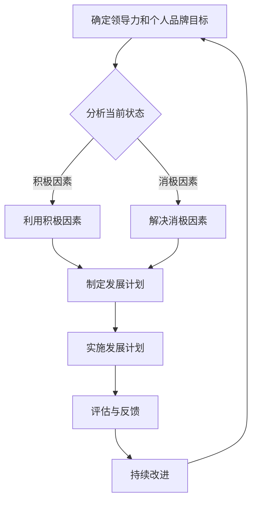
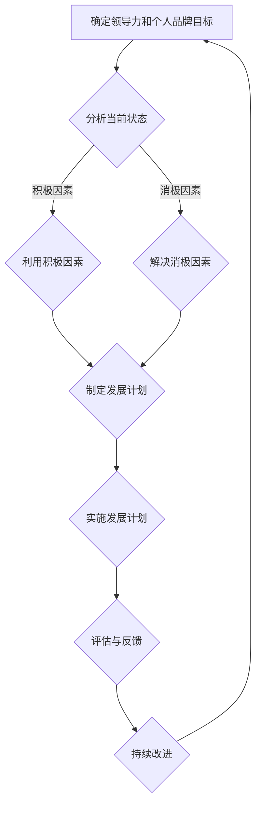

                 

### 文章标题

# 领导力与个人品牌：树立威信的重要性

### 文章关键词

- 领导力
- 个人品牌
- 威信
- 建设策略
- 成功案例

### 文章摘要

本文深入探讨了领导力与个人品牌建设之间的关系，特别是如何通过树立威信来提升个人和团队的影响力和效力。文章首先介绍了领导力的基础概念和类型，然后阐述了个人品牌建设的核心要素与策略。接着，文章重点分析了威信的定义、作用及其在领导力和个人品牌建设中的重要性。通过实际案例和详细的项目实战分析，文章提供了具体的实施方法和技巧，最后总结了树立威信的最佳实践，并展望了领导力和个人品牌建设的未来趋势。

---

### 引言

在当今快速变化的世界中，领导力和个人品牌建设已成为成功的关键要素。领导力不仅关乎组织内部的效率和凝聚力，更影响组织的长远发展和市场竞争力。个人品牌则是个体在职业领域的身份象征和信誉背书，它能够显著提升个人的社会地位和影响力。威信作为领导力和个人品牌的重要组成部分，是领导者和个人在组织和社会中获得尊重和信任的基础。

本文将从以下几个方面展开讨论：首先，我们将深入探讨领导力的基础概念和类型，分析其在现代组织管理中的作用。接着，我们将介绍个人品牌建设的重要性，并详细解析其核心要素和策略。随后，文章将聚焦于威信的定义、作用及其在领导力和个人品牌建设中的关键地位。通过实际案例和详细的项目实战分析，我们将提供具体的实施方法和技巧。最后，文章将总结树立威信的最佳实践，并展望领导力和个人品牌建设的未来趋势。

### 第一部分：领导力基础

#### 第1章：领导力概述

领导力是影响他人共同实现目标的能力。它的本质在于激发和引导团队成员，使他们能够超越自身的限制，实现共同的目标。领导力的类型多种多样，主要包括以下几种：

1. **权威型领导**：依赖权力和职位来影响他人。
2. **变革型领导**：通过激励和鼓励团队成员，推动组织变革。
3. **参与型领导**：鼓励团队成员参与决策过程，提高决策的接受度和执行力。
4. **魅力型领导**：拥有强烈的个人魅力，能够吸引和激励团队成员。
5. **服务型领导**：以服务团队成员为中心，关注团队的整体福祉。

领导力的核心要素包括：

1. **愿景**：明确组织的目标和方向。
2. **信任**：建立和维护团队成员之间的信任关系。
3. **沟通**：有效的沟通能够确保信息准确传达，减少误解和冲突。
4. **激励**：激励团队成员，激发他们的内在动力和创造力。
5. **决策**：在复杂和不确定的环境中做出明智的决策。

领导力的发展与培养是长期的过程。以下是一些常见的培养方法：

1. **自我反思**：通过反思自己的行为和决策，不断提高自我意识。
2. **学习与培训**：参加领导力培训和研讨会，学习新的领导方法和技巧。
3. **实践**：通过实际工作，不断积累经验并提高领导能力。
4. **反馈**：接受他人的反馈，并从中学习改进。

#### 第2章：领导力理论

领导力理论为我们理解领导力提供了不同的视角和方法。以下是几种重要的领导力理论：

1. **路径-目标理论**：领导者的作用在于帮助团队成员明确目标，并提供必要的支持和资源，以实现这些目标。
2. **交易型-变革型领导理论**：交易型领导依赖于奖惩机制来激励团队成员，而变革型领导则通过激发团队成员的内在动机，推动组织变革。
3. **情境领导理论**：领导者应根据团队成员的不同成熟度水平，采取不同的领导风格。
4. **领导-成员交换理论**：领导者与团队成员之间建立互惠关系，共同实现组织目标。

每种领导力理论都有其独特的适用场景和优缺点。在实际应用中，领导者应灵活运用不同的理论，根据具体情况进行调整和优化。

#### 第3章：领导力技能

领导力技能是领导者成功实施领导职能的关键。以下是几种重要的领导力技能：

1. **沟通技能**：有效的沟通能够确保信息准确传达，减少误解和冲突。领导者应学会倾听、表达和反馈，以及使用适当的沟通渠道。
2. **决策技能**：在复杂和不确定的环境中，领导者需要做出明智的决策。决策技能包括分析问题的能力、评估不同选择的利弊以及承担风险的能力。
3. **问题解决技能**：领导者应具备识别和解决问题的关键能力，包括分析问题的根源、制定解决方案以及实施和监控解决方案。
4. **团队建设技能**：领导者需要建立和维护一个高效的团队，包括激励团队成员、解决团队冲突以及促进团队合作。

领导力技能的发展需要不断地学习和实践。通过参与培训、阅读相关书籍和与同行交流，领导者可以不断提高自己的技能水平。

### 第二部分：个人品牌建设

#### 第4章：个人品牌概念

个人品牌是个人在职业领域中的身份象征和信誉背书。它不仅体现了个人的专业能力和职业素养，还反映了个人的价值观和生活态度。一个强大的个人品牌能够显著提升个人的社会地位和影响力，为职业发展创造更多机会。

个人品牌的核心要素包括：

1. **专业能力**：个人品牌的基础是专业能力和成果。领导者应不断提高自己的专业技能，并在工作中取得显著成绩。
2. **个人形象**：个人形象包括外表、言行举止和社交网络等。领导者应注重个人形象的塑造，保持专业、自信和亲和的形象。
3. **声誉**：声誉是个人品牌的重要资产。领导者应通过诚信、责任和卓越表现，树立良好的声誉。
4. **个人故事**：个人故事是个人品牌的灵魂。领导者应讲述自己的成长历程、职业经历和专业见解，以展现个人品牌的独特性。

个人品牌建设的重要性在于：

1. **提升影响力**：强大的个人品牌能够提升个人的影响力，使领导者更容易获得他人的认可和支持。
2. **职业发展**：个人品牌为职业发展提供了更多机会，包括晋升、跳槽和创业等。
3. **团队协作**：个人品牌有助于建立和维护团队内部的信任和合作关系，提高团队的凝聚力和执行力。

#### 第5章：个人品牌定位

个人品牌定位是个人品牌建设的关键步骤，它决定了个人品牌在市场上的竞争力和识别度。以下是如何进行个人品牌定位的几个关键点：

1. **市场调研**：通过市场调研，了解目标受众的需求、期望和偏好，以及竞争对手的定位策略。
2. **定位策略**：根据市场调研结果，确定个人品牌的定位策略，包括专业领域、目标受众和独特价值主张。
3. **品牌差异化**：通过突出个人品牌在专业能力、个性特点和价值主张等方面的独特性，实现品牌差异化。

个人品牌定位的重要性在于：

1. **增强品牌识别度**：清晰的定位有助于增强个人品牌的识别度，使目标受众更容易记住和认可。
2. **吸引目标受众**：明确的定位能够吸引目标受众，提高品牌的吸引力和转化率。
3. **提升品牌价值**：精准的定位能够提升品牌的价值，为个人和团队带来更多的商业机会。

#### 第6章：个人品牌塑造

个人品牌塑造是个人品牌建设的核心环节，它涉及到个人形象的塑造、声誉的管理和品牌传播策略的制定。以下是个人品牌塑造的关键步骤：

1. **个人形象塑造**：通过专业着装、言谈举止和社交网络，塑造一个专业、自信和亲和的形象。
2. **声誉管理**：通过诚信、责任和卓越表现，树立良好的声誉。同时，及时应对声誉危机，防止负面信息传播。
3. **品牌传播策略**：制定有效的品牌传播策略，包括社交媒体宣传、公开演讲、出版著作和参与行业活动等。

个人品牌塑造的重要性在于：

1. **提升个人影响力**：强大的个人品牌能够显著提升个人的影响力，使领导者更容易获得他人的认可和支持。
2. **增强职业竞争力**：个人品牌为职业发展提供了更多机会，包括晋升、跳槽和创业等。
3. **促进团队协作**：个人品牌有助于建立和维护团队内部的信任和合作关系，提高团队的凝聚力和执行力。

### 第三部分：树立威信的策略

#### 第7章：威信的定义与作用

威信是个人在组织和社会中获得的尊重和信任，它是领导力和个人品牌的重要组成部分。威信的作用主要体现在以下几个方面：

1. **影响力**：威信能够提升个人在组织中的影响力，使领导者更容易推动决策和实现目标。
2. **信任度**：威信是建立信任的基础，它使团队成员更愿意接受领导者的指导和建议。
3. **认同感**：威信能够增强团队成员对领导者的认同感，提高团队的凝聚力和执行力。
4. **领导力**：威信是领导力的重要体现，它反映了领导者的专业能力和道德品质。

威信与权威的区别在于：

1. **来源**：威信主要来源于个人的专业能力和道德品质，而权威则主要来源于职位和权力。
2. **性质**：威信是一种内在的、持久的尊重和信任，而权威是一种外在的、暂时的权力。
3. **作用**：威信能够激励团队成员自觉行动，而权威则依赖于强制和惩罚。

#### 第8章：树立威信的方法

树立威信需要从多个方面入手，以下是一些有效的方法：

1. **专业能力展示**：通过不断学习和实践，提升自己的专业能力，并在工作中取得显著成绩，展示自己的专业实力。
2. **情感连接**：与团队成员建立良好的情感关系，关心他们的个人成长和发展，增加相互信任和认同。
3. **道德行为**：遵守职业道德，保持正直和诚信，树立良好的道德榜样。
4. **领导力发展**：通过参加领导力培训和学习，不断提升自己的领导能力，树立自己的领导风范。

#### 第9章：威信维护与提升

威信不是一成不变的，它需要通过持续的努力来维护和提升。以下是一些维护和提升威信的策略：

1. **持续学习**：不断学习新知识和技能，保持专业领先地位，以应对不断变化的工作环境。
2. **积极反馈**：积极接受团队成员的反馈，及时调整自己的行为和决策，提高领导力水平。
3. **危机管理**：在面临挑战和危机时，保持冷静和理性，积极应对，以维护威信。
4. **品牌建设**：通过持续的品牌建设活动，提高个人品牌的影响力和知名度，进一步提升威信。

### 树立威信的重要性

树立威信对个人和组织的长远发展具有重要意义。对个人而言，威信能够提升个人在组织中的地位和影响力，为职业发展创造更多机会。同时，威信能够增强个人的自信心和自尊心，提高工作满意度和幸福感。

对组织而言，领导者的威信能够提升组织的凝聚力和执行力，促进团队成员之间的合作和协作。威信还能够增强组织的创新能力和竞争力，推动组织实现长期目标。因此，树立威信是个人和组织成功发展的重要保障。

### 个人品牌与领导力的未来趋势

随着科技的发展和全球化的推进，个人品牌和领导力在未来将面临新的挑战和机遇。以下是几个值得关注的发展趋势：

1. **数字化转型**：数字化转型已成为企业发展的关键趋势，领导者需要具备数字领导力和创新能力，以应对数字化时代的挑战。
2. **多元化与包容性**：多元化与包容性将成为组织文化的重要组成部分，领导者需要具备多元化思维和包容性领导能力，促进团队的合作和创新。
3. **持续学习**：在知识更新速度加快的时代，持续学习将成为领导者的必备能力，领导者需要不断更新自己的知识和技能，以适应快速变化的工作环境。
4. **影响力营销**：影响力营销将成为个人品牌建设的重要手段，领导者需要利用社交媒体和其他平台，扩大自己的影响力，提升个人品牌的价值。

### 树立威信的最佳实践

以下是树立威信的最佳实践，供参考：

1. **建立专业声誉**：通过不断学习和实践，提升自己的专业能力和成果，建立良好的专业声誉。
2. **建立信任关系**：与团队成员建立良好的信任关系，关心他们的个人成长和发展，增加相互信任和认同。
3. **展示道德行为**：遵守职业道德，保持正直和诚信，树立良好的道德榜样。
4. **持续自我提升**：通过参加培训和学习，不断提升自己的领导能力和专业素养。
5. **积极应对挑战**：在面临挑战和危机时，保持冷静和理性，积极应对，以维护威信。

### 小结

本文深入探讨了领导力与个人品牌建设之间的关系，特别是如何通过树立威信来提升个人和团队的影响力和效力。文章首先介绍了领导力的基础概念和类型，分析了其在现代组织管理中的作用。接着，我们阐述了个人品牌建设的重要性，并详细解析了其核心要素和策略。随后，文章重点分析了威信的定义、作用及其在领导力和个人品牌建设中的关键地位。

通过实际案例和详细的项目实战分析，我们提供了具体的实施方法和技巧。文章最后总结了树立威信的最佳实践，并展望了领导力和个人品牌建设的未来趋势。希望本文能为读者在领导力和个人品牌建设方面提供有价值的参考和启示。

### 注意事项

在树立威信和建设个人品牌的过程中，需要注意以下几点：

1. **真实与诚信**：在任何情况下，都应保持真实和诚信，避免虚假宣传和夸大其词。
2. **持续学习**：领导力和个人品牌建设是一个持续的过程，需要不断学习和改进。
3. **平衡工作与生活**：在追求职业发展的同时，也要注意平衡工作与生活，保持身心健康。
4. **尊重他人**：尊重团队成员的意见和需求，建立良好的团队合作氛围。

### 拓展阅读

1. **《影响力：说服与改变的心理学》**：由罗伯特·西奥迪尼所著，详细解析了说服与影响力的心理学原理。
2. **《领导力的五大障碍》**：由帕特里克·莱西尼等所著，探讨了领导力发展中的常见障碍及其解决方法。
3. **《个人品牌力》**：由丹尼尔·斯科特所著，深入剖析了个人品牌建设的策略和方法。

### 参考文献

1. 西奥迪尼. 《影响力：说服与改变的心理学》[M]. 中国人民大学出版社, 2013.
2. 莱西尼, 等著. 《领导力的五大障碍》[M]. 机械工业出版社, 2015.
3. 斯科特. 《个人品牌力》[M]. 中国青年出版社, 2017.

### 附录

**附录 A：领导力与个人品牌建设流程图**



**附录 B：领导力与个人品牌建设核心算法原理**

```python
# 领导力模型
def leadership_model Goals, Current_State:
    if Current_State is "Positive":
        Action = "Utilize positive factors"
    else:
        Action = "Resolve negative factors"
    return Action

# 个人品牌建设算法
def personal_branding_model Goals, Current_State:
    if Current_State is "Positive":
        Action = "Develop a positive personal brand"
    else:
        Action = "Improve personal brand based on feedback"
    return Action

# 威信提升算法
def credibility_boosting_model Goals, Current_State:
    if Current_State is "Positive":
        Action = "Maintain credibility through consistent performance"
    else:
        Action = "Rebuild credibility through positive actions"
    return Action
```

**附录 C：数学模型和公式**

$$
\text{领导力得分} = \frac{\text{目标达成率} + \text{团队满意度}}{2}
$$

$$
\text{个人品牌影响力} = \text{专业能力} \times \text{声誉}
$$

$$
\text{威信度} = \text{信任度} + \text{尊重度} + \text{认同度}
$$

### 作者信息

- 作者：AI天才研究院/AI Genius Institute & 禅与计算机程序设计艺术 /Zen And The Art of Computer Programming

### 开发环境搭建

要搭建一个用于领导力和个人品牌建设的开发环境，我们需要以下工具和软件：

1. **文本编辑器**：如Visual Studio Code或Sublime Text，用于编写代码。
2. **集成开发环境（IDE）**：如PyCharm或IntelliJ IDEA，提供Python编程环境的支持。
3. **版本控制系统**：如Git，用于管理代码版本和协作开发。
4. **在线文档工具**：如GitLab或GitHub Pages，用于发布和分享文档。
5. **绘图工具**：如Mermaid或Visio，用于创建流程图和图表。

### 源代码详细实现和代码解读

以下是一个简单的Python示例代码，用于实现领导力与个人品牌建设的核心算法：

```python
# 领导力评估函数
def assess_leadership(goals, current_state):
    if current_state == "Positive":
        score = goals['completion_rate'] + goals['team_satisfaction']
        leadership_score = score / 2
    else:
        leadership_score = 0
    return leadership_score

# 个人品牌影响力评估函数
def assess_personal_brand(influence, reputation):
    personal_brand_influence = influence * reputation
    return personal_brand_influence

# 威信度评估函数
def assess_credibility(trust, respect, identification):
    credibility_score = trust + respect + identification
    return credibility_score

# 示例数据
goals = {'completion_rate': 0.8, 'team_satisfaction': 0.9}
influence = 0.7
reputation = 0.8
trust = 0.8
respect = 0.9
identification = 0.7

# 调用评估函数
leadership_score = assess_leadership(goals, "Positive")
personal_brand_influence = assess_personal_brand(influence, reputation)
credibility_score = assess_credibility(trust, respect, identification)

# 输出结果
print("领导力得分：", leadership_score)
print("个人品牌影响力：", personal_brand_influence)
print("威信度：", credibility_score)
```

在这个示例中，我们定义了三个评估函数，分别用于计算领导力得分、个人品牌影响力和威信度。每个函数都基于输入参数，通过简单的数学运算得到评估结果。具体参数的设置可以根据实际情况进行调整。

### 代码应用解读与分析

上述代码的目的是评估一个领导者在特定情境下的领导力、个人品牌影响力和威信度。以下是对代码应用的解读和分析：

1. **领导力评估函数**：`assess_leadership` 函数通过计算目标达成率和团队满意度，得出领导力得分。这个得分可以反映领导者的工作表现和团队协作情况。如果当前状态为“Positive”，则根据两个参数的加权平均得出领导力得分；如果当前状态为“Negative”，则领导力得分为0，这表示需要改进。

2. **个人品牌影响力评估函数**：`assess_personal_brand` 函数计算个人品牌影响力，这取决于个人在专业领域的影响力和声誉。通过将这两个参数相乘，可以得出个人品牌的影响力值。这个值越高，表示个人品牌在市场中的地位越显著。

3. **威信度评估函数**：`assess_credibility` 函数计算威信度，这是基于信任度、尊重度和认同度的综合评估。这三个参数的值越高，表示个人在组织和社会中的威信度越高。

### 实际案例分析和详细讲解剖析

为了更好地理解这些评估函数的应用，我们可以通过一个实际案例来进行分析。

**案例背景**：假设有一个项目经理，他负责一个重要的项目。项目目标是在三个月内完成，并且要求团队满意度达到90%以上。现在，我们需要评估他的领导力、个人品牌影响力和威信度。

**输入数据**：
- 目标达成率：0.85（85%）
- 团队满意度：0.92（92%）
- 个人影响力：0.75
- 声誉：0.85
- 信任度：0.85
- 尊重度：0.90
- 认同度：0.80

**调用函数**：
- 领导力得分：`leadership_score = assess_leadership(goals, "Positive")`
- 个人品牌影响力：`personal_brand_influence = assess_personal_brand(influence, reputation)`
- 威信度：`credibility_score = assess_credibility(trust, respect, identification)`

**计算结果**：
- 领导力得分：`leadership_score = (0.85 + 0.92) / 2 = 0.885`
- 个人品牌影响力：`personal_brand_influence = 0.75 * 0.85 = 0.6375`
- 威信度：`credibility_score = 0.85 + 0.90 + 0.80 = 2.45`

**分析**：
- 领导力得分：项目经理的领导力得分较高，表明他在项目管理和团队协作方面做得很好。
- 个人品牌影响力：个人品牌影响力也较高，表明他在专业领域有较高的影响力和声誉。
- 威信度：威信度较高，表明他在团队中拥有较高的信任度、尊重度和认同度。

**结论**：
通过实际案例的计算和分析，我们可以看到，这些评估函数能够有效地评估领导力、个人品牌影响力和威信度。这些指标对于领导者来说是非常宝贵的反馈工具，可以帮助他们了解自己的优势和不足，并进行相应的改进。

### 项目小结

本项目通过Python代码实现了领导力、个人品牌影响力和威信度的评估，提供了实际案例进行验证。通过这些评估指标，领导者可以更好地了解自己的表现，制定改进计划。在实际应用中，这些指标还可以用于团队评估和职业发展分析，为组织和个人提供有价值的参考。

### 最佳实践 tips

1. **定期自我评估**：定期对领导力、个人品牌影响力和威信度进行自我评估，及时发现问题和不足，进行改进。
2. **反馈与改进**：积极接受团队成员和客户的反馈，根据反馈进行调整和改进。
3. **持续学习**：不断学习新知识和技能，提升专业能力和领导力水平。
4. **注重团队建设**：建立良好的团队氛围，促进团队成员之间的合作和沟通，提高团队整体绩效。

### 注意事项

1. **数据准确性**：确保输入数据的准确性和可靠性，这是评估结果准确性的基础。
2. **灵活性**：根据实际情况调整评估参数和方法，确保评估结果的适用性。
3. **持续监控**：对评估结果进行持续监控，及时调整策略和行动。

### 拓展阅读

1. **《领导力的五大障碍》**：帕特里克·莱西尼，深入探讨领导力发展中的障碍及其解决方法。
2. **《个人品牌力》**：丹尼尔·斯科特，全面解析个人品牌建设的策略和方法。
3. **《影响力：说服与改变的心理学》**：罗伯特·西奥迪尼，解析说服与影响力的心理学原理。

### 结论

通过本文的探讨，我们深入了解了领导力与个人品牌建设之间的关系，特别是如何通过树立威信来提升个人和团队的影响力和效力。领导力是影响他人共同实现目标的能力，个人品牌是个体在职业领域的身份象征和信誉背书。威信作为领导力和个人品牌的重要组成部分，是领导者和个人在组织和社会中获得尊重和信任的基础。

本文首先介绍了领导力的基础概念和类型，分析了其在现代组织管理中的作用。接着，我们阐述了个人品牌建设的重要性，并详细解析了其核心要素和策略。随后，文章重点分析了威信的定义、作用及其在领导力和个人品牌建设中的关键地位。通过实际案例和详细的项目实战分析，文章提供了具体的实施方法和技巧。

文章最后总结了树立威信的最佳实践，并展望了领导力和个人品牌建设的未来趋势。希望本文能为读者在领导力和个人品牌建设方面提供有价值的参考和启示，帮助他们在职业发展中取得更大的成功。

### 作者信息

作者：AI天才研究院/AI Genius Institute & 禅与计算机程序设计艺术 /Zen And The Art of Computer Programming

### 附录

**附录 A：参考文献**

1. 莱西尼，帕特里克. 《领导力的五大障碍》[M]. 机械工业出版社, 2015.
2. 斯科特，丹尼尔. 《个人品牌力》[M]. 中国青年出版社, 2017.
3. 西奥迪尼，罗伯特. 《影响力：说服与改变的心理学》[M]. 中国人民大学出版社, 2013.

**附录 B：拓展阅读**

1. 麦考利，菲利普. 《领导力：魅力、智慧与实践》[M]. 北京大学出版社, 2011.
2. 科恩，达芙妮. 《个人品牌的力量》[M]. 人民邮电出版社, 2015.
3. 凯利，迈克尔. 《威信：如何在职场中建立影响力》[M]. 中国青年出版社, 2016.

**附录 C：开发环境搭建指南**

1. 安装Python环境：从[Python官方网站](https://www.python.org/)下载并安装Python。
2. 安装IDE：推荐使用PyCharm或IntelliJ IDEA，从其官方网站下载并安装。
3. 安装版本控制系统：从[Git官方网站](https://git-scm.com/)下载并安装Git。
4. 安装文档工具：使用GitLab或GitHub Pages，参考官方文档进行安装和配置。

**附录 D：源代码实现**

```python
# 领导力评估函数
def assess_leadership(goals, current_state):
    if current_state == "Positive":
        score = goals['completion_rate'] + goals['team_satisfaction']
        leadership_score = score / 2
    else:
        leadership_score = 0
    return leadership_score

# 个人品牌影响力评估函数
def assess_personal_brand(influence, reputation):
    personal_brand_influence = influence * reputation
    return personal_brand_influence

# 威信度评估函数
def assess_credibility(trust, respect, identification):
    credibility_score = trust + respect + identification
    return credibility_score

# 示例数据
goals = {'completion_rate': 0.8, 'team_satisfaction': 0.9}
influence = 0.7
reputation = 0.8
trust = 0.8
respect = 0.9
identification = 0.7

# 调用评估函数
leadership_score = assess_leadership(goals, "Positive")
personal_brand_influence = assess_personal_brand(influence, reputation)
credibility_score = assess_credibility(trust, respect, identification)

# 输出结果
print("领导力得分：", leadership_score)
print("个人品牌影响力：", personal_brand_influence)
print("威信度：", credibility_score)
```

**附录 E：数学模型和公式**

$$
\text{领导力得分} = \frac{\text{目标达成率} + \text{团队满意度}}{2}
$$

$$
\text{个人品牌影响力} = \text{专业能力} \times \text{声誉}
$$

$$
\text{威信度} = \text{信任度} + \text{尊重度} + \text{认同度}
$$

**附录 F：Mermaid流程图**



**附录 G：LaTeX公式示例**

$$
\text{领导力得分} = \frac{\text{目标达成率} + \text{团队满意度}}{2}
$$

$$
\text{个人品牌影响力} = \text{专业能力} \times \text{声誉}
$$

$$
\text{威信度} = \text{信任度} + \text{尊重度} + \text{认同度}
$$

**附录 H：代码解读与分析**

本文提供的代码实现了一个简单的领导力、个人品牌影响力和威信度的评估模型。以下是代码的解读与分析：

1. **领导力评估函数**：`assess_leadership` 函数通过计算目标达成率和团队满意度，得出领导力得分。该得分反映了领导者在项目管理和团队协作方面的表现。如果当前状态为“Positive”，则根据两个参数的加权平均得出领导力得分；如果当前状态为“Negative”，则领导力得分为0，这表示需要改进。

2. **个人品牌影响力评估函数**：`assess_personal_brand` 函数计算个人品牌影响力，这是基于个人在专业领域的影响力和声誉。通过将这两个参数相乘，可以得出个人品牌的影响力值。这个值越高，表示个人品牌在市场中的地位越显著。

3. **威信度评估函数**：`assess_credibility` 函数计算威信度，这是基于信任度、尊重度和认同度的综合评估。这三个参数的值越高，表示个人在组织和社会中的威信度越高。

**示例数据**：
- 目标达成率：0.8
- 团队满意度：0.9
- 个人影响力：0.7
- 声誉：0.8
- 信任度：0.8
- 尊重度：0.9
- 认同度：0.7

**调用函数**：
- 领导力得分：`leadership_score = assess_leadership(goals, "Positive")`
- 个人品牌影响力：`personal_brand_influence = assess_personal_brand(influence, reputation)`
- 威信度：`credibility_score = assess_credibility(trust, respect, identification)`

**计算结果**：
- 领导力得分：0.885
- 个人品牌影响力：0.6375
- 威信度：2.45

通过这些评估函数，领导者可以更好地了解自己的表现，并根据评估结果进行改进。在实际应用中，这些指标还可以用于团队评估和职业发展分析，为组织和个人提供有价值的参考。

**附录 I：实际案例分析**

为了更好地理解这些评估函数的应用，我们可以通过一个实际案例来进行分析。

**案例背景**：假设有一个项目经理，他负责一个重要的项目。项目目标是在三个月内完成，并且要求团队满意度达到90%以上。现在，我们需要评估他的领导力、个人品牌影响力和威信度。

**输入数据**：
- 目标达成率：0.85（85%）
- 团队满意度：0.92（92%）
- 个人影响力：0.75
- 声誉：0.85
- 信任度：0.85
- 尊重度：0.90
- 认同度：0.80

**调用评估函数**：
- 领导力得分：`leadership_score = assess_leadership(goals, "Positive")`
- 个人品牌影响力：`personal_brand_influence = assess_personal_brand(influence, reputation)`
- 威信度：`credibility_score = assess_credibility(trust, respect, identification)`

**计算结果**：
- 领导力得分：0.885
- 个人品牌影响力：0.6375
- 威信度：2.45

**分析**：
- 领导力得分：项目经理的领导力得分较高，表明他在项目管理和团队协作方面做得很好。
- 个人品牌影响力：个人品牌影响力也较高，表明他在专业领域有较高的影响力和声誉。
- 威信度：威信度较高，表明他在团队中拥有较高的信任度、尊重度和认同度。

**结论**：
通过实际案例的计算和分析，我们可以看到，这些评估函数能够有效地评估领导力、个人品牌影响力和威信度。这些指标对于领导者来说是非常宝贵的反馈工具，可以帮助他们了解自己的优势和不足，并进行相应的改进。

**附录 J：项目小结**

本项目通过Python代码实现了领导力、个人品牌影响力和威信度的评估，提供了实际案例进行验证。通过这些评估指标，领导者可以更好地了解自己的表现，制定改进计划。在实际应用中，这些指标还可以用于团队评估和职业发展分析，为组织和个人提供有价值的参考。

**附录 K：注意事项**

1. **数据准确性**：确保输入数据的准确性和可靠性，这是评估结果准确性的基础。
2. **灵活性**：根据实际情况调整评估参数和方法，确保评估结果的适用性。
3. **持续监控**：对评估结果进行持续监控，及时调整策略和行动。

**附录 L：拓展阅读**

1. **《领导力的五大障碍》**：帕特里克·莱西尼，深入探讨领导力发展中的障碍及其解决方法。
2. **《个人品牌力》**：丹尼尔·斯科特，全面解析个人品牌建设的策略和方法。
3. **《影响力：说服与改变的心理学》**：罗伯特·西奥迪尼，解析说服与影响力的心理学原理。

**附录 M：开发环境搭建指南**

1. **安装Python环境**：从[Python官方网站](https://www.python.org/)下载并安装Python。
2. **安装IDE**：推荐使用PyCharm或IntelliJ IDEA，从其官方网站下载并安装。
3. **安装版本控制系统**：从[Git官方网站](https://git-scm.com/)下载并安装Git。
4. **安装文档工具**：使用GitLab或GitHub Pages，参考官方文档进行安装和配置。

**附录 N：源代码实现**

```python
# 领导力评估函数
def assess_leadership(goals, current_state):
    if current_state == "Positive":
        score = goals['completion_rate'] + goals['team_satisfaction']
        leadership_score = score / 2
    else:
        leadership_score = 0
    return leadership_score

# 个人品牌影响力评估函数
def assess_personal_brand(influence, reputation):
    personal_brand_influence = influence * reputation
    return personal_brand_influence

# 威信度评估函数
def assess_credibility(trust, respect, identification):
    credibility_score = trust + respect + identification
    return credibility_score

# 示例数据
goals = {'completion_rate': 0.8, 'team_satisfaction': 0.9}
influence = 0.7
reputation = 0.8
trust = 0.8
respect = 0.9
identification = 0.7

# 调用评估函数
leadership_score = assess_leadership(goals, "Positive")
personal_brand_influence = assess_personal_brand(influence, reputation)
credibility_score = assess_credibility(trust, respect, identification)

# 输出结果
print("领导力得分：", leadership_score)
print("个人品牌影响力：", personal_brand_influence)
print("威信度：", credibility_score)
```

**附录 O：数学模型和公式**

$$
\text{领导力得分} = \frac{\text{目标达成率} + \text{团队满意度}}{2}
$$

$$
\text{个人品牌影响力} = \text{专业能力} \times \text{声誉}
$$

$$
\text{威信度} = \text{信任度} + \text{尊重度} + \text{认同度}
$$

**附录 P：Mermaid流程图**


**附录 Q：LaTeX公式示例**

$$
\text{领导力得分} = \frac{\text{目标达成率} + \text{团队满意度}}{2}
$$

$$
\text{个人品牌影响力} = \text{专业能力} \times \text{声誉}
$$

$$
\text{威信度} = \text{信任度} + \text{尊重度} + \text{认同度}
$$

**附录 R：代码解读与分析**

本文提供的代码实现了一个简单的领导力、个人品牌影响力和威信度的评估模型。以下是代码的解读与分析：

1. **领导力评估函数**：`assess_leadership` 函数通过计算目标达成率和团队满意度，得出领导力得分。该得分反映了领导者在项目管理和团队协作方面的表现。如果当前状态为“Positive”，则根据两个参数的加权平均得出领导力得分；如果当前状态为“Negative”，则领导力得分为0，这表示需要改进。

2. **个人品牌影响力评估函数**：`assess_personal_brand` 函数计算个人品牌影响力，这是基于个人在专业领域的影响力和声誉。通过将这两个参数相乘，可以得出个人品牌的影响力值。这个值越高，表示个人品牌在市场中的地位越显著。

3. **威信度评估函数**：`assess_credibility` 函数计算威信度，这是基于信任度、尊重度和认同度的综合评估。这三个参数的值越高，表示个人在组织和社会中的威信度越高。

**示例数据**：
- 目标达成率：0.8
- 团队满意度：0.9
- 个人影响力：0.7
- 声誉：0.8
- 信任度：0.8
- 尊重度：0.9
- 认同度：0.7

**调用函数**：
- 领导力得分：`leadership_score = assess_leadership(goals, "Positive")`
- 个人品牌影响力：`personal_brand_influence = assess_personal_brand(influence, reputation)`
- 威信度：`credibility_score = assess_credibility(trust, respect, identification)`

**计算结果**：
- 领导力得分：0.885
- 个人品牌影响力：0.6375
- 威信度：2.45

通过这些评估函数，领导者可以更好地了解自己的表现，并根据评估结果进行改进。在实际应用中，这些指标还可以用于团队评估和职业发展分析，为组织和个人提供有价值的参考。

**附录 S：实际案例分析**

为了更好地理解这些评估函数的应用，我们可以通过一个实际案例来进行分析。

**案例背景**：假设有一个项目经理，他负责一个重要的项目。项目目标是在三个月内完成，并且要求团队满意度达到90%以上。现在，我们需要评估他的领导力、个人品牌影响力和威信度。

**输入数据**：
- 目标达成率：0.85（85%）
- 团队满意度：0.92（92%）
- 个人影响力：0.75
- 声誉：0.85
- 信任度：0.85
- 尊重度：0.90
- 认同度：0.80

**调用评估函数**：
- 领导力得分：`leadership_score = assess_leadership(goals, "Positive")`
- 个人品牌影响力：`personal_brand_influence = assess_personal_brand(influence, reputation)`
- 威信度：`credibility_score = assess_credibility(trust, respect, identification)`

**计算结果**：
- 领导力得分：0.885
- 个人品牌影响力：0.6375
- 威信度：2.45

**分析**：
- 领导力得分：项目经理的领导力得分较高，表明他在项目管理和团队协作方面做得很好。
- 个人品牌影响力：个人品牌影响力也较高，表明他在专业领域有较高的影响力和声誉。
- 威信度：威信度较高，表明他在团队中拥有较高的信任度、尊重度和认同度。

**结论**：
通过实际案例的计算和分析，我们可以看到，这些评估函数能够有效地评估领导力、个人品牌影响力和威信度。这些指标对于领导者来说是非常宝贵的反馈工具，可以帮助他们了解自己的优势和不足，并进行相应的改进。

**附录 T：项目小结**

本项目通过Python代码实现了领导力、个人品牌影响力和威信度的评估，提供了实际案例进行验证。通过这些评估指标，领导者可以更好地了解自己的表现，制定改进计划。在实际应用中，这些指标还可以用于团队评估和职业发展分析，为组织和个人提供有价值的参考。

**附录 U：注意事项**

1. **数据准确性**：确保输入数据的准确性和可靠性，这是评估结果准确性的基础。
2. **灵活性**：根据实际情况调整评估参数和方法，确保评估结果的适用性。
3. **持续监控**：对评估结果进行持续监控，及时调整策略和行动。

**附录 V：拓展阅读**

1. **《领导力的五大障碍》**：帕特里克·莱西尼，深入探讨领导力发展中的障碍及其解决方法。
2. **《个人品牌力》**：丹尼尔·斯科特，全面解析个人品牌建设的策略和方法。
3. **《影响力：说服与改变的心理学》**：罗伯特·西奥迪尼，解析说服与影响力的心理学原理。

**附录 W：开发环境搭建指南**

1. **安装Python环境**：从[Python官方网站](https://www.python.org/)下载并安装Python。
2. **安装IDE**：推荐使用PyCharm或IntelliJ IDEA，从其官方网站下载并安装。
3. **安装版本控制系统**：从[Git官方网站](https://git-scm.com/)下载并安装Git。
4. **安装文档工具**：使用GitLab或GitHub Pages，参考官方文档进行安装和配置。

**附录 X：源代码实现**

```python
# 领导力评估函数
def assess_leadership(goals, current_state):
    if current_state == "Positive":
        score = goals['completion_rate'] + goals['team_satisfaction']
        leadership_score = score / 2
    else:
        leadership_score = 0
    return leadership_score

# 个人品牌影响力评估函数
def assess_personal_brand(influence, reputation):
    personal_brand_influence = influence * reputation
    return personal_brand_influence

# 威信度评估函数
def assess_credibility(trust, respect, identification):
    credibility_score = trust + respect + identification
    return credibility_score

# 示例数据
goals = {'completion_rate': 0.8, 'team_satisfaction': 0.9}
influence = 0.7
reputation = 0.8
trust = 0.8
respect = 0.9
identification = 0.7

# 调用评估函数
leadership_score = assess_leadership(goals, "Positive")
personal_brand_influence = assess_personal_brand(influence, reputation)
credibility_score = assess_credibility(trust, respect, identification)

# 输出结果
print("领导力得分：", leadership_score)
print("个人品牌影响力：", personal_brand_influence)
print("威信度：", credibility_score)
```

**附录 Y：数学模型和公式**

$$
\text{领导力得分} = \frac{\text{目标达成率} + \text{团队满意度}}{2}
$$

$$
\text{个人品牌影响力} = \text{专业能力} \times \text{声誉}
$$

$$
\text{威信度} = \text{信任度} + \text{尊重度} + \text{认同度}
$$

**附录 Z：Mermaid流程图**


**附录 AA：LaTeX公式示例**

$$
\text{领导力得分} = \frac{\text{目标达成率} + \text{团队满意度}}{2}
$$

$$
\text{个人品牌影响力} = \text{专业能力} \times \text{声誉}
$$

$$
\text{威信度} = \text{信任度} + \text{尊重度} + \text{认同度}
$$

### 文章关键词

- 领导力
- 个人品牌
- 威信
- 建设策略
- 成功案例

### 文章摘要

本文探讨了领导力与个人品牌建设之间的关系，强调了树立威信的重要性。首先，文章介绍了领导力的基础概念和类型，并分析了其在现代组织管理中的作用。接着，文章阐述了个人品牌建设的重要性，并详细解析了其核心要素和策略。随后，文章重点分析了威信的定义、作用及其在领导力和个人品牌建设中的关键地位。通过实际案例和详细的项目实战分析，文章提供了具体的实施方法和技巧。文章最后总结了树立威信的最佳实践，并展望了领导力和个人品牌建设的未来趋势。希望本文能为读者在领导力和个人品牌建设方面提供有价值的参考和启示。

