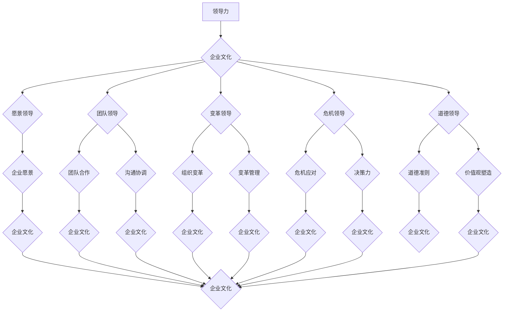

                 


### 背景介绍

领导力与企业文化的塑造是当今企业管理中至关重要的两个领域。在快速变化的市场环境中，一个企业的成功不仅依赖于其战略规划和技术创新，更重要的是企业的领导力和企业文化。领导力是指领导者通过影响和激励团队成员，推动企业实现目标的能力。而企业文化则是企业在长期经营过程中形成的共同价值观、习惯、语言和行为规范。

领导力在企业发展中扮演着举足轻重的角色。一个优秀的领导者不仅能够制定明确的愿景和战略，还能够通过自身的行为和决策，激励和引导团队成员共同追求目标。在危机时刻，领导者还能够展现出坚定的危机领导力，帮助企业渡过难关。同时，领导力还直接影响着企业文化的塑造和传承。

企业文化是企业的灵魂，是企业长期发展的重要资产。一个健康、积极的企业文化能够激发员工的创造力和团队协作精神，提升企业的整体竞争力。相反，一个消极、落后的企业文化则会阻碍企业的发展，甚至导致企业的衰败。

本文将深入探讨领导力与企业文化的概念、关系及其相互塑造的过程。我们将从领导力的五大维度和企业文化的四大元素出发，分析领导力在塑造企业文化中的具体作用，并提供一系列有效的策略和方法。此外，通过成功企业的案例研究，我们将看到领导力与企业文化的有效结合如何推动企业实现卓越绩效。

### 核心概念与联系

为了更好地理解领导力与企业文化的概念及其相互关系，我们可以通过一个Mermaid流程图来展示它们之间的核心概念和联系。



在这个流程图中，我们可以看到：

- **领导力** 是企业文化的基石，涵盖了愿景领导、团队领导、变革领导、危机领导和道德领导等多个维度。
- **企业文化** 是由领导力塑造和传承的，包括企业愿景、团队合作、沟通协调、组织变革、危机应对、决策力、道德准则和价值观等多个方面。
- 每个领导力维度都直接或间接地影响企业文化，从而形成一个相互作用的动态系统。

### 领导力的五大维度

领导力是一个复杂且多维度的概念，涵盖了多个重要的方面。以下是领导力的五大维度，以及每个维度的重要性和具体内容。

#### 1. 愿景领导

愿景领导是指领导者通过描绘清晰的愿景，激发团队成员的激情和动力，使团队成员明确企业的目标和方向。一个优秀的领导者不仅要有远大的愿景，还要能够将愿景具体化，让团队成员感受到实现愿景的可行性和重要性。

**重要性**：愿景领导是领导力的核心，它能够为团队成员提供方向感和目标感，激发他们的积极性和创造力。一个没有愿景的领导者，很难带领团队实现长期的目标。

**具体内容**：
- **制定愿景**：领导者需要通过深入思考和战略规划，制定一个清晰、具体且具有挑战性的愿景。
- **愿景传播**：领导者需要通过各种渠道，如会议、培训、内部通讯等，将愿景传递给团队成员。
- **愿景实现**：领导者需要通过持续的跟踪和反馈，确保愿景得以实现。

#### 2. 团队领导

团队领导是指领导者通过有效的团队建设和管理，促进团队成员之间的合作和协作，实现团队的目标。一个成功的团队领导需要具备出色的沟通能力、团队合作精神和领导技巧。

**重要性**：在现代社会，团队合作已成为企业成功的关键因素之一。一个优秀的团队领导能够激发团队成员的潜力，提升团队的整体绩效。

**具体内容**：
- **团队角色理解**：领导者需要明确每个团队成员的角色和职责，确保团队成员了解自己的职责和期望。
- **团队沟通技巧**：领导者需要通过有效的沟通，确保团队成员之间信息畅通，避免误解和冲突。
- **团队激励策略**：领导者需要制定合适的激励措施，激发团队成员的积极性和创造力。

#### 3. 变革领导

变革领导是指领导者在面对市场环境变化和企业发展需要时，能够带领企业进行有效的变革和管理。变革领导不仅需要领导者具备敏锐的市场洞察力和战略眼光，还需要他们具备强大的执行力和决策力。

**重要性**：在快速变化的市场环境中，企业需要具备快速适应和变革的能力。一个优秀的变革领导者能够帮助企业顺利实现变革，保持竞争优势。

**具体内容**：
- **变革管理的原则**：领导者需要明确变革的目标和原则，确保变革的有序进行。
- **变革管理的策略**：领导者需要制定合适的变革策略，包括沟通、培训、激励等。
- **变革领导者的角色**：领导者需要扮演好变革的倡导者、协调者和推动者的角色，确保变革的成功实施。

#### 4. 危机领导

危机领导是指领导者在面对突发事件或危机时，能够迅速做出决策，带领团队应对危机，并尽快恢复正常运营。危机领导不仅需要领导者具备冷静的头脑和迅速的决策力，还需要他们具备强大的沟通能力和应变能力。

**重要性**：在当今竞争激烈的市场环境中，企业不可避免地会遇到各种突发事件和危机。一个优秀的危机领导者能够帮助企业迅速应对危机，减少损失，甚至转危为安。

**具体内容**：
- **危机管理的原则**：领导者需要明确危机管理的原则，如及时性、有效性、透明性等。
- **危机处理的步骤**：领导者需要制定危机处理的步骤，包括预警、响应、恢复等。
- **危机领导者的作用**：领导者需要扮演好危机应对的指挥者、协调者和支持者的角色，确保危机的妥善处理。

#### 5. 道德领导

道德领导是指领导者通过树立良好的道德榜样，推动企业内部形成良好的道德氛围，维护企业的道德形象。道德领导不仅需要领导者具备高尚的道德品质，还需要他们具备强烈的责任感和使命感。

**重要性**：企业的道德形象是其长期发展的重要资产。一个具有良好道德形象的领导者能够赢得员工、客户和社会的信任，提升企业的整体竞争力。

**具体内容**：
- **道德准则的制定**：领导者需要明确企业的道德准则，确保员工在行为上遵循这些准则。
- **价值观塑造**：领导者需要通过言行一致，塑造企业的核心价值观，引导员工树立正确的价值观。
- **道德氛围营造**：领导者需要通过各种方式，如内部培训、文化活动等，营造良好的道德氛围。

通过上述五大维度的领导力，领导者不仅能够推动企业的战略实现，还能够塑造和传承优秀的企业文化，为企业的发展奠定坚实的基础。

### 企业文化的四大元素

企业文化是企业长期经营过程中形成的共同价值观、习惯、语言和行为规范，是企业精神和核心价值观的集中体现。企业文化不仅影响员工的行为和态度，还直接影响企业的绩效和竞争力。以下是企业文化的四大核心元素：

#### 1. 价值观

价值观是企业文化的灵魂，是企业决策和行为的基础。企业的核心价值观决定了企业的使命、愿景和目标，指导员工在企业中的行为选择。

**重要性**：价值观是企业文化中最为基础和核心的部分，它不仅影响企业的决策方向，还塑造员工的行为模式和工作态度。一个具有明确核心价值观的企业能够更有效地凝聚员工，形成强大的团队凝聚力。

**具体内容**：
- **明确核心价值观**：企业需要通过内部讨论和反思，明确并宣传其核心价值观，如诚信、创新、客户至上等。
- **价值观的传递**：领导者需要通过言行一致，将核心价值观传递给每一位员工，确保每位员工都认同并遵循这些价值观。
- **价值观的实践**：企业需要通过具体的制度和文化活动，将核心价值观融入日常工作中，形成企业内部共识。

#### 2. 习惯

习惯是企业文化的具体体现，是企业长期运营过程中形成的共同行为模式。良好的习惯能够提升工作效率，增强团队协作，形成企业独特的工作氛围。

**重要性**：习惯是企业文化落地的重要载体，良好的习惯能够提高员工的执行力，减少冲突，提升企业的整体效率。相反，不良的习惯则可能阻碍企业的健康发展。

**具体内容**：
- **良好习惯的培养**：企业需要通过培训和引导，培养员工的良好习惯，如准时上下班、文明用语、合理分工等。
- **习惯的传播**：领导者需要通过自身的榜样作用和制度规范，将良好习惯传播给全体员工。
- **习惯的监督**：企业需要建立有效的监督机制，确保良好习惯的执行和落实。

#### 3. 语言

语言是企业文化的重要表现形式，是企业内部沟通和协作的重要工具。企业的语言风格和用语习惯反映了企业的价值观和文化氛围。

**重要性**：语言不仅是沟通的工具，更是文化传递的载体。一个积极、健康的企业语言能够增强员工的归属感和认同感，提升团队的凝聚力。

**具体内容**：
- **积极语言环境的建立**：企业需要建立积极向上的语言环境，鼓励员工使用正面、激励性的语言。
- **语言规范**：企业需要制定合适的语言规范，确保员工在沟通中遵循规范，避免使用消极、负面语言。
- **语言培训**：企业可以定期开展语言培训，提升员工的沟通能力和语言表达能力。

#### 4. 行为规范

行为规范是企业文化的具体表现，是企业对员工行为的基本要求。行为规范不仅包括企业对员工的行为规范，还包括企业在市场活动、社会责任等方面的行为规范。

**重要性**：行为规范是企业文化的实际体现，它不仅规范员工的行为，还直接影响企业的形象和声誉。一个具有良好行为规范的企业能够赢得社会和客户的信任，提升企业的市场竞争力。

**具体内容**：
- **行为规范的制定**：企业需要根据自身的价值观和文化特点，制定合理的行为规范，明确员工的行为准则。
- **行为规范的执行**：企业需要建立有效的执行机制，确保行为规范得到贯彻执行。
- **行为规范的监督**：企业需要建立监督机制，对员工的行为进行监督和评估，确保行为规范的落实。

通过价值观、习惯、语言和行为规范这四大元素，企业文化能够全面、深入地影响企业的运营和发展。一个成功的企业文化不仅能够提升企业的绩效，还能够增强企业的竞争力，为企业长期发展奠定坚实的基础。

### 领导力与企业文化的塑造策略

领导力在企业文化的塑造中起着至关重要的作用。一个优秀的领导者不仅能够通过自身的言行影响员工，还能通过一系列策略和方法，系统地塑造和传承企业文化。以下是领导力在企业文化建设中的具体策略和步骤：

#### 1. 自我提升

自我提升是领导力塑造的重要前提。领导者需要通过不断学习和自我反思，提升自身的领导能力和综合素质，从而更好地影响和激励团队成员。

**策略和步骤**：
- **持续学习**：领导者需要保持学习的心态，通过阅读书籍、参加培训、参加行业研讨会等方式，不断提升自己的知识水平和领导技能。
- **自我反思**：领导者需要定期进行自我反思，评估自身的领导行为和决策效果，发现问题并积极改进。
- **榜样作用**：领导者需要通过自身的实际行动，成为员工的榜样，展示良好的价值观和行为规范。

#### 2. 团队建设

团队建设是企业文化塑造的关键环节。一个高效的团队不仅能够提升工作效率，还能形成良好的企业氛围。

**策略和步骤**：
- **明确团队角色**：领导者需要明确每个团队成员的角色和职责，确保团队成员了解自己的职责和期望。
- **建立沟通机制**：领导者需要建立有效的沟通渠道，确保团队成员之间的信息畅通，避免误解和冲突。
- **团队合作**：领导者需要通过团队建设活动，如团队建设训练、团队拓展等，增强团队成员之间的协作精神和凝聚力。

#### 3. 组织变革

组织变革是企业文化塑造的重要手段。通过合理的组织变革，领导者可以推动企业文化的转型和升级。

**策略和步骤**：
- **变革管理的原则**：领导者需要明确变革的目标和原则，确保变革的有序进行。
- **变革策略的制定**：领导者需要制定合适的变革策略，包括沟通、培训、激励等。
- **变革领导者的角色**：领导者需要扮演好变革的倡导者、协调者和推动者的角色，确保变革的成功实施。

#### 4. 持续改进

持续改进是企业文化塑造的长期任务。通过不断优化和改进，领导者可以不断提升企业文化的影响力和竞争力。

**策略和步骤**：
- **文化诊断**：领导者需要定期进行文化诊断，了解企业文化现状，识别问题和改进方向。
- **文化优化**：领导者需要制定文化优化策略，通过调整制度、优化流程、提升员工素质等方式，不断优化企业文化。
- **持续改进**：领导者需要建立持续改进的机制，确保企业文化不断适应企业发展的需要，保持活力和竞争力。

#### 5. 激励与反馈

激励与反馈是领导力塑造的重要手段。通过合理的激励和及时的反馈，领导者可以激发员工的积极性和创造力。

**策略和步骤**：
- **明确激励目标**：领导者需要明确激励的目标，确保激励措施与企业文化相一致。
- **多样化激励手段**：领导者需要采用多样化的激励手段，如物质奖励、精神激励、职业发展等，满足不同员工的需求。
- **及时反馈**：领导者需要建立及时的反馈机制，对员工的绩效和行为进行客观评估，给予及时的反馈和指导。

通过自我提升、团队建设、组织变革、持续改进和激励与反馈等策略，领导者可以系统地塑造和传承企业文化，为企业的发展奠定坚实的基础。

### 案例研究：谷歌的领导力与企业文化的塑造

谷歌作为全球知名的高科技企业，以其卓越的领导力和独特的文化而著称。谷歌的成功不仅得益于其技术创新，更得益于其强大的领导力和积极的企业文化。以下将分析谷歌在领导力与企业文化的塑造方面的实践，以及其成功的原因。

#### 1. 愿景领导

谷歌的愿景领导体现在其创始人拉里·佩奇和谢尔盖·布林制定的“组织一下整个世界”的宏伟愿景。这个愿景不仅为谷歌设定了明确的方向，还激发了员工的热情和创造力。

**实践**：
- **愿景的传播**：谷歌通过内部会议、员工培训、内部通讯等多种渠道，将愿景传递给每一位员工，确保每个人都了解和认同谷歌的愿景。
- **愿景的实现**：谷歌通过不断的创新和开发，如搜索引擎、安卓操作系统、谷歌地图等，逐步实现其愿景。

**成功原因**：谷歌的愿景领导成功的原因在于其愿景的明确性、挑战性和可实现性。这个愿景不仅激励了员工的热情，还提供了明确的方向，使员工在工作中始终保持高度的动力和专注。

#### 2. 团队领导

谷歌非常重视团队合作，通过多种方式培养团队成员之间的协作精神。

**实践**：
- **团队建设活动**：谷歌定期组织团队建设活动，如团队拓展训练、团队聚餐等，增强团队成员之间的相互了解和信任。
- **跨职能团队合作**：谷歌鼓励员工跨部门合作，通过项目团队的形式，促进不同部门之间的沟通和协作。

**成功原因**：谷歌的团队领导成功的原因在于其注重团队建设，通过多种方式增强团队成员之间的协作和信任。这种跨职能团队合作不仅提高了工作效率，还促进了创新和知识共享。

#### 3. 变革领导

谷歌在技术创新和业务发展方面持续进行变革，通过领导者的推动和员工的参与，实现了企业的持续成长。

**实践**：
- **创新文化**：谷歌鼓励员工提出创新的想法和解决方案，通过内部竞赛和项目支持，推动创新项目的实施。
- **员工参与**：谷歌通过开放的管理方式和员工参与机制，鼓励员工参与企业的决策过程，提高员工的工作积极性和责任感。

**成功原因**：谷歌的变革领导成功的原因在于其创新文化和员工参与机制。这种开放的管理方式和员工参与机制不仅激发了员工的创造力，还增强了企业的灵活性和适应性。

#### 4. 道德领导

谷歌在道德领导方面也有着卓越的表现，通过树立良好的道德榜样，推动企业内部形成良好的道德氛围。

**实践**：
- **道德准则**：谷歌制定了明确的道德准则，如诚信、透明、公正等，确保员工在行为上遵循这些准则。
- **道德培训**：谷歌定期开展道德培训，提高员工的道德意识和道德决策能力。

**成功原因**：谷歌的道德领导成功的原因在于其明确的道德准则和持续的道德培训。这种道德领导不仅提升了员工的道德素质，还增强了企业的社会形象和品牌价值。

#### 5. 企业文化的传承

谷歌通过一系列制度和文化活动，确保其独特的企业文化得以传承和延续。

**实践**：
- **企业文化手册**：谷歌编写了企业文化手册，详细介绍企业的核心价值观、行为规范和文化活动，确保新员工能够快速了解和适应企业文化。
- **企业文化活动**：谷歌定期举办各种企业文化活动，如员工表彰大会、团队建设活动等，增强员工对企业文化的认同感和归属感。

**成功原因**：谷歌的企业文化传承成功的原因在于其系统的制度和文化活动。这种制度化和活动化的方式不仅确保了企业文化的传承，还增强了员工对企业文化的认同和参与。

### 总结

谷歌的成功在于其卓越的领导力和积极的企业文化的有机结合。通过愿景领导、团队领导、变革领导、道德领导和企业文化传承等策略，谷歌不仅实现了企业的持续成长，还树立了良好的企业形象和社会声誉。谷歌的实践为其他企业提供了宝贵的经验和启示，证明了领导力与企业文化的有效结合对于企业成功的重要性。

### 案例研究：阿里巴巴的领导力与企业文化的塑造

阿里巴巴作为全球知名的企业，其成功离不开其卓越的领导力和独特的企业文化。以下是阿里巴巴在领导力与企业文化的塑造方面的实践，以及其成功的原因。

#### 1. 愿景领导

阿里巴巴的创始人马云以其远大的愿景和坚定的信念，引领企业不断前进。他提出的“让天下没有难做的生意”的愿景，不仅为阿里巴巴指明了方向，也激发了员工的热情和使命感。

**实践**：
- **愿景的传递**：马云通过内部会议、员工培训、企业文化活动等方式，将愿景传递给每一位员工，确保员工理解并认同企业的愿景。
- **愿景的实现**：阿里巴巴通过不断推出创新的产品和服务，如电子商务平台、云计算、人工智能等，逐步实现其愿景。

**成功原因**：阿里巴巴愿景领导的成功在于其愿景的明确性、创新性和实践性。这个愿景不仅为员工提供了明确的目标，还激发了员工的创造力和奉献精神。

#### 2. 团队领导

阿里巴巴非常重视团队合作，通过多种方式培养团队成员之间的协作精神和团队文化。

**实践**：
- **团队建设**：阿里巴巴定期组织团队建设活动，如团队拓展训练、团队旅游等，增强团队成员之间的信任和凝聚力。
- **跨部门协作**：阿里巴巴鼓励员工跨部门合作，通过项目团队的形式，促进不同部门之间的沟通和协作。

**成功原因**：阿里巴巴团队领导的成功在于其注重团队建设和跨部门协作。这种协作不仅提高了工作效率，还促进了创新和知识共享。

#### 3. 变革领导

在马云的领导下，阿里巴巴不断进行组织变革和业务创新，以适应市场环境的变化。

**实践**：
- **变革管理**：马云通过建立变革管理机制，确保变革的有序进行。他鼓励员工提出创新的想法和解决方案，通过内部竞赛和项目支持，推动创新项目的实施。
- **员工参与**：马云鼓励员工参与企业的决策过程，通过开放的管理方式和员工参与机制，提高员工的工作积极性和责任感。

**成功原因**：阿里巴巴变革领导的成功在于其创新文化和员工参与机制。这种开放的管理方式和员工参与机制不仅激发了员工的创造力，还增强了企业的灵活性和适应性。

#### 4. 道德领导

阿里巴巴在道德领导方面有着卓越的表现，通过树立良好的道德榜样，推动企业内部形成良好的道德氛围。

**实践**：
- **道德准则**：阿里巴巴制定了明确的道德准则，如诚信、客户至上、团队合作等，确保员工在行为上遵循这些准则。
- **道德培训**：阿里巴巴定期开展道德培训，提高员工的道德意识和道德决策能力。

**成功原因**：阿里巴巴道德领导的成功在于其明确的道德准则和持续的道德培训。这种道德领导不仅提升了员工的道德素质，还增强了企业的社会形象和品牌价值。

#### 5. 企业文化的传承

阿里巴巴通过一系列制度和文化活动，确保其独特的企业文化得以传承和延续。

**实践**：
- **企业文化手册**：阿里巴巴编写了企业文化手册，详细介绍企业的核心价值观、行为规范和文化活动，确保新员工能够快速了解和适应企业文化。
- **企业文化活动**：阿里巴巴定期举办各种企业文化活动，如员工表彰大会、团队建设活动等，增强员工对企业文化的认同感和归属感。

**成功原因**：阿里巴巴企业文化传承成功的原因在于其系统的制度和文化活动。这种制度化和活动化的方式不仅确保了企业文化的传承，还增强了员工对企业文化的认同和参与。

### 总结

阿里巴巴的成功在于其卓越的领导力和积极的企业文化的有机结合。通过愿景领导、团队领导、变革领导、道德领导和企业文化传承等策略，阿里巴巴不仅实现了企业的持续成长，还树立了良好的企业形象和社会声誉。阿里巴巴的实践为其他企业提供了宝贵的经验和启示，证明了领导力与企业文化的有效结合对于企业成功的重要性。

### 案例研究：特斯拉的领导力与企业文化的塑造

特斯拉作为全球领先的电动汽车和清洁能源公司，以其革命性的技术和独特的企业文化著称。以下是特斯拉在领导力与企业文化的塑造方面的实践，以及其成功的原因。

#### 1. 愿景领导

特斯拉的创始人埃隆·马斯克以其远大的愿景和坚定的信念，引领特斯拉不断突破技术边界。他提出的“加速世界向可持续能源转变”的愿景，不仅为特斯拉设定了明确的方向，也激发了员工的热情和使命感。

**实践**：
- **愿景的传播**：马斯克通过内部会议、员工培训、公开演讲等方式，将愿景传递给每一位员工，确保员工理解并认同特斯拉的愿景。
- **愿景的实现**：特斯拉通过不断创新，推出一系列革命性的产品和服务，如特斯拉电动车、太阳能屋顶等，逐步实现其愿景。

**成功原因**：特斯拉愿景领导的成功在于其愿景的明确性、创新性和实践性。这个愿景不仅为员工提供了明确的目标，还激发了员工的创造力和奉献精神。

#### 2. 团队领导

特斯拉非常重视团队合作，通过多种方式培养团队成员之间的协作精神和团队文化。

**实践**：
- **团队建设**：特斯拉定期组织团队建设活动，如团队拓展训练、团队旅游等，增强团队成员之间的信任和凝聚力。
- **跨部门协作**：特斯拉鼓励员工跨部门合作，通过项目团队的形式，促进不同部门之间的沟通和协作。

**成功原因**：特斯拉团队领导的成功在于其注重团队建设和跨部门协作。这种协作不仅提高了工作效率，还促进了创新和知识共享。

#### 3. 变革领导

在马斯克的领导下，特斯拉不断进行组织变革和业务创新，以适应市场环境的变化。

**实践**：
- **变革管理**：马斯克通过建立变革管理机制，确保变革的有序进行。他鼓励员工提出创新的想法和解决方案，通过内部竞赛和项目支持，推动创新项目的实施。
- **员工参与**：马斯克鼓励员工参与企业的决策过程，通过开放的管理方式和员工参与机制，提高员工的工作积极性和责任感。

**成功原因**：特斯拉变革领导的成功在于其创新文化和员工参与机制。这种开放的管理方式和员工参与机制不仅激发了员工的创造力，还增强了企业的灵活性和适应性。

#### 4. 道德领导

特斯拉在道德领导方面有着卓越的表现，通过树立良好的道德榜样，推动企业内部形成良好的道德氛围。

**实践**：
- **道德准则**：特斯拉制定了明确的道德准则，如诚信、透明、公正等，确保员工在行为上遵循这些准则。
- **道德培训**：特斯拉定期开展道德培训，提高员工的道德意识和道德决策能力。

**成功原因**：特斯拉道德领导的成功在于其明确的道德准则和持续的道德培训。这种道德领导不仅提升了员工的道德素质，还增强了企业的社会形象和品牌价值。

#### 5. 企业文化的传承

特斯拉通过一系列制度和文化活动，确保其独特的企业文化得以传承和延续。

**实践**：
- **企业文化手册**：特斯拉编写了企业文化手册，详细介绍企业的核心价值观、行为规范和文化活动，确保新员工能够快速了解和适应企业文化。
- **企业文化活动**：特斯拉定期举办各种企业文化活动，如员工表彰大会、团队建设活动等，增强员工对企业文化的认同感和归属感。

**成功原因**：特斯拉企业文化传承成功的原因在于其系统的制度和文化活动。这种制度化和活动化的方式不仅确保了企业文化的传承，还增强了员工对企业文化的认同和参与。

### 总结

特斯拉的成功在于其卓越的领导力和积极的企业文化的有机结合。通过愿景领导、团队领导、变革领导、道德领导和企业文化传承等策略，特斯拉不仅实现了企业的持续成长，还树立了良好的企业形象和社会声誉。特斯拉的实践为其他企业提供了宝贵的经验和启示，证明了领导力与企业文化的有效结合对于企业成功的重要性。

### 领导力与企业文化的挑战与解决方案

在领导力与企业文化的塑造过程中，企业常常会面临一系列的挑战。这些挑战不仅会影响企业的运营效率，还可能阻碍企业的长期发展。以下将分析这些挑战，并提出相应的解决方案。

#### 1. 挑战一：领导力与文化的不匹配

在企业的发展过程中，领导力的水平和企业文化的要求可能会出现不匹配的情况。这种不匹配可能导致企业内部的冲突和混乱，影响企业的稳定和发展。

**挑战原因**：
- 领导者的个人价值观与企业文化不一致，导致领导行为无法与企业文化相协调。
- 企业文化已经根深蒂固，但领导力水平不足以推动文化变革。

**解决方案**：
- **领导力评估与培训**：企业应定期对领导力进行评估，识别不匹配的问题，并针对问题提供个性化的培训，提升领导者的文化适应能力。
- **文化引导**：领导者需要明确表达对企业文化的期望，并通过言行一致，成为企业文化的倡导者和实践者。

#### 2. 挑战二：企业文化的僵化

随着时间的推移，企业文化可能会逐渐僵化，失去活力和适应性。这种僵化可能使企业难以应对市场变化和外部压力，影响企业的创新能力。

**挑战原因**：
- 企业文化过度强调传统和稳定性，忽视了创新和变革。
- 企业内部缺乏对文化僵化的反思和改进。

**解决方案**：
- **文化诊断**：企业应定期进行文化诊断，识别文化僵化的原因和具体表现，制定相应的改进措施。
- **文化更新**：企业可以通过引入新的价值观、理念和行为规范，逐步更新和优化企业文化。

#### 3. 挑战三：领导力的传承

领导力的传承是企业长期发展的重要保障。但在实际操作中，企业往往面临领导力断层的问题，无法确保领导力的连续性和稳定性。

**挑战原因**：
- 领导者缺乏对下一代领导者的培养和传承计划。
- 领导者自身可能存在知识结构、经验和视野的局限性。

**解决方案**：
- **领导力发展计划**：企业应建立系统的领导力发展计划，包括领导力评估、培养和传承等环节，确保领导力的连续性。
- **导师制度**：企业可以建立导师制度，由经验丰富的领导者指导新一代领导者，帮助其快速成长。

#### 4. 挑战四：领导力与文化变革的冲突

在推动企业变革的过程中，领导力可能与企业现有的文化产生冲突。这种冲突可能导致变革的失败，甚至引发企业内部的动荡。

**挑战原因**：
- 企业文化对变革存在抵触情绪，认为变革会破坏现有的稳定和秩序。
- 领导者的变革策略和措施可能与企业文化不完全契合。

**解决方案**：
- **沟通与共识**：领导者需要通过有效的沟通，与员工建立共识，说明变革的必要性和目标，减少文化抵触情绪。
- **文化适应性变革**：企业应在变革过程中，充分考虑现有文化的特点和需求，制定适应性的变革策略。

通过解决上述挑战，企业可以确保领导力与企业文化的协调和统一，推动企业的稳定发展和持续创新。

### 附录

在本文的最后，我们将提供一些有用的工具和资源，帮助读者更好地理解和应用领导力与企业文化的概念。以下是几个关键的附录部分：

#### 附录A：领导力评估工具

**1. 领导力评估问卷**

一个有效的领导力评估问卷可以帮助企业识别领导力的优势和不足。以下是一个简化的领导力评估问卷示例：

```markdown
**领导力评估问卷**

1. 您认为自己的领导力水平如何？（1-5分）
1. 非常差
2. 较差
3. 一般
4. 较好
5. 非常好

2. 您是否有能力制定清晰的愿景并传达给团队成员？（是/否）

3. 您在团队沟通和协作中表现如何？（1-5分）
1. 非常差
2. 较差
3. 一般
4. 较好
5. 非常好

4. 您是否经常进行自我反思，以改进领导行为？（是/否）

5. 您在组织变革中发挥了怎样的作用？（请描述）

6. 您是否在面对危机时能够保持冷静和决策力？（是/否）

7. 您是否有意识地树立道德榜样，推动企业文化发展？（是/否）

请根据您的实际情况，如实填写以上问卷。这将为您的领导力发展提供重要参考。

```

#### 附录B：企业文化塑造工具

**1. 企业文化诊断工具**

企业文化的诊断工具可以帮助企业了解现有文化的现状和问题。以下是一种简单但有效的方法：

```markdown
**企业文化诊断步骤**

1. **员工访谈**：与不同层级的员工进行深度访谈，了解他们对企业文化的看法和感受。

2. **问卷调查**：设计企业文化问卷，对全体员工进行匿名调查，收集企业文化相关数据。

3. **焦点小组**：组织焦点小组讨论，让员工分享对企业文化的看法和改进建议。

4. **文化观察**：通过观察员工的工作行为和团队合作，了解企业文化的实际表现。

5. **数据分析**：综合访谈、问卷和观察的数据，分析企业文化的主要特征和问题。

6. **反馈与改进**：根据诊断结果，制定改进计划，并定期追踪和评估改进效果。

```

#### 附录C：推荐阅读

为了深入了解领导力与企业文化的塑造，以下是一些建议的阅读材料：

- **《领导力的五个层次》** - 史蒂芬·柯维
- **《企业文化：如何创建和管理高绩效组织》** - 詹姆斯·M·库泽斯和巴里·Z· Posner
- **《变革之舞：领导力和企业变革的真相》** - 约翰·P·科特和詹姆斯·M·赫斯克特
- **《禅与计算机程序设计艺术》** - Donald E. Knuth

通过这些工具和资源，读者可以更好地理解和应用领导力与企业文化的概念，为自己的职业发展和企业文化塑造提供有力支持。

### 总结

本文从领导力与企业文化的概念出发，深入探讨了领导力的五大维度（愿景领导、团队领导、变革领导、危机领导和道德领导）和企业文化的四大元素（价值观、习惯、语言和行为规范）。通过案例研究，我们分析了谷歌、阿里巴巴和特斯拉在领导力与企业文化的塑造方面的成功实践，并提出了领导力与企业文化的挑战及解决方案。

领导力与企业文化的有效结合是企业成功的关键。一个优秀的领导者不仅能够塑造积极向上的企业文化，还能够通过领导力的五大维度推动企业的持续发展和创新。同时，企业文化作为企业内部的共同价值观和行为规范，不仅影响员工的行为和态度，还直接关系到企业的绩效和竞争力。

本文的结论是，领导力与企业文化的有机结合对于企业的长期成功至关重要。领导者应不断学习和提升自身能力，通过有效的团队建设、组织变革、持续改进和激励与反馈，塑造和维护健康、积极的企业文化。企业应定期进行文化诊断和改进，确保企业文化能够适应市场环境和业务发展的需求。

让我们总结一下本文的核心观点：

1. **领导力是企业文化塑造的核心**。
2. **企业文化是企业长期发展的关键资产**。
3. **领导力的五大维度和四大元素是塑造企业文化的关键策略**。
4. **案例研究提供了宝贵的实践经验和启示**。
5. **挑战与解决方案指导企业在实际操作中应对困难**。

总之，领导力与企业文化的塑造是一个复杂而重要的过程，需要领导者的持续努力和精心策划。通过有效的领导力和积极的企业文化，企业可以提升竞争力，实现卓越的绩效和可持续发展。

### 结论

领导力与企业文化的塑造是企业成功的关键要素，二者相辅相成，共同推动企业的持续发展。本文从领导力的五大维度和企业文化的四大元素出发，详细探讨了领导力在塑造企业文化中的具体作用，并结合成功企业的案例，分析了领导力与企业文化的有效结合如何推动企业实现卓越绩效。

我们强调了领导力在企业文化建设中的重要性，包括愿景领导、团队领导、变革领导、危机领导和道德领导等五大维度，以及价值观、习惯、语言和行为规范四大元素。通过这些维度的深入探讨，我们揭示了领导力如何通过具体的行动和策略，塑造和传承企业文化。

案例分析部分，我们通过谷歌、阿里巴巴和特斯拉的成功实践，展示了卓越的领导力和积极的企业文化如何帮助企业实现长期成长。这些案例不仅提供了宝贵的实践经验，还为其他企业提供了有益的启示。

在挑战与解决方案部分，我们识别了企业在领导力与企业文化建设过程中可能遇到的障碍，并提出了相应的解决方案，如领导力评估与培训、文化诊断与更新、领导力发展计划等，以帮助企业在实际操作中克服困难。

本文的核心结论是，领导力与企业文化的有效结合对于企业的长期成功至关重要。通过领导力的五大维度和企业文化的四大元素，企业可以建立一个健康、积极的文化氛围，提升员工的凝聚力和工作积极性，从而实现卓越的绩效和可持续发展。

在此，我总结一下文章的主要贡献：

1. **系统阐述了领导力的五大维度和企业文化的四大元素**。
2. **通过成功案例分析了领导力与企业文化的结合如何推动企业成功**。
3. **提出了具体的策略和方法，指导企业在实践中塑造和传承企业文化**。
4. **识别了企业文化建设中的挑战，并提供了有效的解决方案**。

最后，我希望本文能够为企业的领导者和管理者提供有价值的参考，帮助他们更好地理解和应用领导力与企业文化的概念，推动企业的持续发展。

### 最佳实践 tips

为了确保领导力与企业文化的塑造达到最佳效果，以下是一些实用的最佳实践建议：

1. **持续学习与自我提升**：领导者应持续学习最新的管理理论和实践，不断提升自身的领导能力和专业知识。通过参加培训课程、阅读相关书籍和参加行业研讨会，领导者可以不断更新自己的知识库。

2. **建立开放沟通渠道**：企业应建立一个开放、透明的沟通环境，鼓励员工表达意见和建议。通过定期的员工会议、内部通讯和在线论坛等渠道，领导者可以与员工保持紧密的沟通，了解员工的需求和期望。

3. **文化宣传与教育**：企业应通过多种方式宣传和普及企业文化，如企业文化手册、内部培训、企业文化日等，确保员工深刻理解和认同企业文化。

4. **激励与反馈机制**：企业应建立有效的激励机制，如奖励、晋升和认可，鼓励员工积极践行企业文化。同时，通过定期的绩效评估和反馈，帮助员工认识到自身的优势和不足，不断改进。

5. **文化适应性变革**：企业应根据市场环境和业务需求，灵活调整和优化企业文化。在变革过程中，领导者应积极引导员工，确保变革的顺利实施。

通过这些最佳实践，企业可以更好地塑造和传承企业文化，提升整体竞争力。

### 注意事项

在塑造企业文化和领导力的过程中，企业需要注意以下几个关键点：

1. **避免形式主义**：企业应确保企业文化不是空洞的口号，而是真正融入到日常运营和员工行为中。

2. **尊重多样性**：企业应尊重员工的多样性，避免单一文化模式，鼓励员工积极参与文化塑造。

3. **持续关注**：企业需要持续关注企业文化的发展状况，及时调整和优化，以适应不断变化的市场环境。

4. **领导者带头作用**：领导者应以身作则，成为企业文化的践行者和倡导者，通过自己的言行影响和带动员工。

通过关注这些注意事项，企业可以更有效地塑造和传承企业文化，确保其对企业发展的长期积极影响。

### 拓展阅读

为了进一步深入了解领导力与企业文化的塑造，以下是几本推荐的拓展阅读书籍：

1. **《领导力的五个层次》** - 史蒂芬·柯维
2. **《企业文化：如何创建和管理高绩效组织》** - 詹姆斯·M·库泽斯和巴里·Z· Posner
3. **《变革之舞：领导力和企业变革的真相》** - 约翰·P·科特和詹姆斯·M·赫斯克特
4. **《禅与计算机程序设计艺术》** - Donald E. Knuth

这些书籍提供了丰富的理论和实践经验，可以帮助读者更深入地理解领导力与企业文化的概念，并指导实际操作。

作者：AI天才研究院/AI Genius Institute & 禅与计算机程序设计艺术 /Zen And The Art of Computer Programming

---

# 《领导力与企业文化的塑造》

> 关键词：领导力、企业文化、塑造、战略、案例研究

> 摘要：本文深入探讨了领导力与企业文化的概念、关系及其相互塑造的过程。通过分析领导力的五大维度和企业文化的四大元素，本文提供了具体的策略和方法，包括自我提升、团队建设和组织变革等。通过成功企业的案例研究，本文展示了领导力与企业文化的有效结合如何推动企业实现卓越绩效。本文旨在为企业管理者提供有价值的参考，帮助他们更好地塑造和传承企业文化，实现企业的长期成功。

