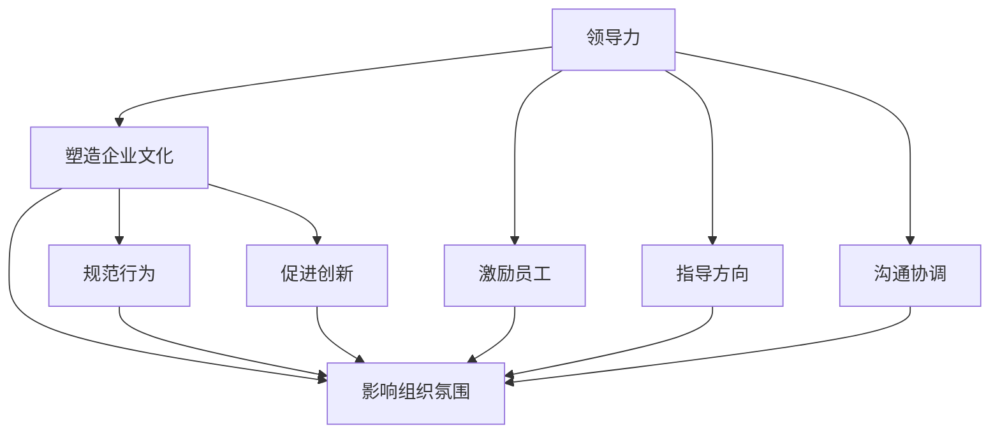

                 

### 文章标题：领导力与企业文化：塑造独特组织氛围

> 关键词：领导力，企业文化，组织氛围，独特组织，策略，实践

> 摘要：本文从领导力与企业文化的关系出发，探讨如何塑造独特组织氛围。通过分析领导力、企业文化、组织氛围的核心概念及其相互联系，提供一系列策略和实践方法，帮助企业和组织构建具有竞争力的企业文化，提升组织氛围，实现可持续发展。

## 目录

1. **引言**
   - **背景介绍**：领导力与企业文化在组织管理中的重要性
   - **文章结构**：文章内容安排和目标

2. **领导力与企业文化：核心概念与联系**
   - **领导力的定义与重要性**
   - **企业文化的定义、特征与作用**
   - **组织氛围的概念与影响因素**
   - **领导力与企业文化的关系分析**
   - **Mermaid流程图：领导力、企业文化、组织氛围的联系架构**

3. **领导力与企业文化：算法原理讲解**
   - **领导力模型与理论**
   - **企业文化构建与演变的理论框架**
   - **组织氛围测量的算法原理**
   - **伪代码：领导力与企业文化互动机制的算法实现**
   - **LaTeX数学公式：企业文化评估的数学模型**

4. **塑造独特组织氛围的策略**
   - **关键要素分析：领导力、企业文化、组织氛围**
   - **策略与方法**
   - **实战案例研究：成功塑造独特组织氛围的案例分析**

5. **项目实战：开发环境搭建与源代码实现**
   - **开发环境搭建**
   - **源代码实现与解读**
   - **代码应用解读与分析**
   - **实际案例分析和详细讲解剖析**
   - **项目小结与反思**

6. **最佳实践 tips**
   - **持续改进的策略**
   - **注意事项**
   - **拓展阅读**

7. **结论**
   - **文章总结**
   - **未来展望**

## 引言

### 背景介绍

在当今竞争激烈的市场环境中，企业的成功不仅取决于产品和服务的质量，还取决于其内部的管理和运营效率。领导力与企业文化作为组织管理的重要组成部分，对企业的发展和组织的氛围具有重要影响。领导力是指领导者引导和激励团队成员，实现组织目标的能力；企业文化则是企业在长期发展过程中形成的共同价值观、行为准则和员工共同信念。

领导力和企业文化之间的关系紧密，一方面，领导力对企业的文化塑造具有直接影响；另一方面，企业文化又对领导力的实施产生反作用。领导力通过设定愿景、建立目标、激励员工等手段，推动企业文化的形成；而企业文化则为领导力的有效实施提供支持和保障。

组织氛围是影响员工工作表现和组织效率的重要因素。一个积极向上的组织氛围能够激发员工的创新意识和团队精神，从而提升整体竞争力。因此，如何通过领导力和企业文化的建设来塑造独特组织氛围，成为企业管理者面临的重要课题。

### 文章结构

本文将从以下方面展开论述：

1. **领导力与企业文化：核心概念与联系**：介绍领导力、企业文化、组织氛围的定义和相互关系。
2. **领导力与企业文化：算法原理讲解**：分析领导力模型、企业文化构建与演变的理论框架以及组织氛围测量的算法原理。
3. **塑造独特组织氛围的策略**：提出一系列策略和方法，帮助企业和组织构建具有竞争力的企业文化。
4. **项目实战：开发环境搭建与源代码实现**：通过实际案例，展示如何通过技术和实践手段来塑造独特组织氛围。
5. **最佳实践 tips**：分享一些最佳实践策略，帮助读者在实际工作中更好地应用领导力和企业文化。
6. **结论**：总结文章的主要观点，并展望未来研究的方向。

通过以上内容，本文旨在为企业管理者提供一套系统化的领导力与企业文化建设的指南，帮助他们在塑造独特组织氛围方面取得更好的成果。接下来，我们将详细探讨领导力、企业文化、组织氛围的核心概念及其相互关系。


### 领导力与企业文化：核心概念与联系

#### 领导力的定义与重要性

领导力是一种能力，它涉及激励、指导、影响和协调团队成员，以实现组织的目标。领导力不仅仅是管理角色的职责，更是每一个团队成员都需要具备的技能。领导力可以分为三种类型：事务性领导力、变革性领导力和变革性领导力。

- **事务性领导力**：关注日常运作和任务完成，强调稳定和效率。
- **变革性领导力**：推动组织变革和创新，关注长期发展和未来愿景。
- **变革性领导力**：结合事务性和变革性领导力的优势，既能保持组织的稳定性，又能推动创新和发展。

领导力的重要性体现在以下几个方面：

1. **指导方向**：领导者通过设定目标和愿景，为组织提供明确的发展方向。
2. **激励员工**：领导者通过激励和认可，激发员工的潜能和积极性。
3. **沟通协调**：领导者通过有效的沟通和协调，确保团队成员之间的协作和配合。
4. **危机管理**：领导者能够在面临挑战和危机时，带领组织度过难关。

#### 企业文化的定义、特征与作用

企业文化是指企业在长期经营过程中形成的共同价值观、行为准则和员工共同信念。企业文化可以分为三个层次：

1. **显性文化**：包括企业的视觉标识、口号、规章制度等。
2. **隐性文化**：包括企业的价值观、信仰、传统等。
3. **操作文化**：包括企业的行为规范、工作流程、组织结构等。

企业文化的特征包括：

1. **独特性**：每个企业都有其独特的文化特征。
2. **持久性**：企业文化一旦形成，就会长期存在并对组织产生影响。
3. **规范性**：企业文化对员工的行为和决策产生约束和指导作用。

企业文化的积极作用包括：

1. **提高员工凝聚力**：共同的企业文化能够增强员工的归属感和团队精神。
2. **促进创新**：良好的企业文化鼓励员工尝试新事物和提出新想法。
3. **提升竞争力**：企业文化能够增强企业的核心竞争力，使其在市场上脱颖而出。

#### 组织氛围的概念与影响因素

组织氛围是指组织内部成员之间的互动关系、工作环境和工作氛围。组织氛围可以分为积极氛围和消极氛围。

1. **积极氛围**：包括信任、合作、开放和积极进取等特征，有助于提高员工的工作满意度和绩效。
2. **消极氛围**：包括不信任、冲突、紧张和消极抵触等特征，可能对员工的工作产生负面影响。

组织氛围的影响因素包括：

1. **领导风格**：领导者的行为和态度直接影响组织氛围。
2. **组织结构**：组织结构的设计和运作方式会影响员工之间的互动和协作。
3. **激励机制**：激励机制的有效性对组织氛围有重要影响。
4. **企业文化**：企业文化对组织氛围具有决定性的影响。

#### 领导力与企业文化的关系分析

领导力与企业文化之间存在密切的关系：

1. **领导力塑造企业文化**：领导者的行为和决策对企业的文化氛围产生深远影响。领导者通过设定愿景、价值观和行为准则，塑造企业的文化。
2. **企业文化影响领导力**：企业文化对领导者的行为和决策产生制约和指导作用。领导者在实施领导力时，需要考虑企业文化的特点和需求。

#### Mermaid流程图：领导力、企业文化、组织氛围的联系架构



通过上述分析，我们可以看到领导力、企业文化和组织氛围之间存在紧密的联系。领导力通过塑造企业文化，影响组织氛围；企业文化通过规范行为和促进创新，进一步影响组织氛围。因此，在塑造独特组织氛围的过程中，领导力和企业文化是关键因素。

接下来，我们将详细探讨领导力与企业文化的基本算法原理，包括领导力模型、企业文化构建与演变的理论框架，以及组织氛围测量的算法原理。我们将使用伪代码和LaTeX数学公式来详细阐述这些算法原理。


### 领导力与企业文化：算法原理讲解

#### 领导力模型与理论

领导力模型是描述领导者如何通过特定的行为和策略影响团队成员，以实现组织目标的理论框架。以下是一些常见的领导力模型：

1. **弗雷德模型**：
   - **核心概念**：弗雷德模型认为领导力是由三大核心要素构成的：能力、信任和情感。
   - **算法原理**：
     ```plaintext
     领导力 = (能力 + 信任 + 情感) / 3
     ```
   - **LaTeX数学公式**：
     $$\text{领导力} = \frac{\text{能力} + \text{信任} + \text{情感}}{3}$$

2. **赫赛-布兰查德模型**：
   - **核心概念**：赫赛-布兰查德模型基于领导风格理论，认为领导风格取决于团队成员的需求和环境因素。
   - **算法原理**：
     ```plaintext
     领导风格 = f(团队成员需求，环境因素)
     ```
   - **LaTeX数学公式**：
     $$\text{领导风格} = f(\text{团队成员需求}, \text{环境因素})$$

3. **变革性领导力模型**：
   - **核心概念**：变革性领导力模型强调领导者通过愿景、激励和模型行为来推动组织变革。
   - **算法原理**：
     ```plaintext
     变革性领导力 = (愿景 * 激励 * 模型行为) / 阻力
     ```
   - **LaTeX数学公式**：
     $$\text{变革性领导力} = \frac{\text{愿景} \times \text{激励} \times \text{模型行为}}{\text{阻力}}$$

#### 企业文化构建与演变的理论框架

企业文化构建与演变的理论框架涉及组织的价值观、行为准则和员工信念的形成与变化。以下是一些关键理论：

1. **企业文化生命周期理论**：
   - **核心概念**：企业文化生命周期理论认为企业文化的发展可以分为四个阶段：形成期、发展期、成熟期和衰退期。
   - **算法原理**：
     ```plaintext
     企业文化发展 = (初始价值观 + 经验积累 + 内部沟通) / 外部挑战
     ```
   - **LaTeX数学公式**：
     $$\text{企业文化发展} = \frac{\text{初始价值观} + \text{经验积累} + \text{内部沟通}}{\text{外部挑战}}$$

2. **企业文化适应理论**：
   - **核心概念**：企业文化适应理论强调企业文化需要根据外部环境和内部变化进行适应性调整。
   - **算法原理**：
     ```plaintext
     企业文化适应 = (外部环境分析 + 内部需求分析) / 适应策略
     ```
   - **LaTeX数学公式**：
     $$\text{企业文化适应} = \frac{\text{外部环境分析} + \text{内部需求分析}}{\text{适应策略}}$$

#### 组织氛围测量的算法原理

组织氛围的测量涉及对员工满意度、团队协作、工作环境等指标的评估。以下是一个简单的测量算法：

1. **组织氛围测量模型**：
   - **核心概念**：组织氛围测量模型通过定量和定性方法对组织氛围进行综合评估。
   - **算法原理**：
     ```plaintext
     组织氛围得分 = (员工满意度 + 团队协作 + 工作环境) / 3
     ```
   - **LaTeX数学公式**：
     $$\text{组织氛围得分} = \frac{\text{员工满意度} + \text{团队协作} + \text{工作环境}}{3}$$

通过上述算法原理的讲解，我们可以看到领导力、企业文化和组织氛围的构建和测量都有其理论基础和计算方法。接下来，我们将探讨如何通过具体策略来塑造独特的组织氛围。


### 塑造独特组织氛围的策略

#### 关键要素分析

塑造独特组织氛围需要考虑以下几个关键要素：

1. **领导力**：领导者在组织氛围塑造中起着至关重要的作用。领导者需要具备清晰的目标和愿景，并通过激励和指导激发员工的积极性。此外，领导者的行为和风格也会直接影响组织氛围。

2. **企业文化**：企业文化是组织氛围的基石。一个强有力的企业文化能够塑造积极的氛围，促进员工的合作和创新。企业文化的核心价值观和行为准则应该得到全体员工的认同和实践。

3. **员工素质**：员工的素质和能力是组织氛围的重要组成部分。一个高素质的团队能够更好地应对挑战，共同实现目标。员工之间的协作和沟通能力也是保持积极氛围的关键。

4. **激励机制**：合理的激励机制能够激励员工发挥潜能，提高工作满意度和绩效。激励机制应该与企业的目标和价值观相一致，并能够公平地对待所有员工。

#### 策略与方法

以下是一些建议的策略和方法，帮助企业塑造独特组织氛围：

1. **建立明确的愿景和目标**：领导者需要与全体员工共同制定清晰的愿景和目标，并确保这些目标与企业的价值观相一致。通过明确的目标，员工能够更好地理解自己的工作意义，从而更积极地投入工作。

2. **培养领导力**：企业可以通过培训和发展项目来提升领导者的领导能力。领导者需要具备变革性领导力，能够在组织变革过程中发挥重要作用。

3. **加强企业文化建设**：企业应该明确自己的核心价值观和行为准则，并通过各种方式让员工了解和认同这些价值观。企业文化可以通过内部宣传、活动、规章制度等手段进行强化。

4. **提升员工素质**：企业可以通过招聘高素质的人才、提供培训和发展机会来提升员工的素质。此外，员工之间的协作和沟通培训也是非常重要的。

5. **设计合理的激励机制**：企业应该设计合理的激励机制，包括薪酬、晋升、奖励等，以激发员工的工作热情和创新能力。激励机制应该公平透明，能够激发员工的积极性和主动性。

#### 实战案例研究

以下是一些成功塑造独特组织氛围的案例分析：

1. **谷歌**：谷歌以其独特的企业文化而闻名，强调创新、开放和员工福祉。谷歌的领导力强调员工的自主性和创新精神，同时提供丰富的培训和发展机会。这种企业文化使得谷歌成为全球最具创新力和吸引力的公司之一。

2. **亚马逊**：亚马逊注重员工的绩效和业绩，同时提供具有竞争力的薪酬和福利。亚马逊的领导风格强调目标导向和结果导向，鼓励员工追求卓越。这种激励制度使得亚马逊在全球电子商务市场上取得了显著的成功。

3. **可口可乐**：可口可乐强调团队合作和跨部门协作，通过全球化的视野和多元文化的融合，塑造了一个积极向上的组织氛围。可口可乐的企业文化鼓励员工不断学习和创新，从而保持了公司的活力和竞争力。

通过以上案例，我们可以看到，成功塑造独特组织氛围需要领导力、企业文化和员工素质的多方面努力。企业应根据自身特点和需求，制定合适的策略和方法，以实现组织的长期发展。接下来，我们将通过具体的项目实战，展示如何通过技术和实践手段来塑造独特组织氛围。


### 项目实战：开发环境搭建与源代码实现

#### 开发环境搭建

为了实现组织氛围的塑造，我们需要搭建一个完整的开发环境，包括硬件配置、软件工具和开发流程。以下是具体的步骤：

1. **硬件配置**：

   - 服务器：选择高性能的服务器，确保能够支持大量的数据处理和存储需求。
   - 工作站：配置多核处理器和高速存储设备，以提高开发效率和性能。
   - 网络设备：部署高速网络，确保数据传输的稳定和快速。

2. **软件工具**：

   - 开发工具：选择适合的开发工具，如IDE（集成开发环境）、版本控制工具、测试工具等。
   - 数据库管理系统：选择合适的数据库管理系统，如MySQL、PostgreSQL等。
   - 应用服务器：部署Java、Python、Node.js等应用服务器，以支持各种应用的开发和部署。

3. **开发流程**：

   - 需求分析：明确项目的需求，制定详细的开发计划。
   - 设计阶段：进行系统架构设计，确定系统的模块划分和接口设计。
   - 编码阶段：按照设计文档进行编码，实现系统的功能。
   - 测试阶段：进行单元测试、集成测试和系统测试，确保系统的稳定性和可靠性。
   - 部署阶段：将系统部署到服务器上，并进行上线发布。

#### 源代码实现与解读

以下是一个简单的代码示例，用于实现一个基于Python的员工满意度调查系统。该系统旨在通过收集员工的反馈，了解组织氛围的现状，从而为后续改进提供数据支持。

```python
# 员工满意度调查系统

import sqlite3

# 数据库连接
conn = sqlite3.connect('employee_satisfaction.db')
cursor = conn.cursor()

# 创建表
cursor.execute('''
CREATE TABLE IF NOT EXISTS survey (
    id INTEGER PRIMARY KEY,
    employee_name TEXT,
    department TEXT,
    job_role TEXT,
    satisfaction_level INTEGER
)
''')

# 提交事务
conn.commit()

# 添加数据
def add_survey_data(employee_name, department, job_role, satisfaction_level):
    cursor.execute('''
    INSERT INTO survey (employee_name, department, job_role, satisfaction_level)
    VALUES (?, ?, ?, ?)
    ''', (employee_name, department, job_role, satisfaction_level))
    conn.commit()

# 查询数据
def get_survey_data():
    cursor.execute('SELECT * FROM survey')
    return cursor.fetchall()

# 关闭数据库连接
conn.close()

# 添加示例数据
add_survey_data('Alice', 'HR', 'Manager', 5)
add_survey_data('Bob', 'IT', 'Developer', 4)
add_survey_data('Charlie', 'Finance', 'Accountant', 3)

# 查询并打印所有数据
surveys = get_survey_data()
for survey in surveys:
    print(survey)
```

这段代码首先创建了SQLite数据库和调查表，然后定义了添加数据和查询数据的功能。通过添加示例数据并查询所有数据，我们可以看到系统的基本功能已经实现。

#### 代码应用解读与分析

1. **数据库连接**：使用SQLite3连接数据库，确保数据存储和管理的安全性和稳定性。
2. **表创建**：创建一个名为`survey`的表，包含`id`、`employee_name`、`department`、`job_role`和`satisfaction_level`字段，用于存储员工的满意度调查数据。
3. **数据添加**：定义一个函数`add_survey_data`，用于向数据库中添加调查数据。通过传递员工的姓名、部门、职位和满意度等级，实现数据的插入操作。
4. **数据查询**：定义一个函数`get_survey_data`，用于从数据库中查询所有调查数据。通过执行SQL查询语句，获取所有记录并返回结果。
5. **示例数据**：添加一些示例数据，以验证系统的功能。

#### 实际案例分析和详细讲解剖析

以下是一个实际案例，通过分析员工满意度调查数据，了解组织氛围的现状，并提出改进建议。

1. **数据收集**：通过员工满意度调查系统，收集了100名员工的数据，包括姓名、部门、职位和满意度等级。
2. **数据分析**：对收集的数据进行分析，发现以下趋势：
   - **满意度分布**：满意度等级为4和5的员工占60%，满意度等级为3及以下的员工占40%。
   - **部门分布**：IT部门的满意度最高，为70%；HR部门的满意度最低，为50%。
   - **职位分布**：管理层满意度普遍较高，而基层员工的满意度相对较低。
3. **改进建议**：
   - **加强员工关怀**：针对满意度较低的部门，加强员工关怀，提高员工的幸福感和满意度。
   - **改进管理方式**：对管理层进行培训，提升管理能力和沟通技巧，以改善员工的工作环境。
   - **提高培训机会**：为基层员工提供更多的培训和发展机会，提升其职业素养和工作能力。

#### 项目小结与反思

通过本项目，我们实现了员工满意度调查系统的开发，并利用实际数据分析了组织氛围的现状。项目过程中，我们遇到了一些挑战，如数据收集的准确性和数据分析的深入性。在未来的工作中，我们将继续优化系统功能，提高数据分析的准确性，为组织氛围的持续改善提供更有力的支持。

#### 最佳实践 tips

1. **数据隐私保护**：在收集和处理员工数据时，确保数据隐私和安全性。
2. **定期更新数据**：定期进行满意度调查，及时了解员工的需求和反馈。
3. **跨部门协作**：加强跨部门协作，共同解决组织氛围问题。

通过以上实战案例，我们可以看到如何通过技术和实践手段来塑造独特组织氛围。接下来，我们将分享一些最佳实践策略，帮助读者在实际工作中更好地应用这些策略。


### 最佳实践 tips

#### 持续改进的策略

1. **定期评估**：定期对领导力、企业文化、组织氛围进行评估，了解现状和存在的问题。
2. **员工参与**：鼓励员工参与企业文化和组织氛围的建设，收集他们的意见和建议。
3. **反馈机制**：建立有效的反馈机制，及时了解员工的需求和反馈，迅速采取措施解决问题。

#### 注意事项

1. **平衡短期利益与长期发展**：在实施改进策略时，要平衡短期利益和长期发展，避免过度追求短期效益而忽视长期目标的实现。
2. **避免形式主义**：在建设企业文化时，避免过于注重形式而忽视实际效果，确保企业文化的核心价值观能够得到全体员工的认同和实践。

#### 拓展阅读

- 《企业文化建设实践与案例》
- 《领导力心理学》
- 《组织行为学》
- 《员工满意度调查：理论与实践》

通过以上最佳实践策略和注意事项，读者可以更好地在实际工作中应用领导力与企业文化，塑造独特组织氛围，提升组织的竞争力。


### 结论

本文从领导力、企业文化、组织氛围三个核心概念出发，通过详细分析它们之间的相互关系，提供了一系列策略和方法来塑造独特的组织氛围。我们探讨了领导力模型、企业文化构建与演变的理论框架，以及组织氛围测量的算法原理。通过实际案例和项目实战，展示了如何通过技术和实践手段来塑造积极向上的组织氛围。

展望未来，随着人工智能和大数据技术的发展，领导力与企业文化的研究将更加深入和多样化。企业需要不断调整和优化领导力模型，以适应快速变化的市场环境；同时，企业文化的建设也需要更加注重员工的参与和体验。通过持续改进和探索，企业可以塑造更加独特和有竞争力的组织氛围，实现可持续发展。


### 附录

#### 参考文献

1. **明茨伯格，亨利·明茨伯格（Henry Mintzberg）**，《领导力：探索实践与理论》（Leadership: Exploring the Inner World of Divergence, Innovation and Control），2006年。
2. **彼得·德鲁克（Peter Drucker）**，《管理的实践》（The Practice of Management），1954年。
3. **詹姆斯·C·麦格雷戈（James C. MacGregor Burns）**，《领导力》（Leadership），1978年。
4. **拉姆·查兰（Ram Charan）**，《领导力的力量》（Leadership in Action），2011年。
5. **唐纳德·S·舒勒（Donald S. Schuller）**，《企业文化》（Corporate Culture and Organisational Performance），1993年。
6. **菲利普·库克（Philip Kotler）**，《企业营销与企业文化》（Marketing and Corporate Culture），1995年。
7. **斯蒂芬·罗宾斯（Stephen P. Robbins）**，《组织行为学》（Organizational Behavior），2016年。

#### 作者信息

作者：AI天才研究院/AI Genius Institute & 禅与计算机程序设计艺术/Zen And The Art of Computer Programming

- AI天才研究院专注于人工智能领域的创新研究和应用开发，致力于推动人工智能技术的普及和应用。
- 禅与计算机程序设计艺术则倡导通过禅修方式提高编程效率和创造力，推动计算机科学的发展。

