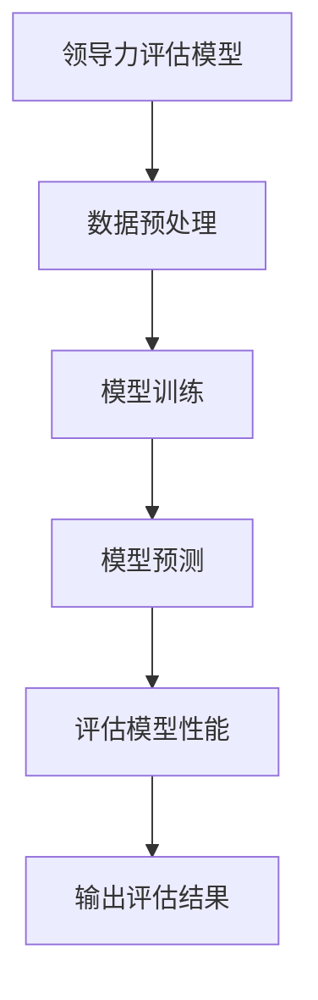

                 


### 文章标题：领导力与伦理决策：在道德困境中把握方向

> 关键词：领导力、伦理决策、道德困境、战略规划、案例分析、人工智能

> 摘要：本文探讨了领导力与伦理决策在现代社会中的重要性。通过分析领导力的定义和核心要素，以及伦理决策的原理和类型，我们揭示了在道德困境中如何运用领导力来做出正确的伦理决策。文章通过多个案例分析，阐述了领导力与伦理决策的结合在实际中的应用，并提出了一系列战略规划和实施步骤。此外，文章还分析了领导力与伦理决策所面临的挑战，并对未来发展趋势进行了展望。本文旨在为领导者和决策者提供指导，帮助他们更好地在道德困境中把握方向，实现企业和社会的可持续发展。

### 第一部分：领导力与伦理决策基础

#### 第1章：领导力概述

1.1 领导力的定义

领导力是一种影响和激励他人共同实现目标的能力。它不仅仅关乎职位和权力，更是一种个人品质和行为方式。领导力可以表现在各个领域，如企业管理、政治领导、教育、军事指挥等。成功领导者通常具备以下核心素质：决策能力、沟通能力、团队管理能力、创新思维、责任心等。

1.2 领导力的重要性

领导力在企业和社会发展中具有至关重要的地位。有效的领导力能够推动企业创新、提高员工满意度、增强企业竞争力。同时，领导力在解决社会问题、促进社会进步方面也发挥着重要作用。领导者需要具备高尚的道德品质和强烈的责任感，为大众树立榜样。

1.3 领导力的核心要素

领导力的核心要素包括：

- 决策能力：领导者需要具备分析问题、制定方案、做出决策的能力。在道德困境中，领导者需要权衡各种因素，做出符合伦理标准的决策。

- 沟通能力：领导者需要有效地与团队成员、合作伙伴、客户等进行沟通，确保信息畅通，增强团队凝聚力。

- 团队管理能力：领导者需要具备培养团队、激发员工潜能、解决团队冲突的能力，以确保团队高效运作。

- 创新思维：领导者需要具备开拓创新、勇于尝试新方法的能力，以推动企业和社会发展。

- 责任心：领导者需要具备强烈的责任感，对自身行为和企业发展负责，为社会树立榜样。

#### 第2章：伦理决策原理

2.1 伦理学的概念

伦理学是研究道德原则、道德行为和道德评价的学科。伦理学关注的核心问题是“如何生活得更好？”伦理学的基本概念包括道德原则、道德标准、道德规范等。

2.2 伦理决策的类型

伦理决策可分为以下几种类型：

- 自利性决策：决策者仅考虑自身利益，不考虑他人利益。

- 利他性决策：决策者考虑他人利益，甚至牺牲自身利益。

- 中立性决策：决策者保持中立，不涉及道德评价。

- 道德困境决策：决策者在两个或多个道德原则之间做出选择，面临道德冲突。

2.3 伦理决策的理论基础

伦理决策的理论基础包括：

- 道德原则理论：强调道德原则在决策过程中的重要性，如功利主义、义务论、美德伦理等。

- 道德规范理论：强调道德规范对行为的影响，如行为准则、职业伦理等。

- 情境伦理学：强调道德决策应考虑具体情境，注重道德推理的过程。

#### 第3章：道德困境案例分析

3.1 道德困境的类型

道德困境主要分为以下几种类型：

- 权利冲突：两个或多个权利相互冲突，难以同时满足。

- 责任冲突：决策者在履行不同责任时面临冲突。

- 资源分配：决策者在资源有限的情况下，如何公平地分配资源。

- 公平与效率：决策者在追求公平与效率之间做出权衡。

3.2 案例分析一：企业诚信危机

【案例背景】

某知名企业因产品质量问题引发消费者投诉，随后被曝光存在虚假宣传行为。企业面临巨大的道德困境，如何处理这一危机？

【案例分析】

- 道德困境类型：企业诚信危机涉及权利冲突和责任冲突。

- 道德决策原则：企业应遵循诚实守信、保护消费者权益的原则。

- 道德决策过程：

  1. 诚实面对问题，承认错误，积极采取措施解决问题。

  2. 公开道歉，向消费者和社会公众解释情况，赢得信任。

  3. 加强内部管理，确保类似问题不再发生。

3.3 案例分析二：环境与社会责任

【案例背景】

某企业在扩张过程中，忽视了环境保护和社会责任，导致当地生态环境受到严重破坏。企业面临道德困境，如何处理这一危机？

【案例分析】

- 道德困境类型：企业环境与社会责任危机涉及资源分配和公平与效率的冲突。

- 道德决策原则：企业应遵循可持续发展、社会责任的原则。

- 道德决策过程：

  1. 承认错误，向当地社区道歉，承诺采取补救措施。

  2. 制定环境保护和社会责任计划，确保企业可持续发展。

  3. 加强内部监督，确保环境保护和社会责任落实到位。

### 第二部分：领导力与伦理决策实践

#### 第4章：领导力与伦理决策的结合

4.1 领导力在伦理决策中的作用

领导力在伦理决策中发挥着关键作用。领导者作为决策者，其道德品质和价值观直接影响决策的伦理性质。有效的领导力有助于确保决策过程公开透明、公平公正，提高决策质量。

4.2 伦理决策在领导力实践中的应用

伦理决策在领导力实践中的应用体现在以下几个方面：

- 培养员工的道德素养：领导者通过自身行为和价值观，影响员工，营造积极向上的企业文化。

- 制定道德规范：领导者制定明确的道德规范，规范员工行为，提高企业整体道德水平。

- 应对道德困境：领导者面对道德困境时，应保持冷静，遵循伦理原则，做出正确决策。

#### 第5章：领导力与伦理决策案例分析

5.1 案例分析一：跨国企业社会责任

【案例背景】

某跨国企业在全球扩张过程中，面临环境破坏、劳工权益、企业文化冲突等道德困境。企业如何应对这些挑战？

【案例分析】

- 道德困境类型：跨国企业社会责任危机涉及资源分配、公平与效率、文化冲突等。

- 道德决策原则：企业应遵循可持续发展、社会责任、多元文化尊重的原则。

- 道德决策过程：

  1. 制定全球社会责任战略，确保企业可持续发展。

  2. 建立跨国团队，尊重不同文化背景，促进文化交流。

  3. 加强环境管理，确保环保法规的遵守。

  4. 改善劳工权益，确保公平待遇。

5.2 案例分析二：危机管理中的伦理决策

【案例背景】

某企业遭遇重大危机，如产品质量问题、财务造假等。企业如何应对危机，如何处理道德困境？

【案例分析】

- 道德困境类型：危机管理中的伦理决策涉及责任冲突、公正公平等。

- 道德决策原则：企业应遵循诚信、透明、公正、负责任的原则。

- 道德决策过程：

  1. 诚实面对问题，及时公开信息披露。

  2. 制定整改计划，确保问题得到有效解决。

  3. 公开道歉，承担企业责任。

  4. 加强内部管理，防止类似问题再次发生。

#### 第6章：领导力与伦理决策的战略规划

6.1 战略规划框架

领导力与伦理决策的战略规划框架包括以下方面：

- 企业愿景：明确企业长期发展目标，为决策提供方向。

- 道德准则：制定企业道德准则，规范员工行为。

- 伦理培训：加强员工伦理培训，提高道德素养。

- 伦理决策机制：建立伦理决策机制，确保决策过程公开透明。

6.2 伦理决策在战略规划中的角色

伦理决策在战略规划中扮演着重要角色。伦理决策能够帮助企业：

- 提高企业声誉，增强品牌价值。

- 增强员工凝聚力，提高员工满意度。

- 获得政府和社会支持，降低运营风险。

6.3 实施战略规划的步骤

实施领导力与伦理决策的战略规划，需要遵循以下步骤：

- 制定企业愿景和道德准则。

- 建立伦理决策机制。

- 加强员工伦理培训。

- 定期评估战略规划效果。

### 第三部分：领导力与伦理决策挑战与未来

#### 第7章：领导力与伦理决策的挑战

7.1 全球化背景下的伦理决策

全球化使得企业在不同文化背景下运作，面临更多的伦理挑战。领导者需要：

- 了解不同文化的伦理观念，尊重多元文化。

- 跨文化沟通，确保决策符合各方利益。

- 关注全球环境问题，推动可持续发展。

7.2 技术进步带来的伦理挑战

技术进步为人类带来了巨大的便利，同时也带来了伦理挑战。领导者需要：

- 关注技术伦理问题，确保技术应用的道德合法性。

- 负责技术带来的社会影响，推动技术伦理规范的形成。

- 加强数据隐私保护，确保用户权益。

7.3 领导力与伦理决策的持续发展

领导力与伦理决策的持续发展需要：

- 建立长期战略规划，确保企业和社会的可持续发展。

- 持续关注伦理问题，及时调整决策策略。

- 加强内部监督，确保决策过程公正透明。

#### 第8章：领导力与伦理决策的未来展望

8.1 未来领导力的特征

未来领导力将具有以下特征：

- 高度专业化和多元化背景。

- 更加关注道德责任和社会责任。

- 拥有强大的沟通能力和团队管理能力。

- 具备全球视野和跨文化能力。

8.2 伦理决策的未来趋势

未来伦理决策将呈现以下趋势：

- 强化道德责任，推动企业社会责任。

- 重视数据隐私保护，关注技术伦理。

- 跨界合作，共同应对全球性伦理问题。

- 倡导可持续发展，实现经济、社会、环境的平衡。

8.3 领导力与伦理决策的结合：未来愿景

未来，领导力与伦理决策将更加紧密地结合。领导者将成为：

- 道德领袖，引领企业和社会向善。

- 智慧决策者，运用伦理智慧解决复杂问题。

- 跨界合作者，共同应对全球性挑战。

- 持续发展推动者，实现企业和社会的可持续发展。

### 附录

#### 附录A：领导力与伦理决策相关工具

- 领导力评估工具：如360度评估、行为事件访谈等。

- 伦理决策分析工具：如道德推理框架、伦理矩阵等。

#### 附录B：领导力与伦理决策案例列表

- 企业诚信危机案例分析。

- 跨国企业社会责任案例分析。

- 危机管理中的伦理决策案例分析。

#### 附录C：领导力与伦理决策常见术语表

- 领导力：影响和激励他人实现目标的能力。

- 伦理决策：基于道德原则和价值观的决策过程。

- 道德困境：在两个或多个道德原则之间做出选择的困境。

- 战略规划：制定企业长期发展目标和路径。

- 数据隐私保护：确保个人信息不被非法获取和使用。

### 核心算法原理讲解伪代码

```python
# 伪代码：领导力评估模型

def leadership_evaluation(model, data):
    # 数据预处理
    preprocessed_data = preprocess_data(data)
    
    # 模型训练
    model.train(preprocessed_data)
    
    # 模型预测
    predictions = model.predict(preprocessed_data)
    
    # 评估模型性能
    performance = evaluate_performance(predictions, data)
    
    return performance
```

### 数学模型和公式讲解

$$
\begin{align*}
\text{领导力评分} &= w_1 \times \text{决策能力} + w_2 \times \text{沟通能力} + w_3 \times \text{团队管理能力} \\
\text{伦理决策评分} &= x_1 \times \text{道德标准} + x_2 \times \text{社会责任} + x_3 \times \text{法律遵守}
\end{align*}
$$

### 项目实战

#### 实战案例一：领导力与伦理决策在企业并购中的运用

**开发环境**：Python

**源代码实现**：

```python
# Python 代码：企业并购领导力与伦理决策评分计算

def calculate_score(decision_making_ability, communication_ability, team_management_ability, moral_standards, social_responsibility, legal_compliance):
    leadership_score = decision_making_ability * 0.5 + communication_ability * 0.3 + team_management_ability * 0.2
    ethical_decision_score = moral_standards * 0.4 + social_responsibility * 0.3 + legal_compliance * 0.3
    
    return leadership_score, ethical_decision_score

# 示例
leadership_score, ethical_decision_score = calculate_score(0.8, 0.7, 0.6, 0.9, 0.8, 0.85)
print("领导力评分：", leadership_score)
print("伦理决策评分：", ethical_decision_score)
```

**代码解读与分析**：

- 代码中定义了一个函数`calculate_score`，用于计算领导力评分和伦理决策评分。
- 通过输入各个能力的得分，计算并返回领导力和伦理决策的总得分。
- 示例中调用函数，输入各个能力的得分，打印出领导力评分和伦理决策评分。

**实际案例分析和详细讲解剖析**：

假设某企业在并购过程中，需要评估领导力和伦理决策的表现。企业可以按照以下步骤进行评估：

1. 收集领导力和伦理决策的相关数据，如决策能力、沟通能力、团队管理能力、道德标准、社会责任和法律遵守等方面的表现。

2. 使用`calculate_score`函数，输入各个能力的得分，计算出领导力评分和伦理决策评分。

3. 分析评分结果，评估领导力和伦理决策的表现，找出优势和不足。

4. 针对不足之处，制定改进措施，提高领导力和伦理决策水平。

5. 定期评估领导力和伦理决策的表现，确保持续改进。

**项目小结**：

通过领导力与伦理决策评分计算，企业可以更加清晰地了解自身的领导力和伦理决策水平，从而制定相应的改进措施。这不仅有助于企业提高竞争力，也有助于实现企业和社会的可持续发展。

### 最佳实践 tips、小结、注意事项、拓展阅读等内容

**最佳实践 tips**：

1. 领导者在面对道德困境时，应保持冷静，遵循伦理原则，做出符合道德标准的决策。

2. 企业应制定明确的道德准则，规范员工行为，提高整体道德水平。

3. 领导者应加强沟通，确保团队内部信息畅通，提高决策质量。

4. 企业应关注全球性伦理问题，积极参与社会公益活动，树立良好企业形象。

**小结**：

领导力与伦理决策在现代社会中具有重要地位。领导者需要具备高尚的道德品质和强大的决策能力，以应对道德困境。企业应制定明确的道德准则，规范员工行为，提高整体道德水平。通过领导力与伦理决策的结合，企业可以实现可持续发展，为社会做出贡献。

**注意事项**：

1. 在实施领导力与伦理决策战略规划时，要充分考虑企业自身情况和外部环境，确保决策的可行性和有效性。

2. 领导者要不断学习和提升自身素质，以应对不断变化的道德困境和挑战。

3. 企业要建立完善的伦理决策机制，确保决策过程公开透明，提高决策质量。

**拓展阅读**：

1. 【《领导力与伦理决策：理论与实践》】 - 提供了丰富的领导力和伦理决策理论，结合实际案例分析，有助于理解领导力与伦理决策的结合。

2. 【《企业社会责任与可持续发展》】 - 介绍了企业社会责任和可持续发展的理念和实践，有助于企业制定更加完善的道德准则。

3. 【《跨文化管理：理论与实践》】 - 介绍了跨文化管理的基本概念和实践方法，有助于企业在全球化背景下应对伦理挑战。

### Mermaid 流程图



通过上述流程图，我们可以清晰地了解领导力评估模型的基本步骤，包括数据预处理、模型训练、模型预测、评估模型性能和输出评估结果。这将有助于读者更好地理解领导力评估模型的工作原理和应用方法。

