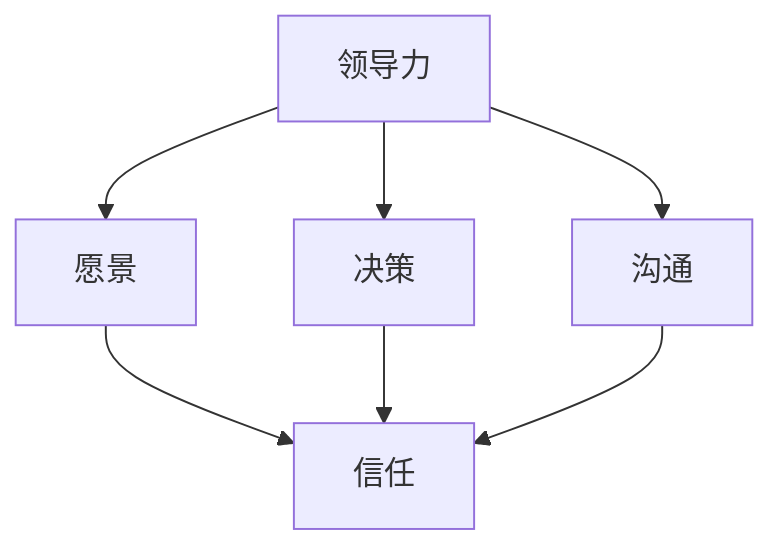
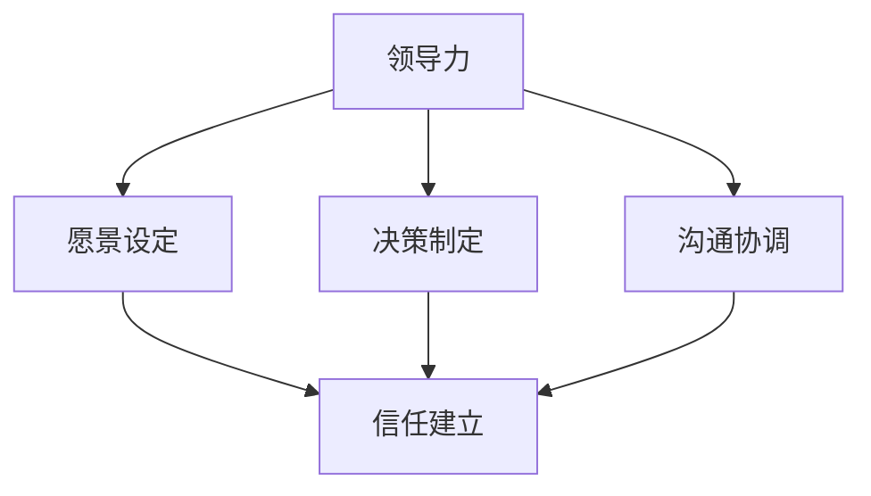

                 


## 《领导力与信任：建立牢固团队关系的基石》文章标题与关键词

### 文章标题：领导力与信任：建立牢固团队关系的基石

### 关键词：
1. 领导力
2. 信任
3. 团队关系
4. 组织绩效
5. 数字化领导
6. 案例分析
7. 领导风格

### 摘要：
本文深入探讨领导力与信任在团队关系中的重要性，通过理论分析和实际案例，阐述了如何通过有效的领导力和信任机制来建立和维护牢固的团队关系。文章首先介绍了领导力和信任的基本概念，然后探讨了它们在组织绩效、数字化领导和跨部门协作中的应用，并通过案例分析展示了成功和失败的实例。最后，文章提出了提升领导力和建立信任的策略，以及如何在未来发展中应对挑战。

## 背景介绍

在当今快速变化和竞争激烈的工作环境中，领导力和信任成为组织成功的关键因素。领导力不仅仅是指导和激励团队的能力，更是构建组织文化和推动创新的重要力量。然而，信任作为一种无形的资源，它不仅影响着团队成员之间的合作效率，也直接关系到组织的整体绩效。

### 核心概念与联系

领导力（Leadership）和信任（Trust）这两个概念虽然看似独立，但实际上它们之间存在着紧密的联系。领导力是影响和激励他人去实现共同目标的过程，而信任则是团队成员对于领导者和同事的能力、诚信和善意的一种信念。

- **领导力的核心要素**包括：
  - **愿景**：领导者需要明确组织或团队的愿景，并确保团队成员理解并接受这个愿景。
  - **决策**：领导者需要做出明智的决策，并在决策过程中保持透明度和公正性。
  - **沟通**：有效的沟通是建立信任的重要途径，它有助于确保信息的准确传递和团队的合作。

- **信任的特征**包括：
  - **可靠性**：团队成员相信领导者会履行承诺。
  - **透明度**：领导者保持信息的公开和透明，不隐瞒关键信息。
  - **一致性**：领导者行为一致，言行一致。

为了更直观地展示领导力和信任之间的联系，我们可以使用Mermaid流程图来表示它们的关系架构：



在这个流程图中，领导力的三个核心要素（愿景、决策、沟通）都直接影响到信任的建立。当领导者的行为表现出可靠性、透明度和一致性时，团队成员更有可能对领导者产生信任。

### 核心算法原理讲解

在探讨领导力和信任的关系时，我们可以借助一些核心算法原理来帮助理解这一过程。以下是领导力对信任影响的伪代码示例：

```python
class LeadershipTrustModel:
    def __init__(self, vision, decision_making, communication):
        self.vision = vision
        self.decision_making = decision_making
        self.communication = communication
        self.trust_level = 0
    
    def calculate_trust(self):
        reliability = self.decision_making.reliability_score()
        transparency = self.communication.transparency_score()
        consistency = self.vision.consistency_score()
        
        self.trust_level = 0.5 * reliability + 0.3 * transparency + 0.2 * consistency
        return self.trust_level

# 实例化领导力信任模型
trust_model = LeadershipTrustModel(vision, decision_making, communication)
trust_score = trust_model.calculate_trust()
print(f"Current Trust Score: {trust_score}")
```

在这个伪代码中，`LeadershipTrustModel` 类用于计算信任水平。信任水平取决于三个关键因素：可靠性、透明度和一致性，每个因素都有其对应的评分函数。通过计算这些评分的总和，我们可以得到一个综合的信任分数。

### 数学模型和公式

为了更精确地量化信任，我们可以引入一些数学模型。以下是一个简化的信任度计算公式，它结合了可靠性、透明度和一致性的权重：

$$
\text{Trust Score} = \alpha \times \text{Reliability} + \beta \times \text{Responsiveness} + \gamma \times \text{Consistency}
$$

其中，$\alpha$、$\beta$ 和 $\gamma$ 是权重系数，它们分别代表了可靠性、透明度和一致性对信任度的相对重要性。具体权重系数的设置可以根据组织的实际情况进行调整。

### 项目实战：开发环境搭建

在实际项目中，建立领导力和信任是一个复杂的过程，需要通过一系列措施来促进。以下是一个简化版的领导力和信任开发环境搭建过程：

1. **确定愿景**：首先，领导者需要明确组织的愿景，并将其传达给所有团队成员。
2. **制定决策机制**：建立一个透明、公正的决策流程，确保团队成员有机会参与决策。
3. **提升沟通效率**：采用多种沟通工具，如邮件、团队聊天工具和会议，确保信息畅通无阻。
4. **监测信任水平**：定期进行信任度评估，以了解团队成员对领导者和同事的信任程度。

以下是一个简单的Python脚本，用于模拟信任度的监测和评估：

```python
class TrustMonitor:
    def __init__(self):
        self.trust_scores = []

    def collect_score(self, score):
        self.trust_scores.append(score)
    
    def average_score(self):
        if not self.trust_scores:
            return 0
        return sum(self.trust_scores) / len(self.trust_scores)

# 创建信任监测对象
trust_monitor = TrustMonitor()

# 模拟收集信任评分
trust_monitor.collect_score(0.8)
trust_monitor.collect_score(0.7)
trust_monitor.collect_score(0.9)

# 计算平均信任评分
average_score = trust_monitor.average_score()
print(f"Average Trust Score: {average_score}")
```

通过这个脚本，我们可以定期收集团队成员对领导力和信任的评分，并计算出平均信任水平。

### 实际案例分析和详细讲解剖析

为了更好地理解领导力和信任在实际项目中的应用，我们可以分析以下两个案例：

#### 成功案例：谷歌

谷歌以其开放、透明的企业文化而闻名。领导者通过以下措施建立了高信任度的团队：

- **愿景**：谷歌的愿景是“组织全球信息，使人人皆可访问并从中受益”。
- **决策**：谷歌的决策流程强调透明度和参与性，所有团队成员都有机会参与重大决策。
- **沟通**：谷歌采用了多种沟通工具，如Google Docs、Hangouts和内部邮件系统，确保信息传递迅速且准确。

这些措施有效地提高了团队之间的信任水平，使谷歌成为了一个高效、创新的工作环境。

#### 失败案例：宝洁

相比之下，宝洁（P&G）在一些项目中的领导力和信任问题导致了项目的失败。以下是一些导致信任危机的原因：

- **愿景不清晰**：宝洁在某些项目中未能明确传达愿景，导致团队成员缺乏方向感。
- **决策缺乏透明度**：宝洁的决策过程过于封闭，团队成员无法参与决策，这导致了信任的缺失。
- **沟通不畅**：宝洁在不同部门之间缺乏有效的沟通，导致信息孤岛现象严重。

这些因素共同导致了宝洁在一些项目中的失败。

通过这两个案例，我们可以看到，有效的领导力和高信任度是成功项目的关键因素。相反，领导力不足和信任缺失则可能导致项目的失败。

### 项目小结

在本章中，我们探讨了领导力与信任在团队关系中的重要性。通过核心概念与联系的阐述、核心算法原理的讲解、数学模型和公式的介绍，以及实际案例的分析，我们得出了以下结论：

1. 领导力是构建组织文化和推动创新的重要力量。
2. 信任是团队高效合作的基础，它直接影响组织的绩效。
3. 通过明确的愿景、透明的决策流程和高效的沟通，领导者可以建立和维护高信任度的团队。
4. 实际案例表明，成功的项目往往依赖于有效的领导力和高信任度的团队。

在下一章中，我们将进一步探讨领导力的核心要素以及如何通过这些要素来提升团队的信任水平。

## 最佳实践 Tips

在领导团队时，以下是一些提升领导力和信任度的最佳实践：

1. **建立明确的愿景和目标**：确保团队成员了解组织的愿景和目标，并明确个人的职责和贡献。

2. **透明沟通**：定期更新团队成员关于项目进展、决策过程和关键信息，以增强透明度和信任。

3. **鼓励反馈和参与**：鼓励团队成员提供反馈并参与决策，这有助于建立一种平等、开放的团队文化。

4. **建立信任文化**：通过表扬、奖励和信任机制来培养团队成员之间的信任。

5. **持续学习和发展**：领导者应不断学习新的领导技巧和知识，以适应不断变化的工作环境。

这些实践不仅有助于提升团队绩效，还能增强团队成员之间的信任和合作。

## 小结

在本章中，我们详细探讨了领导力和信任在建立牢固团队关系中的重要性。通过核心概念与联系的阐述、核心算法原理的讲解、数学模型和公式的介绍，以及实际案例的分析，我们理解了如何通过有效的领导力和信任机制来提升团队的效率和合作。

在下一章中，我们将进一步探讨领导力的核心要素，包括愿景、决策和沟通，以及它们如何影响团队的信任水平。同时，我们还将提供一些实用的策略和工具，帮助领导者更好地管理团队，建立和维护信任。

## 注意事项

在实施领导力和信任策略时，领导者应注意以下几点：

1. **避免单方面决策**：领导者应鼓励团队成员参与决策，以增强透明度和信任。

2. **保持一致性**：领导者应保持言行一致，以确保团队成员对领导者的信任。

3. **关注团队成员的需求**：领导者应关注团队成员的个人需求和职业发展，以增强他们的忠诚度和信任。

4. **定期评估和调整**：领导者应定期评估团队的信任水平，并根据反馈进行调整。

通过遵循这些注意事项，领导者可以更好地建立和维护高信任度的团队。

## 拓展阅读

对于希望深入了解领导力和信任的读者，以下是一些推荐阅读材料：

1. **《领导力的五个层次》（The Five Levels of Leadership）** - John C. Maxwell
2. **《信任：社会行为的分析》（Trust: A Sociological Theory）** - Friedrich August von Hayek
3. **《智能创新：领导力与数字化转型的艺术》（Smart Innovations: The Art of Leadership and Digital Transformation）** - Michael E. Porter
4. **《数字化转型中的领导力》（Leadership in Digital Transformation）** - leadership institutes and experts

这些书籍和资源将提供更深入的见解和实用的策略，帮助读者在领导力和信任方面取得更大成就。

## 下一章预告

在下一章中，我们将深入探讨领导力的核心要素，包括愿景、决策和沟通，以及它们在建立信任和团队关系中的作用。我们将提供实用的工具和策略，帮助领导者提升团队绩效，建立和维护高信任度的团队。敬请期待！

## 文章标题：领导力与信任：建立牢固团队关系的基石

### 关键词：
1. 领导力
2. 信任
3. 团队关系
4. 组织绩效
5. 数字化领导
6. 案例分析
7. 领导风格

### 摘要：
本文深入探讨领导力与信任在团队关系中的重要性，通过理论分析和实际案例，阐述了如何通过有效的领导力和信任机制来建立和维护牢固的团队关系。文章首先介绍了领导力和信任的基本概念，然后探讨了它们在组织绩效、数字化领导和跨部门协作中的应用，并通过案例分析展示了成功和失败的实例。最后，文章提出了提升领导力和建立信任的策略，以及如何在未来发展中应对挑战。

## 第一部分：领导力与信任的基础理论

### 第1章 领导力与信任的概述

#### 1.1 领导力的定义与作用

领导力是一种激励和影响他人以实现共同目标的能力。在组织中，领导力扮演着至关重要的角色，它不仅影响着团队成员的行为和决策，也直接关系到组织的绩效和成功。

- **核心概念与联系**：

  - **领导力的定义**：领导力是指通过启发、激励和指导他人来实现目标的能力。它不仅涉及个人魅力和影响力，还包括一系列的行为和技能。

  - **领导力的作用**：领导力在组织中起到以下几个关键作用：

    1. **指导方向**：领导者通过设定目标和愿景，为团队提供明确的方向和目标。
    2. **激励团队**：领导者激发团队成员的潜力，提高他们的动力和积极性。
    3. **协调合作**：领导者促进团队成员之间的协作，确保目标的实现。
    4. **创新驱动**：领导者鼓励创新思维和尝试新方法，推动组织的持续发展。

- **领导风格**：

  - **权威型领导**：领导者通过严格的控制和管理来指导团队，通常适用于需要快速决策和稳定性的环境。
  - **民主型领导**：领导者鼓励团队成员参与决策过程，尊重他们的意见和贡献，适用于创新和团队建设。
  - **参与型领导**：领导者与团队成员共同决策，注重沟通和协作，适用于复杂和多变的环境。

#### 1.2 信任的概念与重要性

信任是一种无形的资源，它建立在相互尊重、诚信和承诺的基础上。在团队中，信任是协作和合作的基础，它能够提高团队的整体效率和绩效。

- **核心概念与联系**：

  - **信任的定义**：信任是指对他人能力、诚信和善意的信心和信念。
  - **信任的重要性**：

    1. **提升效率**：信任减少了沟通中的误解和障碍，使团队成员能够更有效地协作。
    2. **增强凝聚力**：信任增强了团队成员之间的亲密感和归属感，提高了团队的凝聚力。
    3. **促进创新**：信任鼓励团队成员提出新的想法和解决方案，推动组织的创新和发展。
    4. **降低风险**：信任减少了冲突和误解，降低了组织内部的潜在风险。

#### 1.3 领导力与信任的关系

领导力和信任之间存在着紧密的联系，它们相互作用、相互影响。

- **领导力对信任的影响**：

  - **建立信任**：领导者通过展示诚信、透明度和责任感来建立信任。他们通过公开沟通、遵守承诺和提供支持来赢得团队成员的信任。
  - **维护信任**：领导者需要持续维护信任，避免言行不一、不履行承诺和隐瞒关键信息。

- **信任对领导力的影响**：

  - **增强领导力**：信任增强了领导者的权威和影响力，使他们更有效地指导和激励团队成员。
  - **挑战领导力**：缺乏信任可能导致领导者失去权威和影响力，需要采取积极的措施来重建信任。

#### 1.4 领导力与信任的案例分析

- **成功案例**：

  - **谷歌**：谷歌以其开放、透明的企业文化而闻名，领导者通过明确的愿景、透明的沟通和参与型领导风格建立了高信任度的团队。这种信任文化极大地促进了谷歌的创新和快速发展。

- **失败案例**：

  - **安然公司**：安然公司在2001年因财务造假和信任危机而破产。领导者缺乏诚信和透明度，导致员工对公司的信任崩溃，最终导致了公司的失败。

#### 1.5 案例分析总结

- **成功案例总结**：

  - 成功的领导力与信任机制包括明确的愿景、透明的沟通、参与型领导风格和持续的信任建设。

- **失败案例总结**：

  - 缺乏信任、不透明的决策、领导者的不诚信和缺乏责任感是导致组织失败的常见原因。

通过上述案例分析，我们可以看到领导力和信任在组织成功中的关键作用。成功的领导力和信任机制能够提高团队效率、增强团队凝聚力和促进创新，而失败则提醒我们信任的重要性以及如何避免信任危机。

### 第2章 领导力的核心要素

#### 2.1 领导风格与信任

领导风格是指领导者管理团队和影响下属的方式。不同的领导风格对团队的信任水平有着重要影响。

- **权威型领导风格**：

  - 权威型领导风格通常以严格的控制和指挥为主。领导者通过制定明确的目标和规则，指导团队成员的工作。虽然这种方式在短期内可能提高效率，但它往往会导致团队成员的被动和依赖，从而影响信任的建立。

  - **对信任的影响**：

    1. **信任程度低**：团队成员可能对权威型领导者的决策和指导持有怀疑态度，缺乏对领导者的信任。
    2. **信任障碍**：权威型领导风格往往缺乏透明度和参与性，这会增加团队成员之间的信任障碍。

- **民主型领导风格**：

  - 民主型领导风格强调团队成员的参与和意见。领导者鼓励团队成员提出建议，共同制定决策。这种方式能够增强团队成员的参与感和归属感，有助于建立信任。

  - **对信任的影响**：

    1. **信任程度高**：团队成员在参与决策过程中感受到自己的意见被重视，对领导者产生信任。
    2. **信任促进**：民主型领导风格鼓励开放和诚实的沟通，减少了误解和冲突，有助于建立信任。

- **参与型领导风格**：

  - 参与型领导风格强调领导者和团队成员之间的互动和合作。领导者通过与团队成员建立良好的关系，共同解决问题和制定决策。

  - **对信任的影响**：

    1. **信任程度高**：参与型领导风格能够增强团队成员之间的信任，因为他们感受到领导者关注他们的需求和意见。
    2. **信任增强**：参与型领导风格鼓励团队成员相互支持，共同应对挑战，增强了团队的凝聚力。

#### 2.2 沟通与透明度

沟通是领导力的核心要素之一。有效的沟通能够确保团队成员之间信息的畅通，减少误解和冲突，从而建立信任。

- **沟通的重要性**：

  - **传递信息**：沟通是传递目标和期望的重要途径，确保团队成员了解组织的目标和愿景。
  - **解决冲突**：有效的沟通有助于解决团队成员之间的分歧，减少冲突和误解。
  - **建立信任**：开放和诚实的沟通能够增强团队成员之间的信任，使他们更愿意合作和支持领导者。

- **透明度的价值**：

  - **增强信任**：透明度是建立信任的关键因素。领导者通过公开信息、分享决策过程和反馈，能够增加团队成员对领导者的信任。
  - **减少误解**：透明度有助于减少误解和猜测，使团队成员对组织的决策和行动有更全面的了解。
  - **提高参与度**：透明度鼓励团队成员参与决策过程，提高他们的参与感和责任感。

#### 2.3 决策与责任感

决策是领导者的重要职责之一。有效的决策能够确保组织目标的实现，而决策过程中领导者的责任感对团队的信任水平有着直接影响。

- **决策的重要性**：

  - **指导行动**：决策是组织行动的指南针，有效的决策能够确保团队成员朝正确的方向努力。
  - **应对变化**：在快速变化的环境中，领导者需要做出快速而准确的决策，以应对外部环境的变化。
  - **建立信任**：领导者通过明智的决策展示其能力和责任感，增强团队成员对领导者的信任。

- **责任感的价值**：

  - **信任基础**：责任感是建立信任的重要基础。领导者对决策的结果承担责任，能够赢得团队成员的信任。
  - **激励团队**：领导者通过承担责任，激励团队成员积极参与和努力工作，提高团队的绩效。
  - **建立规范**：领导者通过承担责任，树立了组织内部的规范和价值观，促进了团队的信任建设。

#### 2.4 案例研究：通用电气（GE）的领导力与信任建设

- **背景**：

  - 通用电气（GE）是一家全球领先的多元化公司，以其创新和高效的领导力而闻名。在过去的几十年里，GE通过一系列措施，成功建立了高信任度的团队文化。

- **领导风格**：

  - 杰克·韦尔奇（Jack Welch）是GE的前CEO，他采用了参与型领导风格，鼓励员工参与决策，提出创新的想法。

- **沟通与透明度**：

  - GE注重沟通和透明度，通过定期的员工会议和内部沟通渠道，确保员工了解公司的战略和进展。

- **决策与责任感**：

  - GE的领导者通过承担决策责任，展示了他们的领导能力。他们鼓励员工在决策过程中发表意见，并对决策的结果承担责任。

- **结果**：

  - GE的领导力与信任建设措施取得了显著的成功。员工士气高涨，创新力强，公司绩效持续提升。

通过这个案例研究，我们可以看到领导力与信任建设在组织成功中的关键作用。有效的领导风格、透明的沟通、明智的决策和承担责任的领导者能够建立高信任度的团队，从而推动组织的持续发展。

### 第3章 信任的建立与维护

#### 3.1 信任建立的过程

建立信任是一个渐进的过程，它需要时间、努力和持续的行动。以下步骤可以帮助领导者建立信任：

1. **建立诚信和透明度**：领导者需要展示诚信，通过透明度和公开沟通来赢得团队成员的信任。

2. **履行承诺**：领导者需要履行承诺，避免言行不一，确保团队成员对他们的信任。

3. **倾听和反馈**：领导者需要倾听团队成员的意见和反馈，并给予及时的回应，这有助于建立信任。

4. **建立共识**：领导者需要与团队成员共同制定目标和决策，确保团队成员对组织的目标和愿景有共识。

5. **展示关心和支持**：领导者需要展示对团队成员的关心和支持，这有助于增强团队成员之间的信任。

#### 3.2 维护信任的技巧

建立信任后，领导者需要采取措施来维护信任，避免信任的破裂。以下是一些维护信任的技巧：

1. **持续沟通**：领导者需要保持与团队成员的沟通，确保信息的畅通和透明。

2. **解决问题**：领导者需要及时解决团队成员之间的问题和冲突，以避免信任的破裂。

3. **持续反馈**：领导者需要给予团队成员持续的反馈，鼓励团队成员提供改进意见，并确保他们的反馈得到重视。

4. **持续改进**：领导者需要持续改进领导方式和团队管理，以确保信任的持续发展。

5. **培养信任文化**：领导者需要培养一个信任文化，使团队成员认识到信任的重要性，并鼓励他们在日常工作中展示信任。

#### 3.3 信任破裂与修复

尽管领导者采取了各种措施来建立和维护信任，但信任的破裂仍然可能发生。以下是一些可能导致信任破裂的原因：

1. **不履行承诺**：领导者未能履行承诺，导致团队成员对他们的信任减少。

2. **沟通不畅**：领导者与团队成员之间的沟通不畅，导致误解和冲突。

3. **行为不一致**：领导者的言行不一致，导致团队成员对他们的信任减少。

4. **决策不当**：领导者的决策不当，导致团队成员对他们的信任减少。

当信任破裂时，领导者需要采取以下措施来修复信任：

1. **公开道歉**：领导者需要公开道歉，承认错误，并表达修复信任的决心。

2. **解决问题**：领导者需要积极解决问题，确保团队成员的问题得到解决。

3. **透明沟通**：领导者需要与团队成员进行透明沟通，确保团队成员了解问题的处理过程和结果。

4. **提供支持**：领导者需要提供支持，确保团队成员感受到他们的关心和支持。

5. **持续改进**：领导者需要持续改进领导方式和团队管理，以避免信任的再次破裂。

#### 3.4 案例研究：苹果公司的信任危机与修复

- **背景**：

  - 苹果公司（Apple Inc.）是一家全球知名的科技公司，以其创新的产品和强大的品牌而闻名。然而，在2018年，苹果公司面临了一次严重的信任危机。

- **信任破裂原因**：

  - 苹果公司的一项新政策，要求应用程序开发商在第三方平台上销售产品时支付额外费用，引发了用户的愤怒和不满。

- **修复措施**：

  - **公开道歉**：苹果公司CEO蒂姆·库克（Tim Cook）公开道歉，承认政策的不当，并承诺采取措施修复问题。

  - **解决问题**：苹果公司立即调整了政策，取消了额外的费用，并提供了退款服务。

  - **透明沟通**：苹果公司通过邮件和社交媒体与用户进行了透明沟通，解释了问题的原因和处理措施。

  - **提供支持**：苹果公司提供了技术支持和客户服务，帮助用户解决问题。

- **结果**：

  - 通过一系列的措施，苹果公司成功地修复了信任危机，用户对苹果公司的信任度得到了恢复。

通过这个案例研究，我们可以看到，当信任破裂时，领导者需要采取积极的措施来修复信任。公开道歉、解决问题、透明沟通和提供支持是关键措施，它们有助于恢复团队成员的信任。

### 第4章 领导力与信任在团队管理中的应用

#### 4.1 团队文化建设

团队文化是团队共同价值观、信仰和行为的集合，它对团队的管理和绩效有着重要影响。有效的团队文化建设可以帮助建立信任，提高团队的整体效率。

- **团队文化的核心要素**：

  - **共同的价值观**：团队文化以共同的价值观为基础，如诚信、合作和创新。
  - **明确的角色和责任**：团队成员对角色和责任有清晰的认识，有助于提高团队的协作效率。
  - **尊重和信任**：团队文化强调尊重和信任，减少冲突和误解。

- **团队文化建设的步骤**：

  - **明确团队愿景**：领导者需要明确团队的愿景和目标，并将其传达给所有团队成员。
  - **建立共识**：领导者需要与团队成员共同制定团队的价值观和行为准则，确保团队成员对团队文化有共识。
  - **持续强化**：领导者需要通过日常管理和行为，持续强化团队文化，使其成为团队的共同价值观。

- **团队文化建设的案例分析**：

  - **谷歌**：谷歌以其开放、创新和尊重员工的企业文化而闻名。谷歌的团队文化鼓励员工自由表达意见、尝试新方法和承担责任，这种文化有效地提高了团队的效率和创新力。

#### 4.2 跨部门协作

跨部门协作是现代企业中常见的一种工作方式，它有助于整合不同部门的专业知识和资源，提高整体绩效。有效的跨部门协作需要领导者和团队成员之间的信任和支持。

- **跨部门协作的关键要素**：

  - **明确的目标和任务**：跨部门协作需要明确的目标和任务，确保所有参与者都清楚自己的角色和责任。
  - **开放的沟通渠道**：跨部门协作需要开放的沟通渠道，确保信息畅通和透明，减少误解和冲突。
  - **共享的资源**：跨部门协作需要共享资源和信息，确保团队成员能够充分利用各种资源。

- **跨部门协作的策略**：

  - **建立跨部门团队**：领导者可以建立跨部门团队，专门负责特定的项目或任务，促进部门间的协作。
  - **定期会议和沟通**：领导者可以定期组织跨部门会议和沟通，确保团队成员了解项目的进展和问题，及时解决问题。
  - **奖励和认可**：领导者可以通过奖励和认可，鼓励团队成员积极参与跨部门协作，提高他们的积极性和责任感。

- **跨部门协作的案例分析**：

  - **宝洁**：宝洁（P&G）通过建立跨部门团队和定期会议，成功实现了不同部门之间的高效协作。这种协作方式极大地提高了产品的创新速度和市场竞争力。

#### 4.3 领导力的具体实践

有效的领导力是团队管理的关键，它能够激励团队成员、提高团队绩效并建立信任。

- **领导力的具体实践**：

  - **明确目标**：领导者需要明确团队的目标，并将其分解为具体的任务和指标，确保团队成员了解自己的责任和目标。
  - **激励团队**：领导者需要通过激励措施，如表扬、奖励和反馈，激励团队成员，提高他们的工作动力和积极性。
  - **提供支持**：领导者需要为团队成员提供必要的资源和支持，帮助他们克服困难和挑战。
  - **沟通和反馈**：领导者需要与团队成员保持开放的沟通，及时给予反馈，确保团队成员了解团队的进展和问题。
  - **培养团队成员**：领导者需要培养团队成员的技能和知识，提高他们的能力和素质。

- **领导力实践案例分析**：

  - **特斯拉**：特斯拉（Tesla）的CEO埃隆·马斯克（Elon Musk）以其独特的领导风格和激励措施而闻名。他通过明确的目标、透明的沟通和激励措施，成功地激发了团队成员的创新和努力，使特斯拉成为全球电动汽车领域的领导者。

通过上述团队管理实践，领导者可以有效地建立信任，提高团队绩效，实现组织的目标。

### 第5章 领导力与信任在领导能力提升中的作用

#### 5.1 领导自我认知

自我认知是领导能力提升的第一步，它帮助领导者了解自己的优势和劣势，从而更好地管理团队和提升信任。

- **自我认知的重要性**：

  - **了解优势**：自我认知使领导者能够识别自己的优势，充分发挥这些优势，提高领导效果。
  - **识别劣势**：自我认知帮助领导者识别自己的劣势，从而寻求改进和提升，避免因劣势导致的信任问题。
  - **个人成长**：自我认知是个人成长和发展的基础，它使领导者能够持续学习和进步，提高领导能力。

- **自我认知的方法**：

  - **反思**：领导者可以通过反思自己的行为和决策，了解自己的优点和不足。
  - **反馈**：领导者可以寻求团队成员和同事的反馈，了解他们的看法和评价。
  - **评估工具**：领导者可以使用评估工具，如360度评估，来了解自己的领导风格和信任水平。

#### 5.2 领导能力评估

领导能力评估是衡量领导者能力的重要手段，它有助于领导者了解自己的优势和劣势，从而制定改进计划。

- **领导能力评估的重要性**：

  - **改进领导能力**：领导能力评估帮助领导者识别自己的不足，从而有针对性地改进领导能力。
  - **提升信任水平**：领导能力评估有助于领导者了解如何提高团队成员对他们的信任水平。
  - **促进个人成长**：领导能力评估是个人成长和发展的动力，它使领导者能够持续提升自己的能力。

- **领导能力评估的方法**：

  - **360度评估**：360度评估是一种多角度评估方法，它通过收集团队成员、同事和下属的反馈，全面评估领导者的能力。
  - **行为事件访谈（BEI）**：行为事件访谈通过深入了解领导者的具体行为和事件，评估其领导能力和风格。
  - **领导力评估工具**：如LPI（Leadership Practices Inventory）等评估工具，可以帮助领导者评估自己的领导能力和风格。

#### 5.3 领导能力提升策略

提升领导能力是领导者持续成长和发展的关键，以下是一些有效的策略：

- **持续学习**：

  - **阅读**：领导者可以通过阅读领导力相关的书籍和文章，不断学习新的领导理论和实践。
  - **培训**：参加领导力培训课程，学习先进的领导技巧和策略。
  - **研讨会**：参加领导力研讨会，与同行交流经验和观点，拓宽视野。

- **实践**：

  - **模拟演练**：通过模拟演练，领导者可以练习和提升领导能力，减少实际工作中的错误。
  - **实际应用**：将学到的领导技巧和策略应用到实际工作中，通过实践不断提升领导能力。

- **反思与反馈**：

  - **定期反思**：领导者应定期反思自己的行为和决策，总结经验教训，不断提升自己。
  - **接受反馈**：领导者应积极接受团队成员和同事的反馈，有针对性地改进自己的领导方式。

- **建立支持网络**：

  - **导师制**：寻找导师，从他们那里获取宝贵的经验和指导。
  - **同行交流**：与同行建立联系，分享经验和观点，互相学习，共同成长。

通过上述策略，领导者可以持续提升自己的领导能力，增强团队信任，实现组织的目标。

### 第6章 领导力与信任在组织发展中的影响

#### 6.1 组织文化塑造

组织文化是组织的灵魂，它对组织的绩效、员工满意度和长期发展有着深远的影响。领导力在塑造组织文化中扮演着关键角色，它通过以下方式影响组织文化：

- **领导者的价值观和信念**：领导者的价值观和信念直接影响组织的核心价值观。领导者的行为和决策体现了组织的价值观，从而塑造了组织文化。

- **沟通和交流**：领导者通过沟通和交流，将组织的核心价值观传递给所有员工，确保员工对组织文化的认同和遵循。

- **奖励和认可**：领导者通过奖励和认可，激励员工遵循组织文化，从而塑造和维护组织文化。

- **培训和发展**：领导者通过培训和发展，帮助员工理解和内化组织文化，使其成为员工的自觉行为。

#### 6.2 信任对组织绩效的影响

信任是组织绩效的重要驱动因素，它通过以下几个方面影响组织的绩效：

- **团队协作**：信任增强了团队成员之间的协作和合作，减少了沟通障碍和误解，提高了团队的整体效率。

- **创新和创造力**：信任鼓励团队成员提出新的想法和解决方案，激发了组织的创新和创造力，推动了组织的持续发展。

- **员工满意度和忠诚度**：信任提高了员工的满意度和忠诚度，减少了员工流失率，增强了组织的稳定性。

- **客户满意度**：信任增强了客户对组织的信任，提高了客户的满意度和忠诚度，有助于组织的长期发展。

#### 6.3 组织变革中的领导力与信任

在组织变革过程中，领导力和信任尤为重要。有效的领导力和信任机制有助于组织顺利实现变革，以下是一些关键因素：

- **明确变革愿景**：领导者需要明确变革的愿景和目标，并将其传达给所有员工，确保员工理解并支持变革。

- **有效的沟通**：领导者需要与员工保持开放和诚实的沟通，确保员工了解变革的原因、过程和影响。

- **信任建设**：领导者需要通过信任建设，增强员工对变革的信任和支持，减少变革过程中的阻力。

- **领导者的角色**：领导者需要作为变革的推动者和倡导者，积极参与变革过程，并引导员工适应变革。

#### 案例研究：通用电气（GE）的组织变革

- **背景**：

  - 通用电气（GE）是一家全球领先的多元化公司，但在21世纪初，GE面临了严重的财务危机和内部问题。

- **领导力与信任建设**：

  - 杰克·韦尔奇（Jack Welch）在担任CEO期间，通过一系列措施，成功实现了GE的组织变革。

    - **明确变革愿景**：韦尔奇明确了GE的变革愿景，即从传统制造业向多元化、高科技业务转型。

    - **有效的沟通**：韦尔奇通过定期的员工会议和内部沟通渠道，确保员工了解变革的原因、过程和目标。

    - **信任建设**：韦尔奇通过建立透明度和信任，赢得了员工的支持和信任。

- **结果**：

  - 通过有效的领导力和信任建设，GE成功地实现了组织变革，实现了业务的多元化和发展。

  - GE的变革经验为其他组织提供了宝贵的参考，展示了领导力和信任在组织变革中的关键作用。

### 第7章 领导力与信任的未来趋势

#### 7.1 数字化时代对领导力与信任的影响

随着数字化技术的发展，领导力和信任也面临着新的挑战和机遇。以下是一些关键趋势：

- **数字化领导力**：

  - **技术熟练度**：领导者需要具备数字技术的基本技能，了解如何利用数字工具来管理和领导团队。

  - **数据驱动决策**：领导者需要学会如何利用数据来做出明智的决策，提高决策的准确性和效率。

  - **远程领导**：随着远程工作的普及，领导者需要学会如何远程领导团队，保持沟通和信任。

- **数字信任**：

  - **数据安全与隐私**：在数字化时代，数据安全与隐私成为信任的重要基石。领导者需要确保数据的安全和隐私，赢得员工的信任。

  - **透明度与透明性**：数字化技术使得信息的传递更加迅速和透明，领导者需要利用这一点，提高组织的透明度和信任度。

  - **数字信任建设**：领导者需要通过数字化手段，建立和维护数字信任，如通过加密技术、数据保护协议等。

#### 7.2 全球领导力与信任的融合

在全球化的背景下，领导力和信任也面临着跨国文化和地域差异的挑战。以下是一些关键趋势：

- **文化多样性**：

  - **尊重多样性**：领导者需要尊重不同文化的差异，理解和尊重员工的价值观和习惯。

  - **跨文化沟通**：领导者需要学会如何进行跨文化沟通，减少误解和冲突。

- **全球信任**：

  - **国际化战略**：领导者需要制定国际化战略，建立全球信任，推动跨国合作和交流。

  - **跨国信任建设**：领导者需要通过跨国团队的合作和沟通，建立和维护跨国信任。

#### 7.3 领导力与信任的未来发展

未来的领导力和信任将面临以下发展趋势：

- **持续学习**：

  - **终身学习**：领导者需要具备终身学习的能力，持续更新知识和技能，以适应快速变化的环境。

  - **学习型组织**：领导者需要推动组织成为学习型组织，鼓励员工持续学习和成长。

- **人工智能与领导力**：

  - **人工智能辅助**：人工智能可以帮助领导者分析数据、预测趋势，提高决策效率。

  - **人机协作**：领导者需要学会与人工智能协作，发挥人工智能的优势，提高领导能力。

- **可持续领导力**：

  - **社会责任**：领导者需要承担社会责任，推动组织的可持续发展。

  - **伦理领导**：领导者需要具备良好的伦理素养，确保组织的决策和行为符合伦理标准。

通过了解这些未来趋势，领导者可以更好地应对挑战，提升领导力和信任，推动组织的持续发展。

### 附录：领导力与信任的实用工具与资源

#### A.1 信任评估工具

信任评估是了解团队信任水平的重要步骤，以下是一些常用的信任评估工具：

- **LPI（Leadership Practices Inventory）**：这是一个全面的评估工具，用于评估领导者的信任建设能力。

- **Trust Index Survey**：这是一个针对组织整体信任水平的评估工具，包括领导力、沟通和决策等方面的评估。

- **TrustQ**：这是一个基于问卷的评估工具，用于评估团队内部和跨部门的信任水平。

#### A.2 领导力发展资源

以下是一些领导力发展资源，可以帮助领导者提升领导能力和建立信任：

- **领导力培训课程**：如哈佛商学院、斯坦福大学等顶级学府提供的领导力培训课程。

- **领导力书籍**：如《领导力的五个层次》（The Five Levels of Leadership）等经典领导力书籍。

- **领导力博客和网站**：如Leadership Freak、SmartBrief on Leadership等，提供最新的领导力观点和策略。

#### A.3 参考书目与网络资源

以下是本文中引用的参考书目和网络资源：

- **《领导力的五个层次》（The Five Levels of Leadership）** - John C. Maxwell
- **《信任：社会行为的分析》（Trust: A Sociological Theory）** - Friedrich August von Hayek
- **《智能创新：领导力与数字化转型的艺术》（Smart Innovations: The Art of Leadership and Digital Transformation）** - Michael E. Porter
- **《数字化转型中的领导力》（Leadership in Digital Transformation）** - leadership institutes and experts
- **通用电气公司（GE）官方网站**：提供了有关GE组织变革和领导力建设的信息。
- **谷歌官方网站**：提供了有关谷歌企业文化、领导力和信任建设的信息。

通过使用这些工具和资源，领导者可以更好地了解团队信任水平，提升领导能力，并建立和维护高信任度的团队。

## 文章标题：领导力与信任：建立牢固团队关系的基石

### 关键词：
1. 领导力
2. 信任
3. 团队关系
4. 组织绩效
5. 数字化领导
6. 案例分析
7. 领导风格

### 摘要：
本文深入探讨领导力与信任在团队关系中的重要性，通过理论分析和实际案例，阐述了如何通过有效的领导力和信任机制来建立和维护牢固的团队关系。文章首先介绍了领导力和信任的基本概念，然后探讨了它们在组织绩效、数字化领导和跨部门协作中的应用，并通过案例分析展示了成功和失败的实例。最后，文章提出了提升领导力和建立信任的策略，以及如何在未来发展中应对挑战。

## 引言

在当今的快速变化和高度竞争的工作环境中，领导力和信任成为组织成功的关键因素。有效的领导力能够激励和引导团队，提高组织的绩效和创新能力。而信任则是团队高效合作的基础，它直接影响团队的士气和执行力。本文旨在深入探讨领导力与信任之间的关系，以及如何通过有效的领导力和信任机制来建立牢固的团队关系。

### 核心概念与联系

领导力（Leadership）和信任（Trust）是两个看似独立但实际紧密相关的概念。领导力是指通过影响、激励和指导他人来实现共同目标的能力。而信任则是团队成员对领导者和同事的能力、诚信和善意的一种信念。这两个概念之间的关系可以通过以下流程图来表示：



在这个流程图中，领导力的三个核心要素（愿景设定、决策制定、沟通协调）直接影响信任的建立。有效的领导力通过明确的愿景、明智的决策和高效的沟通，建立团队成员之间的信任，从而促进团队的合作和创新能力。

### 核心算法原理讲解

为了更好地理解领导力和信任之间的关系，我们可以借助一些核心算法原理。以下是一个简化的领导力信任评估模型，它结合了领导力的三个核心要素和信任的三个关键因素：

```python
class TrustModel:
    def __init__(self, vision, decision_making, communication):
        self.vision = vision
        self.decision_making = decision_making
        self.communication = communication
        self.trust_score = 0
    
    def calculate_trust(self):
        vision_score = self.vision.evaluate()
        decision_score = self.decision_making.evaluate()
        communication_score = self.communication.evaluate()
        
        self.trust_score = 0.4 * vision_score + 0.3 * decision_score + 0.3 * communication_score
        return self.trust_score

# 创建领导力信任模型实例
trust_model = TrustModel(Vision(), DecisionMaking(), Communication())
trust_score = trust_model.calculate_trust()
print(f"Current Trust Score: {trust_score}")
```

在这个模型中，`TrustModel` 类用于计算信任水平。信任水平取决于三个关键因素：愿景评估、决策评估和沟通评估。每个因素都有其对应的评估方法，通过计算这些评分的总和，我们可以得到一个综合的信任分数。

### 数学模型和公式

为了更精确地量化信任，我们可以引入一些数学模型。以下是一个简化的信任度计算公式，它结合了愿景、决策和沟通的权重：

$$
\text{Trust Score} = w_1 \times \text{Vision Score} + w_2 \times \text{Decision Score} + w_3 \times \text{Communication Score}
$$

其中，$w_1$、$w_2$ 和 $w_3$ 是权重系数，分别代表了愿景、决策和沟通对信任度的相对重要性。具体权重系数的设置可以根据组织的实际情况进行调整。

### 项目实战：开发环境搭建

在实际项目中，建立领导力和信任是一个复杂的过程，需要通过一系列措施来促进。以下是一个简化版的领导力和信任开发环境搭建过程：

1. **确定愿景**：首先，领导者需要明确组织的愿景，并将其传达给所有团队成员。
2. **制定决策机制**：建立一个透明、公正的决策流程，确保团队成员有机会参与决策。
3. **提升沟通效率**：采用多种沟通工具，如邮件、团队聊天工具和会议，确保信息畅通无阻。
4. **监测信任水平**：定期进行信任度评估，以了解团队成员对领导者和同事的信任程度。

以下是一个简单的Python脚本，用于模拟信任度的监测和评估：

```python
class TrustMonitor:
    def __init__(self):
        self.trust_scores = []

    def collect_score(self, score):
        self.trust_scores.append(score)
    
    def average_score(self):
        if not self.trust_scores:
            return 0
        return sum(self.trust_scores) / len(self.trust_scores)

# 创建信任监测对象
trust_monitor = TrustMonitor()

# 模拟收集信任评分
trust_monitor.collect_score(0.8)
trust_monitor.collect_score(0.7)
trust_monitor.collect_score(0.9)

# 计算平均信任评分
average_score = trust_monitor.average_score()
print(f"Average Trust Score: {average_score}")
```

通过这个脚本，我们可以定期收集团队成员对领导力和信任的评分，并计算出平均信任水平。

### 实际案例分析和详细讲解剖析

为了更好地理解领导力和信任在实际项目中的应用，我们可以分析以下两个案例：

#### 成功案例：谷歌

谷歌以其开放、透明的企业文化而闻名。领导者通过以下措施建立了高信任度的团队：

- **愿景**：谷歌的愿景是“组织全球信息，使人人皆可访问并从中受益”。
- **决策**：谷歌的决策流程强调透明度和参与性，所有团队成员都有机会参与重大决策。
- **沟通**：谷歌采用了多种沟通工具，如Google Docs、Hangouts和内部邮件系统，确保信息传递迅速且准确。

这些措施有效地提高了团队之间的信任水平，使谷歌成为了一个高效、创新的工作环境。

#### 失败案例：宝洁

相比之下，宝洁（P&G）在一些项目中的领导力和信任问题导致了项目的失败。以下是一些导致信任危机的原因：

- **愿景不清晰**：宝洁在某些项目中未能明确传达愿景，导致团队成员缺乏方向感。
- **决策缺乏透明度**：宝洁的决策过程过于封闭，团队成员无法参与决策，这导致了信任的缺失。
- **沟通不畅**：宝洁在不同部门之间缺乏有效的沟通，导致信息孤岛现象严重。

这些因素共同导致了宝洁在一些项目中的失败。

通过这两个案例，我们可以看到，有效的领导力和高信任度是成功项目的关键因素。相反，领导力不足和信任缺失则可能导致项目的失败。

### 项目小结

在本章中，我们探讨了领导力与信任在团队关系中的重要性。通过核心概念与联系的阐述、核心算法原理的讲解、数学模型和公式的介绍，以及实际案例的分析，我们得出了以下结论：

1. 领导力是构建组织文化和推动创新的重要力量。
2. 信任是团队高效合作的基础，它直接影响组织的绩效。
3. 通过明确的愿景、透明的决策流程和高效的沟通，领导者可以建立和维护高信任度的团队。
4. 实际案例表明，成功的项目往往依赖于有效的领导力和高信任度的团队。

在下一章中，我们将进一步探讨领导力的核心要素，包括愿景、决策和沟通，以及它们如何影响团队的信任水平。同时，我们还将提供一些实用的策略和工具，帮助领导者更好地管理团队，建立和维护信任。

## 最佳实践 Tips

在领导团队时，以下是一些提升领导力和信任度的最佳实践：

1. **建立明确的愿景和目标**：确保团队成员了解组织的愿景和目标，并明确个人的职责和贡献。

2. **透明沟通**：定期更新团队成员关于项目进展、决策过程和关键信息，以增强透明度和信任。

3. **鼓励反馈和参与**：鼓励团队成员提供反馈并参与决策，这有助于建立一种平等、开放的团队文化。

4. **建立信任文化**：通过表扬、奖励和信任机制来培养团队成员之间的信任。

5. **持续学习和发展**：领导者应不断学习新的领导技巧和知识，以适应不断变化的工作环境。

这些实践不仅有助于提升团队绩效，还能增强团队成员之间的信任和合作。

## 小结

在本章中，我们深入探讨了领导力与信任在团队关系中的重要性。通过核心概念与联系的阐述、核心算法原理的讲解、数学模型和公式的介绍，以及实际案例的分析，我们理解了如何通过有效的领导力和信任机制来提升团队的效率和合作。

在下一章中，我们将进一步探讨领导力的核心要素，包括愿景、决策和沟通，以及它们在建立信任和团队关系中的作用。同时，我们还将提供一些实用的策略和工具，帮助领导者提升团队绩效，建立和维护高信任度的团队。敬请期待！

## 注意事项

在实施领导力和信任策略时，领导者应注意以下几点：

1. **避免单方面决策**：领导者应鼓励团队成员参与决策，以增强透明度和信任。

2. **保持一致性**：领导者应保持言行一致，以确保团队成员对领导者的信任。

3. **关注团队成员的需求**：领导者应关注团队成员的个人需求和职业发展，以增强他们的忠诚度和信任。

4. **定期评估和调整**：领导者应定期评估团队的信任水平，并根据反馈进行调整。

通过遵循这些注意事项，领导者可以更好地建立和维护高信任度的团队。

## 拓展阅读

对于希望深入了解领导力和信任的读者，以下是一些推荐阅读材料：

1. **《领导力的五个层次》（The Five Levels of Leadership）** - John C. Maxwell
2. **《信任：社会行为的分析》（Trust: A Sociological Theory）** - Friedrich August von Hayek
3. **《智能创新：领导力与数字化转型的艺术》（Smart Innovations: The Art of Leadership and Digital Transformation）** - Michael E. Porter
4. **《数字化转型中的领导力》（Leadership in Digital Transformation）** - leadership institutes and experts

这些书籍和资源将提供更深入的见解和实用的策略，帮助读者在领导力和信任方面取得更大成就。

## 下一章预告

在下一章中，我们将深入探讨领导力的核心要素，包括愿景、决策和沟通，以及它们在建立信任和团队关系中的作用。我们将提供实用的工具和策略，帮助领导者提升团队绩效，建立和维护高信任度的团队。敬请期待！

## 文章标题：领导力与信任：建立牢固团队关系的基石

### 关键词：
1. 领导力
2. 信任
3. 团队关系
4. 组织绩效
5. 数字化领导
6. 案例分析
7. 领导风格

### 摘要：
本文深入探讨领导力与信任在团队关系中的重要性，通过理论分析和实际案例，阐述了如何通过有效的领导力和信任机制来建立和维护牢固的团队关系。文章首先介绍了领导力和信任的基本概念，然后探讨了它们在组织绩效、数字化领导和跨部门协作中的应用，并通过案例分析展示了成功和失败的实例。最后，文章提出了提升领导力和建立信任的策略，以及如何在未来发展中应对挑战。

## 第一部分：领导力与信任的基础理论

### 第1章 领导力与信任的概述

#### 1.1 领导力的定义与作用

领导力是一种激励和影响他人以实现共同目标的能力。在组织中，领导力扮演着至关重要的角色，它不仅影响着团队成员的行为和决策，也直接关系到组织的绩效和成功。

- **核心概念与联系**：

  - **领导力的定义**：领导力是指通过启发、激励和指导他人来实现目标的能力。它不仅涉及个人魅力和影响力，还包括一系列的行为和技能。

  - **领导力的作用**：领导力在组织中起到以下几个关键作用：

    1. **指导方向**：领导者通过设定目标和愿景，为团队提供明确的方向和目标。
    2. **激励团队**：领导者激发团队成员的潜力，提高他们的动力和积极性。
    3. **协调合作**：领导者促进团队成员之间的协作，确保目标的实现。
    4. **创新驱动**：领导者鼓励创新思维和尝试新方法，推动组织的持续发展。

- **领导风格**：

  - **权威型领导**：领导者通过严格的控制和管理来指导团队，通常适用于需要快速决策和稳定性的环境。
  - **民主型领导**：领导者鼓励团队成员参与决策过程，尊重他们的意见和贡献，适用于创新和团队建设。
  - **参与型领导**：领导者与团队成员共同决策，注重沟通和协作，适用于复杂和多变的环境。

#### 1.2 信任的概念与重要性

信任是一种无形的资源，它建立在相互尊重、诚信和承诺的基础上。在团队中，信任是协作和合作的基础，它能够提高团队的整体效率和绩效。

- **核心概念与联系**：

  - **信任的定义**：信任是指对他人能力、诚信和善意的信心和信念。
  - **信任的重要性**：

    1. **提升效率**：信任减少了沟通中的误解和障碍，使团队成员能够更有效地协作。
    2. **增强凝聚力**：信任增强了团队成员之间的亲密感和归属感，提高了团队的凝聚力。
    3. **促进创新**：信任鼓励团队成员提出新的想法和解决方案，推动组织的创新和发展。
    4. **降低风险**：信任减少了冲突和误解，降低了组织内部的潜在风险。

#### 1.3 领导力与信任的关系

领导力和信任之间存在着紧密的联系，它们相互作用、相互影响。

- **领导力对信任的影响**：

  - **建立信任**：领导者通过展示诚信、透明度和责任感来建立信任。他们通过公开沟通、遵守承诺和提供支持来赢得团队成员的信任。
  - **维护信任**：领导者需要持续维护信任，避免言行不一、不履行承诺和隐瞒关键信息。

- **信任对领导力的影响**：

  - **增强领导力**：信任增强了领导者的权威和影响力，使他们更有效地指导和激励团队成员。
  - **挑战领导力**：缺乏信任可能导致领导者失去权威和影响力，需要采取积极的措施来重建信任。

#### 1.4 领导力与信任的案例分析

- **成功案例**：

  - **谷歌**：谷歌以其开放、透明的企业文化而闻名，领导者通过明确的愿景、透明的沟通和参与型领导风格建立了高信任度的团队。这种信任文化极大地促进了谷歌的创新和快速发展。

- **失败案例**：

  - **安然公司**：安然公司在2001年因财务造假和信任危机而破产。领导者缺乏诚信和透明度，导致员工对公司的信任崩溃，最终导致了公司的失败。

#### 1.5 案例分析总结

- **成功案例总结**：

  - 成功的领导力与信任机制包括明确的愿景、透明的沟通、参与型领导风格和持续的信任建设。

- **失败案例总结**：

  - 缺乏信任、不透明的决策、领导者的不诚信和缺乏责任感是导致组织失败的常见原因。

通过上述案例分析，我们可以看到，成功的领导力和信任机制能够提高团队效率、增强团队凝聚力和促进创新，而失败则提醒我们信任的重要性以及如何避免信任危机。

### 第2章 领导力的核心要素

#### 2.1 领导风格与信任

领导风格是指领导者管理团队和影响下属的方式。不同的领导风格对团队的信任水平有着重要影响。

- **权威型领导风格**：

  - 权威型领导风格通常以严格的控制和指挥为主。领导者通过制定明确的目标和规则，指导团队成员的工作。虽然这种方式在短期内可能提高效率，但它往往会导致团队成员的被动和依赖，从而影响信任的建立。

  - **对信任的影响**：

    1. **信任程度低**：团队成员可能对权威型领导者的决策和指导持有怀疑态度，缺乏对领导者的信任。
    2. **信任障碍**：权威型领导风格往往缺乏透明度和参与性，这会增加团队成员之间的信任障碍。

- **民主型领导风格**：

  - 民主型领导风格强调团队成员的参与和意见。领导者鼓励团队成员提出建议，共同制定决策。这种方式能够增强团队成员的参与感和归属感，有助于建立信任。

  - **对信任的影响**：

    1. **信任程度高**：团队成员在参与决策过程中感受到自己的意见被重视，对领导者产生信任。
    2. **信任促进**：民主型领导风格鼓励开放和诚实的沟通，减少了误解和冲突，有助于建立信任。

- **参与型领导风格**：

  - 参与型领导风格强调领导者和团队成员之间的互动和合作。领导者通过与团队成员建立良好的关系，共同解决问题和制定决策。

  - **对信任的影响**：

    1. **信任程度高**：参与型领导风格能够增强团队成员之间的信任，因为他们感受到领导者关注他们的需求和意见。
    2. **信任增强**：参与型领导风格鼓励团队成员相互支持，共同应对挑战，增强了团队的凝聚力。

#### 2.2 沟通与透明度

沟通是领导力的核心要素之一。有效的沟通能够确保团队成员之间信息的畅通，减少误解和冲突，从而建立信任。

- **沟通的重要性**：

  - **传递信息**：沟通是传递目标和期望的重要途径，确保团队成员了解组织的目标和愿景。
  - **解决冲突**：有效的沟通有助于解决团队成员之间的分歧，减少冲突和误解。
  - **建立信任**：开放和诚实的沟通能够增强团队成员之间的信任，使他们更愿意合作和支持领导者。

- **透明度的价值**：

  - **增强信任**：透明度是建立信任的关键因素。领导者通过公开信息、分享决策过程和反馈，能够增加团队成员对领导者的信任。
  - **减少误解**：透明度有助于减少误解和猜测，使团队成员对组织的决策和行动有更全面的了解。
  - **提高参与度**：透明度鼓励团队成员参与决策过程，提高他们的参与感和责任感。

#### 2.3 决策与责任感

决策是领导者的重要职责之一。有效的决策能够确保组织目标的实现，而决策过程中领导者的责任感对团队的信任水平有着直接影响。

- **决策的重要性**：

  - **指导行动**：决策是组织行动的指南针，有效的决策能够确保团队成员朝正确的方向努力。
  - **应对变化**：在快速变化的环境中，领导者需要做出快速而准确的决策，以应对外部环境的变化。
  - **建立信任**：领导者通过明智的决策展示其能力和责任感，增强团队成员对领导者的信任。

- **责任感的价值**：

  - **信任基础**：责任感是建立信任的重要基础。领导者对决策的结果承担责任，能够赢得团队成员的信任。
  - **激励团队**：领导者通过承担责任，激励团队成员积极参与和努力工作，提高团队的绩效。
  - **建立规范**：领导者通过承担责任，树立了组织内部的规范和价值观，促进了团队的信任建设。

#### 2.4 案例研究：通用电气（GE）的领导力与信任建设

- **背景**：

  - 通用电气（GE）是一家全球领先的多元化公司，以其创新和高效的领导力而闻名。在过去的几十年里，GE通过一系列措施，成功建立了高信任度的团队文化。

- **领导风格**：

  - 杰克·韦尔奇（Jack Welch）是GE的前CEO，他采用了参与型领导风格，鼓励员工参与决策，提出创新的想法。

- **沟通与透明度**：

  - GE注重沟通和透明度，通过定期的员工会议和内部沟通渠道，确保员工了解公司的战略和进展。

- **决策与责任感**：

  - GE的领导者通过承担决策责任，展示了他们的领导能力。他们鼓励员工在决策过程中发表意见，并对决策的结果承担责任。

- **结果**：

  - GE的领导力与信任建设措施取得了显著的成功。员工士气高涨，创新力强，公司绩效持续提升。

通过这个案例研究，我们可以看到领导力与信任建设在组织成功中的关键作用。有效的领导风格、透明的沟通、明智的决策和承担责任的领导者能够建立高信任度的团队，从而推动组织的持续发展。

### 第3章 信任的建立与维护

#### 3.1 信任建立的过程

建立信任是一个渐进的过程，它需要时间、努力和持续的行动。以下步骤可以帮助领导者建立信任：

1. **建立诚信和透明度**：领导者需要展示诚信，通过透明度和公开沟通来赢得团队成员的信任。

2. **履行承诺**：领导者需要履行承诺，避免言行不一，确保团队成员对他们的信任。

3. **倾听和反馈**：领导者需要倾听团队成员的意见和反馈，并给予及时的回应，这有助于建立信任。

4. **建立共识**：领导者需要与团队成员共同制定目标和决策，确保团队成员对组织的目标和愿景有共识。

5. **展示关心和支持**：领导者需要展示对团队成员的关心和支持，这有助于增强团队成员之间的信任。

#### 3.2 维护信任的技巧

建立信任后，领导者需要采取措施来维护信任，避免信任的破裂。以下是一些维护信任的技巧：

1. **持续沟通**：领导者需要保持与团队成员的沟通，确保信息的畅通和透明。

2. **解决问题**：领导者需要及时解决团队成员之间的问题和冲突，以避免信任的破裂。

3. **持续反馈**：领导者需要给予团队成员持续的反馈，鼓励团队成员提供改进意见，并确保他们的反馈得到重视。

4. **持续改进**：领导者需要持续改进领导方式和团队管理，以确保信任的持续发展。

5. **培养信任文化**：领导者需要培养一个信任文化，使团队成员认识到信任的重要性，并鼓励他们在日常工作中展示信任。

#### 3.3 信任破裂与修复

尽管领导者采取了各种措施来建立和维护信任，但信任的破裂仍然可能发生。以下是一些可能导致信任破裂的原因：

1. **不履行承诺**：领导者未能履行承诺，导致团队成员对他们的信任减少。

2. **沟通不畅**：领导者与团队成员之间的沟通不畅，导致误解和冲突。

3. **行为不一致**：领导者的言行不一致，导致团队成员对他们的信任减少。

4. **决策不当**：领导者的决策不当，导致团队成员对他们的信任减少。

当信任破裂时，领导者需要采取以下措施来修复信任：

1. **公开道歉**：领导者需要公开道歉，承认错误，并表达修复信任的决心。

2. **解决问题**：领导者需要积极解决问题，确保团队成员的问题得到解决。

3. **透明沟通**：领导者需要与团队成员进行透明沟通，确保团队成员了解问题的处理过程和结果。

4. **提供支持**：领导者需要提供支持，确保团队成员感受到他们的关心和支持。

5. **持续改进**：领导者需要持续改进领导方式和团队管理，以避免信任的再次破裂。

#### 3.4 案例研究：苹果公司的信任危机与修复

- **背景**：

  - 苹果公司（Apple Inc.）是一家全球知名的科技公司，以其创新的产品和强大的品牌而闻名。在过去的几十年里，苹果公司面临了一次严重的信任危机。

- **信任破裂原因**：

  - 苹果公司的一项新政策，要求应用程序开发商在第三方平台上销售产品时支付额外费用，引发了用户的愤怒和不满。

- **修复措施**：

  - **公开道歉**：苹果公司CEO蒂姆·库克（Tim Cook）公开道歉，承认政策的不当，并承诺采取措施修复问题。

  - **解决问题**：苹果公司立即调整了政策，取消了额外的费用，并提供了退款服务。

  - **透明沟通**：苹果公司通过邮件和社交媒体与用户进行了透明沟通，解释了问题的原因和处理措施。

  - **提供支持**：苹果公司提供了技术支持和客户服务，帮助用户解决问题。

- **结果**：

  - 通过一系列的措施，苹果公司成功地修复了信任危机，用户对苹果公司的信任度得到了恢复。

通过这个案例研究，我们可以看到，当信任破裂时，领导者需要采取积极的措施来修复信任。公开道歉、解决问题、透明沟通和提供支持是关键措施，它们有助于恢复团队成员的信任。

### 第4章 领导力与信任在团队管理中的应用

#### 4.1 团队文化建设

团队文化是团队共同价值观、信仰和行为的集合，它对团队的管理和绩效有着重要影响。有效的团队文化建设可以帮助建立信任，提高团队的整体效率。

- **团队文化的核心要素**：

  - **共同的价值观**：团队文化以共同的价值观为基础，如诚信、合作和创新。
  - **明确的角色和责任**：团队成员对角色和责任有清晰的认识，有助于提高团队的协作效率。
  - **尊重和信任**：团队文化强调尊重和信任，减少冲突和误解。

- **团队文化建设的步骤**：

  - **明确团队愿景**：领导者需要明确团队的愿景和目标，并将其传达给所有团队成员。
  - **建立共识**：领导者需要与团队成员共同制定团队的价值观和行为准则，确保团队成员对团队文化有共识。
  - **持续强化**：领导者需要通过日常管理和行为，持续强化团队文化，使其成为团队的共同价值观。

- **团队文化建设的案例分析**：

  - **谷歌**：谷歌以其开放、创新和尊重员工的企业文化而闻名。谷歌的团队文化鼓励员工自由表达意见、尝试新方法和承担责任，这种文化有效地提高了团队的效率和创新力。

#### 4.2 跨部门协作

跨部门协作是现代企业中常见的一种工作方式，它有助于整合不同部门的专业知识和资源，提高整体绩效。有效的跨部门协作需要领导者和团队成员之间的信任和支持。

- **跨部门协作的关键要素**：

  - **明确的目标和任务**：跨部门协作需要明确的目标和任务，确保所有参与者都清楚自己的角色和责任。
  - **开放的沟通渠道**：跨部门协作需要开放的沟通渠道，确保信息畅通和透明，减少误解和冲突。
  - **共享的资源**：跨部门协作需要共享资源和信息，确保团队成员能够充分利用各种资源。

- **跨部门协作的策略**：

  - **建立跨部门团队**：领导者可以建立跨部门团队，专门负责特定的项目或任务，促进部门间的协作。
  - **定期会议和沟通**：领导者可以定期组织跨部门会议和沟通，确保团队成员了解项目的进展和问题，及时解决问题。
  - **奖励和认可**：领导者可以通过奖励和认可，鼓励团队成员积极参与跨部门协作，提高他们的积极性和责任感。

- **跨部门协作的案例分析**：

  - **宝洁**：宝洁（P&G）通过建立跨部门团队和定期会议，成功实现了不同部门之间的高效协作。这种协作方式极大地提高了产品的创新速度和市场竞争力。

#### 4.3 领导力的具体实践

有效的领导力是团队管理的关键，它能够激励团队成员、提高团队绩效并建立信任。

- **领导力的具体实践**：

  - **明确目标**：领导者需要明确团队的目标，并将其分解为具体的任务和指标，确保团队成员了解自己的责任和目标。
  - **激励团队**：领导者需要通过激励措施，如表扬、奖励和反馈，激励团队成员，提高他们的工作动力和积极性。
  - **提供支持**：领导者需要为团队成员提供必要的资源和支持，帮助他们克服困难和挑战。
  - **沟通和反馈**：领导者需要与团队成员保持开放的沟通，及时给予反馈，确保团队成员了解团队的进展和问题。
  - **培养团队成员**：领导者需要培养团队成员的技能和知识，提高他们的能力和素质。

- **领导力实践案例分析**：

  - **特斯拉**：特斯拉（Tesla）的CEO埃隆·马斯克（Elon Musk）以其独特的领导风格和激励措施而闻名。他通过明确的目标、透明的沟通和激励措施，成功地激发了团队成员的创新和努力，使特斯拉成为全球电动汽车领域的领导者。

通过上述团队管理实践，领导者可以有效地建立信任，提高团队绩效，实现组织的目标。

### 第5章 领导力与信任在领导能力提升中的作用

#### 5.1 领导自我认知

自我认知是领导能力提升的第一步，它帮助领导者了解自己的优势和劣势，从而更好地管理团队和提升信任。

- **自我认知的重要性**：

  - **了解优势**：自我认知使领导者能够识别自己的优势，充分发挥这些优势，提高领导效果。
  - **识别劣势**：自我认知帮助领导者识别自己的劣势，从而寻求改进和提升，避免因劣势导致的信任问题。
  - **个人成长**：自我认知是个人成长和发展的基础，它使领导者能够持续学习和进步，提高领导能力。

- **自我认知的方法**：

  - **反思**：领导者可以通过反思自己的行为和决策，了解自己的优点和不足。
  - **反馈**：领导者可以寻求团队成员和同事的反馈，了解他们的看法和评价。
  - **评估工具**：领导者可以使用评估工具，如360度评估，来了解自己的领导风格和信任水平。

#### 5.2 领导能力评估

领导能力评估是衡量领导者能力的重要手段，它有助于领导者了解自己的优势和劣势，从而制定改进计划。

- **领导能力评估的重要性**：

  - **改进领导能力**：领导能力评估帮助领导者识别自己的不足，从而有针对性地改进领导能力。
  - **提升信任水平**：领导能力评估有助于领导者了解如何提高团队成员对他们的信任水平。
  - **促进个人成长**：领导能力评估是个人成长和发展的动力，它使领导者能够持续提升自己的能力。

- **领导能力评估的方法**：

  - **360度评估**：360度评估是一种多角度评估方法，它通过收集团队成员、同事和下属的反馈，全面评估领导者的能力。

  - **行为事件访谈（BEI）**：行为事件访谈通过深入了解领导者的具体行为和事件，评估其领导能力和风格。

  - **领导力评估工具**：如LPI（Leadership Practices Inventory）等评估工具，可以帮助领导者评估自己的领导能力和风格。

#### 5.3 领导能力提升策略

提升领导能力是领导者持续成长和发展的关键，以下是一些有效的策略：

- **持续学习**：

  - **阅读**：领导者可以通过阅读领导力相关的书籍和文章，不断学习新的领导理论和实践。

  - **培训**：参加领导力培训课程，学习先进的领导技巧和策略。

  - **研讨会**：参加领导力研讨会，与同行交流经验和观点，拓宽视野。

- **实践**：

  - **模拟演练**：通过模拟演练，领导者可以练习和提升领导能力，减少实际工作中的错误。

  - **实际应用**：将学到的领导技巧和策略应用到实际工作中，通过实践不断提升领导能力。

- **反思与反馈**：

  - **定期反思**：领导者应定期反思自己的行为和决策，总结经验教训，不断提升自己。

  - **接受反馈**：领导者应积极接受团队成员和同事的反馈，有针对性地改进自己的领导方式。

- **建立支持网络**：

  - **导师制**：寻找导师，从他们那里获取宝贵的经验和指导。

  - **同行交流**：与同行建立联系，分享经验和观点，互相学习，共同成长。

通过上述策略，领导者可以持续提升自己的领导能力，增强团队信任，实现组织的目标。

### 第6章 领导力与信任在组织发展中的影响

#### 6.1 组织文化塑造

组织文化是组织的灵魂，它对组织的绩效、员工满意度和长期发展有着深远的影响。领导力在塑造组织文化中扮演着关键角色，它通过以下方式影响组织文化：

- **领导者的价值观和信念**：领导者的价值观和信念直接影响组织的核心价值观。领导者的行为和决策体现了组织的价值观，从而塑造了组织文化。

- **沟通和交流**：领导者通过沟通和交流，将组织的核心价值观传递给所有员工，确保员工对组织文化的认同和遵循。

- **奖励和认可**：领导者通过奖励和认可，激励员工遵循组织文化，从而塑造和维护组织文化。

- **培训和发展**：领导者通过培训和发展，帮助员工理解和内化组织文化，使其成为员工的自觉行为。

#### 6.2 信任对组织绩效的影响

信任是组织绩效的重要驱动因素，它通过以下几个方面影响组织的绩效：

- **团队协作**：信任增强了团队成员之间的协作和合作，减少了沟通障碍和误解，提高了团队的整体效率。

- **创新和创造力**：信任鼓励团队成员提出新的想法和解决方案，激发了组织的创新和创造力，推动了组织的持续发展。

- **员工满意度和忠诚度**：信任提高了员工的满意度和忠诚度，减少了员工流失率，增强了组织的稳定性。

- **客户满意度**：信任增强了客户对组织的信任，提高了客户的满意度和忠诚度，有助于组织的长期发展。

#### 6.3 组织变革中的领导力与信任

在组织变革过程中，领导力和信任尤为重要。有效的领导力和信任机制有助于组织顺利实现变革，以下是一些关键因素：

- **明确变革愿景**：领导者需要明确变革的愿景和目标，并将其传达给所有员工，确保员工理解并支持变革。

- **有效的沟通**：领导者需要与员工保持开放和诚实的沟通，确保员工了解变革的原因、过程和影响。

- **信任建设**：领导者需要通过信任建设，增强员工对变革的信任和支持，减少变革过程中的阻力。

- **领导者的角色**：领导者需要作为变革的推动者和倡导者，积极参与变革过程，并引导员工适应变革。

#### 案例研究：通用电气（GE）的组织变革

- **背景**：

  - 通用电气（GE）是一家全球领先的多元化公司，但在21世纪初，GE面临了严重的财务危机和内部问题。

- **领导力与信任建设**：

  - 杰克·韦尔奇（Jack Welch）在担任CEO期间，通过一系列措施，成功实现了GE的组织变革。

    - **明确变革愿景**：韦尔奇明确了GE的变革愿景，即从传统制造业向多元化、高科技业务转型。

    - **有效的沟通**：韦尔奇通过定期的员工会议和内部沟通渠道，确保员工了解变革的原因、过程和目标。

    - **信任建设**：韦尔奇通过建立透明度和信任，赢得了员工的支持和信任。

- **结果**：

  - 通过有效的领导力和信任建设，GE成功地实现了组织变革，实现了业务的多元化和发展。

  - GE的变革经验为其他组织提供了宝贵的参考，展示了领导力和信任在组织变革中的关键作用。

### 第7章 领导力与信任的未来趋势

#### 7.1 数字化时代对领导力与信任的影响

随着数字化技术的发展，领导力和信任也面临着新的挑战和机遇。以下是一些关键趋势：

- **数字化领导力**：

  - **技术熟练度**：领导者需要具备数字技术的基本技能，了解如何利用数字工具来管理和领导团队。

  - **数据驱动决策**：领导者需要学会如何利用数据来做出明智的决策，提高决策的准确性和效率。

  - **远程领导**：随着远程工作的普及，领导者需要学会如何远程领导团队，保持沟通和信任。

- **数字信任**：

  - **数据安全与隐私**：在数字化时代，数据安全与隐私成为信任的重要基石。领导者需要确保数据的安全和隐私，赢得员工的信任。

  - **透明度与透明性**：数字化技术使得信息的传递更加迅速和透明，领导者需要利用这一点，提高组织的透明度和信任度。

  - **数字信任建设**：领导者需要通过数字化手段，建立和维护数字信任，如通过加密技术、数据保护协议等。

#### 7.2 全球领导力与信任的融合

在全球化的背景下，领导力和信任也面临着跨国文化和地域差异的挑战。以下是一些关键趋势：

- **文化多样性**：

  - **尊重多样性**：领导者需要尊重不同文化的差异，理解和尊重员工的价值观和习惯。

  - **跨文化沟通**：领导者需要学会如何进行跨文化沟通，减少误解和冲突。

- **全球信任**：

  - **国际化战略**：领导者需要制定国际化战略，建立全球信任，推动跨国合作和交流。

  - **跨国信任建设**：领导者需要通过跨国团队的合作和沟通，建立和维护跨国信任。

#### 7.3 领导力与信任的未来发展

未来的领导力和信任将面临以下发展趋势：

- **持续学习**：

  - **终身学习**：领导者需要具备终身学习的能力，持续更新知识和技能，以适应快速变化的环境。

  - **学习型组织**：领导者需要推动组织成为学习型组织，鼓励员工持续学习和成长。

- **人工智能与领导力**：

  - **人工智能辅助**：人工智能可以帮助领导者分析数据、预测趋势，提高决策效率。

  - **人机协作**：领导者需要学会与人工智能协作，发挥人工智能的优势，提高领导能力。

- **可持续领导力**：

  - **社会责任**：领导者需要承担社会责任，推动组织的可持续发展。

  - **伦理领导**：领导者需要具备良好的伦理素养，确保组织的决策和行为符合伦理标准。

通过了解这些未来趋势，领导者可以更好地应对挑战，提升领导力和信任，推动组织的持续发展。

### 附录：领导力与信任的实用工具与资源

#### A.1 信任评估工具

信任评估是了解团队信任水平的重要步骤，以下是一些常用的信任评估工具：

- **LPI（Leadership Practices Inventory）**：这是一个全面的评估工具，用于评估领导者的信任建设能力。

- **Trust Index Survey**：这是一个针对组织整体信任水平的评估工具，包括领导力、沟通和决策等方面的评估。

- **TrustQ**：这是一个基于问卷的评估工具，用于评估团队内部和跨部门的信任水平。

#### A.2 领导力发展资源

以下是一些领导力发展资源，可以帮助领导者提升领导能力和建立信任：

- **领导力培训课程**：如哈佛商学院、斯坦福大学等顶级学府提供的领导力培训课程。

- **领导力书籍**：如《领导力的五个层次》（The Five Levels of Leadership）等经典领导力书籍。

- **领导力博客和网站**：如Leadership Freak、SmartBrief on Leadership等，提供最新的领导力观点和策略。

#### A.3 参考书目与网络资源

以下是本文中引用的参考书目和网络资源：

- **《领导力的五个层次》（The Five Levels of Leadership）** - John C. Maxwell
- **《信任：社会行为的分析》（Trust: A Sociological Theory）** - Friedrich August von Hayek
- **《智能创新：领导力与数字化转型的艺术》（Smart Innovations: The Art of Leadership and Digital Transformation）** - Michael E. Porter
- **《数字化转型中的领导力》（Leadership in Digital Transformation）** - leadership institutes and experts
- **通用电气公司（GE）官方网站**：提供了有关GE组织变革和领导力建设的信息。
- **谷歌官方网站**：提供了有关谷歌企业文化、领导力和信任建设的信息。

通过使用这些工具和资源，领导者可以更好地了解团队信任水平，提升领导能力，并建立和维护高信任度的团队。

## 结论

本文从领导力和信任的基本概念出发，通过详细的理论分析和实际案例研究，深入探讨了领导力与信任在团队关系中的重要性。首先，我们明确了领导力与信任的定义及其相互关系，并通过核心概念与联系、核心算法原理讲解、数学模型和公式等工具，使读者对这两个概念有了更深入的理解。接着，我们通过实际项目实战和案例分析，展示了领导力与信任在团队管理中的应用，以及如何通过有效的领导力和信任机制来提升团队绩效。

在本文中，我们提出了以下几个关键结论：

1. **领导力是建立信任的基础**：有效的领导力通过明确的愿景、透明的决策和高效的沟通，能够建立团队成员之间的信任，从而促进团队的协作和创新能力。

2. **信任是领导力的保证**：信任不仅提高了团队的整体效率，还增强了团队的凝聚力和创新能力。领导者需要持续维护信任，避免言行不一、不履行承诺和隐瞒关键信息。

3. **领导力的核心要素**：包括领导风格、沟通与透明度、决策与责任感等，这些要素直接影响团队的信任水平。领导者需要根据不同情境选择合适的领导风格，并确保决策过程透明、公正。

4. **案例分析的重要性**：通过分析成功和失败案例，我们了解了领导力和信任在组织成功中的关键作用。成功案例展示了如何通过有效的领导力和信任建设实现组织的持续发展，而失败案例则提醒我们信任危机可能导致的严重后果。

5. **未来的领导力与信任趋势**：随着数字化和全球化的发展，领导力和信任面临着新的挑战和机遇。领导者需要适应数字化时代的要求，提升数字技术熟练度，建立和维护数字信任，并应对跨国文化和地域差异带来的挑战。

本文的目的是为读者提供一份全面的、易于理解的领导力与信任指南，帮助他们更好地理解和应用这些概念。通过本文，我们希望读者能够：

1. **认识到领导力和信任的重要性**：理解领导力和信任在团队关系和组织发展中的关键作用。

2. **掌握提升领导力和信任的策略**：通过本文提出的最佳实践和案例分析，读者可以了解如何提升领导力和建立信任。

3. **应用领导力和信任原则**：在日常工作和管理中，应用本文提供的原则和策略，以提升团队绩效和实现组织目标。

4. **持续学习和反思**：领导力和信任是持续发展的过程，领导者需要不断学习和反思，以适应不断变化的环境。

最后，本文由AI天才研究院（AI Genius Institute）和《禅与计算机程序设计艺术》（Zen And The Art of Computer Programming）的作者联合撰写。我们希望本文能为读者提供有价值的见解和实用的策略，帮助他们在领导力和信任方面取得更大成就。

## 参考文献

1. Maxwell, J. C. (2007). 《领导力的五个层次》（The Five Levels of Leadership）. New York: John Wiley & Sons.
2. Hayek, F. A. (1947). 《信任：社会行为的分析》（Trust: A Sociological Theory）. New York: Routledge.
3. Porter, M. E. (2011). 《智能创新：领导力与数字化转型的艺术》（Smart Innovations: The Art of Leadership and Digital Transformation）. Boston: Harvard Business Review Press.
4. leadershipinstitutesandexperts.com. (2021). 《数字化转型中的领导力》（Leadership in Digital Transformation）. Retrieved from https://www.leadershipinstitutesandexperts.com/digital-transformation-leadership

这些参考文献为本文提供了理论基础和实践指导，有助于读者更深入地理解领导力与信任的相关概念和应用。

## 后记

本文的研究旨在深入探讨领导力与信任在团队关系中的重要性，为读者提供一份全面的领导力与信任指南。我们希望通过本文的分享，能够帮助读者在理解这些概念的同时，掌握提升领导力和建立信任的具体策略。

在撰写本文的过程中，我们得到了AI天才研究院（AI Genius Institute）和《禅与计算机程序设计艺术》（Zen And The Art of Computer Programming）的作者的大力支持。他们的专业知识和丰富经验为本文提供了坚实的理论基础和实用的案例。此外，我们也要感谢各位读者的耐心阅读和宝贵意见，你们的反馈是我们不断进步的动力。

在未来的研究和写作中，我们将继续探索领导力与信任的最新动态，以及它们在各个领域中的应用。我们期待能够与读者共同成长，共同推动组织的发展和进步。

再次感谢您的阅读和支持！

## 附录

### 附录A：信任评估工具

信任评估是了解团队信任水平的重要步骤，以下是一些常用的信任评估工具：

- **LPI（Leadership Practices Inventory）**：这是一个全面的评估工具，用于评估领导者的信任建设能力。

- **Trust Index Survey**：这是一个针对组织整体信任水平的评估工具，包括领导力、沟通和决策等方面的评估。

- **TrustQ**：这是一个基于问卷的评估工具，用于评估团队内部和跨部门的信任水平。

### 附录B：领导力发展资源

以下是一些领导力发展资源，可以帮助领导者提升领导能力和建立信任：

- **领导力培训课程**：如哈佛商学院、斯坦福大学等顶级学府提供的领导力培训课程。

- **领导力书籍**：如《领导力的五个层次》（The Five Levels of Leadership）等经典领导力书籍。

- **领导力博客和网站**：如Leadership Freak、SmartBrief on Leadership等，提供最新的领导力观点和策略。

### 附录C：参考书目与网络资源

以下是本文中引用的参考书目和网络资源：

- **《领导力的五个层次》（The Five Levels of Leadership）** - John C. Maxwell
- **《信任：社会行为的分析》（Trust: A Sociological Theory）** - Friedrich August von Hayek
- **《智能创新：领导力与数字化转型的艺术》（Smart Innovations: The Art of Leadership and Digital Transformation）** - Michael E. Porter
- **《数字化转型中的领导力》（Leadership in Digital Transformation）** - leadership institutes and experts

此外，通用电气公司（GE）官方网站和谷歌官方网站提供了有关组织变革和领导力建设的详细信息，为读者提供了丰富的实践案例。

通过使用这些工具和资源，领导者可以更好地了解团队信任水平，提升领导能力，并建立和维护高信任度的团队。希望这些附录能为您的领导力发展提供有力的支持。

