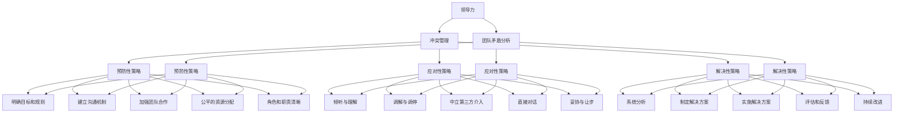

                 

  
### 引言：团队协作的挑战与领导力的作用

在当今复杂多变的环境中，团队协作已经成为组织成功的关键因素。然而，团队协作并非一帆风顺，各种矛盾和冲突时常出现。团队成员之间的差异、目标不一致、资源分配不均等问题，都可能成为团队发展的障碍。在这种背景下，领导力的重要性愈发凸显，而冲突管理则是领导力中不可或缺的一部分。

本文旨在探讨领导力与冲突管理在团队协作中的应用，通过深入分析相关核心概念，帮助读者理解如何在团队中化解矛盾，促进协作。文章将从以下几个方面展开：

1. **领导力基础**：介绍领导力的核心概念与特点，以及领导者应具备的素质和职责。
2. **冲突管理原理**：探讨冲突的类型、冲突管理的策略和方法，以及冲突管理的模型。
3. **团队矛盾分析**：分析团队矛盾的表现、原因，并介绍相应的分析工具。
4. **矛盾化解策略**：提供预防性、应对性和解决性的策略，帮助领导者有效管理团队冲突。
5. **实战案例**：通过具体案例，展示如何在实践中运用冲突管理策略。

通过这些内容，本文希望能够为读者提供实用的指导，帮助他们在团队协作中更好地发挥领导力，化解矛盾，实现团队目标。

### 领导力基础

领导力是一种能够激发和引导团队成员，实现共同目标的能力。它不仅仅涉及个人素质，还包括一系列的行为和技巧。要理解领导力，首先需要了解其核心概念与特点。

#### 1.1 领导力的定义与特点

领导力的定义多种多样，但普遍认为它是一种影响力，能够引导和激励他人为实现共同目标而努力。领导力的特点包括：

- **影响力**：领导力是通过影响力来实现的，这种影响力可以是权威、信任或者其他形式的吸引力。
- **目标导向**：领导力需要明确的目标，并引导团队朝着这些目标前进。
- **适应性**：领导者需要能够适应不同的环境和情况，灵活调整自己的领导风格。
- **沟通能力**：有效的沟通是领导力的核心，领导者需要具备清晰、准确的沟通技巧。
- **激励能力**：领导者需要能够激励团队成员，使其在面临困难和挑战时保持积极的态度。

#### 1.2 领导者角色与责任

领导者不仅仅是团队的领导者，更是团队成员的导师、支持和伙伴。领导者需要承担以下角色和责任：

- **愿景制定者**：领导者需要为团队制定清晰的愿景和目标，激发团队成员的热情和动力。
- **沟通者**：领导者需要与团队成员保持良好的沟通，确保信息的透明和有效传递。
- **协调者**：领导者需要协调团队成员之间的合作，解决潜在的冲突和矛盾。
- **支持者**：领导者需要为团队成员提供支持和资源，帮助其克服困难，实现个人和团队的目标。
- **变革推动者**：领导者需要推动团队的变革，适应外部环境的变化，保持团队的活力和竞争力。

#### 1.3 领导力发展路径

领导力并非与生俱来，而是可以通过学习和实践逐步发展的。以下是一些领导力发展的路径：

- **自我认知**：领导者需要深入了解自己，包括自己的优点、缺点、价值观和动机。
- **持续学习**：领导者需要不断学习新知识、新技能，以适应不断变化的环境。
- **实践与反思**：通过实践，领导者可以将理论知识转化为实际能力，并通过反思不断改进自己的领导方法。
- **建立人际关系**：领导者需要建立广泛的人际关系网，获取支持和资源。
- **接受挑战**：领导者需要勇于接受各种挑战，从中学习和成长。

总之，领导力是团队协作中不可或缺的一部分。通过理解领导力的核心概念与特点，以及领导者应具备的角色和责任，我们可以更好地发挥领导力，化解团队冲突，实现团队目标。

### 冲突管理原理

在团队协作过程中，冲突是不可避免的。有效的冲突管理能够帮助团队在冲突中找到解决问题的方法，而不是让冲突升级，影响团队的整体效率。以下将探讨冲突管理的核心概念，包括冲突的类型、管理策略和冲突管理模型。

#### 2.1 冲突的类型

冲突可以分为功能性冲突和破坏性冲突。

- **功能性冲突**：功能性冲突是指那些有益于团队进步的冲突。这种冲突可以激发团队成员的创造性思维，推动团队改进工作流程和决策。例如，团队成员对项目目标的不同看法，可能会导致更好的解决方案。
- **破坏性冲突**：破坏性冲突是指那些对团队产生负面影响的冲突。这种冲突可能导致团队成员之间的不信任和敌对，降低团队的工作效率和士气。例如，团队成员因个人利益而引发的争执，可能会破坏团队的和谐。

了解冲突的类型对于制定有效的冲突管理策略至关重要。

#### 2.2 冲突管理策略

冲突管理策略可以分为预防性策略、应对性策略和解决性策略。

- **预防性策略**：预防性策略旨在通过建立良好的团队文化和工作环境，减少冲突的发生。这些策略包括：
  - **明确目标和规则**：确保团队成员对目标和规则有清晰的认识，减少因误解而引发的冲突。
  - **建立沟通机制**：通过定期的会议、反馈和交流，促进团队成员之间的沟通和理解。
  - **加强团队合作**：通过团队合作活动，增强团队成员之间的相互信任和合作精神。
  
- **应对性策略**：应对性策略是在冲突已经发生时采取的措施。这些策略包括：
  - **倾听与理解**：领导者需要倾听团队成员的意见，并试图理解他们的立场和感受。
  - **调解与调停**：在冲突双方无法自行解决问题时，领导者可以介入，充当调解者，帮助双方找到共同点。
  - **中立第三方**：在某些情况下，引入中立第三方（如人力资源部门或外部顾问）来处理冲突可能更为有效。

- **解决性策略**：解决性策略是最终解决冲突的方法。这些策略包括：
  - **直接对话**：鼓励冲突双方进行面对面的沟通，直接表达自己的观点和感受。
  - **妥协与让步**：在某些情况下，通过妥协和让步来达成双方都能接受的解决方案是必要的。
  - **法律途径**：如果冲突严重，且无法通过内部解决，可能需要通过法律途径来解决。

#### 2.3 冲突管理模型

冲突管理模型是指导领导者进行冲突管理的方法和框架。以下是一些常见的冲突管理模型：

- **托马斯-基尔曼冲突管理模型**：该模型将冲突管理策略分为五种类型，即避免、缓和、妥协、竞争和合作。领导者可以根据不同的情况选择合适的策略。
- **双环模型**：该模型认为冲突管理包括两个环：内部环和外部环。内部环关注团队内部的互动和沟通，外部环关注团队与环境的关系。领导者需要平衡这两个环，以实现有效的冲突管理。
- **五要素模型**：该模型将冲突管理分为五个要素，即沟通、协作、共识、决策和执行。领导者需要在这些要素上投入时间和精力，以确保冲突得到有效管理。

通过理解冲突的类型、管理策略和冲突管理模型，领导者可以更好地应对团队中的冲突，促进团队协作和目标实现。

### 团队矛盾分析

团队矛盾是团队协作中常见的问题，对团队的整体效率和工作氛围产生负面影响。为了有效解决团队矛盾，首先需要了解矛盾的表现、原因，并运用适当的工具进行分析。

#### 3.1 团队矛盾的表现

团队矛盾的表现形式多样，以下是一些常见的表现：

- **沟通不畅**：团队成员之间缺乏有效的沟通，导致误解和冲突。
- **目标不一致**：团队成员对团队目标的理解不一致，导致工作方向不统一。
- **个人冲突**：团队成员之间的个人关系紧张，可能因性格、价值观或利益冲突而引发矛盾。
- **资源分配不均**：团队内资源分配不合理，导致部分成员感到不公平。
- **角色模糊**：团队成员对各自的角色和职责认识不清，导致工作重叠或责任缺失。

了解团队矛盾的表现有助于识别和解决具体问题。

#### 3.2 团队矛盾的原因

团队矛盾的原因复杂多样，以下是一些常见的原因：

- **沟通障碍**：团队成员之间的沟通不畅，导致信息传递不准确或延误。
- **目标不一致**：团队成员对团队目标的理解不同，导致工作方向不明确或冲突。
- **个人性格差异**：团队成员的性格差异，可能导致彼此之间的冲突和误解。
- **资源有限**：团队资源有限，导致成员之间为争夺资源而产生矛盾。
- **组织结构问题**：团队的组织结构不合理，可能导致职责分工不清或沟通不畅。

了解团队矛盾的原因有助于制定针对性的解决方案。

#### 3.3 团队矛盾分析工具

为了深入分析团队矛盾，可以运用以下工具：

- **5W2H分析法**：通过提问“是什么、为什么、谁、何时、何地、如何做”，帮助团队成员理清矛盾的本质和原因。
- **SWOT分析法**：通过分析团队的优势、劣势、机会和威胁，帮助团队识别矛盾的关键因素。
- **利益相关者分析**：通过识别团队内外部的利益相关者，分析他们与团队矛盾的关系，有助于找到解决方案。
- **团队访谈**：通过与团队成员进行一对一或小组访谈，深入了解团队成员的感受和看法，有助于识别和解决矛盾。

运用这些工具，领导者可以全面分析团队矛盾，为有效解决提供依据。

### 矛盾化解策略

在团队中，矛盾是不可避免的。关键在于如何有效地化解矛盾，以促进团队协作和目标实现。以下介绍预防性策略、应对性策略和解决性策略，帮助领导者和管理者有效管理团队矛盾。

#### 4.1 预防性策略

预防性策略旨在通过建立良好的团队文化和工作环境，减少矛盾的发生。以下是一些有效的预防性策略：

- **明确目标和规则**：确保团队成员对目标和规则有清晰的认识，减少因误解而引发的矛盾。可以通过制定详细的团队目标和规则手册，让每个成员都了解自己的职责和团队的整体目标。
- **建立沟通机制**：通过定期的会议、反馈和交流，促进团队成员之间的沟通和理解。建立开放、透明的沟通渠道，鼓励成员提出意见和建议，有助于及早发现和解决潜在矛盾。
- **加强团队合作**：通过团队合作活动，增强团队成员之间的相互信任和合作精神。可以组织团队建设活动，如团队拓展训练、团队合作游戏等，加强成员之间的了解和信任。
- **公平的资源分配**：确保团队资源分配合理，减少因资源争夺而引发的矛盾。可以通过制定公平的资源分配规则，明确资源的获取和使用流程，确保每个成员都有公平的机会和资源。
- **角色和职责清晰**：确保团队成员对各自的角色和职责有清晰的认识，减少因角色重叠或责任缺失而引发的矛盾。可以通过制定详细的职责说明书，明确每个成员的职责和权限，避免职责不清或冲突。

#### 4.2 应对性策略

当矛盾已经发生时，应对性策略可以帮助领导者和管理者及时解决问题。以下是一些应对性策略：

- **倾听与理解**：领导者需要倾听团队成员的意见，并试图理解他们的立场和感受。通过有效的倾听，可以更好地了解矛盾的本质和原因，为后续解决提供依据。
- **调解与调停**：在冲突双方无法自行解决问题时，领导者可以介入，充当调解者，帮助双方找到共同点。通过中立的第三方角色，可以降低双方的对立情绪，促进沟通和协商。
- **中立第三方介入**：在某些情况下，引入中立第三方（如人力资源部门或外部顾问）来处理冲突可能更为有效。中立第三方可以提供客观、公正的意见和建议，帮助双方找到解决问题的方法。
- **直接对话**：鼓励冲突双方进行面对面的沟通，直接表达自己的观点和感受。通过直接对话，可以减少误解和误会，找到解决问题的方法。
- **妥协与让步**：在某些情况下，通过妥协和让步来达成双方都能接受的解决方案是必要的。领导者需要平衡双方的利益和需求，促进达成共识。

#### 4.3 解决性策略

解决性策略是最终解决团队矛盾的方法。以下是一些解决性策略：

- **系统分析**：对矛盾进行系统分析，找出根本原因。可以通过5W2H分析法、SWOT分析法等工具，深入分析矛盾的本质和原因，为制定解决方案提供依据。
- **制定解决方案**：根据系统分析的结果，制定具体的解决方案。解决方案应包括短期和长期措施，以及具体的执行步骤和责任人。
- **实施解决方案**：按照制定的解决方案，实施具体的措施。在实施过程中，领导者需要监督和指导，确保解决方案的有效执行。
- **评估和反馈**：在解决方案实施后，对效果进行评估和反馈。通过评估和反馈，可以了解解决方案的执行情况，发现不足之处，并及时调整和改进。
- **持续改进**：解决矛盾不是一次性的工作，领导者需要持续关注团队动态，及时发现和解决新出现的矛盾。通过持续改进，不断提高团队的协作能力和工作效率。

通过预防性策略、应对性策略和解决性策略，领导者可以有效地管理团队矛盾，促进团队协作和目标实现。

### 实战案例

为了更好地理解团队矛盾化解策略在实际中的应用，下面我们将通过三个具体案例来详细说明如何在团队中有效运用这些策略。

#### 5.1 案例一：团队沟通障碍

**背景**：在一个项目团队中，由于成员来自不同的部门，彼此之间缺乏有效的沟通，导致项目进展缓慢，成员之间出现不满情绪。

**分析**：通过访谈和观察，发现团队沟通障碍的主要原因是信息传递不及时和不准确，团队成员对项目目标的理解存在差异。

**解决方案**：
1. **预防性策略**：建立定期沟通机制，每周举行项目进度会议，让每个成员分享自己的工作进展和遇到的困难。
   ```plaintext
   团队领导：大家好，每周的项目进度会议现在开始。请每个成员介绍一下自己的工作进展，如果有问题或者建议，请随时提出。
   成员A：我的任务已完成80%，但在某个环节遇到了问题，希望得到大家的帮助。
   成员B：我也遇到了类似的问题，我们可以一起讨论一下。
   ```
2. **应对性策略**：设立专门的沟通协调人，负责整理和传达项目信息，确保信息的准确性和及时性。
   ```plaintext
   沟通协调人：本周的项目报告已经整理完毕，我已经发送到群里，请每个成员仔细阅读，如果有疑问，请及时提出。
   ```
3. **解决性策略**：对于项目中出现的具体问题，组织专项讨论会，让相关成员直接对话，共同寻找解决方案。
   ```plaintext
   团队领导：关于任务A中的问题，我们今天组织一个专项讨论会，请大家准时参加，我们共同解决。
   ```

**效果**：通过上述措施，团队沟通得到了显著改善，项目进展速度加快，成员之间的不满情绪也得到缓解。

#### 5.2 案例二：资源分配不均

**背景**：团队中某些成员认为资源分配不均，导致工作量过大，工作压力增加，影响了工作效率和士气。

**分析**：通过调查发现，资源分配不均的主要原因是团队成员对资源的需求和优先级认识不一致，团队领导在资源分配上缺乏透明度。

**解决方案**：
1. **预防性策略**：明确资源需求，制定资源分配计划，确保每个成员都能参与到资源分配的决策过程中。
   ```plaintext
   团队领导：请大家在本周内提出自己的资源需求，我们将根据需求制定资源分配计划。
   ```
2. **应对性策略**：设立资源协调人，负责资源需求的收集和分配，确保资源的公平和合理。
   ```plaintext
   资源协调人：我已经收到大家的资源需求，正在制定分配方案，稍后会通知大家。
   ```
3. **解决性策略**：对于资源分配中出现的矛盾，组织讨论会，让相关成员直接表达自己的需求和看法，共同协商解决方案。
   ```plaintext
   团队领导：关于资源分配的问题，我们今天组织一个讨论会，请大家提出自己的意见和建议。
   ```

**效果**：通过上述措施，团队成员对资源分配的公平性有了更清晰的认识，工作压力得到了缓解，工作效率和士气得到了提升。

#### 5.3 案例三：个人目标冲突

**背景**：团队成员个人目标与团队目标之间存在冲突，导致个人与团队之间的矛盾。

**分析**：通过访谈和观察，发现个人目标冲突的主要原因是团队成员对个人和团队的期望存在差异，部分成员认为个人目标与团队目标之间存在矛盾。

**解决方案**：
1. **预防性策略**：明确个人与团队目标的关系，鼓励团队成员设定符合团队目标的个人目标。
   ```plaintext
   团队领导：请大家设定自己的个人目标，但请注意，个人目标应该与团队目标保持一致。
   ```
2. **应对性策略**：通过一对一沟通，了解团队成员的个人目标和顾虑，提供必要的支持和帮助。
   ```plaintext
   团队领导：我了解到你希望在项目中获得更多的发展机会，我们会尽量为你提供这样的机会。
   ```
3. **解决性策略**：对于个人目标冲突，组织讨论会，让团队成员共同探讨如何平衡个人和团队目标。
   ```plaintext
   团队领导：关于个人目标与团队目标的冲突，我们今天组织一个讨论会，希望大家能够找到解决问题的方法。
   ```

**效果**：通过上述措施，团队成员对个人目标与团队目标的平衡有了更清晰的认识，个人与团队之间的矛盾得到了有效缓解，团队整体目标得以顺利实现。

### 总结

通过以上三个案例，我们可以看到，有效的团队矛盾化解策略需要预防性策略、应对性策略和解决性策略的结合应用。在具体实施过程中，领导者需要根据实际情况灵活调整策略，确保团队协作的顺畅和目标的实现。

### 附录：核心概念与联系

为了更好地理解文章中提到的核心概念，我们在这里提供一个Mermaid流程图，展示领导力、冲突管理、团队矛盾分析以及矛盾化解策略之间的关系。



通过这个流程图，我们可以清晰地看到领导力、冲突管理和团队矛盾分析之间的关系，以及如何通过不同的策略来化解团队矛盾。这为领导者提供了一个实用的框架，以便在实际工作中有效应用这些策略。

### 结论

领导力与冲突管理是团队协作中不可或缺的两个方面。有效的领导力能够激发团队成员的潜能，推动团队目标的实现；而有效的冲突管理则能够化解团队中的矛盾，确保团队的稳定和高效运作。通过本文的探讨，我们了解到领导力的核心概念、冲突管理的原理、团队矛盾的表现与原因，以及各种化解策略的应用。

在团队协作中，领导者需要根据实际情况灵活运用预防性策略、应对性策略和解决性策略，确保团队在面临挑战时能够保持稳定和高效。同时，领导者还需要不断学习、反思和改进，提升自己的领导力，以应对不断变化的环境。

为了更好地应用本文的理论和实践经验，以下是一些建议：

1. **明确目标和规则**：确保团队成员对团队目标和规则有清晰的认识，减少因误解而引发的矛盾。
2. **建立沟通机制**：定期举行团队会议，加强团队成员之间的沟通，提高团队协作效率。
3. **加强团队合作**：通过团队合作活动，增强团队成员之间的信任和合作精神。
4. **公平的资源分配**：确保团队资源分配合理，避免因资源争夺而引发的矛盾。
5. **角色和职责清晰**：明确团队成员的职责和角色，避免因职责不清而导致的矛盾。

最后，希望本文能够为读者在团队协作中提供有价值的指导，帮助他们在实际工作中更好地发挥领导力，有效管理团队冲突，实现团队目标。作者：AI天才研究院/AI Genius Institute & 禅与计算机程序设计艺术 /Zen And The Art of Computer Programming。感谢阅读！

