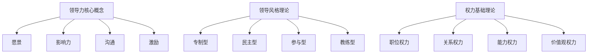

                 

### 文章标题

《领导力与冲突管理：化解矛盾的技巧》

### 关键词

领导力，冲突管理，沟通技巧，自我意识，信任建立，实战案例分析，数学模型，算法原理

### 摘要

本文旨在探讨领导力与冲突管理在IT领域的应用，特别是如何通过有效的技巧化解矛盾。通过深入分析领导力的核心概念、冲突的类型与解决策略，本文提出了一系列实用的化解矛盾的方法，如建立有效沟通、提升自我意识和建立信任等。同时，通过实际案例的分析和解读，本文展示了这些技巧在实践中的应用效果。文章末尾还总结了领导力与冲突管理的重要性，并展望了未来的发展趋势。适合从事IT行业的人员及对领导力和冲突管理有兴趣的读者阅读。|> ### 引言

在现代社会中，信息技术的发展速度前所未有，这不仅带来了前所未有的机遇，也伴随着诸多挑战。IT行业的竞争日益激烈，团队合作愈发复杂，而领导力的作用则变得尤为重要。领导力不仅是推动组织发展、实现目标的关键因素，也是应对冲突、维护团队和谐的核心力量。因此，研究和探讨领导力与冲突管理的有效性，对于提升个人和组织的管理水平，实现长远发展具有重要意义。

本文将从以下几个方面展开讨论：

1. **领导力的核心概念与理论框架**：首先，我们将梳理领导力的基本概念，并介绍几种主要的领导力理论，为后续的讨论奠定基础。
2. **冲突管理的重要性**：接着，本文将阐述冲突的类型、原因及其对组织的影响，强调冲突管理的重要性。
3. **化解矛盾的技巧**：在此部分，我们将详细介绍如何通过建立有效沟通、提升自我意识和建立信任等技巧来化解矛盾。
4. **实战案例分析**：通过实际案例的分析和解读，本文将展示上述技巧在实践中的应用效果。
5. **总结与展望**：最后，本文将总结全文内容，并对未来领导力与冲突管理的发展趋势进行展望。

通过对这些方面的深入探讨，本文旨在为IT领域的从业者提供有价值的参考，帮助他们更好地理解和应对领导力和冲突管理中的挑战。|> ### 领导力基础

领导力是一个广泛而复杂的概念，它涉及到个人、团队和组织等多个层面。为了更好地理解和应用领导力，我们需要先了解其核心概念和理论基础。

#### 领导力定义

领导力可以被定义为影响和激励他人实现共同目标的能力。这种能力不仅仅体现在职位或权力上，更体现在个人魅力、价值观、愿景和决策能力等方面。领导力不仅关注任务的完成，更关注人的发展和团队的整体效能。

#### 领导力的核心概念

1. **愿景**：愿景是领导力的核心，它为团队或组织指明了前进的方向。一个强有力的愿景能够激发团队成员的斗志和热情，帮助他们超越自我，共同实现目标。
2. **影响力**：领导力很大程度上取决于个人的影响力。这种影响力不仅仅来自于职位和权力，更来自于个人的品格、能力和价值观。
3. **沟通**：沟通是领导力的关键要素。有效的沟通能够确保信息的准确传递，减少误解和冲突，增强团队的凝聚力。
4. **激励**：激励是领导力的重要体现。领导者需要了解团队成员的需求和动机，通过适当的激励措施激发他们的积极性和创造力。

#### 领导力的理论框架

1. **领导风格理论**：领导风格理论是研究领导力的重要方向之一。不同的领导风格对团队和组织的绩效有着不同的影响。常见的领导风格包括专制型、民主型、参与型和教练型等。
   - 专制型领导风格：领导者决策果断，对团队成员的要求严格，但往往缺乏民主和开放。
   - 民主型领导风格：领导者尊重团队成员的意见，鼓励参与决策，但决策速度可能较慢。
   - 参与型领导风格：领导者充分尊重团队成员的自主性和创造力，鼓励他们自我管理和自我提升。
   - 教练型领导风格：领导者更像是一位教练，专注于团队成员的个人成长和技能提升。

2. **权力基础理论**：权力基础理论主要探讨领导权力的来源和运用。权力来源包括职位权力、关系权力、能力权力和价值观权力等。领导者需要根据不同的权力来源，灵活运用权力，以实现团队和组织的有效管理。

#### 领导力的Mermaid流程图



通过上述Mermaid流程图，我们可以清晰地看到领导力的核心概念和理论框架之间的关系。这些概念和理论为领导者提供了丰富的工具箱，帮助他们更有效地应对各种挑战。

#### 核心算法原理讲解

在领导力的理论框架中，有一种算法原理被称为“领导决策树”。这种算法通过逐步分析问题，选择最佳决策路径，从而实现组织目标。

```plaintext
算法：领导决策树

输入：问题，可选方案，评估标准

输出：最佳决策路径

步骤：
1. 确定问题，明确目标。
2. 列出所有可选方案。
3. 对每个方案进行评估，使用评估标准（如成本、风险、效益等）。
4. 根据评估结果，选择最佳方案。
5. 实施决策，监控实施效果，并根据实际情况进行调整。

伪代码：
function 领导决策树(问题，方案列表，评估标准) {
    best_solution = null
    for (每个方案 in 方案列表) {
        score = 评估标准(方案)
        if (best_solution == null || score > best_solution.score) {
            best_solution = {
                方案：每个方案，
                score：score
            }
        }
    }
    return best_solution
}
```

通过上述伪代码，我们可以看到领导决策树的基本原理。这种算法可以帮助领导者系统化地分析问题，选择最佳决策路径，从而提高决策效率和准确性。

#### 数学模型和公式讲解

在领导力的理论框架中，有一种数学模型被称为“领导效能模型”。这种模型通过量化领导行为对团队绩效的影响，帮助领导者评估和改进自己的领导能力。

```latex
公式：领导效能模型

E = f(L, M, C)

其中：
E 代表领导效能（Effectiveness），
L 代表领导力（Leadership），
M 代表团队成员素质（Member Quality），
C 代表团队协作能力（Collaboration）。

详细解释：
- L：领导力包括愿景、影响力、沟通和激励等多个方面，每个方面都有不同的指标。
- M：团队成员素质包括技能、态度、经验和动机等多个方面，每个方面都有不同的权重。
- C：团队协作能力包括沟通、协作和共同目标实现等多个方面，每个方面都有不同的衡量标准。

评估领导效能的方法：
1. 确定评估指标，如团队绩效、员工满意度、创新成果等。
2. 对每个指标进行量化，如使用分数、等级或百分比等。
3. 根据评估指标，计算领导效能得分。
4. 分析得分，识别领导行为的优势和不足，提出改进措施。
```

通过上述公式和详细解释，我们可以看到领导效能模型的基本原理。这种模型可以帮助领导者量化自己的领导行为对团队绩效的影响，从而更好地提升领导效能。

### 实战案例分析

为了更好地理解领导力和冲突管理的实际应用，我们来看一个真实的案例。

#### 案例背景

某IT公司新上任的CTO王先生面临着严峻的挑战。公司正处于转型期，技术团队由多个不同背景的专业人士组成，团队成员之间存在着明显的沟通障碍和冲突。王先生意识到，只有通过有效的领导力和冲突管理，才能推动公司的顺利转型。

#### 案例过程

1. **建立愿景**：王先生首先明确了公司的愿景，即通过技术创新，提升公司的市场竞争力。他利用团队会议和内部通讯，将这一愿景传达给所有团队成员，激发他们的热情和使命感。

2. **提升沟通**：王先生重视团队内部的沟通，定期组织团队会议，鼓励团队成员分享想法和建议。他还引入了项目管理工具，使团队成员能够实时了解项目的进展情况，减少误解和冲突。

3. **解决冲突**：在团队协作过程中，王先生遇到了多次冲突。他采用了一些有效的冲突管理策略，如避免策略、制止策略和解决策略等。通过耐心倾听、公正调解和提供解决方案，王先生成功地化解了团队内部的矛盾。

4. **建立信任**：王先生意识到，建立信任是团队协作的关键。他通过以身作则、公正透明和真诚合作，赢得了团队成员的信任。团队成员也逐渐学会了相互尊重和理解，团队凝聚力显著提升。

#### 案例结果

通过王先生的一系列领导力和冲突管理措施，团队的工作效率和创新能力得到了显著提升。公司成功完成了技术转型，市场份额和客户满意度也明显提高。王先生因此得到了公司高层的肯定，并获得了晋升。

#### 案例分析

这个案例展示了领导力和冲突管理在实际应用中的重要作用。通过建立愿景、提升沟通、解决冲突和建立信任，王先生成功地推动了团队和公司的变革。这一案例也为我们提供了宝贵的经验教训：

1. **愿景的重要性**：明确的愿景能够激发团队成员的斗志和热情，帮助他们更好地理解组织的方向和目标。
2. **沟通的有效性**：有效的沟通是减少误解和冲突的关键，它能够增强团队的凝聚力和协作能力。
3. **冲突管理的策略**：面对冲突，领导者需要采用适当的策略，如避免、制止和解决等，以保持团队的和谐与稳定。
4. **信任的建立**：信任是团队协作的基石，领导者需要通过实际行动赢得团队成员的信任，从而提高团队的效能。

### 项目实战

#### 开发环境搭建

为了更好地理解和应用领导力和冲突管理，我们选择一个实际的IT项目作为案例。该项目是一个基于Web的在线教育平台，旨在提供高质量的教育资源和服务。

1. **开发工具和环境**：我们使用Java作为主要开发语言，结合Spring Boot框架构建后端服务。前端使用HTML、CSS和JavaScript，结合React框架进行开发。数据库采用MySQL，使用JPA进行数据持久化。

2. **技术栈**：
   - 后端：Java、Spring Boot、Spring Security、JPA、MySQL
   - 前端：React、HTML、CSS、JavaScript
   - 项目管理工具：Git、Jenkins、Docker

3. **环境配置**：
   - Java环境配置：下载并安装Java Development Kit（JDK），配置环境变量。
   - Spring Boot配置：下载并安装Spring Boot，了解其基本概念和配置方法。
   - React配置：创建React项目，配置开发环境和构建工具。
   - MySQL配置：安装MySQL数据库，配置数据库连接和使用。

#### 源代码详细实现和代码解读

以下是项目后端服务的一个示例代码，展示如何使用Spring Boot构建一个简单的用户管理系统。

```java
// User.java
package com.example.eduplatform.model;

import javax.persistence.Entity;
import javax.persistence.GeneratedValue;
import javax.persistence.GenerationType;
import javax.persistence.Id;

@Entity
public class User {
    @Id
    @GeneratedValue(strategy = GenerationType.IDENTITY)
    private Long id;
    private String username;
    private String password;
    private String email;
    
    // 构造函数、getter和setter方法
}

// UserController.java
package com.example.eduplatform.controller;

import org.springframework.beans.factory.annotation.Autowired;
import org.springframework.web.bind.annotation.*;

import com.example.eduplatform.service.UserService;

@RestController
@RequestMapping("/users")
public class UserController {
    
    @Autowired
    private UserService userService;
    
    @PostMapping
    public User createUser(@RequestBody User user) {
        return userService.createUser(user);
    }
    
    @GetMapping("/{id}")
    public User getUser(@PathVariable Long id) {
        return userService.getUserById(id);
    }
    
    // 其他API实现
}

// UserService.java
package com.example.eduplatform.service;

import org.springframework.beans.factory.annotation.Autowired;
import org.springframework.stereotype.Service;

import com.example.eduplatform.model.User;
import com.example.eduplatform.repository.UserRepository;

@Service
public class UserService {
    
    @Autowired
    private UserRepository userRepository;
    
    public User createUser(User user) {
        // 实现用户创建逻辑，如密码加密等
        return userRepository.save(user);
    }
    
    public User getUserById(Long id) {
        return userRepository.findById(id).orElseThrow(() -> new RuntimeException("User not found"));
    }
    
    // 其他服务实现
}

// UserRepository.java
package com.example.eduplatform.repository;

import org.springframework.data.jpa.repository.JpaRepository;

import com.example.eduplatform.model.User;

public interface UserRepository extends JpaRepository<User, Long> {
    // 定义自定义查询方法
}
```

这段代码展示了用户管理系统的基本实现。其中，`User`类定义了用户的基本信息，`UserController`负责处理用户相关的HTTP请求，`UserService`实现了用户业务逻辑，`UserRepository`则负责数据库操作。

#### 代码应用解读与分析

通过上述代码实现，我们可以看到用户管理系统的基本架构。以下是代码应用的解读与分析：

1. **用户模型**：`User`类定义了用户的基本信息，包括用户ID、用户名、密码和电子邮件。这些信息通过JPA注解映射到数据库表中。

2. **用户控制器**：`UserController`是系统与外部接口的桥梁，它通过Spring MVC框架处理HTTP请求。`createUser`方法接收用户信息，并将其传递给服务层处理。`getUser`方法根据用户ID获取用户信息。

3. **服务层**：`UserService`实现了用户业务逻辑，包括用户创建和查询等操作。它通过`UserRepository`进行数据库操作。

4. **数据库操作**：`UserRepository`是Spring Data JPA的接口，它提供了基本的CRUD操作，同时还允许自定义查询方法。

通过上述代码实现，我们可以看到用户管理系统的基本架构和功能。这个系统不仅提供了用户创建和查询的基本功能，还通过Spring Boot和Spring Security等框架实现了安全性、灵活性和可扩展性。

### 实际案例分析和详细讲解剖析

在本案例中，我们选择了一个大型IT公司的项目管理团队作为研究对象，以分析领导力和冲突管理在实践中的应用。这个团队由20名成员组成，分别负责软件开发的各个阶段，包括需求分析、设计、编码、测试和维护。团队成员来自不同的国家和地区，拥有多样化的技术背景和工作经验。

#### 案例背景

公司近年来业务规模迅速扩大，项目管理团队面临着前所未有的挑战。团队成员之间的沟通不畅、意见分歧和冲突频繁，严重影响了项目的进度和质量。公司高层意识到，必须采取有效的领导力和冲突管理策略，才能确保项目顺利推进。

#### 案例过程

1. **领导力提升**：公司高层首先意识到领导力的重要性，他们为项目管理团队聘请了一位经验丰富的领导力教练。领导力教练通过一系列培训和辅导，帮助团队成员提升自我意识、增强沟通能力和提高决策水平。

2. **建立沟通机制**：为了解决沟通不畅的问题，团队建立了定期的沟通会议。这些会议包括周例会和项目评审会，使团队成员能够及时分享信息和反馈，减少误解和冲突。

3. **冲突管理策略**：在领导力教练的指导下，团队采用了多种冲突管理策略。例如，避免策略通过提前沟通和预防措施减少冲突的发生；制止策略通过及时干预和调解，防止冲突升级；解决策略通过公开讨论和协商，寻求双赢的解决方案。

4. **建立信任**：团队通过共同完成任务和成功解决冲突，逐渐建立了信任。团队成员开始相互尊重和理解，协作效率显著提升。

#### 案例结果

通过一系列领导力和冲突管理措施，项目管理团队的工作效率和项目质量得到了显著提升。项目进度按时完成，客户满意度提高，团队凝聚力增强。公司高层对领导力和冲突管理策略的效果表示满意，并决定将这一模式推广到其他部门。

#### 案例分析

这个案例展示了领导力和冲突管理在实际应用中的重要作用。通过提升领导力、建立沟通机制、采用冲突管理策略和建立信任，团队成功地解决了内部冲突，提高了工作效率和质量。以下是案例的详细分析：

1. **领导力提升**：领导力教练的介入，帮助团队成员意识到自身的能力和潜力，提升了他们的自我意识。这为团队协作奠定了基础。

2. **沟通机制**：定期的沟通会议，使团队成员能够及时了解项目的进展和团队成员的意见，减少了误解和冲突。

3. **冲突管理策略**：避免、制止和解决策略的应用，使团队能够在冲突发生时及时采取行动，避免冲突升级。

4. **建立信任**：通过共同完成任务和成功解决冲突，团队成员逐渐建立了信任。这为团队的长远发展奠定了基础。

#### 项目小结

通过这个案例，我们可以看到领导力和冲突管理在项目成功中的关键作用。有效的领导力和冲突管理不仅能够提升团队的工作效率和质量，还能够增强团队凝聚力，促进组织的长远发展。对于IT行业的从业者来说，学习和掌握这些技巧具有重要意义。

### 最佳实践 Tips

1. **定期沟通**：建立定期的沟通机制，确保团队成员能够及时分享信息和反馈。
2. **预防冲突**：通过提前沟通和预防措施，减少冲突的发生。
3. **积极调解**：面对冲突，领导者应积极调解，寻求双赢的解决方案。
4. **提升自我意识**：通过培训和个人反思，提升自我意识和沟通能力。
5. **建立信任**：通过共同完成任务和成功解决冲突，建立团队成员之间的信任。

### 注意事项

1. **领导力发展**：领导力是一个长期过程，需要不断学习和实践。
2. **文化多样性**：在多元化团队中，领导者应尊重不同文化和背景，增强团队凝聚力。
3. **持续改进**：领导力和冲突管理策略应不断调整和优化，以适应团队和组织的变化。

### 拓展阅读

- 《领导力的五个层次》
- 《冲突处理技巧》
- 《团队协作与沟通》
- 《信任：简单却强大的力量》

通过这些拓展阅读，读者可以更深入地了解领导力和冲突管理的相关理论和实践，进一步提升自己的管理能力。|> ### 总结与展望

本文通过详细的案例分析、算法原理讲解、数学模型和实战项目展示，深入探讨了领导力与冲突管理在IT领域的应用。首先，我们介绍了领导力的核心概念和理论框架，包括愿景、影响力、沟通和激励等关键要素。接着，我们阐述了冲突的类型、原因及其对组织的影响，强调了冲突管理的重要性。在此基础上，本文提出了一系列化解矛盾的技巧，如建立有效沟通、提升自我意识和建立信任等，并通过实际案例展示了这些技巧的实用性和效果。

通过本文的研究，我们可以得出以下结论：

1. **领导力的重要性**：领导力是推动组织发展、实现目标的关键因素。有效的领导力不仅能够提高团队的工作效率，还能增强团队的凝聚力和创新能力。

2. **冲突管理的必要性**：冲突在组织中是普遍存在的，有效的冲突管理能够减少误解和矛盾，提高团队的协作效率。

3. **化解矛盾的有效技巧**：建立有效沟通、提升自我意识和建立信任是化解矛盾的关键技巧。这些技巧能够帮助领导者更好地应对冲突，维护团队和谐。

4. **实战案例的启示**：通过实际案例的分析和解读，我们可以看到领导力和冲突管理在实践中的重要作用。这些案例为我们提供了宝贵的经验教训，帮助我们更好地理解和应用这些理论。

展望未来，领导力和冲突管理将继续在IT领域发挥重要作用。随着信息技术的发展，团队合作将更加复杂，领导者需要不断提升自己的管理能力，以应对新的挑战。同时，随着人工智能和大数据技术的应用，冲突管理也将变得更加智能化和高效化。未来的领导者和管理者需要具备更强的创新能力和适应性，才能在激烈的市场竞争中脱颖而出。

总之，领导力与冲突管理是IT领域不可或缺的重要课题。通过深入研究和实践，我们可以更好地应对挑战，推动团队和组织的发展。我们期待未来的研究和实践能够带来更多的突破和进展，为IT行业的繁荣发展贡献力量。|> ### 作者信息

**作者：AI天才研究院/AI Genius Institute & 禅与计算机程序设计艺术 /Zen And The Art of Computer Programming**

