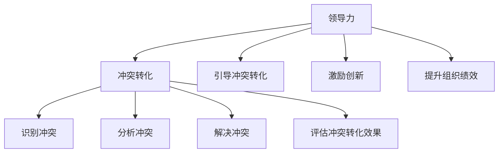
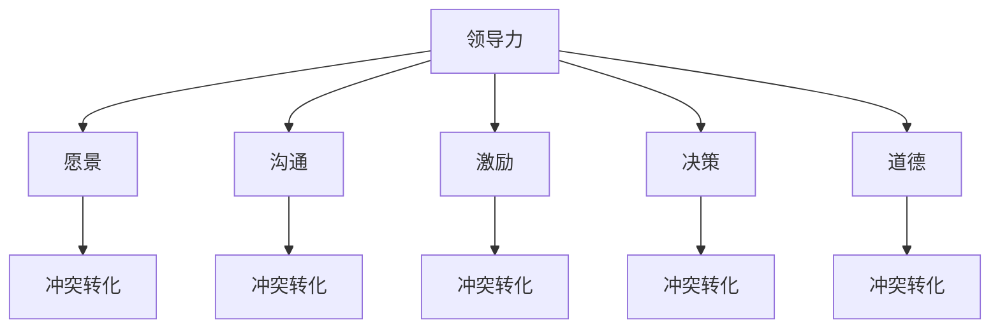

                 

### 文章标题

《领导力与冲突转化：将分歧转为创新动力》

### 关键词

领导力、冲突转化、创新动力、组织文化、可持续性发展

### 摘要

本文深入探讨了领导力与冲突转化的关系，以及如何通过冲突转化激发创新动力。通过系统地分析领导力的定义、类型，冲突转化的理论基础和实践策略，本文展示了领导力在促进冲突转化为创新动力中的关键作用。同时，文章还从个体、团队和组织层面提供了具体的冲突转化策略，并结合实际案例进行了详细解读。最终，本文提出了将冲突转化为创新动力的最佳实践，为领导者和组织提供了一套可操作的指导框架。

#### 基本框架

本文分为四个主要部分：

1. **领导力与冲突转化基础**：介绍领导力的定义、类型，冲突转化的概念、理论基础以及领导力与冲突转化的关系。
2. **冲突转化实践**：详细讨论个体、团队和组织层面的冲突转化策略，包括自我认知与情绪管理、沟通技巧、团队冲突识别与转化、组织冲突转化策略等。
3. **创新驱动与领导力**：分析冲突转化与创新的关系，探讨领导力在组织文化塑造和可持续性发展中的作用。
4. **案例分析与应用**：通过经典案例分析和现实世界中的应用，展示冲突转化与领导力的实际效果和操作方法。

#### 第一部分：领导力与冲突转化基础

##### 第1章：核心概念与联系

**1.1 领导力的定义与类型**

领导力是指个体或集体在引导、激励和影响他人实现共同目标过程中展现出的能力。根据不同的分类标准，领导力可以划分为多种类型：

- **权威型领导**：依赖职位和权力来影响他人。
- **民主型领导**：通过征求和考虑团队成员的意见来做出决策。
- **变革型领导**：通过激励和启发团队成员实现超越预期目标的变革。
- **交易型领导**：通过奖励和惩罚来激励团队成员。

**1.2 冲突转化的概念**

冲突转化是指将冲突中的负面因素转化为积极因素，从而实现问题的解决和创新。冲突转化的过程包括以下几个方面：

- **识别冲突**：发现并明确冲突的根源。
- **分析冲突**：理解冲突的本质和影响。
- **解决冲突**：采取有效策略将冲突转化为积极的解决方案。
- **评估冲突转化效果**：对冲突转化的结果进行评价和反馈。

**1.3 领导力与冲突转化的关系**

领导力在冲突转化中扮演着重要角色。一方面，领导力能够帮助个体和组织更好地识别和管理冲突，通过有效的沟通和协商将冲突转化为积极的解决方案。另一方面，冲突转化也为领导力提供了新的发展机会，通过创新和变革来提升组织绩效和可持续发展。

为了更好地理解领导力与冲突转化的关系，我们可以通过以下 Mermaid 流程图来展示核心概念与联系：

##### 第2章：冲突转化理论

**2.1 冲突理论的基本概念**

冲突是指个体、团队或组织之间因目标、资源、价值观等差异而产生的对立和紧张状态。冲突可以表现为言语冲突、行为冲突、心理冲突等不同形式。根据冲突的根源和性质，冲突可以划分为以下类型：

- **目标冲突**：因追求不同目标而产生的冲突。
- **资源冲突**：因争夺有限资源而产生的冲突。
- **价值观冲突**：因持有不同价值观而产生的冲突。

**2.2 冲突转化的理论基础**

冲突转化的理论基础包括以下几个方面：

- **博弈论**：通过分析不同参与者的策略和利益，寻求最优解决方案。
- **系统动力学**：研究系统内部各要素之间的相互影响和动态变化。
- **认知心理学**：探讨个体在冲突过程中的思维方式和行为模式。

冲突转化的原则包括：

- **合作原则**：鼓励各方寻求共同利益，通过协商和合作解决问题。
- **共赢原则**：寻求各方的共赢，避免零和博弈。
- **开放性原则**：鼓励开放沟通，分享信息和资源。

冲突转化的策略包括：

- **调解**：通过第三方调解，帮助各方达成共识。
- **妥协**：在无法达成完全共识时，各方做出一定的让步。
- **创新**：通过创新思维和解决方案，将冲突转化为新的机会。

**2.3 冲突转化的案例分析**

以下是一个冲突转化的案例：

**案例背景**：某科技公司内部存在两个团队，团队A和团队B。由于工作目标和资源的冲突，两个团队之间产生了紧张关系。

**冲突转化过程**：

1. **识别冲突**：通过团队沟通，明确冲突的根源和影响。
2. **分析冲突**：分析冲突的本质和双方的利益诉求。
3. **解决冲突**：采用调解策略，邀请第三方协调员介入，帮助两个团队达成共识。
4. **评估冲突转化效果**：通过定期评估和反馈，确保冲突转化效果的持续性和稳定性。

通过这个案例，我们可以看到冲突转化的关键步骤和策略，以及冲突转化对组织发展的积极影响。

##### 第3章：领导力理论

**3.1 领导力理论的发展**

领导力理论的发展经历了多个阶段，从早期的特质理论、行为理论到当代的情境理论和变革理论，每种理论都从不同角度探讨了领导力的本质和作用。

- **特质理论**：认为领导力与个体的特质和性格相关。
- **行为理论**：关注领导者的行为模式和对团队的影响。
- **情境理论**：强调领导力应适应不同的环境和情境。
- **变革理论**：关注领导者在推动组织变革中的作用。

**3.2 领导力的关键要素**

领导力的关键要素包括以下几个方面：

- **愿景**：领导者对组织未来发展方向的清晰描述。
- **沟通**：领导者与团队成员之间的有效沟通和交流。
- **激励**：激发团队成员的积极性和创造力。
- **决策**：领导者做出关键决策的能力和水平。
- **道德**：领导者的道德标准和行为规范。

**3.3 领导力与组织绩效**

领导力对组织绩效具有重要影响。通过有效的领导力，领导者能够提升组织效率、增强团队凝聚力、推动组织创新和发展。具体来说，领导力与组织绩效的关系可以从以下几个方面体现：

- **提高工作效率**：领导者通过有效的规划和组织，提高团队的工作效率和产出。
- **增强团队凝聚力**：领导者通过建立共同愿景和目标，增强团队成员之间的合作和信任。
- **推动组织创新**：领导者鼓励创新思维和实践，推动组织不断进步和发展。
- **提升组织绩效**：领导力的提升直接导致组织绩效的改善，从而实现组织的长期发展。

为了更好地理解领导力与冲突转化的关系，我们可以通过以下 Mermaid 流程图来展示核心概念与联系：

#### 第二部分：冲突转化实践

##### 第4章：个体层面的冲突转化策略

**4.1 自我认知与情绪管理**

个体层面的冲突转化策略首先需要关注自我认知和情绪管理。自我认知是指个体对自己性格、能力、价值观等内在特质的认识和了解。情绪管理则是指个体在冲突过程中如何控制和调节自己的情绪，保持冷静和理性。

**自我认知的重要性**：

- **提高沟通效果**：通过自我认知，个体能够更好地理解自己的需求和期望，从而在沟通中表达清晰、准确。
- **减少误解和冲突**：自我认知有助于个体识别和避免因误解而产生的冲突。
- **增强决策能力**：自我认知使个体能够更客观地评估自己和他人，从而做出更明智的决策。

**情绪管理的技巧**：

- **深呼吸**：在冲突发生时，通过深呼吸来放松身心，降低情绪的激烈程度。
- **积极思考**：用积极的态度来应对冲突，避免消极情绪的影响。
- **转移注意力**：将注意力从冲突转移到其他积极的事物上，减少情绪的负面影响。

**案例研究**：

某技术团队中，成员A和成员B因工作目标和资源分配产生了冲突。成员A通过自我认知认识到自己在沟通中过于强势，导致成员B感到不被重视。成员A采取情绪管理的技巧，通过深呼吸和积极思考来控制自己的情绪，并在后续的沟通中采取了更加开放和合作的态度。最终，成员A和成员B成功化解了冲突，并共同完成了项目任务。

**经验总结**：

- **自我认知和情绪管理是冲突转化的基础**。
- **通过自我认知和情绪管理，个体能够更好地理解和应对冲突**。
- **积极的态度和有效的沟通技巧有助于冲突的转化和解决**。

##### 第5章：团队层面的冲突转化策略

**5.1 团队冲突的识别与分类**

团队冲突是指在团队内部因目标、资源、角色等差异而产生的对立和紧张状态。有效识别和分类团队冲突是解决冲突的第一步。

**团队冲突的特征**：

- **普遍性**：团队冲突是团队运作中普遍存在的问题。
- **多样性**：团队冲突可以表现为不同形式，如言语冲突、行为冲突、心理冲突等。
- **动态性**：团队冲突的发展和变化是不断进行的。

**团队冲突的分类**：

- **目标冲突**：因团队目标不一致而产生的冲突。
- **资源冲突**：因资源分配不公或资源不足而产生的冲突。
- **角色冲突**：因团队成员角色定位不明确或职责重叠而产生的冲突。

**案例研究**：

某软件开发团队中，团队A和团队B因项目目标不一致产生了冲突。团队A认为项目应优先完成A模块，而团队B则认为B模块更重要。在冲突发生初期，团队成员通过沟通和协商，明确了各自的观点和需求，并采取了以下策略：

1. **识别冲突**：通过团队会议，明确冲突的根源和影响。
2. **分析冲突**：分析冲突的本质和双方的利益诉求。
3. **协商解决**：采用协商策略，寻求共同利益，达成共识。
4. **跟踪评估**：对冲突转化的效果进行跟踪和评估。

最终，团队A和团队B通过有效的沟通和协商，成功化解了冲突，并共同完成了项目任务。

**经验总结**：

- **识别和分类团队冲突是解决冲突的关键**。
- **有效的沟通和协商有助于冲突的转化和解决**。
- **共同目标和利益是冲突转化的基础**。

##### 第6章：组织层面的冲突转化策略

**6.1 组织冲突的根源分析**

组织冲突是指在组织内部因目标、资源、价值观等差异而产生的对立和紧张状态。有效分析组织冲突的根源是解决冲突的关键。

**组织冲突的根源**：

- **目标不一致**：组织内部各部门或团队的目标不一致，导致冲突产生。
- **资源分配不公**：组织资源分配不公，导致部分部门或团队感到不公平，从而引发冲突。
- **价值观差异**：组织内部存在不同的价值观，导致成员之间的行为和决策产生冲突。
- **沟通不畅**：组织内部沟通不畅，导致信息传递不准确或不及时，引发误解和冲突。

**案例研究**：

某公司内部，市场部和销售部因目标不一致产生了冲突。市场部认为销售部应优先关注品牌建设和市场推广，而销售部则认为应优先完成销售目标。在冲突发生初期，公司采取了以下策略：

1. **识别冲突**：通过内部调查和团队会议，明确冲突的根源和影响。
2. **分析冲突**：分析冲突的本质和双方的利益诉求。
3. **制定策略**：制定统一的组织目标，明确各部门的职责和资源分配。
4. **加强沟通**：建立定期沟通机制，确保信息传递的准确和及时。

最终，通过有效的冲突转化策略，市场部和销售部成功化解了冲突，并共同实现了公司的整体目标。

**经验总结**：

- **分析组织冲突的根源是解决冲突的关键**。
- **制定统一的组织目标和资源分配策略有助于冲突的转化和解决**。
- **加强沟通和协作是冲突转化的基础**。

#### 第三部分：创新驱动与领导力

##### 第7章：冲突转化与创新

**7.1 创新的定义与类型**

创新是指通过新的思维、方法、技术或产品来创造价值的过程。根据创新的程度和性质，创新可以划分为以下类型：

- **渐进式创新**：在现有技术和产品的基础上进行改进和优化。
- **颠覆式创新**：通过革命性的技术和产品改变市场格局。
- **开放式创新**：通过外部合作和资源整合来实现创新。
- **管理创新**：通过改进管理和运营模式来提升组织绩效。

**7.2 冲突转化与创新的关系**

冲突转化与创新之间存在密切的关系。一方面，冲突转化可以激发创新思维和创造力，通过解决冲突来发现新的机会和解决方案。另一方面，创新可以促进冲突转化，通过新的技术和方法来化解冲突，实现组织的发展。

**冲突转化为创新的动力**：

- **激发思维**：冲突转化过程中，个体和团队需要不断思考和创新，以找到解决问题的方法。
- **激发创造力**：冲突转化为创新提供了创造力的空间，通过新的思维方式和解决方案来突破传统的局限。
- **激发合作**：冲突转化过程中，个体和团队需要合作和协作，共同应对挑战，从而提升组织的创新能力。

**创新促进冲突转化**：

- **提供新的解决方案**：创新可以提供新的技术和方法，来解决传统冲突中的难题。
- **改变组织结构**：创新可以推动组织结构的调整和变革，从而解决因结构问题而产生的冲突。
- **提升组织绩效**：创新可以提高组织的效率和绩效，减少因资源不足或目标不一致而产生的冲突。

**7.3 创新驱动下的冲突转化实践**

以下是一个创新驱动下的冲突转化案例：

**案例背景**：某科技公司因产品研发过程中的目标不一致和资源冲突，导致研发团队内部出现了紧张关系。

**冲突转化过程**：

1. **识别冲突**：通过团队会议和问卷调查，明确冲突的根源和影响。
2. **分析冲突**：分析冲突的本质和双方的利益诉求。
3. **创新驱动**：通过引入新的研发工具和方法，提高团队的协作效率，减少冲突。
4. **评估冲突转化效果**：通过定期的评估和反馈，确保冲突转化效果的持续性和稳定性。

通过创新驱动下的冲突转化实践，该科技公司成功解决了团队内部的冲突，并提升了研发效率和产品质量。

**经验总结**：

- **冲突转化是创新的重要动力**。
- **创新可以促进冲突转化，实现组织的发展**。
- **通过创新驱动下的冲突转化实践，可以提升组织的整体绩效**。

##### 第8章：领导力与组织文化

**8.1 组织文化的概念与类型**

组织文化是指组织成员共同遵循的价值观、信念、行为规范和工作方式。组织文化可以划分为以下类型：

- **竞争型文化**：强调竞争和业绩，追求卓越和成功。
- **协作型文化**：强调团队合作和协作，鼓励成员共同进步。
- **创新型文化**：鼓励创新和实验，追求新的思路和解决方案。
- **稳定型文化**：强调稳定和可靠性，追求长期稳定的发展。

**8.2 领导力与组织文化的关系**

领导力在组织文化塑造中起着关键作用。领导力通过以下几个方面影响组织文化：

- **树立价值观**：领导者通过自己的行为和决策，树立组织的核心价值观，影响成员的行为和态度。
- **传递愿景**：领导者通过传递组织的愿景和目标，引导成员共同追求和实现。
- **激励创新**：领导者鼓励创新思维和实践，推动组织文化的变革和发展。
- **建立规范**：领导者通过建立行为规范和准则，规范成员的行为和决策。

**8.3 组织文化与冲突转化**

组织文化在冲突转化中发挥着重要作用。一方面，组织文化可以促进冲突转化，通过共同的价值观和行为规范来化解冲突。另一方面，组织文化也可以阻碍冲突转化，通过固有的观念和行为模式来加剧冲突。

**文化在冲突转化中的体现**：

- **共同价值观**：共同价值观可以减少冲突，促进成员之间的合作和沟通。
- **行为规范**：行为规范可以规范成员的行为，减少冲突的发生和扩大。
- **沟通渠道**：开放和畅通的沟通渠道可以促进信息的传递和冲突的解决。

**文化与冲突转化的相互影响**：

- **积极影响**：积极的组织文化可以促进冲突转化，通过共同的价值观和行为规范来化解冲突。
- **消极影响**：消极的组织文化可以阻碍冲突转化，通过固有的观念和行为模式来加剧冲突。

**案例研究**：

某科技公司拥有积极的创新文化，领导者鼓励团队成员自由表达观点，进行创新实验。在一次项目冲突中，团队成员通过开放的沟通和协商，成功找到了解决方案，并将冲突转化为项目创新的动力。通过这个案例，我们可以看到积极组织文化在冲突转化中的重要作用。

**经验总结**：

- **领导力在组织文化塑造中起着关键作用**。
- **积极的组织文化可以促进冲突转化**。
- **组织文化与冲突转化之间存在密切的关系**。

##### 第9章：领导力与可持续性发展

**9.1 可持续发展的概念与目标**

可持续发展是指在满足当前需求的同时，不损害后代满足自身需求的能力。可持续发展包括经济、社会和环境三个方面的平衡发展。可持续发展的目标包括：

- **经济增长**：实现经济的稳定增长，提高人民生活水平。
- **社会进步**：提高社会公平性和包容性，减少贫困和不平等。
- **环境保护**：保护和改善环境，实现资源的可持续利用。

**9.2 领导力在可持续发展中的作用**

领导力在可持续发展中起着关键作用。领导者通过以下几个方面推动组织的可持续发展：

- **制定战略**：领导者制定明确的可持续发展战略，确保组织的长期发展。
- **引导变革**：领导者引导组织进行必要的变革，适应外部环境的变化。
- **激励员工**：领导者激励员工积极参与可持续发展工作，提高组织的整体效能。
- **建立机制**：领导者建立有效的可持续发展机制，确保组织的可持续性发展。

**9.3 冲突转化与可持续性发展**

冲突转化与可持续性发展之间存在密切的关系。通过冲突转化，组织可以更好地实现可持续发展的目标。

**冲突转化在可持续发展中的应用**：

- **解决资源冲突**：通过冲突转化，组织可以更好地分配资源，实现资源的可持续利用。
- **促进创新**：冲突转化可以激发创新思维和实践，推动组织的可持续发展。
- **提升竞争力**：通过冲突转化，组织可以提升自身的竞争力，实现长期发展。

**冲突转化对可持续发展的贡献**：

- **提高资源利用效率**：通过冲突转化，组织可以更好地利用资源，提高资源利用效率。
- **减少环境破坏**：冲突转化可以减少环境破坏，保护自然环境。
- **提升社会效益**：冲突转化可以提升社会效益，实现社会公平和包容。

**案例研究**：

某公司在发展过程中遇到了资源分配和内部沟通的冲突。通过有效的冲突转化策略，公司成功解决了冲突，实现了资源的合理分配和高效的内部沟通。这一过程不仅提高了公司的竞争力，还有助于实现公司的可持续发展目标。

**经验总结**：

- **冲突转化对组织的可持续发展具有重要贡献**。
- **通过冲突转化，组织可以更好地实现可持续发展的目标**。
- **领导力在冲突转化和可持续发展中起着关键作用**。

#### 第四部分：案例分析与应用

##### 第10章：经典冲突转化案例分析

**10.1 案例背景**

某全球知名科技公司在研发新产品时，内部出现了严重的项目冲突。研发团队A和团队B在项目目标、资源分配和任务分工等方面存在分歧，导致项目进展受阻。

**10.2 冲突转化过程**

1. **识别冲突**：公司领导层通过内部调查和团队会议，明确了冲突的根源和影响。
2. **分析冲突**：分析了冲突的本质和双方的利益诉求，确定了冲突转化的关键点。
3. **制定策略**：

   - **沟通协商**：公司领导层组织了多次团队会议，鼓励团队A和团队B进行沟通和协商，寻找共同利益和解决方案。
   - **调解调解**：邀请外部专家作为调解员，帮助双方达成共识。
   - **创新驱动**：鼓励团队进行创新思考和实践，寻找新的项目解决方案。

4. **评估冲突转化效果**：通过定期的评估和反馈，确保冲突转化效果的持续性和稳定性。

**10.3 经验总结**

- **有效的沟通和协商是冲突转化的关键**。
- **创新思维和实践可以激发冲突转化**。
- **外部调解可以提供中立和客观的观点，促进冲突转化**。

##### 第11章：冲突转化在现实世界中的应用

**11.1 应用背景**

在现实世界中，冲突转化在各个领域都有广泛的应用。以下是一些典型应用场景：

- **企业内部管理**：通过冲突转化，企业可以提升团队协作效率，减少内部摩擦。
- **项目管理**：在项目实施过程中，通过冲突转化，项目团队可以更好地应对问题和挑战。
- **社区治理**：在社区治理中，通过冲突转化，可以减少社会矛盾，促进社区和谐。
- **国际关系**：在国际关系中，通过冲突转化，可以缓解紧张关系，推动国际合作。

**11.2 应用策略**

1. **建立沟通渠道**：建立有效的沟通渠道，确保信息的传递和反馈。
2. **鼓励创新思维**：鼓励团队和个体进行创新思考和实践，寻找解决问题的方法。
3. **建立调解机制**：建立外部调解机制，提供中立和客观的观点，帮助各方达成共识。
4. **培训与教育**：通过培训和教育，提高个体和团队的冲突转化能力。

**11.3 应用案例**

某大型跨国公司在全球扩张过程中，遇到了文化差异和内部沟通的冲突。通过以下策略，公司成功实现了冲突转化：

1. **建立全球沟通平台**：建立全球沟通平台，确保不同文化背景的员工之间的信息传递和交流。
2. **跨文化培训**：开展跨文化培训，提高员工的跨文化沟通和协作能力。
3. **创新思维实践**：鼓励员工进行创新思维和实践，寻找适合全球扩张的新方法。
4. **外部调解**：邀请外部专家作为调解员，帮助解决文化差异和内部沟通问题。

通过这些策略，公司成功实现了全球业务的顺利扩张，并提升了整体竞争力。

**11.4 经验总结**

- **沟通和协作是冲突转化的基础**。
- **创新思维和实践可以激发冲突转化**。
- **外部调解可以提供中立和客观的观点，促进冲突转化**。

##### 第12章：个人实践与领导力发展

**12.1 个人实践的重要性**

个人实践是提升个人领导力和冲突转化能力的重要途径。通过实际操作和经验积累，个人可以更好地理解领导力和冲突转化的理论和实践。

**12.2 领导力发展的实践策略**

1. **自我反思**：定期进行自我反思，识别自己的优势和不足，制定个人发展计划。
2. **实践领导力**：在实际工作中，积极承担领导责任，锻炼领导能力。
3. **参与培训**：参加相关的领导力培训课程，学习领导力和冲突转化的理论和实践。
4. **寻求反馈**：向同事和上级寻求反馈，了解自己的领导力和冲突转化能力的不足，并制定改进措施。

**12.3 领导力发展的案例**

某项目经理通过以下实践策略，不断提升自己的领导力和冲突转化能力：

1. **自我反思**：定期进行自我反思，识别自己在项目管理中的优势和不足。
2. **实践领导力**：在项目中积极承担领导责任，锻炼领导能力。
3. **参与培训**：参加领导力培训课程，学习领导力和冲突转化的理论和实践。
4. **寻求反馈**：向团队成员和上级领导寻求反馈，了解自己的领导力和冲突转化能力的不足，并制定改进措施。

通过这些实践策略，该项目经理成功提升了领导力和冲突转化能力，并在项目中取得了显著成绩。

**12.4 经验总结**

- **个人实践是提升领导力和冲突转化能力的重要途径**。
- **自我反思和实践是领导力发展的关键**。
- **寻求反馈和持续改进是领导力发展的必备要素**。

### 结论

本文系统探讨了领导力与冲突转化的关系，以及如何通过冲突转化激发创新动力。通过分析领导力的定义、类型，冲突转化的概念、理论基础和实践策略，本文展示了领导力在促进冲突转化为创新动力中的关键作用。同时，本文从个体、团队和组织层面提供了具体的冲突转化策略，并结合实际案例进行了详细解读。最后，本文提出了将冲突转化为创新动力的最佳实践，为领导者和组织提供了一套可操作的指导框架。

展望未来，随着全球化和技术创新的加速发展，冲突转化与领导力的关系将更加紧密。领导者需要不断提升自身的领导力和冲突转化能力，以应对复杂多变的外部环境。同时，组织也需要建立积极的组织文化，鼓励冲突转化和创新思维，推动组织的可持续发展。通过有效的冲突转化和领导力发展，组织可以更好地实现长期目标和可持续发展。

