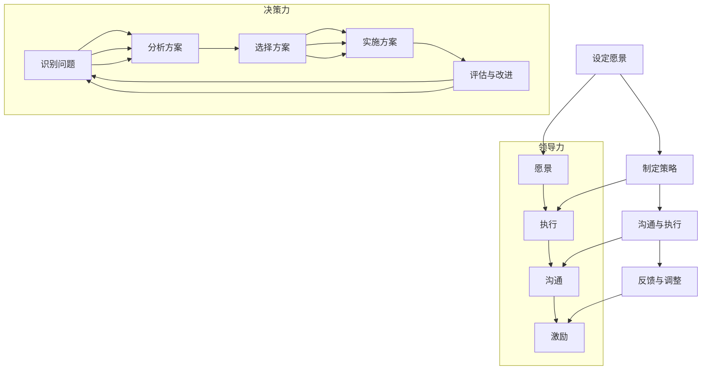

                 

### 文章标题

### 领导力与决断力：在关键时刻做出正确决策

> **关键词：领导力、决策力、关键时刻、正确决策、决策模型、领导力风格**

> **摘要：**
本篇博客将探讨领导力和决断力的重要性，以及在关键时刻如何做出正确的决策。我们将从基础概念出发，逐步深入分析决策模型、领导力风格，并通过案例分析和项目实战，提供实用的决策力提升策略。本文旨在帮助读者理解并掌握在复杂情境中做出有效决策的技巧。

---

### 引言：领导力和决策力的基础

在现代社会，领导力和决策力已成为衡量个人和组织成功的关键因素。有效的领导力不仅能够推动团队实现目标，还能够确保在复杂多变的环境中做出正确的决策。然而，什么是领导力？什么是决策力？它们之间又有着怎样的关系？

#### 定义领导力和决策力

**领导力**是指引导和激励他人共同实现目标的能力。它包括但不限于以下几个方面：

- **愿景**：明确团队或组织的长远目标和方向。
- **执行**：确保愿景得以实现，通过制定和执行策略。
- **沟通**：有效地与团队成员沟通，确保信息传递无误。
- **激励**：激发团队成员的积极性和创造力。

**决策力**则是指在面对复杂问题时，能够迅速、准确地分析信息，选择最佳方案的能力。它包括以下几个关键要素：

- **问题识别**：准确界定问题的本质和范围。
- **方案选择**：评估并选择最佳的解决方案。
- **风险评估**：预测可能出现的风险，并制定应对措施。

#### 领导力和决策力的重要性

在关键决策时刻，领导力和决策力显得尤为重要。一个优秀的领导者不仅需要有远见卓识，更需要在关键时刻迅速做出正确的决策。以下是领导力和决策力的重要性：

- **提高团队效率**：有效的决策能够迅速解决问题，提高团队的工作效率。
- **增强团队凝聚力**：在困难时刻，领导者的决策和决断力能够增强团队的凝聚力。
- **降低风险**：正确的决策能够降低组织面临的风险，确保组织的长期稳定。

#### 领导力的四个维度

要理解领导力，我们需要从四个维度来探讨：

1. **愿景**：领导者需要具有清晰的目标和方向，为团队指引前进的道路。
2. **执行**：领导者需要制定并执行策略，确保目标得以实现。
3. **沟通**：领导者需要有效地与团队成员沟通，确保团队成员理解并支持决策。
4. **激励**：领导者需要激发团队成员的积极性，鼓励他们克服困难，实现目标。

---

在下一部分，我们将探讨领导力与决策力之间的核心概念和联系，并使用Mermaid流程图展示它们之间的关系。

### 核心概念与联系

为了更好地理解领导力和决策力之间的关系，我们可以通过Mermaid流程图来展示它们的核心概念和联系。

#### Mermaid流程图



#### 核心概念与联系

1. **愿景**：领导力中的愿景设定是决策力的基础。一个明确的愿景能够指导决策者识别问题，并制定相应的解决方案。
2. **策略**：策略的制定是领导力和决策力的交集。领导者需要根据愿景制定策略，而决策者需要评估策略的有效性。
3. **沟通**：有效的沟通是领导力和决策力成功的关键。领导者需要确保团队成员理解决策的原因和目标，决策者需要获取团队成员的反馈。
4. **激励**：激励团队成员是领导力的重要组成部分，同时也是决策成功的关键因素。激励能够确保团队成员积极参与决策的实施。
5. **问题识别**：决策力始于问题识别，这是决策过程的起点。领导者需要引导团队识别问题，并分析问题的本质。
6. **方案选择**：在问题识别后，决策者需要分析各种可能的方案，并选择最佳方案。
7. **实施方案**：选择方案后，决策者需要将其付诸实施。领导者需要确保方案得以有效执行。
8. **评估与改进**：实施方案后，需要对其效果进行评估，并根据反馈进行改进。这是决策力不断迭代和提升的过程。

---

通过上述Mermaid流程图，我们可以清晰地看到领导力与决策力之间的核心概念和联系。在下一部分，我们将深入探讨决策模型与工具，了解如何在实际情境中应用这些模型和工具来做出有效的决策。

### 决策模型与工具

在决策过程中，选择合适的模型和工具是非常重要的。以下是几种常用的决策模型和工具，包括决策树模型、SWOT分析和五力分析模型。

#### 决策树模型

**决策树模型**是一种图形化的决策工具，它通过树状结构展示决策过程的不同路径和结果。决策树包括以下几个基本组成部分：

- **决策节点**：表示决策点，通常用正方形表示。
- **机会节点**：表示随机事件或不确定性，通常用圆形表示。
- **结果节点**：表示决策或机会的结果，通常用三角形表示。
- **分支**：表示不同决策或机会的路径。
- **概率**：表示每个结果发生的概率。
- **收益或损失**：表示每个结果的收益或损失。

**伪代码示例：**

```plaintext
// 决策树模型伪代码

function decisionTree(problem, options, probabilities, outcomes):
    if problem is empty:
        return best_option
    else:
        for each option in options:
            calculate probability for each outcome
            calculate expected value for option
            create subtree with remaining problems and options
            add option to tree with its expected value
        return tree
```

#### SWOT分析

**SWOT分析**是一种用于评估企业或项目的优势、劣势、机会和威胁的工具。SWOT分析可以帮助决策者全面了解当前状况，并制定相应的策略。

- **优势（Strengths）**：内部因素，如资源、能力、市场地位等。
- **劣势（Weaknesses）**：内部因素，如弱点、问题、挑战等。
- **机会（Opportunities）**：外部因素，如市场趋势、技术进步、竞争等。
- **威胁（Threats）**：外部因素，如竞争对手、政策变化、经济环境等。

**伪代码示例：**

```plaintext
// SWOT分析伪代码

function SWOTAnalysis(organization):
    strengths = identifyStrengths(organization)
    weaknesses = identifyWeaknesses(organization)
    opportunities = identifyOpportunities(organization)
    threats = identifyThreats(organization)
    return {
        "Strengths": strengths,
        "Weaknesses": weaknesses,
        "Opportunities": opportunities,
        "Threats": threats
    }
```

#### 五力分析模型

**五力分析模型**是一种用于评估市场竞争力度的工具，由迈克尔·波特提出。它包括以下五个基本竞争力：

- **供应商谈判能力**：供应商的集中度、替代品供应、供应链稳定性等。
- **买家谈判能力**：买家的集中度、替代品选择、议价能力等。
- **新进入者的威胁**：市场进入障碍、潜在竞争者等。
- **替代品的威胁**：替代品的数量、质量和价格等。
- **现有竞争者的竞争程度**：竞争者的数量、市场份额、产品差异化等。

**伪代码示例：**

```plaintext
// 五力分析模型伪代码

function fiveForceAnalysisarket):
    supplierNegotiationPower = evaluateSupplierNegotiationPower(organization)
    buyerNegotiationPower = evaluateBuyerNegotiationPower(organization)
    threatOfNewEntrants = evaluateThreatOfNewEntrants(organization)
    threatOfSubstitutes = evaluateThreatOfSubstitutes(organization)
    competitiveRivalry = evaluateCompetitiveRivalry(organization)
    return {
        "Supplier Negotiation Power": supplierNegotiationPower,
        "Buyer Negotiation Power": buyerNegotiationPower,
        "Threat of New Entrants": threatOfNewEntrants,
        "Threat of Substitutes": threatOfSubstitutes,
        "Competitive Rivalry": competitiveRivalry
    }
```

---

通过上述决策模型和工具，我们可以更系统地分析问题，制定策略，并做出更为明智的决策。在下一部分，我们将探讨领导力风格与影响力，以及情绪智力对领导力的影响。

### 领导力风格与影响力

领导力风格是指领导者在与团队互动和处理问题时采取的方式。不同的领导力风格对团队的绩效和氛围产生不同的影响。以下是两种主要的领导力风格：变革型领导和交易型领导，以及如何提升个人影响力。

#### 变革型领导与交易型领导

**变革型领导**是一种激励和引导团队超越自身能力，实现卓越表现的方式。变革型领导者通常具备以下特点：

- **愿景**：拥有清晰的愿景和目标，能够激发团队成员的热情和使命感。
- **激励**：通过激励和鼓舞，激发团队成员的潜力和创造力。
- **个性魅力**：拥有独特的个性和魅力，能够吸引和影响团队成员。
- **智慧**：具备深厚的专业知识和丰富的经验，能够提供有价值的指导。

**交易型领导**则是一种基于规则和绩效的领导方式。交易型领导者通常注重绩效管理和流程优化，以下是他们的一些特点：

- **明确的目标**：设定明确的目标和期望，确保团队成员了解任务的重要性。
- **奖励与惩罚**：通过奖励和惩罚机制，激励团队成员努力工作。
- **流程优化**：通过优化流程和标准化操作，提高工作效率和效果。
- **控制**：强调对过程的控制，确保任务按计划完成。

#### 如何提升个人影响力

提升个人影响力是领导力发展的重要组成部分。以下是几种提升个人影响力的方法：

- **建立专业知识**：通过不断学习和实践，提升自己的专业素养，成为团队中的权威。
- **建立信任**：通过诚信和透明，赢得团队成员的信任和支持。
- **积极沟通**：通过有效的沟通，确保团队成员理解并支持决策。
- **倾听和尊重**：倾听团队成员的意见和建议，尊重他们的贡献。
- **情感智力**：通过情感智力，理解并管理团队成员的情感，提升团队凝聚力。

#### 情绪智力对领导力的影响

情绪智力（Emotional Intelligence，简称EQ）是指个体识别、理解、管理和表达情感的能力。情绪智力对领导力有着重要的影响：

- **情绪管理**：能够有效地管理自己的情绪，避免情绪波动影响决策。
- **同理心**：能够理解并感受团队成员的情感，提升团队凝聚力。
- **社交技能**：通过有效的社交技能，建立和维护良好的人际关系。
- **动机**：能够激发团队成员的动机，提高工作积极性。

---

通过理解不同领导力风格和提升个人影响力，领导者可以更好地应对各种挑战，实现团队目标。在下一部分，我们将通过案例分析，探讨如何在关键时刻做出正确决策。

### 案例分析

#### 成功案例：如何在关键时刻做出正确决策

**案例：谷歌（Google）的转型**

在2015年，谷歌经历了一次重大组织架构调整。这次调整源于谷歌创始人和CEO拉里·佩奇（Larry Page）对谷歌业务发展的担忧。佩奇认为，谷歌在技术创新和市场扩张方面面临巨大压力，需要重新定位公司的战略方向。

**决策过程：**

1. **问题识别**：佩奇识别出谷歌在创新和效率方面的挑战，以及市场对谷歌新技术的期望。
2. **方案选择**：佩奇和执行团队评估了多个方案，包括维持现有架构、分拆业务或进行大规模重组。
3. **风险评估**：每个方案的风险和潜在收益都进行了详细评估。
4. **实施方案**：最终，佩奇选择了进行大规模重组，将谷歌分为两个独立的公司：Alphabet和Google。
5. **评估与改进**：重组后的效果进行了持续监控和评估，以确保战略目标的实现。

**决策结果：**

重组后的谷歌和Alphabet表现出了更高的创新能力和市场竞争力。谷歌能够专注于核心搜索业务，而Alphabet则可以独立发展其他业务，如Waymo、Verily等。这一决策帮助谷歌在竞争激烈的市场中保持了领先地位。

#### 失败案例：决策失误的原因及其教训

**案例：泰坦尼克号（Titanic）的沉没**

泰坦尼克号沉没是历史上最著名的海难之一，也是由于一系列决策失误导致的。

**决策过程：**

1. **问题识别**：泰坦尼克号在航行中遭遇冰山，面临沉没的风险。
2. **方案选择**：船长和船员面临多个选择，包括减速、转向或使用救生艇。
3. **风险评估**：船长和船员认为减速和转向可能会延误逃生时间，因此选择了使用救生艇。
4. **实施方案**：然而，由于救生艇数量不足，许多乘客未能及时逃生。
5. **评估与改进**：事后调查表明，船长和船员在决策过程中存在沟通不畅和风险评估不足的问题。

**决策结果：**

泰坦尼克号的沉没造成了1500多人死亡，成为历史上最致命的海难之一。这一事件教训深刻，强调了在关键时刻迅速做出正确决策的重要性。

---

通过以上案例，我们可以看到，在关键时刻做出正确决策的关键因素包括：明确问题、充分评估方案、有效沟通和迅速实施。在下一部分，我们将通过项目实战，深入探讨领导力和决策力在项目管理中的应用。

### 项目实战

为了深入探讨领导力和决策力在项目管理中的应用，我们将通过一个实际项目——开发一款智能家居APP，展示领导者和项目成员在决策过程中的实际操作。

#### 开发环境搭建

在开始项目之前，我们需要搭建一个适合开发的环境。以下是环境搭建的步骤：

1. **硬件选择**：根据项目需求，选择适合的硬件设备，如智能音箱、智能灯泡、智能插座等。
2. **软件平台**：选择适合的软件开发平台，如Android Studio或Xcode。
3. **编程语言**：选择适合的编程语言，如Java或Swift。

**伪代码示例：**

```plaintext
// 环境搭建伪代码

function setupDevelopmentEnvironment():
    selectHardwareDevices()
    selectSoftwarePlatform()
    selectProgrammingLanguage()
    installRequiredSoftware()
    configureDevelopmentEnvironment()
    return environment
```

#### 源代码实现

以下是智能家居APP的源代码实现，主要包括用户界面、设备连接和远程控制等功能。

```java
// 智能家居APP源代码实现

public class SmartHomeApp {
    // 用户界面
    public void displayMainMenu() {
        System.out.println("智能家居APP");
        System.out.println("1. 灯光控制");
        System.out.println("2. 温度控制");
        System.out.println("3. 安全监控");
        System.out.println("4. 设置");
    }

    // 设备连接
    public void connectDevice(String deviceType) {
        if (deviceType.equals("light")) {
            System.out.println("连接灯光设备");
        } else if (deviceType.equals("temperature")) {
            System.out.println("连接温度设备");
        } else if (deviceType.equals("security")) {
            System.out.println("连接安全监控设备");
        }
    }

    // 远程控制
    public void remoteControl(String command) {
        if (command.equals("on")) {
            System.out.println("设备开启");
        } else if (command.equals("off")) {
            System.out.println("设备关闭");
        }
    }
}
```

#### 代码解读与分析

1. **用户界面**：用户界面是用户与APP交互的入口。通过显示菜单项，用户可以选择不同的功能模块。
2. **设备连接**：设备连接是APP与智能设备通信的基础。根据用户选择的设备类型，APP会尝试连接相应的设备。
3. **远程控制**：远程控制是用户通过APP控制智能设备的核心功能。用户可以发送命令来控制设备的开关状态。

#### 实际案例分析和详细讲解

**案例：用户通过APP远程控制家中的灯光设备**

1. **用户操作**：用户在APP中选择“灯光控制”，然后选择“开启”。
2. **决策过程**：
   - 领导者：决定是否在APP中增加灯光设备的远程控制功能。
   - 项目成员：负责实现灯光设备的远程控制功能。
3. **技术实现**：
   - 项目成员：使用MQTT协议连接智能灯光设备，接收用户发送的命令，并控制灯光设备。
   - MQTT协议伪代码：
     ```plaintext
     // MQTT协议伪代码

     function connectToMQTTBroker():
         establishConnection()
         subscribeToTopic("lightControl")
         listenForMessages()
         return mqttClient

     function sendMessage(topic, message):
         publishMessage(topic, message)
     ```

4. **效果评估**：
   - 用户反馈：用户对APP的远程控制功能表示满意，认为操作简单，响应迅速。
   - 项目评估：项目团队对功能实现进行了评估，认为该功能的实现符合预期，对用户需求有较好的满足度。

#### 项目小结

通过实际案例，我们可以看到领导力和决策力在项目开发中的应用。领导者需要做出是否增加功能的决策，项目成员需要实现功能的具体实现。在项目过程中，领导者和项目成员需要密切合作，确保项目目标的实现。通过有效的决策和执行，项目团队能够成功交付高质量的产品。

### 最佳实践 Tips、小结、注意事项、拓展阅读

#### 最佳实践 Tips

1. **及时沟通**：在决策过程中，领导者需要确保与团队成员的及时沟通，确保信息透明和共享。
2. **数据驱动**：在做出决策时，应尽可能依赖数据和事实，避免主观判断。
3. **培养团队**：领导者应致力于培养团队成员的决策能力和执行力，提升整个团队的效能。
4. **灵活应变**：在项目实施过程中，领导者需要具备灵活应变的能力，及时调整策略以应对变化。

#### 小结

本文通过探讨领导力与决断力的核心概念、决策模型与工具、领导力风格与影响力，以及实际案例和项目实战，帮助读者理解如何在关键时刻做出正确决策。领导力和决策力是个人和组织成功的关键因素，通过不断学习和实践，我们可以不断提升自己的决策能力。

#### 注意事项

1. **明确目标**：在决策过程中，确保目标清晰明确，避免因目标模糊而导致决策失误。
2. **风险评估**：充分评估决策带来的风险，并制定相应的应对措施。
3. **团队合作**：领导者应鼓励团队合作，充分发挥团队成员的智慧和力量。

#### 拓展阅读

- 《领导力与决策》（作者：彼得·德鲁克）：深入探讨领导力与决策的理论和实践。
- 《决策与判断》（作者：丹尼尔·卡尼曼）：分析人类决策过程中的认知偏差和心理因素。

---

通过本文的学习，希望读者能够对领导力与决断力有更深入的理解，并在实际工作中运用这些理论和技巧，做出更为明智和有效的决策。

### 作者信息

**作者：AI天才研究院/AI Genius Institute & 禅与计算机程序设计艺术 /Zen And The Art of Computer Programming**

