                 


### 第1章：领导力的定义与重要性

#### 1.1.1 领导力的定义

领导力，作为一种复杂的社交技能，通常被描述为影响、引导和激励他人共同实现目标的能力。它不仅关乎于个人的魅力和权威，更涉及对团队和组织整体运作的理解和管理。

**核心概念与联系**

领导力的核心概念包括但不限于：影响力、影响力管理、影响力模型。我们可以使用Mermaid流程图来展示这些概念之间的联系：

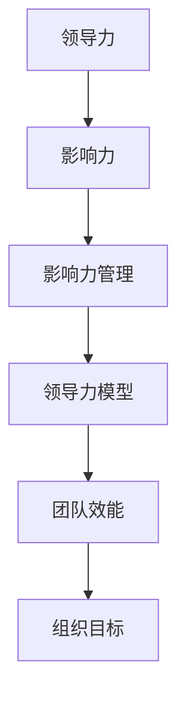

在这个流程图中，领导力作为起点，通过影响力影响影响力管理，进而影响领导力模型，最终实现团队效能和组织目标的提升。

#### 1.1.2 领导力的作用

领导力在组织中的作用是至关重要的。它不仅决定了团队的效率和生产力，还影响着员工的满意度和忠诚度。以下是一个简化的数学模型来描述领导力与组织效能之间的关系：

$$
\text{组织效能} = f(\text{领导力}, \text{团队效能}, \text{员工满意度})
$$

在这个模型中，领导力是影响组织效能的主要因素之一，它通过提升团队效能和员工满意度来间接影响组织效能。

**举例说明**

领导力在企业发展中具有至关重要的作用。例如，苹果公司的史蒂夫·乔布斯以其非凡的领导力，不仅引领了公司技术创新，还塑造了公司的文化，使得苹果成为了全球最具价值的品牌之一。

#### 1.1.3 领导力的重要性

领导力的重要性不仅体现在企业的成功上，也体现在社会问题的解决中。例如，在抗击COVID-19疫情中，领导者的决策能力和影响力直接关系到公共健康的维护。

总之，领导力是一种关键能力，它不仅关乎个人的成功，更关系到组织和社会的进步。接下来，我们将深入探讨领导力的核心要素，帮助读者更好地理解这一重要概念。

---

### 第2章：领导力的核心要素

#### 2.1.1 情商与领导力

情商（Emotional Intelligence，简称EQ）是领导力的核心要素之一。情商包括自我认知、自我调节、社交意识和关系管理等方面，它对于领导者的决策和团队协作具有显著影响。

**核心概念与联系**

情商与领导力之间的关系可以用Mermaid流程图来展示：

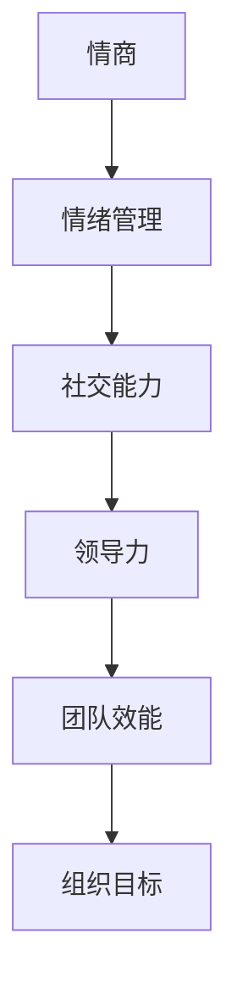

在这个流程图中，情商通过情绪管理和社交能力影响领导力，进而影响团队效能和组织目标的实现。

#### 2.1.2 人格特质

人格特质是领导力的另一个重要要素。人格特质包括内在价值观、行为倾向、个性特征等方面，它们影响着领导者的决策风格和团队文化。

**核心概念与联系**

人格特质与领导力之间的关系可以用以下Mermaid流程图来展示：

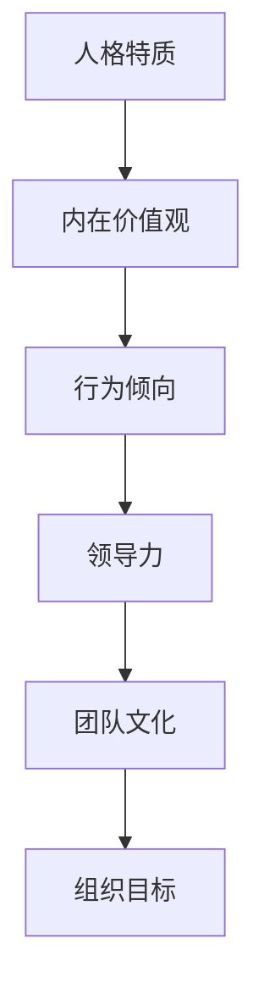

在这个流程图中，人格特质通过内在价值观和行为倾向影响领导力，进而塑造团队文化和实现组织目标。

#### 2.1.3 能力与技能

领导力不仅涉及情感和个性，还需要具备一定的能力和技能。这些能力包括沟通能力、决策能力、执行能力等，它们是领导者实现目标的关键。

**核心概念与联系**

能力与技能与领导力之间的关系可以用以下Mermaid流程图来展示：

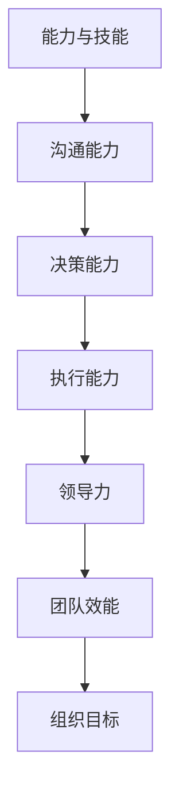

在这个流程图中，能力与技能通过沟通能力、决策能力和执行能力影响领导力，进而提升团队效能和组织目标的实现。

通过以上对领导力核心要素的探讨，我们可以更好地理解领导力的重要性和如何通过提升这些要素来提高领导力。在接下来的章节中，我们将深入探讨领导力的理论基础，帮助读者更好地掌握这一关键概念。

---

### 第3章：领导力的理论基础

#### 3.1.1 传统领导理论

传统领导理论主要关注领导者与下属的关系，强调领导者的权威和下属的服从。这种理论认为，领导者的主要任务是下达命令，下属则需遵守命令并努力完成任务。

**核心概念与联系**

传统领导理论的核心概念包括：

- 领导者的权威
- 下属的服从
- 命令与执行的二元关系

我们可以使用以下Mermaid流程图来展示这些概念之间的联系：

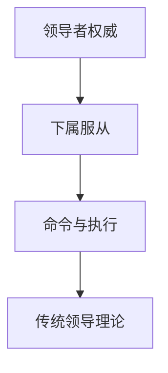

**核心算法原理讲解**

在传统领导理论中，领导者与下属之间的关系可以看作是一个简单的命令执行模型。这个模型可以用以下伪代码来表示：

```python
def traditional_leadership():
    # 领导者下达命令
    leader.issue_command(command)
    # 下属执行命令
    subordinate.execute_command(command)
```

在这个模型中，领导者是命令的发出者，下属是命令的执行者，两者之间存在着明确的命令执行关系。

**举例说明**

一个典型的传统领导理论例子是军事组织。在军事组织中，领导者（如将军）通过命令来指导下属（如士兵）执行任务。这种模式确保了军事行动的高效和有序。

#### 3.1.2 现代领导理论

现代领导理论与传统领导理论不同，它更加关注领导者的角色转变和与下属的互动。现代领导理论认为，领导者不仅是命令的发出者，更是团队的合作者和支持者。

**核心概念与联系**

现代领导理论的核心概念包括：

- 领导者的角色转变
- 下属的参与和互动
- 团队合作和共同目标的实现

我们可以使用以下Mermaid流程图来展示这些概念之间的联系：

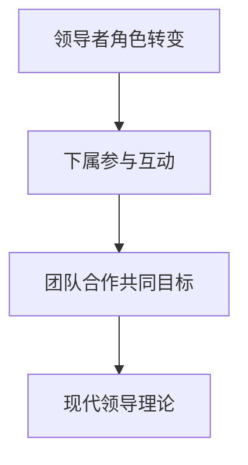

**核心算法原理讲解**

在现代领导理论中，领导者与下属之间的关系更加复杂，不仅需要下达命令，还需要与下属进行沟通、协作和支持。这个模型可以用以下伪代码来表示：

```python
def modern_leadership():
    # 领导者与下属进行沟通
    leader.communicate_with_subordinate()
    # 领导者支持下属
    leader.support_subordinate()
    # 下属参与决策
    subordinate.participate_in_decision()
    # 团队合作实现目标
    team.work_together_to_achieve_goal()
```

在这个模型中，领导者与下属之间的关系是相互的，领导者不仅要领导下属，还需要与下属合作，共同实现团队的目标。

**举例说明**

现代领导理论在企业组织中得到了广泛应用。例如，谷歌公司的领导力模式就体现了现代领导理论的核心理念，领导者鼓励下属创新，提供支持和资源，以促进团队合作和共同成长。

#### 3.1.3 领导力理论的联系与区别

传统领导理论和现代领导理论各有其优势和局限性。传统领导理论在强调权威和纪律方面具有优势，但在激发下属的潜力和创新能力方面存在不足。现代领导理论则更加注重团队合作和下属参与，能够更好地激发团队的活力和创造力。

我们可以使用以下Mermaid流程图来展示两者之间的联系和区别：

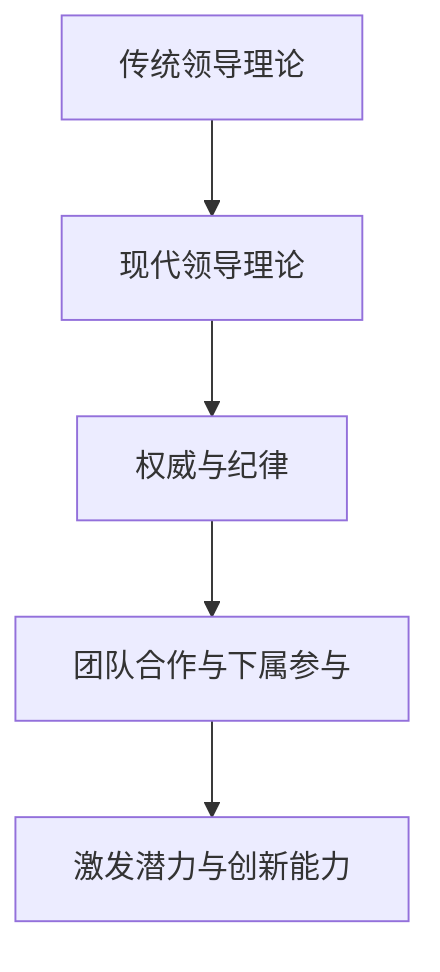

在这个流程图中，传统领导理论和现代领导理论相互联系，共同构成了现代领导力理论的基础。

通过以上对领导力理论基础的探讨，我们可以更好地理解传统领导理论和现代领导理论的联系和区别，为提升领导力提供了理论指导。在下一章中，我们将深入探讨决断力的概念和特性，帮助读者进一步理解果断决策的艺术。

### 第4章：决断力的概念与特性

#### 4.1.1 决断力的定义

决断力（Decision-making power）是指个体在面对复杂问题和不确定性时，能够快速、准确地做出决策的能力。它不仅涉及逻辑思维和数据分析，还需要具备判断力和勇气。

**核心概念与联系**

决断力的核心概念包括：

- 问题识别
- 信息收集
- 分析与评估
- 决策执行

我们可以使用以下Mermaid流程图来展示这些概念之间的联系：

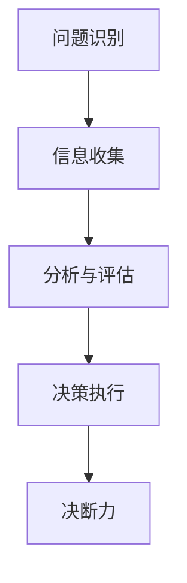

在这个流程图中，问题识别是决断力的起点，通过信息收集、分析与评估，最终实现决策执行，形成一个闭环。

#### 4.1.2 决断力的特性

决断力具有以下几个主要特性：

1. **速度**：决断力强的人能够在短时间内快速做出决策，不会因为过多的思考而陷入困境。

2. **准确性**：决断力强的人能够在不确定的环境下做出相对准确的决策，降低错误发生的概率。

3. **灵活性**：决断力强的人能够根据新的信息或情况迅速调整决策，具备较强的适应能力。

4. **勇气**：决断力强的人能够在面对挑战和压力时，勇于承担责任，做出果断决策。

**举例说明**

一个典型的决断力强的人是苹果公司的史蒂夫·乔布斯。在面对市场竞争和技术挑战时，他能够迅速做出决策，引领公司走向成功。

#### 4.1.3 决断力的重要性

决断力对于个人和组织的成功至关重要。它不仅影响个人的职业发展，也决定着组织的竞争力和创新能力。

**核心概念与联系**

决断力的重要性可以用以下Mermaid流程图来展示：

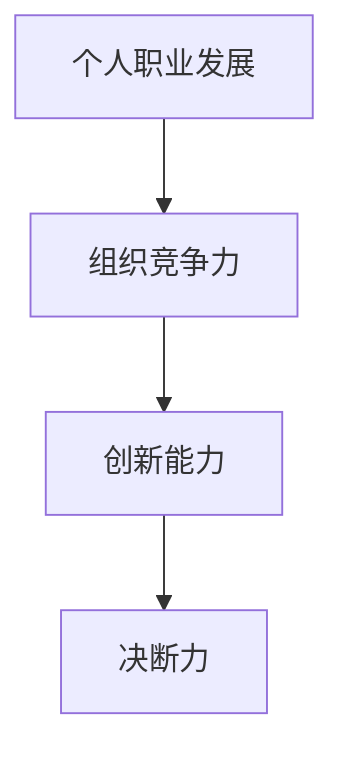

在这个流程图中，决断力通过影响个人职业发展和组织竞争力，进而促进创新能力的提升。

通过以上对决断力的概念和特性的探讨，我们可以更好地理解决断力的重要性和如何提升决断力。在下一章中，我们将深入探讨提高决断力的策略，帮助读者在实际工作中运用决断力。

### 第5章：提高决断力的策略

#### 5.1.1 识别问题

提高决断力的第一步是识别问题。这需要领导者具备敏锐的洞察力和分析能力，能够从复杂的信息中找出关键问题。

**核心概念与联系**

问题识别的过程可以看作是一个信息处理模型。以下是问题识别的核心概念与联系的Mermaid流程图：

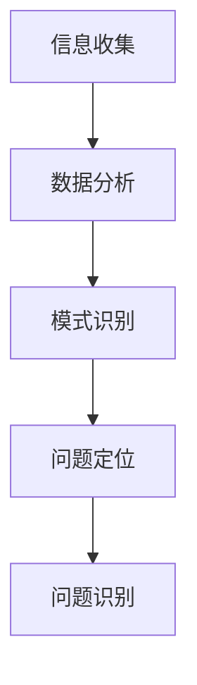

在这个流程图中，领导者通过信息收集、数据分析、模式识别，最终定位并识别出问题。

**核心算法原理讲解**

我们可以使用以下伪代码来表示问题识别的过程：

```python
def identify_problem():
    # 收集信息
    data = collect_data()
    # 数据分析
    analysis = analyze_data(data)
    # 模式识别
    patterns = identify_patterns(analysis)
    # 问题定位
    problem = locate_problem(patterns)
    # 问题识别
    identified_problem = identify_problem(problem)
    return identified_problem
```

**举例说明**

在企业管理中，识别问题可能涉及市场趋势分析、财务数据审查或员工反馈收集。例如，通过分析销售数据，企业领导者可以发现某产品线销量下滑，从而识别出潜在的市场问题。

#### 5.1.2 收集信息

在识别问题后，下一步是收集与问题相关的信息。这包括内部数据和外部数据，如市场报告、竞争对手分析、行业动态等。

**核心概念与联系**

信息收集的过程可以用以下Mermaid流程图来展示：

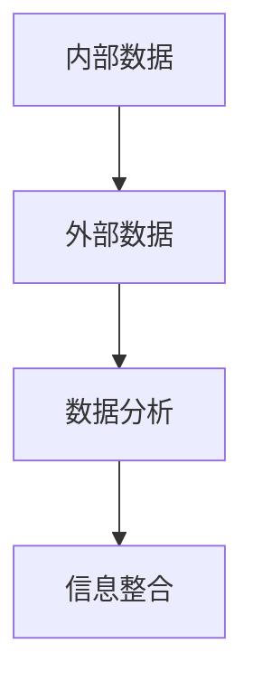

在这个流程图中，内部数据和外部数据通过信息整合，形成一个全面的信息库，为后续的分析和决策提供支持。

**核心算法原理讲解**

以下是收集信息过程的伪代码：

```python
def collect_information():
    # 收集内部数据
    internal_data = get_internal_data()
    # 收集外部数据
    external_data = get_external_data()
    # 数据分析
    analysis = analyze_data(internal_data, external_data)
    # 信息整合
    integrated_info = integrate_data(analysis)
    return integrated_info
```

**举例说明**

例如，一个企业在决定是否进入新的市场时，需要收集内部销售数据、市场研究报告和竞争对手的市场表现。通过这些信息，企业可以更全面地评估新市场的潜力和风险。

#### 5.1.3 分析与评估

收集到信息后，下一步是对信息进行分析和评估。这包括数据清洗、数据分析和模型构建，以帮助领导者理解问题的本质，识别潜在解决方案。

**核心概念与联系**

分析与评估的过程可以用以下Mermaid流程图来展示：

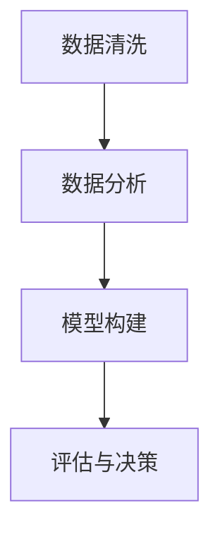

在这个流程图中，数据清洗、数据分析和模型构建是评估和决策的基础。

**核心算法原理讲解**

以下是分析与评估过程的伪代码：

```python
def analyze_and_evaluate():
    # 数据清洗
    cleaned_data = clean_data(data)
    # 数据分析
    analysis = analyze_data(cleaned_data)
    # 模型构建
    model = build_model(analysis)
    # 评估与决策
    decision = evaluate_and_make_decision(model)
    return decision
```

**举例说明**

例如，在投资决策中，企业领导者可能使用财务模型和风险评估工具来分析投资项目的潜在收益和风险，从而做出投资决策。

#### 5.1.4 制定决策

在分析和评估的基础上，领导者需要制定决策。这包括选择最佳方案、制定执行计划和分配资源。

**核心概念与联系**

制定决策的过程可以用以下Mermaid流程图来展示：

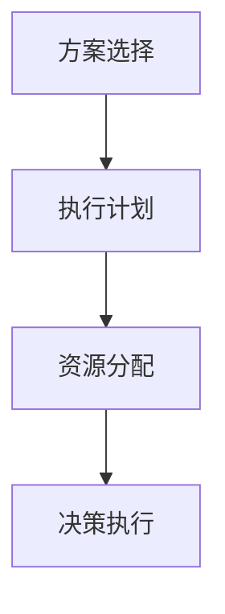

在这个流程图中，方案选择、执行计划和资源分配是决策制定的关键环节。

**核心算法原理讲解**

以下是制定决策过程的伪代码：

```python
def make_decision():
    # 方案选择
    options = select_options()
    # 执行计划
    plan = create_execution_plan(options)
    # 资源分配
    allocation = allocate_resources(plan)
    # 决策执行
    execute_decision(allocation)
```

**举例说明**

例如，在产品开发中，企业领导者需要选择最佳的开发方案，制定详细的项目计划和资源分配方案，确保项目能够按时完成。

#### 5.1.5 执行决策

最后一步是执行决策。这需要领导者确保决策得到有效实施，监督执行过程，及时调整策略。

**核心概念与联系**

执行决策的过程可以用以下Mermaid流程图来展示：

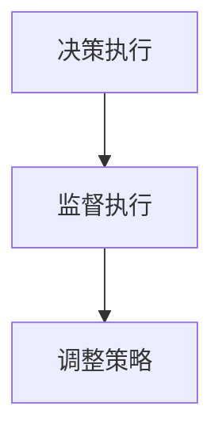

在这个流程图中，决策执行、监督执行和调整策略是执行决策的关键环节。

**核心算法原理讲解**

以下是执行决策过程的伪代码：

```python
def execute_decision():
    # 决策执行
    execution = execute_plan()
    # 监督执行
    supervision = monitor_execution(execution)
    # 调整策略
    adjustment = adjust_strategy(supervision)
```

**举例说明**

例如，在市场营销中，企业领导者需要确保营销计划的执行，监督市场反馈，并根据反馈调整营销策略。

通过以上对提高决断力策略的探讨，我们可以看到，提高决断力不仅仅是掌握方法和技巧，更需要领导者具备敏锐的洞察力、强大的分析能力和坚定的执行能力。在下一章中，我们将深入探讨决断力的心理障碍与应对，帮助读者更好地应对决断过程中的挑战。

### 第6章：决断力的心理障碍与应对

#### 6.1.1 决断力的心理障碍

决断力不仅受到技能和知识的影响，还受到心理障碍的制约。这些心理障碍可能来自个人内心的恐惧、不确定性和过度分析。

**核心概念与联系**

决断力的心理障碍包括以下几个方面：

- **恐惧失败**：担心决策失败带来的后果，导致拖延和回避决策。
- **过度分析**：对决策过程中的信息进行过度分析，导致无法做出决策。
- **不确定性的恐惧**：对未来的不确定性和风险感到焦虑，导致决策迟缓。

我们可以使用以下Mermaid流程图来展示这些心理障碍之间的联系：

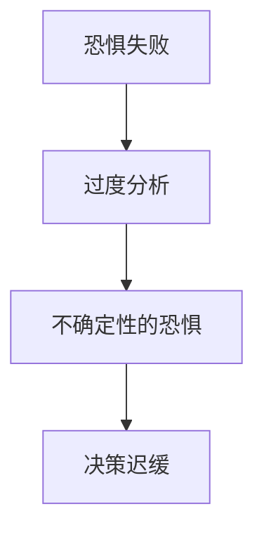

在这个流程图中，恐惧失败、过度分析和不确定性的恐惧共同导致了决策迟缓，影响了决断力。

**核心算法原理讲解**

为了应对这些心理障碍，我们可以设计一个心理模型，帮助领导者识别和克服这些障碍。以下是这个模型的伪代码：

```python
def overcome_mental_barriers():
    # 识别恐惧失败
    fear_of_failure = identify_fear_of_failure()
    # 识别过度分析
    over_analysis = identify_over_analysis()
    # 识别不确定性的恐惧
    fear_of_uncertainty = identify_fear_of_uncertainty()
    
    # 应对恐惧失败
    if fear_of_failure:
        take_risk_management_actions()
    # 应对过度分析
    if over_analysis:
        apply_decision_heuristics()
    # 应对不确定性的恐惧
    if fear_of_uncertainty:
        increase_decision_awareness()
    
    # 综合应对策略
    overall_strategy = combine_actions(fear_of_failure, over_analysis, fear_of_uncertainty)
    return overall_strategy
```

**举例说明**

例如，一个领导者可能因为恐惧失败而过度分析一个重要的商业决策。通过上述模型，领导者可以识别这个问题，并采取相应的策略，如风险管理和决策启发式方法，来克服这些心理障碍。

#### 6.1.2 克服决断力障碍的策略

为了克服决断力的心理障碍，领导者可以采取以下策略：

1. **建立自信心**：通过成功的小决策来建立自信心，逐渐增加决策的难度和重要性。
2. **制定决策计划**：在决策前制定详细的计划，减少不确定性带来的焦虑。
3. **培养决策习惯**：通过日常练习来提高决策能力，形成快速决断的习惯。
4. **接受失败**：将失败视为学习和成长的机会，而不是失败的标志。

**核心概念与联系**

克服决断力障碍的策略可以用以下Mermaid流程图来展示：

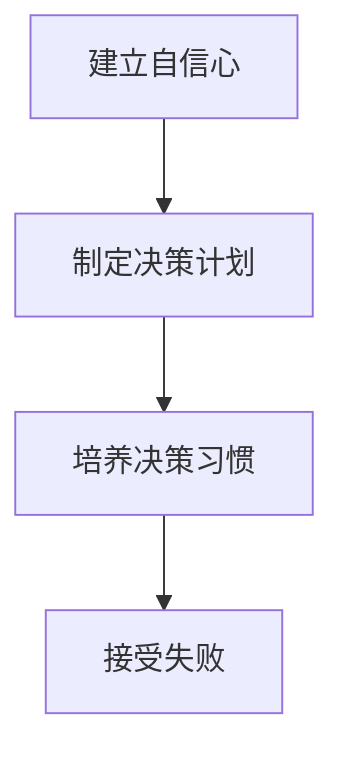

在这个流程图中，建立自信心、制定决策计划、培养决策习惯和接受失败是克服心理障碍的关键策略。

**核心算法原理讲解**

以下是克服心理障碍策略的伪代码：

```python
def overcome_mental_barriers():
    # 建立自信心
    confidence = build_confidence()
    # 制定决策计划
    plan = create_decision_plan()
    # 培养决策习惯
    habit = cultivate_decision_habits()
    # 接受失败
    acceptance = accept_failure()
    
    # 应对策略
    strategy = combine_actions(confidence, plan, habit, acceptance)
    return strategy
```

**举例说明**

例如，一个新任项目经理可能因为缺乏自信而面临决策困境。通过建立自信心、制定详细的决策计划、培养快速决断的习惯和接受失败，项目经理可以逐渐克服这些心理障碍，提高决断力。

#### 6.1.3 增强自信心的方法

增强自信心是克服决断力障碍的重要一步。以下是一些增强自信心的方法：

1. **积极自我对话**：通过积极的自我暗示来增强自信心，例如：“我可以做到”、“我有能力”。
2. **设置可实现的目标**：通过设置并实现小目标来逐步增强自信心。
3. **学习新技能**：通过学习新技能来增加自己的能力和自信心。
4. **接受挑战**：接受并克服挑战，通过成功解决难题来增强自信心。

**核心概念与联系**

增强自信心的方法可以用以下Mermaid流程图来展示：

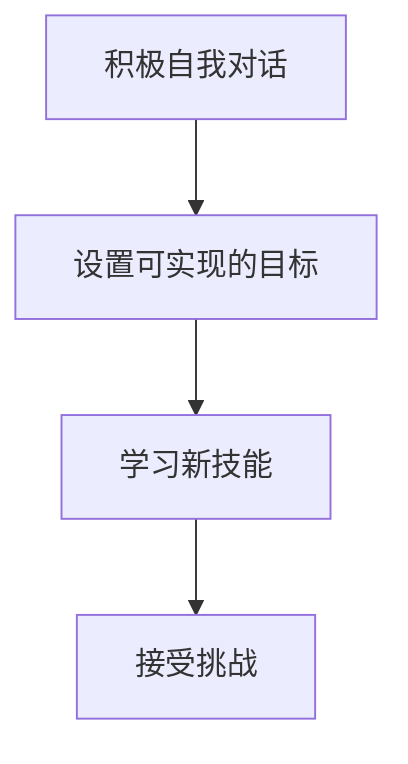

在这个流程图中，积极自我对话、设置可实现的目标、学习新技能和接受挑战是增强自信心的关键方法。

**核心算法原理讲解**

以下是增强自信心方法的伪代码：

```python
def enhance_confidence():
    # 积极自我对话
    positive_self_talk = initiate_positive_self_talk()
    # 设置可实现的目标
    achievable_goals = set_achievable_goals()
    # 学习新技能
    new_skills = learn_new_skills()
    # 接受挑战
    challenges = accept_challenges()
    
    # 自信提升策略
    confidence_boost = combine_methods(positive_self_talk, achievable_goals, new_skills, challenges)
    return confidence_boost
```

**举例说明**

例如，一个销售人员可能因为业绩不理想而缺乏自信。通过积极自我对话、设定销售目标、学习新销售技能和接受销售挑战，销售人员可以逐步增强自信心，提高销售业绩。

通过以上对决断力心理障碍与应对策略的探讨，我们可以看到，决断力不仅需要技能和知识的支持，还需要克服心理障碍。在下一章中，我们将深入探讨果断决策的步骤与方法，帮助读者掌握果断决策的实践技巧。

### 第7章：果断决策的步骤与方法

#### 7.1.1 确定决策目标

果断决策的第一步是明确决策目标。这一步骤决定了决策的方向和最终成果，是整个决策过程的基础。

**核心概念与联系**

确定决策目标的核心概念包括：

- **目标明确性**：确保决策目标具体、可衡量、可实现。
- **目标相关性**：确保决策目标与组织或个人目标一致。

我们可以使用以下Mermaid流程图来展示这些概念之间的联系：

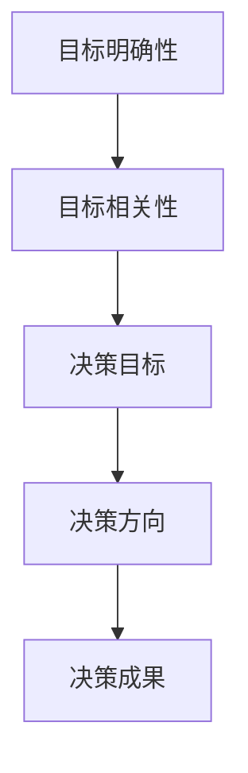

在这个流程图中，目标明确性和目标相关性决定了决策目标，进而影响决策方向和成果。

**核心算法原理讲解**

我们可以使用以下伪代码来表示确定决策目标的过程：

```python
def define_decision_objective():
    # 收集信息
    information = collect_information()
    # 分析信息
    analysis = analyze_information(information)
    # 确定目标
    objective = determine_objective(analysis)
    # 目标评估
    validated_objective = validate_objective(objective)
    return validated_objective
```

**举例说明**

例如，一个企业决定扩展其产品线。在确定决策目标时，企业需要明确扩展的产品类型、市场规模和预期收益等具体指标，以确保目标明确性和相关性。

#### 7.1.2 制定备选方案

在明确决策目标后，下一步是制定备选方案。备选方案提供了实现决策目标的多种可能性，是决策过程中的重要步骤。

**核心概念与联系**

制定备选方案的核心概念包括：

- **方案多样性**：确保备选方案具有多样性和创新性。
- **方案可行性**：确保备选方案在资源、时间和技术等方面可行。

我们可以使用以下Mermaid流程图来展示这些概念之间的联系：

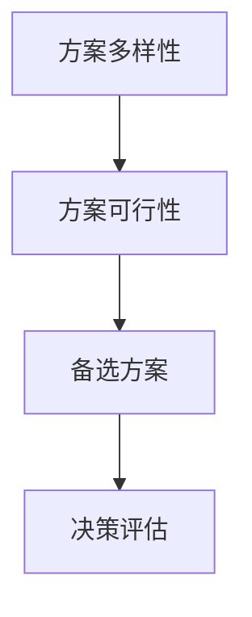

在这个流程图中，方案多样性和方案可行性决定了备选方案，进而影响决策评估。

**核心算法原理讲解**

我们可以使用以下伪代码来表示制定备选方案的过程：

```python
def develop_alternative_solutions():
    # 收集信息
    information = collect_alternative_solution_informations()
    # 分析信息
    analysis = analyze_alternative_solution_informations(information)
    # 创新方案
    innovative_solutions = generate_innovative_solutions(analysis)
    # 评估可行性
    feasible_solutions = evaluate_feasibility(innovative_solutions)
    return feasible_solutions
```

**举例说明**

例如，在决定企业市场推广策略时，企业可以制定多种备选方案，如线上广告、社交媒体营销和合作伙伴推广等。通过评估这些方案的可行性和效果，企业可以选出最佳的推广策略。

#### 7.1.3 评估备选方案

在制定备选方案后，下一步是对备选方案进行评估。评估过程包括对每个方案的优势、劣势、风险和成本进行详细分析。

**核心概念与联系**

评估备选方案的核心概念包括：

- **优势与劣势**：分析每个方案的优势和劣势。
- **风险与成本**：评估每个方案的风险和成本。
- **综合评价**：对每个方案进行综合评价，选择最佳方案。

我们可以使用以下Mermaid流程图来展示这些概念之间的联系：

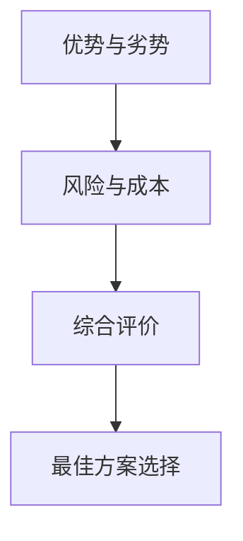

在这个流程图中，优势与劣势、风险与成本和综合评价共同决定了最佳方案的选择。

**核心算法原理讲解**

我们可以使用以下伪代码来表示评估备选方案的过程：

```python
def evaluate_alternative_solutions():
    # 收集评估信息
    evaluation_information = collect_evaluation_informations()
    # 分析优势与劣势
    advantages_and_disadvantages = analyze_advantages_and_disadvantages(evaluation_information)
    # 评估风险与成本
    risks_and_costs = evaluate_risks_and_costs(evaluation_information)
    # 综合评价
    comprehensive_evaluation = perform_comprehensive_evaluation(advantages_and_disadvantages, risks_and_costs)
    # 选择最佳方案
    best_solution = select_best_solution(comprehensive_evaluation)
    return best_solution
```

**举例说明**

例如，在决定企业新产品发布策略时，企业可以评估不同渠道的宣传效果、成本和潜在风险，通过综合评价选择最佳的新产品发布方案。

#### 7.1.4 选择最佳方案

在评估备选方案后，下一步是选择最佳方案。选择最佳方案是决策过程的关键一步，决定了最终决策的执行方向。

**核心概念与联系**

选择最佳方案的核心概念包括：

- **优先级**：根据评估结果确定每个方案的优先级。
- **决策质量**：确保决策质量，避免因小失大。
- **灵活性**：确保方案具有一定的灵活性，以应对未来的不确定性。

我们可以使用以下Mermaid流程图来展示这些概念之间的联系：

```mermaid
graph TD
A[优先级] --> B[决策质量]
B --> C[灵活性]
C --> D[最佳方案选择]
```

在这个流程图中，优先级、决策质量和灵活性共同决定了最佳方案的选择。

**核心算法原理讲解**

我们可以使用以下伪代码来表示选择最佳方案的过程：

```python
def select_best_solution():
    # 收集评估结果
    evaluation_results = collect_evaluation_results()
    # 确定优先级
    priority = determine_priority(evaluation_results)
    # 确保决策质量
    decision_quality = ensure_decision_quality(priority)
    # 确保灵活性
    flexibility = ensure_flexibility(decision_quality)
    # 选择最佳方案
    best_solution = select_best_solution(flexibility)
    return best_solution
```

**举例说明**

例如，在决定企业新项目投资时，企业可以根据评估结果确定每个投资方案的优先级，确保决策质量，同时考虑方案的未来灵活性，最终选择最佳的投资方案。

#### 7.1.5 执行决策方案

最后一步是执行决策方案。执行决策方案是决策过程的关键环节，决定了决策目标的实现程度。

**核心概念与联系**

执行决策方案的核心概念包括：

- **资源分配**：合理分配资源，确保方案能够顺利实施。
- **执行监控**：监控执行过程，及时调整策略。
- **反馈机制**：建立反馈机制，评估决策效果。

我们可以使用以下Mermaid流程图来展示这些概念之间的联系：

```mermaid
graph TD
A[资源分配] --> B[执行监控]
B --> C[反馈机制]
C --> D[决策执行]
```

在这个流程图中，资源分配、执行监控和反馈机制共同决定了决策的执行效果。

**核心算法原理讲解**

我们可以使用以下伪代码来表示执行决策方案的过程：

```python
def execute_decision_solution():
    # 资源分配
    resource_allocation = allocate_resources()
    # 执行监控
    execution_monitoring = monitor_execution(resource_allocation)
    # 反馈机制
    feedback_mechanism = implement_feedback_mechanism(execution_monitoring)
    # 决策执行
    executed_solution = execute_solution(feedback_mechanism)
    return executed_solution
```

**举例说明**

例如，在执行企业市场推广策略时，企业需要合理分配营销资源，监控推广效果，并根据反馈调整推广策略，确保市场推广目标的实现。

通过以上对果断决策的步骤与方法的探讨，我们可以看到，果断决策不仅需要明确决策目标、制定备选方案和评估最佳方案，还需要有效执行决策方案。在下一章中，我们将通过案例分析与决策实战，帮助读者更好地理解果断决策的艺术。

### 第8章：案例分析与决策实战

#### 8.1.1 决策案例分析

为了更好地理解果断决策的艺术，我们可以通过实际案例来分析决策过程，探讨成功和失败的原因。

**案例一：苹果公司新产品发布**

**背景介绍**：苹果公司是一家全球知名的技术企业，以其创新和卓越的产品设计而闻名。在一次新产品发布中，苹果公司决定推出一款全新的智能手机。

**核心概念与联系**

- **市场需求**：通过市场调研，确定新产品的市场需求。
- **技术可行性**：评估新产品的技术实现可能性。
- **竞争对手分析**：分析竞争对手的产品和策略。

我们可以使用以下Mermaid流程图来展示这些概念之间的联系：

```mermaid
graph TD
A[市场需求] --> B[技术可行性]
B --> C[竞争对手分析]
C --> D[决策制定]
D --> E[新产品发布]
```

在这个流程图中，市场需求、技术可行性和竞争对手分析共同影响了苹果公司的决策制定，最终实现了新产品的成功发布。

**核心算法原理讲解**

以下是决策分析的伪代码：

```python
def analyze_decision_case():
    # 市场需求分析
    market_demand = analyze_market_demand()
    # 技术可行性评估
    technical_feasibility = evaluate_technical_feasibility()
    # 竞争对手分析
    competitor_analysis = analyze_competitors()
    
    # 决策制定
    decision = make_decision(market_demand, technical_feasibility, competitor_analysis)
    return decision
```

**举例说明**

苹果公司通过市场调研发现，消费者对智能手机的功能和设计有较高要求。在技术可行性评估中，苹果公司确定了新一代芯片的设计方案。通过竞争对手分析，苹果公司发现竞争对手的产品在设计和功能上存在不足。基于这些信息，苹果公司决定推出一款集高性能、创新设计和卓越用户体验于一体的智能手机。

**案例二：小企业市场扩展**

**背景介绍**：一家小型企业决定扩展其市场，以增加市场份额。

**核心概念与联系**

- **市场定位**：确定企业的目标市场和客户群体。
- **资源分配**：合理分配企业的资源和预算。
- **竞争对手分析**：分析竞争对手的市场策略和表现。

我们可以使用以下Mermaid流程图来展示这些概念之间的联系：

```mermaid
graph TD
A[市场定位] --> B[资源分配]
B --> C[竞争对手分析]
C --> D[市场扩展决策]
```

在这个流程图中，市场定位、资源分配和竞争对手分析共同影响了企业的市场扩展决策。

**核心算法原理讲解**

以下是决策分析的伪代码：

```python
def analyze_decision_case():
    # 市场定位
    market_positioning = determine_market_positioning()
    # 资源分配
    resource_allocation = allocate_resources()
    # 竞争对手分析
    competitor_analysis = analyze_competitors()
    
    # 市场扩展决策
    expansion_decision = make_expansion_decision(market_positioning, resource_allocation, competitor_analysis)
    return expansion_decision
```

**举例说明**

该小型企业通过市场调研发现，其目标市场在年轻人群体中具有较大潜力。在资源分配中，企业决定将预算重点投入市场推广和产品创新。通过竞争对手分析，企业发现竞争对手的产品在价格和功能上存在一定不足。基于这些信息，企业决定通过推出更具性价比和创新功能的产品来扩展市场。

#### 8.1.2 决策实战技巧

在决策实战中，领导者需要掌握一系列技巧，以确保决策的准确性和有效性。

**1. 快速决断**

快速决断是果断决策的重要特征。领导者需要在有限的时间内快速分析信息，做出决策。以下是一些快速决断的技巧：

- **简化信息**：将复杂信息简化为关键点，避免被过多细节所困扰。
- **利用直觉**：在紧急情况下，领导者可以利用直觉快速做出决策。
- **建立决策模板**：为常见问题建立决策模板，加快决策速度。

**2. 全面评估**

在决策过程中，领导者需要对备选方案进行全面评估，以确保选择的最佳方案。以下是一些全面评估的技巧：

- **多角度分析**：从不同角度分析备选方案，包括优势、劣势、风险和成本。
- **征求多方意见**：征求团队成员和专家的意见，以获取更全面的评估。
- **使用决策模型**：使用决策模型（如决策树、成本效益分析等）来辅助评估。

**3. 风险管理**

在决策过程中，领导者需要识别和管理潜在风险。以下是一些风险管理的技巧：

- **识别风险**：在决策前，全面识别潜在风险。
- **评估风险**：评估每个风险的严重程度和可能性。
- **制定应对策略**：为每个风险制定相应的应对策略。

**4. 沟通与执行**

在决策执行过程中，领导者需要确保沟通和执行的效率。以下是一些沟通与执行的技巧：

- **明确目标**：确保团队成员明确决策目标。
- **建立执行计划**：制定详细的执行计划，明确每个步骤的责任人。
- **持续沟通**：在执行过程中，保持与团队成员的沟通，及时解决执行中的问题。

#### 8.1.3 决策失误与应对

尽管领导者努力做出明智的决策，但决策失误仍然是不可避免的。以下是一些常见的决策失误和应对策略：

**1. 过度自信**

**失误原因**：领导者过度依赖自己的直觉和经验，忽视数据和分析。

**应对策略**：领导者应保持谦虚态度，重视数据和分析，避免过度自信。

**2. 缺乏信息**

**失误原因**：决策时缺乏必要的信息和资源。

**应对策略**：在决策前，确保收集到充分的信息，利用各种资源进行评估。

**3. 忽视风险**

**失误原因**：领导者忽视潜在风险，导致决策失败。

**应对策略**：在决策过程中，全面识别和管理风险，制定应对策略。

通过案例分析、决策实战技巧和决策失误的应对策略，我们可以更好地理解果断决策的艺术。在下一章中，我们将探讨领导力与决断力的平衡，帮助读者在领导中保持决断力。

### 第9章：领导力与决断力的平衡

#### 9.1.1 领导力与决断力的关系

领导力与决断力是相辅相成的。领导力提供了决断力的基础，而决断力则是领导力的体现。一个有效的领导者需要在具备强大领导力的同时，拥有出色的决断力。

**核心概念与联系**

领导力与决断力的关系可以用以下Mermaid流程图来展示：

```mermaid
graph TD
A[领导力] --> B[影响力]
B --> C[决断力]
C --> D[团队效能]
```

在这个流程图中，领导力通过影响力影响决断力，进而提升团队效能。

**核心算法原理讲解**

我们可以使用以下伪代码来表示领导力与决断力的关系：

```python
def leadership_decision_making():
    # 提升领导力
    leadership = enhance_leadership()
    # 增强影响力
    influence = increase_influence(leadership)
    # 提高决断力
    decision_making = improve_decision_making(influence)
    # 提升团队效能
    team_efficiency = increase_team_efficiency(decision_making)
    return team_efficiency
```

**举例说明**

例如，一位项目经理在领导团队开发新产品时，通过提升自己的领导力和影响力，使团队成员更加信任和支持他。在此基础上，他能够快速做出决断，有效应对开发过程中的挑战，最终提升团队效能。

#### 9.1.2 如何在领导中保持决断力

在领导过程中，保持决断力是领导者成功的关键。以下是一些建议：

**1. 保持信息流通**

领导者需要确保信息在团队内部和上下级之间畅通无阻。这有助于领导者快速获取所需信息，做出准确决策。

**2. 建立决策团队**

建立由多部门代表组成的决策团队，可以增强决策的多样性和全面性。团队成员可以提供不同的观点和意见，帮助领导者做出更全面的决策。

**3. 练习快速决断**

领导者可以通过日常练习来提高快速决断的能力。例如，在团队讨论中，领导者可以尝试在短时间内做出决策，并解释决策背后的逻辑。

**4. 建立决策框架**

领导者可以建立一套决策框架，帮助团队在面临问题时快速做出决策。这个框架可以包括明确的目标、评估标准和决策流程。

**5. 授权与支持**

领导者应授权下属参与决策过程，并提供必要的支持。这有助于激发下属的创造力和责任感，同时减轻领导者的决策负担。

**6. 持续学习**

领导者应不断学习新的决策技巧和理论，以提高自己的决断力。这可以通过阅读相关书籍、参加培训和与同行交流来实现。

**7. 管理压力**

领导者需要学会管理压力，避免因焦虑和压力而做出错误的决策。可以通过锻炼、冥想和良好的作息时间来减轻压力。

#### 9.1.3 决断力在团队领导中的运用

决断力在团队领导中的运用至关重要。以下是一些具体建议：

**1. 确定优先事项**

在团队领导中，领导者需要明确团队的优先事项，并据此做出决策。这有助于团队集中精力，高效完成任务。

**2. 快速应对变化**

团队面临变化时，领导者需要迅速做出决策，调整团队的方向和策略。这需要领导者具备快速分析和决断的能力。

**3. 激发团队创造力**

领导者可以通过鼓励团队成员提出创新方案和意见，激发团队的创造力。在决策过程中，领导者应考虑这些创意，以提升决策的质量。

**4. 建立信任文化**

建立信任文化是团队领导中保持决断力的重要因素。领导者需要通过透明、公正和诚实的沟通来建立信任，使团队成员更加信任和依赖领导者的决策。

**5. 鼓励团队参与**

领导者应鼓励团队成员参与决策过程，提供反馈和建议。这不仅有助于提升决策的质量，还能增强团队成员的责任感和归属感。

**6. 定期回顾决策**

领导者应定期回顾团队的决策过程和结果，评估决策的效果。这有助于发现决策中的问题和不足，为未来的决策提供改进方向。

通过以上探讨，我们可以看到，领导力与决断力是相辅相成的，领导者需要平衡两者，在领导过程中保持决断力。在下一章中，我们将探讨如何通过持续学习和实践来提升领导力与决断力。

### 第10章：领导力与决断力提升

#### 10.1.1 持续学习的重要性

在快速变化的技术和商业环境中，持续学习对于提升领导力与决断力至关重要。持续学习不仅能够帮助领导者跟上时代的步伐，还能提升他们的知识储备和解决问题的能力。

**核心概念与联系**

持续学习的重要性可以用以下Mermaid流程图来展示：

```mermaid
graph TD
A[知识更新] --> B[决策能力]
B --> C[领导力]
C --> D[组织效能]
```

在这个流程图中，知识更新通过提升决策能力和领导力，最终提高组织效能。

**核心算法原理讲解**

我们可以使用以下伪代码来表示持续学习的过程：

```python
def continuous_learning():
    # 更新知识库
    knowledge_base = update_knowledge_base()
    # 应用新知识
    apply_new_knowledge = apply_new_knowledge(knowledge_base)
    # 提升决策能力
    decision_making = enhance_decision_making(apply_new_knowledge)
    # 提高领导力
    leadership = improve_leadership(decision_making)
    # 提升组织效能
    organizational_efficacy = increase_organizational_efficacy(leadership)
    return organizational_efficacy
```

**举例说明**

例如，一位技术领导者通过参加技术会议和在线课程，不断更新自己的技术知识。这些新知识不仅帮助他在技术决策中做出更明智的选择，还提高了他在团队中的领导力，最终提升了整个组织的效能。

#### 10.1.2 提升决断力的实践方法

提升决断力不仅需要理论支持，还需要通过实践方法来培养。以下是一些有效的实践方法：

**1. 小步快跑**

通过小步快跑的方法，领导者可以在实践中逐步提升决断力。每次只关注一个小决策，通过实践和反思，逐步提高决策质量。

**2. 反思与总结**

在每次决策后，领导者应进行反思和总结，分析决策的正确与否，以及背后的原因。这有助于领导者发现决策中的不足，并不断改进。

**3. 接受挑战**

领导者应主动接受具有挑战性的任务，这有助于他们在面对复杂问题时，提升决断力和应对能力。

**4. 学习他人**

通过观察和学习其他领导者的决策过程，领导者可以借鉴他们的成功经验，提升自己的决断力。

**5. 模拟决策**

通过模拟决策，领导者可以在安全的环境中练习决策，降低实际决策中的风险。这有助于提升他们在实际决策中的信心和效率。

**核心算法原理讲解**

我们可以使用以下伪代码来表示提升决断力的实践方法：

```python
def improve_decision_making():
    # 小步快跑
    incremental_steps = practice_incremental_decision_making()
    # 反思与总结
    reflection_and_summary = engage_in_reflection_and_summary()
    # 接受挑战
    accept_challenges = take_on_challenging_tasks()
    # 学习他人
    learn_from_others = study_other_leaders_decision_making()
    # 模拟决策
    simulate_decisions = practice_simulation_decision_making()
    
    # 综合提升决断力
    enhanced_decision_making = combine_practices(incremental_steps, reflection_and_summary, accept_challenges, learn_from_others, simulate_decisions)
    return enhanced_decision_making
```

**举例说明**

例如，一位项目经理通过参与小项目管理和反思每次决策的过程，逐步提升了自己的决断力。他还主动接受复杂项目，通过模拟决策和观察其他项目经理的决策，进一步提高了自己的决策能力。

#### 10.1.3 领导力与决断力的未来发展

随着技术的不断进步和商业环境的复杂化，领导力与决断力将在未来扮演更加重要的角色。以下是对未来发展趋势的展望：

**1. 数据驱动的决策**

随着大数据和人工智能技术的发展，数据驱动的决策将越来越普及。领导者需要学会利用数据来支持决策，提高决策的准确性和效率。

**2. 个性化领导**

未来领导力将更加注重个性化领导，领导者需要根据团队成员的特点和需求，提供个性化的支持和指导，提高团队效能。

**3. 灵活应变**

在快速变化的环境中，领导者需要具备更高的灵活应变能力。这包括快速适应新环境、灵活调整策略和快速做出决策。

**4. 持续学习**

持续学习将成为领导者的基本素质。领导者需要不断更新知识和技能，以适应不断变化的环境和挑战。

**核心算法原理讲解**

我们可以使用以下伪代码来表示未来的发展趋势：

```python
def future_leadership_decision_making():
    # 数据驱动
    data_driven = implement_data_driven_decision_making()
    # 个性化领导
    personalized_leadership = adopt_personality_based_leadership()
    # 灵活应变
    agile_adaptation = improve_agile_adaptation_ability()
    # 持续学习
    continuous_learning = promote_continual_learning()
    
    # 未来领导力与决断力模型
    future_leadership_decision_model = integrate_strategies(data_driven, personalized_leadership, agile_adaptation, continuous_learning)
    return future_leadership_decision_model
```

**举例说明**

例如，一位未来领导者通过利用大数据分析来支持决策，提供个性化领导，提高团队灵活应变能力，并不断学习新的技术和策略，成为了一个出色的领导者。

通过以上对领导力与决断力提升的探讨，我们可以看到，持续学习和实践是提升领导力与决断力的关键。在未来的发展中，领导者需要适应新的技术环境和商业挑战，不断提升自己的领导力和决断力，以实现个人和组织的成功。

### 结尾

《领导力与决断力：果断决策的艺术》为我们提供了一种全面理解和提升领导力的框架。从领导力的定义与重要性，到决断力的概念与特性，再到决策的实战技巧和案例分析，我们系统地探讨了领导力和决断力在个人和组织成功中的关键作用。

**最佳实践 Tips**：

1. **小步快跑**：通过小规模的实践和反思，逐步提升决断力。
2. **数据驱动**：利用数据支持决策，提高决策的准确性和效率。
3. **个性化领导**：根据团队成员的特点和需求，提供个性化的支持和指导。

**注意事项**：

1. **持续学习**：领导力与决断力不是一成不变的，领导者需要不断学习新的知识和技能。
2. **风险管理**：在决策过程中，全面识别和管理风险，避免因小失大。

**拓展阅读**：

1. **《五项管理》**：彼得·德鲁克，探讨领导力的核心要素。
2. **《决策与判断》**：丹尼尔·卡尼曼，分析人类决策的心理机制。

作者：AI天才研究院/AI Genius Institute & 禅与计算机程序设计艺术 /Zen And The Art of Computer Programming

---
**文章标题**：领导力与决断力：果断决策的艺术

**关键词**：领导力，决断力，果断决策，团队效能，组织成功

**摘要**：本文深入探讨了领导力和决断力的概念、特性以及如何在实际工作中运用这些能力。通过案例分析、实战技巧和未来发展趋势的展望，为读者提供了一种全面提升领导力和决断力的方法。文章旨在帮助领导者更好地应对复杂的环境和挑战，实现个人和组织的成功。

