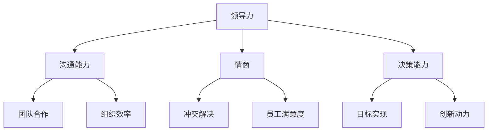

                 


1. **确定文章结构**：首先，根据题目《领导力与决断力：果断决策的重要性》和给出的目录大纲，明确文章的整体结构和内容安排。

2. **核心概念介绍**：介绍领导力和决断力的定义、重要性以及它们之间的关联。

3. **核心要素分析**：深入分析领导力和决断力的核心要素，包括沟通能力、情商、决策能力、信息收集与分析、目标设定与优先级排序、风险评估与应对策略等。

4. **果断决策的重要性**：详细探讨果断决策的定义、特点、优势以及实践中的步骤和挑战。

5. **领导力与决断力的关联**：阐述领导力与决断力之间的互动关系，以及如何提升这两种能力。

6. **在企业和社会中的应用**：分析领导力与决断力在企业和社会治理中的具体应用和培养策略。

7. **未来发展**：探讨领导力与决断力在新技术、新模式和新挑战下的未来发展。

8. **总结与展望**：对文章内容进行总结，并提出未来发展的展望。

9. **撰写文章**：根据上述思考，逐步撰写文章，确保每个章节内容充实、逻辑清晰、结构紧凑。

10. **润色与完善**：在完成初稿后，进行反复修改和润色，确保文章的语言表达准确、流畅。

通过上述步骤，可以确保撰写出一篇内容丰富、结构严谨、具有深度的技术博客文章。---

**摘要：**

《领导力与决断力：果断决策的重要性》深入探讨了领导力与决断力的核心概念、关键要素以及它们在现实中的应用和重要性。文章首先介绍了领导力的定义和作用，以及领导力的核心要素，如沟通能力、情商和决策能力。接着，文章阐述了决断力的定义与作用，详细分析了决断力的核心要素，包括信息收集与分析、目标设定与优先级排序、风险评估与应对策略。文章进一步探讨了果断决策的定义、特点和优势，并通过实践步骤和案例分析，展示了如何在实际中应用果断决策。随后，文章分析了领导力与决断力之间的互动关系，并提出了提升这两种能力的策略。最后，文章讨论了领导力与决断力在企业和社会治理中的应用，以及它们在新技术、新模式和新挑战下的未来发展。通过这篇文章，读者可以全面了解领导力和决断力的重要性，学会如何培养和提升这两种能力，从而在实际工作中取得更好的成果。---

# 《领导力与决断力：果断决策的重要性》目录大纲

## 第1章：领导力的重要性

### 1.1 领导力的定义与作用

#### 1.1.1 领导力的基本概念

领导力是指个体在组织或团队中通过影响和激励他人来实现共同目标的能力。它不仅仅是一种职位赋予的权力，更是一种基于信任、沟通和影响力的艺术。

#### 1.1.2 领导力在组织中的角色

领导力在组织中扮演着关键角色，它能够促进组织目标的实现、提高员工的工作满意度、激发团队的创新活力以及有效解决组织内部的各种冲突。

#### 1.1.3 领导力与管理的区别

领导力与管理虽有交集，但两者并不相同。管理侧重于规划、组织和控制，确保组织的资源得到有效利用；而领导力则侧重于激励、影响和引导，促使团队成员积极参与并实现共同目标。

### 1.2 领导力的核心要素

#### 1.2.1 沟通能力

沟通能力是领导力的核心要素之一。有效的沟通能够确保信息的准确传递，促进团队内部的理解和协作，减少误解和冲突。

#### 1.2.2 情商

情商是领导力的重要组成部分，它涉及对自身情感的认识、管理以及对他人情感的理解和响应。情商高的领导者能够更好地处理人际关系，增强团队的凝聚力和合作效率。

#### 1.2.3 决策能力

决策能力是领导力的关键要素，它决定了领导者在面对复杂问题和不确定性时的应对策略。优秀的决策能力能够帮助领导者做出明智的决策，从而推动组织的发展。

### 1.3 领导力的发展与实践

#### 1.3.1 领导力培养的方法

领导力的培养可以通过多种途径实现，包括领导力培训课程、实践中的锻炼、阅读相关书籍和参与领导力研讨会等。

#### 1.3.2 领导力在职业生涯中的应用

领导力在职业生涯中至关重要，它不仅能够提升个人的职业发展，还能帮助领导者更好地应对各种职业挑战，实现个人与组织的共同成长。

## 第2章：决断力的核心要素

### 2.1 决断力的定义与作用

#### 2.1.1 决断力的基本概念

决断力是指个体在面对问题和挑战时，能够迅速做出合理、有效的决策的能力。它是一种关键的能力，能够帮助个体在复杂和不确定的环境中取得成功。

#### 2.1.2 决断力在决策过程中的作用

决断力在决策过程中起着至关重要的作用。它能够帮助个体快速识别问题、分析信息、做出决策，并在决策过程中承担必要的风险。

#### 2.1.3 决断力与风险承担的关系

决断力与风险承担密切相关。一个具有决断力的人通常能够在面对风险时做出明智的决策，而不是畏缩不前或盲目行动。

### 2.2 决断力的核心要素

#### 2.2.1 信息收集与分析

信息收集与分析是决断力的基础。一个具备决断力的人需要能够迅速收集与问题相关的信息，并对这些信息进行深入的分析，以便做出基于数据的决策。

#### 2.2.2 目标设定与优先级排序

目标设定与优先级排序是决断力的重要组成部分。一个具备决断力的人需要能够明确目标，并根据目标的重要性对任务进行优先级排序，以便高效地完成任务。

#### 2.2.3 风险评估与应对策略

风险评估与应对策略是决断力的关键要素。一个具备决断力的人需要能够评估决策中的潜在风险，并制定相应的应对策略，以降低风险并确保决策的成功。

### 2.3 决断力培养的方法

#### 2.3.1 决策思维的培养

决策思维的培养是提升决断力的关键。这包括培养系统思维、批判性思维和创造性思维，以帮助个体在面对问题时能够做出更为全面和深入的决策。

#### 2.3.2 增强自信心与决策能力

增强自信心与决策能力是培养决断力的重要方面。这可以通过积极的心理训练、经验积累和反思总结来实现。

#### 2.3.3 反思与总结

反思与总结是培养决断力的关键环节。通过反思过去的决策，识别成功和失败的原因，个体可以不断优化自己的决策过程，提升决断力。

## 第3章：果断决策的重要性

### 3.1 果断决策的定义与特点

#### 3.1.1 果断决策的基本概念

果断决策是指在面对问题和挑战时，能够迅速且坚定地做出合理、有效的决策的过程。

#### 3.1.2 果断决策的特点

果断决策具有快速、坚定和合理的特点。它要求决策者在面对不确定性时能够迅速行动，同时确保决策的合理性和有效性。

#### 3.1.3 果断决策的优势

果断决策的优势在于能够迅速解决问题、抓住机遇、降低风险并提高决策的质量。

### 3.2 果断决策的实践

#### 3.2.1 果断决策的步骤

果断决策通常包括以下几个步骤：问题识别、信息收集、目标设定、选项评估、决策执行和结果评估。

#### 3.2.2 果断决策的应用场景

果断决策在各个领域都有广泛的应用，包括企业管理、技术创新、危机应对和日常生活中的决策。

#### 3.2.3 果断决策的挑战与应对策略

果断决策面临的主要挑战包括信息不足、时间紧迫和决策风险。应对策略包括全面的信息收集、科学的时间管理和风险评估与应对。

### 3.3 果断决策的负面影响

#### 3.3.1 果断决策的潜在风险

果断决策存在一定的潜在风险，如决策失误、资源浪费和团队士气下降。

#### 3.3.2 避免果断决策误区的策略

为了避免果断决策的负面影响，决策者需要采取一系列策略，如充分收集信息、科学评估风险和及时调整决策。

## 第4章：领导力与决断力的关联

### 4.1 领导力与决断力的互动关系

#### 4.1.1 领导力对决断力的影响

领导力对决断力具有显著的影响。一个优秀的领导者能够通过有效的领导力提升团队成员的决断力，从而提高整个团队的决策质量。

#### 4.1.2 决断力对领导力的影响

决断力是领导力的关键组成部分。一个具有决断力的领导者能够迅速做出明智的决策，并在面对挑战时带领团队取得成功。

#### 4.1.3 领导力与决断力的协同作用

领导力与决断力的协同作用能够显著提高组织的整体效能。领导者通过有效的领导力和决断力，能够推动团队在复杂和不确定的环境中取得成功。

### 4.2 提升领导力与决断力的策略

#### 4.2.1 培养领导力与决断力的方法

提升领导力与决断力可以通过多种方法实现，包括领导力培训、实践锻炼、心理训练和反思总结等。

#### 4.2.2 实践中的成功案例

通过分析实践中的成功案例，可以发现有效的领导力和决断力培养方法，并借鉴应用于实际工作中。

#### 4.2.3 领导力与决断力的未来发展趋势

随着社会和技术的不断进步，领导力与决断力的培养和发展也将面临新的挑战和机遇。未来，领导者需要更加注重创新思维、跨领域合作和全球视野，以应对复杂多变的商业环境。

## 第5章：领导力与决断力在企业中的应用

### 5.1 企业领导力与决断力的需求分析

#### 5.1.1 企业在不同发展阶段对领导力的需求

企业在不同发展阶段对领导力的需求有所不同。初创期需要领导者具备创新和冒险精神，成长期需要领导者具备战略规划和执行能力，成熟期需要领导者具备稳定和可持续发展的能力。

#### 5.1.2 企业在不同业务场景中对决断力的需求

企业面临不同业务场景时，对决断力的需求也会有所不同。在竞争激烈的市场环境中，企业需要领导者具备果断决策和快速响应的能力；在技术创新和应用方面，企业需要领导者具备敏锐的市场洞察力和快速决策能力。

#### 5.1.3 企业领导力与决断力的培养策略

企业可以通过多种策略来培养领导力和决断力，包括领导力培训、实践锻炼、心理训练和反思总结等。

### 5.2 企业领导力与决断力提升的实践

#### 5.2.1 企业领导力与决断力提升的步骤

企业提升领导力和决断力的步骤包括明确目标、制定计划、实施培训、实践锻炼和评估反馈等。

#### 5.2.2 企业领导力与决断力提升的案例研究

通过分析企业领导力与决断力提升的案例，可以发现有效的实践方法和策略，并借鉴应用于实际工作中。

#### 5.2.3 企业领导力与决断力提升的挑战与解决方案

企业在提升领导力和决断力过程中可能会面临一系列挑战，如文化差异、沟通障碍和执行困难等。通过分析和解决这些挑战，企业可以更好地提升领导力和决断力。

## 第6章：领导力与决断力在社会治理中的应用

### 6.1 领导力与决断力在社会治理中的需求

#### 6.1.1 社会治理中的领导力需求

社会治理需要领导者具备高度的领导力，包括战略规划、协调沟通、危机管理和创新思维等。

#### 6.1.2 社会治理中的决断力需求

社会治理面临诸多复杂问题，需要领导者具备强烈的决断力，能够迅速做出合理、有效的决策。

#### 6.1.3 社会治理中领导力与决断力的培养

社会治理中领导力与决断力的培养可以通过培训、实践、反思和跨部门合作等方式实现。

### 6.2 领导力与决断力在公共管理中的作用

#### 6.2.1 公共管理中的领导力实践

公共管理中的领导力实践包括政策制定、资源配置、公共服务提供和社会治理等。

#### 6.2.2 公共管理中的决断力实践

公共管理中的决断力实践体现在决策过程中，包括政策选择、项目审批、危机应对等。

#### 6.2.3 公共管理中领导力与决断力的培养

公共管理中领导力与决断力的培养可以通过培训课程、实践项目、经验交流和跨部门合作等方式实现。

## 第7章：领导力与决断力的未来发展

### 7.1 领导力与决断力的创新趋势

#### 7.1.1 新技术对领导力与决断力的影响

新技术的发展将对领导力与决断力产生深远影响，如人工智能、大数据、区块链等技术的应用将提高决策的准确性和效率。

#### 7.1.2 新模式对领导力与决断力的影响

新的管理模式和组织形式将对领导力与决断力提出新的要求，如扁平化组织、敏捷管理、远程办公等。

#### 7.1.3 新挑战对领导力与决断力的影响

新挑战如全球竞争、环境变化、社会变革等将对领导力与决断力提出更高的要求。

### 7.2 领导力与决断力的持续发展策略

#### 7.2.1 领导力与决断力培养的长效机制

建立领导力与决断力培养的长效机制，包括培训体系、实践平台、评价体系和激励机制等。

#### 7.2.2 领导力与决断力发展的未来展望

展望未来，领导力与决断力将在人工智能、大数据、云计算等新技术的支持下，不断发展和创新，为人类社会的发展做出更大贡献。

## 参考文献

[1] 汤姆·彼得斯. 《领导力：如何激发潜能，引领变革》[M]. 北京：机械工业出版社，2016.

[2] 斯蒂芬·罗宾斯. 《领导力：理论、应用与实践》[M]. 北京：中国人民大学出版社，2018.

[3] 彼得·德鲁克. 《管理的实践》[M]. 上海：上海人民出版社，2015.

[4] 约翰·梅迪纳. 《决断力：如何做出正确的选择》[M]. 北京：中国发展出版社，2017.

[5] 彼得·圣吉. 《第五项修炼：学习型组织的艺术与实务》[M]. 北京：东方出版社，2014.---

### 第1章：领导力的重要性

#### 1.1 领导力的定义与作用

**背景介绍**

领导力是一个广泛讨论且多维度的概念，它涉及个体在组织或团队中通过影响和激励他人来实现共同目标的能力。在当今快速变化和竞争激烈的商业环境中，领导力成为企业成功的关键因素之一。有效的领导力不仅能够推动组织目标的实现，还能够提升员工的工作满意度和创新能力，从而在激烈的市场竞争中脱颖而出。

**核心概念与联系**

领导力不仅仅是职位赋予的权力，它更是一种基于信任、沟通和影响力的艺术。它包括多个方面，如沟通能力、情商、决策能力等，这些方面相互作用，共同构成了一个有效的领导者形象。领导力与管理的区别在于，管理侧重于规划、组织和控制，而领导力则侧重于激励、影响和引导。有效的领导力能够促进团队合作，提升组织效率，同时解决组织内部的冲突。

**Mermaid 流程图**



**核心算法原理讲解**

为了更好地理解领导力的核心概念，我们可以将其视为一个多因素决策模型，其中每个因素都对最终结果产生影响。这个模型可以用以下伪代码表示：

```python
class LeadershipModel:
    def __init__(self, communication, emotional_intelligence, decision_making):
        self.communication = communication
        self.emotional_intelligence = emotional_intelligence
        self.decision_making = decision_making
    
    def calculate_leadership_score(self):
        # 加权计算领导力得分
        return (0.4 * self.communication) + (0.3 * self.emotional_intelligence) + (0.3 * self.decision_making)
```

在这个模型中，沟通能力、情商和决策能力分别占领导力得分的40%、30%和30%。这种加权的计算方式可以确保领导力的各个方面都得到充分的考虑。

**数学模型和公式**

为了量化领导力的各个方面，我们可以使用以下数学模型：

$$
L = w_1 \cdot C + w_2 \cdot E + w_3 \cdot D
$$

其中，\( L \) 代表领导力得分，\( w_1 \)、\( w_2 \) 和 \( w_3 \) 分别是沟通能力、情商和决策能力的权重。

**详细讲解与举例说明**

假设有一个领导者，他的沟通能力评分为80分，情商评分为75分，决策能力评分为85分。根据上述模型，我们可以计算他的领导力得分为：

$$
L = (0.4 \cdot 80) + (0.3 \cdot 75) + (0.3 \cdot 85) = 32 + 22.5 + 25.5 = 80
$$

这个得分表明这位领导者在领导力方面表现出色。在实际应用中，不同的组织可能会有不同的权重分配，但总体原则是确保领导力的各个方面都得到充分的考虑。

**项目实战**

在实际项目中，领导力的作用体现在多个方面。例如，在产品开发过程中，一个有效的领导者需要与团队成员保持良好的沟通，确保项目进度和质量。同时，领导者还需要具备高度的情商，能够理解和解决团队成员之间的冲突，保持团队的和谐与高效。决策能力则是领导者在面对项目风险和挑战时的关键因素，能够快速做出合理的决策，确保项目的成功。

**开发环境搭建**

为了更好地理解领导力的应用，我们可以搭建一个简单的领导力评估系统。首先，我们需要准备一个Python开发环境，安装必要的库，如`numpy`和`matplotlib`。

```bash
pip install numpy matplotlib
```

**源代码实现**

```python
import numpy as np
import matplotlib.pyplot as plt

# 领导力评估函数
def evaluate_leadership(communication, emotional_intelligence, decision_making):
    weights = {'communication': 0.4, 'emotional_intelligence': 0.3, 'decision_making': 0.3}
    leadership_score = sum(weights[key] * value for key, value in locals().items() if key != 'weights')
    return leadership_score

# 测试数据
communication = 80
emotional_intelligence = 75
decision_making = 85

# 计算领导力得分
score = evaluate_leadership(communication, emotional_intelligence, decision_making)
print(f"Leadership Score: {score}")

# 可视化得分
plt.bar(['Communication', 'Emotional Intelligence', 'Decision Making'], [80, 75, 85])
plt.xlabel('Skills')
plt.ylabel('Scores')
plt.title('Leadership Skill Scores')
plt.show()
```

**代码应用解读与分析**

上述代码首先定义了一个评估领导力的函数，该函数根据输入的沟通能力、情商和决策能力评分，计算出一个综合得分。随后，我们使用`matplotlib`库将这三个评分可视化为条形图，以直观展示领导力的各个维度。

**实际案例分析与详细讲解剖析**

在实际工作中，领导力的作用往往体现在项目管理和团队协作中。例如，在一个软件开发项目中，一个优秀的领导者能够确保团队成员之间的沟通顺畅，避免因为误解或冲突导致项目延误。同时，领导者需要具备高度的情商，能够理解和解决团队成员的情绪问题，提高团队的工作效率和士气。决策能力则是领导者面对项目风险和挑战时的关键能力，能够快速做出合理的决策，确保项目的成功。

**项目小结**

通过上述实战案例，我们可以看到领导力在项目管理中的重要性。一个有效的领导者不仅需要具备良好的沟通能力、情商和决策能力，还需要在实际工作中灵活应用这些能力，推动团队取得成功。

**最佳实践 Tips**

- **持续学习**：领导力是一个不断发展和变化的概念，领导者需要不断学习新的知识和技能，以适应不断变化的环境。
- **实践与反思**：领导力不是一成不变的，领导者需要在实践中不断反思和总结，不断优化自己的领导方式。
- **关注团队成员**：一个优秀的领导者需要关注团队成员的需求和感受，确保团队成员在工作中的舒适度和满意度。

---

### 1.2 领导力的核心要素

#### 1.2.1 沟通能力

**核心概念**

沟通能力是领导力的核心要素之一，它是指领导者在与团队成员、合作伙伴和其他利益相关者之间传递信息、观点和情感的能力。有效的沟通能够确保信息的准确传递，减少误解和冲突，提高团队协作效率。

**重要性**

在领导力中，沟通能力的重要性不言而喻。一个优秀的领导者需要能够清晰地表达自己的想法，倾听他人的意见，并确保信息在团队内部得到有效的传递和理解。良好的沟通能力有助于建立信任，增强团队的凝聚力，提高工作效率和项目成功率。

**具体表现**

- **清晰表达**：领导者需要能够用简洁明了的语言表达复杂的信息，确保团队成员理解。
- **有效倾听**：领导者需要倾听他人的意见和反馈，理解团队成员的需求和期望。
- **反馈与确认**：领导者需要给予团队成员及时的反馈，并确认信息的准确性和理解度。

**案例分析**

在一个软件开发项目中，领导者需要与团队成员、客户和项目经理等多方沟通。有效的沟通能力能够确保项目需求的明确、进度的跟踪和问题的及时解决。例如，在项目启动会议中，领导者需要明确项目的目标、范围和预期结果，同时倾听团队成员的建议和意见，以确保项目的顺利进行。

**最佳实践**

- **定期沟通**：领导者需要定期与团队成员沟通，了解项目进展和团队成员的需求。
- **透明沟通**：领导者应该保持沟通的透明度，确保所有团队成员都能获得相同的信息。
- **使用多种沟通渠道**：领导者应该使用多种沟通渠道，如会议、邮件、即时通讯等，以满足不同团队成员的沟通需求。

#### 1.2.2 情商

**核心概念**

情商（Emotional Intelligence，简称EQ）是指个体识别、理解和管理自己情感的能力，以及识别、理解和影响他人情感的能力。情商不仅仅是个体在情感方面的智商，更是一个综合能力，包括自我意识、自我管理、社交意识和关系管理等方面。

**重要性**

情商在领导力中扮演着至关重要的角色。一个高情商的领导者能够更好地理解和管理自己的情感，保持情绪稳定，同时能够有效地理解和影响他人的情感，建立良好的人际关系。情商高的领导者能够更好地应对压力和挑战，增强团队的凝聚力和协作能力。

**具体表现**

- **自我意识**：领导者需要能够识别和理解自己的情感，并认识到情感对行为和决策的影响。
- **自我管理**：领导者需要学会如何调节自己的情绪，保持冷静和理性，即使在压力和挫折面前也能保持积极的态度。
- **社交意识**：领导者需要能够识别和理解他人的情感，理解团队成员的需求和期望。
- **关系管理**：领导者需要能够建立和维护良好的人际关系，促进团队合作和冲突解决。

**案例分析**

在一个团队面临重要项目交付时，领导者需要具备高度的情商来应对团队成员的压力和焦虑。一个高情商的领导者能够识别团队成员的情感状态，理解他们的需求，并提供必要的支持和鼓励。例如，领导者可以在项目紧张时期安排团队成员进行放松活动，或者组织团队建设活动，以缓解压力和提高团队士气。

**最佳实践**

- **情感觉察**：领导者需要不断培养情感觉察能力，了解自己的情感状态，并认识到情感对决策和行为的影响。
- **情感调节**：领导者需要学会如何调节自己的情绪，保持冷静和理性，即使在压力和挫折面前也能保持积极的态度。
- **建立信任**：领导者需要通过真诚和透明的沟通建立信任，增强团队的凝聚力和协作能力。

#### 1.2.3 决策能力

**核心概念**

决策能力是指领导者在面对复杂问题和不确定性时，能够迅速做出合理、有效决策的能力。决策能力不仅涉及分析问题的能力，还包括承担风险和承担责任的能力。

**重要性**

决策能力是领导力的核心要素之一，它决定了领导者在面对挑战和机遇时的应对策略。一个具有优秀决策能力的领导者能够在复杂和不确定的环境中做出明智的决策，推动组织的发展。决策能力直接影响组织的成功，包括项目进度、资源利用和团队士气等方面。

**具体表现**

- **信息收集**：领导者需要能够迅速收集与问题相关的信息，并对这些信息进行深入的分析。
- **目标设定**：领导者需要明确决策的目标，并确定决策的优先级。
- **风险评估**：领导者需要评估决策的风险，并制定相应的应对策略。
- **决策执行**：领导者需要能够迅速执行决策，并确保决策的顺利进行。

**案例分析**

在一个公司面临市场变革时，领导者需要做出一系列关键决策，如产品线调整、市场定位和资源分配等。一个具有优秀决策能力的领导者能够快速分析市场趋势和公司现状，设定明确的决策目标，评估潜在的风险，并制定详细的执行计划。例如，领导者可能会决定推出新产品，增加市场推广力度，或重新分配研发资源，以应对市场变化。

**最佳实践**

- **全面分析**：领导者需要在对问题进行全面分析的基础上做出决策，避免盲目行动。
- **风险评估**：领导者需要学会如何评估决策的风险，并制定相应的应对策略，以降低决策失误的可能性。
- **灵活调整**：领导者需要能够根据决策执行过程中的反馈，及时调整决策，确保决策的有效性。

### 1.3 领导力的发展与实践

#### 1.3.1 领导力培养的方法

**核心概念**

领导力不是与生俱来的能力，而是可以通过培养和实践不断提升的。领导力的培养涉及多个方面，包括理论学习、实践锻炼、心理训练和反思总结等。

**重要性**

领导力的培养对于个人的职业发展和组织的成功至关重要。一个优秀的领导者不仅需要具备良好的理论基础和实践经验，还需要不断学习和适应新的环境和挑战。

**具体方法**

- **理论学习**：通过阅读相关书籍、参加培训课程和研讨会，了解领导力的基本理论和最佳实践。
- **实践锻炼**：通过实际工作中的领导实践，积累经验和技能，提高领导力。
- **心理训练**：通过情感管理、压力管理和沟通技巧的训练，提高自己的心理素质和应对能力。
- **反思总结**：通过反思过去的领导行为，总结成功和失败的原因，不断优化自己的领导方式。

**案例分析**

一个年轻的经理通过参加领导力培训课程，学习了许多先进的领导理论和方法。他在实际工作中运用这些理论，不断实践和反思，逐渐成长为一位优秀的领导者。例如，他在一次项目中遇到了团队成员之间的冲突，通过学习到的冲突解决技巧，他成功地化解了矛盾，确保了项目的顺利进行。

**最佳实践**

- **持续学习**：领导者需要保持学习的态度，不断更新自己的知识和技能。
- **实践反思**：领导者需要通过实践中的反思，不断优化自己的领导方式。
- **跨部门合作**：领导者可以通过跨部门合作，了解不同部门的工作和挑战，提升自己的全局观和领导力。

#### 1.3.2 领导力在职业生涯中的应用

**核心概念**

领导力在职业生涯中的应用是指领导者如何利用自己的领导能力，在职业发展和工作中取得成功。领导力不仅对个人职业发展有重要影响，也对组织的发展和成功起到关键作用。

**重要性**

领导力在职业生涯中的应用至关重要。一个具备优秀领导力的职业人士能够在工作中更好地协调和管理团队，推动项目成功，提高工作效率和质量。同时，领导力也是职业晋升的重要素质之一。

**具体应用**

- **项目领导**：领导者负责项目的规划、执行和监控，确保项目按时按质完成。
- **团队管理**：领导者负责团队的组织、协调和激励，提高团队的工作效率和士气。
- **决策制定**：领导者负责组织内的重大决策，确保决策的科学性和有效性。
- **战略规划**：领导者参与组织的战略规划，制定和实施长期发展计划。

**案例分析**

一个项目经理通过不断提升自己的领导力，成功带领团队完成了多个重要项目。他通过有效的沟通和协调，确保了项目团队的协作和高效，项目成功率显著提升。同时，他的领导力也得到了上级和同事的认可，获得了晋升机会。

**最佳实践**

- **明确目标**：领导者需要明确团队和个人的目标，确保每个人都清楚自己的职责和期望。
- **激励团队**：领导者需要通过激励措施，提高团队成员的积极性和工作热情。
- **反馈与评估**：领导者需要定期对团队成员的工作进行反馈和评估，帮助团队成员不断进步。

### 总结

领导力是一个复杂而多维度的概念，它涉及沟通能力、情商和决策能力等多个方面。通过有效的领导力，领导者能够在组织中发挥关键作用，推动团队和组织的成功。领导力的培养和应用不仅对个人职业发展有重要影响，也对组织的发展和成功起到关键作用。通过不断学习和实践，每个人都可以提升自己的领导力，成为更加优秀的领导者。

