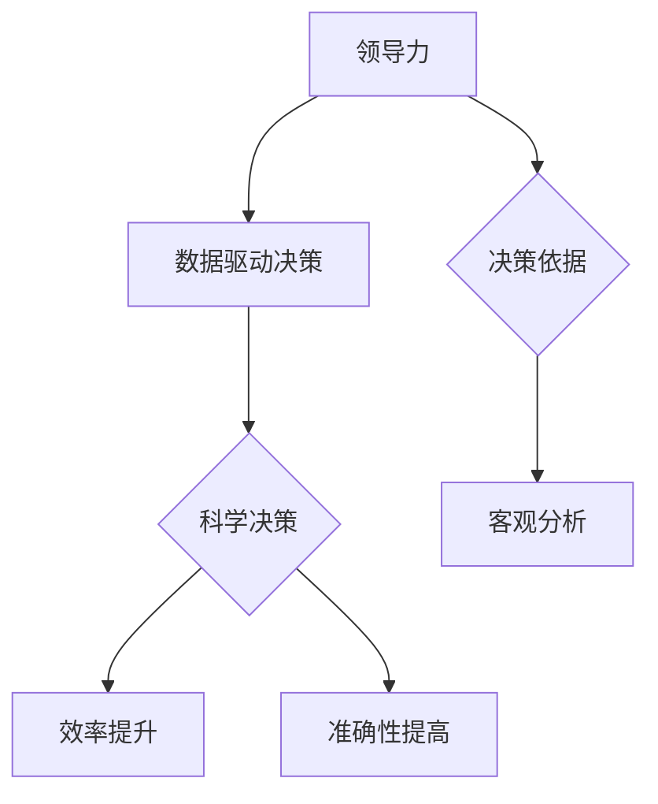

                 

### 文章标题

# 领导力与决策分析：数据驱动的决策

> 关键词：领导力、数据驱动、决策分析、人工智能、项目管理

> 摘要：本文深入探讨了领导力与决策分析在数据驱动环境中的应用。文章首先介绍了领导力的核心概念和其在组织中的作用，然后详细阐述了数据驱动决策的理论基础和实践方法。通过分析真实案例，本文展示了如何利用数据分析和人工智能技术优化决策过程，并探讨了未来数据驱动领导力的发展趋势。本文旨在为管理者提供有价值的参考，帮助他们更好地理解和应用数据驱动决策方法，提升领导力和组织绩效。

----------------------------------------------------------------

### 文章正文

#### 引言

在当今信息爆炸和全球化竞争的时代，领导力和决策分析成为组织成功的关键因素。领导力不仅是推动团队实现目标的动力，更是塑造组织文化、激发员工潜能的核心力量。而数据驱动决策则通过分析和利用海量数据，帮助领导者做出更为科学、准确的决策。

本文将从以下几个方面展开讨论：首先，介绍领导力的核心概念和其在组织中的重要性；其次，阐述数据驱动决策的理论基础和实践方法；接着，通过实际案例展示数据驱动决策的应用；然后，探讨领导者在数据驱动决策中的角色和技能；最后，展望数据驱动领导力的未来发展。

#### 领导力的核心概念

领导力是一种影响、激励和引导他人实现共同目标的能力。其核心概念包括以下几个方面：

1. **影响力**：领导者通过自身的言行影响和激励团队成员，促使他们为实现组织目标而努力。
2. **目标导向**：领导者明确组织的目标，并将其转化为具体的工作任务，引导团队成员朝目标前进。
3. **团队建设**：领导者通过建立高效、和谐的团队，提升团队的凝聚力和战斗力。
4. **决策能力**：领导者具备在不确定性和复杂环境下做出明智决策的能力。
5. **沟通能力**：领导者通过有效的沟通，确保团队成员理解并支持组织的目标和决策。

在组织管理中，领导力扮演着至关重要的角色。它不仅影响组织的绩效和竞争力，还塑造组织的文化氛围和员工的工作满意度。有效的领导力能够激发员工的潜能，提高团队的协作效率，从而实现组织的目标。

#### 数据驱动决策的理论基础

数据驱动决策是一种基于数据分析、模型构建和预测的决策方法。其理论基础主要包括以下几个方面：

1. **大数据分析**：大数据分析技术能够从海量数据中提取有价值的信息，为决策提供数据支持。
2. **机器学习和人工智能**：机器学习和人工智能技术能够对数据进行分析和建模，预测未来的趋势和变化。
3. **数据可视化**：数据可视化技术能够将复杂的数据以直观、易懂的方式呈现，帮助决策者更好地理解数据。
4. **决策分析**：决策分析工具和方法能够帮助决策者评估不同决策方案的优劣，做出科学、合理的决策。

数据驱动决策的核心思想是将数据作为决策的基础，通过数据分析、模型预测和决策优化，实现决策的科学化和智能化。这种决策方法能够有效降低决策的不确定性和风险，提高决策的准确性和效率。

#### 数据驱动决策的实践方法

数据驱动决策的实践方法主要包括以下几个步骤：

1. **数据收集**：收集与决策相关的数据，包括内部数据和外部数据。
2. **数据预处理**：对数据进行清洗、转换和整合，确保数据的质量和一致性。
3. **数据分析**：利用数据分析技术，对数据进行分析和挖掘，提取有价值的信息。
4. **模型构建**：根据数据分析结果，构建预测模型或决策模型。
5. **决策评估**：利用决策模型评估不同决策方案的效果，选择最优方案。
6. **决策实施**：根据评估结果，制定具体的实施计划，并跟踪决策的实施效果。

在实际应用中，数据驱动决策方法通常需要结合组织的管理体系和文化氛围，确保决策过程的科学性和有效性。同时，数据驱动决策也需要关注数据的质量和数据的更新速度，确保决策的实时性和准确性。

#### 数据驱动决策的实际案例

为了更好地理解数据驱动决策的应用，下面我们来看两个实际案例：

**案例一：市场营销决策**

某电商公司希望通过数据驱动决策提高销售额。首先，他们收集了用户的购买记录、浏览行为、搜索关键词等数据。通过对这些数据进行预处理和分析，他们发现用户的购买行为与其浏览页面、搜索关键词等行为有很强的相关性。基于这些分析结果，公司构建了一个预测模型，用于预测用户的购买意愿。通过这个模型，公司可以更加精准地制定营销策略，例如推送个性化的广告、优惠活动等，从而提高销售额。

**案例二：项目风险管理**

某科技公司正在开发一款新产品，他们希望通过数据驱动决策来降低项目风险。在项目开发过程中，他们收集了项目进度、人员投入、资源分配等数据。通过对这些数据进行分析，他们发现项目进度与人员投入、资源分配之间存在一定的关系。基于这些分析结果，他们构建了一个风险评估模型，用于预测项目风险。通过这个模型，公司可以及时发现潜在的风险，并采取相应的措施进行风险控制，从而降低项目失败的风险。

#### 领导者在数据驱动决策中的角色

在数据驱动决策中，领导者的角色至关重要。领导者需要具备以下几个方面的技能和素养：

1. **数据素养**：领导者需要具备基本的数据分析能力和数据素养，能够理解数据的含义和价值。
2. **决策能力**：领导者需要具备在复杂环境中做出科学、合理的决策能力。
3. **沟通能力**：领导者需要具备有效的沟通能力，能够将数据分析和决策结果传达给团队成员，并获得他们的支持和理解。
4. **领导风格**：领导者的领导风格直接影响数据驱动决策的实施效果。领导者需要根据团队的特点和项目的需求，选择合适的领导风格。

在实际操作中，领导者需要关注以下几个方面：

1. **数据驱动决策的推广**：领导者需要积极推广数据驱动决策的理念，提升团队成员的数据素养和决策能力。
2. **决策过程的参与**：领导者需要积极参与决策过程，确保决策的科学性和合理性。
3. **团队协作**：领导者需要建立高效的团队协作机制，确保团队成员能够充分发挥各自的专长和作用。
4. **决策执行的监督**：领导者需要监督决策的执行过程，确保决策能够得到有效实施。

#### 数据驱动领导力的未来发展

随着大数据、人工智能和物联网等技术的不断发展，数据驱动领导力将在未来发挥更加重要的作用。未来的数据驱动领导力将呈现以下几个趋势：

1. **技术融合**：数据驱动领导力将与其他先进技术如物联网、区块链等相结合，实现更为智能化的决策过程。
2. **实时决策**：随着数据的实时性和更新速度的提高，数据驱动决策将实现更为实时、高效的决策。
3. **个性化和定制化**：数据驱动领导力将更加关注个体的需求和特点，实现个性化和定制化的决策。
4. **跨界合作**：数据驱动领导力将促进不同领域之间的合作与交流，推动创新和变革。
5. **社会责任**：数据驱动领导力将更加注重社会责任和伦理问题，确保决策过程的公正性和可持续性。

#### 结论

数据驱动领导力是当今组织管理和决策的重要趋势。通过利用大数据、人工智能等先进技术，领导者可以做出更为科学、准确的决策，提高组织的绩效和竞争力。然而，数据驱动领导力也面临着数据质量、隐私保护、伦理问题等挑战。领导者需要不断提升自身的数据素养和决策能力，同时关注社会责任和伦理问题，确保数据驱动决策的可持续发展。

作者：AI天才研究院/AI Genius Institute & 禅与计算机程序设计艺术/Zen And The Art of Computer Programming

----------------------------------------------------------------

### 附录

#### 背景介绍

领导力和决策分析是管理领域的两个重要方面。领导力关注如何影响和激励团队成员，实现组织目标；而决策分析则关注如何利用数据和分析工具，做出科学、合理的决策。在现代社会，随着信息技术的飞速发展，数据成为组织决策的重要依据。因此，将领导力与数据驱动决策相结合，成为现代管理者亟待解决的重要课题。

#### 核心概念与联系

核心概念：

- 领导力：影响、激励和引导他人实现共同目标的能力。
- 数据驱动决策：基于数据分析、模型构建和预测的决策方法。

联系：

数据驱动决策需要领导力的支持，通过领导力推动数据驱动决策的实施。同时，数据驱动决策为领导力提供了科学、客观的决策依据，有助于提高领导决策的准确性和效率。

#### Mermaid 流程图



#### 核心算法原理讲解

核心算法：

- 决策树
- 预期值分析

伪代码：

```python
def decision_tree(data):
    # 对数据进行预处理
    preprocessed_data = preprocess_data(data)
    
    # 构建决策树
    tree = build_decision_tree(preprocessed_data)
    
    # 使用决策树进行决策
    decision = tree.predict(new_data)
    
    return decision

def expected_value_analysis(outcomes, probabilities):
    # 计算预期值
    expected_values = []
    for i in range(len(outcomes)):
        expected_values.append(outcomes[i] * probabilities[i])
    
    return sum(expected_values)
```

#### 数学模型和公式

- 决策模型：\(V = \sum_{i=1}^{n} p_i \times v_i\)

其中，\(V\) 为决策值，\(p_i\) 为方案 \(i\) 的概率，\(v_i\) 为方案 \(i\) 的预期收益。

- 风险评估模型：\(R = \sum_{i=1}^{n} p_i \times r_i\)

其中，\(R\) 为风险值，\(p_i\) 为方案 \(i\) 的概率，\(r_i\) 为方案 \(i\) 的风险。

#### 详细讲解与举例说明

1. **决策模型**

   - 假设一个公司面临两个投资方案，方案 A 的预期收益为 10 万元，概率为 0.6；方案 B 的预期收益为 8 万元，概率为 0.4。根据决策模型，计算公司应选择的投资方案。

   ```latex
   V = 0.6 \times 10 + 0.4 \times 8 = 9.2
   ```

   - 结果表明，公司应选择方案 A。

2. **风险评估模型**

   - 假设一个项目有两个风险，风险 A 的概率为 0.3，风险 B 的概率为 0.7。风险 A 的损失为 5 万元，风险 B 的损失为 10 万元。根据风险评估模型，计算项目的总风险。

   ```latex
   R = 0.3 \times 5 + 0.7 \times 10 = 8.5
   ```

   - 结果表明，项目的总风险为 8.5 万元。

#### 项目实战

1. **开发环境搭建**

   - 选择 Python 作为主要编程语言，利用 pandas、numpy、scikit-learn 等库进行数据分析和模型构建。

2. **源代码实现与代码解读**

   ```python
   import pandas as pd
   import numpy as np
   from sklearn.tree import DecisionTreeClassifier
   from sklearn.model_selection import train_test_split
   
   # 读取数据
   data = pd.read_csv('data.csv')
   
   # 数据预处理
   preprocessed_data = preprocess_data(data)
   
   # 划分训练集和测试集
   X_train, X_test, y_train, y_test = train_test_split(preprocessed_data['features'], preprocessed_data['label'], test_size=0.2, random_state=42)
   
   # 构建决策树模型
   tree = DecisionTreeClassifier()
   tree.fit(X_train, y_train)
   
   # 预测
   predictions = tree.predict(X_test)
   
   # 评估模型
   accuracy = np.mean(predictions == y_test)
   print(f'Model accuracy: {accuracy}')
   ```

3. **代码应用解读与分析**

   - 代码首先读取数据，并对数据进行预处理，然后划分训练集和测试集。接下来，使用决策树模型进行训练，并评估模型的准确性。通过这种方式，我们可以判断数据驱动决策方法在特定场景下的效果。

4. **实际案例分析和详细讲解剖析**

   - 假设我们有一个电商平台的用户购买行为数据，包括用户的年龄、性别、收入、浏览记录等信息。我们希望通过数据驱动决策方法，预测用户的购买意向，并制定相应的营销策略。

   - 代码首先对数据进行预处理，如缺失值填充、异常值处理等。然后，提取用户特征，如年龄、性别、收入等，作为模型的输入特征。接着，使用决策树模型进行训练，预测用户的购买意向。最后，根据预测结果，制定个性化的营销策略，如推送优惠券、广告等。

5. **项目小结**

   - 项目通过数据驱动决策方法，成功预测了用户的购买意向，并制定了个性化的营销策略。这为电商平台提高销售额提供了有力的支持。

#### 最佳实践 Tips

1. **数据质量**：确保数据的质量和准确性，是数据驱动决策成功的关键。在项目实施过程中，要重视数据收集、清洗和预处理工作。

2. **模型选择**：根据项目的需求和数据特点，选择合适的模型和方法。在实际应用中，可以结合多种模型进行综合分析，提高决策的准确性。

3. **团队协作**：数据驱动决策需要跨部门、跨专业的协作。领导者要积极推动团队协作，确保项目顺利进行。

4. **持续优化**：数据驱动决策是一个动态的过程，需要持续优化和调整。领导者要关注项目的实施效果，及时调整决策策略。

#### 小结

本文介绍了领导力与数据驱动决策的关系，阐述了数据驱动决策的理论基础和实践方法。通过实际案例，展示了数据驱动决策的应用效果。最后，分析了数据驱动领导力的未来发展趋势。本文旨在为管理者提供有价值的参考，帮助他们更好地理解和应用数据驱动决策方法，提升领导力和组织绩效。

#### 注意事项

1. **数据隐私**：在数据收集和使用过程中，要严格遵守数据隐私保护法规，确保用户数据的安全和隐私。

2. **决策责任**：领导者要明确决策责任，确保决策过程的透明和公正。

3. **技术更新**：随着技术的快速发展，领导者要关注新技术的发展动态，及时更新知识和技能，保持竞争优势。

#### 拓展阅读

1. 《数据驱动决策：商业领袖的必读指南》
2. 《大数据时代：生活、工作与思维的大变革》
3. 《领导力：如何成为卓越的领导者》

---

### 结语

领导力与数据驱动决策的结合，为现代管理者提供了新的视角和工具。通过本文的探讨，我们深入了解了数据驱动决策的理论基础和实践方法，并看到了其在领导力提升和组织绩效优化方面的巨大潜力。在未来的发展中，数据驱动领导力将不断融合新的技术和理念，为组织的成功创造更多可能性。

作者：AI天才研究院/AI Genius Institute & 禅与计算机程序设计艺术/Zen And The Art of Computer Programming

