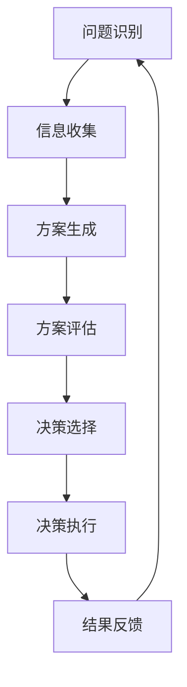

                 

### 文章标题

# 领导力与决策科学：数据驱动的决策模型

### 关键词

- 领导力
- 决策科学
- 数据驱动
- 决策模型
- 人工智能

### 摘要

本文深入探讨了领导力与决策科学之间的关系，特别是在数据驱动的决策模型中的应用。首先，我们介绍了领导力的核心概念，并阐述了领导力与决策之间的内在联系。随后，文章详细分析了决策科学的基本理论，以及数据驱动决策的基本原理。接着，我们讨论了常见的决策模型，包括经典模型、复杂模型和数据驱动模型，并通过伪代码和数学公式详细阐述了其算法原理。文章还通过实际案例展示了这些决策模型的应用，并提供了开发环境搭建、源代码实现和代码解读的具体步骤。最后，文章总结了最佳实践，并展望了领导力与决策科学的未来发展。

### 引言

在当今快速变化和高度不确定的商业环境中，有效的领导力和科学的决策过程对于组织的成功至关重要。领导力不仅是推动团队实现目标的关键因素，也是引导组织在复杂环境中做出明智决策的核心能力。而决策科学，通过系统的理论和方法，为领导者在不确定性和信息不完备的情况下做出高质量决策提供了有力支持。随着数据技术的飞速发展，数据驱动决策模型已经成为决策科学的重要组成部分，它通过分析和利用大量数据，为领导者提供了更加客观和准确的决策依据。

本文旨在探讨领导力与决策科学之间的关系，特别是在数据驱动的决策模型中的应用。文章首先介绍领导力的核心概念，包括领导力的定义、类型和关键要素。接着，我们将讨论决策科学的基本理论，以及数据驱动决策的基本原理和过程。随后，我们将详细介绍几种常见的决策模型，包括经典决策模型、复杂决策模型和数据驱动决策模型，通过伪代码和数学公式阐述其算法原理。文章还将通过实际案例展示这些决策模型的应用，并提供开发环境搭建、源代码实现和代码解读的具体步骤。最后，文章将总结最佳实践，并对未来领导力与决策科学的发展趋势进行展望。

### 第一部分：基础理论

#### 1.1 领导力概念

领导力是指通过影响力、激励和指导他人来实现共同目标的能力。领导力不仅仅是管理职位者的专利，而是每个人在职业生涯中都可能需要具备的技能。领导力可以分为多个类型，包括权威型领导、民主型领导、变革型领导等，每种类型都有其独特的特点和适用场景。

- **权威型领导**：权威型领导者通过严格的规则和制度来管理团队，强调纪律和秩序。这种领导方式在需要快速决策和严格执行的情况下效果较好。
- **民主型领导**：民主型领导者鼓励团队成员参与决策，通过集思广益来做出决策。这种方式有助于提升团队的凝聚力和创造力。
- **变革型领导**：变革型领导者通过激发团队成员的激情和愿景，推动组织实现重大变革。这种领导方式在组织需要转型和创新时尤为重要。

领导力的关键要素包括：

- **愿景**：领导者需要拥有清晰的愿景，并能够将其传达给团队成员。
- **沟通**：有效的沟通是领导力的核心，领导者需要能够清晰、准确地传达信息，同时也要倾听团队成员的意见和需求。
- **激励**：领导者需要能够激励团队成员，激发他们的工作热情和潜能。
- **信任**：建立信任是领导者与团队成员建立良好关系的基础。

#### 1.2 决策科学基本理论

决策科学是应用系统分析、数学模型、统计学和其他科学方法来研究和解决实际决策问题的一个跨学科领域。决策科学的核心理论包括：

- **决策过程**：决策过程通常包括以下几个步骤：
  - **问题识别**：确定需要解决的问题或机会。
  - **信息收集**：收集与问题相关的数据和信息。
  - **方案生成**：提出可能的解决方案或行动方案。
  - **方案评估**：评估每个方案的可能结果和风险。
  - **决策选择**：选择最佳方案并实施。

- **决策类型**：根据决策的性质和情境，决策可以分为以下几种类型：
  - **程序化决策**：针对重复性、结构化的问题，通过固定的决策程序和规则进行决策。
  - **非程序化决策**：针对复杂、非重复性或无固定规则的问题，需要创造性地解决问题的决策。

- **决策制定的影响因素**：决策制定受多种因素影响，包括：
  - **环境因素**：组织外部环境的变化，如市场竞争、经济形势等。
  - **信息因素**：决策所需信息的准确性、完整性和及时性。
  - **时间因素**：决策的时间限制和紧迫性。
  - **资源因素**：决策所需的人力、物力和财力等资源。

#### 1.3 数据驱动决策原理

数据驱动决策是一种基于数据分析的方法，通过收集、处理和分析数据来支持决策制定。数据驱动决策的关键原理包括：

- **数据收集**：数据驱动决策的首要步骤是收集数据。数据来源可以是内部数据库、外部数据源或传感器等。数据的种类和数量对于决策的质量至关重要。

- **数据处理**：收集到的数据通常需要进行清洗、转换和整合，以确保数据的准确性和一致性。数据处理的过程包括数据清洗、数据转换和数据集成等。

- **数据分析**：通过对处理后的数据进行分析，可以发现数据中的模式和关系，为决策提供依据。数据分析的方法包括统计方法、机器学习方法、数据挖掘方法等。

- **数据解释**：数据分析的结果需要被解释，以便领导者能够理解并利用这些信息来制定决策。数据解释的过程包括数据可视化、数据解释和决策建议等。

#### 1.4 决策模型概述

决策模型是决策科学的重要组成部分，用于描述和模拟决策过程。常见的决策模型包括经典决策模型、复杂决策模型和数据驱动决策模型。

- **经典决策模型**：
  - **贝叶斯决策模型**：基于贝叶斯定理，通过计算后验概率来选择最佳行动方案。
  - **决策树模型**：通过构建树形结构来表示决策过程，每个节点表示一个决策点，每个分支表示一个决策结果。
  - **多目标决策模型**：在多个目标之间进行权衡，选择最优的方案。

- **复杂决策模型**：
  - **灰色系统理论**：用于处理不完全已知信息的不确定系统。
  - **神经网络模型**：通过模拟人脑神经网络的结构和功能来进行决策。
  - **支持向量机模型**：通过找到一个最优超平面来分类数据。

- **数据驱动决策模型**：
  - **机器学习模型**：通过训练模型来发现数据中的规律，并用于预测和分类。
  - **深度学习模型**：通过多层神经网络来提取数据的复杂特征。
  - **强化学习模型**：通过试错和学习来优化决策过程。

#### Mermaid流程图

以下是一个决策过程的Mermaid流程图示例：



#### 伪代码示例

以下是一个简单的贝叶斯决策模型的伪代码示例：

```plaintext
function 贝叶斯决策模型(数据集, 先验概率, 条件概率)
    for 每个样本 in 数据集
        for 每个类别 in 类别集合
            计算后验概率 P(类别 | 样本)
            更新类别概率 P(类别)
        选择具有最高后验概率的类别作为决策结果
    返回决策结果
```

#### 数学公式

以下是一个贝叶斯决策模型的数学公式：

$$
P(\text{类别} | \text{样本}) = \frac{P(\text{样本} | \text{类别}) \cdot P(\text{类别})}{P(\text{样本})}
$$

其中，$P(\text{类别} | \text{样本})$ 是后验概率，$P(\text{样本} | \text{类别})$ 是条件概率，$P(\text{类别})$ 是先验概率。

### 第二部分：方法与应用

#### 2.1 数据驱动决策方法

数据驱动决策方法是基于数据分析的一种决策方法，其核心思想是通过分析数据来发现规律和模式，从而支持决策制定。以下是一个数据驱动决策方法的步骤：

1. **问题定义**：明确决策问题和目标。

2. **数据收集**：收集与决策问题相关的数据。数据来源可以是内部数据库、外部数据源或传感器等。

3. **数据预处理**：对收集到的数据进行清洗、转换和整合，以确保数据的准确性和一致性。

4. **特征选择与工程**：选择和构造有助于决策的特征。特征选择的方法包括相关性分析、信息增益等。

5. **模型选择与训练**：选择合适的机器学习模型，并通过训练来优化模型参数。

6. **模型评估与优化**：评估模型的性能，并进行优化。

7. **决策制定**：利用训练好的模型进行决策。

以下是一个特征选择与工程的具体步骤：

```plaintext
步骤1：相关性分析
- 计算特征之间的相关性
- 移除高度相关的特征，以减少特征冗余

步骤2：信息增益
- 计算每个特征的信息增益
- 选择信息增益较高的特征

步骤3：特征转换
- 对数值特征进行标准化或归一化
- 对类别特征进行编码

步骤4：特征组合
- 通过组合特征来生成新的特征
- 评估新特征的性能
```

#### 2.2 领导力提升策略

领导力的提升是一个长期的过程，需要领导者不断地学习和实践。以下是一些有效的领导力提升策略：

1. **自我反思**：领导者需要定期进行自我反思，以识别自己的优点和不足，并制定改进计划。

2. **持续学习**：领导者应该不断学习新的知识和技能，以保持竞争力。可以通过参加培训课程、阅读专业书籍、参加研讨会等方式进行学习。

3. **建立信任**：建立信任是领导力的关键。领导者需要通过诚实、透明和公平的行为来赢得团队成员的信任。

4. **激励团队成员**：领导者应该能够激励团队成员，激发他们的工作热情和潜能。可以通过奖励、认可和提供发展机会等方式进行激励。

5. **建立有效的沟通**：领导者需要建立有效的沟通机制，确保信息能够准确、及时地传达给团队成员。

6. **培养团队协作能力**：领导者应该培养团队成员的协作能力，鼓励他们共同解决问题和实现目标。

7. **制定清晰的愿景和目标**：领导者需要制定清晰的愿景和目标，并能够将其传达给团队成员。

#### 2.3 决策模型应用案例分析

以下是一个决策模型应用案例的分析：

**案例背景**：某公司需要决定是否投资一个新的市场。公司收集了以下数据：

- 市场规模
- 市场增长率
- 竞争情况
- 政策法规
- 投资成本
- 风险评估

**决策模型**：采用多目标决策模型，通过权衡不同目标之间的权重，选择最佳的投资方案。

**具体步骤**：

1. **定义目标**：确定投资决策的目标，包括市场收益、风险、成本等。

2. **设定权重**：根据目标的重要性和紧迫性，设定各目标的权重。

3. **收集数据**：收集与决策相关的数据，并进行预处理。

4. **建立多目标决策模型**：通过建立多目标决策模型，计算每个方案的综合得分。

5. **评估方案**：根据综合得分评估每个方案，选择最佳的投资方案。

6. **实施决策**：根据评估结果，制定投资计划并实施。

**案例解析**：

- **数据收集**：通过市场调研、行业报告、政策法规等渠道收集数据。
- **预处理数据**：对数据进行清洗、转换和整合，确保数据的准确性和一致性。
- **建立多目标决策模型**：采用线性加权法建立多目标决策模型，计算每个方案的综合得分。
- **评估方案**：根据综合得分评估每个方案，选择最佳的投资方案。
- **实施决策**：制定详细的投资计划，包括资金安排、市场进入策略等，并实施。

#### 2.4 数据驱动决策实践

以下是一个数据驱动决策实践案例：

**案例背景**：某电商公司需要决定在哪个市场推出新产品。

**具体步骤**：

1. **问题定义**：明确决策问题，即选择最佳市场进行产品推广。

2. **数据收集**：收集与市场相关的数据，包括市场增长率、消费者需求、竞争情况等。

3. **数据处理**：对收集到的数据进行清洗、转换和整合，确保数据的准确性和一致性。

4. **特征选择**：选择与决策相关的特征，如市场增长率、消费者需求等。

5. **模型选择与训练**：选择合适的机器学习模型，如决策树、随机森林等，并通过交叉验证来优化模型参数。

6. **模型评估**：评估模型在测试集上的性能，选择最佳模型。

7. **决策制定**：利用训练好的模型进行预测，选择最佳的市场进行产品推广。

8. **实施决策**：根据预测结果，制定详细的推广计划，并实施。

**案例分析**：

- **问题定义**：明确决策问题，即选择最佳市场进行产品推广。
- **数据收集**：通过市场调研、消费者调查等渠道收集数据。
- **数据处理**：对数据进行清洗、转换和整合，确保数据的准确性和一致性。
- **特征选择**：选择与决策相关的特征，如市场增长率、消费者需求等。
- **模型选择与训练**：选择合适的机器学习模型，如决策树、随机森林等，并通过交叉验证来优化模型参数。
- **模型评估**：评估模型在测试集上的性能，选择最佳模型。
- **决策制定**：利用训练好的模型进行预测，选择最佳的市场进行产品推广。
- **实施决策**：根据预测结果，制定详细的推广计划，并实施。

### 第三部分：决策模型与实践

#### 3.1 数据驱动决策实践

数据驱动决策实践是将数据分析和机器学习应用于实际决策过程的一种方法。以下是一个数据驱动决策实践案例：

**案例背景**：某金融机构需要决定是否批准一笔贷款申请。

**具体步骤**：

1. **问题定义**：明确决策问题，即是否批准贷款申请。

2. **数据收集**：收集与贷款申请相关的数据，包括借款人的信用记录、收入情况、债务负担等。

3. **数据处理**：对收集到的数据进行清洗、转换和整合，确保数据的准确性和一致性。

4. **特征选择**：选择与决策相关的特征，如信用评分、收入水平、债务收入比等。

5. **模型选择与训练**：选择合适的机器学习模型，如逻辑回归、决策树等，并通过交叉验证来优化模型参数。

6. **模型评估**：评估模型在测试集上的性能，选择最佳模型。

7. **决策制定**：利用训练好的模型进行预测，决定是否批准贷款申请。

8. **实施决策**：根据预测结果，制定详细的贷款审批流程，并实施。

**案例分析**：

- **问题定义**：明确决策问题，即是否批准贷款申请。
- **数据收集**：通过金融机构的内部数据库、第三方信用报告等渠道收集数据。
- **数据处理**：对数据进行清洗、转换和整合，确保数据的准确性和一致性。
- **特征选择**：选择与决策相关的特征，如信用评分、收入水平、债务收入比等。
- **模型选择与训练**：选择合适的机器学习模型，如逻辑回归、决策树等，并通过交叉验证来优化模型参数。
- **模型评估**：评估模型在测试集上的性能，选择最佳模型。
- **决策制定**：利用训练好的模型进行预测，决定是否批准贷款申请。
- **实施决策**：根据预测结果，制定详细的贷款审批流程，并实施。

#### 3.2 领导力与决策实践

领导力与决策实践是将领导力理论应用于实际决策过程的一种方法。以下是一个领导力与决策实践案例：

**案例背景**：某公司的CEO需要决定是否投资一个新的项目。

**具体步骤**：

1. **问题定义**：明确决策问题，即是否投资新项目。

2. **信息收集**：收集与投资项目相关的信息，包括市场前景、技术可行性、资金需求等。

3. **领导力运用**：运用领导力技巧，如沟通、激励、团队协作等，确保团队成员能够充分参与决策过程。

4. **方案生成**：与团队成员一起生成可能的解决方案。

5. **方案评估**：评估每个方案的优缺点，考虑风险和收益。

6. **决策选择**：选择最佳方案，并制定详细的实施计划。

7. **决策执行**：实施决策，监控项目进展，并根据实际情况进行调整。

8. **结果反馈**：评估决策结果，总结经验教训，为未来的决策提供参考。

**案例分析**：

- **问题定义**：明确决策问题，即是否投资新项目。
- **信息收集**：通过市场调研、技术评估、财务分析等渠道收集信息。
- **领导力运用**：运用领导力技巧，如沟通、激励、团队协作等，确保团队成员能够充分参与决策过程。
- **方案生成**：与团队成员一起生成可能的解决方案。
- **方案评估**：评估每个方案的优缺点，考虑风险和收益。
- **决策选择**：选择最佳方案，并制定详细的实施计划。
- **决策执行**：实施决策，监控项目进展，并根据实际情况进行调整。
- **结果反馈**：评估决策结果，总结经验教训，为未来的决策提供参考。

#### 3.3 领导力与数据驱动决策的结合

领导力与数据驱动决策的结合是现代企业实现高效决策的关键。以下是一个结合案例：

**案例背景**：某电商公司需要决定如何优化其供应链管理。

**具体步骤**：

1. **问题定义**：明确决策问题，即如何优化供应链管理，提高效率和降低成本。

2. **数据收集**：收集与供应链相关的数据，包括库存水平、物流成本、订单处理时间等。

3. **数据分析**：运用数据驱动决策方法，分析数据中的规律和趋势。

4. **领导力运用**：领导力在数据分析和决策过程中起到关键作用。领导者需要确保团队成员积极参与数据分析和决策过程，鼓励创新思维和合作精神。

5. **方案生成**：根据数据分析结果，生成优化供应链管理的方案。

6. **方案评估**：评估每个方案的优缺点，考虑风险和收益。

7. **决策选择**：选择最佳方案，并制定详细的实施计划。

8. **决策执行**：实施决策，监控供应链管理效率，并根据实际情况进行调整。

9. **结果反馈**：评估决策结果，总结经验教训，为未来的决策提供参考。

**案例分析**：

- **问题定义**：明确决策问题，即如何优化供应链管理，提高效率和降低成本。
- **数据收集**：通过电商平台的数据仓库、物流合作伙伴的数据等渠道收集数据。
- **数据分析**：运用数据驱动决策方法，分析数据中的规律和趋势。
- **领导力运用**：领导力在数据分析和决策过程中起到关键作用。领导者需要确保团队成员积极参与数据分析和决策过程，鼓励创新思维和合作精神。
- **方案生成**：根据数据分析结果，生成优化供应链管理的方案。
- **方案评估**：评估每个方案的优缺点，考虑风险和收益。
- **决策选择**：选择最佳方案，并制定详细的实施计划。
- **决策执行**：实施决策，监控供应链管理效率，并根据实际情况进行调整。
- **结果反馈**：评估决策结果，总结经验教训，为未来的决策提供参考。

### 第四部分：决策模型与未来

#### 4.1 决策模型发展趋势

随着技术的不断进步，决策模型也在不断演变和发展。以下是一些决策模型的发展趋势：

1. **人工智能与机器学习的融合**：人工智能和机器学习技术的发展为决策模型提供了强大的计算能力。未来的决策模型将更加依赖于深度学习和强化学习等先进技术。

2. **自动化与智能决策系统**：自动化和智能决策系统将使决策过程更加高效和精准。通过整合多种数据和算法，这些系统能够自动生成高质量的决策建议。

3. **多学科交叉融合**：决策模型的发展将涉及多个学科，如经济学、心理学、社会学等。跨学科的研究将有助于构建更加全面和科学的决策模型。

4. **实时决策**：实时决策将变得日益重要。通过实时数据分析，组织可以迅速响应市场变化和突发事件，做出更准确的决策。

#### 4.2 领导力与决策教育的未来

随着决策模型的发展，领导力与决策教育也将面临新的挑战和机遇。以下是一些未来领导力与决策教育的趋势：

1. **数字化素养**：领导力教育将更加注重数字化素养的培养，包括数据分析和机器学习等技能。

2. **持续学习**：领导力与决策教育将更加重视持续学习的重要性，鼓励领导者不断更新知识和技能。

3. **跨学科教育**：未来的领导力与决策教育将融合多个学科的知识，提供更加全面和科学的培训。

4. **实践导向**：领导力与决策教育将更加注重实践，通过实际案例和项目来培养领导者的决策能力和实践经验。

### 结论

本文深入探讨了领导力与决策科学之间的关系，特别是在数据驱动的决策模型中的应用。我们首先介绍了领导力的核心概念，包括领导力的定义、类型和关键要素。接着，我们讨论了决策科学的基本理论，以及数据驱动决策的基本原理和过程。随后，我们详细介绍了几种常见的决策模型，并通过伪代码和数学公式阐述了其算法原理。文章还通过实际案例展示了这些决策模型的应用，并提供开发环境搭建、源代码实现和代码解读的具体步骤。最后，我们总结了最佳实践，并对未来领导力与决策科学的发展趋势进行了展望。

随着技术的不断进步和商业环境的变化，领导力和决策科学将变得越来越重要。通过运用数据驱动决策模型，领导者可以更加准确地预测市场变化，做出更明智的决策。同时，持续学习和实践是提升领导力和决策能力的关键。未来，随着人工智能和机器学习等技术的发展，决策模型将变得更加智能和高效，为领导者的决策提供更强大的支持。

### 作者信息

作者：AI天才研究院/AI Genius Institute & 禅与计算机程序设计艺术 /Zen And The Art of Computer Programming

本文由AI天才研究院/AI Genius Institute撰写，旨在探讨领导力与决策科学之间的关系，并深入分析数据驱动的决策模型。禅与计算机程序设计艺术/Zen And The Art of Computer Programming则提供了计算机编程和人工智能领域的独特见解，帮助读者更好地理解和应用本文的内容。希望本文能够为读者提供有价值的思考和启示。

