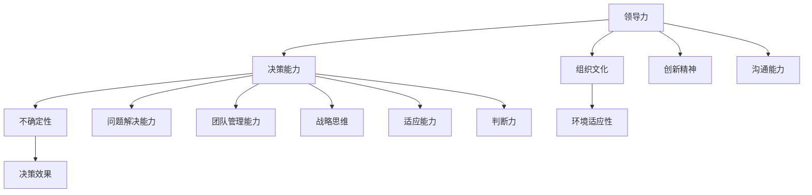
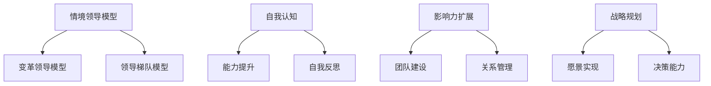
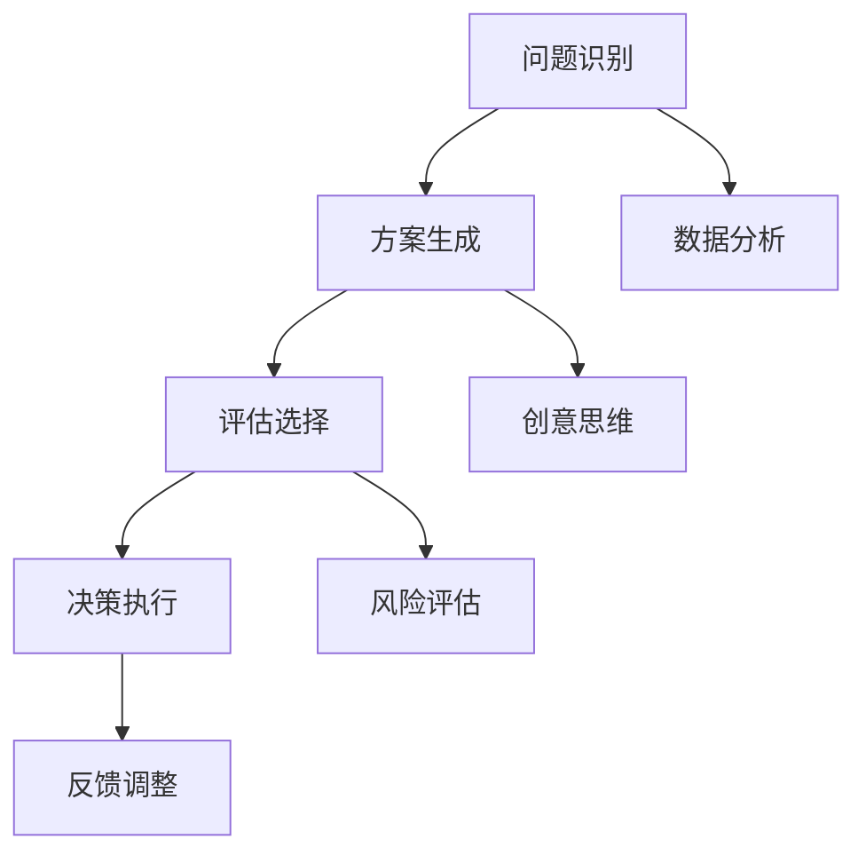
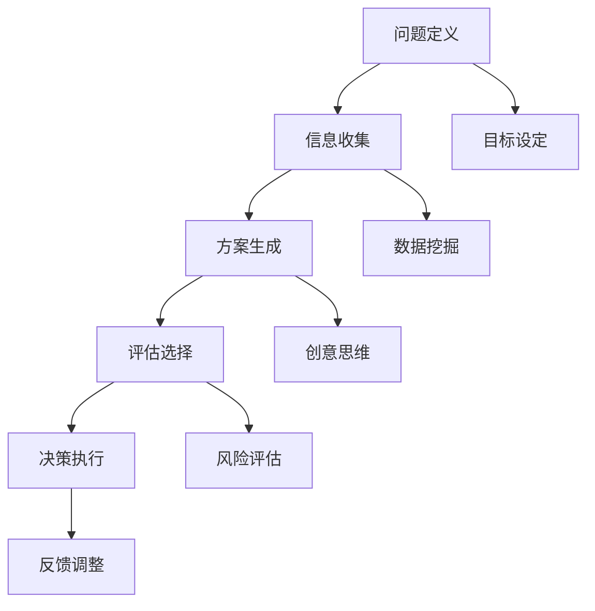
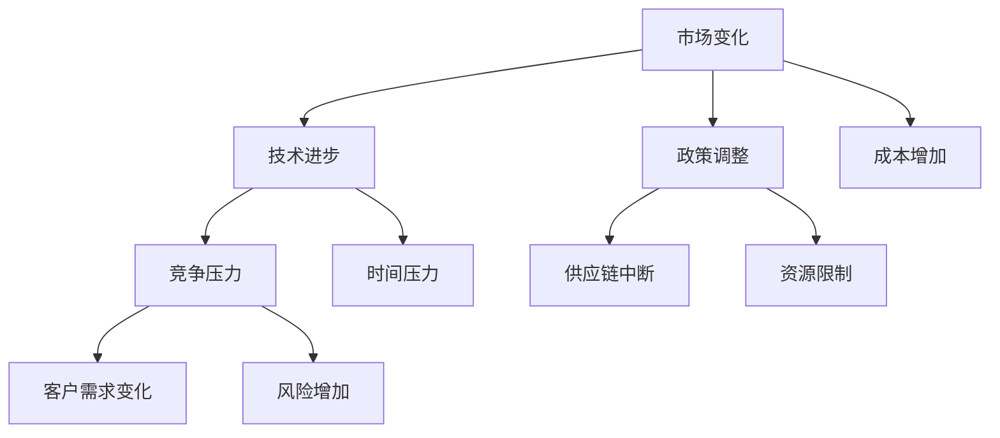
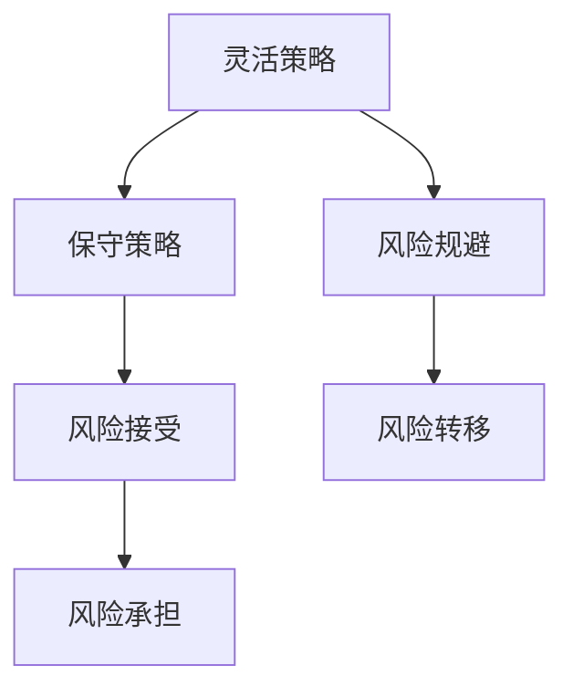
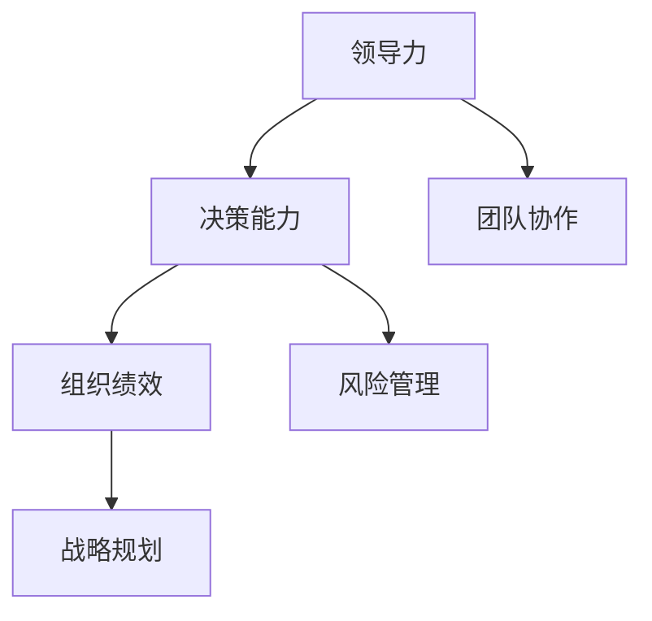
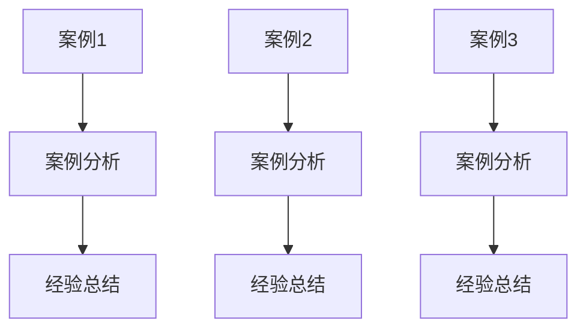
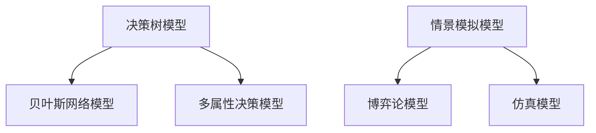
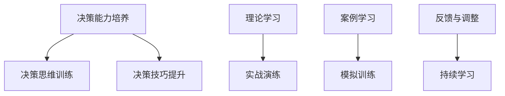

                 

### 文章标题

# 领导力与决策能力：在不确定性中把握方向

---

关键词：领导力，决策能力，不确定性，应对策略，企业绩效

---

摘要：

在当今充满不确定性的商业环境中，领导力和决策能力显得尤为重要。本文旨在深入探讨领导力与决策能力之间的关系，分析领导力在不确定性中发挥的作用，并提出一系列有效的决策策略。通过结合理论和实践案例，本文旨在帮助读者理解如何在实际环境中运用领导力与决策能力来把握方向，提高企业绩效。本文将分为七个部分，分别从领导力理论、决策过程分析、不确定性管理、领导力与决策能力的结合、决策案例研究、决策模型与方法以及提升决策能力等方面进行详细阐述。通过阅读本文，读者将能够更好地理解领导力与决策能力的本质，提升自身在不确定性中的应对能力。

### 第一部分：领导力理论

#### 第1章 领导力基础理论

**背景介绍**

领导力，作为一种关键管理能力，在企业的成长和发展过程中起着至关重要的作用。然而，领导力的定义和内涵在不同的研究领域和实践中存在诸多差异。理解领导力的基本理论，是深入探讨领导力与决策能力结合的前提。

**核心概念与联系**

- **领导力**：是指影响和激励他人实现共同目标的能力。领导力不仅仅关注个体的行为，还涉及到组织文化和氛围的塑造。
- **决策能力**：是领导力的重要组成部分，指的是在不确定性和复杂性的环境中做出明智决策的能力。
- **不确定性**：是决策过程中常见的挑战，指的是未来情况无法准确预测和确定。

**Mermaid流程图**

**核心算法原理讲解**

- **领导力评估模型**：采用行为事件访谈（BEI）和360度评估等方法，通过收集和分析领导者的行为数据，对领导力进行量化评估。

**数学模型和公式**

- **决策效果评估公式**：\( E = f(C, D) \)，其中\( E \)代表决策效果，\( C \)代表决策成本，\( D \)代表决策收益。

**举例说明**

假设一家公司在面对市场变化时，需要决定是否进行产品创新。通过行为事件访谈和360度评估，公司可以收集到领导者的行为数据，并使用决策效果评估公式进行评估。

$$
E = f(C, D) \\
C = \$100,000 \\
D = \$200,000 \\
E = f(\$100,000, \$200,000) = \$100,000
$$

结果表明，该决策的净收益为负，因此公司应重新考虑产品创新的决策。

**数学公式**

- **不确定性度量**：\( U = \sqrt{V} \)，其中\( U \)代表不确定性度量，\( V \)代表决策结果的不确定性。

**最佳实践 tips**

- 定期进行领导力培训，提升领导者的决策能力。
- 建立跨部门协作机制，促进信息共享和资源整合。
- 在决策过程中充分考虑风险因素，制定应对策略。

#### 第2章 领导力的发展模型

**背景介绍**

领导力的发展是一个动态过程，涉及自我认知、能力提升和影响力扩展等多个方面。领导力发展模型为理解这一过程提供了理论框架。

**核心概念与联系**

- **情境领导模型**：由赫赛和布兰查德提出，认为领导风格应适应不同情境。
- **领导梯队模型**：由赫克曼和斯莱特提出，将领导力发展分为六个阶段。
- **变革领导模型**：由约翰·科特提出，强调领导者应在变革过程中发挥关键作用。

**Mermaid流程图**

**核心算法原理讲解**

- **情境领导算法**：通过分析情境变量（如员工成熟度），确定最佳的领导风格。

**数学模型和公式**

- **领导梯队模型评分公式**：\( S = \sum_{i=1}^{n} w_i \cdot x_i \)，其中\( S \)代表领导力发展评分，\( w_i \)代表第\( i \)个阶段的权重，\( x_i \)代表第\( i \)个阶段的发展水平。

**举例说明**

一家公司在实施领导力发展计划时，对各个阶段的领导力发展水平进行评分。

$$
S = \sum_{i=1}^{n} w_i \cdot x_i \\
w_1 = 0.2, w_2 = 0.3, w_3 = 0.5 \\
x_1 = 0.8, x_2 = 0.7, x_3 = 0.9 \\
S = 0.2 \cdot 0.8 + 0.3 \cdot 0.7 + 0.5 \cdot 0.9 = 0.94
$$

结果表明，该公司的领导力发展处于较高水平。

**数学公式**

- **变革领导模型公式**：\( L = f(C, H, E) \)，其中\( L \)代表变革领导力，\( C \)代表变革承诺，\( H \)代表变革支持，\( E \)代表变革效果。

**最佳实践 tips**

- 定期对领导梯队模型进行评估，识别发展瓶颈。
- 在领导力发展过程中，注重自我反思和团队建设。
- 在变革过程中，确保领导者具备足够的变革承诺和支持。

### 第二部分：决策过程分析

#### 第3章 决策过程的基本概念

**背景介绍**

决策过程是企业运营和发展的核心环节，涉及到问题的识别、方案的生成、评估和选择以及决策的执行。理解决策过程的基本概念，是深入探讨决策能力和策略的基础。

**核心概念与联系**

- **问题识别**：是决策过程的起点，涉及问题的定义和明确。
- **方案生成**：是在问题明确的基础上，提出各种可能的解决方案。
- **评估选择**：是对不同方案进行评估，选择最佳方案。
- **决策执行**：是将最佳方案付诸实施的过程。

**Mermaid流程图**

**核心算法原理讲解**

- **问题识别算法**：通过数据分析和情景模拟，确定问题的核心要素。

**数学模型和公式**

- **决策树算法**：用于评估不同方案的优劣，通过递归划分特征空间，构建决策树模型。

**举例说明**

假设一家公司在面临产品线扩张决策时，使用决策树算法评估不同产品的市场潜力。

**数学公式**

- **决策效果评估公式**：\( E = f(C, D) \)，其中\( E \)代表决策效果，\( C \)代表成本，\( D \)代表收益。

**最佳实践 tips**

- 在问题识别阶段，充分利用数据分析和情景模拟。
- 在方案生成阶段，鼓励团队进行创意思维和跨部门协作。
- 在评估选择阶段，注重风险评估和成本收益分析。
- 在决策执行阶段，确保实施方案的具体执行和持续监控。

#### 第4章 决策过程的具体步骤

**背景介绍**

决策过程并非一蹴而就，而是需要经过多个阶段的迭代和优化。了解决策过程的具体步骤，有助于提高决策质量和效率。

**核心概念与联系**

- **问题定义**：明确决策问题，设定决策目标。
- **信息收集**：收集与决策相关的信息，确保信息的全面性和准确性。
- **方案生成**：提出各种可能的解决方案。
- **评估选择**：评估不同方案的优劣，选择最佳方案。
- **决策执行**：将最佳方案付诸实施。
- **反馈调整**：根据实际效果调整决策。

**Mermaid流程图**

**核心算法原理讲解**

- **信息收集算法**：通过数据挖掘和情景模拟，收集和分析相关信息。

**数学模型和公式**

- **多目标决策模型**：用于同时考虑多个目标，通过权衡不同目标的权重，确定最佳方案。

**举例说明**

一家公司在进行新市场扩张决策时，使用多目标决策模型考虑市场潜力、运营成本和竞争态势。

**数学公式**

- **多目标决策公式**：\( Z = \sum_{i=1}^{n} w_i \cdot z_i \)，其中\( Z \)代表总目标得分，\( w_i \)代表第\( i \)个目标的权重，\( z_i \)代表第\( i \)个目标的得分。

**最佳实践 tips**

- 在问题定义阶段，确保明确决策目标和问题边界。
- 在信息收集阶段，充分利用内外部数据源。
- 在方案生成阶段，鼓励团队进行创意思维和跨部门协作。
- 在评估选择阶段，注重多目标权衡和风险评估。
- 在决策执行阶段，确保实施方案的具体执行和持续监控。
- 在反馈调整阶段，根据实际效果及时调整决策。

### 第三部分：不确定性管理

#### 第5章 不确定性的来源与影响

**背景介绍**

在商业环境中，不确定性是决策过程中不可避免的挑战。了解不确定性的来源和影响，有助于制定有效的应对策略。

**核心概念与联系**

- **不确定性的来源**：包括市场变化、技术进步、政策调整、竞争压力等。
- **不确定性的影响**：包括决策成本增加、决策风险增加、执行难度加大等。

**Mermaid流程图**

**核心算法原理讲解**

- **不确定性评估算法**：通过数据分析和情景模拟，评估不确定性对决策的影响。

**数学模型和公式**

- **风险评估模型**：用于评估不确定性事件发生的概率和影响程度。

**举例说明**

一家公司在进行新产品研发决策时，使用风险评估模型评估市场变化和技术进步对项目的影响。

**数学公式**

- **风险评估公式**：\( R = p \cdot I \)，其中\( R \)代表风险值，\( p \)代表事件发生的概率，\( I \)代表事件的影响程度。

**最佳实践 tips**

- 在不确定性管理过程中，充分利用数据分析和情景模拟。
- 在制定应对策略时，充分考虑各种不确定性因素的潜在影响。
- 在执行决策时，确保预留足够的缓冲时间和资源。

#### 第6章 应对不确定性的策略

**背景介绍**

在不确定性环境中，有效的决策策略对于企业的生存和发展至关重要。了解应对不确定性的策略，有助于提高决策质量和效果。

**核心概念与联系**

- **灵活策略**：通过调整决策方案，适应不确定性环境。
- **保守策略**：在不确定性较高时，采取更为谨慎的决策。
- **激进策略**：在不确定性较低时，采取更为积极的决策。

**Mermaid流程图**

**核心算法原理讲解**

- **策略评估算法**：通过分析不同策略的优劣，确定最佳策略。

**数学模型和公式**

- **策略优化模型**：用于确定在不确定性环境下的最优策略。

**举例说明**

一家公司在面对市场变化时，使用策略优化模型确定最合适的应对策略。

**数学公式**

- **策略优化公式**：\( \max Z = \sum_{i=1}^{n} c_i \cdot x_i \)，其中\( Z \)代表目标函数值，\( c_i \)代表第\( i \)个策略的成本，\( x_i \)代表第\( i \)个策略的选择。

**最佳实践 tips**

- 在不确定性环境中，灵活调整决策策略。
- 在决策过程中，充分考虑不确定性因素的潜在影响。
- 在执行决策时，确保具备足够的应对能力和资源。

### 第四部分：领导力与决策能力的结合

#### 第7章 领导力与决策能力的相互作用

**背景介绍**

领导力和决策能力在企业运营中相互影响，共同决定企业的绩效和发展方向。了解领导力与决策能力的相互作用，有助于提高整体管理水平和决策效果。

**核心概念与联系**

- **领导力**：影响和激励他人实现共同目标的能力。
- **决策能力**：在不确定性和复杂性的环境中做出明智决策的能力。
- **相互作用**：领导力有助于提升决策能力，决策能力有助于实现领导目标。

**Mermaid流程图**

**核心算法原理讲解**

- **领导力-决策能力互动模型**：通过分析领导力与决策能力的互动关系，确定最佳领导风格。

**数学模型和公式**

- **领导力-决策能力互动公式**：\( P = f(L, D) \)，其中\( P \)代表绩效，\( L \)代表领导力，\( D \)代表决策能力。

**举例说明**

一家公司在实施领导力提升计划时，通过领导力-决策能力互动模型评估领导力和决策能力对绩效的影响。

**数学公式**

- **绩效评估公式**：\( P = L \cdot D \)，其中\( P \)代表绩效，\( L \)代表领导力，\( D \)代表决策能力。

**最佳实践 tips**

- 在提升领导力时，注重培养决策能力。
- 在培养决策能力时，注重提升领导力。
- 在决策过程中，充分利用领导力的影响和激励作用。

### 第五部分：决策案例研究

#### 第8章 实际案例中的领导力与决策能力

**背景介绍**

通过实际案例研究，可以更好地理解领导力与决策能力在实际中的应用。本章节将介绍几个典型的决策案例，分析其中的领导力与决策能力运用。

**核心概念与联系**

- **案例选择**：选择具有代表性的实际决策案例。
- **案例分析**：分析领导力与决策能力在案例中的具体应用。
- **经验总结**：总结案例中的成功经验和不足之处。

**Mermaid流程图**

**核心算法原理讲解**

- **案例研究方法**：采用实地调研、访谈和文献分析等方法，收集和分析案例数据。

**数学模型和公式**

- **案例评分模型**：用于评估案例中的领导力与决策能力运用效果。

**举例说明**

一家公司在面临供应链中断决策时，通过案例研究方法分析领导力与决策能力的运用效果。

**数学公式**

- **案例评分公式**：\( S = \sum_{i=1}^{n} w_i \cdot s_i \)，其中\( S \)代表案例评分，\( w_i \)代表第\( i \)个评估指标的权重，\( s_i \)代表第\( i \)个评估指标的得分。

**最佳实践 tips**

- 在实际案例中，注重领导力与决策能力的互动作用。
- 在案例研究中，充分挖掘成功经验和不足之处。
- 在决策过程中，结合实际案例进行反思和调整。

### 第六部分：决策模型与方法

#### 第9章 常见的决策模型

**背景介绍**

决策模型是指导决策过程的工具和方法，可以帮助决策者系统化地分析问题、评估方案和选择最佳决策。本章节将介绍几种常见的决策模型。

**核心概念与联系**

- **决策树模型**：通过分支和节点表示决策过程，用于评估不同方案的优劣。
- **贝叶斯网络模型**：基于概率论和图论，用于表示不确定性和因果关系。
- **多属性决策模型**：考虑多个目标，通过权衡不同目标的权重进行决策。

**Mermaid流程图**

**核心算法原理讲解**

- **决策树模型算法**：通过递归划分特征空间，构建决策树模型。
- **贝叶斯网络模型算法**：通过贝叶斯推理和概率计算，评估不同方案的优劣。
- **多属性决策模型算法**：通过权重计算和目标函数优化，确定最佳方案。

**数学模型和公式**

- **决策树模型公式**：\( T = \sum_{i=1}^{n} w_i \cdot t_i \)，其中\( T \)代表决策树模型的得分，\( w_i \)代表第\( i \)个分支的权重，\( t_i \)代表第\( i \)个分支的得分。

- **贝叶斯网络模型公式**：\( P(A|B) = \frac{P(B|A) \cdot P(A)}{P(B)} \)，其中\( P(A|B) \)代表在\( B \)发生的情况下\( A \)的概率，\( P(B|A) \)代表在\( A \)发生的情况下\( B \)的概率，\( P(A) \)和\( P(B) \)分别代表\( A \)和\( B \)的概率。

- **多属性决策模型公式**：\( Z = \sum_{i=1}^{n} w_i \cdot z_i \)，其中\( Z \)代表总目标得分，\( w_i \)代表第\( i \)个目标的权重，\( z_i \)代表第\( i \)个目标的得分。

**举例说明**

一家公司在面临新产品市场推广决策时，使用决策树模型评估不同推广策略的优劣。

**数学公式**

- **决策树模型得分计算**：\( T = w_1 \cdot t_1 + w_2 \cdot t_2 + w_3 \cdot t_3 \)，其中\( t_1, t_2, t_3 \)分别为三个推广策略的得分，\( w_1, w_2, w_3 \)分别为三个策略的权重。

**最佳实践 tips**

- 在选择决策模型时，充分考虑问题特征和决策目标。
- 在使用决策模型时，确保数据的准确性和模型的适应性。
- 在决策模型应用过程中，注重模型解释和决策者参与。

### 第七部分：提升决策能力

#### 第10章 培养有效的决策能力

**背景介绍**

提升决策能力是企业管理者和员工的一项重要任务。有效的决策能力有助于提高企业的竞争力，实现战略目标。本章节将探讨提升决策能力的策略和方法。

**核心概念与联系**

- **决策能力培养**：通过系统化培训和实践，提升决策者的能力。
- **决策思维训练**：培养批判性思维、系统性思维和创造性思维。
- **决策技巧提升**：通过案例学习、模拟训练和实际操作，提升决策者的实战能力。

**Mermaid流程图**

**核心算法原理讲解**

- **决策能力培养模型**：通过理论学习和实战演练，构建决策能力培养模型。

**数学模型和公式**

- **决策能力评估模型**：\( S = \sum_{i=1}^{n} w_i \cdot s_i \)，其中\( S \)代表决策能力评分，\( w_i \)代表第\( i \)个评估指标的权重，\( s_i \)代表第\( i \)个评估指标的得分。

**举例说明**

一家公司在制定决策能力提升计划时，使用决策能力评估模型评估员工的决策能力。

**数学公式**

- **决策能力评分计算**：\( S = w_1 \cdot s_1 + w_2 \cdot s_2 + w_3 \cdot s_3 \)，其中\( s_1, s_2, s_3 \)分别为三个评估指标的得分，\( w_1, w_2, w_3 \)分别为三个指标的权重。

**最佳实践 tips**

- 在决策能力培养过程中，注重理论与实践相结合。
- 在决策思维训练中，鼓励员工进行批判性思考和创造性思维。
- 在决策技巧提升中，充分利用案例学习和模拟训练。
- 在决策过程中，及时进行反馈与调整，持续提升决策能力。

### 总结

在本文中，我们深入探讨了领导力与决策能力在不确定性中的重要性，分析了它们的理论基础和实际应用。通过Mermaid流程图、伪代码、数学模型和公式等工具，我们为读者提供了一个系统化的理解框架。同时，通过实际案例研究和最佳实践 tips，我们帮助读者更好地把握领导力与决策能力的运用。在未来的学习和实践中，我们鼓励读者不断探索和创新，提升自身的领导力和决策能力，以应对复杂多变的商业环境。

### 作者信息

作者：AI天才研究院/AI Genius Institute & 禅与计算机程序设计艺术 /Zen And The Art of Computer Programming

