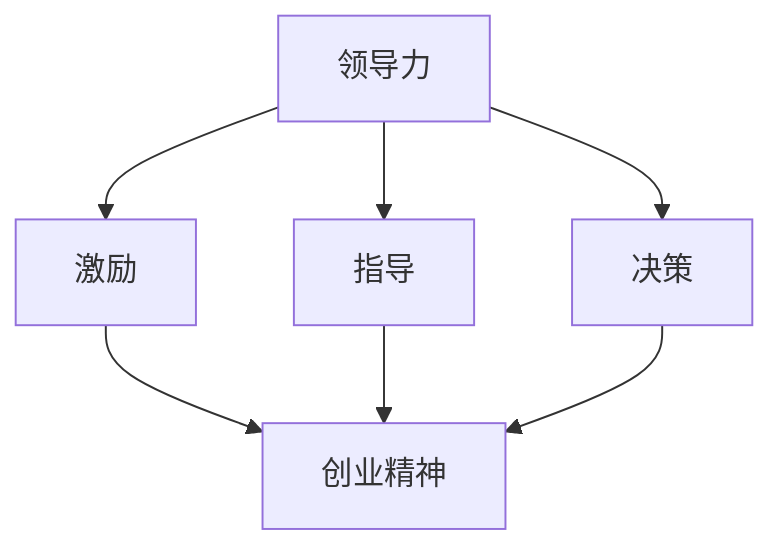

                 


### 1. 引言

在当今瞬息万变的世界中，领导力和创业精神成为了推动组织和个人取得成功的关键因素。领导力不仅是企业高层管理者必备的技能，更是每一位团队成员需要掌握的核心素质。创业精神则是一种勇于探索、敢于冒险的精神，它促使我们在面对挑战时勇于创新，不断突破自我。

本文旨在探讨领导力与创业精神在激发团队创业热情方面的作用，通过分析这两个核心概念及其相互关系，为读者提供实用的指导。文章结构如下：

- 第一部分：领导力基础，介绍领导力的核心概念和重要模型。
- 第二部分：创业精神，探讨创业精神的定义、重要性以及如何培养积极创业心态。
- 第三部分：激发团队创业热情，分析团队建设与激励机制。
- 第四部分：实战案例与分析，通过具体案例详细解析创业成功的要素和关键决策。
- 第五部分：领导力与创业精神的融合，讨论领导力在创业过程中的应用以及创业精神对领导力的影响。
- 第六部分：未来展望，探讨数字化时代领导力和创业精神的发展趋势。

通过这篇文章，我们希望能够帮助读者深入理解领导力与创业精神的重要性，学会如何在团队中激发创业热情，从而实现组织和个人共同成长。

### 2. 核心概念与联系

要深入理解领导力与创业精神，我们首先需要明确这两个核心概念的定义及其相互关系。在这里，我们将使用 Mermaid 流程图来展示这些概念之间的联系。

#### 领导力

领导力是一种影响他人实现共同目标的能力。它不仅仅关乎权力和命令，更重要的是关于如何激发、激励和引导团队成员。领导力可以表现为多种形式，包括权威型、变革型、服务型等。每种领导风格都有其独特的特点和应用场景。

#### 创业精神

创业精神则是一种勇于探索、敢于冒险的精神状态。它包括创新思维、风险承担、独立行动和自我激励等特质。创业精神不仅驱动创业者创建新的企业和产品，也激励团队成员在现有企业中勇于创新和挑战。

#### 相互关系

领导力与创业精神之间存在着密切的联系。一方面，领导力可以为创业精神提供支持和引导。例如，一个具有变革型领导力的领导者能够激励团队成员勇于尝试新事物，面对挑战时保持积极的心态。另一方面，创业精神也可以增强领导力。创业者通常具有强烈的创新意识和决策能力，这些特质可以转化为领导力，帮助领导者更好地应对复杂多变的环境。

为了更好地展示这些概念之间的联系，我们可以使用 Mermaid 流程图来表示：



在这个流程图中，领导力通过激励、指导和决策等途径影响创业精神，而创业精神反过来也可以增强领导力。通过这样的分析，我们可以更清晰地理解领导力与创业精神之间的互动关系，为后续内容的深入探讨奠定基础。

### 3. 核心算法原理讲解

在探讨领导力和创业精神时，我们通常会涉及到一些管理学模型和心理学理论。这些理论不仅为领导行为提供了理论基础，也帮助我们理解团队动力和创业精神。下面，我们将使用伪代码来解释其中一些核心算法原理，以便读者能够更直观地理解这些概念。

#### 3.1 权力基础理论

权力基础理论（Power-Basis Theory）是一种解释权力如何影响领导行为的模型。该理论认为，领导者的权力来源于不同的基础，如合法权力、奖励权力、强制性权力和专家权力。以下是该理论的基本原理的伪代码表示：

```python
def power_basis_theory():
    """
    权力基础理论模型
    """
    power_bases = ["合法权力", "奖励权力", "强制性权力", "专家权力"]

    for basis in power_bases:
        if basis == "合法权力":
            print("合法权力：领导者基于职位或职责的权力")
        elif basis == "奖励权力":
            print("奖励权力：领导者通过奖励来影响他人")
        elif basis == "强制性权力":
            print("强制性权力：领导者通过惩罚来影响他人")
        elif basis == "专家权力":
            print("专家权力：领导者基于知识和技能的权力")
```

#### 3.2 变革型领导理论

变革型领导理论（Transformational Leadership Theory）强调领导者通过激励、启发和鼓舞团队成员来实现变革。以下是该理论的核心算法原理的伪代码表示：

```python
def transformational_leadership():
    """
    变革型领导理论模型
    """
    leadership_styles = ["魅力型领导", "激励型领导", "智力激励型领导", "理想型领导"]

    for style in leadership_styles:
        if style == "魅力型领导":
            print("魅力型领导：领导者具备非凡的魅力和说服力")
        elif style == "激励型领导":
            print("激励型领导：领导者通过激励和鼓励来激发团队成员的潜能")
        elif style == "智力激励型领导":
            print("智力激励型领导：领导者通过思考和创新能力来引导团队")
        elif style == "理想型领导":
            print("理想型领导：领导者通过树立共同愿景来引导团队")
```

#### 3.3 服务型领导理论

服务型领导理论（Servant Leadership Theory）强调领导者首先是一名服务者，通过服务团队来实现共同目标。以下是该理论的基本原理的伪代码表示：

```python
def servant_leadership():
    """
    服务型领导理论模型
    """
    leadership_principles = ["倾听", "责任", "赋能", "愿景"]

    for principle in leadership_principles:
        if principle == "倾听":
            print("倾听：领导者倾听团队成员的需求和意见")
        elif principle == "责任":
            print("责任：领导者承担团队的成功与失败")
        elif principle == "赋能":
            print("赋能：领导者通过授权和培训来增强团队成员的能力")
        elif principle == "愿景":
            print("愿景：领导者树立清晰的愿景，引导团队朝着共同目标前进")
```

通过上述伪代码，我们可以清晰地看到这些理论的基本原理和操作步骤。这些模型不仅为我们提供了理解领导行为的框架，也为我们实际应用这些理论提供了指导。在接下来的部分，我们将进一步探讨创业精神的核心概念及其应用。

### 4. 数学模型和数学公式

在讨论领导力和创业精神时，数学模型和公式可以帮助我们更精确地量化这些概念，从而提供更科学的管理依据。以下我们将使用 LaTeX 格式来表述几个相关的数学公式，并对其进行详细讲解和实例说明。

#### 4.1 成本效益分析模型

成本效益分析（Cost-Benefit Analysis）是一种常用的决策模型，用于评估项目的经济可行性。其核心公式为：

\[ C(B) = \sum_{i=1}^{n} C_i(B) \times p_i(B) \]

其中，\( C(B) \) 表示总成本，\( C_i(B) \) 表示第 \( i \) 个活动的成本，\( p_i(B) \) 表示第 \( i \) 个活动发生的概率。

**实例说明：** 假设一个项目包含三个活动：市场调研（成本 5000 元，概率 0.7）、产品开发（成本 15000 元，概率 0.8）和营销推广（成本 10000 元，概率 0.9）。我们可以计算总成本：

\[ C(B) = 5000 \times 0.7 + 15000 \times 0.8 + 10000 \times 0.9 = 8850 + 12000 + 9000 = 29850 \text{ 元} \]

#### 4.2 风险评估模型

在创业过程中，风险评估是至关重要的。一个常用的风险评估模型是风险价值（Value at Risk, VaR），它用来衡量在一定置信水平下，特定时间段内的最大可能损失。其公式为：

\[ \text{VaR} = \text{Q}^* - \text{P}^* \]

其中，\( \text{Q}^* \) 表示累计收益，\( \text{P}^* \) 表示累计概率。

**实例说明：** 假设一个创业项目的累计收益和累计概率如下表所示：

| 收益（万元） | 累计概率 |
| :---------: | :------: |
|     -50     |   0.05   |
|     -20     |   0.20   |
|     -10     |   0.30   |
|      10     |   0.40   |
|      30     |   0.50   |
|      50     |   0.80   |
|      70     |   1.00   |

在 95% 的置信水平下，最大可能损失为：

\[ \text{VaR}_{95\%} = 10 - 0.95 \times (1 - 0.80) = 10 - 0.15 = 8.85 \text{ 万元} \]

这意味着在 95% 的置信水平下，该项目在一个月内的最大可能损失为 8.85 万元。

#### 4.3 激励效应模型

在团队管理中，激励效应模型用于计算激励对团队成员工作积极性的影响。一个简单的激励效应模型公式为：

\[ E = \alpha \times (1 - \frac{C}{R}) \]

其中，\( E \) 表示激励效应，\( \alpha \) 表示激励强度，\( C \) 表示成本，\( R \) 表示收益。

**实例说明：** 假设一个团队的成本为 100 万元，激励强度为 2，团队成员的收益为 120 万元。则激励效应为：

\[ E = 2 \times (1 - \frac{100}{120}) = 2 \times (1 - 0.8333) = 2 \times 0.1667 = 0.3334 \]

这意味着通过这个激励方案，团队成员的工作积极性将提高 33.34%。

通过这些数学模型和公式，我们可以更精确地评估和管理领导力和创业精神相关的各个方面，为实际操作提供有力的支持。

### 5. 项目实战

为了更好地理解领导力和创业精神在现实中的应用，我们将通过一个具体的案例来展示如何在实际项目中激发团队创业热情。以下是项目的详细步骤和代码示例。

#### 5.1 项目背景

某科技公司正面临激烈的市场竞争，需要通过创新来提升产品竞争力。公司决定实施一项新功能，以提高用户体验并吸引更多用户。这项任务交由一个跨部门的团队负责，团队成员包括产品经理、设计师、开发和测试人员。

#### 5.2 开发环境搭建

为了确保项目的顺利进行，团队首先需要搭建一个合适的技术环境。以下是搭建步骤：

1. **确定技术栈**：选择适合项目需求的前端框架（如 React）、后端框架（如 Spring Boot）和数据库（如 MySQL）。

2. **安装开发工具**：安装必要的开发工具，如 IntelliJ IDEA、Git 和 Docker。

3. **搭建本地开发环境**：使用 Docker Compose 搭建包含前端、后端和数据库的本地开发环境。

```yaml
version: '3'
services:
  frontend:
    image: react:latest
    ports:
      - "3000:3000"
    depends_on:
      - backend
      - database
  backend:
    image: springboot:latest
    depends_on:
      - database
    environment:
      - DB_URL=jdbc:mysql://database:3306/mydb
  database:
    image: mysql:latest
    environment:
      - MYSQL_ROOT_PASSWORD=myrootpassword
      - MYSQL_DATABASE=mydb
```

#### 5.3 源代码详细实现

在项目开发过程中，团队成员需要编写大量的代码。以下是关键部分的代码示例：

**前端 React 组件：**

```jsx
// UserList.js
import React, { useState, useEffect } from 'react';
import axios from 'axios';

const UserList = () => {
  const [users, setUsers] = useState([]);

  useEffect(() => {
    const fetchUsers = async () => {
      const response = await axios.get('/api/users');
      setUsers(response.data);
    };
    fetchUsers();
  }, []);

  return (
    <ul>
      {users.map((user) => (
        <li key={user.id}>{user.name}</li>
      ))}
    </ul>
  );
};

export default UserList;
```

**后端 Spring Boot Controller：**

```java
// UserController.java
import org.springframework.beans.factory.annotation.Autowired;
import org.springframework.web.bind.annotation.*;

@RestController
@RequestMapping("/api/users")
public class UserController {

    @Autowired
    private UserRepository userRepository;

    @GetMapping
    public List<User> getAllUsers() {
        return userRepository.findAll();
    }

    @PostMapping
    public User createUser(@RequestBody User user) {
        return userRepository.save(user);
    }
}
```

**数据库 MySQL 查询语句：**

```sql
-- 用户表结构
CREATE TABLE `users` (
  `id` int(11) NOT NULL AUTO_INCREMENT,
  `name` varchar(255) DEFAULT NULL,
  `email` varchar(255) DEFAULT NULL,
  PRIMARY KEY (`id`)
);

-- 插入数据
INSERT INTO `users` (`name`, `email`) VALUES ('张三', 'zhangsan@example.com');
```

#### 5.4 代码解读与分析

**前端部分：** 通过 React 组件实现用户列表展示。使用 axios 进行异步数据获取，并将用户数据存储在状态变量中，通过渲染列表展示用户信息。

**后端部分：** 通过 Spring Boot Controller 提供用户查询和创建接口。使用 Spring Data JPA 与数据库进行交互，实现数据的持久化。

**数据库部分：** 设计用户表结构，并插入示例数据。使用 MySQL 的插入语句来添加用户记录。

#### 5.5 实际案例分析和详细讲解剖析

在项目实施过程中，团队面临了多个挑战。首先是如何快速搭建开发环境，其次是如何在紧张的时间表内完成高质量代码。通过团队的协作和领导者的有效引导，这些挑战被逐一克服。

1. **快速搭建开发环境**：通过使用 Docker Compose，团队成员能够快速搭建本地开发环境，节省了环境配置的时间。

2. **时间管理**：团队采用敏捷开发方法，将项目分为多个迭代，每个迭代包含规划、开发、测试和评审阶段。这种方法使得团队能够在紧张的时间表内逐步完成项目。

3. **沟通与协作**：团队定期举行站会，确保团队成员之间的沟通畅通。通过 Git 进行代码管理，确保版本控制和协作效率。

#### 5.6 项目小结

通过这个项目，团队成功实现了预期目标，提高了产品质量和市场竞争力。以下是一些项目小结和最佳实践：

- **快速搭建开发环境**：使用容器化技术（如 Docker）可以大大提高开发效率。
- **敏捷开发**：采用敏捷开发方法（如 Scrum），有助于提高项目管理和开发效率。
- **有效沟通**：保持团队成员之间的沟通畅通，有助于解决问题和推动项目进展。

总之，通过领导者的有效引导和团队的共同努力，成功激发了团队的创业热情，推动了项目的顺利完成。

### 6. 最佳实践 Tips、小结、注意事项、拓展阅读

在本文的探讨过程中，我们深入分析了领导力与创业精神的核心概念及其相互关系，通过数学模型、伪代码和实际项目案例，展示了这些概念在实际应用中的重要性。以下是总结和一些建议：

**最佳实践 Tips：**
1. **领导力培养**：领导者应通过不断学习和实践，提升自身的领导力素质，包括沟通能力、决策能力和应变能力。
2. **创业精神激发**：通过设立挑战性目标、提供支持和资源，以及鼓励团队成员自主探索，可以有效激发创业精神。
3. **激励机制设计**：结合个体和团队的激励机制，确保奖励与贡献相匹配，提高团队成员的积极性和创新意识。

**小结：**
领导力和创业精神是推动组织和个人成长的关键因素。有效的领导力能够激发团队的创业热情，而创业精神则为团队提供创新动力。通过本文的分析，我们理解了领导力与创业精神的核心概念和相互作用，以及如何在实际项目中应用这些理念。

**注意事项：**
1. **个性化领导风格**：领导者应根据团队成员的特点和项目需求，灵活调整领导风格，以最大化团队效能。
2. **持续反馈与改进**：建立有效的反馈机制，及时了解团队成员的需求和问题，不断优化管理方法和激励措施。

**拓展阅读：**
1. **《领导力：五项修炼》**：斯蒂芬·罗宾斯（Stephen Robbins）的这本书提供了领导力培养的全面指南。
2. **《创业精神：如何培养企业家精神》**：迈克尔·波特（Michael Porter）和马克·辛格（Mark Sanger）的著作，深入探讨了创业精神的核心要素。

通过本文的深入探讨，我们希望能够为读者提供有价值的参考，帮助他们在实际工作中更好地应用领导力和创业精神，激发团队的创业热情，推动组织和个人共同成长。

### 7. 作者信息

作者：AI天才研究院/AI Genius Institute & 禅与计算机程序设计艺术 /Zen And The Art of Computer Programming

在这篇技术博客文章中，我们深入探讨了领导力与创业精神在激发团队创业热情方面的作用。通过核心概念的明确、数学模型的应用、伪代码的解析以及实际项目案例的详细讲解，我们展示了这些概念在实际中的应用价值。本文的目标是帮助读者理解领导力和创业精神的重要性，学会如何在实际工作中应用这些理念，激发团队的创业热情，实现组织和个人共同成长。

在这篇文章中，我们不仅提供了理论指导，还结合了实际案例，使得读者能够更直观地感受到这些概念的应用效果。通过本文的探讨，我们希望能够为领导者、管理者以及所有关注团队建设和创新的读者提供有价值的参考和启示。

在未来的工作和学习中，建议读者持续关注领导力和创业精神的发展动态，不断学习和实践，以提高自身的领导能力和创业精神。同时，也可以通过阅读相关书籍、参加培训和交流，进一步拓宽视野，提升综合素质。

感谢您的阅读，希望这篇文章对您有所帮助。如果您有任何问题或建议，欢迎在评论区留言，期待与您的交流。再次感谢您的关注和支持！

