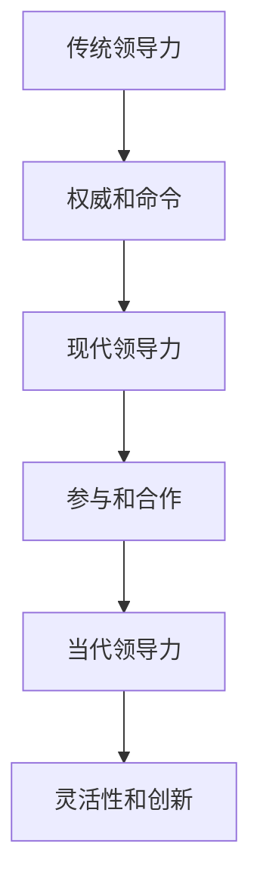
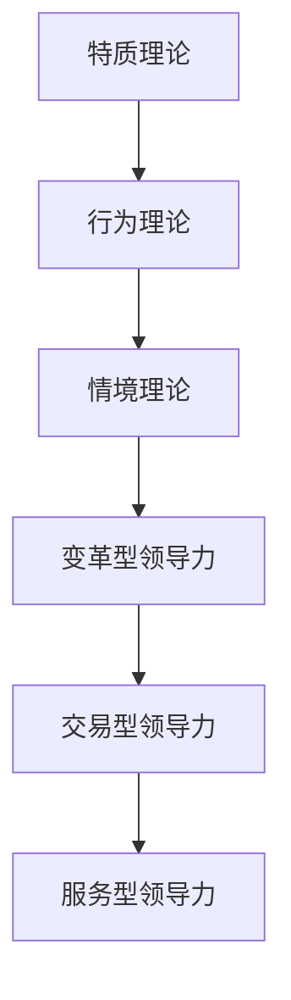
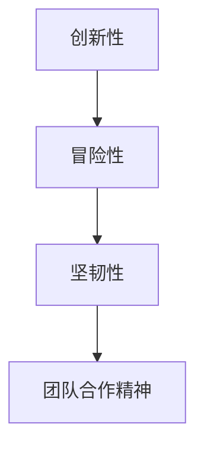
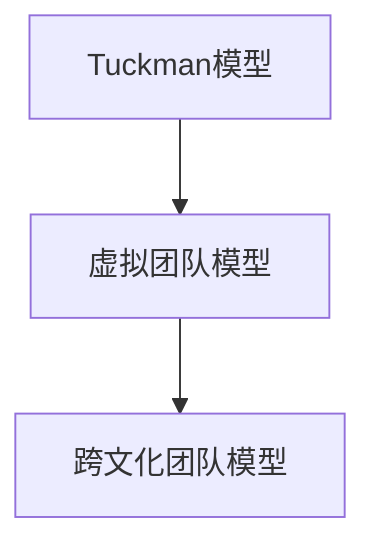

                 

### 3. 输出Markdown格式文章

```markdown
# 《领导力与创业精神：激发团队的创业热情》

## 关键词
- 领导力
- 创业精神
- 团队建设
- 创业激情
- 案例分析
- 创新管理

## 摘要
本文探讨了领导力与创业精神在激发团队创业热情中的重要作用。通过对领导力定义与历史发展的深入分析，我们了解了领导力在不同情境下的应用与适应。随后，我们探讨了创业精神的概念与特征，以及其在个人成功和企业发展中的重要性。接着，文章介绍了团队建设的原则与模型，强调了团队协作与沟通的重要性，并提出了团队冲突管理的策略。此外，文章还从心理学角度解读了创业激情，并提出了激发创业激情的方法。最后，通过国内外创业成功与失败案例分析，文章总结了创业经验与启示，为激发团队的创业热情提供了实践指导。

## 第一部分：领导力基础

### 1. 领导力定义与历史发展

#### 1.1 领导力的基本定义
领导力是指影响和激励他人为实现共同目标而采取行动的能力。它不仅仅是职位赋予的权力，更是一种行为方式，一种价值观，一种激励他人的力量。

#### 1.2 领导力的发展历程
领导力的发展历程可以分为几个阶段：传统领导力、现代领导力、以及当代领导力。传统领导力强调的是权威和命令，现代领导力则注重参与和合作，而当代领导力更强调灵活性和创新。



### 2. 领导力理论框架

#### 2.1 经典领导力理论
经典领导力理论包括特质理论、行为理论和情境理论。特质理论认为领导者具有某些固有的特质；行为理论强调领导者如何行动；情境理论则认为领导力取决于具体情境。

#### 2.2 当代领导力理论
当代领导力理论包括变革型领导力、交易型领导力和服务型领导力。变革型领导力强调领导者的创新和激励能力；交易型领导力注重交换和激励机制；服务型领导力则强调领导者为团队成员提供服务。

#### 2.3 领导力理论框架的综合应用
领导力理论框架的综合应用可以帮助领导者更好地理解不同情境下的领导行为，从而提高领导效能。



### 3. 领导力核心能力

#### 3.1 沟通能力
沟通能力是领导力的核心能力之一。有效的沟通能够建立信任、增进理解、激发创造力。

#### 3.2 决策能力
决策能力是领导者必须具备的另一项核心能力。领导者需要能够在压力下做出明智的决策，并为决策承担责任。

#### 3.3 领导者的影响力
领导者的影响力来自于他们的价值观、知识和经验。这种影响力能够激发团队成员的积极性和创造力。

```python
# 伪代码：领导力评估方法与流程
def assess_leadership():
    # 收集领导力相关数据
    data = collect_data()
    
    # 分析领导力数据
    analysis = analyze_data(data)
    
    # 评估领导力
    rating = evaluate_leadership(analysis)
    
    # 输出评估结果
    print("领导力评估结果：", rating)
```

### 4. 领导力与个人特质

#### 4.1 个人特质对领导力的影响
个人特质对领导力有着重要影响。例如，自信、开放性、责任心等特质能够提升领导者的效能。

#### 4.2 领导力与人格特质的关系
领导力与人格特质之间存在着密切的关系。某些人格特质如尽责性、神经质等与领导力有显著相关性。

## 第二部分：创业精神

### 5. 创业精神的概念与特征

#### 5.1 创业精神的定义
创业精神是指追求创新、承担风险、持续学习和积极进取的精神状态。

#### 5.2 创业精神的主要特征
创业精神的主要特征包括创新性、冒险性、坚韧性和团队合作精神。



### 6. 创业精神的重要性

#### 6.1 创业精神对个人成功的影响
创业精神对个人成功有着重要影响。它能够帮助个人克服困难，实现自我价值。

#### 6.2 创业精神对企业发展的作用
创业精神对企业发展具有积极作用。它能够激发创新，推动企业持续发展。

```latex
$$
成功 = 创新性 \times 冒险性 \times 坚韧性
$$
```

### 7. 创业精神的培养与激发

#### 7.1 创业精神的培养策略
培养创业精神需要从个人和团队两个方面入手。个人层面包括自我激励、不断学习和积极实践；团队层面包括营造创新氛围、提供支持和激励。

#### 7.2 激发创业精神的方法与手段
激发创业精神可以通过设立明确的目标、提供资源支持、鼓励试错等方式实现。

```python
# 伪代码：激发创业精神的方法与手段
def inspire_entpreneurial_spir

```markdown
it():
    # 设立明确的目标
    set_clear_goals()
    
    # 提供资源支持
    provide_resources()
    
    # 鼓励试错
    encourage试行错误()

    # 提供反馈和支持
    provide_feedback_and_support()
```

## 第三部分：团队建设

### 8. 团队建设的原则与模型

#### 8.1 团队建设的基本原则
团队建设的基本原则包括尊重个体、信任协作、共同目标和持续学习。

#### 8.2 团队建设的常用模型
团队建设的常用模型包括Tuckman模型、虚拟团队模型和跨文化团队模型。



### 9. 团队协作与沟通

#### 9.1 团队协作的重要性
团队协作能够提高工作效率，增强团队凝聚力，实现共同目标。

#### 9.2 提高团队协作的方法
提高团队协作的方法包括明确目标、优化沟通流程、建立信任和开展团队建设活动。

```python
# 伪代码：提高团队协作的方法
def improve_collaboration():
    # 明确目标
    clarify_goals()
    
    # 优化沟通流程
    optimize_communication流程()
    
    # 建立信任
    build_trust()
    
    # 开展团队建设活动
    conduct_team_building_activities()
```

### 10. 团队冲突管理

#### 10.1 团队冲突的类型
团队冲突可以分为建设性冲突和破坏性冲突。建设性冲突有助于团队发展，而破坏性冲突则会影响团队效率。

#### 10.2 解决团队冲突的策略
解决团队冲突的策略包括有效沟通、调解和建立共同目标。

```python
# 伪代码：解决团队冲突的策略
def resolve_conflicts():
    # 有效沟通
    effective_communication()
    
    # 调解
    mediate()
    
    # 建立共同目标
    establish_common_goals()
```

## 第四部分：创业激情

### 11. 创业激情的心理学解读

#### 11.1 创业激情的心理机制
创业激情是一种强烈的内在动机，它驱使个人追求创新和成功。

#### 11.2 创业激情对创业过程的影响
创业激情能够提高创业者的韧性，增强创新能力和解决问题的能力。

```latex
$$
创业激情 = 内在动机 \times 创新能力 \times 韧性
$$
```

### 12. 激发创业激情的方法

#### 12.1 激发个人创业激情的方法
激发个人创业激情的方法包括设定明确的目标、建立积极的自我形象、培养创新思维。

#### 12.2 激发团队创业激情的技巧
激发团队创业激情的技巧包括建立共同愿景、提供激励和鼓励创新。

```python
# 伪代码：激发团队创业激情的技巧
def inspire_team_entrepreneurial_passion():
    # 建立共同愿景
    establish_common_vision()
    
    # 提供激励
    provide_incentives()
    
    # 鼓励创新
    encourage_innovation()
```

### 13. 创业激情与团队动力

#### 13.1 创业激情与团队动力之间的关系
创业激情是团队动力的关键驱动力，它能够激发团队成员的积极性和创造力。

#### 13.2 提升团队动力的策略
提升团队动力的策略包括设立共同目标、提供资源和激励、建立积极的工作环境。

```python
# 伪代码：提升团队动力的策略
def enhance_team_motivation():
    # 设立共同目标
    set_common_goals()
    
    # 提供资源
    provide_resources()
    
    # 提供激励
    provide_incentives()
    
    # 建立积极的工作环境
    create_a_positive_work_environment()
```

## 第五部分：案例分析

### 14. 国内外创业成功案例分析

#### 14.1 国外创业成功案例
- **谷歌（Google）**：从一个小型搜索引擎公司成长为全球领先的科技巨头。
- **特斯拉（Tesla）**：通过电动汽车的创新，推动了整个汽车行业的变革。

#### 14.2 国内创业成功案例
- **阿里巴巴（Alibaba）**：从一个小型电子商务公司成长为全球领先的互联网企业。
- **小米（Xiaomi）**：通过创新和用户体验，迅速崛起成为全球知名的科技品牌。

### 15. 创业失败案例分析

#### 15.1 创业失败的原因分析
- **资金不足**：缺乏足够的资金支持是许多创业失败的主要原因之一。
- **市场定位不准确**：未能准确识别市场需求和定位产品。

#### 15.2 创业失败案例的启示
创业失败案例提醒我们，在创业过程中要充分准备，避免盲目行动。

### 16. 启示与借鉴

#### 16.1 成功创业经验的借鉴
- **持续创新**：成功的企业如谷歌、特斯拉等，都强调了持续创新的重要性。
- **关注用户体验**：小米的成功经验表明，关注用户体验是吸引消费者的关键。

#### 16.2 创业失败案例的警示
创业失败案例警示我们，创业并非一帆风顺，需要谨慎对待每一个决策和挑战。

## 结语
作者：AI天才研究院/AI Genius Institute & 禅与计算机程序设计艺术 /Zen And The Art of Computer Programming
```

### 3. 总结

通过本文的深入探讨，我们了解了领导力与创业精神在激发团队创业热情中的重要作用。领导力不仅是个人特质，更是一种能力，一种能够影响和激励他人实现共同目标的力量。创业精神则是推动个人和企业不断进步的动力源泉。在团队建设过程中，团队协作与沟通、团队冲突管理以及创业激情的激发都是关键因素。通过国内外成功和失败案例的分析，我们总结了创业经验，为激发团队的创业热情提供了实践指导。让我们共同追求创新，勇担风险，携手打造美好的未来。

