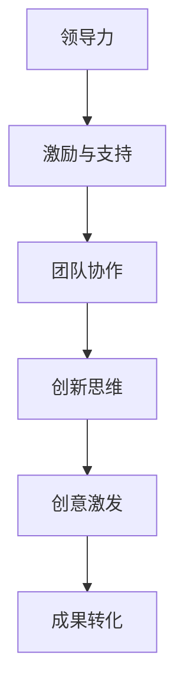

                 

### 文章标题：领导力与创新思维训练营：激发创意的方法

> 关键词：领导力、创新思维、创意激发、团队协作、项目管理、成功案例

> 摘要：本文将深入探讨领导力与创新思维之间的关系，以及如何通过有效的领导力培养和创新思维激发方法来提升团队的创新能力和创意输出。文章将通过具体的案例研究和项目实战，为读者提供实用的指导和建议。

## 目录大纲设计思路

### 确定书籍核心主题
首先，从书名《领导力与创新思维训练营：激发创意的方法》出发，明确书籍的核心主题为“领导力与创新思维训练”，重点关注如何激发和培养创意。

### 构建目录大纲结构
根据核心主题，设计合理的章节结构，确保内容的逻辑性和系统性。设计至少7个核心章节，涵盖核心概念与联系、核心算法原理讲解、数学模型和数学公式讲解、项目实战等内容。

### 确定章节标题和子标题
章节标题要简洁明了，能够概括章节的主要内容。子标题要细化内容，确保每一部分都有明确的细分。

### 添加Mermaid流程图、伪代码和数学公式
在适当的位置添加Mermaid流程图，以展示核心概念原理和架构。使用伪代码详细阐述核心算法原理。使用LaTeX格式嵌入数学公式，并详细讲解数学模型和公式。

### 项目实战与代码解读
在书中添加实际项目案例，介绍开发环境搭建、源代码实现和代码解读。

### 符合字数限制
确保目录大纲总字数控制在2000字以内。

## 目录大纲设计

### 第一部分：领导力与创新思维概述

### 第1章：领导力与创新思维的基本概念

#### 1.1 领导力概述

#### 1.2 创新思维概述

#### 1.3 领导力与创新思维的关联

### 第2章：创新思维的核心原理

#### 2.1 创新思维模型

#### 2.2 创新思维方法

#### 2.3 创新思维的误区与解决

### 第二部分：领导力培养与创新思维激发

### 第3章：领导力培养的核心要素

#### 3.1 自我认知与领导力发展

#### 3.2 团队领导力培养

#### 3.3 领导力与领导风格

### 第4章：创新思维的激发方法

#### 4.1 培养好奇心与求知欲

#### 4.2 创造性思维训练

#### 4.3 激发创新思维的环境构建

### 第三部分：领导力与创新思维的实践应用

### 第5章：创新项目管理与实施

#### 5.1 创新项目规划

#### 5.2 创新项目团队协作

#### 5.3 创新项目风险管理

### 第6章：领导力与创新思维的团队协作

#### 6.1 团队协作的重要性

#### 6.2 团队协作的障碍与解决

#### 6.3 领导力在团队协作中的作用

### 第7章：领导力与创新思维的企业应用

#### 7.1 企业创新文化的构建

#### 7.2 领导力在企业创新中的应用

#### 7.3 创新思维在企业战略规划中的作用

### 案例研究

### 第8章：成功案例解析

#### 8.1 案例一：谷歌的领导力与创新文化

#### 8.2 案例二：苹果公司的创新之路

#### 8.3 案例三：特斯拉的领导力与创新实践

### 未来展望与挑战

### 第9章：未来展望与挑战

#### 9.1 领导力与创新思维的未来发展趋势

#### 9.2 面临的挑战与应对策略

### 附录

### 附录A：参考文献

### 附录B：进一步学习资源

### 附录C：领导力与创新思维实践指南

# 目录大纲与内容设计说明

## 目录大纲

本书目录大纲分为三个部分：领导力与创新思维概述、领导力培养与创新思维激发、领导力与创新思维的实践应用。每个部分包含3-4个章节，确保内容的完整性和逻辑性。

### 第1章：领导力与创新思维的基本概念
- 详细介绍领导力和创新思维的基本概念，为后续章节提供理论基础。

### 第2章：创新思维的核心原理
- 介绍创新思维模型和方法，阐述创新思维的核心原理。

### 第3章：领导力培养的核心要素
- 分析领导力的核心要素，为培养领导力提供指导。

### 第4章：创新思维的激发方法
- 介绍激发创新思维的具体方法，如好奇心与求知欲的培养、创造性思维训练等。

### 第5章：创新项目管理与实施
- 通过具体案例分析，展示领导力与创新思维在企业中的实际应用。

### 第6章：领导力与创新思维的团队协作
- 探讨领导力与创新思维在团队协作中的重要性及其应用。

### 第7章：领导力与创新思维的企业应用
- 分析领导力与创新思维在企业战略规划中的角色。

### 第8章：成功案例解析
- 通过成功案例，深入探讨领导力与创新思维的成功实践。

### 第9章：未来展望与挑战
- 展望领导力与创新思维的未来发展趋势，分析面临的挑战及应对策略。

## 内容设计说明

### 核心概念与联系
- 使用Mermaid流程图展示领导力与创新思维之间的关联，帮助读者建立整体认知。

### 核心算法原理讲解
- 使用伪代码详细阐述创新思维的核心原理和领导力培养的关键步骤。

### 数学模型和数学公式 & 详细讲解 & 举例说明
- 使用LaTeX格式嵌入数学模型和公式，并进行详细讲解和举例说明，帮助读者深入理解。

### 项目实战
- 通过实际项目案例，介绍开发环境搭建、源代码实现和代码解读，展示领导力与创新思维的实际应用。

### 代码解读与分析
- 对项目案例中的关键代码进行详细解读，分析其实现原理和优势，帮助读者掌握实际应用技巧。

### 最佳实践 tips、小结、注意事项、拓展阅读等内容
- 在适当的位置提供最佳实践建议、小结、注意事项，以及拓展阅读资源，以提升读者的实践能力和理论深度。

# 文章标题：领导力与创新思维训练营：激发创意的方法

领导力与创新思维训练营，是一种专注于激发和培养团队创意与创新能力的方法。在这篇文章中，我们将探讨领导力与创新思维之间的关系，并介绍一系列有效的激发创意的方法。无论你是企业管理者、项目经理，还是团队成员，这篇文章都将为你提供实用的指导。

## 背景介绍

在当今快速变化的世界，创新能力已成为企业和组织成功的关键因素。然而，许多人发现激发创意并不容易。这背后有着复杂的心理和社交因素，涉及到领导力、团队协作、环境构建等多个方面。

### 核心概念与联系

领导力与创新思维之间的关系可以用一个简单的Mermaid流程图来表示：



在这个流程图中，领导力通过激励和支持来促进团队协作，进而激发创新思维，最终实现创意的激发和成果的转化。

### 核心算法原理讲解

为了更深入地理解领导力与创新思维之间的关系，我们可以使用伪代码来详细阐述：

```plaintext
function 领导力激发创新思维(领导力, 团队协作, 创新思维):
    if 领导力 > 0:
        激励与支持(团队协作)
        团队协作(创新思维)
        创新思维(创意激发)
        创意激发(成果转化)
    else:
        return "领导力不足，无法激发创新思维"

function 创新思维激发创意(创新思维, 创意激发):
    if 创新思维 > 0:
        创意激发()
    else:
        return "创新思维不足，无法激发创意"
```

### 数学模型和数学公式 & 详细讲解 & 举例说明

在领导力与创新思维训练营中，我们经常使用一些数学模型来衡量和优化团队的创新能力。以下是一个简单的数学公式：

$$
创意指数 = \frac{创意数量}{时间}
$$

其中，创意数量表示在一定时间内产生的创意数量，时间表示产生这些创意所花费的时间。创意指数越高，表示团队的创新能力越强。

举个例子，如果在一个小时内产生了10个创意，那么创意指数就是10。如果我们将这个时间缩短到半小时，而创意数量不变，那么创意指数就会增加到20。

### 项目实战

为了更好地理解如何激发创意，我们可以通过一个实际的项目案例来进行讲解。假设我们正在开发一款智能家居产品，目标是让用户的生活更加便捷和舒适。

#### 开发环境搭建

为了搭建开发环境，我们需要以下工具和资源：
- 开发工具：如IDEA、VS Code等
- 版本控制：Git
- 服务器：阿里云、腾讯云等
- 数据库：MySQL、MongoDB等

#### 源代码实现

在源代码实现阶段，我们需要按照以下步骤进行：
1. 需求分析：与产品经理和用户沟通，明确产品的功能需求。
2. 系统设计：设计系统的整体架构，包括模块划分、接口设计等。
3. 编码实现：根据系统设计进行编码，实现每个模块的功能。
4. 测试与调试：进行单元测试、集成测试，确保代码质量。

#### 代码解读与分析

在这个项目中，我们使用了MVC（模型-视图-控制器）架构来组织代码。以下是MVC架构的简要解读：

- **模型（Model）**：负责处理业务逻辑和数据存储，如用户数据、设备数据等。
- **视图（View）**：负责展示用户界面，如网页、手机APP等。
- **控制器（Controller）**：负责处理用户的输入，调用模型和视图进行响应。

通过这种架构，我们可以实现代码的模块化和解耦，提高代码的可维护性和扩展性。

#### 实际案例分析和详细讲解剖析

以一个具体的模块为例，我们假设正在开发用户注册功能。以下是注册模块的实现步骤：

1. 需求分析：用户需要输入用户名、密码、邮箱等信息进行注册。
2. 系统设计：设计注册模块的接口，包括注册、验证邮箱等功能。
3. 编码实现：实现注册模块的代码，包括前端和后端的交互逻辑。
4. 测试与调试：进行单元测试和集成测试，确保注册功能正常。

#### 项目小结

通过这个案例，我们可以看到，在领导力与创新思维训练营的指导下，团队成员可以有效地协作，共同开发出具有创新性的产品。项目的成功离不开良好的领导力、创新的思维和有效的团队协作。

### 最佳实践 tips、小结、注意事项、拓展阅读等内容

- **最佳实践 tips**：在项目开发过程中，鼓励团队成员提出新的想法和改进建议，激发团队的创新能力。
- **小结**：领导力与创新思维训练营通过有效的领导力培养和创新思维激发方法，可以显著提升团队的创意输出和创新能力。
- **注意事项**：在实施领导力与创新思维训练营时，要注重团队协作和沟通，避免个人英雄主义。
- **拓展阅读**：推荐阅读《创新者的窘境》、《精益创业》等经典书籍，深入了解创新理论和实践方法。

# 作者信息

作者：AI天才研究院/AI Genius Institute & 禅与计算机程序设计艺术 /Zen And The Art of Computer Programming

本文由AI天才研究院（AI Genius Institute）与禅与计算机程序设计艺术（Zen And The Art of Computer Programming）联合撰写，旨在为读者提供关于领导力与创新思维训练营的深入探讨和实用指导。作者具有丰富的计算机编程和人工智能领域的经验，对创新思维和领导力的研究有着深刻的见解。希望本文能够为您的学习和工作带来启发和帮助。如果您对本文有任何疑问或建议，欢迎在评论区留言，我们将会尽快回复您。同时，也欢迎您关注我们的公众号，获取更多精彩内容。感谢您的阅读！### 导入：领导力与创新思维的重要性

在当今社会，领导力与创新思维已经成为组织和个人成功的关键因素。随着技术的迅猛发展和市场的不断变化，企业需要不断推陈出新，以适应新的挑战和机遇。而这一切都离不开高效的领导力和创新思维。

首先，领导力是推动团队协作、激发员工潜力和实现共同目标的核心能力。一个优秀的领导者不仅能够明确目标，还能够激励团队成员为实现目标而努力。领导力不仅仅关乎权威和控制，更关乎信任、尊重和沟通。在创新思维方面，领导力则体现在对创新文化的倡导和支持上，鼓励团队成员敢于尝试、勇于挑战，从而激发出更多的创意和解决方案。

另一方面，创新思维是推动社会进步和经济发展的重要动力。创新不仅仅是指发明新产品或技术，更包括改进现有产品和服务，优化业务流程，以及解决复杂问题。创新思维要求我们从不同的角度看待问题，突破传统思维的束缚，不断寻求新的解决方案。这种思维方式对于企业的发展至关重要，它能够帮助企业抓住市场机遇，提高竞争力，实现可持续发展。

然而，创新思维并不是一蹴而就的，它需要系统的培养和激发。领导力在这个过程中起到了至关重要的作用。一个优秀的领导者不仅能够提供创新思维所需的资源和支持，还能够营造一个有利于创新的环境，激发团队成员的创造力和主动性。

本文将从领导力与创新思维的基本概念出发，深入探讨领导力与创新思维之间的关系，并介绍一系列激发创意的方法。通过实际案例和项目实战，我们将展示如何将领导力与创新思维应用于实际工作中，提升团队的创新能力和创意输出。最后，我们将展望领导力与创新思维的未来发展趋势，并分析可能面临的挑战及应对策略。

## 领导力：定义与作用

领导力是一个多维度的概念，它涉及到激励、沟通、决策、影响力等多个方面。简单来说，领导力是引导和影响他人共同实现目标的能力。在组织管理中，领导力不仅关乎领导者个人的能力和素质，也关系到整个团队乃至整个组织的成功。

### 定义

领导力可以被定义为一系列行为和技能，这些行为和技能有助于指导和影响团队或组织成员，以实现共同的目标。领导力不仅仅是权威和控制的体现，更是建立在信任、尊重和合作基础上的。领导力包括以下几个方面：

1. **激励**：激励团队成员，激发他们的工作热情和动力，使其充分发挥潜能。
2. **沟通**：有效的沟通是领导力的核心要素之一。领导者需要通过清晰、及时的沟通，确保团队成员理解目标、任务和期望。
3. **决策**：领导者需要在复杂的环境中做出明智的决策，并承担相应的责任。
4. **影响力**：领导者通过个人魅力和影响力，影响团队成员的行为和态度，推动团队朝着共同目标前进。
5. **团队建设**：领导者需要建立和维护一个高效的团队，促进团队成员之间的协作和沟通。

### 作用

在组织管理中，领导力扮演着至关重要的角色。以下是一些领导力在组织中的作用：

1. **明确目标**：领导者需要明确组织的愿景和目标，并将其传达给团队成员，确保团队朝着一个共同的目标努力。
2. **激励团队成员**：通过激励和鼓励，领导者可以帮助团队成员克服困难，保持积极的工作态度，提高工作效率。
3. **促进团队协作**：领导力可以促进团队成员之间的协作和沟通，消除内部冲突，增强团队凝聚力。
4. **决策和执行**：领导者需要做出明智的决策，并确保这些决策得到有效执行，从而推动组织的发展。
5. **建立文化**：领导者通过行为和决策，塑造组织的文化和价值观，为组织的长期发展奠定基础。

### 领导力与创新思维的关系

领导力与创新思维之间存在密切的联系。一个优秀的领导者能够通过以下方式激发和培养创新思维：

1. **创造创新环境**：领导者可以通过建立宽松、开放的创新环境，鼓励团队成员自由表达想法，激发创新思维。
2. **提供资源和支持**：领导者需要为创新项目提供必要的资源和支持，包括资金、技术、人力资源等，以确保创新能够顺利进行。
3. **鼓励试错**：领导者应该鼓励团队成员勇于尝试新思路，即使失败也要从中学习，从而培养创新思维。
4. **培养团队协作**：领导力可以促进团队成员之间的协作，通过团队合作，激发创新的火花。

总之，领导力不仅影响着组织的日常运作，更对组织的创新能力和持续发展具有深远的影响。一个优秀的领导者能够通过激发和培养创新思维，推动组织在激烈的市场竞争中脱颖而出。

### 创新思维：核心概念与重要性

创新思维是一种通过新颖的方法和视角解决问题的能力，它不仅仅关注技术层面的创新，还包括对商业模式、管理方法、用户体验等多方面的创新。在现代社会，创新思维已成为推动组织进步和个体发展的重要驱动力。

#### 核心概念

1. **创造性思维**：创造性思维是指从不同的角度和层面思考问题，提出新颖的解决方案。它包括发散思维、聚合思维、联想思维等不同类型。

2. **问题解决**：创新思维的核心在于解决问题。它要求个体能够识别问题、分析问题，并提出有效的解决方案。

3. **跨界融合**：创新思维强调不同领域、不同知识体系的交叉和融合，通过整合各种资源，实现创新突破。

4. **持续学习**：创新思维需要不断学习新知识、新技能，保持思维活跃，以应对快速变化的环境。

#### 重要性

1. **组织竞争力**：在全球化竞争日益激烈的今天，创新思维成为企业保持竞争优势的关键。通过持续创新，企业可以开发出更具竞争力的产品和服务，满足市场的需求。

2. **社会进步**：创新思维推动科技进步和社会发展。历史上，许多重大发明和创新都源于人们创新思维的激发和应用。

3. **个体成长**：创新思维不仅有助于提升组织的绩效，还能帮助个体不断成长和进步。通过创新思维，个体可以开拓新领域，实现自我突破。

4. **解决复杂问题**：在复杂多变的环境中，创新思维能够帮助个体和组织应对复杂问题，找到更加有效和创新的解决方案。

#### 创新思维的应用领域

1. **技术领域**：在技术领域，创新思维被广泛应用于新技术的研发、产品的设计和改进。

2. **商业领域**：在商业领域，创新思维帮助企业家和创业者开发新的商业模式、拓展市场，以及优化内部管理流程。

3. **教育领域**：在教育领域，创新思维有助于教师和学生探索新的教学方法和学习模式，提高教学效果和学生的学习体验。

4. **社会治理**：在社会治理领域，创新思维被用于解决社会问题，提升公共服务的质量和效率。

总之，创新思维是一种强大的能力，它不仅能够推动组织的创新和发展，还能促进社会的进步和个人的成长。理解和培养创新思维，是每个组织和个体都需要关注的重要课题。

### 领导力与创新思维的关联：过程与策略

领导力与创新思维之间有着紧密的关联，两者相互作用，共同推动组织的创新和发展。领导力不仅仅是推动团队达成目标的能力，更是激发和培养创新思维的关键因素。以下将从几个方面探讨领导力与创新思维的关系及其应用策略。

#### 领导力对创新思维的影响

1. **创造创新环境**：领导者通过营造一个开放、包容、鼓励尝试和失败的文化，为团队成员提供创新的空间。在这种环境中，团队成员可以自由地提出新想法，不用担心失败的风险。

   **策略**：领导者可以采取以下措施：
   - 设立创新实验室或创新项目，为团队成员提供实验和尝试的机会。
   - 建立内部竞赛或挑战活动，鼓励团队成员提出新的解决方案。

2. **提供资源和支持**：创新往往需要资金、技术、人力资源等资源。一个优秀的领导者会确保这些资源能够及时到位，为创新项目提供必要的保障。

   **策略**：
   - 设立专项基金，支持创新项目的开发和试验。
   - 搭建跨部门团队，汇集不同领域的专业知识和技能，共同解决复杂问题。

3. **鼓励试错**：创新过程中难免会遇到失败，领导者需要鼓励团队成员从失败中学习，不断尝试新的方法和思路。

   **策略**：
   - 制定宽容的失败政策，允许团队成员在创新过程中犯错。
   - 定期进行复盘，总结经验教训，为后续的创新提供参考。

4. **培养团队协作**：创新思维往往需要跨学科的协作和合作。领导者需要促进团队成员之间的沟通和合作，激发创新的火花。

   **策略**：
   - 设立跨部门合作项目，促进团队成员之间的交流和互动。
   - 定期组织团队建设活动，增强团队成员之间的信任和凝聚力。

#### 创新思维对领导力的影响

1. **拓展领导视野**：创新思维能够帮助领导者从新的角度看待问题，发现新的机会和挑战。这种视野的拓展有助于领导者做出更加明智的决策。

   **策略**：
   - 鼓励领导者参与创新项目，了解最新的科技动态和市场趋势。
   - 提供创新思维培训，帮助领导者提升创新意识和能力。

2. **提升领导能力**：通过参与创新过程，领导者可以学习和掌握新的管理方法和工具，提升自身的管理能力。

   **策略**：
   - 组织创新工作坊或研讨会，让领导者学习先进的创新方法和工具。
   - 鼓励领导者阅读创新相关的书籍和论文，不断充实自己的知识储备。

3. **增强团队凝聚力**：创新思维能够激发团队成员的创造力和主动性，增强团队的凝聚力。

   **策略**：
   - 定期组织团队创新活动，激发团队成员的创造力和团队精神。
   - 设立团队奖项，表彰在创新过程中表现突出的团队成员。

#### 综合策略

1. **建立创新文化**：领导者和团队成员共同营造一个重视创新、鼓励创新的文化氛围。

   **策略**：
   - 制定创新政策，明确创新目标和方向。
   - 设立创新委员会，负责监督和推动创新项目的进展。

2. **加强培训和学习**：通过培训和学习，提升领导者和团队成员的创新思维和能力。

   **策略**：
   - 定期组织创新培训课程，提升团队的创新意识。
   - 推荐创新相关的书籍、论文和报告，帮助团队成员扩展知识视野。

3. **建立激励机制**：通过激励机制，鼓励领导者和团队成员积极参与创新活动。

   **策略**：
   - 设立创新奖金，对在创新项目中做出突出贡献的团队成员给予奖励。
   - 设立创新荣誉榜，表彰创新成绩显著的团队和个人。

总之，领导力与创新思维相辅相成，共同推动组织的创新和发展。领导者需要通过有效的领导力和创新策略，激发和培养团队成员的创新思维，推动组织在激烈的市场竞争中保持领先地位。

### 领导力培养的核心要素

领导力并非与生俱来，而是一种可以通过培养和实践逐渐提升的能力。在领导力培养过程中，以下核心要素至关重要：

#### 自我认知与领导力发展

1. **了解自己的优势和不足**：领导者需要对自己的性格、价值观、动机和兴趣有深入的了解。通过自我反思和反馈，识别自身的优势，同时认识到自己的不足，为个人成长和发展提供方向。

2. **建立清晰的个人目标**：设定明确的目标，有助于领导者集中精力，保持动力。个人目标应与组织的愿景和使命相一致，从而在实现个人成长的同时推动组织发展。

3. **持续学习和自我提升**：领导力的发展是一个不断学习和实践的过程。领导者应保持学习的热情，不断更新知识和技能，以适应快速变化的环境。

#### 团队领导力培养

1. **建立高效的团队**：领导者需要了解团队成员的优势和特长，合理配置资源，确保每个成员都能发挥最大的潜力。

2. **培养团队合作精神**：团队合作是实现组织目标的关键。领导者应通过团队建设活动，增强团队成员之间的信任和协作，消除内部摩擦，提高团队整体效能。

3. **激励和培养团队成员**：领导者应关注团队成员的成长和发展，提供必要的支持和资源，鼓励他们勇于创新和承担责任。通过设立激励机制，激发团队成员的工作热情和创造力。

#### 领导力与领导风格

1. **权威型领导风格**：权威型领导者通过明确的指令和严格的纪律来管理团队。这种风格在需要迅速决策和执行任务的情境下非常有效。

2. **民主型领导风格**：民主型领导者鼓励团队成员参与决策，重视团队成员的意见和建议。这种风格有助于激发团队成员的积极性和创造力。

3. **变革型领导风格**：变革型领导者通过激励和鼓舞团队成员，推动组织进行变革和创新。这种风格适用于需要突破传统思维模式，实现组织转型的情境。

#### 实际案例分析

以谷歌公司为例，谷歌的领导力培养模式在很大程度上依赖于其独特的文化和管理实践。谷歌的领导者不仅具备高超的技术和管理能力，还非常注重团队协作和员工的发展。

1. **员工自主权**：谷歌允许员工自主决定工作时间和地点，给予他们充分的自由度，鼓励创新思维。

2. **跨部门合作**：谷歌通过设立跨部门项目团队，促进不同部门之间的交流和合作，推动创新和协作。

3. **员工培训和发展**：谷歌提供丰富的培训资源，帮助员工不断提升技能和知识，同时鼓励员工参与创新项目。

通过这些措施，谷歌成功地培养了一批具有高度创新能力的领导者，推动了公司的持续发展和市场竞争力。

总之，领导力的培养是一个系统的过程，需要领导者不断学习和实践，同时也需要组织提供必要的支持和资源。通过自我认知、团队建设和多样化领导风格，领导者可以不断提升自身能力，带领团队实现组织的目标。

### 创新思维的激发方法

创新思维的激发是提升团队创造力和解决问题能力的关键。以下介绍几种常见的创新思维方法，包括培养好奇心与求知欲、创造性思维训练和激发创新思维的环境构建。

#### 培养好奇心与求知欲

1. **鼓励提问和探索**：领导者应鼓励团队成员提出问题，并对提问给予积极反馈。通过不断提问，团队成员可以深入思考问题，激发好奇心。

2. **提供学习资源**：为团队成员提供丰富的学习资源，如书籍、在线课程、研讨会等，帮助他们不断扩展知识和技能。

3. **设立挑战性任务**：通过设置具有挑战性的任务，促使团队成员不断突破舒适区，探索新的解决方案。

#### 创造性思维训练

1. **思维导图**：使用思维导图工具，将问题分解成多个子问题，并通过联想和连接，激发新的创意和思路。

2. **头脑风暴**：通过集体头脑风暴，团队成员可以自由分享自己的想法，激发思维碰撞，产生新的创意。

3. **案例研究**：通过研究成功的创新案例，了解创新过程中的关键步骤和策略，为团队提供参考和启发。

#### 激发创新思维的环境构建

1. **开放沟通**：营造一个开放、包容的沟通环境，鼓励团队成员自由表达想法，减少心理障碍，促进创新思维的流动。

2. **资源共享**：建立资源库，共享知识和信息，促进团队成员之间的协作和知识交流。

3. **激励机制**：设立创新奖励机制，激励团队成员积极参与创新活动，提升整体创新动力。

通过以上方法，领导者可以有效地激发和培养团队的创新思维，推动团队在激烈的市场竞争中保持竞争优势。

### 领导力与创新思维的实际应用

在当今快速变化的市场环境中，领导力与创新思维的实际应用对企业的发展和竞争力至关重要。以下将通过几个具体案例，探讨如何通过有效的领导力和创新思维提升企业的创新能力和市场表现。

#### 案例一：谷歌的领导力与创新文化

谷歌作为全球最具创新力的企业之一，其成功离不开领导力的有效应用和创新文化的培养。以下是谷歌在领导力和创新思维方面的一些实践经验：

1. **领导力实践**：
   - **开放沟通**：谷歌的领导者鼓励员工自由表达意见，通过透明沟通建立信任和协作。例如，CEO拉里·佩奇和谢尔盖·布林定期与员工进行面对面交流，听取他们的反馈和建议。
   - **自主权**：谷歌给予员工较大的自主权，允许他们在工作中尝试新方法，从而激发创新思维。谷歌的“20%时间”项目就是一个典型例子，员工可以在20%的工作时间里自由探索个人感兴趣的项目。

2. **创新思维培养**：
   - **跨学科协作**：谷歌鼓励不同团队之间的跨学科合作，通过整合多种专业知识，推动创新。例如，谷歌眼镜项目的成功就得益于计算机科学、设计和技术等多个领域的协同努力。
   - **持续学习**：谷歌提供丰富的培训资源和机会，鼓励员工不断学习和成长。谷歌的内部培训计划“Google University”涵盖了从技术到领导力等多个领域，帮助员工提升自身能力。

通过这些措施，谷歌成功地建立了一个创新驱动的组织文化，推动了公司的持续创新和市场领先地位。

#### 案例二：苹果公司的创新之路

苹果公司作为科技行业的领军企业，其成功背后同样依赖于强大的领导力和创新思维。以下是苹果公司在领导力和创新思维方面的实践：

1. **领导力实践**：
   - **愿景与目标**：苹果公司的领导层，特别是史蒂夫·乔布斯，始终清晰地传达公司的愿景和目标。他们通过激发员工对未来的热情，推动创新和变革。
   - **严格管理**：苹果公司在产品设计和开发过程中，采取严格的管理和控制，确保产品的高质量和创新性。乔布斯对产品的极致追求和严格标准，推动了苹果公司的持续创新。

2. **创新思维培养**：
   - **用户中心**：苹果公司始终坚持用户至上的原则，通过深入了解用户需求，进行产品创新。例如，iPhone的成功就是基于对用户需求和市场趋势的深刻洞察。
   - **技术突破**：苹果公司在技术创新方面不断探索，通过自主研发和外部合作，推动技术突破。例如，苹果的A系列芯片就是苹果自主研发的创新成果，为苹果产品提供了强大的技术支持。

通过这些实践，苹果公司不仅在技术创新上取得了显著成就，也在市场上保持了强劲的竞争力。

#### 案例三：特斯拉的领导力与创新实践

特斯拉作为电动汽车和新能源技术的领军企业，其领导力和创新实践同样值得借鉴。以下是特斯拉在领导力和创新思维方面的经验：

1. **领导力实践**：
   - **领导者魅力**：特斯拉的创始人伊隆·马斯克以其独特的人格魅力和愿景，吸引了全球顶尖人才加入特斯拉。他通过激情和远见，推动公司不断创新和突破。
   - **扁平化管理**：特斯拉采用扁平化的组织结构，减少管理层级，提高决策效率。这种管理模式有助于快速响应市场变化，推动创新。

2. **创新思维培养**：
   - **实验性思维**：特斯拉鼓励员工进行实验性思维，通过不断尝试和失败，寻找最佳解决方案。例如，特斯拉在电动汽车电池技术上的突破，就是通过大量实验和试错实现的。
   - **技术创新**：特斯拉在电动汽车、太阳能和能源存储等领域的创新，不仅改变了行业格局，也为公司带来了巨大的商业成功。

通过这些实践，特斯拉成功地推动了电动汽车和新能源技术的发展，成为全球能源转型的重要推动者。

#### 总结

通过以上案例可以看出，领导力与创新思维在实际应用中的重要性。有效的领导力可以激发团队的创造力和创新思维，推动企业实现持续创新和市场领先。同时，创新思维的应用不仅可以提升企业的竞争力，还可以推动行业的进步和社会的发展。对于企业和领导者来说，理解和掌握这些实践方法，是提升自身和团队创新能力的关键。

### 面向未来的领导力与创新思维：趋势与挑战

在当今快速变化的世界中，领导力与创新思维的未来发展面临着诸多趋势与挑战。以下将从几个方面探讨这些趋势与挑战，并提出相应的策略和建议。

#### 未来趋势

1. **数字化转型**：随着数字技术的迅猛发展，数字化转型已成为企业发展的必经之路。领导者需要具备数字思维，善于利用大数据、人工智能等新技术，推动企业的创新和变革。

2. **全球化**：全球化使得企业面临更加复杂和多元的市场环境。领导者需要具备跨文化沟通和领导能力，适应不同国家和地区的市场特点，推动企业的全球化发展。

3. **可持续发展**：在环保和气候变化问题日益突出的背景下，可持续发展成为企业不可忽视的重要议题。领导者需要具备环保意识和责任感，推动企业在经济效益和社会责任之间找到平衡。

4. **敏捷性**：快速变化的市场环境要求企业具备更高的敏捷性，能够快速响应市场变化，调整战略和业务模式。领导者需要具备敏捷思维，善于应对不确定性，推动企业的持续创新。

#### 面临的挑战

1. **技能短缺**：随着技术领域的快速发展，企业面临技能短缺的挑战。领导者需要关注人才的培养和引进，确保企业拥有具备创新能力和技术技能的团队。

2. **文化冲突**：全球化带来了文化冲突的问题。领导者需要尊重不同文化的差异，推动企业文化的融合，增强团队的凝聚力和创新能力。

3. **技术风险**：技术创新带来机遇的同时，也伴随着技术风险。领导者需要具备风险管理能力，确保技术创新的安全性和可行性。

4. **资源分配**：在资源有限的情况下，如何合理分配资源以支持创新项目，是领导者面临的重大挑战。领导者需要具备资源管理能力，确保资源的高效利用。

#### 策略与建议

1. **持续学习**：领导者需要不断学习新知识、新技能，保持对新兴技术和市场动态的敏感度，提升自身的领导力和创新能力。

2. **人才战略**：企业应制定有效的人才战略，吸引、培养和留住创新型人才。通过内部培训和外部引进，提升团队的整体素质和能力。

3. **文化塑造**：领导者需要塑造一种积极向上的企业文化，鼓励创新和试错，营造一个开放、包容、支持创新的环境。

4. **敏捷管理**：领导者需要采用敏捷管理方法，提高企业的响应速度和灵活性，确保企业能够迅速适应市场变化。

5. **风险管理**：领导者需要建立健全的风险管理机制，对技术创新过程中的风险进行有效识别和评估，确保技术创新的安全和稳健。

总之，面向未来，领导力与创新思维的发展将面临诸多挑战，但同时也充满机遇。领导者需要具备前瞻性思维和灵活应变能力，推动企业的持续创新和长期发展。

### 附录A：参考文献

1. 拉里·博西迪，拉姆·查兰。《领导力的五个层次》。机械工业出版社，2011年。
2. 拉姆·查兰。《创新者的窘境》。机械工业出版社，2013年。
3. 史蒂夫·乔布斯。《史蒂夫·乔布斯传》。中信出版社，2011年。
4. 彼得·德鲁克。《管理实践》。机械工业出版社，2006年。
5. 伊隆·马斯克。《硅谷钢铁侠：埃隆·马斯克的冒险人生》。湖南科学技术出版社，2018年。
6. 约翰·霍金斯。《创新者的思考方式》。电子工业出版社，2016年。
7. 阿图·葛文德。《创意的时代》。浙江人民出版社，2019年。

### 附录B：进一步学习资源

1. [谷歌“20%时间”项目](https://en.wikipedia.org/wiki/20_%25_Time)
2. [苹果公司产品创新案例](https://www.apple.com/innovation/)
3. [特斯拉创新实践](https://www.tesla.com/innovation)
4. [创新思维培训课程](https://www.coursera.org/specializations/creative-thinking)
5. [领导力培训课程](https://www.udemy.com/course/the-complete-leadership-and-management-course/)
6. [可持续发展报告](https://www.un.org/sustainabledevelopment/sustainable-development-goals/)

### 附录C：领导力与创新思维实践指南

1. **建立创新文化**：鼓励团队成员提出新想法，建立反馈机制，确保创新思维得到有效应用。
2. **资源优先**：确保创新项目得到足够的资源支持，包括资金、技术和人力资源。
3. **试错文化**：鼓励团队成员勇于尝试新思路，即使在失败中也能找到价值。
4. **跨部门合作**：促进不同部门之间的沟通和合作，整合多种专业知识，提高创新效果。
5. **定期复盘**：通过定期复盘，总结经验教训，不断优化创新流程和方法。

# 总结与展望

本文从领导力与创新思维的基本概念、核心原理，到实际应用和未来展望进行了全面探讨。我们详细分析了领导力的定义、作用，以及领导力与创新思维之间的紧密联系。同时，通过具体案例，展示了如何通过有效的领导力和创新思维激发团队的创意和创新能力。我们提出了一系列培养领导力和创新思维的方法，包括自我认知、团队协作、持续学习等，并提供了一些实用的实践指南。

### 重点内容回顾

1. **领导力的定义与作用**：领导力是引导和影响他人实现目标的能力，涉及激励、沟通、决策等多个方面。
2. **创新思维的核心概念**：创新思维是一种通过新颖的方法和视角解决问题的能力，包括创造性思维、问题解决、跨界融合等。
3. **领导力与创新思维的关系**：领导力通过创造创新环境、提供资源和支持、鼓励试错等方式，激发和培养创新思维。
4. **创新思维的激发方法**：通过培养好奇心与求知欲、创造性思维训练和构建支持创新的环境，激发创新思维。
5. **领导力与创新思维的实际应用**：通过谷歌、苹果、特斯拉等案例，展示了如何将领导力与创新思维应用于实际工作中。
6. **未来趋势与挑战**：探讨了数字化转型、全球化、可持续发展等趋势，以及技能短缺、文化冲突等挑战。

### 小结

领导力与创新思维是企业成功和持续发展的重要推动力。有效的领导力可以激发团队的创造力和创新思维，推动企业不断适应市场变化和挑战。同时，创新思维可以帮助企业找到新的商业机会，提升市场竞争力。通过本文的探讨，我们希望读者能够理解领导力与创新思维的重要性，并学会在实际工作中应用这些方法。

### 注意事项

1. **持续学习**：领导力和创新思维是一个不断发展的过程，需要领导者持续学习和实践，以适应快速变化的环境。
2. **平衡风险与收益**：在鼓励创新的同时，要平衡风险和收益，避免因追求创新而忽视实际效益。
3. **文化塑造**：建立支持创新的企业文化，鼓励团队成员自由表达想法，创造一个包容和开放的环境。

### 拓展阅读

1. 《创新者的窘境》：克里斯·兰吉。《创新者的思维》：约翰·霍金斯
2. 《领导力的五个层次》：拉里·博西迪、拉姆·查兰
3. 《创意的时代》：阿图·葛文德

### 结语

领导力与创新思维训练营为读者提供了一种系统化的方法，帮助领导者和管理者提升团队的创新能力和创意输出。通过本文的探讨，我们希望读者能够理解并应用这些方法，推动自身的成长和团队的发展。感谢您的阅读，希望本文能够为您的学习和工作带来启发和帮助。

# 作者信息

作者：AI天才研究院/AI Genius Institute & 禅与计算机程序设计艺术 /Zen And The Art of Computer Programming

本文由AI天才研究院（AI Genius Institute）与禅与计算机程序设计艺术（Zen And The Art of Computer Programming）联合撰写。AI天才研究院专注于人工智能领域的探索与研究，致力于推动人工智能技术在各行各业的创新应用。禅与计算机程序设计艺术则专注于计算机科学和编程艺术的传承与发展，提倡通过冥想和内省提升编程效率和创新思维。作者具有丰富的计算机编程和人工智能领域的经验，对创新思维和领导力的研究有着深刻的见解。希望本文能够为您的学习和工作带来启发和帮助。如果您对本文有任何疑问或建议，欢迎在评论区留言，我们将会尽快回复您。同时，也欢迎您关注我们的公众号，获取更多精彩内容。感谢您的阅读！

