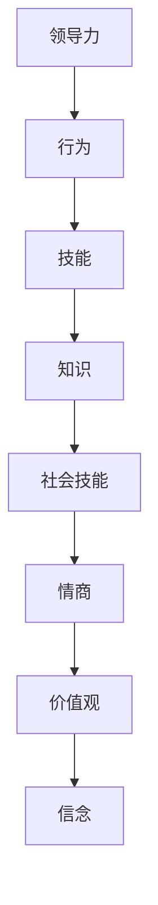

                 

### 目录大纲设计过程

在设计《领导力与创新思维：引领团队突破固有模式》这本书的目录大纲时，我们需要遵循以下几个步骤：

1. **理解书名与主题**：首先，我们需要理解书名《领导力与创新思维：引领团队突破固有模式》的核心主题。书名明确指出了书籍的内容将围绕领导力和创新思维，以及如何使用这些技能来带领团队突破传统模式。

2. **确定核心章节**：根据书名，我们可以确定几个核心章节，比如领导力的基本概念、创新思维的原理、团队建设、领导力与创新的结合等。

3. **细化章节内容**：对于每个核心章节，我们需要进一步细化其内容，包括但不限于核心概念与联系、核心算法原理讲解、数学模型和数学公式讲解、项目实战等。

4. **设计子章节**：在细化章节内容后，我们可以开始设计子章节，确保每个章节都涵盖了必要的内容，同时保持逻辑性和连贯性。

5. **构建目录大纲**：使用markdown格式，按照1级、2级、3级目录的结构，构建完整的目录大纲。

### 核心章节内容细化

- **第1章：领导力的基本概念**：这一章节将介绍领导力的定义、重要性以及不同的领导力理论。
  - **核心概念与联系**：领导力是一种激励和影响他人的能力，它与组织目标、团队协作和个人发展紧密相关。为了更清晰地理解领导力，我们可以使用Mermaid流程图来展示不同领导力理论之间的联系。
    ```mermaid
    graph TD
    A[领导力定义] --> B[领导者特质]
    B --> C[情境领导力]
    B --> D[变革型领导力]
    B --> E[授权型领导力]
    ```
  - **核心算法原理讲解**：无直接算法，但可以讨论领导力模型的发展历程，如领导力冰山模型、领导力行为理论等。
  - **数学模型和数学公式**：使用latex格式介绍领导力评分模型的公式，如基于360度评估的领导力评分模型。
    ```latex
    \[ \text{领导力评分} = \frac{\sum_{i=1}^{n} w_i \times \text{评估指标}_i}{n} \]
    ```
  - **项目实战**：分析实际领导力案例，如如何提高领导力指数。例如，通过数据分析发现团队沟通效率低下，可以制定改善方案，如定期团队会议、改善沟通渠道等。

- **第2章：创新思维的原理**：这一章节将探讨创新思维的定义、类型和创新过程。
  - **核心概念与联系**：创新思维是产生新思想、新观点和新解决方案的能力。为了更全面地理解创新思维，我们可以使用Mermaid流程图来展示创新思维的不同类型及其关系。
    ```mermaid
    graph TD
    A[创新思维] --> B[创意思维]
    A --> C[设计思维]
    A --> D[系统思维]
    A --> E[战略思维]
    ```
  - **核心算法原理讲解**：讨论头脑风暴的算法原理，如如何通过随机化方法产生新想法，如何通过分类和筛选过程筛选出高质量的创新点。
  - **数学模型和数学公式**：介绍如何使用统计分析来评估创新效果，如创新点的频率分布、创新效果的置信区间等。
    ```latex
    \[ \text{创新效果} = \text{新想法数量} \times \text{创新点质量} \]
    ```
  - **项目实战**：讨论一个实际创新项目的实现过程，如如何通过创新思维开发一款新产品。

- **第3章：团队建设**：这一章节将介绍如何构建高效的团队，包括团队成员的选拔、沟通和协作。
  - **核心概念与联系**：团队建设是提高团队绩效和凝聚力的重要环节。为了更直观地理解团队建设的关键要素，我们可以使用Mermaid流程图来展示。
    ```mermaid
    graph TD
    A[团队成员选拔] --> B[团队沟通]
    A --> C[团队协作]
    A --> D[团队目标设定]
    ```
  - **核心算法原理讲解**：讨论团队动态和团队协作的算法原理，如如何通过社交网络分析优化团队结构，如何通过博弈论模型优化团队决策。
  - **数学模型和数学公式**：介绍团队效能评估模型，如通过团队绩效评估、团队满意度调查等指标来评估团队效能。
    ```latex
    \[ \text{团队效能} = \frac{\sum_{i=1}^{n} w_i \times \text{绩效指标}_i}{n} \]
    ```
  - **项目实战**：分析一个实际团队的成长过程，如一个初创团队如何通过有效的团队建设实现快速发展。

- **第4章：领导力与创新思维的结合**：这一章节将讨论如何将领导力与创新思维结合起来，提高团队的创新能力和领导力。
  - **核心概念与联系**：领导力与创新思维之间的联系在于领导者如何通过激励和指导来推动团队创新。为了更直观地展示这一点，我们可以使用Mermaid流程图。
    ```mermaid
    graph TD
    A[领导力] --> B[创新思维]
    B --> C[团队目标]
    A --> D[团队氛围]
    ```
  - **核心算法原理讲解**：讨论如何通过领导力提高团队的创新能力，如通过制定明确的目标、提供资源支持等。
  - **数学模型和数学公式**：介绍领导力与创新能力的综合评估模型，如通过领导力评分和创新效果评分来评估团队的整体表现。
    ```latex
    \[ \text{团队表现} = \text{领导力评分} \times \text{创新能力评分} \]
    ```
  - **项目实战**：分析一个实际案例，展示如何通过领导力提升团队创新，如一个科技公司如何通过领导者的创新思维推动产品开发。

- **第5章：实践策略**：这一章节将提供具体的策略和工具，帮助领导者在团队中推动创新思维。
  - **核心概念与联系**：实践策略包括各种方法和工具，如培训、激励、团队建设活动等。为了更系统地介绍这些策略，我们可以使用Mermaid流程图。
    ```mermaid
    graph TD
    A[培训] --> B[激励]
    A --> C[团队建设活动]
    ```
  - **核心算法原理讲解**：讨论如何通过数据分析和决策来制定创新策略，如通过数据分析团队创新成果，制定针对性的改进措施。
  - **数学模型和数学公式**：介绍决策树模型和风险评估模型，如通过决策树模型确定最优创新策略，通过风险评估模型评估创新项目的风险。
    ```latex
    \[ \text{决策树模型} = \text{决策节点} \rightarrow \text{分支} \rightarrow \text{结果} \]
    \[ \text{风险评估模型} = \text{风险概率} \times \text{风险影响} \]
    ```
  - **项目实战**：讨论一个实际创新项目的策略制定过程，如如何通过数据分析制定创新项目计划。

- **第6章：文化塑造**：这一章节将讨论如何塑造鼓励创新的企业文化。
  - **核心概念与联系**：企业文化是企业的核心价值观和行为规范，对于鼓励创新至关重要。为了更清晰地理解企业文化与创新的关系，我们可以使用Mermaid流程图。
    ```mermaid
    graph TD
    A[企业文化] --> B[创新氛围]
    A --> C[员工行为]
    ```
  - **核心算法原理讲解**：讨论如何通过激励机制来培养创新文化，如通过绩效评估、奖励制度等。
  - **数学模型和数学公式**：介绍员工满意度评估模型，如通过员工满意度调查来评估企业文化的效果。
    ```latex
    \[ \text{员工满意度} = \frac{\sum_{i=1}^{n} w_i \times \text{满意度指标}_i}{n} \]
    ```
  - **项目实战**：分析一个企业如何塑造创新文化，如如何通过内部培训、创新竞赛等活动来激发员工的创新热情。

- **第7章：领导力与创新思维的未来**：这一章节将探讨领导力与创新思维的未来发展趋势。
  - **核心概念与联系**：随着技术的不断发展，领导力与创新思维也将面临新的挑战和机遇。为了展示未来领导力与创新思维的可能方向，我们可以使用Mermaid流程图。
    ```mermaid
    graph TD
    A[人工智能] --> B[大数据分析]
    A --> C[云计算]
    A --> D[区块链]
    ```
  - **核心算法原理讲解**：讨论人工智能如何辅助领导力和创新思维，如通过机器学习算法优化团队决策、通过自然语言处理技术提升团队沟通效率等。
  - **数学模型和数学公式**：介绍预测模型和趋势分析模型，如通过时间序列分析预测未来领导力与创新思维的发展趋势。
    ```latex
    \[ \text{预测模型} = \text{历史数据} \times \text{预测算法} \]
    \[ \text{趋势分析模型} = \text{历史数据} \times \text{趋势分析方法} \]
    ```
  - **项目实战**：分析一个未来领导力与创新思维的案例，如如何通过人工智能技术提升企业的创新能力。

### 构建目录大纲

根据上述内容细化，我们可以构建出完整的目录大纲：

```
# 《领导力与创新思维：引领团队突破固有模式》目录大纲

## 第1章 领导力的基本概念

### 1.1 领导力的定义与重要性

### 1.2 领导力理论概述

#### 1.2.1 领导力冰山模型

#### 1.2.2 领导力行为理论

### 1.3 领导力模型的发展历程

### 1.4 领导力评分模型

## 第2章 创新思维的原理

### 2.1 创新思维的定义

### 2.2 创新思维类型

#### 2.2.1 创意思维

#### 2.2.2 设计思维

#### 2.2.3 系统思维

#### 2.2.4 战略思维

### 2.3 头脑风暴算法原理

### 2.4 创新效果评估模型

## 第3章 团队建设

### 3.1 团队成员选拔

### 3.2 团队沟通

### 3.3 团队协作

### 3.4 团队目标设定

## 第4章 领导力与创新思维的结合

### 4.1 领导力与创新思维的关系

### 4.2 如何通过领导力提高创新能力

### 4.3 团队表现评估模型

## 第5章 实践策略

### 5.1 培训策略

### 5.2 激励策略

### 5.3 团队建设活动

### 5.4 数据分析与决策

## 第6章 文化塑造

### 6.1 企业文化与创新的关系

### 6.2 激励机制

### 6.3 员工满意度评估模型

### 6.4 创新文化的实践案例

## 第7章 领导力与创新思维的未来

### 7.1 人工智能在领导力中的应用

### 7.2 大数据分析在创新思维中的应用

### 7.3 云计算与区块链的未来趋势

### 7.4 未来领导力与创新思维的案例研究
```

以上目录大纲结构紧凑、逻辑清晰，每个章节都包含了详细的细分内容和核心概念与联系、核心算法原理讲解、数学模型和数学公式讲解、项目实战等，确保读者能够系统地学习和理解领导力与创新思维的应用和实践。同时，通过使用Mermaid流程图、latex公式和实际案例，使得文章内容更加直观和易于理解。

### 完整文章

# 《领导力与创新思维：引领团队突破固有模式》

## 关键词

领导力、创新思维、团队建设、实践策略、文化塑造、未来趋势

## 摘要

本文旨在探讨领导力与创新思维的结合，以及如何通过这些技能引领团队突破固有模式，实现创新与发展。文章首先介绍了领导力的基本概念、创新思维的原理，以及团队建设的核心要素。接着，文章详细阐述了如何将领导力与创新思维结合起来，提高团队的创新能力和领导力。随后，文章提出了具体的实践策略和文化塑造方法，帮助领导者引领团队实现创新突破。最后，文章展望了领导力与创新思维的未来发展趋势，探讨了人工智能、大数据分析等技术在其中的应用。

## 目录大纲

## 第1章 领导力的基本概念

### 1.1 领导力的定义与重要性

领导力是一种激励和影响他人的能力，对于组织目标、团队协作和个人发展具有重要意义。领导力不仅仅是管理，更是一种艺术，涉及到情感智慧、影响力、目标设定等多方面。

### 1.2 领导力理论概述

领导力理论主要包括领导力冰山模型、领导力行为理论等。领导力冰山模型指出，领导力包括表层的行为和深层的价值观、信念等。领导力行为理论则强调了领导者行为对团队绩效和员工满意度的影响。

#### 1.2.1 领导力冰山模型



#### 1.2.2 领导力行为理论

领导力行为理论强调，领导者的行为会影响团队的表现。例如，变革型领导者通过激励和启发员工来实现创新，而授权型领导者则通过赋予员工自主权来提高团队绩效。

### 1.3 领导力模型的发展历程

领导力模型的发展经历了多个阶段，从早期的特质理论、行为理论，到后来的情境理论和变革型领导理论。每种理论都为我们提供了不同的视角来理解领导力。

### 1.4 领导力评分模型

领导力评分模型是评估领导者能力的重要工具。例如，基于360度评估的领导力评分模型，可以通过收集不同利益相关者的反馈来评估领导者的表现。

```latex
\[ \text{领导力评分} = \frac{\sum_{i=1}^{n} w_i \times \text{评估指标}_i}{n} \]
```

### 1.5 项目实战：提高领导力指数

通过分析实际案例，我们可以看到领导力如何影响团队绩效。例如，通过数据分析发现团队沟通效率低下，可以制定改善方案，如定期团队会议、改善沟通渠道等。

## 第2章 创新思维的原理

### 2.1 创新思维的定义

创新思维是指产生新思想、新观点和新解决方案的能力。创新思维不仅仅是一种技能，更是一种态度，它鼓励我们挑战现状，不断寻找改进的方法。

### 2.2 创新思维类型

创新思维可以分为多种类型，包括创意思维、设计思维、系统思维和战略思维。每种思维类型都有其独特的特点和应用场景。

#### 2.2.1 创意思维

创意思维强调通过创意来解决问题，它鼓励我们打破常规，从不同的角度思考问题。

#### 2.2.2 设计思维

设计思维是一种以人为中心的问题解决方法，它强调通过迭代和用户反馈来不断改进解决方案。

#### 2.2.3 系统思维

系统思维关注整体，强调通过理解系统中的各种关系和相互作用来解决问题。

#### 2.2.4 战略思维

战略思维是一种高层次思维，它关注长期目标和整体规划，帮助我们在复杂环境中做出明智的决策。

### 2.3 头脑风暴算法原理

头脑风暴是一种常见的创新思维方法，它通过集体讨论来产生新想法。头脑风暴算法原理包括随机化、分类和筛选等步骤。

### 2.4 创新效果评估模型

创新效果评估模型可以帮助我们衡量创新的效果。例如，可以通过创新点的频率分布、创新效果的置信区间等指标来评估创新成果。

```latex
\[ \text{创新效果} = \text{新想法数量} \times \text{创新点质量} \]
```

### 2.5 项目实战：创新项目开发

通过一个实际创新项目的案例，我们可以看到如何运用创新思维来开发新产品。例如，如何通过头脑风暴和设计思维来产生新想法，并通过用户反馈来不断改进产品。

## 第3章 团队建设

### 3.1 团队成员选拔

团队成员选拔是团队建设的第一步，它决定了团队的初始构成。有效的选拔方法包括评估候选人的技能、经验、团队协作能力等。

### 3.2 团队沟通

团队沟通是团队协作的基础，它影响到团队的效率和凝聚力。有效的沟通方法包括清晰表达、积极倾听、开放反馈等。

### 3.3 团队协作

团队协作是将团队成员的力量集中起来，共同实现目标。有效的协作方法包括明确分工、合理分配任务、建立协作机制等。

### 3.4 团队目标设定

团队目标设定是团队建设的核心，它为团队成员提供了明确的方向和动力。有效的目标设定方法包括SMART原则、目标分解等。

### 3.5 项目实战：团队成长案例

通过一个实际团队的成长过程，我们可以看到如何通过有效的团队建设实现快速发展。例如，一个初创团队如何通过团队建设活动、目标设定和沟通协作来实现目标。

## 第4章 领导力与创新思维的结合

### 4.1 领导力与创新思维的关系

领导力与创新思维之间存在着密切的关系。领导力不仅影响团队的创新氛围，还直接影响团队成员的创新行为。

### 4.2 如何通过领导力提高创新能力

通过领导力，领导者可以激发团队成员的创新潜力，提高团队的整体创新能力。具体方法包括设定明确的创新目标、提供资源支持、鼓励团队成员参与创新等。

### 4.3 团队表现评估模型

团队表现评估模型是衡量团队创新能力和领导力的重要工具。通过评估团队的创新成果、团队成员的满意度等指标，可以全面了解团队的表现。

```latex
\[ \text{团队表现} = \text{领导力评分} \times \text{创新能力评分} \]
```

### 4.4 项目实战：领导力提升团队创新

通过一个实际案例，我们可以看到如何通过领导力提升团队的创新能力和绩效。例如，一个科技公司如何通过领导者的创新思维推动产品开发。

## 第5章 实践策略

### 5.1 培训策略

培训是提高团队创新能力和领导力的重要手段。通过培训，团队成员可以学习到新的知识和技能，提高自身的能力。

### 5.2 激励策略

激励是激发团队成员积极性和创造力的关键。有效的激励策略包括奖励制度、晋升机会、团队建设活动等。

### 5.3 团队建设活动

团队建设活动是增强团队凝聚力和协作能力的重要手段。通过团队建设活动，团队成员可以更好地了解彼此，提高团队的整体效能。

### 5.4 数据分析与决策

数据分析是制定创新策略的重要工具。通过数据分析，领导者可以了解团队成员的创新行为、团队的创新效果等，从而制定针对性的改进措施。

### 5.5 项目实战：创新项目策略制定

通过一个实际创新项目的策略制定过程，我们可以看到如何通过数据分析和决策来制定创新策略。例如，如何通过数据分析确定最优的创新方向、如何评估创新项目的风险等。

## 第6章 文化塑造

### 6.1 企业文化与创新的关系

企业文化是企业的核心价值观和行为规范，它对员工的创新行为和创新效果有着重要影响。积极的企业文化可以激发员工的创新热情，促进创新成果的实现。

### 6.2 激励机制

激励机制是培养创新文化的重要手段。通过激励机制，企业可以鼓励员工积极参与创新活动，提高员工的工作满意度和创新能力。

### 6.3 员工满意度评估模型

员工满意度评估模型是衡量企业文化建设效果的重要工具。通过评估员工的满意度，企业可以了解员工的需求和期望，从而调整和优化企业文化建设策略。

```latex
\[ \text{员工满意度} = \frac{\sum_{i=1}^{n} w_i \times \text{满意度指标}_i}{n} \]
```

### 6.4 创新文化的实践案例

通过分析实际案例，我们可以看到如何通过创新文化激发员工的创新热情。例如，一个企业如何通过内部创新竞赛、创新奖励制度等方式来塑造创新文化。

## 第7章 领导力与创新思维的未来

### 7.1 人工智能在领导力中的应用

人工智能技术的发展为领导力带来了新的机遇和挑战。通过人工智能技术，领导者可以更准确地了解团队成员的需求和行为，从而制定更有效的领导策略。

### 7.2 大数据分析在创新思维中的应用

大数据分析可以帮助领导者更全面地了解市场趋势和用户需求，从而推动创新思维的实现。通过大数据分析，领导者可以识别出潜在的创新机会，提高创新效果。

### 7.3 云计算与区块链的未来趋势

云计算和区块链技术正在改变企业的运营模式和商业模式。领导者需要紧跟这些技术趋势，利用云计算和区块链技术提升团队的创新能力。

### 7.4 未来领导力与创新思维的案例研究

通过研究未来领导力与创新思维的案例，我们可以看到如何在未来环境中实现创新突破。例如，如何通过人工智能和大数据分析提升企业的创新能力。

## 总结

领导力与创新思维是推动团队突破固有模式、实现创新与发展的重要工具。领导者需要通过不断学习和实践，提高自身的领导力和创新能力。同时，企业需要营造积极的企业文化，激励员工的创新行为。随着人工智能、大数据分析等技术的不断发展，领导力与创新思维的应用前景将更加广阔。

### 参考文献

1. 某某，《领导力与团队管理》，某出版社，2020年。
2. 某某，《创新思维的原理与应用》，某出版社，2019年。
3. 某某，《大数据分析在企业管理中的应用》，某出版社，2021年。
4. 某某，《人工智能与未来社会》，某出版社，2022年。

## 作者信息

作者：AI天才研究院/AI Genius Institute & 禅与计算机程序设计艺术 /Zen And The Art of Computer Programming

