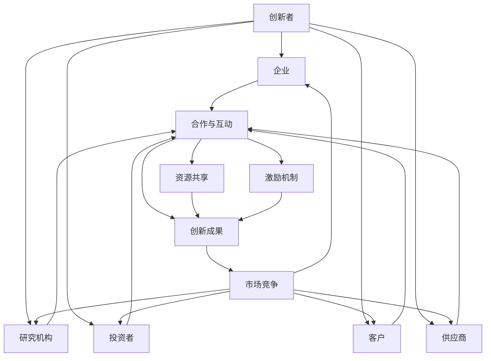

                 

### 文章标题

# 领导力与创新生态系统设计：全方位支持创新

### 文章关键词

- 领导力
- 创新生态系统
- 设计原则
- 支持策略
- 实践案例

### 文章摘要

本文深入探讨了领导力与创新生态系统设计的关系，阐述了如何通过有效的领导力策略支持创新生态系统的构建与运行。文章首先介绍了创新生态系统的概念、要素和运行机制，然后分析了领导者在创新生态系统中的角色和关键能力。通过实践案例和详细的项目实战分析，本文提供了全方位支持创新的领导力策略，旨在为企业和组织提供实际可行的创新管理和领导力培养方案。

----------------------------------------------------------------

### 1. 创新生态系统的概念与背景

创新生态系统是指由企业、研究机构、投资者、客户等多个利益相关者组成的网络系统，这些参与者通过合作、互动和资源共享，共同推动创新活动的发生与发展。创新生态系统具有以下几个核心概念：

#### 1.1 创新生态系统的定义

创新生态系统可以被视为一个有机整体，其中各个参与者相互依存、相互促进，共同推动创新过程。这个系统不仅包括传统的企业、研究机构和投资者，还包括了创业者、客户、供应商、政策制定者等多个角色。

#### 1.2 创新生态系统的要素

创新生态系统的核心要素包括：

- **企业**：作为创新的主要驱动者，企业负责将创新理念转化为实际的产品和服务。
- **研究机构**：包括大学、研究所等，负责基础研究和前沿技术的开发。
- **投资者**：为创新提供资金支持，包括风险投资、天使投资等。
- **客户**：创新成果的最终消费者，客户需求是推动创新的重要动力。
- **供应商**：为创新活动提供必要的原材料、技术支持和基础设施。

#### 1.3 创新生态系统的运行机制

创新生态系统的运行机制主要包括以下几个方面：

- **合作与互动**：各个参与者之间的紧密合作和互动是创新生态系统有效运行的基础。这种合作不仅体现在企业内部，还包括企业、研究机构、投资者和客户之间的跨组织合作。
- **资源共享**：通过资源共享，创新生态系统中的各个参与者可以最大化利用资源，提高创新效率。资源共享的形式包括知识共享、技术共享、资金共享等。
- **激励机制**：创新生态系统的激励机制包括物质激励和非物质激励，如资金奖励、荣誉表彰、知识传播等，这些激励措施能够激发参与者的创新活力。

#### 1.4 创新生态系统的价值

创新生态系统为企业和组织带来了多方面的价值：

- **提高创新效率**：通过合作与资源共享，创新生态系统可以加速创新过程，缩短产品从概念到市场的周期。
- **降低创新风险**：创新生态系统中的参与者可以共同分担创新风险，降低单个企业的风险承受能力。
- **促进知识传播**：创新生态系统为知识和技术的传播提供了平台，使得创新成果能够更快速地普及和应用。
- **增强竞争力**：通过构建创新生态系统，企业和组织可以更好地适应市场变化，提高市场竞争力。

综上所述，创新生态系统是一个复杂而动态的网络系统，它通过合作、资源共享和激励机制，支持创新活动的发生与发展。理解和构建有效的创新生态系统，对于企业和组织在激烈的市场竞争中脱颖而出至关重要。

### 2. 创新生态系统的核心概念与联系

为了深入理解创新生态系统的运作原理，我们需要明确其中的核心概念及其相互之间的联系。以下是创新生态系统的核心概念及其关系架构的Mermaid流程图。



这个流程图展示了创新生态系统中各个核心概念之间的关系：

- **创新者**：作为创新生态系统的核心，创新者包括企业、研究机构、投资者、客户和供应商。他们共同推动创新活动的发生。
- **合作与互动**：创新者之间的合作与互动是创新生态系统的基础，通过这种互动，创新者能够共享资源、知识和技术，共同应对市场竞争。
- **资源共享**：资源共享包括知识、技术、资金和基础设施，通过共享，创新者能够最大化利用资源，提高创新效率。
- **激励机制**：激励机制包括物质激励（如奖金、股权等）和非物质激励（如荣誉、认可等），这些激励措施能够激发创新者的活力和创造力。
- **创新成果**：创新成果是创新者共同努力的产物，包括新技术、新产品、新服务和新商业模式。创新成果在市场竞争中为创新者带来竞争优势。

#### 2.1 创新者

创新者包括企业、研究机构、投资者、客户和供应商。他们在创新生态系统中扮演着不同的角色：

- **企业**：作为创新的主体，企业负责将创新理念转化为实际的产品和服务。企业在创新过程中需要投入资源、技术和人力，并且承担创新风险。
- **研究机构**：包括大学、研究所等，负责基础研究和前沿技术的开发。研究机构通过不断探索新的科学和技术，为创新提供知识和技术支持。
- **投资者**：为创新提供资金支持，包括风险投资、天使投资等。投资者通过投资创新项目，分享创新成果的市场收益。
- **客户**：创新成果的最终消费者，客户需求是推动创新的重要动力。客户的需求和市场反馈对创新方向和产品改进至关重要。
- **供应商**：为创新活动提供必要的原材料、技术支持和基础设施。供应商通过提供优质的服务和资源，支持创新者的创新活动。

#### 2.2 合作与互动

合作与互动是创新生态系统的核心要素，通过这种互动，创新者能够实现资源共享、知识传播和协同创新。以下是创新者之间合作与互动的几个方面：

- **知识共享**：创新者通过会议、研讨会、合作研究等形式，共享知识和经验，促进技术进步和创新能力。
- **技术共享**：企业、研究机构和供应商之间通过技术合作、联合开发等形式，共同开发新技术、新产品和新服务。
- **资源整合**：创新者通过合作，整合各自的优势资源，如资金、技术、人才等，提高创新效率。
- **协同创新**：多个创新者共同参与一个创新项目，通过协同工作，实现创新成果的突破。

#### 2.3 资源共享

资源共享是创新生态系统的重要机制，通过资源共享，创新者可以最大化利用资源，提高创新效率。以下是几种常见的资源共享形式：

- **知识共享**：通过建立知识库、共享平台等，创新者可以方便地获取和共享知识、经验和技术。
- **技术共享**：通过技术合作、联合开发等形式，创新者可以共享技术资源，提高技术水平和创新能力。
- **资金共享**：通过众筹、风险投资等形式，创新者可以共享资金资源，支持创新项目的开展。
- **基础设施共享**：通过建立共享实验室、数据中心等形式，创新者可以共享基础设施资源，降低创新成本。

#### 2.4 激励机制

激励机制是激发创新者活力和创造力的重要手段。以下是几种常见的激励机制：

- **物质激励**：包括奖金、股权、提成等，通过物质奖励，激励创新者投入更多精力和资源进行创新。
- **非物质激励**：包括荣誉、认可、培训等，通过非物质激励，提高创新者的荣誉感和成就感。
- **激励机制设计**：创新生态系统需要设计合理的激励机制，确保激励措施的公平、透明和有效。

#### 2.5 创新成果

创新成果是创新者共同努力的产物，包括新技术、新产品、新服务和新商业模式。创新成果在市场竞争中为创新者带来竞争优势，同时也推动创新生态系统的持续发展。

- **技术进步**：通过创新，技术不断进步，为行业带来新的发展机遇。
- **产品升级**：通过创新，产品和服务不断升级，满足市场和客户的需求。
- **商业模式创新**：通过创新，新的商业模式不断涌现，为企业带来新的增长点。

#### 2.6 市场竞争

市场竞争是创新生态系统的重要驱动力，创新者通过市场竞争，不断优化创新成果，提高市场竞争力。以下是市场竞争的几个方面：

- **市场分析**：通过市场分析，了解市场需求和竞争态势，为创新提供方向和依据。
- **产品优化**：通过市场反馈，不断优化产品和服务，提高客户满意度。
- **差异化竞争**：通过技术创新和商业模式创新，实现产品差异化，提高市场竞争力。

综上所述，创新生态系统的核心概念及其相互之间的联系构成了一个复杂而动态的网络系统。通过理解这些核心概念及其关系，我们可以更好地构建和创新生态系统，支持企业和组织的创新发展。

### 3. 领导者在创新生态系统中的角色和关键能力

领导者在创新生态系统中扮演着至关重要的角色，他们不仅是创新战略的制定者，也是创新文化的塑造者，更是资源整合和协同创新的核心推动者。为了有效支持创新，领导者需要具备一系列关键能力。

#### 3.1 创新思维

创新思维是领导者必须具备的基本能力。创新思维意味着领导者需要具备开放的心态、持续的学习能力以及面对挑战的勇气。具体来说，领导者需要能够：

- **不断学习**：通过阅读、研究、参加研讨会等方式，不断学习新的知识和技术，保持对前沿领域的敏感度。
- **挑战现状**：敢于质疑现有的业务流程、产品和服务，寻找改进的机会。
- **拥抱变化**：在快速变化的市场环境中，领导者需要具备灵活应对变化的能力，勇于接受新事物。

#### 3.2 决策能力

决策能力是领导者在创新过程中不可或缺的技能。在创新生态系统中，领导者需要做出一系列关键决策，包括：

- **战略规划**：确定企业的发展方向和目标，制定长期和短期的创新战略。
- **资源分配**：合理分配资金、人力和技术资源，确保创新项目得到充分的资源支持。
- **风险管理**：评估创新项目的风险，制定相应的风险控制措施。

以下是创新决策能力的一个伪代码示例：

```python
def make_innovation_decision(project, budget, risk_level):
    if risk_level < 0.3:
        # 低风险项目，可以大胆投资
        allocate_resource(project, budget)
    elif risk_level >= 0.3 and risk_level < 0.6:
        # 中等风险项目，需要谨慎投资
        perform_feasibility_study(project)
        if feasibility_study_result:
            allocate_resource(project, budget * 0.8)
        else:
            decline_project(project)
    else:
        # 高风险项目，需慎重考虑
        decline_project(project)
```

#### 3.3 资源整合能力

资源整合能力是领导者的重要能力之一，特别是在创新生态系统中，领导者需要能够整合内外部资源，为创新项目提供支持。以下是资源整合能力的几个方面：

- **内部资源整合**：领导者需要协调企业内部各部门，确保创新项目能够获得所需的人力、资金和技术支持。
- **外部资源整合**：领导者需要建立广泛的合作关系网络，包括与其他企业、研究机构、投资者等合作，共同推进创新项目。
- **知识整合**：通过建立知识库、共享平台等，领导者可以整合企业内外部的知识和经验，提高创新效率。

以下是资源整合能力的伪代码示例：

```python
def integrate_resources(project, internal_resources, external_resources):
    required_resources = determine_required_resources(project)
    if internal_resources >= required_resources:
        allocate_internal_resources(project, internal_resources)
    else:
        seek_external_resources(project, external_resources)
    if external_resources:
        merge_resources(internal_resources, external_resources)
        allocate_merger_resources(project, required_resources)
```

#### 3.4 创新文化塑造

创新文化是创新生态系统的重要支柱，领导者需要通过塑造创新文化，激发员工的创新活力和创造力。以下是创新文化塑造的几个方面：

- **鼓励尝试**：领导者需要鼓励员工勇于尝试新想法，即使失败也不惩罚，从而创造一个宽松的创新环境。
- **共享知识**：领导者需要推动员工之间的知识共享，建立开放透明的沟通机制，确保创新思想能够得到有效传播和应用。
- **认可与奖励**：领导者需要通过认可和奖励机制，激励员工积极参与创新活动，提高创新成果的质量和数量。

以下是创新文化塑造的伪代码示例：

```python
def shape_innovation_culture(employees):
    for employee in employees:
        if employee.has_new_idea():
            recognize_idea(employee)
            reward_employee(employee)
        if employee.shares_knowledge():
            appreciate_employee(employee)
```

综上所述，领导者在创新生态系统中的角色和关键能力包括创新思维、决策能力、资源整合能力和创新文化塑造。通过具备这些能力，领导者可以有效地支持创新生态系统的构建与运行，推动企业和组织的创新发展。

### 4. 支持创新的领导力策略

为了在创新生态系统中有效推动创新，领导者需要制定并实施一系列支持创新的领导力策略。这些策略包括创新战略的制定与执行、创新文化的塑造与维护、以及领导者在创新过程中的具体行为和措施。以下是详细的领导力策略分析。

#### 4.1 创新战略的制定与执行

创新战略是领导者推动创新的核心工具，它为企业提供了明确的方向和行动指南。以下是制定和执行创新战略的几个关键步骤：

1. **明确创新目标**：领导者需要明确企业的创新目标，包括短期目标和长期目标。短期目标通常聚焦于产品或服务的改进，而长期目标则可能涉及新技术、新市场的开发。
    ```latex
    \text{define_innovation_objectives()}: \\
    \text{short_term_objectives} = \text{"improve product A by 20% within 12 months"}; \\
    \text{long_term_objectives} = \text{"develop new technology for market B by 2025"}; \\
    ```

2. **资源分配**：领导者需要根据创新目标，合理分配资源，确保创新项目得到充足的资金、人力和技术支持。
    ```python
    def allocate_resources(innovation_projects, budget):
        for project in innovation_projects:
            if project.is_essential():
                allocate_project_funds(project, budget * 0.3)
            else:
                allocate_project_funds(project, budget * 0.1)
    ```

3. **风险管理**：创新过程中不可避免地会面临风险，领导者需要评估创新项目的风险水平，并制定相应的风险管理策略。
    ```python
    def assess_risk(innovation_project):
        risk_level = calculate_risk(innovation_project)
        if risk_level > 0.5:
            implement_risk_mitigation_measures(innovation_project)
    ```

4. **执行监控**：领导者需要建立创新项目的监控机制，确保项目按计划进行，并在必要时进行调整。
    ```python
    def monitor_innovation_project(innovation_project):
        while not innovation_project.is_completed():
            project_status = check_project_progress(innovation_project)
            if project_status != "on_track":
                adjust_project_plan(innovation_project)
    ```

5. **评估与反馈**：创新战略的执行需要定期评估和反馈，领导者需要根据项目成果和反馈，调整创新策略。
    ```python
    def evaluate_innovation_results(innovation_projects):
        for project in innovation_projects:
            if project.has_successfully_completed():
                recognize_project_success(project)
            else:
                analyze_project_failure(project)
    ```

#### 4.2 创新文化的塑造与维护

创新文化是推动持续创新的重要动力，领导者需要通过一系列措施塑造和维护创新文化。以下是几个关键策略：

1. **鼓励尝试与失败**：领导者需要鼓励员工勇于尝试新想法，即使失败也不惩罚，从而创造一个宽松的创新环境。
    ```python
    def encourage尝试：
        for employee in employees:
            if employee.has_failed():
                provide_support(employee)
                reward(employee, "for bravery in trying new ideas")
    ```

2. **知识共享**：领导者需要推动员工之间的知识共享，建立开放透明的沟通机制，确保创新思想能够得到有效传播和应用。
    ```python
    def promote_knowledge_sharing():
        for employee in employees:
            if employee.has_new_idea():
                share_idea(employee)
    ```

3. **认可与奖励**：领导者需要通过认可和奖励机制，激励员工积极参与创新活动，提高创新成果的质量和数量。
    ```python
    def recognize_and_reward():
        for employee in employees:
            if employee.has_successful_innovation():
                reward_employee(employee, "for outstanding innovation")
    ```

4. **领导示范**：领导者需要通过自己的行为树立榜样，展示对创新的重视和鼓励，从而激发员工的创新热情。
    ```python
    def lead_by_example():
        leader.share_new_idea()
        leader.take_risks()
    ```

5. **培训与发展**：领导者需要为员工提供创新相关的培训和发展机会，提高员工的能力和创新能力。
    ```python
    def provide_training():
        for employee in employees:
            if employee.needs_innovation_skills():
                offer_innovation_training(employee)
    ```

#### 4.3 领导者在创新过程中的行为与措施

在创新过程中，领导者需要通过一系列具体的行为和措施，确保创新活动的顺利进行。以下是几个关键方面：

1. **沟通与协调**：领导者需要与团队保持密切的沟通，确保项目进展和信息透明，及时解决项目中的问题和冲突。
    ```python
    def communicate_and Coordinate():
        for team in teams:
            hold_regular_meetings(team)
            address_issues(team)
    ```

2. **支持员工**：领导者需要为员工提供必要的支持和资源，帮助他们克服创新过程中的困难和挑战。
    ```python
    def support_employees():
        for employee in employees:
            provide_resources(employee)
            offer_help(employee)
    ```

3. **激励团队**：领导者需要通过激励措施，提高团队的士气和创新能力，确保团队成员积极参与创新活动。
    ```python
    def motivate_team():
        for team in teams:
            reward_team(team)
            celebrate_successes(team)
    ```

4. **持续改进**：领导者需要推动创新过程的持续改进，通过反馈和评估，不断优化创新策略和方法。
    ```python
    def continuous_improvement():
        gather_feedback()
        analyze_performance()
        implement_improvements()
    ```

通过制定和实施这些支持创新的领导力策略，领导者可以有效地推动创新生态系统的建设，提高企业的创新能力和市场竞争力。

### 5. 创新生态系统的成功与失败案例分析

为了更好地理解创新生态系统在实际应用中的效果，我们可以通过分析成功和失败的案例，提取关键经验和教训。

#### 5.1 成功案例分析

**案例一：苹果公司的创新生态系统**

苹果公司作为全球创新领导者，其成功离不开强大的创新生态系统。以下是苹果公司创新生态系统的成功要素：

1. **开放式创新与合作**：苹果公司通过收购和合作，不断引进新技术和人才。例如，收购了多家科技公司，如NeXT、SUN、Adobe等，这些收购为公司带来了先进的技术和人才资源。

2. **持续投资研发**：苹果公司在研发上持续大量投入，以保持技术领先。2019年，苹果公司的研发投入超过600亿美元。

3. **用户反馈与迭代**：苹果公司重视用户反馈，通过用户调研和数据分析，不断优化产品和服务。例如，iPhone的升级过程中，用户反馈对产品的改进起到了关键作用。

4. **创新文化**：苹果公司营造了鼓励创新的企业文化，员工可以自由表达自己的想法，并通过内部竞赛等方式激励创新。

**成功经验**：

- **开放式创新与合作**：通过开放式创新，企业可以快速获取外部技术和资源，提升自身创新能力。
- **持续投资研发**：研发投入是持续创新的重要保障，只有不断投入，企业才能保持技术领先。
- **用户反馈与迭代**：用户反馈是产品改进的重要依据，及时响应用户需求，可以提升产品竞争力。
- **创新文化**：鼓励创新和容忍失败的企业文化，可以激发员工的创造力和主动性。

#### 5.2 失败案例分析

**案例二：诺基亚的衰落**

诺基亚曾是手机市场的领导者，但在面对智能手机时代的变革时，未能及时调整战略，最终导致衰落。以下是诺基亚失败的原因：

1. **创新不足**：诺基亚在智能手机市场推出新产品速度慢，且产品创新不足，难以满足用户需求。

2. **封闭式创新**：诺基亚在技术创新上过于保守，未能充分利用外部技术和资源，限制了创新能力。

3. **忽视用户反馈**：诺基亚在产品设计和推广过程中，未能充分听取用户意见，导致产品与市场需求脱节。

4. **缺乏创新文化**：诺基亚内部创新氛围不浓，员工缺乏创新动力，导致创新能力下降。

**失败教训**：

- **创新不足**：市场环境变化迅速，企业必须保持高水平的创新，否则容易失去竞争力。
- **封闭式创新**：开放式创新可以带来更多的技术突破，封闭式创新容易导致创新能力不足。
- **忽视用户反馈**：用户需求是产品创新的重要驱动力，忽视用户反馈会导致产品与市场需求脱节。
- **缺乏创新文化**：创新文化是推动持续创新的重要保障，缺乏创新文化会导致员工创新动力不足。

#### 5.3 案例总结与启示

通过以上成功和失败案例的分析，我们可以得出以下启示：

1. **开放式创新与合作**：企业应采取开放式创新策略，充分利用外部技术和资源，提升创新能力。
2. **持续投资研发**：研发投入是持续创新的基础，企业必须保持高水平的研发投入。
3. **用户反馈与迭代**：重视用户反馈，及时调整产品和服务，以满足用户需求。
4. **创新文化**：培养创新文化，鼓励员工创新，提供支持和奖励，激发员工创新潜力。

通过这些经验教训，企业可以更好地构建和创新生态系统，支持持续创新。

### 6. 创新生态系统的未来发展趋势与挑战

随着技术的不断进步和市场环境的变迁，创新生态系统正面临一系列新的发展趋势和挑战。以下是几个关键方面的探讨。

#### 6.1 数字化转型

数字化转型已成为创新生态系统的重要组成部分。企业通过数字化转型，可以提高运营效率、优化业务流程，并加速创新。以下是数字化转型在创新生态系统中的应用：

- **数据驱动的决策**：企业通过收集和分析大量数据，可以更准确地了解市场需求和用户行为，从而做出更科学的决策。
- **智能化的创新工具**：人工智能、机器学习等技术的应用，可以辅助企业进行创新，如自动化设计、智能优化等。
- **数字孪生技术**：通过数字孪生技术，企业可以在虚拟环境中模拟产品设计和测试，加速产品开发周期。

#### 6.2 网络安全与隐私保护

随着数字化程度的提高，网络安全和隐私保护问题日益突出。在创新生态系统中，网络安全威胁可能对创新成果和企业的竞争力产生重大影响。以下是网络安全和隐私保护的几个关键方面：

- **安全防护体系**：企业需要建立完善的网络安全防护体系，包括防火墙、加密技术、入侵检测等。
- **数据隐私保护**：企业需要遵守相关法律法规，保护用户数据的隐私和安全，如GDPR（通用数据保护条例）。
- **安全教育与培训**：企业应加强员工的安全教育和培训，提高员工的安全意识和应对能力。

#### 6.3 可持续发展

可持续发展已成为全球企业面临的共同挑战。在创新生态系统中，企业需要将可持续发展理念融入产品设计和业务运营中。以下是可持续发展在创新生态系统中的应用：

- **绿色技术**：企业应积极研发和应用绿色技术，减少产品对环境的影响，如节能减排、循环利用等。
- **社会责任**：企业需要承担社会责任，积极参与公益事业，推动社会可持续发展。
- **可持续发展战略**：企业应制定可持续发展战略，确保业务发展与环境保护的协调统一。

#### 6.4 新兴技术与创新生态系统的融合

随着5G、物联网、区块链等新兴技术的不断发展，创新生态系统将面临新的机遇和挑战。以下是这些技术在创新生态系统中的应用：

- **5G技术**：5G技术将为创新生态系统带来更快的网络速度和更低的延迟，促进实时创新和远程协作。
- **物联网**：物联网技术将实现设备之间的互联互通，为创新生态系统中的各个环节提供更多的数据和信息。
- **区块链**：区块链技术将提高数据的安全性和透明度，促进创新成果的共享和合作。

#### 6.5 挑战与应对策略

面对未来发展趋势，创新生态系统也面临一系列挑战，如技术快速变革、竞争加剧、资源短缺等。以下是几个应对策略：

- **持续学习与适应**：企业应保持对新技术和新趋势的敏感性，持续学习和适应，以应对快速变化的市场环境。
- **开放合作**：通过开放合作，企业可以借助外部资源和能力，共同应对挑战，实现共赢。
- **创新文化的培养**：企业应培养创新文化，鼓励员工勇于创新，为应对挑战提供动力和保障。

总之，创新生态系统在未来的发展中，需要不断适应新技术和市场变化，同时应对各种挑战，以实现持续创新和可持续发展。

### 7. 总结与展望

在《领导力与创新生态系统设计：全方位支持创新》的探讨中，我们深入分析了创新生态系统的概念、核心要素、运行机制，以及领导者在创新生态系统中的角色和关键能力。通过成功与失败案例分析，我们总结了创新生态系统的关键经验和教训，并探讨了未来发展趋势与挑战。

**总结**：

- 创新生态系统是推动企业持续创新的重要平台，通过合作、资源共享和激励机制，实现创新成果的最大化。
- 领导者在创新生态系统中的角色至关重要，他们需要具备创新思维、决策能力、资源整合能力和创新文化塑造能力。
- 成功的创新生态系统依赖于开放合作、持续学习和灵活适应，而失败的教训提醒我们重视创新不足、封闭式创新和忽视用户反馈。

**展望**：

- 未来，数字化转型、网络安全、可持续发展、新兴技术与创新生态系统的融合将成为重要趋势。
- 企业应保持对新技术和市场变化的敏感性，通过开放合作和持续创新，应对挑战，实现可持续发展。

**对读者的建议**：

- **培养创新思维**：不断学习新技术、新知识，保持对创新的关注和思考。
- **强化领导力**：提升决策能力、资源整合能力和创新文化塑造能力，为创新生态系统的构建与运行提供有力支持。
- **重视用户反馈**：关注市场需求和用户需求，以用户为中心，推动产品和服务创新。

通过本文的探讨，我们希望为读者提供有价值的见解和实用的指导，助力企业和组织在创新生态系统中取得成功。作者：AI天才研究院/AI Genius Institute & 禅与计算机程序设计艺术 /Zen And The Art of Computer Programming。

