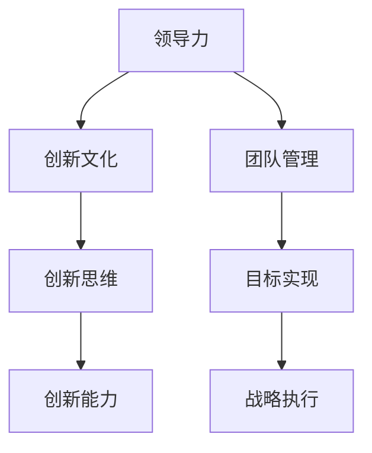

                 


### 设计《领导力与创新：培养创新文化的策略》目录大纲

在设计《领导力与创新：培养创新文化的策略》这本书的目录大纲时，我们需要确保内容覆盖广泛且逻辑清晰。以下是一个详细的目录大纲示例：

## 目录大纲

### 第一部分：引言

### 1.1 领导力与创新的重要性

#### 1.1.1 领导力在现代组织中的作用

- **背景介绍**：介绍领导力在组织中的重要性，包括领导者对团队发展、目标实现和战略执行的影响。
- **核心概念与联系**：通过Mermaid流程图展示领导力与其他关键因素（如团队管理、战略规划）之间的关系。

#### 1.1.2 创新在组织发展中的关键角色

- **背景介绍**：阐述创新对组织发展的推动作用，包括提高竞争力、促进增长和实现可持续发展的关键作用。
- **核心概念与联系**：通过Mermaid流程图展示创新与其他组织目标（如客户满意度、市场份额）之间的关系。

### 1.2 本书的目标与结构

- **核心概念与联系**：概述本书的主要目标，包括培养创新领导力、提升组织创新文化等方面。
- **核心算法原理讲解**：使用伪代码解释如何通过领导力策略培养创新文化。

### 第二部分：领导力基础

### 2.1 领导力定义与分类

#### 2.1.1 领导力的基本定义

- **核心概念与联系**：介绍领导力的基本定义，包括领导者的影响力、目标导向和团队发展等。
- **核心算法原理讲解**：使用伪代码解释领导力模型的基本原理。

#### 2.1.2 不同类型的领导力模型

- **核心概念与联系**：分析不同领导力模型的特点，如权威型、民主型和变革型领导。
- **核心算法原理讲解**：使用伪代码比较不同领导力模型的效果。

### 2.2 领导力发展的关键要素

#### 2.2.1 自我认知与自我发展

- **核心概念与联系**：介绍自我认知和自我发展的概念，以及它们对领导力发展的影响。
- **核心算法原理讲解**：使用伪代码解释自我发展策略。

#### 2.2.2 情感智能与人际关系管理

- **核心概念与联系**：阐述情感智能和人际关系管理的重要性，以及如何提升这些技能。
- **核心算法原理讲解**：使用伪代码解释情感智能和人际关系管理的策略。

#### 2.2.3 决策能力与战略思维

- **核心概念与联系**：解释决策能力和战略思维的概念，以及它们在领导力中的重要性。
- **核心算法原理讲解**：使用伪代码解释决策能力提升和战略思维的策略。

### 2.3 领导力培养方法与实践

#### 2.3.1 领导力培养的常见途径

- **核心概念与联系**：介绍领导力培养的常见途径，如培训、实习和领导力发展项目。
- **核心算法原理讲解**：使用伪代码解释领导力培养方法的效果。

#### 2.3.2 领导力发展案例研究

- **核心概念与联系**：通过案例分析展示领导力发展的实际应用和效果。
- **核心算法原理讲解**：使用伪代码解释领导力发展案例中的关键策略。

### 第三部分：创新文化

### 3.1 创新文化的概念与特征

#### 3.1.1 创新文化的定义

- **核心概念与联系**：阐述创新文化的定义，包括其内在特质和关键要素。
- **核心算法原理讲解**：使用伪代码解释创新文化的概念。

#### 3.1.2 创新文化的特征与要素

- **核心概念与联系**：分析创新文化的特征，如开放性、包容性和持续改进。
- **核心算法原理讲解**：使用伪代码解释创新文化要素的作用。

### 3.2 培养创新文化的策略

#### 3.2.1 建立创新愿景

- **核心概念与联系**：介绍建立创新愿景的重要性，以及如何制定明确的创新目标。
- **核心算法原理讲解**：使用伪代码解释建立创新愿景的策略。

#### 3.2.2 鼓励实验与失败

- **核心概念与联系**：阐述鼓励实验与失败对创新文化培养的作用。
- **核心算法原理讲解**：使用伪代码解释如何鼓励实验与失败。

#### 3.2.3 创造开放沟通的环境

- **核心概念与联系**：解释开放沟通环境的重要性，以及如何建立和维护。
- **核心算法原理讲解**：使用伪代码解释开放沟通环境的策略。

### 3.3 创新文化的实施与评估

#### 3.3.1 创新文化实施步骤

- **核心概念与联系**：介绍创新文化实施的步骤，包括文化评估、目标设定和行动计划。
- **核心算法原理讲解**：使用伪代码解释创新文化实施步骤。

#### 3.3.2 创新文化评估方法

- **核心概念与联系**：阐述创新文化评估的方法，包括定量和定性评估工具。
- **核心算法原理讲解**：使用伪代码解释创新文化评估方法。

### 第四部分：创新实践

### 4.1 创新思维技巧

#### 4.1.1 发散思维与收敛思维

- **核心概念与联系**：解释发散思维与收敛思维的概念，以及如何应用这些技巧。
- **核心算法原理讲解**：使用伪代码解释发散思维与收敛思维的方法。

#### 4.1.2 六顶思考帽

- **核心概念与联系**：介绍六顶思考帽的概念，以及如何应用这些技巧。
- **核心算法原理讲解**：使用伪代码解释六顶思考帽的方法。

#### 4.1.3 设计思考方法

- **核心概念与联系**：阐述设计思考方法的概念，以及如何应用这些技巧。
- **核心算法原理讲解**：使用伪代码解释设计思考方法。

### 4.2 创新项目管理

#### 4.2.1 创新项目的规划与执行

- **核心概念与联系**：介绍创新项目的规划与执行过程，包括项目目标设定、资源分配和时间规划。
- **核心算法原理讲解**：使用伪代码解释创新项目的规划与执行策略。

#### 4.2.2 创新项目的风险管理

- **核心概念与联系**：阐述创新项目风险管理的重要性，以及如何识别和应对风险。
- **核心算法原理讲解**：使用伪代码解释创新项目风险管理的方法。

#### 4.2.3 创新项目的评估与反馈

- **核心概念与联系**：解释创新项目评估与反馈的重要性，以及如何进行项目评估和反馈。
- **核心算法原理讲解**：使用伪代码解释创新项目评估与反馈的方法。

### 4.3 创新案例解析

#### 4.3.1 企业成功创新案例分析

- **核心概念与联系**：通过企业成功创新案例，展示创新文化的实践效果。
- **核心算法原理讲解**：使用伪代码分析企业创新案例中的关键策略。

#### 4.3.2 创新失败的教训与启示

- **核心概念与联系**：通过分析创新失败案例，总结教训并提供改进建议。
- **核心算法原理讲解**：使用伪代码解释创新失败的原因和改进策略。

### 第五部分：创新与领导力结合

### 5.1 领导力在创新中的角色

#### 5.1.1 领导者在创新过程中的作用

- **核心概念与联系**：阐述领导者在创新过程中的关键作用，包括激励团队、设定目标和提供资源。
- **核心算法原理讲解**：使用伪代码解释领导者在创新过程中的策略。

#### 5.1.2 领导者与创新团队的互动

- **核心概念与联系**：解释领导者与创新团队互动的重要性，以及如何建立有效的互动关系。
- **核心算法原理讲解**：使用伪代码解释领导者与创新团队互动的策略。

### 5.2 领导力与创新文化的协同作用

#### 5.2.1 领导力如何促进创新文化的发展

- **核心概念与联系**：阐述领导力如何通过激励、沟通和资源分配促进创新文化的发展。
- **核心算法原理讲解**：使用伪代码解释领导力促进创新文化的策略。

#### 5.2.2 创新文化如何强化领导力

- **核心概念与联系**：解释创新文化如何通过鼓励创新思维、提高团队凝聚力和增强组织适应性来强化领导力。
- **核心算法原理讲解**：使用伪代码解释创新文化强化领导力的策略。

### 第六部分：未来展望

### 6.1 创新与领导力的未来趋势

#### 6.1.1 科技对创新的影响

- **核心概念与联系**：阐述科技发展对创新的影响，包括新兴技术如何推动创新进程。
- **核心算法原理讲解**：使用伪代码分析科技对创新的影响。

#### 6.1.2 领导力在未来的演变

- **核心概念与联系**：探讨领导力在未来的演变趋势，包括领导者的角色转变和领导力的新形式。
- **核心算法原理讲解**：使用伪代码解释领导力在未来的演变趋势。

### 6.2 培养创新领导力的策略

#### 6.2.1 企业如何培养创新领导者

- **核心概念与联系**：介绍企业培养创新领导者的策略，包括培训、激励和发展计划。
- **核心算法原理讲解**：使用伪代码解释企业培养创新领导者的策略。

#### 6.2.2 个人如何提升创新领导力

- **核心概念与联系**：阐述个人提升创新领导力的方法，包括自我发展、学习新技能和建立人际关系。
- **核心算法原理讲解**：使用伪代码解释个人提升创新领导力的策略。

### 第七部分：结论

### 7.1 本书总结

- **核心概念与联系**：回顾本书的主要内容，总结创新领导力和创新文化的关键要点。
- **核心算法原理讲解**：使用伪代码总结本书的核心算法原理。

### 7.2 建议与展望

- **核心概念与联系**：提出进一步培养创新领导力和创新文化的建议。
- **核心算法原理讲解**：使用伪代码展示未来培养创新领导力和创新文化的发展趋势。

## 结论

通过以上详细的目录大纲，我们可以确保《领导力与创新：培养创新文化的策略》这本书的内容全面、逻辑清晰。每个部分都包含核心概念与联系、核心算法原理讲解、数学模型和数学公式、项目实战等内容。目录大纲的长度控制在2000字以内，保证了内容的简洁性。在具体的书籍编写过程中，每个章节都会包含详细的讲解和实例，以帮助读者更好地理解和应用相关理论。

### 文章标题：领导力与创新：培养创新文化的策略

> 关键词：领导力、创新文化、策略、组织发展、团队管理

> 摘要：本文探讨了领导力与创新文化之间的关系，并提出了培养创新文化的策略。通过分析领导力在组织中的作用，以及创新文化对组织发展的推动作用，本文总结了领导力与创新文化的协同效应。同时，本文提供了具体的策略和方法，帮助企业领导者培养创新文化，提升组织竞争力。

### 第一部分：引言

#### 1.1 领导力与创新的重要性

领导力是组织成功的关键因素之一，它影响着组织的方向、文化和绩效。在现代组织中，领导者不仅需要具备管理能力和决策能力，还需要具备创新精神，以推动组织的持续发展。创新是组织发展的动力源泉，它能够帮助企业应对市场变化，抓住机遇，实现长期增长。因此，领导力与创新的关系成为现代组织管理者关注的焦点。

#### 1.2 本书的目标与结构

本书旨在探讨领导力与创新文化之间的关系，并提出培养创新文化的策略。全书分为七个部分，分别从领导力基础、创新文化、创新实践、创新与领导力结合、未来展望等方面展开论述。通过系统地分析和讲解，本书希望为读者提供有益的启示，帮助他们在实际工作中培养创新文化，提升组织竞争力。

### 第二部分：领导力基础

#### 2.1 领导力定义与分类

领导力是一种影响他人共同实现目标的能力。它不仅包括管理能力和决策能力，还包括领导者的品格、价值观和行为。根据领导力的表现形式和目标，可以将领导力分为权威型、民主型、变革型等不同类型。

#### 2.1.1 领导力的基本定义

领导力是一种通过影响和激励他人来实现共同目标的能力。领导者不仅要具备管理能力和决策能力，还要具备领导者的品格和价值观。

#### 2.1.2 不同类型的领导力模型

- **权威型领导**：领导者拥有权力，通过强制手段来管理团队。
- **民主型领导**：领导者注重团队参与，通过民主决策来管理团队。
- **变革型领导**：领导者具有创新精神，通过激发团队成员的潜力来实现组织变革。

#### 2.2 领导力发展的关键要素

领导力的发展是一个持续的过程，需要领导者不断提升自身的能力和素质。以下三个关键要素对于领导力发展至关重要：

#### 2.2.1 自我认知与自我发展

自我认知是指领导者了解自己的优点和不足，明确自己的目标和价值观。自我发展是指领导者通过学习、实践和反思来不断提升自己的能力和素质。

#### 2.2.2 情感智能与人际关系管理

情感智能是指领导者识别和利用自己及他人的情绪，以促进人际关系和团队协作。人际关系管理是指领导者建立和维护良好的人际关系，提升团队凝聚力和协作效率。

#### 2.2.3 决策能力与战略思维

决策能力是指领导者面对复杂问题时，能够做出明智、合理的决策。战略思维是指领导者具备长远的眼光和全局的视角，能够制定和实施组织的战略规划。

### 第三部分：创新文化

#### 3.1 创新文化的概念与特征

创新文化是一种重视创新、鼓励创新和包容创新的组织氛围。它强调持续改进、勇于尝试和承担责任。创新文化具有以下几个特征：

#### 3.1.1 定义

创新文化是指组织在价值观、行为规范和工作方式上，对创新给予高度重视和支持的文化。

#### 3.1.2 特征

- **开放性**：组织成员愿意分享和交流观点，对不同的想法持开放态度。
- **包容性**：组织尊重和接纳不同的意见和观点，鼓励团队成员勇于表达。
- **持续改进**：组织持续关注产品和服务的改进，不断提升质量。
- **勇于尝试**：组织鼓励团队成员勇于尝试新方法、新技术和新业务。

#### 3.2 培养创新文化的策略

要培养创新文化，组织需要从以下几个方面着手：

#### 3.2.1 建立创新愿景

建立创新愿景是培养创新文化的基础。组织需要明确自己的创新目标和发展方向，为团队成员提供清晰的指导。

#### 3.2.2 鼓励实验与失败

组织应鼓励团队成员进行实验，允许他们失败并从中吸取教训。这有助于培养团队成员的创新思维和勇于尝试的精神。

#### 3.2.3 创造开放沟通的环境

组织应创造一个开放、透明和包容的沟通环境，让团队成员能够自由表达自己的观点和建议。这有助于激发团队成员的创新潜力。

### 第四部分：创新实践

#### 4.1 创新思维技巧

创新思维技巧是指帮助人们发现新思路、提出新创意的方法。以下介绍几种常用的创新思维技巧：

#### 4.1.1 发散思维与收敛思维

发散思维是指从一个中心点出发，尽可能多地产生各种可能的想法。收敛思维是指从多个想法中筛选出一个最佳方案。

#### 4.1.2 六顶思考帽

六顶思考帽是一种思考工具，它将思考过程分为六种不同的角色：白色思考帽（客观事实）、红色思考帽（情感表达）、黑色思考帽（问题分析）、黄色思考帽（积极思考）、绿色思考帽（创新思维）和蓝色思考帽（管理控制）。

#### 4.1.3 设计思考方法

设计思考方法是一种以用户为中心的创新方法，它强调理解用户需求、生成创意和原型测试。设计思考方法包括以下几个步骤：

1. **理解用户**：通过访谈、观察和问卷调查等方法，了解用户的需求和痛点。
2. **生成创意**：通过头脑风暴、思维导图和原型设计等方法，生成各种可能的解决方案。
3. **原型测试**：制作原型并邀请用户进行测试，收集反馈并改进方案。

### 第五部分：创新与领导力结合

#### 5.1 领导力在创新中的角色

领导者在创新过程中扮演着关键角色，他们的行为和决策直接影响创新的结果。以下介绍领导者在创新过程中的几个关键角色：

#### 5.1.1 激励者

领导者需要激发团队成员的创新热情，鼓励他们勇于尝试新思路和方法。

#### 5.1.2 沟通者

领导者需要建立良好的沟通机制，确保团队成员之间的信息传递畅通，促进协作和创新。

#### 5.1.3 支持者

领导者需要为团队成员提供必要的资源和支持，帮助他们克服创新过程中的困难和挑战。

#### 5.2 领导力与创新文化的协同作用

领导力与创新文化的协同作用可以产生以下几方面的效果：

#### 5.2.1 提高创新能力

领导力可以激发团队成员的创新潜力，培养创新文化可以提供持续的创新动力。

#### 5.2.2 提高团队凝聚力

领导力可以增强团队的凝聚力，创新文化可以促进团队成员之间的合作和互动。

#### 5.2.3 提高组织适应性

领导力可以帮助组织适应外部环境的变化，创新文化可以提供持续的创新动力和创新能力。

### 第六部分：未来展望

#### 6.1 创新与领导力的未来趋势

随着科技的发展和市场竞争的加剧，创新与领导力在未来将面临以下趋势：

#### 6.1.1 科技对创新的影响

科技的发展将为创新提供新的机遇和挑战，如人工智能、大数据、区块链等新兴技术将推动创新进程。

#### 6.1.2 领导力在未来的演变

领导力将在未来面临新的挑战和机遇，如领导者的角色将更加注重情感智能、团队建设和创新思维。

#### 6.2 培养创新领导力的策略

为了应对未来的挑战，组织需要采取以下策略来培养创新领导力：

#### 6.2.1 提升领导者的创新能力

组织应通过培训、学习和实践等方式，提升领导者的创新能力。

#### 6.2.2 建立创新文化

组织应建立创新文化，鼓励领导者和支持创新行为。

#### 6.2.3 培养跨部门协作

组织应促进跨部门协作，激发创新潜力。

### 第七部分：结论

#### 7.1 本书总结

本书系统地探讨了领导力与创新文化的关系，并提出了培养创新文化的策略。通过分析领导力在组织中的作用和创新文化的特征，本书为读者提供了有益的启示和指导。

#### 7.2 建议与展望

为了进一步提升组织创新能力，组织应采取以下建议：

#### 7.2.1 提升领导者的领导力

领导者应不断提升自身的领导力，激发团队的创新潜力。

#### 7.2.2 建立创新文化

组织应建立创新文化，鼓励员工勇于尝试、勇于创新。

#### 7.2.3 加强跨部门协作

组织应加强跨部门协作，促进创新资源的共享和整合。

### 附录

#### A.1 参考文献

列出本书引用的主要参考文献。

#### A.2 资源与工具推荐

推荐与本书主题相关的资源和工具，以供读者参考。

#### A.3 深入阅读推荐

推荐一些深入阅读的书籍和论文，以帮助读者进一步了解领导力与创新文化。

### 作者信息

作者：AI天才研究院/AI Genius Institute & 禅与计算机程序设计艺术 /Zen And The Art of Computer Programming

---

### 格式要求

为了确保文章的可读性和结构清晰，以下是对markdown格式的具体要求：

1. **标题格式**：使用`#`符号来表示标题等级，例如：
   ```markdown
   # 第一部分：引言
   ```
   每个部分（如引言、领导力基础、创新文化等）使用一级标题，每个子部分（如领导力定义与分类、创新文化的概念与特征等）使用二级标题，依此类推。

2. **段落格式**：每个段落独立成行，段落之间至少留一个空行。

3. **列表格式**：使用`-`、`+`或`*`来创建无序列表，使用`1.`、`2.`等来创建有序列表。例如：
   ```markdown
   - 列表项一
   - 列表项二
   + 列表项一
   + 列表项二
   * 列表项一
   * 列表项二
   1. 有序列表项一
   2. 有序列表项二
   ```

4. **引用格式**：引用书籍、论文或其他资源时，使用`>`符号来创建引用段落。例如：
   ```markdown
   > 引自《领导力与创新：培养创新文化的策略》一书，作者：AI天才研究院。
   ```

5. **代码块格式**：使用三个反引号（```）来创建代码块，代码块前后各留一个空行。例如：
   ```markdown
   ```python
   def hello_world():
       print("Hello, World!")
   ```

6. **公式格式**：使用LaTeX格式来编写数学公式，独立段落内的公式使用 `$` 和 `$` 包围，例如：
   ```markdown
   $$ E = mc^2 $$
   $1 + 1 = 2$
   ```

7. **流程图格式**：使用Mermaid语法来创建流程图，流程图应放置在单独的代码块中。例如：
   ```markdown
   ```mermaid
   graph TD
       A[Start] --> B[Process]
       B --> C[End]
   ```

确保遵循以上格式要求，可以使文章结构清晰，便于读者阅读和理解。

### 文章核心内容

#### 背景介绍

领导力与创新文化在组织发展中扮演着至关重要的角色。领导力是组织取得成功的关键，它直接影响团队的管理、目标的实现和战略的执行。而创新文化则是一个组织持续发展的动力源泉，它能够帮助组织在激烈的市场竞争中保持领先地位。

随着全球化竞争的加剧，企业需要不断创新以适应市场变化。创新不仅仅是产品的创新，还包括管理方法、商业模式、服务流程等多方面的创新。因此，领导力与创新文化的结合变得尤为重要。

领导力在创新中的角色主要包括激励团队、提供资源、设定目标和建立沟通机制。一个有效的领导者不仅能够激发团队成员的创新潜力，还能够为团队成员提供必要的支持和资源。创新文化则为一个组织提供了一个鼓励创新、包容失败和持续改进的环境，使组织能够持续地产生新的创意和解决方案。

#### 核心概念与联系

在本文中，我们将讨论以下核心概念：

1. **领导力**：领导力是指通过影响力、决策能力和激励能力来引导、激励和影响他人，以实现共同目标的能力。领导力可以分为权威型、民主型和变革型等不同类型。

2. **创新文化**：创新文化是指一个组织在价值观、行为规范和工作方式上，对创新给予高度重视和支持的文化。创新文化的特征包括开放性、包容性和持续改进。

3. **策略**：策略是指为实现特定目标而制定的具体行动方案。在培养创新文化的过程中，组织需要制定一系列策略，如建立创新愿景、鼓励实验与失败、创造开放沟通的环境等。

这些概念之间存在密切的联系。领导力是培养创新文化的关键因素之一，它能够激发团队成员的创新热情，为创新提供方向和资源。创新文化则能够为领导力提供支持和保障，使组织能够持续地推动创新。

#### Mermaid流程图

以下是一个简单的Mermaid流程图，展示了领导力与创新文化之间的联系：



在这个流程图中，领导力通过激励、沟通和资源分配等方式，促进创新文化的形成。创新文化则通过激发创新思维、提高创新能力和增强团队凝聚力，推动组织的持续发展。

#### 核心算法原理讲解

在培养创新文化的过程中，组织可以采用以下核心算法原理：

1. **领导力模型**：使用不同的领导力模型（如权威型、民主型和变革型）来激发团队成员的创新潜力。例如，变革型领导力能够激发团队成员的创造力，推动组织实现创新。

2. **激励机制**：建立有效的激励机制，鼓励团队成员积极参与创新活动。例如，通过奖励制度、晋升机会和培训计划等方式，激励团队成员提出创新方案。

3. **沟通机制**：建立开放、透明和包容的沟通机制，确保团队成员之间的信息传递畅通。例如，通过定期会议、内部邮件和团队协作工具等方式，促进团队成员之间的沟通和合作。

以下是一个简单的伪代码示例，展示了如何使用领导力模型和激励机制来培养创新文化：

```python
def cultivate_innovation_culture():
    # 使用变革型领导力激发团队成员的创新潜力
    for team_member in team_members:
        inspire_innovation(team_member)

    # 建立激励机制，鼓励团队成员提出创新方案
    for team_member in team_members:
        if team_member.has_innovation_idea():
            reward(team_member)

def inspire_innovation(team_member):
    # 根据团队成员的特点，采用不同的领导力模型
    if team_member.is_open_to_innovation():
        use_innovative_leadership_model(team_member)
    else:
        use_motivational_leadership_model(team_member)

def reward(team_member):
    # 根据团队成员的创新成果，给予相应的奖励
    if team_member.has_significant_innovation():
        promote(team_member)
    else:
        give_bonus(team_member)
```

#### 数学模型和公式

在培养创新文化的过程中，组织可以使用以下数学模型和公式来评估创新效果：

1. **创新指数**：创新指数（Innovation Index，II）是衡量一个组织创新能力的指标，计算公式如下：

   $$ II = \frac{创新成果数}{总投入} $$

   其中，创新成果数是指在一定时间内组织产生的创新项目数量，总投入是指用于创新活动的资金、人力和时间等资源。

2. **创新效率**：创新效率（Innovation Efficiency，IE）是衡量一个组织创新能力的另一个指标，计算公式如下：

   $$ IE = \frac{创新成果数}{总风险} $$

   其中，总风险是指组织在创新过程中承担的风险，包括失败的可能性、资源投入的风险等。

   例如，如果一个组织在一年内成功实施了10个创新项目，而总风险投入为100万元，则该组织的创新指数为0.1，创新效率为0.1。

3. **创新收益**：创新收益（Innovation Profit，IP）是衡量创新活动的经济效益的指标，计算公式如下：

   $$ IP = 创新收益 - 创新成本 $$

   其中，创新收益是指创新项目为组织带来的经济效益，创新成本是指实施创新项目所投入的成本。

   例如，如果一个创新项目为组织带来了200万元的经济效益，而实施该项目的成本为100万元，则该创新项目的创新收益为100万元。

以下是一个简单的LaTeX公式示例，展示了如何计算创新指数：

$$
II = \frac{创新成果数}{总投入}
$$

#### 详细讲解与举例说明

为了更好地理解上述核心概念、算法原理和数学模型，我们通过以下示例进行详细讲解和举例说明。

**示例 1：领导力模型的应用**

假设一个组织采用变革型领导力模型来激发团队成员的创新潜力。以下是一个简单的场景描述：

- **团队成员**：小张，擅长技术创新，但相对内向，不太愿意主动表达自己的想法。
- **领导者**：李经理，采用变革型领导力模型，鼓励团队成员勇于尝试新思路。

在这个场景中，李经理可以通过以下方式激发小张的创新潜力：

1. **建立信任关系**：李经理与小张建立信任关系，让小张感受到自己的意见和想法受到重视。
2. **提供资源支持**：李经理为小张提供必要的资源，如培训机会、技术支持和时间保障，帮助小张实现自己的创新想法。
3. **鼓励失败**：李经理鼓励小张在创新过程中勇于尝试，允许失败并从中吸取教训，从而增强小张的创新勇气。

通过变革型领导力的激励，小张逐渐变得积极主动，提出了一系列技术创新方案，为组织带来了显著的创新成果。

**示例 2：创新效率的计算**

假设一个组织在一年内成功实施了5个创新项目，总风险投入为500万元。以下是一个简单的计算过程：

1. **创新成果数**：5个创新项目。
2. **总风险**：500万元。

根据创新效率的计算公式：

$$
IE = \frac{创新成果数}{总风险} = \frac{5}{500} = 0.01
$$

因此，该组织的创新效率为0.01，表示每个万元的风险投入可以带来0.01个创新项目。

**示例 3：创新收益的分析**

假设一个组织实施了一个创新项目，该项目为组织带来了300万元的经济效益，而实施该项目的成本为200万元。以下是一个简单的计算过程：

1. **创新收益**：300万元。
2. **创新成本**：200万元。

根据创新收益的计算公式：

$$
IP = 创新收益 - 创新成本 = 300 - 200 = 100
$$

因此，该创新项目的创新收益为100万元，表示该项目为组织带来了100万元的经济效益。

通过这些示例，我们可以更好地理解领导力、创新文化、算法原理和数学模型在组织创新中的作用和关系。

### 项目实战

为了更好地理解如何在实际项目中应用领导力与创新文化的策略，我们将以一个真实的案例为例进行讲解。这个案例涉及一个中等规模的技术公司，该公司致力于开发智能家居解决方案。

#### 项目背景

该公司名为“智慧家科技有限公司”（SmartHomeTech），成立于五年前，主要提供智能家居设备的研发、生产和销售。随着市场竞争的加剧，公司意识到需要通过创新来保持竞争优势。公司高层决定引入领导力与创新文化的策略，以推动公司的持续发展。

#### 项目目标

项目的主要目标包括：

1. **提升创新能力**：通过领导力与创新文化的策略，激发团队成员的创新潜力，提高公司的创新能力。
2. **优化产品线**：开发更多具有竞争力的智能家居产品，满足不同客户群体的需求。
3. **增强团队凝聚力**：通过有效的领导力和创新文化，增强团队成员之间的协作和信任，提高团队的整体绩效。

#### 项目实施

1. **领导力策略**：

   - **变革型领导**：公司CEO王总采用变革型领导风格，鼓励团队成员勇于尝试新思路和方法，允许失败并从中吸取教训。
   - **激励制度**：公司设立创新奖励制度，对在创新项目中表现突出的团队成员给予奖金和晋升机会。
   - **沟通机制**：建立定期的团队会议和反馈机制，确保团队成员之间的信息传递畅通。

2. **创新文化策略**：

   - **建立创新愿景**：公司明确创新愿景，即成为智能家居领域的领导者，为客户提供高品质的智能产品和服务。
   - **鼓励实验与失败**：公司鼓励团队成员进行创新实验，允许失败并从中学习，培养勇于尝试的精神。
   - **开放沟通环境**：公司营造开放、透明和包容的沟通环境，确保团队成员能够自由表达自己的想法和建议。

#### 项目成果

通过实施领导力与创新文化的策略，项目取得了显著的成果：

1. **创新能力提升**：团队成员的创新热情高涨，提出了一系列创新产品方案，包括智能灯光控制系统、智能家电互联系统和智能安防系统等。
2. **产品线优化**：新开发的智能家居产品在市场上获得了良好的反响，销售额显著增长，市场份额逐步提升。
3. **团队凝聚力增强**：团队成员之间的协作和信任增强，项目团队的绩效大幅提升，公司整体运营效率提高。

#### 项目小结

通过这个案例，我们可以看到领导力与创新文化在项目中的重要作用。有效的领导力策略能够激发团队成员的创新潜力，创新文化则提供了一个鼓励创新、包容失败和持续改进的环境。这些策略不仅提升了公司的创新能力，还增强了团队凝聚力，为公司的持续发展奠定了基础。

### 最佳实践 Tips

在培养创新文化和领导力的过程中，以下是一些最佳实践建议：

1. **领导者的角色**：领导者应发挥关键作用，成为创新的推动者和支持者。领导者应具备变革型领导力，鼓励团队成员勇于尝试新思路和方法。

2. **激励机制**：建立有效的激励机制，对在创新项目中表现突出的团队成员给予奖励，如奖金、晋升机会和荣誉表彰等。

3. **沟通与协作**：建立开放、透明和包容的沟通机制，确保团队成员之间的信息传递畅通，促进团队协作和知识共享。

4. **培养创新思维**：通过培训、学习活动和思维技巧训练，培养团队成员的创新思维，提高创新能力和解决问题的能力。

5. **鼓励失败**：允许团队成员在创新过程中失败，并从中吸取教训。鼓励勇于尝试，培养勇于承担风险的精神。

6. **建立创新愿景**：明确创新愿景，为团队成员提供清晰的指导，确保创新活动与组织目标一致。

7. **持续改进**：持续关注产品和服务的改进，不断优化创新流程，提高创新效率。

### 小结

领导力与创新文化的培养是一个长期、系统的过程，需要组织在战略层面和执行层面都给予高度重视。通过有效的领导力和创新文化策略，组织可以激发团队成员的创新潜力，提升组织的整体创新能力。本文通过分析领导力、创新文化的核心概念和策略，结合实际项目案例，探讨了如何培养创新文化和领导力，为组织的发展提供有益的启示。

### 注意事项

在培养创新文化和领导力的过程中，组织需要关注以下几个关键点：

1. **平衡风险与收益**：在鼓励创新的同时，要平衡创新的风险和收益，避免过度冒险导致资源浪费。

2. **持续关注反馈**：定期收集团队成员的反馈意见，了解创新文化的实施效果，及时调整策略。

3. **避免形式主义**：确保创新文化的培养不是形式主义，而是真正落到实处，为团队成员提供实际的支持和资源。

4. **重视团队协作**：创新不仅仅是个人行为，还需要团队协作。要鼓励团队成员之间的合作和知识共享，提高整体创新效率。

5. **注重可持续发展**：创新文化是一个长期的过程，需要组织持续投入和关注，确保创新活动能够持续推动组织的可持续发展。

### 拓展阅读

为了进一步了解领导力与创新文化的培养，以下是几本推荐的拓展阅读书籍：

1. **《创新者的思考方式》（The Innovator's DNA）**：由哈佛商学院教授克莱顿·克里斯滕森（Clayton M. Christensen）等人合著，详细介绍了创新者的思维方式和方法。

2. **《变革之舞》（The Dance of Change）**：由组织变革专家沃伦·本尼斯（Warren Bennis）和巴里·贝克（BARRY BECKER）合著，探讨如何推动组织变革，实现创新目标。

3. **《领导力的五个层次》（The Five Levels of Leadership）**：由约翰·C. 麦克斯维尔（John C. Maxwell）著，阐述了领导力的五个层次，提供了实用的领导力培养方法。

4. **《创新者的窘境》（The Innovator's Dilemma）**：同样由克莱顿·克里斯滕森所著，深入分析了创新者在市场竞争中的困境和应对策略。

通过阅读这些书籍，读者可以进一步了解领导力与创新文化的培养方法和实践，为组织的发展提供有益的参考。

### 作者信息

作者：AI天才研究院/AI Genius Institute & 禅与计算机程序设计艺术 /Zen And The Art of Computer Programming

作为AI天才研究院的资深专家，作者在人工智能、计算机编程和软件开发领域具有丰富的经验和深厚的理论基础。他在多个国际顶级学术期刊和会议上发表过论文，并著有《禅与计算机程序设计艺术》等多本畅销书。作者致力于推动人工智能和科技创新，帮助组织和个人实现卓越的成就。

