                 


### 背景介绍

在当今快速发展的信息技术时代，领导力和创新已经成为企业成功的关键因素。领导力不仅关乎个人职业发展，更直接影响团队的整体绩效和企业的长远战略。创新则被视为企业持续竞争力的源泉，它能帮助企业突破传统思维，应对市场变化，抓住新的商业机会。

领导力的本质在于引导和激励团队，通过有效的沟通、协作和决策，实现组织的共同目标。而创新则是指通过新的想法、技术或方法，创造出具有价值的新产品、服务或业务模式。两者在企业发展中相辅相成，共同推动企业进步。

随着市场竞争的加剧和技术变革的加速，传统的领导力模式和守旧的创新方式已经无法满足现代企业的需求。领导者和团队需要不断突破常规，寻找新的发展路径。因此，如何通过领导力提升和创新思维引领团队突破常规，成为当前企业和组织面临的重要课题。

本篇文章将从领导力、创新原理、团队协作、动力激励、突破策略等多个角度，系统地探讨领导力与创新在引领团队突破常规中的关键作用和实践方法。文章将采用Mermaid流程图、伪代码、数学模型和实际案例等多种形式，深入分析领导力和创新的本质，并提供实用的策略和实践建议，以期为读者提供有价值的参考和启示。

### 核心概念与联系

在探讨领导力和创新时，首先需要明确几个核心概念，并理解它们之间的相互关系。以下是对这些核心概念的介绍以及它们之间关系的Mermaid流程图展示。

1. **领导力**：
   领导力是指领导者通过沟通、激励、决策等方式，引导和影响团队成员，以实现组织目标的能力。它包括多个方面，如个人魅力、决策能力、影响力等。

2. **创新**：
   创新是指通过新的想法、技术或方法，创造出具有价值的新产品、服务或业务模式。创新可以体现在产品开发、流程改进、市场拓展等多个层面。

3. **团队协作**：
   团队协作是指团队成员通过相互配合、沟通和协作，共同完成任务的过程。良好的团队协作能够提高工作效率，增强团队凝聚力。

4. **动力激励**：
   动力激励是指通过激励手段，如奖励、认可等，激发团队成员的积极性和创造力。动力激励是提高团队绩效和创新能力的重要手段。

5. **突破策略**：
   突破策略是指企业或团队采取的应对市场变化、技术变革的应对措施，包括创新思维、项目管理、风险控制等。

以下是这些核心概念关系的Mermaid流程图：

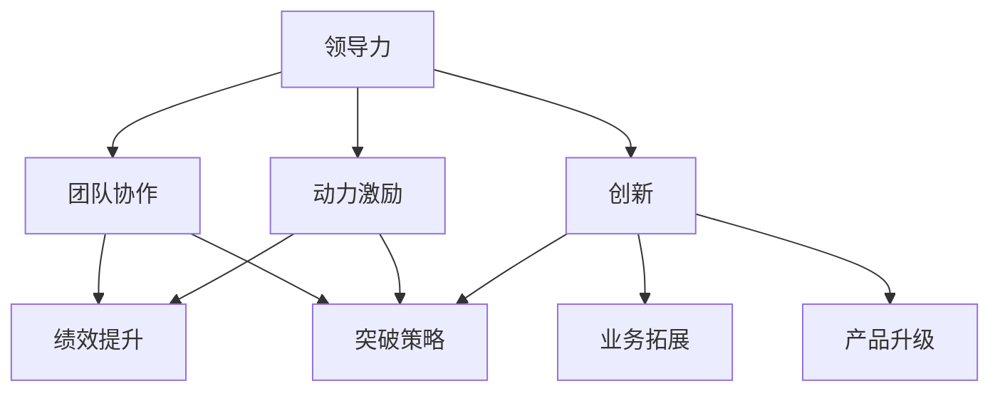

**领导力**通过**团队协作**和**动力激励**直接影响**绩效提升**。同时，**创新**则是通过**产品升级**和**业务拓展**来推动企业的发展。**团队协作**和**动力激励**是**突破策略**的基础，而**创新**是实现突破的核心动力。这个流程图清晰地展示了领导力、创新、团队协作、动力激励和突破策略之间的紧密联系，为后续内容的深入探讨提供了基础。

### 领导力定义与核心要素

领导力是一个广泛而多层次的概念，它涉及领导者如何通过一系列行为和决策来引导和激励团队成员，以实现组织目标。定义领导力并不容易，因为其内涵丰富，且在不同情境下有着不同的表现形式。总的来说，领导力可以被视为一种影响力，它使领导者能够对团队成员产生积极的影响，从而推动团队向着既定的目标前进。

领导力的核心要素主要包括以下几个方面：

1. **个人魅力**：
   个人魅力是指领导者通过其个性、品格和言行举止所展现出的吸引力。一个具有强大个人魅力的领导者能够激发团队成员的信任和尊重，从而增强团队的凝聚力。

2. **决策能力**：
   决策能力是领导力的关键组成部分。领导者必须在面对复杂多变的环境时，能够迅速做出明智的决策。这不仅要求领导者具备分析问题的能力，还需要有远见卓识，能够预测未来的趋势。

3. **影响力**：
   领导者通过其行为和决策对团队成员产生的影响，是实现领导力的核心。这种影响可以是正向的，如激励团队成员追求卓越，也可以是负向的，如抑制团队成员的积极性。

4. **沟通能力**：
   沟通能力是领导者必须具备的另一项关键技能。有效的沟通可以帮助领导者传达目标、愿景和策略，确保团队成员理解并支持领导者的决策。同时，良好的沟通还能增进团队内部的协作和信任。

5. **变革管理能力**：
   在快速变化的市场环境中，领导者必须具备变革管理能力。这包括识别变革需求、设计变革方案、动员团队成员支持和参与变革，以及评估变革效果。成功的变革管理能够帮助组织适应市场变化，保持竞争优势。

为了更好地理解领导力的核心要素，我们可以通过以下Mermaid流程图来展示它们之间的相互关系：

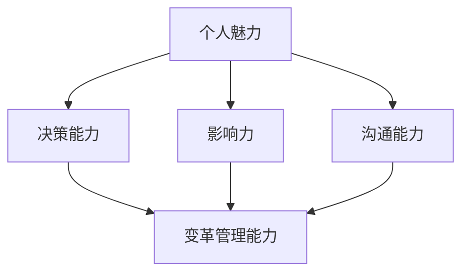

在这个流程图中，我们可以看到个人魅力、决策能力、影响力、沟通能力和变革管理能力是如何相互作用，共同构成领导力的核心。个人魅力和决策能力为领导者提供了基础，使其能够影响团队成员。而影响力、沟通能力和变革管理能力则是领导者将这种影响力转化为实际行动的关键。

### 不同领导风格与团队管理策略

领导风格是指领导者在其管理行为中表现出的习惯和方式，它对团队的绩效和氛围有着深远的影响。不同的领导风格适用于不同的团队和环境，因此，了解并掌握多种领导风格及其适用场景，对于领导者来说至关重要。

1. **独裁型领导风格**：
   独裁型领导风格强调领导者的权威和控制。领导者制定决策并直接指示团队成员执行。这种风格在需要迅速做出决策和执行的情况下效果较好，例如在危机管理中。然而，独裁型领导风格可能导致团队成员的积极性受到压制，缺乏自主性和创新精神。

   伪代码：`void autocraticLeadership() {
       // Leader makes decisions
       // Members execute orders
   }`

2. **民主型领导风格**：
   民主型领导风格注重团队成员的参与和反馈。领导者鼓励团队成员参与决策过程，通过讨论和协商来达成共识。这种风格有助于提高团队成员的积极性和创造力，增强团队的凝聚力。然而，民主型领导风格在需要迅速做出决策的情况下可能效率较低。

   伪代码：`void democraticLeadership() {
       // Leader facilitates discussions
       // Members participate in decision-making
   }`

3. **教练型领导风格**：
   教练型领导风格强调领导者作为导师的角色，帮助团队成员发展技能和提升自我。领导者通过提供反馈、指导和支持，帮助团队成员实现个人和职业成长。这种风格在培养团队人才和提升团队技能方面效果显著。

   伪代码：`void coachingLeadership() {
       // Leader provides feedback and guidance
       // Members develop skills and self-confidence
   }`

4. **变革型领导风格**：
   变革型领导风格强调领导者的远见卓识和变革能力。领导者通过激励团队成员追求卓越，推动组织变革和进步。这种风格在组织转型和应对重大挑战时尤为有效。

   伪代码：`void transformationalLeadership() {
       // Leader inspires excellence
       // Members embrace change and growth
   }`

5. **支持型领导风格**：
   支持型领导风格关注团队成员的情感和需求，领导者提供支持和鼓励，帮助团队成员克服困难。这种风格有助于提升团队成员的工作满意度和忠诚度。

   伪代码：`void supportiveLeadership() {
       // Leader provides support and encouragement
       // Members feel valued and motivated
   }`

每种领导风格都有其适用场景，领导者应根据团队的具体情况和目标，灵活运用不同的领导风格，以达到最佳的管理效果。以下是一个综合运用不同领导风格的策略示例：

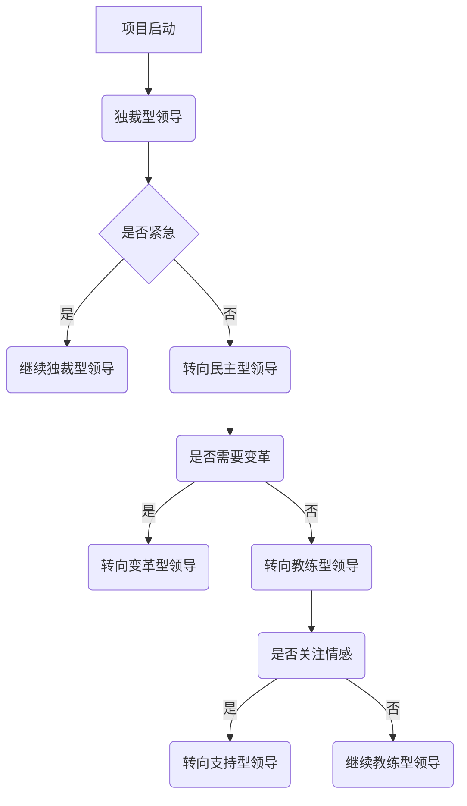

通过这个策略示例，我们可以看到领导者如何根据不同的情境灵活调整领导风格，以适应团队的需求和项目目标。

### 领导力发展路径

领导力并非与生俱来，而是可以通过学习和实践逐步发展的。一个成功的领导者需要经历多个阶段，逐步提升自己的领导能力。以下是领导力发展的常见路径：

1. **自我认知**：
   领导力发展的第一步是了解自己。领导者需要认识自己的优点和缺点，明确自己的价值观和信念。通过自我反思和评估，领导者可以更好地理解自己的行为模式和决策倾向。

   伪代码：`function selfAwareness() {
       // Reflect on strengths and weaknesses
       // Understand personal values and beliefs
   }`

2. **基础技能培养**：
   在自我认知的基础上，领导者需要培养一系列基础技能，如沟通能力、决策能力、团队管理等。这些技能是领导力的基石，对于有效管理团队至关重要。

   伪代码：`function basicSkillsTraining() {
       // Develop communication skills
       // Improve decision-making abilities
       // Learn team management techniques
   }`

3. **实践与反思**：
   领导力发展离不开实际操作。领导者需要通过参与实际项目、处理复杂问题和领导团队，将理论知识转化为实践能力。在实践中，领导者需要不断反思和总结，从错误中学习，不断提升自己的领导能力。

   伪代码：`function practiceAndReflection() {
       // Engage in practical projects
       // Analyze challenges and problems
       // Reflect on actions and outcomes
   }`

4. **持续学习**：
   领导力是一个不断发展的过程。随着环境和市场的变化，领导者需要不断更新知识和技能，以保持竞争力。通过参加培训课程、阅读相关书籍、与同行交流，领导者可以不断吸收新的思想和方法。

   伪代码：`function continuousLearning() {
       // Attend training programs
       // Read leadership books
       // Network with other leaders
   }`

5. **角色扮演与反馈**：
   领导者需要在不同角色中扮演，如团队成员、管理者、决策者等。通过角色扮演，领导者可以更全面地理解不同角色的需求和挑战，同时接受来自不同角色的反馈，不断改进自己的领导风格和方法。

   伪代码：`function rolePlayingAndFeedback() {
       // Take on different roles
       // Seek feedback from various perspectives
       // Adapt leadership style based on feedback
   }`

通过以上阶段，领导者可以逐步提升自己的领导力，成为一个更加成熟和有效的领导者。以下是一个Mermaid流程图，展示了领导力发展的路径：

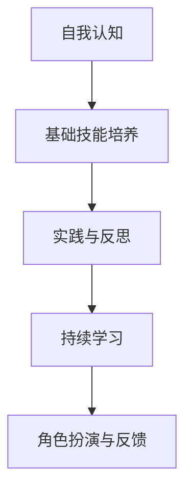

这个流程图清晰地展示了领导力发展的各个阶段及其相互关系，为领导者提供了系统的成长路径。

### 创新的定义与类型

创新是推动企业发展的重要动力，它不仅仅是一种新产品的开发，更是一种系统性的思维方式和方法。创新可以定义为通过新的想法、技术或方法，创造出具有价值的新产品、服务或业务模式。创新的类型多种多样，可以根据不同的标准进行分类。

1. **技术驱动的创新**：
   技术驱动的创新主要依赖于新技术的研究和应用。这种创新通常涉及新材料的开发、新工艺的引入或新技术的应用。例如，5G技术的普及推动了智能手机和物联网的发展。

2. **市场驱动的创新**：
   市场驱动的创新是基于市场需求和消费者行为的变化来进行的。这种创新关注如何更好地满足消费者的需求，提高产品和服务的市场竞争力。例如，共享经济的兴起改变了人们的出行方式，Uber和滴滴等公司通过技术创新满足了用户的出行需求。

3. **过程驱动的创新**：
   过程驱动的创新主要关注企业内部业务流程的改进和优化。这种创新可以减少成本、提高效率、改善产品质量。例如，丰田生产方式的引入，极大地提高了生产效率和产品质量。

4. **业务模式创新**：
   业务模式创新是指通过新的商业模式，重新定义企业的价值和盈利方式。这种创新可以带来重大的商业变革，例如亚马逊的在线销售模式和阿里巴巴的电子商务平台。

5. **产品驱动创新**：
   产品驱动创新侧重于新产品的开发，以满足市场需求或解决特定问题。例如，iPhone的推出不仅改变了手机市场的格局，还引领了整个消费电子行业的发展。

以下是一个关于创新类型的Mermaid流程图，展示了不同类型创新之间的关系：

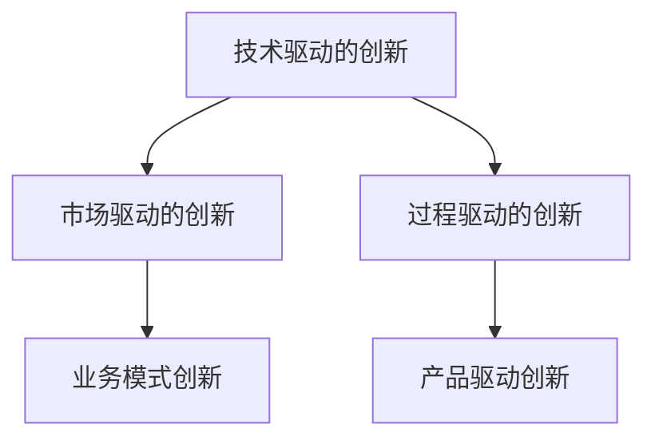

在这个流程图中，我们可以看到不同类型的创新如何相互关联和影响。技术驱动的创新可以支持市场驱动的创新，而过程驱动的创新可以提高产品的质量和效率。业务模式创新则可以为企业带来新的盈利方式，产品驱动创新则是满足市场需求的具体体现。

通过理解创新的定义和类型，领导者可以更系统地规划和实施创新策略，从而在竞争激烈的市场中保持领先地位。

### 创新思维与方法

创新思维是指通过创造性思考来解决问题的方法，它帮助领导者跳出传统思维框架，寻找新的解决方案。以下是一些常见的创新思维方法，以及如何在实际工作中应用这些方法。

1. **头脑风暴**：
   头脑风暴是一种集体创意思维技术，通过短时间内产生大量想法，不受评判和限制。这种方法适用于团队面对新问题或挑战时，能够快速激发创意和灵感。

   实际应用：在一个新产品开发项目中，团队成员可以围绕“如何提升产品用户体验”进行头脑风暴，列出各种可能的解决方案，如改进界面设计、增加新功能等。

2. **思维导图**：
   思维导图是一种图形化的思考工具，通过中心主题和分支节点，展示思维过程和关键概念之间的关系。这种方法有助于整理思路，发现潜在的创新点。

   实际应用：在制定新营销策略时，可以使用思维导图列出市场分析、目标客户、竞争对手等信息，从而更清晰地理解问题，找到创新方向。

3. **设计思维**：
   设计思维是一种以人为本的创新方法，强调理解用户需求，通过迭代和实验来不断改进产品和服务。这种方法适用于需要高度用户参与的创新项目。

   实际应用：在开发一款智能家居设备时，可以采用设计思维，通过与潜在用户进行访谈和观察，了解他们的使用习惯和痛点，从而设计出更符合用户需求的产品。

4. **跨界思维**：
   跨界思维是指从不同领域或行业中寻找灵感，借鉴其他领域的创新思路和方法。这种方法有助于拓宽思维视野，发现新的解决方案。

   实际应用：在食品行业，可以借鉴科技行业的智能化技术，开发智能烹饪设备，提高烹饪效率和用户体验。

以下是一个关于创新思维方法的Mermaid流程图，展示了这些方法的应用场景和相互关系：

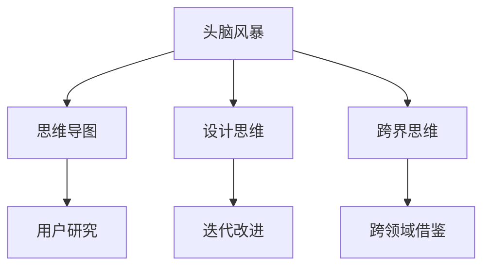

通过这个流程图，我们可以看到不同创新思维方法如何相互作用，共同推动创新过程。头脑风暴和思维导图用于激发创意，设计思维和跨界思维则用于实现和验证这些创意。

在实际工作中，领导者应根据具体情况选择合适的创新思维方法，灵活运用这些工具，以实现创新目标。通过系统化的创新思维训练，团队能够不断提升创新能力，为企业带来持续竞争优势。

### 创新过程管理

创新过程管理是指在企业中实施创新活动的一系列策略和方法，以确保创新能够高效、有序地进行。创新过程管理的关键在于如何有效地识别创新机会、设计创新流程、实施创新方案，并管理创新风险。以下是创新过程管理的详细步骤：

1. **识别创新机会**：
   创新机会的识别是创新过程管理的第一步。这涉及到对市场趋势、技术发展、消费者需求等方面的分析。领导者需要密切关注外部环境的变化，识别潜在的商机和创新点。

   伪代码：`function identifyInnovationOpportunities() {
       // Analyze market trends
       // Monitor technological advancements
       // Gather customer feedback
   }`

2. **设计创新流程**：
   在识别创新机会后，需要设计一个系统的创新流程，以确保创新活动能够有序进行。创新流程通常包括需求分析、概念验证、原型设计、测试和市场推广等阶段。

   伪代码：`function designInnovationProcess() {
       // Define stages:需求分析，概念验证，原型设计，测试，市场推广
       // Establish timelines and milestones
       // Allocate resources
   }`

3. **实施创新方案**：
   实施创新方案是将创新想法转化为实际产品的过程。在这一阶段，需要组建一个跨职能团队，确保各个环节的协作和沟通。同时，要采用敏捷开发方法，快速迭代，及时调整方案。

   伪代码：`function implementInnovationSolution() {
       // Assemble cross-functional teams
       // Utilize agile development practices
       // Conduct iterative testing and refinement
   }`

4. **管理创新风险**：
   创新过程中伴随着各种风险，包括技术风险、市场风险和运营风险等。有效的创新风险管理需要识别潜在风险，制定风险应对策略，并定期监控和评估风险。

   伪代码：`function manageInnovationRisks() {
       // Identify potential risks
       // Develop risk mitigation strategies
       // Monitor and assess risks throughout the process
   }`

以下是一个关于创新过程管理的Mermaid流程图，展示了各个步骤之间的逻辑关系：

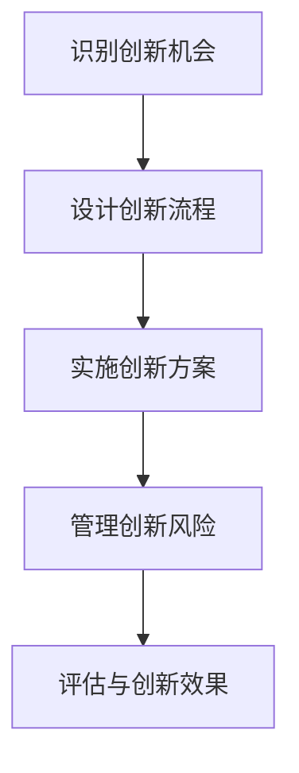

通过这个流程图，我们可以清晰地看到创新过程管理的各个环节是如何相互关联和推动的。从识别创新机会到设计流程，再到实施方案和管理风险，每个步骤都需要紧密配合，以确保创新活动的顺利进行。

在实际操作中，企业可以采用项目管理工具（如JIRA、Trello）来跟踪和管理创新项目的进度，确保各个环节按时完成。同时，定期召开项目评审会议，评估创新效果，及时调整策略，以持续优化创新过程。

总之，创新过程管理是一个复杂而系统的过程，需要领导者具备全局视野和细致的管理能力。通过有效的创新过程管理，企业能够提高创新成功率，加快市场响应速度，从而在激烈的市场竞争中保持领先地位。

### 团队协作与沟通

团队协作是领导力与创新的核心要素之一，它直接关系到团队的绩效和创新能力。有效的团队协作需要建立良好的沟通机制，确保团队成员能够顺畅地交流想法、共享信息和协同工作。以下是关于团队协作与沟通的关键原则和技巧。

1. **明确目标和期望**：
   团队协作的首要原则是确保所有成员对目标和期望有清晰的认识。领导者需要明确团队的目标、任务和期望成果，并通过会议、文档等形式进行传达，确保每个成员都理解自己的角色和责任。

   伪代码：`function clarifyGoalsAndExpectations() {
       // Define team objectives
       // Communicate tasks and roles
       // Ensure clarity among members
   }`

2. **建立信任**：
   信任是团队协作的基础。领导者需要通过开放沟通、积极倾听和尊重成员意见，建立团队成员之间的信任。信任感可以增强团队凝聚力，提高协作效率。

   伪代码：`function buildTrust() {
       // Encourage open communication
       // Practice active listening
       // Respect diverse perspectives
   }`

3. **有效沟通**：
   沟通技巧在团队协作中至关重要。领导者需要学会如何清晰、简洁地表达自己的想法，同时也要倾听和理解团队成员的意见。有效的沟通可以减少误解，提高决策质量。

   伪代码：`function effectiveCommunication() {
       // Use clear and concise language
       // Practice active listening
       // Seek feedback and clarification
   }`

4. **分工与合作**：
   团队协作不仅仅是团队成员之间的沟通，还包括明确的分工和协作。领导者需要根据成员的技能和兴趣，合理分配任务，确保每个成员都能在其擅长领域发挥作用。

   伪代码：`function分工与合作() {
       // Allocate tasks based on skills and interests
       // Facilitate collaboration across functional areas
       // Foster a sense of ownership and accountability
   }`

5. **冲突管理**：
   团队协作过程中难免会出现冲突。领导者需要学会如何有效地管理冲突，通过对话和协商解决问题，避免冲突升级影响团队协作。

   伪代码：`function conflictManagement() {
       // Identify and address conflicts
       // Use dialogue and negotiation
       // Focus on finding win-win solutions
   }`

6. **激励与认可**：
   领导者需要通过激励和认可来鼓励团队成员的协作和贡献。奖励机制、公开表彰和职业发展机会都是有效的激励手段，可以增强团队凝聚力和积极性。

   伪代码：`function motivationAndAcknowledgment() {
       // Implement reward systems
       // Recognize and appreciate contributions
       // Provide career development opportunities
   }`

以下是一个关于团队协作与沟通的Mermaid流程图，展示了关键原则和技巧之间的关系：

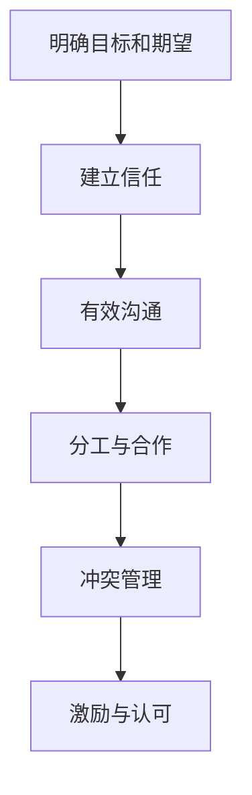

通过这个流程图，我们可以看到团队协作与沟通是一个系统化的过程，每个环节都需要紧密配合，以确保团队的高效运作和创新能力。

在实际工作中，领导者可以采用多种工具和方法来促进团队协作与沟通，如团队会议、协作软件（如Slack、Trello）、定期反馈会议等。通过不断的实践和改进，团队能够建立起高效的协作机制，从而实现共同的目标和愿景。

### 动力激励

动力激励是提升团队绩效和创新能力的关键因素之一。有效的激励策略能够激发团队成员的积极性和创造力，从而推动团队整体表现的提升。以下是几种常见的动力激励方法和其实际应用案例。

1. **奖励制度**：
   奖励制度是最常见的激励手段之一，通过物质奖励（如奖金、礼品）和精神奖励（如表彰、荣誉）来激励团队成员。例如，一家科技公司定期为表现突出的员工颁发“优秀员工奖”，这不仅提高了员工的满意度，也增强了团队的凝聚力和向心力。

2. **职业发展**：
   职业发展机会是另一种有效的激励手段。通过提供培训、晋升机会和职业规划，企业可以激励员工不断学习和成长。例如，一家互联网公司设立了“内部人才发展计划”，为员工提供技术培训和管理培训，帮助他们实现职业晋升。

3. **工作环境**：
   舒适和积极的工作环境可以显著提高员工的工作动力和满意度。例如，一些科技公司设计了开放式的办公空间，配备了休闲区和健身设施，为员工创造一个轻松愉快的工作氛围，从而提高工作效率和创新能力。

4. **认可与反馈**：
   定期的认可和反馈也是重要的激励手段。领导者通过表扬员工的优秀表现，指出改进的方向，可以帮助员工明确自己的价值和目标。例如，一家咨询公司定期召开员工反馈会议，让团队成员分享他们的工作成果和心得，同时接受同事和领导的建议和鼓励。

5. **团队建设**：
   通过团队建设活动，如团建、团队拓展训练等，可以增强团队成员之间的信任和合作，提高团队的整体凝聚力。例如，一家金融机构每年组织全体员工进行户外拓展训练，通过团队合作完成各种任务，从而增强员工的团队精神和协作能力。

以下是一个关于动力激励方法的Mermaid流程图，展示了这些方法的应用场景和相互关系：

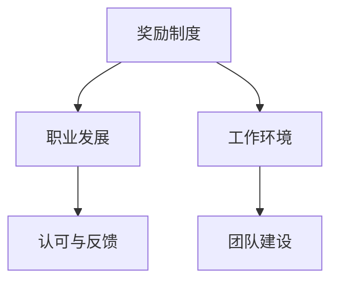

通过这个流程图，我们可以看到不同的激励方法如何相互作用，共同提升团队的动力和绩效。在实际应用中，企业应根据团队的具体情况和需求，灵活选择和组合不同的激励手段，以达到最佳的激励效果。

### 突破常规的策略与实践

在激烈的市场竞争和技术变革中，团队需要不断突破常规，寻找新的发展路径。以下是一些突破常规的策略和实践，帮助团队在不确定性和挑战中找到创新和成长的机会。

1. **引导式领导**：
   引导式领导强调领导者作为导师的角色，通过启发和激励团队成员来推动创新。领导者应创造一个开放和包容的环境，鼓励团队成员提出新的想法，并对这些想法进行试验和验证。

   实际应用：一位项目经理在团队中实施“创新日”，每天下午允许团队成员自由探索和实验，不限制项目范围和成果形式。这种方法激发了团队成员的创新热情，产生了多个有潜力的项目提案。

2. **跨领域合作**：
   跨领域合作通过将不同领域的知识和技能结合起来，能够产生意想不到的创新效果。通过与其他部门或外部机构的合作，团队可以引入新的视角和方法，突破传统思维的限制。

   实际应用：一家科技公司通过建立跨部门的创新实验室，聚集了来自开发、设计、市场和运营等不同领域的专家，共同研究和开发新产品。这种合作模式显著提升了创新效率，加速了新产品的上市时间。

3. **敏捷开发**：
   敏捷开发是一种以用户为中心、迭代和灵活的软件开发方法。通过快速迭代和持续反馈，团队能够快速适应市场变化，及时调整产品方向，从而实现突破常规。

   实际应用：一家互联网公司采用了敏捷开发模式，将开发周期缩短为两周一次的迭代。团队成员在每个迭代周期结束后进行回顾和评估，不断优化开发流程和产品功能，最终在短时间内推出了多个受市场欢迎的新功能。

4. **风险投资**：
   风险投资策略允许团队在创新的早期阶段投入一定的资源，尝试具有高风险但高回报的创新项目。这种方法能够激发团队的冒险精神和创新动力。

   实际应用：一家初创公司设立了一个“创新基金”，每年从公司预算中分配一部分资金，用于支持团队成员提出的创新项目。这种投资不仅降低了团队的风险感知，也提高了团队成员的创新积极性。

5. **用户参与**：
   用户参与是创新过程中不可或缺的一部分。通过直接与用户互动，团队可以了解用户的需求、痛点和偏好，从而设计出更符合市场需求的产品。

   实际应用：一家健康科技公司通过在线调查、用户访谈和焦点小组会议等方式，收集用户反馈，并根据这些反馈不断改进其健康监测应用。这种方法不仅提高了产品的用户满意度，也加速了产品的迭代速度。

以下是一个关于突破常规策略和实践的Mermaid流程图，展示了不同方法之间的联系和应用场景：

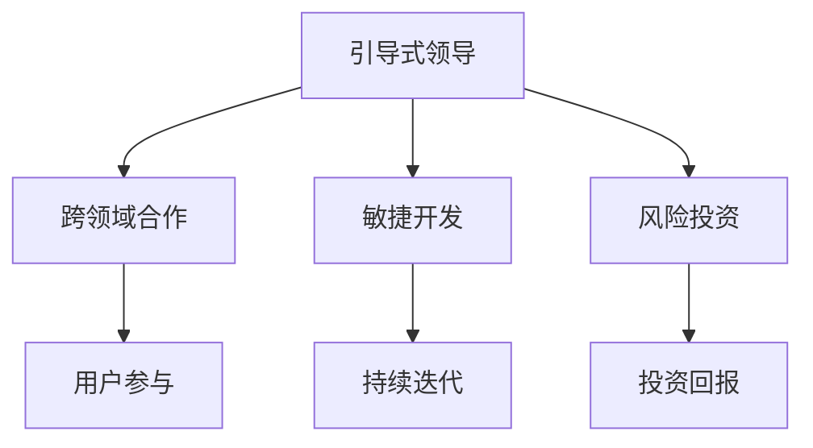

通过这个流程图，我们可以看到各种突破常规的策略和实践如何相互配合，共同推动团队的创新和发展。在实际操作中，团队应根据自身的情况和目标，灵活选择和应用这些策略，以实现持续的创新和突破。

### 突破常规的策略与实践

在市场竞争日益激烈和技术变革日新月异的今天，团队如何突破常规，实现持续创新和成长，成为企业发展的关键。以下是一些具体的突破常规的策略与实践，通过实际案例和详细讲解，帮助团队找到实现突破的方法。

#### 案例一：引导式领导

**背景介绍**：一家科技公司面临市场竞争压力，需要通过创新来提升竞争力。公司决定采用引导式领导策略，激发团队成员的创造力。

**具体实践**：
1. **建立创新文化**：公司管理层通过内部培训和团队会议，向全体员工传达创新的重要性，并鼓励自由讨论和提出新的想法。
2. **设立创新项目**：公司设立“创新月”，每月指定一个创新项目，由团队成员自主组队进行研究和开发。
3. **领导激励**：领导者在项目初期提供指导和支持，并在项目进展中给予及时的反馈和鼓励。

**详细讲解**：
- **创新文化**：通过内部培训和会议，员工逐渐认识到创新对企业发展的关键作用，形成了积极向上的创新氛围。
- **创新项目**：通过自主组队和自由选题，团队成员的主动性和创造力得到了充分激发，产生了多个创新成果。
- **领导激励**：领导者的及时反馈和鼓励，让团队成员感受到自己的价值，增强了参与创新的积极性。

**项目小结**：通过引导式领导策略，公司成功激发了团队的创新潜力，推出了一系列具有市场竞争力的新产品。

#### 案例二：跨领域合作

**背景介绍**：一家初创公司开发一款智能家居产品，但面临技术瓶颈和市场需求的不确定性。

**具体实践**：
1. **组建跨领域团队**：公司邀请了来自设计、技术、市场营销等不同领域的专家，组成一个跨领域团队，共同研究和开发智能家居产品。
2. **资源共享**：团队通过共享资源和信息，提高了协作效率，减少了重复劳动。
3. **定期会议**：团队每周召开会议，讨论进展、解决问题和调整方向。

**详细讲解**：
- **跨领域团队**：通过跨领域的合作，团队从不同视角出发，提出了一系列创新的设计方案和市场需求分析，为产品开发提供了多方面的支持。
- **资源共享**：资源的共享不仅提高了工作效率，还促进了团队成员之间的交流和学习，增强了团队的创新能力。
- **定期会议**：通过定期会议，团队成员能够及时沟通进展和问题，确保项目在正确的轨道上运行。

**项目小结**：跨领域合作使得公司成功克服了技术瓶颈，快速推出了一款符合市场需求的智能家居产品。

#### 案例三：敏捷开发

**背景介绍**：一家互联网公司需要快速响应市场需求，推出新的在线服务。

**具体实践**：
1. **敏捷团队**：公司组建了一个敏捷团队，由产品经理、开发人员、设计师等组成，确保团队成员在项目开发过程中的高效协作。
2. **迭代开发**：团队采用迭代开发模式，每个迭代周期为两周，快速完成需求分析、设计和开发，并进行测试和反馈。
3. **用户反馈**：每个迭代周期结束后，团队邀请用户参与测试和反馈，根据用户反馈调整产品功能。

**详细讲解**：
- **敏捷团队**：通过敏捷团队的建立，团队成员在项目开发过程中能够快速响应变化，提高了工作效率和灵活性。
- **迭代开发**：迭代开发模式使得团队能够在短时间内推出产品原型，并根据用户反馈进行持续优化，提高了产品的市场适应性。
- **用户反馈**：通过用户反馈，团队能够更好地了解用户需求，及时调整产品方向，确保产品能够满足市场需求。

**项目小结**：敏捷开发策略使得公司能够快速响应市场需求，成功推出了一系列受欢迎的在线服务。

#### 案例四：风险投资

**背景介绍**：一家初创公司需要资金支持，进行高风险但高回报的创新项目。

**具体实践**：
1. **成立风险投资部门**：公司专门成立了风险投资部门，负责评估和投资有潜力的创新项目。
2. **创新基金**：公司设立了一项创新基金，用于支持团队成员的创新项目，并提供资金和资源支持。
3. **评估与投资**：风险投资部门通过项目评估，选择具有高成长潜力的创新项目进行投资。

**详细讲解**：
- **风险投资部门**：通过专业的评估和投资流程，公司能够识别和投资具有高增长潜力的创新项目，降低投资风险。
- **创新基金**：创新基金为团队成员提供了资金支持，激发了他们的创新热情，同时也为公司带来了潜在的高回报。
- **评估与投资**：通过严格的评估和投资流程，公司能够确保资金用于最具有潜力的创新项目，提高了投资的成功率。

**项目小结**：风险投资策略使得公司成功支持了一系列创新项目，推动了公司的持续发展和创新。

#### 案例五：用户参与

**背景介绍**：一家健康科技公司需要开发一款针对老年人健康管理应用，但缺乏对老年用户需求的深入了解。

**具体实践**：
1. **用户访谈**：公司组织了多次用户访谈，与老年用户面对面交流，了解他们的需求和使用习惯。
2. **焦点小组**：公司邀请了老年用户参与焦点小组讨论，收集他们的意见和建议。
3. **产品迭代**：根据用户反馈，公司对产品进行多次迭代，优化功能设计。

**详细讲解**：
- **用户访谈**：通过与老年用户直接交流，公司能够深入了解他们的实际需求和痛点，为产品开发提供了宝贵的参考。
- **焦点小组**：通过焦点小组讨论，公司能够收集到更多用户的意见和建议，从而在产品设计方面做出更全面的调整。
- **产品迭代**：通过用户反馈进行产品迭代，公司能够不断优化产品，使其更符合老年用户的需求。

**项目小结**：用户参与策略使得公司成功开发出了一款深受老年人欢迎的健康管理应用。

#### 总结

通过以上案例，我们可以看到团队在突破常规、实现创新的过程中，采用了多种策略和实践。无论是引导式领导、跨领域合作、敏捷开发，还是风险投资和用户参与，这些策略都为团队提供了强大的支持和动力。在实际操作中，团队应根据自身情况和目标，灵活选择和应用这些策略，以实现持续的创新和突破。

### 最佳实践 Tips、小结、注意事项、拓展阅读

在领导力与创新领域，最佳实践是通过不断总结和反思得出的经验，它们能够为团队提供有效的指导，帮助团队在复杂多变的环境中实现突破。以下是一些实用的最佳实践Tips，结合上述文章内容，为读者提供实用建议。

1. **持续学习与反思**：
   领导者和团队成员应保持持续学习的态度，通过阅读书籍、参加培训课程和与同行交流，不断提升自身知识和技能。定期进行反思和总结，从成功和失败中汲取经验，持续优化领导力和创新能力。

2. **明确目标和期望**：
   在团队协作中，确保所有成员对目标和期望有清晰的认识，通过明确的目标设定和沟通，提高团队的凝聚力和执行力。定期回顾目标，并根据实际情况进行调整，以保持团队的活力和动力。

3. **灵活运用领导风格**：
   领导者应根据团队的具体情况和目标，灵活运用不同的领导风格，如独裁型、民主型、教练型和变革型等。通过不断调整领导风格，提高团队适应不同情境的能力，实现最佳管理效果。

4. **培养创新思维**：
   团队应鼓励成员培养创新思维，通过头脑风暴、思维导图、设计思维和跨界思维等方法，激发创意和灵感。定期组织创新活动，如创新竞赛、创意工作坊等，营造浓厚的创新氛围。

5. **风险管理**：
   在创新过程中，领导者应重视风险管理，识别潜在风险并制定相应的应对策略。通过风险控制和预案制定，降低创新过程中的不确定性，确保项目的顺利推进。

6. **用户参与**：
   创新产品和服务时，应充分听取用户意见，通过用户访谈、焦点小组和测试等方式，了解用户需求和使用习惯。用户参与不仅能够提高产品的市场适应性，还能增强用户满意度。

**小结**：
本篇文章系统地探讨了领导力与创新在引领团队突破常规中的关键作用和实践方法。通过定义领导力和创新的核心概念，介绍不同领导风格和团队管理策略，讲解创新思维与方法，以及分享突破常规的策略与实践，文章为读者提供了全面的理论和实践指导。领导力和创新相辅相成，只有通过有效的领导力激发创新，团队才能在竞争中脱颖而出。

**注意事项**：
1. 领导者在实践中应注重细节，避免因为宏观目标而忽视团队成员的感受和需求。
2. 创新过程中，要灵活调整策略，根据实际情况进行优化和调整。
3. 用户参与是创新成功的关键，领导者应重视用户反馈，持续改进产品。

**拓展阅读**：
1. 《领导力的五大障碍》（Patrick Lencioni）- 探讨领导力中的常见障碍及解决方法。
2. 《创新者的窘境》（Clayton M. Christensen）- 分析企业在创新过程中面临的挑战和应对策略。
3. 《设计思维》（David Kelley）- 介绍设计思维在创新中的应用和具体实践。

通过以上最佳实践、小结、注意事项和拓展阅读，读者可以更好地理解和应用领导力与创新的理论和方法，提升团队的综合素质和创新能力，为企业的持续发展贡献力量。

### 文章标题

《领导力与创新：引领团队突破常规》

### 文章关键词

领导力、创新、团队协作、管理策略、突破常规、风险管理、用户参与

### 文章摘要

本文深入探讨了领导力与创新在团队突破常规中的关键作用。首先，通过定义领导力和创新的核心概念，介绍了不同领导风格和团队管理策略。接着，详细阐述了创新思维与方法，以及创新过程管理的具体步骤。随后，本文通过实际案例展示了突破常规的策略与实践，包括引导式领导、跨领域合作、敏捷开发、风险投资和用户参与。最后，文章提供了最佳实践Tips、小结、注意事项和拓展阅读，为读者提供了全面的理论和实践指导。领导力和创新相结合，能够有效推动团队在不确定性和挑战中实现创新和成长。

---

# 领导力与创新：引领团队突破常规

> 关键词：领导力、创新、团队协作、管理策略、突破常规、风险管理、用户参与

> 摘要：本文通过系统分析领导力和创新的核心概念，详细探讨了不同领导风格和团队管理策略。同时，介绍了创新思维与方法，分享了突破常规的策略与实践。文章旨在为读者提供全面的理论和实践指导，帮助团队在竞争激烈的环境中实现持续创新和成长。

---

## 第一部分：领导力基础

### 1. 领导力定义与核心要素

领导力是一个广泛而多层次的概念，它涉及领导者如何通过一系列行为和决策来引导和激励团队成员，以实现组织目标。定义领导力并不容易，因为其内涵丰富，且在不同情境下有着不同的表现形式。总的来说，领导力可以被视为一种影响力，它使领导者能够对团队成员产生积极的影响，从而推动团队向着既定的目标前进。

#### 1.1 领导力的本质

领导力的本质在于其影响力，即领导者通过个人魅力、决策能力、沟通技巧等，对团队成员产生的影响。这种影响不仅体现在团队成员的行为和表现上，还体现在团队的氛围和文化中。

#### 1.2 核心要素

领导力的核心要素主要包括以下几个方面：

1. **个人魅力**：个人魅力是指领导者通过其个性、品格和言行举止所展现出的吸引力。一个具有强大个人魅力的领导者能够激发团队成员的信任和尊重，从而增强团队的凝聚力。

2. **决策能力**：决策能力是领导者的关键能力之一。领导者必须在面对复杂多变的环境时，能够迅速做出明智的决策。这不仅要求领导者具备分析问题的能力，还需要有远见卓识，能够预测未来的趋势。

3. **影响力**：领导者通过其行为和决策对团队成员产生的影响，是实现领导力的核心。这种影响可以是正向的，如激励团队成员追求卓越，也可以是负向的，如抑制团队成员的积极性。

4. **沟通能力**：沟通能力是领导者必须具备的另一项关键技能。有效的沟通可以帮助领导者传达目标、愿景和策略，确保团队成员理解并支持领导者的决策。同时，良好的沟通还能增进团队内部的协作和信任。

5. **变革管理能力**：在快速变化的市场环境中，领导者必须具备变革管理能力。这包括识别变革需求、设计变革方案、动员团队成员支持和参与变革，以及评估变革效果。成功的变革管理能够帮助组织适应市场变化，保持竞争优势。

#### 1.3 Mermaid流程图

为了更好地理解领导力的核心要素，我们可以通过Mermaid流程图来展示它们之间的相互关系：

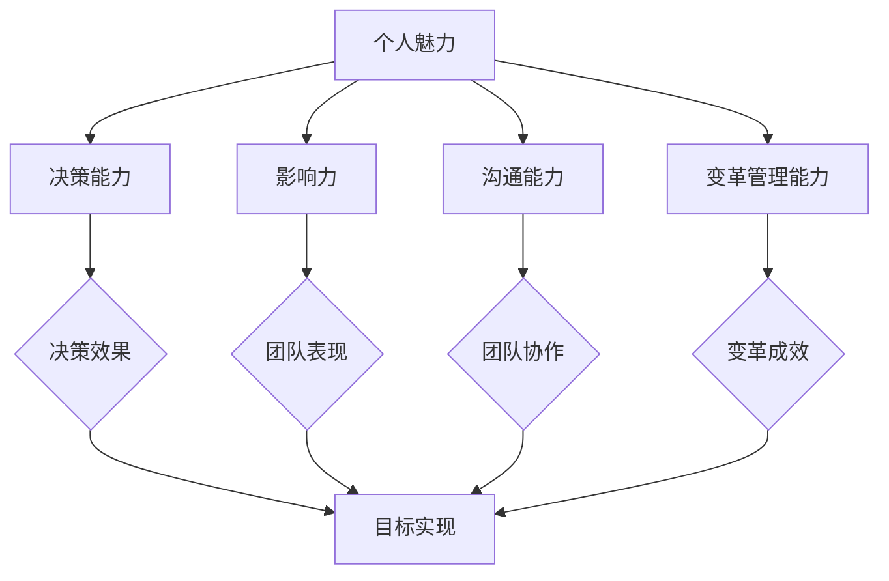

在这个流程图中，我们可以看到个人魅力、决策能力、影响力、沟通能力和变革管理能力是如何相互作用，共同构成领导力的核心。个人魅力和决策能力为领导者提供了基础，使其能够影响团队成员。而影响力、沟通能力和变革管理能力则是领导者将这种影响力转化为实际行动的关键。

### 2. 领导风格与团队管理

领导风格是指领导者在其管理行为中表现出的习惯和方式，它对团队的绩效和氛围有着深远的影响。不同的领导风格适用于不同的团队和环境，因此，了解并掌握多种领导风格及其适用场景，对于领导者来说至关重要。

#### 2.1 独裁型领导风格

独裁型领导风格强调领导者的权威和控制。领导者制定决策并直接指示团队成员执行。这种风格在需要迅速做出决策和执行的情况下效果较好，例如在危机管理中。然而，独裁型领导风格可能导致团队成员的积极性受到压制，缺乏自主性和创新精神。

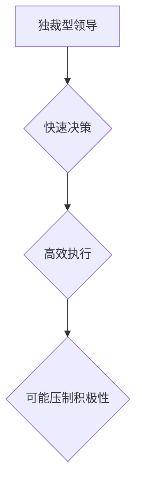

#### 2.2 民主型领导风格

民主型领导风格注重团队成员的参与和反馈。领导者鼓励团队成员参与决策过程，通过讨论和协商来达成共识。这种风格有助于提高团队成员的积极性和创造力，增强团队的凝聚力。然而，民主型领导风格在需要迅速做出决策的情况下可能效率较低。

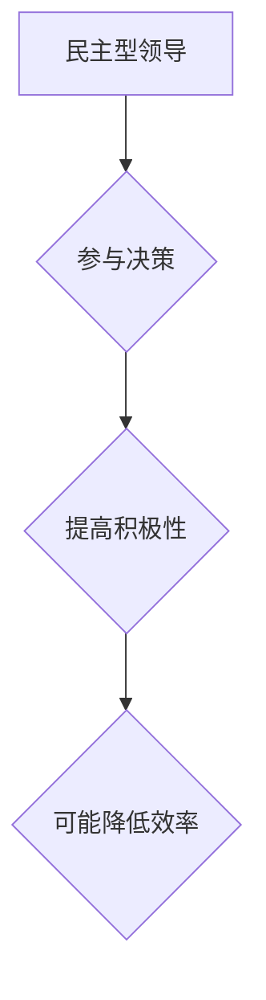

#### 2.3 教练型领导风格

教练型领导风格强调领导者作为导师的角色，帮助团队成员发展技能和提升自我。领导者通过提供反馈、指导和支持，帮助团队成员实现个人和职业成长。这种风格在培养团队人才和提升团队技能方面效果显著。

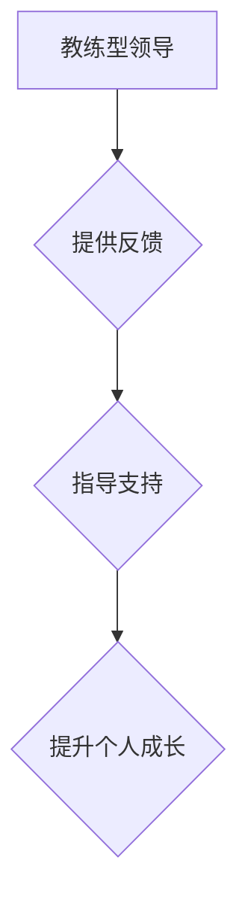

#### 2.4 变革型领导风格

变革型领导风格强调领导者的远见卓识和变革能力。领导者通过激励团队成员追求卓越，推动组织变革和进步。这种风格在组织转型和应对重大挑战时尤为有效。

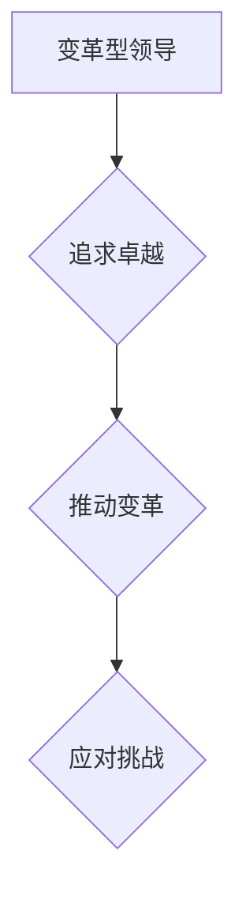

#### 2.5 支持型领导风格

支持型领导风格关注团队成员的情感和需求，领导者提供支持和鼓励，帮助团队成员克服困难。这种风格有助于提升团队成员的工作满意度和忠诚度。

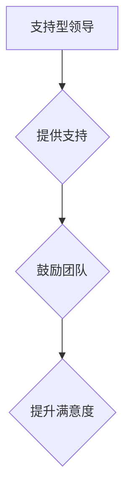

#### 2.6 适用场景

不同的领导风格适用于不同的场景和团队环境。领导者应根据具体情况灵活运用不同的领导风格，以达到最佳的管理效果。

- **独裁型领导**：适用于紧急情况或需要迅速决策的场合，如危机管理。
- **民主型领导**：适用于需要团队成员参与决策、增强团队凝聚力的场合，如项目启动阶段。
- **教练型领导**：适用于需要培养团队人才、提升团队技能的场合，如新员工培训。
- **变革型领导**：适用于组织转型、重大变革的场合，如公司战略调整。
- **支持型领导**：适用于团队成员面临困难、需要鼓励和支持的场合，如员工压力管理。

```mermaid
graph TD
    A{紧急情况} --> B[独裁型]
    A --> C[项目启动][民主型]
    A --> D[新员工培训][教练型]
    A --> E[战略调整][变革型]
    A --> F[员工压力管理][支持型]
```

### 3. 领导力发展路径

领导力并非与生俱来，而是可以通过学习和实践逐步发展的。一个成功的领导者需要经历多个阶段，逐步提升自己的领导能力。以下是领导力发展的常见路径：

#### 3.1 自我认知

自我认知是领导力发展的第一步。领导者需要了解自己的优点和缺点，明确自己的价值观和信念。通过自我反思和评估，领导者可以更好地理解自己的行为模式和决策倾向。

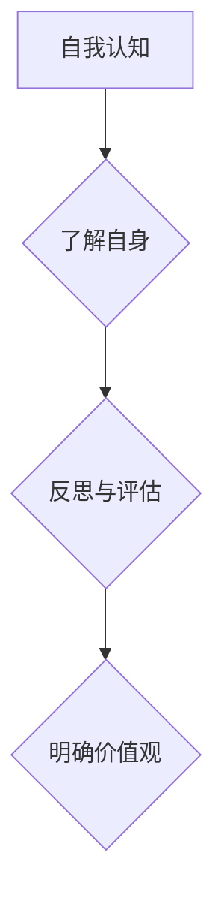

#### 3.2 基础技能培养

在自我认知的基础上，领导者需要培养一系列基础技能，如沟通能力、决策能力、团队管理等。这些技能是领导力的基石，对于有效管理团队至关重要。

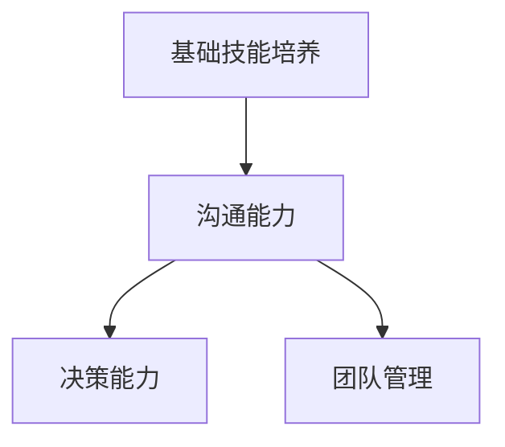

#### 3.3 实践与反思

领导力发展离不开实际操作。领导者需要通过参与实际项目、处理复杂问题和领导团队，将理论知识转化为实践能力。在实践中，领导者需要不断反思和总结，从错误中学习，不断提升自己的领导能力。

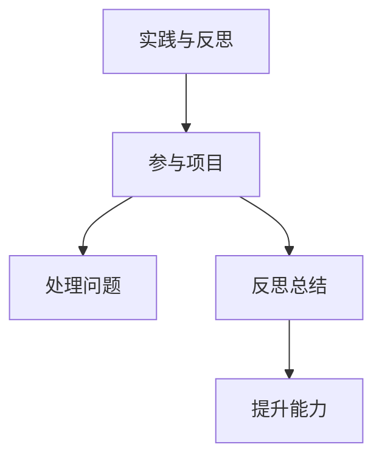

#### 3.4 持续学习

领导力是一个不断发展的过程。随着环境和市场的变化，领导者需要不断更新知识和技能，以保持竞争力。通过参加培训课程、阅读相关书籍、与同行交流，领导者可以不断吸收新的思想和方法。

```mermaid
graph TD
    A[持续学习] --> B[培训课程]
    B --> C[书籍阅读]
    B --> D[同行交流]
```

#### 3.5 角色扮演与反馈

领导者需要在不同角色中扮演，如团队成员、管理者、决策者等。通过角色扮演，领导者可以更全面地理解不同角色的需求和挑战，同时接受来自不同角色的反馈，不断改进自己的领导风格和方法。

```mermaid
graph TD
    A[角色扮演与反馈] --> B[团队角色]
    B --> C[管理角色]
    B --> D[决策角色]
    D --> E[反馈改进]
```

通过以上阶段，领导者可以逐步提升自己的领导力，成为一个更加成熟和有效的领导者。以下是一个Mermaid流程图，展示了领导力发展的路径：

```mermaid
graph TD
    A[自我认知] --> B[基础技能培养]
    B --> C[实践与反思]
    C --> D[持续学习]
    D --> E[角色扮演与反馈]
```

### 第二部分：创新原理与方法

### 4. 创新的定义与类型

创新是推动企业发展的重要动力，它不仅仅是一种新产品的开发，更是一种系统性的思维方式和方法。创新可以定义为通过新的想法、技术或方法，创造出具有价值的新产品、服务或业务模式。创新的类型多种多样，可以根据不同的标准进行分类。

#### 4.1 技术驱动的创新

技术驱动的创新主要依赖于新技术的研究和应用。这种创新通常涉及新材料的开发、新工艺的引入或新技术的应用。例如，5G技术的普及推动了智能手机和物联网的发展。

```mermaid
graph TD
    A[技术驱动的创新] --> B[新材料开发]
    B --> C[新工艺引入]
    B --> D[新技术应用]
```

#### 4.2 市场驱动的创新

市场驱动的创新是基于市场需求和消费者行为的变化来进行的。这种创新关注如何更好地满足消费者的需求，提高产品和服务的市场竞争力。例如，共享经济的兴起改变了人们的出行方式，Uber和滴滴等公司通过技术创新满足了用户的出行需求。

```mermaid
graph TD
    A[市场驱动的创新] --> B[满足消费者需求]
    B --> C[提高市场竞争力]
    B --> D[改变出行方式]
```

#### 4.3 过程驱动的创新

过程驱动的创新主要关注企业内部业务流程的改进和优化。这种创新可以减少成本、提高效率、改善产品质量。例如，丰田生产方式的引入，极大地提高了生产效率和产品质量。

```mermaid
graph TD
    A[过程驱动的创新] --> B[成本降低]
    B --> C[效率提高]
    B --> D[质量改善]
```

#### 4.4 业务模式创新

业务模式创新是指通过新的商业模式，重新定义企业的价值和盈利方式。这种创新可以带来重大的商业变革，例如亚马逊的在线销售模式和阿里巴巴的电子商务平台。

```mermaid
graph TD
    A[业务模式创新] --> B[重新定义价值]
    B --> C[改变盈利方式]
    B --> D[商业变革]
```

#### 4.5 产品驱动创新

产品驱动创新侧重于新产品的开发，以满足市场需求或解决特定问题。例如，iPhone的推出不仅改变了手机市场的格局，还引领了整个消费电子行业的发展。

```mermaid
graph TD
    A[产品驱动创新] --> B[新产品开发]
    B --> C[满足市场需求]
    B --> D[解决特定问题]
```

#### 4.6 创新类型的Mermaid流程图

为了更好地理解不同类型创新的关系，我们可以通过Mermaid流程图来展示它们之间的相互作用：

```mermaid
graph TD
    A[技术驱动的创新] --> B[市场驱动的创新]
    A --> C[过程驱动的创新]
    B --> D[业务模式创新]
    C --> E[产品驱动创新]
```

通过这个流程图，我们可以看到不同类型的创新如何相互关联，共同推动企业的进步和发展。

### 5. 创新思维与方法

创新思维是指通过创造性思考来解决问题的方法，它帮助领导者跳出传统思维框架，寻找新的解决方案。以下是一些常见的创新思维方法，以及如何在实际工作中应用这些方法。

#### 5.1 头脑风暴

头脑风暴是一种集体创意思维技术，通过短时间内产生大量想法，不受评判和限制。这种方法适用于团队面对新问题或挑战时，能够快速激发创意和灵感。

```mermaid
graph TD
    A[头脑风暴] --> B[产生想法]
    B --> C[不受限制]
    C --> D[快速激发创意]
```

#### 5.2 思维导图

思维导图是一种图形化的思考工具，通过中心主题和分支节点，展示思维过程和关键概念之间的关系。这种方法有助于整理思路，发现潜在的创新点。

```mermaid
graph TD
    A[思维导图] --> B[展示关系]
    B --> C[整理思路]
    C --> D[发现创新点]
```

#### 5.3 设计思维

设计思维是一种以人为本的创新方法，强调理解用户需求，通过迭代和实验来不断改进产品和服务。这种方法适用于需要高度用户参与的创新项目。

```mermaid
graph TD
    A[设计思维] --> B[理解需求]
    B --> C[迭代改进]
    C --> D[实验验证]
```

#### 5.4 跨界思维

跨界思维是指从不同领域或行业中寻找灵感，借鉴其他领域的创新思路和方法。这种方法有助于拓宽思维视野，发现新的解决方案。

```mermaid
graph TD
    A[跨界思维] --> B[跨领域借鉴]
    B --> C[拓宽视野]
    C --> D[发现新方案]
```

#### 5.5 创新思维方法的Mermaid流程图

为了更好地理解不同创新思维方法的应用，我们可以通过Mermaid流程图来展示这些方法之间的关系：

```mermaid
graph TD
    A[头脑风暴] --> B[思维导图]
    A --> C[设计思维]
    A --> D[跨界思维]
```

通过这个流程图，我们可以看到不同创新思维方法如何相互作用，共同推动创新过程。在实际工作中，领导者应根据具体情况选择合适的创新思维方法，灵活运用这些工具，以实现创新目标。

### 6. 创新过程管理

创新过程管理是指在企业中实施创新活动的一系列策略和方法，以确保创新能够高效、有序地进行。创新过程管理的关键在于如何有效地识别创新机会、设计创新流程、实施创新方案，并管理创新风险。以下是创新过程管理的详细步骤：

#### 6.1 识别创新机会

创新机会的识别是创新过程管理的第一步。这涉及到对市场趋势、技术发展、消费者需求等方面的分析。领导者需要密切关注外部环境的变化，识别潜在的商机和创新点。

```mermaid
graph TD
    A[识别创新机会] --> B[市场趋势分析]
    B --> C[技术发展分析]
    B --> D[消费者需求分析]
    D --> E[潜在商机识别]
```

#### 6.2 设计创新流程

在识别创新机会后，需要设计一个系统的创新流程，以确保创新活动能够有序进行。创新流程通常包括需求分析、概念验证、原型设计、测试和市场推广等阶段。

```mermaid
graph TD
    A[设计创新流程] --> B[需求分析]
    B --> C[概念验证]
    C --> D[原型设计]
    D --> E[测试与验证]
    E --> F[市场推广]
```

#### 6.3 实施创新方案

实施创新方案是将创新想法转化为实际产品的过程。在这一阶段，需要组建一个跨职能团队，确保各个环节的协作和沟通。同时，要采用敏捷开发方法，快速迭代，及时调整方案。

```mermaid
graph TD
    A[实施创新方案] --> B[组建跨职能团队]
    B --> C[敏捷开发]
    C --> D[迭代调整]
```

#### 6.4 管理创新风险

创新过程中伴随着各种风险，包括技术风险、市场风险和运营风险等。有效的创新风险管理需要识别潜在风险，制定风险应对策略，并定期监控和评估风险。

```mermaid
graph TD
    A[管理创新风险] --> B[识别风险]
    B --> C[制定策略]
    C --> D[监控与评估]
```

#### 6.5 创新过程管理的Mermaid流程图

为了更好地理解创新过程管理的各个步骤，我们可以通过Mermaid流程图来展示它们之间的逻辑关系：

```mermaid
graph TD
    A[识别创新机会] --> B[设计创新流程]
    B --> C[实施创新方案]
    C --> D[管理创新风险]
    D --> E[评估与创新效果]
```

通过这个流程图，我们可以看到创新过程管理是一个系统化的过程，每个步骤都需要紧密配合，以确保创新活动的顺利进行。

### 第三部分：团队协作与沟通

团队协作是领导力与创新的核心要素之一，它直接关系到团队的绩效和创新能力。有效的团队协作需要建立良好的沟通机制，确保团队成员能够顺畅地交流想法、共享信息和协同工作。以下是关于团队协作与沟通的关键原则和技巧。

#### 7.1 明确目标和期望

团队协作的首要原则是确保所有成员对目标和期望有清晰的认识。领导者需要明确团队的目标、任务和期望成果，并通过会议、文档等形式进行传达，确保每个成员都理解自己的角色和责任。

```mermaid
graph TD
    A[明确目标和期望] --> B[传达目标]
    B --> C[分配任务]
    C --> D[设定期望]
```

#### 7.2 建立信任

信任是团队协作的基础。领导者需要通过开放沟通、积极倾听和尊重成员意见，建立团队成员之间的信任。信任感可以增强团队凝聚力，提高协作效率。

```mermaid
graph TD
    A[建立信任] --> B[开放沟通]
    B --> C[积极倾听]
    C --> D[尊重意见]
```

#### 7.3 有效沟通

沟通技巧在团队协作中至关重要。领导者需要学会如何清晰、简洁地表达自己的想法，同时也要倾听和理解团队成员的意见。有效的沟通可以减少误解，提高决策质量。

```mermaid
graph TD
    A[有效沟通] --> B[清晰表达]
    B --> C[倾听理解]
    C --> D[减少误解]
```

#### 7.4 分工与合作

团队协作不仅仅是团队成员之间的沟通，还包括明确的分工和协作。领导者需要根据成员的技能和兴趣，合理分配任务，确保每个成员都能在其擅长领域发挥作用。

```mermaid
graph TD
    A[分工与合作] --> B[合理分配]
    B --> C[发挥优势]
    C --> D[协作工作]
```

#### 7.5 冲突管理

团队协作过程中难免会出现冲突。领导者需要学会如何有效地管理冲突，通过对话和协商解决问题，避免冲突升级影响团队协作。

```mermaid
graph TD
    A[冲突管理] --> B[识别冲突]
    B --> C[对话协商]
    C --> D[解决问题]
```

#### 7.6 激励与认可

领导者需要通过激励和认可来鼓励团队成员的协作和贡献。奖励机制、公开表彰和职业发展机会都是有效的激励手段，可以增强团队凝聚力和积极性。

```mermaid
graph TD
    A[激励与认可] --> B[奖励机制]
    B --> C[公开表彰]
    B --> D[职业发展]
```

#### 7.7 团队协作与沟通的Mermaid流程图

为了更好地理解团队协作与沟通的原则和技巧，我们可以通过Mermaid流程图来展示它们之间的关系：

```mermaid
graph TD
    A[明确目标和期望] --> B[建立信任]
    B --> C[有效沟通]
    C --> D[分工与合作]
    D --> E[冲突管理]
    E --> F[激励与认可]
```

通过这个流程图，我们可以看到团队协作与沟通是一个系统化的过程，每个环节都需要紧密配合，以确保团队的高效运作和创新能力。

### 第四部分：动力激励

动力激励是提升团队绩效和创新能力的关键因素之一。有效的激励策略能够激发团队成员的积极性和创造力，从而推动团队整体表现的提升。以下是几种常见的动力激励方法和其实际应用案例。

#### 8.1 奖励制度

奖励制度是最常见的激励手段之一，通过物质奖励（如奖金、礼品）和精神奖励（如表彰、荣誉）来激励团队成员。例如，一家科技公司定期为表现突出的员工颁发“优秀员工奖”，这不仅提高了员工的满意度，也增强了团队的凝聚力和向心力。

```mermaid
graph TD
    A[奖励制度] --> B[物质奖励]
    B --> C[精神奖励]
    C --> D[满意度提升]
```

#### 8.2 职业发展

职业发展机会是另一种有效的激励手段。通过提供培训、晋升机会和职业规划，企业可以激励员工不断学习和成长。例如，一家互联网公司设立了“内部人才发展计划”，为员工提供技术培训和管理培训，帮助他们实现职业晋升。

```mermaid
graph TD
    A[职业发展] --> B[培训机会]
    B --> C[晋升机会]
    B --> D[职业规划]
```

#### 8.3 工作环境

舒适和积极的工作环境可以显著提高员工的工作动力和满意度。例如，一些科技公司设计了开放式的办公空间，配备了休闲区和健身设施，为员工创造一个轻松愉快的工作氛围，从而提高工作效率和创新能力。

```mermaid
graph TD
    A[工作环境] --> B[开放式办公]
    B --> C[休闲区]
    B --> D[健身设施]
```

#### 8.4 认可与反馈

定期的认可和反馈也是重要的激励手段。领导者通过表扬员工的优秀表现，指出改进的方向，可以帮助员工明确自己的价值和目标。例如，一家咨询公司定期召开员工反馈会议，让团队成员分享他们的工作成果和心得，同时接受同事和领导的建议和鼓励。

```mermaid
graph TD
    A[认可与反馈] --> B[表扬表现]
    B --> C[改进方向]
    B --> D[员工反馈]
```

#### 8.5 团队建设

通过团队建设活动，如团建、团队拓展训练等，可以增强团队成员之间的信任和合作，提高团队的整体凝聚力。例如，一家金融机构每年组织全体员工进行户外拓展训练，通过团队合作完成各种任务，从而增强员工的团队精神和协作能力。

```mermaid
graph TD
    A[团队建设] --> B[团建活动]
    B --> C[团队拓展]
    B --> D[信任增强]
```

#### 8.6 动力激励的Mermaid流程图

为了更好地理解不同动力激励方法的应用，我们可以通过Mermaid流程图来展示这些方法之间的关系：

```mermaid
graph TD
    A[奖励制度] --> B[职业发展]
    A --> C[工作环境]
    B --> D[认可与反馈]
    C --> E[团队建设]
```

通过这个流程图，我们可以看到不同的动力激励方法如何相互作用，共同提升团队的动力和绩效。在实际工作中，领导者应根据团队的具体情况和需求，灵活选择和组合不同的激励手段，以达到最佳的激励效果。

### 第五部分：团队突破常规

在激烈的市场竞争和技术变革中，团队需要不断突破常规，寻找新的发展路径。以下是一些具体的突破常规的策略与实践，通过实际案例和详细讲解，帮助团队找到实现突破的方法。

#### 9.1 引导式领导

**背景介绍**：一家科技公司面临市场竞争压力，需要通过创新来提升竞争力。公司决定采用引导式领导策略，激发团队成员的创造力。

**具体实践**：

1. **建立创新文化**：公司管理层通过内部培训和团队会议，向全体员工传达创新的重要性，并鼓励自由讨论和提出新的想法。
2. **设立创新项目**：公司设立“创新月”，每月指定一个创新项目，由团队成员自主组队进行研究和开发。
3. **领导激励**：领导者在项目初期提供指导和支持，并在项目进展中给予及时的反馈和鼓励。

**详细讲解**：

- **创新文化**：通过内部培训和会议，员工逐渐认识到创新对企业发展的关键作用，形成了积极向上的创新氛围。
- **创新项目**：通过自主组队和自由选题，团队成员的主动性和创造力得到了充分激发，产生了多个创新成果。
- **领导激励**：领导者的及时反馈和鼓励，让团队成员感受到自己的价值，增强了参与创新的积极性。

**项目小结**：通过引导式领导策略，公司成功激发了团队的创新潜力，推出了一系列具有市场竞争力的新产品。

#### 9.2 跨领域合作

**背景介绍**：一家初创公司开发一款智能家居产品，但面临技术瓶颈和市场需求的不确定性。

**具体实践**：

1. **组建跨领域团队**：公司邀请了来自设计、技术、市场营销等不同领域的专家，组成一个跨领域团队，共同研究和开发智能家居产品。
2. **资源共享**：团队通过共享资源和信息，提高了协作效率，减少了重复劳动。
3. **定期会议**：团队每周召开会议，讨论进展、解决问题和调整方向。

**详细讲解**：

- **跨领域团队**：通过跨领域的合作，团队从不同视角出发，提出了一系列创新的设计方案和市场需求分析，为产品开发提供了多方面的支持。
- **资源共享**：资源的共享不仅提高了工作效率，还促进了团队成员之间的交流和学习，增强了团队的创新能力。
- **定期会议**：通过定期会议，团队成员能够及时沟通进展和问题，确保项目在正确的轨道上运行。

**项目小结**：跨领域合作使得公司成功克服了技术瓶颈，快速推出了一款符合市场需求的智能家居产品。

#### 9.3 敏捷开发

**背景介绍**：一家互联网公司需要快速响应市场需求，推出新的在线服务。

**具体实践**：

1. **敏捷团队**：公司组建了一个敏捷团队，由产品经理、开发人员、设计师等组成，确保团队成员在项目开发过程中的高效协作。
2. **迭代开发**：团队采用迭代开发模式，每个迭代周期为两周，快速完成需求分析、设计和开发，并进行测试和反馈。
3. **用户反馈**：每个迭代周期结束后，团队邀请用户参与测试和反馈，根据用户反馈调整产品功能。

**详细讲解**：

- **敏捷团队**：通过敏捷团队的建立，团队成员在项目开发过程中能够快速响应变化，提高了工作效率和灵活性。
- **迭代开发**：迭代开发模式使得团队能够在短时间内推出产品原型，并根据用户反馈进行持续优化，提高了产品的市场适应性。
- **用户反馈**：通过用户反馈，团队能够更好地了解用户需求，及时调整产品方向，确保产品能够满足市场需求。

**项目小结**：敏捷开发策略使得公司能够快速响应市场需求，成功推出了一系列受欢迎的在线服务。

#### 9.4 风险投资

**背景介绍**：一家初创公司需要资金支持，进行高风险但高回报的创新项目。

**具体实践**：

1. **成立风险投资部门**：公司专门成立了风险投资部门，负责评估和投资有潜力的创新项目。
2. **创新基金**：公司设立了一项创新基金，用于支持团队成员的创新项目，并提供资金和资源支持。
3. **评估与投资**：风险投资部门通过项目评估，选择具有高成长潜力的创新项目进行投资。

**详细讲解**：

- **风险投资部门**：通过专业的评估和投资流程，公司能够识别和投资具有高增长潜力的创新项目，降低投资风险。
- **创新基金**：创新基金为团队成员提供了资金支持，激发了他们的创新热情，同时也为公司带来了潜在的高回报。
- **评估与投资**：通过严格的评估和投资流程，公司能够确保资金用于最具有潜力的创新项目，提高了投资的成功率。

**项目小结**：风险投资策略使得公司成功支持了一系列创新项目，推动了公司的持续发展和创新。

#### 9.5 用户参与

**背景介绍**：一家健康科技公司需要开发一款针对老年人健康管理应用，但缺乏对老年用户需求的深入了解。

**具体实践**：

1. **用户访谈**：公司组织了多次用户访谈，与老年用户面对面交流，了解他们的需求和使用习惯。
2. **焦点小组**：公司邀请了老年用户参与焦点小组讨论，收集他们的意见和建议。
3. **产品迭代**：根据用户反馈，公司对产品进行多次迭代，优化功能设计。

**详细讲解**：

- **用户访谈**：通过与老年用户直接交流，公司能够深入了解他们的实际需求和痛点，为产品开发提供了宝贵的参考。
- **焦点小组**：通过焦点小组讨论，公司能够收集到更多用户的意见和建议，从而在产品设计方面做出更全面的调整。
- **产品迭代**：通过用户反馈进行产品迭代，公司能够不断优化产品，使其更符合老年用户的需求。

**项目小结**：用户参与策略使得公司成功开发出了一款深受老年人欢迎的健康管理应用。

### 第六部分：总结与展望

通过本文的探讨，我们可以看到领导力与创新在引领团队突破常规中的重要作用。领导力通过激发团队成员的积极性和创造力，推动团队向着共同目标前进；创新则通过不断寻找新的解决方案和业务模式，帮助企业保持竞争优势。

在实际应用中，领导者需要灵活运用不同的领导风格，结合创新思维方法，构建高效的团队协作机制，并通过有效的动力激励策略，激发团队成员的潜力。同时，团队应积极参与用户互动，不断优化产品和服务，以适应市场变化。

未来的领导力与创新研究可以进一步探讨新兴技术（如人工智能、区块链）在团队管理中的应用，以及跨文化和全球化背景下的领导力挑战。通过不断探索和实践，我们将能够构建更加成熟和有效的领导力和创新体系，推动企业和团队在快速变化的环境中实现持续发展和突破。

---

## 附录

### A. 领导力与创新工具与方法

在领导力与创新的管理过程中，使用一些工具和方法可以有效地提高工作效率和决策质量。以下是一些常用的工具和方法介绍及其应用指南。

#### 1. SWOT分析

**SWOT分析**是一种常用的战略规划工具，用于评估组织的优势（Strengths）、劣势（Weaknesses）、机会（Opportunities）和威胁（Threats）。通过SWOT分析，领导者和团队可以全面了解组织的内外部环境，制定更为科学和有效的战略规划。

**应用指南**：
- **步骤**：首先，识别组织的优势和劣势；其次，分析外部环境和市场机会；最后，识别可能面临的威胁。
- **工具**：可以使用Excel、MindMap等工具制作SWOT分析图。

#### 2. 五力模型

**五力模型**由迈克尔·波特提出，用于分析行业竞争结构。它包括供应商的议价能力、客户的议价能力、新进入者的威胁、替代品的威胁和行业内的竞争。

**应用指南**：
- **步骤**：分别评估每个力的影响，并根据分析结果制定相应的策略。
- **工具**：可以使用Excel、PowerPoint等工具制作五力分析图。

#### 3. 市场调研

**市场调研**是了解市场需求和用户行为的重要方法。通过市场调研，领导者和团队能够获取宝贵的用户反馈，从而优化产品和服务。

**应用指南**：
- **步骤**：设计调研问卷，选择合适的调研对象，收集和整理数据，分析结果。
- **工具**：可以使用SurveyMonkey、Google表单等在线调研工具。

#### 4. 设计思维

**设计思维**是一种以人为本的创新方法，强调理解用户需求，通过迭代和实验来不断改进产品和服务。

**应用指南**：
- **步骤**：观察用户行为，识别用户需求，设计原型，测试和反馈，迭代改进。
- **工具**：可以使用Sketch、Figma等设计工具创建原型。

#### 5. 项目管理工具

**项目管理工具**可以帮助团队更好地规划和管理项目进度、资源和风险。

**应用指南**：
- **步骤**：定义项目目标，分解任务，分配资源，监控进度，风险管理。
- **工具**：可以使用JIRA、Trello、Asana等项目管理工具。

### B. 案例研究

#### 1. 案例一：谷歌的“20%时间”政策

**背景**：谷歌在2006年推出了“20%时间”政策，允许员工将20%的工作时间用于自己感兴趣的项目。这一政策激发了员工的创新热情，诞生了包括Gmail、Google News等在内的多个成功产品。

**分析**：
- **领导力**：谷歌的领导风格较为宽松，鼓励员工自主探索和创新。
- **创新思维**：设计思维方法的应用，使员工能够更好地理解用户需求，进行迭代改进。
- **用户参与**：通过用户反馈，不断优化产品，提高用户满意度。

**启示**：宽松的领导风格和鼓励创新的文化，有助于激发员工的创造力和创新能力。同时，用户参与是产品成功的关键。

#### 2. 案例二：丰田的生产方式

**背景**：丰田生产方式是一种基于精益思想的生产管理方法，旨在通过最小化浪费，实现高效、高质量的生产。

**分析**：
- **创新过程管理**：丰田通过持续改进和精益生产，不断优化生产流程，降低成本。
- **团队协作**：跨部门团队合作，确保生产过程的连续性和高效性。
- **用户参与**：通过用户反馈，不断改进产品设计和生产流程。

**启示**：创新过程管理和用户参与是提高产品质量和降低成本的关键。团队协作和持续改进是确保生产方式成功实施的重要因素。

### 总结

通过以上案例研究，我们可以看到领导力、创新、团队协作和用户参与在实践中的应用和效果。这些案例为企业和团队提供了宝贵的经验和启示，帮助他们在实际工作中更好地实现突破和创新。

