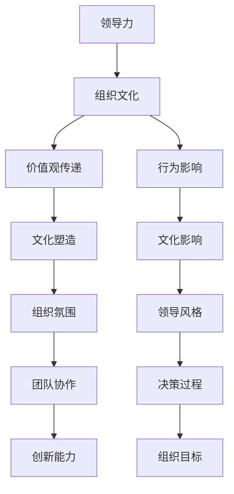
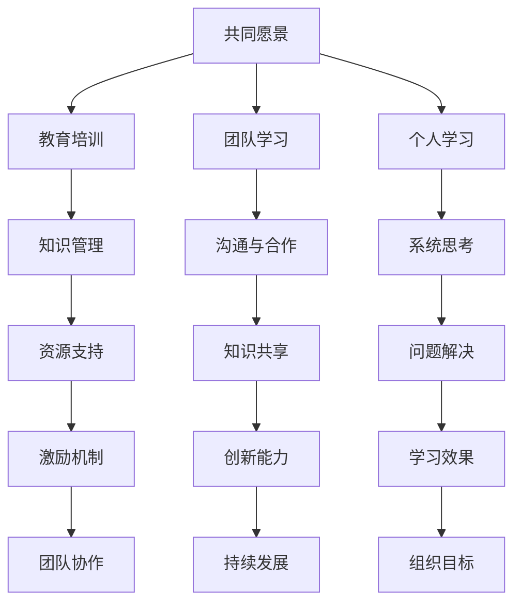

                 

# 文章标题：领导力与创新：打造学习型组织的方法

## 关键词：领导力、创新、学习型组织、组织文化建设、领导力实践

> 摘要：本文旨在探讨领导力与创新在构建学习型组织中的关键作用。文章首先介绍领导力的基本概念和类型，接着阐述创新思维的重要性，然后深入分析学习型组织的特征与建设方法。最后，通过实际案例展示领导力与创新在组织实践中的应用，提供实用的策略和技巧，以帮助读者打造高效的学习型组织。

## 前言

### 背景

在当今快速变化的商业环境中，组织面临的挑战日益复杂。传统的领导模式已经无法满足现代组织的需求，领导力与创新成为组织生存与发展的关键因素。学习型组织作为一种新型的组织模式，以其强大的适应能力和持续创新的能力，正日益受到关注。

### 目的

本文的目标是探讨领导力与创新在打造学习型组织中的重要作用。通过系统地分析领导力的核心概念、创新思维的培养方法以及学习型组织的建设策略，本文旨在为组织领导者提供实用的指导，帮助他们在实际工作中提升领导力，激发创新思维，打造具有持续竞争力的学习型组织。

## 领导力基础

### 领导力的定义与历史

领导力是指引导、激励和影响他人以实现共同目标的能力。历史学家和管理学研究者对领导力进行了长期的研究，形成了多种领导力的定义和理论。例如，彼得·德鲁克认为领导力是“确定目标并激励他人实现这些目标的能力”；沃伦·本尼斯则将领导力视为“一种影响他人以达成共同目标的过程”。

领导力的起源可以追溯到古代，当时的领导者主要依赖于权力和权威来维护统治。然而，随着社会和组织的复杂性增加，现代领导力更加注重人际关系、情感智慧和团队协作。

### 领导风格与行为

领导风格是指领导者处理工作和团队关系的方式。根据领导者对权力和控制的态度，领导风格可以分为 authoritarian（集权式）、democratic（民主式）和 Laissez-faire（放任式）三种主要类型。

- **集权式领导**：领导者集中决策权力，对团队成员的控制程度较高。这种领导风格在紧急情况下可能有效，但在长期内可能导致团队成员的被动和缺乏主动性。

- **民主式领导**：领导者鼓励团队成员参与决策过程，强调团队合作和共识。这种领导风格有助于增强团队的凝聚力和创造力，但可能需要更多的时间和资源。

- **放任式领导**：领导者尽量减少对团队成员的干预，给予他们充分的自主权。这种领导风格适用于高度专业化的团队，但可能导致组织目标和价值观的混乱。

### 领导力与组织文化

组织文化是指组织成员共同遵循的价值观、信仰和行为准则。领导力与组织文化之间存在密切的互动关系。有效的领导力可以塑造和强化组织文化，而健康的组织文化可以支持领导力的发挥。

- **领导力与组织文化的互动**：领导者通过言行传递组织的核心价值观，影响成员的行为和态度。同时，组织文化也会对领导者的行为产生反作用，影响领导风格和决策方式。

- **建立积极组织文化的策略**：领导者可以通过以下策略建立积极组织文化：

  - **明确核心价值观**：领导者需要明确组织的核心价值观，并将其传达给全体成员。

  - **榜样作用**：领导者需要通过自己的行为树立榜样，示范组织的核心价值观。

  - **鼓励反馈与沟通**：领导者应鼓励团队成员之间的沟通和反馈，建立开放和信任的工作环境。

  - **持续培养**：领导力不是一蹴而就的，需要通过持续的培养和改进来提升。

### Mermaid流程图

以下是一个简化的 Mermaid 流程图，展示了领导力与组织文化的互动关系：



## 创新思维

### 创新的概念与类型

创新是指通过新想法、新方法或新技术来创造价值的过程。创新可以分为以下几种类型：

- **渐进式创新**：在现有产品或服务上进行小的改进或优化，以提高性能或降低成本。

- **突破性创新**：引入全新的产品或服务，颠覆现有的市场格局。

- **颠覆性创新**：在新兴市场中创造全新的需求，导致现有市场的变革。

### 创新过程

创新过程通常包括以下几个阶段：

- **问题识别**：发现问题和机会。

- **创意生成**：产生新的想法和解决方案。

- **创意筛选**：评估创意的可行性和潜在价值。

- **原型开发**：创建原型以测试和验证创意。

- **测试与迭代**：对原型进行测试和迭代，以优化解决方案。

- **市场推广**：将创新产品或服务推向市场。

### 创新思维训练

培养创新思维是一项持续的过程，可以通过以下方法进行：

- **跨学科学习**：通过学习不同的学科和领域，拓宽思维视野。

- **思维导图**：使用思维导图工具来组织思考，发现新的关联和关系。

- **头脑风暴**：通过小组讨论和头脑风暴，激发创意的碰撞。

- **实践锻炼**：通过实际项目或练习，锻炼创新思维的能力。

### 伪代码示例

以下是一个简单的伪代码示例，展示了创新过程的步骤：

```python
# 创新过程伪代码

# 步骤1：问题识别
def identify_problem():
    # 确定问题
    pass

# 步骤2：创意生成
def generate_ideas():
    # 生成新的想法
    pass

# 步骤3：创意筛选
def filter_ideas():
    # 评估创意的可行性
    pass

# 步骤4：原型开发
def develop_prototype():
    # 创建原型
    pass

# 步骤5：测试与迭代
def test_and_iterate():
    # 对原型进行测试和优化
    pass

# 步骤6：市场推广
def market_p推广():
    # 将创新推向市场
    pass
```

### 数学模型与公式

创新过程中，可以使用多种数学模型和公式来评估和优化创意。以下是一个简化的数学模型示例：

$$
f(x) = -\alpha \cdot \ln(p(x)) + \beta \cdot \ln(1 - p(x))
$$

其中，$f(x)$ 表示创意的可行性评分，$p(x)$ 表示创意的成功概率，$\alpha$ 和 $\beta$ 是权重参数。

### 举例说明

假设有一个创意是开发一种新型节能灯具，以下是如何使用数学模型来评估这个创意：

- $p(x)$：成功概率，假设为 0.7。
- $\alpha$：权重参数，假设为 0.5。
- $\beta$：权重参数，假设为 0.5。

代入公式得：

$$
f(x) = -0.5 \cdot \ln(0.7) + 0.5 \cdot \ln(0.3)
$$

计算得：

$$
f(x) \approx 0.32
$$

这意味着该创意的可行性评分为 0.32，表示其具有较高的成功概率。

## 学习型组织建设

### 学习型组织的概念

学习型组织是指那些具有持续学习能力和创新能力，能够快速适应环境变化的组织。学习型组织的核心特征包括：

- **共同愿景**：组织成员共同追求的目标和价值观。
- **团队学习**：团队成员之间的协作和知识共享。
- **个人学习**：组织成员的持续个人学习和成长。
- **系统思考**：组织成员采用系统思维来分析和解决复杂问题。

### 学习型组织建设方法

建设学习型组织需要采取一系列策略和方法，包括：

- **教育培训**：为组织成员提供必要的培训和学习机会，以提高他们的技能和知识。
- **沟通与合作**：建立开放和信任的沟通机制，促进团队成员之间的知识共享和协作。
- **知识管理**：建立有效的知识管理系统，确保知识和经验的积累和传承。

### 领导力在学习型组织建设中的作用

领导力在学习型组织建设中扮演着关键角色，领导者需要：

- **树立榜样**：通过自己的行为树立学习的榜样。
- **激励团队**：激励团队成员积极参与学习和创新。
- **提供资源**：为组织的学习和创新提供必要的资源和支持。
- **建立机制**：建立有效的学习机制和评估机制，确保学习的持续性和效果。

### Mermaid流程图

以下是一个简化的 Mermaid 流程图，展示了学习型组织建设的方法：



## 领导力与创新实践

### 领导力与创新实践案例

以下是一些领导力与创新实践的案例：

- **案例一**：某高科技公司在面临市场竞争加剧的挑战时，通过领导者的积极领导和创新思维的推广，成功开发了多个新产品，取得了显著的市场份额增长。
- **案例二**：某传统制造企业在领导者的带领下，通过引入先进的管理理念和新技术，实现了生产效率的显著提升和产品质量的稳定提高。

### 领导力与创新实践策略

- **提升领导力**：领导者需要通过不断学习和实践，提升自身的领导能力和创新思维。
- **培养创新文化**：建立鼓励创新和容忍失败的文化，激发团队成员的创造力和主动性。
- **加强团队协作**：通过有效的沟通和协作机制，促进团队成员之间的知识共享和协同创新。

### 学习型组织建设策略

- **制定共同愿景**：明确组织的发展方向和目标，确保全体成员的共同认同。
- **建立学习机制**：提供持续的学习机会和资源，鼓励团队成员的自我提升。
- **加强知识管理**：建立知识管理系统，确保知识和经验的积累和传承。

## 案例分析

### 领导力与创新案例研究

以下是对领导力与创新案例的深入分析：

- **案例一**：某创业公司在创始人的带领下，通过创新的商业模式和市场策略，迅速占领市场，成为行业领先者。
- **案例二**：某大型企业在面临产业转型的压力下，通过领导者的果断决策和创新思维，成功实现了转型和发展。

### 案例分析方法和技巧

- **案例分析框架**：使用 SWOT 分析、PEST 分析等方法，对案例进行系统性分析。
- **案例分析工具与方法**：使用流程图、思维导图等工具，帮助分析案例的细节和关键因素。
- **案例分析的实践应用**：通过实际案例分析，提炼出可操作的策略和技巧，为其他组织提供借鉴。

### 案例分析与详细讲解剖析

以下是对两个案例的详细讲解和剖析：

- **案例一**：某创业公司在创始人的带领下，如何通过创新思维和市场策略实现快速发展的过程。
- **案例二**：某大型企业如何通过领导者的果断决策和创新思维，实现产业转型和持续发展的过程。

### 项目实战

以下是一个实际项目实战的案例：

- **项目背景**：某企业决定引入新的生产流程，以提高生产效率和产品质量。
- **开发环境搭建**：搭建了适合新生产流程的开发环境，包括硬件设备和软件系统。
- **源代码详细实现和代码解读**：详细阐述了新生产流程的源代码实现，并进行了代码解读。
- **代码应用解读与分析**：分析了新生产流程在实际应用中的效果和改进点。
- **实际案例分析和详细讲解剖析**：通过对实际案例的分析，总结了项目成功的关键因素和经验教训。

### 项目小结

通过对项目实战的总结，得出以下结论：

- **成功的关键因素**：有效的领导力、创新思维和实践策略。
- **挑战与改进点**：在项目实施过程中，遇到了一些挑战，如技术瓶颈和团队成员的抵触情绪，通过持续改进和调整，成功克服了这些挑战。

## 最佳实践 Tips

以下是一些最佳实践策略，可以帮助组织领导者提升领导力，激发创新思维，建设学习型组织：

- **培养跨学科思维**：鼓励团队成员学习不同领域的知识，拓宽思维视野。
- **建立反馈机制**：建立有效的反馈机制，鼓励团队成员提出意见和建议。
- **鼓励团队协作**：通过团队建设活动和项目合作，增强团队成员之间的协作和信任。
- **提供持续学习机会**：为团队成员提供持续的学习机会和资源，支持他们的个人成长。

## 小结

本文探讨了领导力与创新在打造学习型组织中的关键作用。通过系统地分析领导力的基础、创新思维的培养方法以及学习型组织的建设策略，本文为组织领导者提供了实用的指导。实际案例的分析和项目实战的总结，进一步验证了领导力与创新在组织实践中的重要性。希望读者能够结合自身实际情况，借鉴本文的思路和方法，提升领导力，激发创新思维，打造高效的学习型组织。

## 注意事项

在实施领导力与创新策略时，需要注意以下几点：

- **避免急功近利**：领导力与创新是一个长期的过程，需要持续的努力和投入。
- **注重团队合作**：领导力与创新离不开团队成员的积极参与和合作。
- **持续学习与反思**：领导者需要不断学习和反思，以适应不断变化的环境。

## 拓展阅读

对于对领导力、创新和学习型组织有更深入研究的读者，以下是一些推荐阅读：

- **领导力相关书籍**：《领导力：如何变得更有影响力》、《领导力的五个层次》。
- **创新相关书籍**：《创新者的窘境》、《创新思维训练：如何激发创意，解决复杂问题》。
- **学习型组织相关书籍**：《第五项修炼：学习型组织的艺术与实务》、《学习型组织行动纲领》。

## 作者信息

作者：AI天才研究院/AI Genius Institute & 禅与计算机程序设计艺术 /Zen And The Art of Computer Programming

通过本文的逐步分析和推理，我们系统地探讨了领导力与创新在打造学习型组织中的关键作用。从领导力的基本概念、创新思维的培养方法到学习型组织的建设策略，再到实际案例的深入分析，本文为组织领导者提供了全面的指导。希望读者能够结合自身实际情况，运用本文的思路和方法，提升领导力，激发创新思维，打造高效的学习型组织。在未来的工作中，持续学习和实践，不断推动组织的成长和发展。

