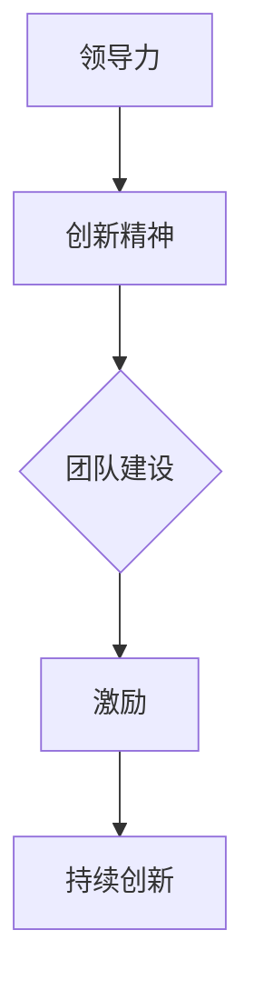
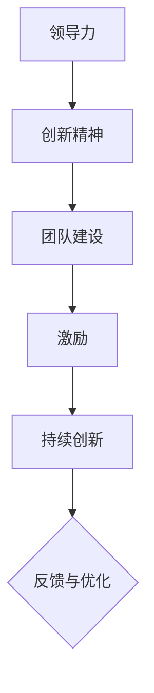

                 

### 设计步骤：

为了撰写一篇逻辑清晰、结构紧凑、简单易懂的IT领域专业技术博客文章，我们将遵循以下设计步骤：

1. **确定核心章节**：
   - 根据书名《领导力与创新：激发团队创新精神》，核心章节可以是：领导力基础理论、创新思维方法、团队建设与激励、创新实践案例分析等。

2. **设计1级目录**：
   - 概括各章节的主题，例如：
     - 第1章：领导力与创新概述
     - 第2章：创新思维方法
     - 第3章：团队建设与激励
     - 第4章：创新实践案例分析

3. **细化2级目录**：
   - 在1级目录下细化各个章节，列出具体的小节，例如：
     - 第1章：领导力与创新概述
       - 1.1 领导力基础理论
       - 1.2 创新精神的重要性
       - 1.3 领导力与创新的联系
     - 第2章：创新思维方法
       - 2.1 演绎思维与归纳思维
       - 2.2 跨界思维与创新
     - 第3章：团队建设与激励
       - 3.1 团队建设的原则
       - 3.2 激励方法
     - 第4章：创新实践案例分析
       - 4.1 案例A：苹果公司的创新之路
       - 4.2 案例B：谷歌的创新文化

4. **设计3级目录**：
   - 在2级目录下，进一步细化每个小节，列出具体的子主题，例如：
     - 第1章：领导力与创新概述
       - 1.1.1 领导力概述
       - 1.1.2 创新精神的重要性
       - 1.1.3 领导力与创新的联系
     - 第2章：创新思维方法
       - 2.1.1 演绎思维的原理
       - 2.1.2 归纳思维的原理
       - 2.2.1 跨界思维的定义
       - 2.2.2 跨界思维的应用场景

5. **添加Mermaid流程图**：
   - 为每个关键概念或流程设计Mermaid流程图，以帮助读者更好地理解，例如：
     - 领导力与创新的联系
     - 创新思维方法的具体流程

6. **撰写伪代码示例**：
   - 为关键算法或流程撰写伪代码，使其更易于理解，例如：
     - 团队建设与激励的算法流程

7. **编写数学公式**：
   - 针对数学模型和公式，编写详细讲解，并举例说明，例如：
     - 领导者满意度的数学模型

8. **编写实战案例**：
   - 编写创新实践案例分析，包括开发环境搭建、源代码详细实现和代码解读，例如：
     - 苹果公司的创新实践案例分析

9. **校对与优化**：
   - 检查目录大纲的完整性、逻辑性，确保每个章节都有具体的子主题，并进行优化。

10. **输出Markdown格式目录**：
    - 按照要求，使用Markdown格式输出完整的目录和大纲。

通过以上步骤，我们可以确保文章的结构清晰、内容丰富，同时满足专业IT领域的技术博客要求。现在，我们可以开始具体撰写每个章节的内容。

### 模板：

```markdown
# 第1章: 核心概念与联系

## 1.1 领导力基础理论
### 1.1.1 领导力概述
### 1.1.2 领导力的构成要素
### 1.1.3 领导力的作用与影响

## 1.2 创新精神的重要性
### 1.2.1 创新精神的定义
### 1.2.2 创新精神对团队的作用
### 1.2.3 创新精神在组织中的价值

## 1.3 领导力与创新的联系
### 1.3.1 领导力对创新的影响
### 1.3.2 创新对领导力的要求
### 1.3.3 领导力与创新的协同发展

## 1.4 Mermaid流程图


## 1.5 伪代码示例
```
函数 领导力(团队):
    if(团队状态良好):
        创新思维()
    else:
        团队建设()
```

## 1.6 数学模型讲解
$$
领导者满意度 = f(领导风格, 团队绩效)
$$

## 1.7 举例说明
```
举例说明领导力与创新的联系。
```

# 第2章: 创新思维方法

## 2.1 演绎思维与归纳思维
### 2.1.1 演绎思维的原理
### 2.1.2 归纳思维的原理
### 2.1.3 演绎思维与归纳思维的结合

## 2.2 跨界思维与创新
### 2.2.1 跨界思维的定义
### 2.2.2 跨界思维的应用场景
### 2.2.3 跨界思维的挑战与应对策略

# 第3章: 团队建设与激励

## 3.1 团队建设的原则
### 3.1.1 明确目标
### 3.1.2 建立信任
### 3.1.3 分享责任

## 3.2 激励方法
### 3.2.1 激励理论
### 3.2.2 激励实践
### 3.2.3 激励效果评估

# 第4章: 创新实践案例分析

## 4.1 案例分析
### 4.1.1 案例A：苹果公司的创新之路
### 4.1.2 案例B：谷歌的创新文化

## 4.2 实践指导
### 4.2.1 创新实践环境搭建
### 4.2.2 源代码实现
### 4.2.3 代码解读与分析

# 结语：领导力与创新的最佳实践
```

这个模板可以作为撰写技术博客文章的基础框架，具体内容需要根据实际需求进行填充和细化。接下来，我们将根据这个模板逐步完成各个章节的内容。

### 文章标题

《领导力与创新：激发团队创新精神》

### 关键词

领导力、创新精神、团队建设、激励、案例分析

### 摘要

本文旨在探讨领导力与创新精神之间的内在联系，以及如何通过有效的领导力和创新思维方法来激发团队的创新能力。文章首先介绍了领导力的基础理论和创新精神的重要性，接着阐述了领导力与创新的联系，以及如何运用演绎思维与归纳思维、跨界思维等方法来激发创新。此外，文章还详细讨论了团队建设与激励的方法，并通过案例分析展示了成功企业的创新实践。最后，文章总结了领导力与创新的最佳实践，为读者提供了实用的指导。

### 目录

```markdown
# 第1章: 核心概念与联系

## 1.1 领导力基础理论
### 1.1.1 领导力概述
### 1.1.2 领导力的构成要素
### 1.1.3 领导力的作用与影响

## 1.2 创新精神的重要性
### 1.2.1 创新精神的定义
### 1.2.2 创新精神对团队的作用
### 1.2.3 创新精神在组织中的价值

## 1.3 领导力与创新的联系
### 1.3.1 领导力对创新的影响
### 1.3.2 创新对领导力的要求
### 1.3.3 领导力与创新的协同发展

## 1.4 Mermaid流程图
### 1.4.1 领导力与创新的流程图

## 1.5 伪代码示例
### 1.5.1 领导力与创新的伪代码

## 1.6 数学模型讲解
### 1.6.1 领导者满意度的数学模型
### 1.6.2 数学公式的详细解释

## 1.7 举例说明
### 1.7.1 领导力与创新的实际案例

# 第2章: 创新思维方法

## 2.1 演绎思维与归纳思维
### 2.1.1 演绎思维的原理
### 2.1.2 归纳思维的原理
### 2.1.3 演绎思维与归纳思维的结合

## 2.2 跨界思维与创新
### 2.2.1 跨界思维的定义
### 2.2.2 跨界思维的应用场景
### 2.2.3 跨界思维的挑战与应对策略

## 2.3 创新思维工具
### 2.3.1 SWOT分析
### 2.3.2 六顶思考帽
### 2.3.3 创新矩阵

# 第3章: 团队建设与激励

## 3.1 团队建设的原则
### 3.1.1 明确目标
### 3.1.2 建立信任
### 3.1.3 分享责任

## 3.2 激励方法
### 3.2.1 激励理论
### 3.2.2 激励实践
### 3.2.3 激励效果评估

## 3.3 团队协作工具
### 3.3.1 项目管理工具
### 3.3.2 代码管理工具
### 3.3.3 沟通协作工具

# 第4章: 创新实践案例分析

## 4.1 苹果公司的创新之路
### 4.1.1 苹果公司的创新历程
### 4.1.2 苹果公司的创新策略
### 4.1.3 苹果公司的创新成果

## 4.2 谷歌的创新文化
### 4.2.1 谷歌的创新环境
### 4.2.2 谷歌的激励机制
### 4.2.3 谷歌的创新实践

## 4.3 小米公司的创新实践
### 4.3.1 小米公司的创新模式
### 4.3.2 小米公司的创新成果
### 4.3.3 小米公司的创新经验

# 第5章: 领导力与创新的最佳实践

## 5.1 领导力提升策略
### 5.1.1 领导力培训
### 5.1.2 领导力实践
### 5.1.3 领导力评估

## 5.2 创新思维培养
### 5.2.1 创新思维培训
### 5.2.2 创新思维实践
### 5.2.3 创新思维评估

## 5.3 团队建设与激励的最佳实践
### 5.3.1 团队建设策略
### 5.3.2 激励策略
### 5.3.3 团队文化构建

# 结语：领导力与创新的未来展望
```

以上是文章的目录结构，接下来我们将按照这个结构逐步撰写各个章节的内容。

## 第1章: 核心概念与联系

### 1.1 领导力基础理论

领导力是指一个人或组织在团队中通过影响和激励他人来实现共同目标的能力。一个成功的领导者不仅需要具备卓越的个人能力，还需要理解并运用领导力的基本原则，以推动团队的创新和发展。

**领导力的构成要素**：

1. **个人素质**：领导者需要具备良好的道德品质、自信和决策能力。
2. **人际沟通**：领导者需要具备有效的沟通技巧，以建立良好的团队关系。
3. **团队建设**：领导者需要能够建立和维持一个高效的团队，包括明确目标、分配责任和培养成员能力。
4. **变革管理**：领导者需要能够引领团队适应变革，并在变革中保持稳定和高效。

**领导力的作用与影响**：

1. **激励员工**：通过激励和认可，激发员工的潜力和创造力，实现个人和团队的共同发展。
2. **决策制定**：领导者在团队中起到决策者的角色，通过合理的决策来引导团队前进。
3. **文化塑造**：领导者的行为和决策会直接影响组织的文化氛围，塑造一个积极、创新的团队环境。

### 1.2 创新精神的重要性

创新精神是指个体或组织在面临挑战和机遇时，勇于突破传统思维，提出新颖、独特的想法和解决方案的精神。创新精神是推动组织持续发展和竞争优势的关键因素。

**创新精神的定义**：

创新精神不仅仅指技术上的发明创造，还包括管理、商业模式、服务模式等方面的创新。它是一种思维方式，一种对待问题和挑战的态度。

**创新精神对团队的作用**：

1. **提升竞争力**：创新能够帮助团队在激烈的市场竞争中脱颖而出，形成独特的竞争优势。
2. **激发潜力**：创新精神能够激发团队成员的潜能，提高团队的凝聚力和执行力。
3. **推动变革**：创新精神能够推动团队不断适应外部环境的变化，保持活力和竞争力。

**创新精神在组织中的价值**：

1. **持续发展**：创新精神是组织持续发展的动力，能够帮助组织不断适应和引领市场变化。
2. **提高效率**：创新能够提高组织的运营效率，降低成本，提升服务质量。
3. **增强品牌价值**：创新能够提升组织的品牌形象，增强市场影响力。

### 1.3 领导力与创新的联系

领导力与创新精神之间存在着密切的联系和相互影响。

**领导力对创新的影响**：

1. **制定创新战略**：领导者需要制定明确的创新战略和目标，引导团队朝着创新的方向努力。
2. **提供资源支持**：领导者需要为创新提供必要的资源支持，包括资金、人力和技术等。
3. **营造创新文化**：领导者需要营造一个鼓励创新、包容失败的文化氛围，激发团队成员的创新潜力。

**创新对领导力的要求**：

1. **开放思维**：领导者需要具备开放思维，接纳不同的意见和想法，鼓励创新思维。
2. **决策能力**：领导者需要具备快速决策的能力，在创新过程中及时调整方向和策略。
3. **领导风格**：领导者需要根据团队的特点和需求，采取合适的领导风格，激发团队的创新活力。

**领导力与创新的协同发展**：

领导力与创新精神是相辅相成的，领导者需要通过有效的领导力和创新思维方法，激发团队的创新能力，实现团队的协同发展。

### 1.4 Mermaid流程图

为了更直观地展示领导力与创新的联系，我们可以使用Mermaid流程图来描述这个过程。



**图解**：

- **A[领导力]**：领导者通过制定战略、提供资源和营造氛围来影响创新精神。
- **B[创新精神]**：创新精神是团队成员在面对挑战和机遇时，提出新想法和解决方案的能力。
- **C[团队建设]**：团队建设是实现创新的重要基础，包括明确目标、建立信任和分享责任等。
- **D[激励]**：领导者通过激励措施，如认可、奖励和培训等，激发团队成员的创新活力。
- **E[持续创新]**：通过持续的创新实践，团队能够不断提高竞争力，实现持续发展。
- **F[反馈与优化]**：领导者需要根据反馈和评估结果，不断优化创新过程，确保创新目标的实现。

### 1.5 伪代码示例

为了更具体地展示领导力与创新的流程，我们可以使用伪代码来描述这个过程。

```plaintext
函数 领导力与创新(团队):
    if(团队状态良好):
        创新思维()
    else:
        团队建设()
    
    if(创新成果显著):
        激励措施()
    else:
        反馈与调整()

函数 创新思维(团队):
    1. 演绎思维与归纳思维结合()
    2. 跨界思维应用()
    3. 创新思维工具应用()

函数 团队建设(团队):
    1. 明确目标()
    2. 建立信任()
    3. 分享责任()
```

**说明**：

- **领导力与创新(团队)**：这个函数描述了领导者在团队中如何通过创新思维和团队建设来推动团队发展。
- **创新思维(团队)**：这个函数描述了如何运用演绎思维、归纳思维和跨界思维等创新思维方法。
- **团队建设(团队)**：这个函数描述了如何通过明确目标、建立信任和分享责任等原则来建设团队。

### 1.6 数学模型讲解

在领导力与创新的过程中，数学模型可以帮助我们更好地理解和创新过程的各个阶段。以下是一个简单的数学模型，用于描述领导者满意度和团队绩效之间的关系。

$$
领导者满意度 = f(领导风格, 团队绩效)
$$

**模型解释**：

- **领导者满意度**：表示领导者对团队绩效的主观评价。
- **领导风格**：表示领导者采用的管理风格，如权威式、参与式等。
- **团队绩效**：表示团队在目标达成、工作效率等方面的表现。

**具体应用**：

假设领导者采用参与式领导风格，团队绩效良好，根据模型可以得出：

$$
领导者满意度 = f(参与式领导风格, 良好团队绩效)
$$

通过这个数学模型，我们可以分析不同领导风格和团队绩效对领导者满意度的影响，从而优化领导力和创新过程。

### 1.7 举例说明

为了更好地理解领导力与创新的关系，我们可以通过实际案例来说明。

**案例**：某科技公司通过领导力的优化和创新精神的激发，成功推动了团队的创新发展。

1. **领导力优化**：
   - 领导者采用参与式领导风格，鼓励团队成员提出创新想法。
   - 领导者提供资源支持，如资金、技术等，为创新项目提供保障。
   - 领导者建立反馈机制，定期评估创新项目进展，及时调整方向。

2. **创新精神激发**：
   - 团队成员运用演绎思维和归纳思维，提出多个创新解决方案。
   - 团队成员运用跨界思维，结合不同领域的知识，提出新颖的创新方案。
   - 团队成员使用创新思维工具，如SWOT分析、六顶思考帽等，完善创新方案。

3. **创新成果**：
   - 团队成功推出一款具有竞争力的新产品，提高了市场份额。
   - 团队通过创新，降低了运营成本，提高了工作效率。
   - 团队成员的创新精神得到激发，提高了工作积极性和满意度。

通过这个案例，我们可以看到领导力与创新精神之间的紧密联系，以及如何通过有效的领导力和创新思维方法来推动团队的创新发展。

## 第2章: 创新思维方法

在当今快速变化的市场环境中，创新已经成为企业和团队发展的关键驱动力。创新思维方法是指通过特定的思维技巧和工具，激发团队成员的创新潜能，提出新颖的解决方案。本章将介绍几种常见的创新思维方法，包括演绎思维与归纳思维、跨界思维，以及具体的创新思维工具，如SWOT分析、六顶思考帽和创新矩阵。

### 2.1 演绎思维与归纳思维

演绎思维和归纳思维是两种基本的逻辑思维方法，它们在创新过程中发挥着重要作用。

#### 2.1.1 演绎思维的原理

演绎思维是从一般原理出发，推导出特定结论的思维方式。它遵循以下逻辑结构：

1. **大前提**：普遍适用的原理或假设。
2. **小前提**：特定情况下的应用场景。
3. **结论**：根据大前提和小前提推导出的特定结论。

**例子**：所有人都会死亡（大前提），苏格拉底是人（小前提），所以苏格拉底会死亡（结论）。

演绎思维在创新过程中的应用包括：

1. **验证假设**：通过演绎思维，可以验证某个创新想法的理论基础。
2. **逻辑推导**：在创新方案的设计和论证过程中，演绎思维有助于推导出合理的结论。
3. **提高说服力**：演绎思维的结构化和逻辑性，有助于提高创新方案的说服力。

#### 2.1.2 归纳思维的原理

归纳思维是从具体的实例出发，归纳出一般性结论的思维方式。它通常遵循以下步骤：

1. **收集数据**：通过观察、实验或调查收集大量的具体实例。
2. **分析数据**：对收集到的数据进行分析，找出其中的规律和趋势。
3. **归纳结论**：根据数据分析的结果，归纳出一般性的结论或规律。

**例子**：通过对多个成功企业的创新案例进行分析，归纳出创新成功的几个关键因素。

归纳思维在创新过程中的应用包括：

1. **发现规律**：通过归纳思维，可以发现创新过程中的一些普遍规律和最佳实践。
2. **提炼经验**：归纳思维有助于团队成员从具体实践中提炼出有价值的经验和教训。
3. **指导实践**：归纳出的结论可以指导团队成员在后续的创新活动中，提高成功的概率。

#### 2.1.3 演绎思维与归纳思维的结合

在实际的创新过程中，演绎思维和归纳思维常常结合使用，以发挥更大的效果。例如：

1. **理论验证**：首先使用归纳思维，从具体实例中归纳出一般性结论，然后使用演绎思维来验证这些结论在特定情境下的适用性。
2. **实践反馈**：通过演绎思维提出创新方案，然后使用归纳思维来收集实践反馈，不断优化和调整创新方案。
3. **迭代改进**：在创新过程中，不断循环使用演绎思维和归纳思维，通过理论验证、实践反馈和迭代改进，提高创新的成功率。

### 2.2 跨界思维与创新

跨界思维是指跨越不同领域、行业或学科，运用跨学科知识和方法来解决创新问题的思维方式。跨界思维能够打破传统的思维定势，激发创新的灵感。

#### 2.2.1 跨界思维的定义

跨界思维是一种开放性的思维方式，它鼓励人们跳出自己的专业领域，探索其他领域的新知识、新方法和新视角。跨界思维的核心在于：

1. **跨领域学习**：通过学习不同领域的知识，拓展自己的思维边界。
2. **跨学科应用**：将不同领域的知识和技术应用到创新问题中，形成新的解决方案。
3. **创新融合**：将不同领域的创新元素融合在一起，创造出新的价值。

#### 2.2.2 跨界思维的应用场景

跨界思维在创新中有着广泛的应用场景，包括：

1. **产品创新**：通过跨界思维，可以将不同领域的元素融合到产品设计中，创造出独特的用户体验。
2. **商业模式创新**：跨界思维可以帮助企业探索新的商业模式，如共享经济、平台化运营等。
3. **服务创新**：通过跨界思维，可以提供跨领域的服务解决方案，满足客户多样化的需求。

#### 2.2.3 跨界思维的挑战与应对策略

虽然跨界思维具有巨大的创新潜力，但在实际应用中也面临一些挑战：

1. **知识融合难度**：不同领域的知识体系和方法论存在差异，融合难度较大。
2. **跨领域沟通**：跨领域团队之间的沟通和协作可能存在障碍。
3. **创新风险**：跨界创新可能面临更高的风险，需要更多的资源和时间。

应对这些挑战的策略包括：

1. **跨学科培训**：为团队成员提供跨学科培训，提高他们的跨界能力。
2. **建立跨领域团队**：组建跨领域的创新团队，促进知识共享和协作。
3. **风险管理**：通过科学的风险评估和应对策略，降低跨界创新的风险。

### 2.3 创新思维工具

为了更好地激发团队成员的创新思维，可以运用一些具体的创新思维工具，如SWOT分析、六顶思考帽和创新矩阵等。

#### 2.3.1 SWOT分析

SWOT分析是一种常用的战略规划工具，用于分析企业的优势、劣势、机会和威胁。SWOT分析在创新过程中可以帮助团队：

1. **识别优势**：明确团队在创新过程中可以利用的优势资源。
2. **分析劣势**：识别团队在创新过程中可能面临的问题和挑战。
3. **寻找机会**：发现外部环境中的机遇，为创新提供方向。
4. **应对威胁**：制定应对外部威胁的策略，保护创新成果。

**步骤**：

1. **列出优势**：包括团队的技能、资源、经验等。
2. **列出劣势**：包括团队的不足、短板等。
3. **列出机会**：包括市场变化、技术进步等。
4. **列出威胁**：包括竞争对手、政策法规等。

**例子**：某科技公司使用SWOT分析来评估其新产品创新：

- **优势**：技术研发能力强、市场份额大。
- **劣势**：营销策略不够创新、客户反馈不及时。
- **机会**：新兴市场潜力大、技术创新不断。
- **威胁**：竞争对手强大、政策法规变化。

通过SWOT分析，团队可以明确创新的方向和策略，充分发挥优势，应对挑战和威胁。

#### 2.3.2 六顶思考帽

六顶思考帽是一种基于思维模式的创新工具，由英国心理学家爱德华·德·波诺（Edward de Bono）提出。六顶思考帽分别代表不同的思维角色，帮助团队成员从不同的角度思考问题，避免思维定势。

1. **白帽**：客观分析，提供信息。
2. **红帽**：情感分析，表达直觉。
3. **黑帽**：批判性思考，识别风险。
4. **黄帽**：乐观思考，强调优势。
5. **绿帽**：创造性思考，提出新想法。
6. **蓝帽**：控制思考过程，引导讨论。

**应用场景**：

1. **团队会议**：在会议中使用六顶思考帽，鼓励团队成员从不同角度思考问题，提高决策质量。
2. **问题解决**：在解决问题时，运用六顶思考帽，避免思维单一，找到更全面的解决方案。

**例子**：某团队在解决产品创新难题时，使用六顶思考帽：

- **白帽**：分析市场数据和用户反馈，了解需求。
- **红帽**：表达团队成员的情感反应，了解大家对产品的情感态度。
- **黑帽**：评估创新方案的风险，避免潜在的失败。
- **黄帽**：强调创新的优势，如提高用户体验、增加市场份额。
- **绿帽**：提出多个创新方案，如引入新技术、改进功能。
- **蓝帽**：控制讨论节奏，确保每个方案都得到充分讨论。

#### 2.3.3 创新矩阵

创新矩阵是一种用于评估创新方案的工具，通过矩阵分析，可以帮助团队快速筛选出最具潜力的创新方案。

**矩阵结构**：

1. **创新潜力**：评估创新方案的创新程度和潜在价值。
2. **可行性**：评估创新方案的实施难度和成本。
3. **优先级**：根据创新潜力、可行性和紧迫性，确定创新方案的优先级。

**评估方法**：

1. **定量评估**：使用评分制度，对创新潜力、可行性和优先级进行定量评估。
2. **专家评审**：邀请相关领域的专家对创新方案进行评审，提供专业意见。

**例子**：某团队使用创新矩阵评估以下三个创新方案：

1. **方案A**：引入人工智能技术，提高产品智能化程度。
   - **创新潜力**：高
   - **可行性**：中等
   - **优先级**：高

2. **方案B**：优化产品设计，提高用户体验。
   - **创新潜力**：中等
   - **可行性**：高
   - **优先级**：高

3. **方案C**：开发新功能，满足特定用户需求。
   - **创新潜力**：中等
   - **可行性**：中等
   - **优先级**：中等

通过创新矩阵，团队可以快速筛选出最具潜力的创新方案，并优先实施。

### 2.4 总结

创新思维方法是激发团队创新潜能的重要工具。通过演绎思维与归纳思维、跨界思维，以及具体的创新思维工具，如SWOT分析、六顶思考帽和创新矩阵，团队可以有效地提出创新方案，提高创新成功率。在实际应用中，团队需要根据具体情境灵活运用这些方法，不断创新，推动团队和组织的持续发展。

## 第3章: 团队建设与激励

团队建设与激励是领导力的重要组成部分，对于激发团队的创新精神和提高整体工作效率至关重要。本章将详细探讨团队建设与激励的原则、方法和实践，帮助领导者构建高效的团队，并激发团队成员的积极性和创造力。

### 3.1 团队建设的原则

团队建设是一个持续的过程，需要遵循一些基本原则，以确保团队的稳定发展和高效运作。

#### 3.1.1 明确目标

明确的目标是团队建设的基础。一个明确的团队目标可以帮助团队成员理解自己的工作意义，增强团队凝聚力。在设定目标时，应遵循以下原则：

1. **具体性**：目标要具体明确，避免模糊不清。
2. **挑战性**：目标应具有挑战性，激发团队成员的潜力。
3. **可行性**：目标应具备可行性，确保团队成员能够实现。
4. **时限性**：目标应有明确的时限，以推动团队成员的行动。

#### 3.1.2 建立信任

信任是团队合作的基石。建立信任的关键在于：

1. **相互尊重**：尊重每个团队成员的意见和贡献，建立平等的合作关系。
2. **开放沟通**：鼓励团队成员之间的开放沟通，分享想法和经验。
3. **透明度**：保持团队决策和工作的透明度，让团队成员了解团队的现状和未来规划。
4. **相互支持**：在团队中形成相互支持的文化，共同面对挑战。

#### 3.1.3 分享责任

分享责任可以增强团队成员的责任感和归属感，提高团队的整体执行力。在分享责任时，应考虑以下原则：

1. **明确分工**：根据团队成员的特长和兴趣，明确分工，确保每个成员都清楚自己的职责。
2. **共同决策**：在重要决策中，鼓励团队成员参与讨论，共同制定决策。
3. **责任承担**：团队成员要共同承担工作责任，不得将责任推卸给他人。
4. **奖惩分明**：对于团队成员的工作表现，要公正地给予奖惩，激发团队成员的积极性。

### 3.2 激励方法

激励是团队建设的重要组成部分，通过合理的激励方法，可以激发团队成员的积极性和创造力。以下是几种常见的激励方法：

#### 3.2.1 激励理论

了解激励理论有助于领导者更好地实施激励措施。以下是一些经典的激励理论：

1. **马斯洛需求层次理论**：根据马斯洛的需求层次理论，领导者需要满足团队成员的不同层次需求，从生理需求、安全需求、社交需求、尊重需求和自我实现需求等方面进行激励。
2. **双因素理论**：赫兹伯格的双因素理论指出，激励因素（如成就、认可、工作本身等）和保健因素（如工资、工作条件、公司政策等）对团队成员的工作满意度有不同影响，领导者需要在两者之间找到平衡。
3. **期望理论**：弗鲁姆的期望理论强调，领导者需要设定明确的期望，并通过奖励机制来激励团队成员。

#### 3.2.2 激励实践

在实际激励过程中，领导者可以采用以下具体方法：

1. **认可与奖励**：及时对团队成员的成绩和贡献进行认可和奖励，可以激发他们的工作热情和积极性。奖励的形式可以包括物质奖励（如奖金、提成等）和非物质奖励（如表彰、荣誉称号等）。
2. **目标设定**：为团队成员设定具体、明确的个人目标，帮助他们明确工作方向，并通过目标实现过程，激发他们的成就感和自我价值感。
3. **培训与发展**：提供团队成员培训和发展机会，帮助他们提升技能和知识，增强职业竞争力，从而提高工作满意度和忠诚度。
4. **工作设计**：通过工作丰富化、工作轮换等方式，为团队成员提供多样化的工作体验，提高工作兴趣和挑战性。
5. **团队文化**：建立积极向上的团队文化，鼓励团队成员相互支持和合作，营造良好的工作氛围。

#### 3.2.3 激励效果评估

为了确保激励措施的有效性，领导者需要定期对激励效果进行评估。以下是一些评估方法：

1. **员工满意度调查**：通过员工满意度调查，了解团队成员对激励措施的感受和反馈，发现问题并改进。
2. **绩效评估**：结合绩效评估，分析激励措施对团队成员工作表现的影响，评估激励效果。
3. **员工流失率**：观察员工流失率的变化，评估激励措施对员工忠诚度的影响。
4. **创新成果**：评估团队成员的创新能力和创新成果，判断激励措施是否激发了团队成员的创新能力。

### 3.3 团队协作工具

在团队建设与激励过程中，使用合适的协作工具可以提高团队的工作效率和协作效果。以下是一些常用的团队协作工具：

#### 3.3.1 项目管理工具

项目管理工具可以帮助团队更好地规划和执行项目任务。以下是一些常用的项目管理工具：

1. **Trello**：一个简单直观的任务管理工具，适合小型团队。
2. **Jira**：一个功能强大的项目管理工具，适合大型团队和复杂项目。
3. **Asana**：一个灵活的任务管理工具，适合各种规模和类型的团队。

#### 3.3.2 代码管理工具

代码管理工具可以帮助团队更好地管理和协同代码开发。以下是一些常用的代码管理工具：

1. **Git**：一个分布式版本控制系统，支持多种协作方式。
2. **GitHub**：基于Git的在线代码托管平台，提供丰富的协作功能。
3. **GitLab**：一个自托管Git平台，具有完整的项目管理和代码审查功能。

#### 3.3.3 沟通协作工具

沟通协作工具可以帮助团队更好地进行实时沟通和协作。以下是一些常用的沟通协作工具：

1. **Slack**：一个团队沟通平台，支持实时聊天、文件共享和协作功能。
2. **Microsoft Teams**：一个集成办公工具，提供聊天、会议、文档共享等功能。
3. **Zoom**：一个视频会议工具，适合远程团队进行实时沟通。

### 3.4 团队建设与激励的最佳实践

以下是团队建设与激励的一些最佳实践，供领导者参考：

1. **建立明确的团队目标**：确保所有团队成员都清楚团队的目标和期望。
2. **建立良好的沟通机制**：定期召开团队会议，确保团队成员之间的信息畅通。
3. **提供持续的培训和发展机会**：帮助团队成员提升技能，增强职业竞争力。
4. **鼓励团队合作与分享**：通过团队合作和知识分享，提高团队的整体能力。
5. **建立积极的团队文化**：营造一个积极、包容、有活力的团队氛围。
6. **及时认可和奖励团队成员**：通过认可和奖励，激发团队成员的积极性和创造力。
7. **定期评估团队绩效**：通过绩效评估，发现团队中的问题和改进点。
8. **关注团队成员的职业发展**：帮助团队成员规划职业发展路径，提供晋升机会。

通过遵循这些最佳实践，领导者可以有效地建设高效团队，激发团队成员的积极性和创造力，推动团队的创新和发展。

### 3.5 小结

团队建设与激励是领导力的重要方面，对于团队的成功和创新至关重要。通过明确目标、建立信任、分享责任，以及运用合理的激励方法，领导者可以构建一个高效、和谐的团队。同时，利用项目管理、代码管理和沟通协作工具，可以进一步提高团队的工作效率。在实际应用中，领导者需要根据团队的特点和需求，灵活运用这些原则和方法，持续优化团队建设和激励机制，推动团队的持续发展和创新。

## 第4章: 创新实践案例分析

在本章中，我们将通过分析苹果公司、谷歌和小米公司的创新实践案例，探讨这些企业在领导力与创新方面的成功经验和策略。这些案例不仅展示了创新思维和团队建设的重要性，还为我们提供了实用的指导。

### 4.1 苹果公司的创新之路

苹果公司（Apple Inc.）是全球知名的技术创新企业，以其独特的设计和领先的技术而闻名。苹果公司的创新之路可以追溯到其创始人史蒂夫·乔布斯（Steve Jobs）的愿景和领导力。

**创新历程**：

1. **早期创新**：苹果公司在1984年推出了Apple II，这是第一台广泛使用的个人电脑，奠定了苹果在计算机行业的地位。
2. **iPhone的诞生**：2007年，苹果推出了第一代iPhone，彻底改变了智能手机市场。iPhone的创新不仅在于硬件设计，还包括操作系统iOS和生态系统。
3. **iPad的推出**：2010年，苹果推出了平板电脑iPad，再次引领了市场潮流。
4. **Apple Watch**：2015年，苹果推出了智能手表Apple Watch，成为智能可穿戴设备市场的领导者。

**创新策略**：

1. **设计驱动**：苹果公司始终坚持设计优先的原则，注重用户体验和产品外观设计。
2. **生态系统建设**：通过构建强大的软件和硬件生态系统，苹果公司能够提供无缝的用户体验。
3. **持续投资**：苹果公司持续投资于研发，保持技术领先地位。
4. **严格质量控制**：苹果公司对产品质量有极高的要求，确保每一款产品都达到最高标准。

**成功经验**：

1. **领导者的远见**：史蒂夫·乔布斯以其独特的洞察力和远见，引领苹果不断创新。
2. **团队合作**：苹果公司注重团队合作，鼓励员工跨部门合作，分享想法。
3. **用户至上**：苹果公司始终以用户需求为导向，不断优化产品和服务。

### 4.2 谷歌的创新文化

谷歌（Google LLC）是一家全球领先的科技公司，以其开放的创新文化和多元的思维环境而著称。谷歌的创新文化在很大程度上促成了其持续的创新和成长。

**创新环境**：

1. **20%时间政策**：谷歌早期推出了20%时间政策，允许员工将20%的工作时间用于自己的项目。这一政策激发了员工的创新潜力，诞生了许多成功的项目，如Gmail和Google News。
2. **开放沟通**：谷歌鼓励开放沟通，提倡团队成员之间的互动和分享。
3. **跨界合作**：谷歌鼓励不同团队之间的合作，推动跨领域的创新。

**激励机制**：

1. **奖金和股权**：谷歌为员工提供丰厚的奖金和股权激励，鼓励他们持续创新。
2. **培训和发展**：谷歌投资于员工的培训和发展，帮助他们在职业生涯中不断进步。
3. **灵活工作**：谷歌提供灵活的工作安排，鼓励员工在工作和生活之间找到平衡。

**成功经验**：

1. **开放创新文化**：谷歌的开放创新文化鼓励员工自由探索和创新。
2. **领导者的支持**：谷歌的创始人拉里·佩奇（Larry Page）和谢尔盖·布林（Sergey Brin）对创新的支持和鼓励，为员工创造了良好的创新环境。
3. **持续投资**：谷歌持续投资于研发和新技术，保持技术领先地位。

### 4.3 小米公司的创新实践

小米公司（Xiaomi Corporation）是中国的一家领先的高科技企业，以其智能家居和智能手机产品而闻名。小米的成功在很大程度上得益于其创新实践和高效的团队建设。

**创新模式**：

1. **互联网思维**：小米采用互联网思维，通过线上销售和用户互动，降低成本，提高效率。
2. **粉丝经济**：小米通过打造粉丝群体，激发用户的参与和忠诚度，推动产品创新。
3. **生态链投资**：小米通过投资和孵化生态链企业，拓展产品线，实现多元化发展。

**创新经验**：

1. **用户导向**：小米始终以用户需求为导向，不断优化产品和服务。
2. **快速迭代**：小米采用快速迭代的方法，不断推出新版本，满足用户需求。
3. **跨界合作**：小米与多家企业进行跨界合作，推动技术创新。

**成功案例**：

1. **小米手机**：小米手机以其高性价比和优秀的设计，赢得了大量用户的喜爱。
2. **智能家居**：小米智能家居产品的推出，改变了人们的家居生活方式。

### 4.4 总结

通过分析苹果公司、谷歌和小米公司的创新实践案例，我们可以得出以下结论：

1. **领导者的远见**：成功的创新往往离不开领导者的远见和领导力。
2. **用户导向**：以用户需求为导向是创新成功的关键。
3. **团队协作**：高效的团队协作和跨部门合作能够推动创新。
4. **持续投资**：持续投资于研发和技术，保持创新动力。
5. **灵活应对**：灵活应对市场变化和用户需求，快速调整创新策略。

这些成功经验为我们提供了宝贵的启示，可以帮助我们在实际工作中更好地推动创新，实现团队和企业的持续发展。

## 第5章：领导力与创新的最佳实践

在前面的章节中，我们探讨了领导力与创新精神的重要性，以及如何通过有效的领导力和创新思维方法来激发团队的创新能力。在本章中，我们将总结领导力与创新的最佳实践，并提供一些建议和策略，以帮助领导者在实际工作中更好地提升领导力并推动创新。

### 5.1 领导力提升策略

提升领导力是领导者持续成长的重要任务。以下是一些建议，可以帮助领导者提升领导力：

#### 5.1.1 领导力培训

1. **参与领导力培训课程**：参加专业化的领导力培训课程，学习领导力理论和实践方法。
2. **自我反思**：定期进行自我反思，分析自己的领导风格和行为，识别需要改进的领域。
3. **阅读领导力书籍**：阅读有关领导力的书籍，借鉴成功领导者的经验和教训。

#### 5.1.2 领导力实践

1. **带领团队参与实际项目**：通过带领团队参与实际项目，实践领导力，提高领导能力。
2. **积极寻求反馈**：向团队成员、同事和上级寻求反馈，了解自己在领导过程中的优缺点。
3. **建立导师制度**：寻找经验丰富的导师，从他们那里学习领导力技巧和经验。

#### 5.1.3 领导力评估

1. **定期评估**：定期评估自己的领导力，分析团队绩效和个人成长。
2. **使用360度评估**：使用360度评估工具，收集团队成员、同事和上级的反馈，全面了解自己的领导能力。
3. **设定领导力发展目标**：根据评估结果，设定具体的领导力发展目标，并制定实现目标的行动计划。

### 5.2 创新思维培养

创新思维是领导者推动团队创新的重要工具。以下是一些建议，可以帮助领导者培养创新思维：

#### 5.2.1 创新思维培训

1. **参加创新思维培训课程**：参加专业化的创新思维培训课程，学习创新思维方法和工具。
2. **组织内部创新工作坊**：定期组织内部创新工作坊，鼓励团队成员分享创新想法和解决方案。
3. **阅读创新书籍**：阅读有关创新思维和方法的书籍，了解最新的创新理论和实践。

#### 5.2.2 创新思维实践

1. **鼓励多样化思维**：鼓励团队成员提出不同类型的想法，包括激进、保守和中间方案。
2. **跨学科合作**：推动跨学科合作，将不同领域的知识和方法应用于创新项目。
3. **建立创新实验室**：创建一个创新实验室，提供资源和环境，支持团队成员进行创新实践。

#### 5.2.3 创新思维评估

1. **定期评估创新效果**：定期评估团队的创新效果，分析创新项目的成功率和影响力。
2. **收集用户反馈**：通过用户反馈，了解创新产品的市场表现和用户满意度。
3. **总结创新经验**：总结创新过程中的成功和失败案例，提炼经验教训，指导未来的创新实践。

### 5.3 团队建设与激励的最佳实践

有效的团队建设与激励机制是提升团队凝聚力和创新能力的关键。以下是一些建议：

#### 5.3.1 团队建设策略

1. **明确团队目标**：确保团队成员都清楚团队的目标和期望。
2. **建立信任**：通过开放沟通和相互支持，建立团队成员之间的信任。
3. **促进多样化**：鼓励团队成员分享不同的观点和经验，促进多样化思维。
4. **建立反馈机制**：建立有效的反馈机制，鼓励团队成员提出建议和反馈。

#### 5.3.2 激励策略

1. **认可与奖励**：及时认可和奖励团队成员的成绩和贡献，提高工作积极性。
2. **目标设定**：为团队成员设定具体、明确的个人目标，激发他们的潜力。
3. **培训与发展**：提供团队成员培训和发展机会，提高职业竞争力。
4. **灵活工作**：提供灵活的工作安排，帮助团队成员在工作和生活之间找到平衡。

#### 5.3.3 团队文化构建

1. **建立积极向上文化**：鼓励团队成员积极参与团队活动，营造积极向上的团队氛围。
2. **培养团队精神**：通过团队建设活动和项目合作，培养团队精神。
3. **强调合作与分享**：鼓励团队合作和知识分享，提高团队的协作效率。

### 5.4 小结

领导力与创新是推动团队和个体发展的关键因素。通过有效的领导力和创新思维方法，领导者可以激发团队的创新能力，推动组织的持续发展。在实际工作中，领导者需要持续提升自己的领导力，培养创新思维，并构建高效的团队。通过总结成功经验和最佳实践，领导者可以更好地应对挑战，实现团队的长期目标。

### 结语：领导力与创新的未来展望

领导力与创新在当今社会和经济环境中扮演着越来越重要的角色。随着科技的快速发展和社会的变革，领导力和创新将成为组织和个人竞争的关键。未来，领导者需要不断适应新的环境，提升自己的领导力和创新思维，以应对快速变化的市场和不断涌现的新技术。

在未来的领导力与创新实践中，我们可能看到以下几个趋势：

1. **数字化领导**：随着数字化转型的加速，领导者需要具备数字化思维和技能，引领组织在数字化时代的转型和成长。
2. **人工智能与领导力**：人工智能和大数据分析将为领导力提供新的工具和方法，帮助领导者更准确地预测趋势和做出决策。
3. **可持续领导力**：可持续发展成为全球关注的重要议题，领导者需要关注环境和社会责任，推动组织实现可持续发展目标。
4. **跨领域合作**：跨界合作将成为推动创新的重要途径，领导者需要具备跨领域视野和协作能力，促进不同领域之间的交流和合作。

总之，领导力与创新是一个持续不断的过程，领导者需要不断学习、实践和反思，以适应不断变化的环境。通过有效的领导力和创新实践，领导者可以激发团队的潜能，推动组织实现长期成功。

作者：AI天才研究院/AI Genius Institute & 禅与计算机程序设计艺术 /Zen And The Art of Computer Programming

---

以上是关于《领导力与创新：激发团队创新精神》的技术博客文章的完整内容。本文通过详细的章节结构和丰富的案例，探讨了领导力与创新精神的重要性，以及如何通过有效的领导力和创新思维方法来激发团队的创新能力。希望这篇文章能够为读者提供有价值的参考和启示，帮助他们在实际工作中更好地提升领导力并推动创新。

### 附录

在本附录中，我们将提供一些额外的资源和工具，以帮助读者进一步了解和掌握领导力与创新的相关知识。

#### 1. 相关书籍推荐

1. **《领导力五项修炼》** - 史蒂芬·柯维（Stephen R. Covey）
2. **《创新者的窘境》** - 克莱顿·克里斯滕森（Clayton M. Christensen）
3. **《创意的思维工具》** - 爱德华·德·波诺（Edward de Bono）
4. **《精益创业》** - 埃里克·莱斯（Eric Ries）
5. **《禅与计算机程序设计艺术》** - 保罗·格赫特（Paul Grice）

#### 2. 在线课程和资源

1. **Coursera** - 提供各种领导力与创新相关的在线课程。
2. **edX** - 提供由知名大学和机构提供的领导力和创新课程。
3. **LinkedIn Learning** - 提供专业的领导力和创新技能培训视频。
4. **Harvard Business Review** - 提供关于领导力和创新的最新研究和案例分析。

#### 3. 工具和平台

1. **Trello** - 用于任务管理和团队协作。
2. **Jira** - 用于项目管理，特别适用于软件开发团队。
3. **Slack** - 用于实时沟通和协作。
4. **GitHub** - 用于版本控制和团队协作。
5. **Zoom** - 用于视频会议和远程协作。

#### 4. 最佳实践和案例

1. **苹果公司** - 查阅苹果公司的官方资料，了解其创新策略和实践。
2. **谷歌** - 了解谷歌的创新文化和工作方式。
3. **小米公司** - 分析小米公司的产品创新和市场策略。

通过这些资源和工具，读者可以进一步深化对领导力与创新的理解，并在实际工作中应用这些知识，推动个人和团队的持续成长和进步。

---

感谢读者对本文章的阅读，希望本文能为您提供有价值的见解和实用的指导。作者：AI天才研究院/AI Genius Institute & 禅与计算机程序设计艺术 /Zen And The Art of Computer Programming。再次感谢您的支持，期待与您在未来的技术交流中相遇。如果您有任何反馈或建议，请随时联系我们。祝您在领导力与创新的道路上不断进步，取得更大的成就！

