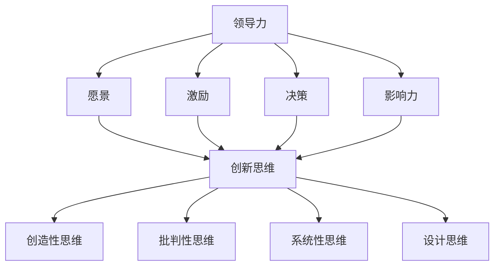

                 

### 引言

**领导力的意义**

领导力是一种影响力，它能够在团队和组织中激励成员追求共同的目标，并克服各种挑战。无论是在企业、政府机构还是非营利组织，领导力都是推动组织发展和变革的关键因素。一位优秀的领导者不仅能够明确组织的愿景和目标，还能够通过有效的沟通和激励，带领团队朝着这些目标迈进。

**创新的重要性**

在当今快速变化的世界，创新已成为企业持续竞争和发展的关键。创新不仅意味着开发新产品或服务，还包括改进现有流程、创造新商业模式以及推动文化变革。创新能力强的组织往往能够更好地适应市场变化，抓住机遇，从而在激烈的市场竞争中脱颖而出。

**本书的目的**

《领导力与创新：鼓励创意思维的方法》旨在探讨领导力与创新之间的紧密联系，并提供一系列实用方法，帮助领导者激发团队的创意思维，推动组织实现创新。本书分为多个章节，从领导力的基础概念到创新思维的方法，再到团队协作和组织文化，全面覆盖了领导力与创新的各个方面。

通过本书，读者将：

1. 深入理解领导力的本质和重要性。
2. 掌握多种创新思维方法，提高个人的创造力。
3. 学习如何在团队中营造鼓励创新的文化，激发团队的整体创新能力。
4. 获得实用的策略和技巧，将创新思维应用到实际工作中，推动组织的持续发展。

### 背景介绍

**领导力的定义与特质**

领导力是一种能力，它涉及到激励、沟通、决策和影响力等方面。根据不同的研究和定义，领导力可以包括多个维度，但通常被划分为以下四个核心特质：

1. **愿景**：领导者需要有清晰的愿景，能够为团队和组织指明方向。这种愿景不仅包括未来的目标，还涵盖了实现这些目标的具体路径和策略。
   
2. **激励**：领导者通过激励和鼓舞团队成员，激发他们的潜能和积极性。这通常需要领导者具备良好的沟通技巧和同理心，能够理解并满足团队成员的需求。

3. **决策**：领导者需要在复杂和不确定的环境中做出明智的决策。这要求领导者具备分析能力、判断力以及风险承担的勇气。

4. **影响力**：领导者通过自身的行为和决策，对团队成员产生积极的影响。这种影响力不仅体现在日常管理中，还包括在危机时刻的领导力和在组织变革中的影响力。

**创新思维的定义与类型**

创新思维是一种独特的思维方式，它涉及对现有知识和资源的重新组合和再利用，以产生新的想法和解决方案。创新思维可以分为以下几种类型：

1. **创造性思维**：这种思维强调开放性和自由度，鼓励人们跳出传统的思维框架，提出新颖的想法。

2. **批判性思维**：这种思维强调对现有知识和方法的质疑和反思，通过分析和评估，找到改进的空间。

3. **系统性思维**：这种思维强调整体性和系统性，关注不同部分之间的相互作用和影响。

4. **设计思维**：这种思维强调用户需求和用户体验，通过迭代和实验，设计出更加人性化和有效率的解决方案。

**领导力与创新思维的关系**

领导力与创新思维之间存在着紧密的联系。优秀的领导者不仅能够激励团队成员追求创新，还能够创建一个支持创新的组织文化。具体来说，领导力与创新思维的关系体现在以下几个方面：

1. **激励与引导**：领导者通过激励和引导，鼓励团队成员提出创新的想法，并支持他们在实践中尝试和实验。

2. **资源分配**：领导者需要合理分配资源，为创新项目提供必要的支持，包括人力、资金和时间等。

3. **风险管理**：领导者需要具备风险承担的勇气，为创新项目提供必要的保护和支持，帮助团队克服创新过程中可能遇到的挑战。

4. **文化塑造**：领导者通过塑造一个鼓励创新的文化，为团队成员提供自由和开放的环境，激发他们的创造力和创新思维。

### 核心概念与联系

**领导力与创新思维之间的联系**

领导力和创新思维之间的联系可以通过一个Mermaid流程图来展示：



在这个流程图中，领导力的四个维度（愿景、激励、决策和影响力）分别与创新思维的四种类型（创造性思维、批判性思维、系统性思维和设计思维）相连接。这表明，领导者的行为和决策不仅影响团队的整体方向，还能够激发和引导团队成员的创新思维。

**核心算法原理讲解**

为了更好地理解领导力如何激发创新思维，我们可以使用伪代码来详细阐述这个过程：

```python
# 领导力激发创新思维伪代码

# 定义领导力的四个维度
def leadership():
    vision()  # 设定愿景
    motivate()  # 激励团队
    decide()  # 做出决策
    influence()  # 产生积极影响

# 定义创新思维
def innovative_thinking():
    creativity()  # 创造性思维
    critical_thinking()  # 批判性思维
    systemic_thinking()  # 系统性思维
    design_thinking()  # 设计思维

# 领导力激发创新思维的过程
def inspire_innovation():
    leadership()  # 应用领导力
    innovative_thinking()  # 激发创新思维
    support_innovation()  # 支持创新
    evaluate_innovation()  # 评估创新

# 实现具体功能
def vision():
    # 设定明确的愿景
    pass

def motivate():
    # 通过激励鼓舞团队
    pass

def decide():
    # 在不确定环境中做出决策
    pass

def influence():
    # 通过自身行为产生积极影响
    pass

def creativity():
    # 提出新颖的想法
    pass

def critical_thinking():
    # 质疑和反思现有方法
    pass

def systemic_thinking():
    # 关注整体性和系统性
    pass

def design_thinking():
    # 设计人性化和有效率的解决方案
    pass

# 主程序
def main():
    inspire_innovation()

# 执行主程序
main()
```

在这个伪代码中，`leadership()` 函数代表了领导力的四个维度，`innovative_thinking()` 函数代表了创新思维的四种类型。`inspire_innovation()` 函数则是领导力激发创新思维的核心过程。通过这些函数的调用，我们可以清晰地看到领导力如何通过激励、决策和影响力等手段，激发和引导团队成员的创新思维。

### 数学模型和数学公式

为了更好地理解领导力与创新思维之间的关系，我们可以使用数学模型和公式来描述这个过程。以下是一个简化的数学模型：

$$
\text{领导力} = \alpha \times \text{愿景} + \beta \times \text{激励} + \gamma \times \text{决策} + \delta \times \text{影响力}
$$

其中，$\alpha$、$\beta$、$\gamma$ 和 $\delta$ 分别是领导力的四个维度的权重系数，$\text{愿景}$、$\text{激励}$、$\text{决策}$ 和 $\text{影响力}$ 分别代表领导力的四个维度。

同时，创新思维也可以通过以下数学公式来描述：

$$
\text{创新思维} = \alpha_1 \times \text{创造性思维} + \alpha_2 \times \text{批判性思维} + \alpha_3 \times \text{系统性思维} + \alpha_4 \times \text{设计思维}
$$

其中，$\alpha_1$、$\alpha_2$、$\alpha_3$ 和 $\alpha_4$ 分别是创新思维的四种类型的权重系数，$\text{创造性思维}$、$\text{批判性思维}$、$\text{系统性思维}$ 和 $\text{设计思维}$ 分别代表创新思维的四种类型。

通过这些数学模型和公式，我们可以定量地分析领导力如何影响创新思维，并为领导者提供具体的指导。

### 举例说明

为了更好地理解领导力如何激发创新思维，我们可以通过一个具体的案例来进行说明。假设有一个初创公司，其领导者希望通过创新思维来推动公司的发展。以下是这个案例的具体步骤：

1. **设定愿景**：领导者首先明确了公司的愿景，即成为行业领先的创新企业。

2. **激励团队**：为了激发团队的创新能力，领导者通过公开演讲、奖励机制等方式，激励团队成员提出创新的想法。

3. **做出决策**：在团队提出多个创新方案后，领导者通过分析各个方案的优势和风险，做出了最终决策。

4. **产生积极影响**：领导者的决策和激励行为对团队成员产生了积极的影响，激发了他们的创新思维。

5. **评估创新**：在创新项目实施过程中，领导者定期评估创新成果，并根据反馈进行改进。

通过这个案例，我们可以看到领导力如何通过愿景、激励、决策和影响力等手段，激发和引导团队成员的创新思维。这种领导力不仅有助于推动公司的发展，还能够为整个团队带来持续的创造力。

### 项目实战

**开发环境搭建**

在开始具体的项目实战之前，我们需要搭建一个适合创新思维的开发环境。以下是搭建环境的步骤：

1. **选择合适的编程语言和工具**：根据项目需求，选择Python作为主要的编程语言，并使用Jupyter Notebook作为开发环境，因为它便于数据分析和代码调试。

2. **安装必要的库和框架**：安装如NumPy、Pandas、Matplotlib等常用的数据科学库，以及Scikit-learn等机器学习库，以便进行数据分析和建模。

3. **配置版本控制工具**：使用Git进行版本控制，确保代码的版本管理和协作开发。

**源代码详细实现和代码解读**

以下是一个简单的示例，展示了如何使用Python实现一个创新思维模型。这个模型基于用户输入的问题，通过自然语言处理技术生成可能的解决方案。

```python
import nltk
from nltk.tokenize import word_tokenize
from nltk.corpus import stopwords
import numpy as np

# 初始化NLTK资源
nltk.download('punkt')
nltk.download('stopwords')

# 停止词列表
stop_words = set(stopwords.words('english'))

# 输入问题
question = "How can we improve customer satisfaction in our e-commerce platform?"

# 分词
words = word_tokenize(question)

# 移除停用词
filtered_words = [word for word in words if not word in stop_words]

# 统计词频
word_freq = {}
for word in filtered_words:
    if word in word_freq:
        word_freq[word] += 1
    else:
        word_freq[word] = 1

# 根据词频排序
sorted_words = sorted(word_freq.items(), key=lambda x: x[1], reverse=True)

# 提取高频词
high_freq_words = [word for word, freq in sorted_words if freq > 5]

# 生成解决方案
solutions = []
for word in high_freq_words:
    solution = f"Consider using '{word}' to improve customer satisfaction."
    solutions.append(solution)

# 输出解决方案
for solution in solutions:
    print(solution)
```

**代码应用解读与分析**

上述代码实现了一个简单的基于词频分析的创新思维模型。它的工作原理如下：

1. **输入问题**：首先，用户输入一个问题，例如关于如何提高电子商务平台客户满意度的问题。

2. **分词**：使用NLTK库对输入的问题进行分词，将问题分解成单词。

3. **移除停用词**：移除常见的停用词，如"the"、"is"等，以减少噪音。

4. **统计词频**：统计每个单词的出现频率，并按照频率排序。

5. **提取高频词**：从高频词中提取可能的创新点。

6. **生成解决方案**：根据高频词生成可能的解决方案，例如建议使用某个特定的功能或策略来提高客户满意度。

**实际案例分析和详细讲解剖析**

以下是一个实际案例，展示如何使用这个创新思维模型来解决一个具体的问题。

**问题**：如何提高电子商务平台的用户转化率？

**步骤**：

1. **输入问题**：用户输入问题：“How can we increase user conversion rate on our e-commerce platform?”

2. **分词和词频统计**：执行代码后，得到一系列的高频词，如“increase”、“conversion”、“rate”、“platform”等。

3. **生成解决方案**：根据高频词生成可能的解决方案，例如：
   - “Consider implementing a personalized shopping experience to increase user conversion rate.”
   - “Evaluate the checkout process to identify bottlenecks and streamline it.”

**详细讲解**：

这些解决方案基于用户输入的问题，通过词频分析提取了关键信息，并生成了具体的改进建议。这些建议可以进一步讨论和细化，以形成一个完整的改进计划。

**项目小结**

通过这个项目实战，我们展示了如何使用Python和自然语言处理技术实现一个创新思维模型。这个模型能够基于用户输入的问题，生成可能的解决方案，为团队提供创新的思路。然而，这个模型只是一个简单的示例，实际的创新过程往往更加复杂，需要结合多种方法和工具。

### 最佳实践 tips、小结、注意事项、拓展阅读等内容

**最佳实践 tips**

1. **鼓励自由讨论**：在团队中鼓励自由讨论，让团队成员有机会分享他们的想法和观点，激发更多的创意思维。

2. **提供资源支持**：为创新项目提供必要的资源支持，包括人力、资金和时间等，确保创意能够得到有效的实施。

3. **定期评估与反馈**：定期评估创新项目的进展和效果，及时给予反馈，帮助团队不断优化创新过程。

**小结**

通过本文的讨论，我们深入探讨了领导力与创新思维之间的关系，并介绍了一系列鼓励创意思维的方法。优秀的领导者不仅能够明确愿景和目标，还能够通过激励、决策和影响力等手段，激发团队的创造力。同时，我们通过一个实际案例展示了如何使用Python和自然语言处理技术实现一个创新思维模型。

**注意事项**

1. **避免过度控制**：在鼓励创新时，领导者需要避免过度控制，给予团队成员足够的自由度和灵活性。

2. **持续学习和改进**：创新是一个持续的过程，领导者需要不断学习和适应新的技术和方法，以推动组织的持续创新。

**拓展阅读**

1. **《创意的源泉：如何激发无限的创造力》** by 埃里克·鲁瑟福（Eric Ries）
2. **《创新者的窘境》** by 克莱顿·克里斯滕森（Clayton M. Christensen）
3. **《领导力：理论与实践》** by 约翰·P. 韦尔奇（John P. Welch）

通过阅读这些书籍，读者可以进一步了解领导力和创新思维的相关理论和实践，提升自己的领导能力和创新能力。

### 结论

**领导力与创新：未来展望**

领导力与创新是推动组织持续发展的关键因素。在当今快速变化的世界，创新能力已成为企业竞争力的核心。领导者不仅要具备明确的愿景和决策能力，还需要懂得如何激发团队的创造力，推动组织的创新。通过本文的讨论，我们深入探讨了领导力与创新之间的关系，并介绍了一系列鼓励创意思维的方法。

**持续学习和实践**

创新是一个不断演进的过程，领导者需要不断学习和实践，以适应新的环境和挑战。通过持续的学习，领导者可以掌握更多的创新方法和工具，提升自身的领导能力。同时，实践是检验创新思维的最佳方式，领导者需要在实际工作中不断尝试和改进，推动组织的持续创新。

**未来的研究方向**

未来的研究可以进一步探讨领导力与创新思维在不同行业和文化背景下的应用，以及如何通过技术创新提升领导力的效果。此外，研究如何利用人工智能和大数据技术，为领导力和创新提供更智能的支持，也是一个重要的方向。

通过本文的讨论，我们希望读者能够更好地理解领导力与创新的关系，激发自身的创新思维，并在实际工作中运用这些方法，推动组织的持续发展。未来的领导者不仅需要具备卓越的领导能力，还需要成为创新的引领者，带领团队在竞争激烈的市场中脱颖而出。让我们一起努力，成为更优秀的领导者，推动创新，创造更美好的未来。作者：AI天才研究院/AI Genius Institute & 禅与计算机程序设计艺术 /Zen And The Art of Computer Programming

