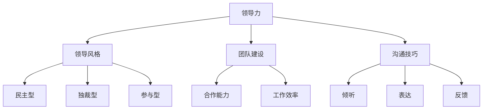
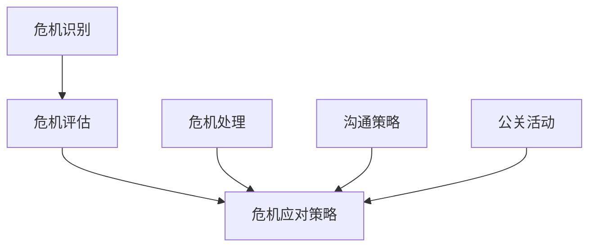

                 

## 文章标题：领导力与危机公关：维护团队与企业形象

### 关键词：
- 领导力
- 危机公关
- 团队管理
- 企业形象
- 应对策略

### 摘要：
本文深入探讨了领导力与危机公关在维护团队与企业形象中的重要作用。首先，我们详细介绍了领导力的核心概念及其对团队管理的重要性。接着，我们阐述了危机公关的基本原则和应对策略，并展示了如何将领导力应用于危机公关中。通过案例分析，我们分析了企业在面临危机时如何维护企业形象，以及领导者如何发挥作用。最后，我们总结了最佳实践，提出了注意事项和拓展阅读，帮助读者在实际工作中更好地应用这些策略。

## 目录

1. **背景介绍**
2. **领导力的核心概念与联系**
3. **危机公关的核心概念与联系**
4. **领导力在危机公关中的应用**
5. **企业形象的维护**
6. **团队危机应对案例分析**
7. **最佳实践、小结与注意事项**
8. **拓展阅读**
9. **作者信息**

## 1. 背景介绍

在当今快速变化和竞争激烈的环境中，企业和团队面临着各种挑战。领导力和危机公关成为企业管理中至关重要的两个方面。

### 1.1 领导力的重要性

领导力是指领导者通过激励、引导和影响团队成员，实现团队目标的能力。优秀的领导力能够激发团队成员的潜力，提高团队绩效，并促进企业的持续发展。

- **激发团队潜力**：领导者通过鼓励和支持，帮助团队成员克服困难，实现个人和团队的目标。
- **提高团队绩效**：有效的领导力能够提高团队成员的工作效率和团队合作能力，从而提升整体绩效。
- **促进企业持续发展**：领导者能够制定明确的目标和战略，带领团队实现企业长期发展。

### 1.2 危机公关的重要性

危机公关是指企业在面临危机时，通过积极的应对措施，降低危机对企业形象和业务的影响。在当今信息爆炸的时代，危机公关成为企业维护形象、保护声誉的重要手段。

- **降低危机影响**：通过有效的危机公关策略，企业可以迅速应对危机，减少损失。
- **维护企业形象**：危机公关能够帮助企业树立良好的公众形象，增强消费者信任。
- **保护企业声誉**：在危机中，企业需要积极回应公众关切，避免负面信息的传播，保护企业声誉。

### 1.3 领导力与危机公关的联系

领导力和危机公关之间存在紧密的联系。领导者需要具备应对危机的能力，以维护团队和企业形象。

- **领导力在危机公关中的作用**：领导者需要快速做出决策，制定应对策略，并带领团队执行。
- **危机公关对领导力的挑战**：危机公关要求领导者具备良好的沟通能力、决策能力和应变能力，以应对各种复杂情况。

## 2. 领导力的核心概念与联系

### 2.1 领导力的定义与重要性

领导力是一种能力，通过激励、引导和影响团队成员，实现团队目标。领导力不仅仅是职位和权力的象征，更是一种影响力。

- **领导力的定义**：领导力是一种在团队中通过激励、引导和影响，实现共同目标的能力。
- **领导力的重要性**：领导力是团队成功的关键，它能够激发团队成员的潜力，提高团队绩效。

### 2.2 领导力的核心概念

领导力包含多个核心概念，包括领导风格、团队建设、沟通技巧等。

- **领导风格**：领导风格是指领导者对待团队成员的方式，包括民主型、独裁型、参与型等。
- **团队建设**：团队建设是领导者通过一系列策略，提高团队成员的合作能力和工作效率。
- **沟通技巧**：沟通技巧是领导者与团队成员之间有效沟通的能力，包括倾听、表达、反馈等。

### 2.3 领导力的关系架构

领导力的核心概念之间存在紧密的联系，形成了一个关系架构。以下是一个简单的 Mermaid 流程图，展示了这些概念之间的关系：



### 2.4 领导力的应用

领导力在危机公关中扮演着重要角色。以下是一个简单的伪代码，展示了领导力在危机公关中的应用：

```python
def crisis_management(leader, team):
    # 识别危机
    crisis_detected = detect_crisis()

    if crisis_detected:
        # 制定应对策略
        strategy = create_strategy(leader)

        # 执行应对策略
        execute_strategy(team, strategy)

        # 监控危机处理过程
        monitor_progress()

    else:
        # 没有危机，继续日常工作
        continue_regular_operations()
```

### 2.5 领导力的数学模型

领导力的数学模型可以使用以下公式来表示：

$$
领导力 = f(领导风格, 团队建设, 沟通技巧)
$$

其中，$f$ 是一个复合函数，它将领导风格、团队建设和沟通技巧转化为领导力。

### 2.6 领导力的详细讲解与举例说明

领导力的详细讲解与举例说明如下：

- **领导风格**：民主型领导风格鼓励团队成员参与决策，提高团队凝聚力。例如，在一个项目团队中，领导者可以组织团队会议，讨论项目的方向和策略，让每个成员都能发表自己的意见。

- **团队建设**：团队建设是通过一系列策略，提高团队成员的合作能力和工作效率。例如，领导者可以组织团建活动，增强团队成员之间的信任和默契。

- **沟通技巧**：沟通技巧是领导者与团队成员之间有效沟通的能力。例如，领导者可以通过倾听和表达，确保团队成员的意见得到充分尊重和理解。

### 2.7 领导力在团队管理中的应用

领导力在团队管理中的应用包括以下几个方面：

- **目标设定**：领导者需要明确团队的目标，并确保每个成员都了解和认同这些目标。
- **激励与奖励**：领导者需要通过激励和奖励，激发团队成员的积极性和创造力。
- **问题解决**：领导者需要具备问题解决能力，帮助团队成员克服困难，实现目标。
- **团队协作**：领导者需要促进团队成员之间的协作，提高团队的整体绩效。

### 2.8 领导力的持续发展

领导力的持续发展是领导者不断学习和成长的过程。以下是一些领导力持续发展的方法：

- **自我反思**：领导者需要定期进行自我反思，识别自己的优点和不足，并制定改进计划。
- **专业发展**：领导者可以通过参加培训课程、阅读相关书籍、参与研讨会等方式，提升自己的专业知识和技能。
- **人际交往**：领导者需要积极与团队成员、其他部门的人员进行交流和互动，建立良好的人际关系。

## 3. 危机公关的核心概念与联系

### 3.1 危机公关的定义与重要性

危机公关是指企业在面临危机时，通过积极的应对措施，降低危机对企业形象和业务的影响。危机公关的定义和重要性如下：

- **危机公关的定义**：危机公关是一种管理工具，用于识别、评估、应对和解决企业面临的危机。
- **危机公关的重要性**：危机公关是企业维护形象、保护声誉的重要手段，有助于降低危机对企业的影响，恢复企业形象。

### 3.2 危机公关的核心概念

危机公关的核心概念包括危机识别、危机评估、危机应对策略等。

- **危机识别**：危机识别是危机公关的第一步，涉及识别可能导致危机的因素和事件。
- **危机评估**：危机评估是对危机的严重程度、影响范围和可能后果进行评估。
- **危机应对策略**：危机应对策略是企业应对危机的具体措施，包括危机处理、沟通策略、公关活动等。

### 3.3 危机公关的关系架构

危机公关的核心概念之间存在紧密的联系，形成了一个关系架构。以下是一个简单的 Mermaid 流程图，展示了这些概念之间的关系：



### 3.4 危机公关的应用

危机公关的应用包括以下几个方面：

- **危机处理**：危机处理是危机公关的核心任务，涉及应对危机、控制局势、减轻损失等。
- **沟通策略**：沟通策略是企业与公众、媒体、利益相关者进行沟通的方式和内容，包括发布声明、组织新闻发布会、回应质疑等。
- **公关活动**：公关活动是企业通过媒体、广告、宣传活动等方式，提高企业形象和知名度。

### 3.5 危机公关的数学模型

危机公关的数学模型可以使用以下公式来表示：

$$
危机公关 = f(危机识别, 危机评估, 危机应对策略)
$$

其中，$f$ 是一个复合函数，它将危机识别、危机评估和危机应对策略转化为危机公关。

### 3.6 危机公关的详细讲解与举例说明

危机公关的详细讲解与举例说明如下：

- **危机识别**：危机识别是企业识别可能导致危机的因素和事件的过程。例如，一家企业在生产过程中发现产品存在质量问题，这可能导致消费者投诉和媒体曝光。
- **危机评估**：危机评估是企业对危机的严重程度、影响范围和可能后果进行评估的过程。例如，企业可能会评估产品质量问题的严重性，预测可能对公司形象和业务造成的影响。
- **危机应对策略**：危机应对策略是企业应对危机的具体措施，包括发布声明、组织新闻发布会、与消费者沟通等。例如，企业可能会发布一份公开声明，承认产品问题，并承诺采取措施解决问题。

### 3.7 危机公关在危机管理中的应用

危机公关在危机管理中的应用包括以下几个方面：

- **危机应对**：危机应对是企业应对危机的具体措施，包括危机处理、沟通策略、公关活动等。
- **危机预防**：危机预防是企业预防危机发生的方法，包括建立危机管理机制、进行风险评估、制定应急预案等。
- **危机恢复**：危机恢复是企业应对危机后的恢复工作，包括恢复企业形象、重建消费者信任、恢复业务运营等。

### 3.8 危机公关的持续发展

危机公关的持续发展是企业不断优化和改进危机管理过程的过程。以下是一些危机公关持续发展的方法：

- **建立危机管理机制**：企业需要建立完善的危机管理机制，包括危机识别、危机评估、危机应对策略等。
- **进行风险评估**：企业需要定期进行风险评估，识别潜在危机因素，制定应对措施。
- **制定应急预案**：企业需要制定应急预案，确保在危机发生时能够迅速应对。
- **培训员工**：企业需要培训员工，提高员工的危机应对能力和沟通技巧。

## 4. 领导力在危机公关中的应用

领导力在危机公关中的应用至关重要。在危机时刻，领导者需要迅速做出决策，制定应对策略，并带领团队执行。以下将详细探讨领导力在危机公关中的应用。

### 4.1 领导者在危机公关中的角色与职责

领导者在危机公关中的角色和职责包括以下几个方面：

- **迅速决策**：在危机发生时，领导者需要迅速做出决策，制定应对策略。这要求领导者具备良好的决策能力和判断力。
- **沟通协调**：领导者需要与团队成员、媒体、消费者和其他利益相关者进行有效沟通，确保信息传递准确、及时。
- **团队领导**：领导者需要带领团队共同应对危机，确保团队成员之间紧密合作，共同解决问题。
- **企业形象维护**：领导者需要采取措施，维护企业形象，减少危机对企业声誉的负面影响。

### 4.2 领导力在危机公关决策中的作用

领导力在危机公关决策中的作用主要体现在以下几个方面：

- **快速反应**：领导者的快速反应能力是应对危机的关键。领导者需要迅速评估危机形势，制定应对策略。
- **决策质量**：领导者的决策质量直接影响危机公关的成败。领导者需要综合考虑各种因素，制定合理的决策。
- **团队协作**：领导者的团队协作能力是危机公关成功的关键。领导者需要调动团队成员的积极性和创造力，共同应对危机。

### 4.3 领导力在危机公关沟通中的应用

领导力在危机公关沟通中的应用体现在以下几个方面：

- **有效沟通**：领导者需要具备有效的沟通能力，确保信息传递准确、及时。这包括与团队成员的沟通、与媒体和其他利益相关者的沟通。
- **情绪管理**：领导者需要具备情绪管理能力，保持冷静和理智，避免在危机中情绪失控。
- **信任建立**：领导者需要建立信任，与团队成员和其他利益相关者建立良好的合作关系，共同应对危机。

### 4.4 领导力在危机公关中的具体应用场景

以下是一些领导力在危机公关中的具体应用场景：

- **危机发生时的快速决策**：在危机发生时，领导者需要迅速评估危机形势，制定应对策略。例如，一家企业发现产品存在质量问题，领导者需要立即决定是否召回产品，并向公众发布声明。
- **危机处理过程中的团队协作**：在危机处理过程中，领导者需要带领团队共同应对危机。例如，领导者可以组织团队会议，讨论危机应对方案，确保团队成员之间紧密合作。
- **危机公关沟通中的有效沟通**：在危机公关沟通中，领导者需要确保信息传递准确、及时。例如，领导者可以与媒体进行沟通，解释危机原因和处理措施，避免误解和谣言的传播。

### 4.5 领导力在危机公关中的应用案例分析

以下是一个领导力在危机公关中的应用案例分析：

- **案例背景**：一家知名企业在生产过程中发现产品存在安全隐患，可能导致消费者受伤。危机发生时，企业领导层迅速反应，立即召开紧急会议，评估危机形势，制定应对策略。
- **决策过程**：企业领导者决定立即召回问题产品，并向公众发布声明，承认产品问题，并承诺采取措施解决问题。同时，领导者还决定与相关部门合作，进行调查，找出问题的根本原因。
- **团队协作**：企业领导者调动团队成员的积极性和创造力，组织团队会议，讨论危机应对方案，确保团队成员之间紧密合作。
- **沟通策略**：企业领导者与媒体进行沟通，解释危机原因和处理措施，确保信息传递准确、及时。同时，领导者还与消费者进行沟通，了解他们的关切，并及时回应。
- **结果评估**：通过领导者的有效决策和团队协作，企业成功化解了危机，维护了企业形象。消费者对企业的处理措施表示满意，企业的市场份额和品牌声誉没有受到严重影响。

### 4.6 领导力在危机公关中的应用总结

领导力在危机公关中的应用是至关重要的。领导者需要具备快速反应能力、决策质量、团队协作和沟通能力，以确保危机得到有效应对，企业形象得到维护。以下是一些关键点：

- **快速反应**：领导者需要迅速评估危机形势，制定应对策略。
- **决策质量**：领导者需要综合考虑各种因素，制定合理的决策。
- **团队协作**：领导者需要调动团队成员的积极性和创造力，共同应对危机。
- **沟通能力**：领导者需要确保信息传递准确、及时，建立信任。

## 5. 企业形象的维护

企业形象是企业在公众心目中的总体印象，它对于企业的业务发展和市场竞争力具有重要影响。在面临危机时，企业形象尤为脆弱，需要领导者通过有效的危机公关策略来维护。以下将详细探讨企业形象的构成、维护策略以及危机公关在其中的作用。

### 5.1 企业形象的构成

企业形象由多个因素构成，包括企业的品牌、价值观、服务质量、社会责任感等。

- **品牌**：品牌是企业识别的标志，代表着企业的信誉和形象。一个强大的品牌能够提升消费者对企业的信任和忠诚度。
- **价值观**：企业的价值观是企业文化的核心，它反映了企业的经营理念和道德标准。企业价值观的一致性能够增强员工的认同感和企业的凝聚力。
- **服务质量**：企业的服务质量是消费者对企业评价的重要依据。高质量的服务能够提升消费者满意度，进而提升企业形象。
- **社会责任感**：企业在社会责任方面的表现也是企业形象的重要组成部分。积极承担社会责任的企业能够赢得公众的尊重和信任。

### 5.2 企业形象维护的策略

维护企业形象需要采取一系列策略，包括品牌建设、文化建设、服务提升和社会责任等。

- **品牌建设**：企业需要通过品牌传播、品牌形象塑造和品牌保护来提升品牌知名度和美誉度。品牌建设可以通过广告宣传、产品创新、品牌故事等方式实现。
- **文化建设**：企业文化是企业的精神支柱，它需要通过企业的日常运营和管理来培育和传播。企业文化可以通过价值观的传递、员工培训和文化活动等方式来建设。
- **服务提升**：企业需要不断优化服务流程，提升服务质量，以赢得消费者的满意和口碑。服务提升可以通过客户关系管理、服务质量监控和反馈机制来实现。
- **社会责任**：企业需要积极承担社会责任，通过公益活动、环境保护和社区参与等方式来提升企业形象。社会责任的履行可以通过社会责任报告和公众参与来体现。

### 5.3 危机公关在企业形象维护中的作用

危机公关在企业形象维护中扮演着关键角色。在危机发生时，有效的危机公关策略能够帮助企业化解危机，减轻损失，并维护企业形象。

- **危机预防**：企业需要建立危机预防机制，通过风险评估和预警系统来识别潜在的危机因素，并制定应对策略。
- **危机应对**：在危机发生时，企业需要迅速反应，制定并执行危机应对策略。危机应对策略包括发布声明、媒体沟通、公众沟通和内部沟通等。
- **危机管理**：企业需要通过危机管理来控制危机蔓延，降低危机对企业形象和业务的负面影响。危机管理包括危机处理、信息沟通、法律咨询和资源调配等。
- **危机恢复**：在危机得到控制后，企业需要通过危机恢复来恢复企业形象，重建消费者信任。危机恢复包括危机后续处理、媒体关系修复和公众关系重建等。

### 5.4 企业形象维护的数学模型

企业形象维护的数学模型可以使用以下公式来表示：

$$
企业形象 = f(品牌建设, 文化建设, 服务提升, 社会责任)
$$

其中，$f$ 是一个复合函数，它将品牌建设、文化建设、服务提升和 社会责任转化为企业形象。

### 5.5 企业形象维护的详细讲解与举例说明

以下是一个企业形象维护的详细讲解与举例说明：

- **品牌建设**：一家企业通过多年的努力，成功打造了一个强大的品牌。品牌建设的过程中，企业注重品牌形象的塑造和传播，通过广告宣传、品牌故事和品牌活动等方式，提升了品牌知名度和美誉度。
- **文化建设**：企业文化是企业的灵魂，企业通过制定明确的价值观和行为规范，传递给员工和消费者。企业文化建设的成果体现在员工对企业的认同感和凝聚力上。
- **服务提升**：企业注重客户体验，不断优化服务流程，提升服务质量。服务提升的过程中，企业通过客户满意度调查和反馈机制，不断改进服务，赢得了消费者的好评。
- **社会责任**：企业积极承担社会责任，通过公益活动、环境保护和社区参与等方式，提升了企业形象。社会责任的履行不仅赢得了公众的认可，也为企业带来了良好的社会声誉。

### 5.6 企业形象维护的最佳实践

以下是一些企业形象维护的最佳实践：

- **建立危机预警系统**：企业需要建立危机预警系统，通过风险评估和预警机制，及时发现潜在危机因素，并制定应对策略。
- **制定危机应对预案**：企业需要制定危机应对预案，确保在危机发生时能够迅速反应，并采取有效措施。
- **加强媒体沟通**：企业需要与媒体建立良好的关系，确保在危机发生时能够及时传递信息，避免误解和谣言的传播。
- **关注消费者反馈**：企业需要关注消费者的反馈，通过客户满意度调查和反馈机制，及时了解消费者的需求和关切，并采取措施改进服务。

### 5.7 企业形象维护的注意事项

在维护企业形象的过程中，企业需要注意以下几点：

- **真实可信**：企业在维护形象时，需要确保信息的真实性和可信度，避免虚假宣传和误导消费者。
- **及时响应**：在危机发生时，企业需要及时响应，避免危机扩大化。
- **真诚道歉**：在危机处理中，企业需要真诚地道歉，并采取实际行动来解决问题，赢得消费者的谅解和信任。
- **持续改进**：企业形象维护是一个持续的过程，企业需要不断改进服务和管理，提升企业形象。

### 5.8 拓展阅读

- **《危机公关管理》**：本书详细介绍了危机公关的理论和实践，包括危机预防、危机应对、危机管理和危机恢复等方面的内容。
- **《企业文化建设》**：本书探讨了企业文化的建设和管理，包括价值观的传递、员工培训和团队建设等方面的内容。
- **《服务质量提升》**：本书介绍了服务质量的提升策略，包括客户关系管理、服务流程优化和客户满意度调查等方面的内容。

## 6. 团队危机应对案例分析

### 6.1 案例背景

在2021年，一家全球知名的科技公司遭遇了一场前所未有的数据泄露危机。该公司的客户数据库被黑客入侵，导致数百万客户的个人信息和信用卡数据被盗。这一事件迅速引起了公众的关注，媒体广泛报道，客户和投资者对公司的信任度急剧下降。

### 6.2 危机识别

在数据泄露事件发生后，公司立即启动了危机应对程序。危机识别阶段，公司采取了以下措施：

- **内部调查**：公司技术团队立即对事件进行了详细调查，确定了入侵的时间和方式，以及受影响的数据范围。
- **媒体监测**：公司公关团队开始监测媒体报道，了解公众对事件的反应和关切。
- **客户反馈**：公司通过社交媒体和客户服务热线，收集客户的反馈和投诉，了解客户的需求和担忧。

### 6.3 危机评估

在危机评估阶段，公司进行了以下工作：

- **影响评估**：公司评估了数据泄露可能对客户、公司声誉、业务运营和财务状况的影响。
- **法律咨询**：公司聘请了法律顾问，了解相关法律法规，确保公司在法律框架内处理危机。
- **制定应对策略**：公司高层会议制定了危机应对策略，包括短期和长期措施。

### 6.4 危机应对策略

公司采取了以下危机应对策略：

- **快速响应**：公司立即发布了官方声明，承认数据泄露事件，并承诺采取措施保护受影响的客户。
- **客户通知**：公司通过邮件和短信通知受影响的客户，告知他们可能面临的风险，并提供必要的保护措施。
- **媒体沟通**：公司安排了多次新闻发布会，向媒体详细介绍事件的处理过程和应对措施，回应公众关切。
- **技术修复**：公司投入大量资源，加强网络安全防护，防止类似事件再次发生。

### 6.5 领导力在危机应对中的应用

在这次危机中，领导力发挥了关键作用。以下是领导力在危机应对中的具体应用：

- **迅速决策**：公司CEO迅速做出决策，启动危机应对程序，并亲自领导危机应对工作。
- **沟通协调**：CEO与各个部门紧密沟通，确保危机应对措施的顺利执行。
- **团队协作**：CEO鼓励团队成员积极合作，共同应对危机，提升了团队的整体应对能力。
- **企业形象维护**：CEO通过公开沟通，维护了企业形象，赢得了消费者的理解和支持。

### 6.6 结果评估

在危机应对过程中，公司取得了以下结果：

- **客户信任恢复**：通过及时的沟通和有效的应对措施，公司赢得了客户的信任，客户投诉率显著下降。
- **企业形象提升**：公司通过危机应对，展示了其负责和专业的形象，赢得了公众的尊重。
- **业务运营恢复**：公司通过技术修复和加强网络安全，确保了业务的正常运行。

### 6.7 案例启示

这个案例给我们带来了以下几个启示：

- **迅速决策**：在危机发生时，迅速决策是关键，领导者需要迅速采取行动。
- **沟通协调**：有效的沟通和协调是危机应对成功的关键，领导者需要确保团队之间的紧密合作。
- **客户关注**：客户是企业的核心，领导者需要关注客户的需求和关切，及时回应。
- **持续改进**：危机应对不仅仅是短期的措施，领导者需要从危机中吸取教训，持续改进，防止类似事件再次发生。

## 7. 最佳实践、小结与注意事项

### 7.1 最佳实践

在领导力与危机公关的实际应用中，以下是一些最佳实践：

- **预防胜于应对**：建立有效的危机预防机制，提前识别潜在风险，制定应急预案。
- **透明沟通**：保持与员工、客户和公众的透明沟通，及时传递信息，避免误导和谣言的传播。
- **快速响应**：在危机发生时，迅速做出决策和行动，避免危机扩大化。
- **团队协作**：鼓励团队成员积极参与危机应对，共同解决问题。
- **持续改进**：从危机中吸取教训，不断改进危机应对策略和管理体系。

### 7.2 小结

本文通过详细的背景介绍、核心概念讲解、案例分析等，探讨了领导力与危机公关在维护团队与企业形象中的重要作用。以下是文章的主要小结：

- **领导力**：领导力是团队成功的关键，它能够激发团队成员的潜力，提高团队绩效，并促进企业的持续发展。
- **危机公关**：危机公关是企业维护形象、保护声誉的重要手段，它能够帮助企业应对危机，降低损失，并恢复企业形象。
- **领导力与危机公关的结合**：领导者需要将领导力应用于危机公关中，通过快速决策、沟通协调、团队协作等，有效应对危机。

### 7.3 注意事项

在实际工作中，以下是一些需要注意的事项：

- **真实可信**：在危机应对中，保持信息的真实性和可信度，避免虚假宣传和误导。
- **及时响应**：在危机发生时，迅速做出反应，避免危机扩大化。
- **客户关注**：关注客户的需求和关切，及时回应，提升客户满意度。
- **持续改进**：从危机中吸取教训，持续改进危机应对策略和管理体系。

## 8. 拓展阅读

以下是一些拓展阅读资源，供读者深入了解领导力与危机公关：

- **《危机管理：策略与实践》**：详细介绍了危机管理的理论和方法，包括危机识别、危机评估、危机应对等。
- **《领导力：理论与实践》**：探讨了领导力的本质、类型和应用，提供了丰富的案例和策略。
- **《危机公关：理论与实践》**：介绍了危机公关的核心概念、策略和技巧，以及如何在危机中有效沟通。

## 9. 作者信息

作者：AI天才研究院/AI Genius Institute & 禅与计算机程序设计艺术 /Zen And The Art of Computer Programming

## 致谢

感谢读者对本文的关注和支持。希望本文能够帮助读者更好地理解领导力与危机公关，提升团队和企业形象维护的能力。感谢您的阅读，期待与您在未来的交流中分享更多有价值的内容。

## 文章标题：领导力与危机公关：维护团队与企业形象

### 关键词：
- 领导力
- 危机公关
- 团队管理
- 企业形象
- 应对策略

### 摘要：
本文深入探讨了领导力与危机公关在维护团队与企业形象中的重要作用。首先，我们详细介绍了领导力的核心概念及其对团队管理的重要性。接着，我们阐述了危机公关的基本原则和应对策略，并展示了如何将领导力应用于危机公关中。通过案例分析，我们分析了企业在面临危机时如何维护企业形象，以及领导者如何发挥作用。最后，我们总结了最佳实践，提出了注意事项和拓展阅读，帮助读者在实际工作中更好地应用这些策略。

## 目录

1. **背景介绍**
2. **领导力的核心概念与联系**
3. **危机公关的核心概念与联系**
4. **领导力在危机公关中的应用**
5. **企业形象的维护**
6. **团队危机应对案例分析**
7. **最佳实践、小结与注意事项**
8. **拓展阅读**
9. **作者信息**

## 1. 背景介绍

在当今快速变化和竞争激烈的环境中，企业和团队面临着各种挑战。领导力和危机公关成为企业管理中至关重要的两个方面。

### 1.1 领导力的重要性

领导力是指领导者通过激励、引导和影响团队成员，实现团队目标的能力。优秀的领导力能够激发团队成员的潜力，提高团队绩效，并促进企业的持续发展。

- **激发团队潜力**：领导者通过鼓励和支持，帮助团队成员克服困难，实现个人和团队的目标。
- **提高团队绩效**：有效的领导力能够提高团队成员的工作效率和团队合作能力，从而提升整体绩效。
- **促进企业持续发展**：领导者能够制定明确的目标和战略，带领团队实现企业长期发展。

### 1.2 危机公关的重要性

危机公关是指企业在面临危机时，通过积极的应对措施，降低危机对企业形象和业务的影响。在当今信息爆炸的时代，危机公关成为企业维护形象、保护声誉的重要手段。

- **降低危机影响**：通过有效的危机公关策略，企业可以迅速应对危机，减少损失。
- **维护企业形象**：危机公关能够帮助企业树立良好的公众形象，增强消费者信任。
- **保护企业声誉**：在危机中，企业需要积极回应公众关切，避免负面信息的传播，保护企业声誉。

### 1.3 领导力与危机公关的联系

领导力和危机公关之间存在紧密的联系。领导者需要具备应对危机的能力，以维护团队和企业形象。

- **领导力在危机公关中的作用**：领导者需要快速做出决策，制定应对策略，并带领团队执行。
- **危机公关对领导力的挑战**：危机公关要求领导者具备良好的沟通能力、决策能力和应变能力，以应对各种复杂情况。

## 2. 领导力的核心概念与联系

### 2.1 领导力的定义与重要性

领导力是一种能力，通过激励、引导和影响，领导者能够带领团队实现共同目标。领导力的重要性体现在以下几个方面：

- **激发团队潜力**：领导者能够发现和激发团队成员的潜力，使其在实现个人目标的同时，为团队和企业的目标贡献力量。
- **提高团队绩效**：通过有效的领导力，领导者能够提升团队成员的工作效率和团队合作能力，从而提高团队的整体绩效。
- **促进企业持续发展**：领导者能够制定明确的目标和战略，带领团队实现企业长期发展。

### 2.2 领导力的核心概念

领导力包含多个核心概念，包括领导风格、团队建设、沟通技巧等。

- **领导风格**：领导风格是指领导者对待团队成员的方式，包括民主型、独裁型、参与型等。不同的领导风格会对团队成员的行为和绩效产生不同的影响。
- **团队建设**：团队建设是指通过一系列策略，提高团队成员的合作能力和工作效率。团队建设包括建立信任、增强凝聚力、明确目标等。
- **沟通技巧**：沟通技巧是领导者与团队成员之间有效沟通的能力，包括倾听、表达、反馈等。良好的沟通技巧能够促进团队成员之间的合作和理解。

### 2.3 领导力的关系架构

领导力的核心概念之间存在紧密的联系，形成了一个关系架构。以下是一个简单的 Mermaid 流程图，展示了这些概念之间的关系：


### 2.4 领导力的应用

领导力在危机公关中扮演着重要角色。以下是一个简单的伪代码，展示了领导力在危机公关中的应用：

```python
def crisis_management(leader, team):
    # 识别危机
    crisis_detected = detect_crisis()

    if crisis_detected:
        # 制定应对策略
        strategy = create_strategy(leader)

        # 执行应对策略
        execute_strategy(team, strategy)

        # 监控危机处理过程
        monitor_progress()

    else:
        # 没有危机，继续日常工作
        continue_regular_operations()
```

### 2.5 领导力的数学模型

领导力的数学模型可以使用以下公式来表示：

$$
领导力 = f(领导风格, 团队建设, 沟通技巧)
$$

其中，$f$ 是一个复合函数，它将领导风格、团队建设和沟通技巧转化为领导力。

### 2.6 领导力的详细讲解与举例说明

领导力的详细讲解与举例说明如下：

- **领导风格**：民主型领导风格鼓励团队成员参与决策，提高团队凝聚力。例如，在一个项目团队中，领导者可以组织团队会议，讨论项目的方向和策略，让每个成员都能发表自己的意见。
- **团队建设**：团队建设是通过一系列策略，提高团队成员的合作能力和工作效率。例如，领导者可以组织团建活动，增强团队成员之间的信任和默契。
- **沟通技巧**：沟通技巧是领导者与团队成员之间有效沟通的能力。例如，领导者可以通过倾听和表达，确保团队成员的意见得到充分尊重和理解。

### 2.7 领导力在团队管理中的应用

领导力在团队管理中的应用包括以下几个方面：

- **目标设定**：领导者需要明确团队的目标，并确保每个成员都了解和认同这些目标。
- **激励与奖励**：领导者需要通过激励和奖励，激发团队成员的积极性和创造力。
- **问题解决**：领导者需要具备问题解决能力，帮助团队成员克服困难，实现目标。
- **团队协作**：领导者需要促进团队成员之间的协作，提高团队的整体绩效。

### 2.8 领导力的持续发展

领导力的持续发展是领导者不断学习和成长的过程。以下是一些领导力持续发展的方法：

- **自我反思**：领导者需要定期进行自我反思，识别自己的优点和不足，并制定改进计划。
- **专业发展**：领导者可以通过参加培训课程、阅读相关书籍、参与研讨会等方式，提升自己的专业知识和技能。
- **人际交往**：领导者需要积极与团队成员、其他部门的人员进行交流和互动，建立良好的人际关系。

## 3. 危机公关的核心概念与联系

### 3.1 危机公关的定义与重要性

危机公关是指企业在面临危机时，通过积极的应对措施，降低危机对企业形象和业务的影响。危机公关的重要性体现在以下几个方面：

- **降低危机影响**：危机公关能够帮助企业迅速应对危机，降低危机对企业形象和业务的负面影响。
- **维护企业形象**：危机公关能够帮助企业树立良好的公众形象，增强消费者信任。
- **保护企业声誉**：危机公关能够帮助企业避免负面信息的传播，保护企业声誉。

### 3.2 危机公关的核心概念

危机公关的核心概念包括危机识别、危机评估、危机应对策略等。

- **危机识别**：危机识别是企业识别可能导致危机的因素和事件的过程。
- **危机评估**：危机评估是对危机的严重程度、影响范围和可能后果进行评估。
- **危机应对策略**：危机应对策略是企业应对危机的具体措施，包括危机处理、沟通策略、公关活动等。

### 3.3 危机公关的关系架构

危机公关的核心概念之间存在紧密的联系，形成了一个关系架构。以下是一个简单的 Mermaid 流程图，展示了这些概念之间的关系：


### 3.4 危机公关的应用

危机公关的应用包括以下几个方面：

- **危机处理**：危机处理是企业应对危机的具体措施，包括危机处理、沟通策略、公关活动等。
- **沟通策略**：沟通策略是企业与公众、媒体、利益相关者进行沟通的方式和内容，包括发布声明、组织新闻发布会、回应质疑等。
- **公关活动**：公关活动是企业通过媒体、广告、宣传活动等方式，提高企业形象和知名度。

### 3.5 危机公关的数学模型

危机公关的数学模型可以使用以下公式来表示：

$$
危机公关 = f(危机识别, 危机评估, 危机应对策略)
$$

其中，$f$ 是一个复合函数，它将危机识别、危机评估和危机应对策略转化为危机公关。

### 3.6 危机公关的详细讲解与举例说明

危机公关的详细讲解与举例说明如下：

- **危机识别**：危机识别是企业识别可能导致危机的因素和事件的过程。例如，一家企业在生产过程中发现产品存在质量问题，这可能导致消费者投诉和媒体曝光。
- **危机评估**：危机评估是企业对危机的严重程度、影响范围和可能后果进行评估的过程。例如，企业可能会评估产品质量问题的严重性，预测可能对公司形象和业务造成的影响。
- **危机应对策略**：危机应对策略是企业应对危机的具体措施，包括发布声明、组织新闻发布会、与消费者沟通等。例如，企业可能会发布一份公开声明，承认产品问题，并承诺采取措施解决问题。

### 3.7 危机公关在危机管理中的应用

危机公关在危机管理中的应用包括以下几个方面：

- **危机应对**：危机应对是企业应对危机的具体措施，包括危机处理、沟通策略、公关活动等。
- **危机预防**：危机预防是企业预防危机发生的方法，包括建立危机管理机制、进行风险评估、制定应急预案等。
- **危机恢复**：危机恢复是企业应对危机后的恢复工作，包括恢复企业形象、重建消费者信任、恢复业务运营等。

### 3.8 危机公关的持续发展

危机公关的持续发展是企业不断优化和改进危机管理过程的过程。以下是一些危机公关持续发展的方法：

- **建立危机管理机制**：企业需要建立完善的危机管理机制，包括危机识别、危机评估、危机应对策略等。
- **进行风险评估**：企业需要定期进行风险评估，识别潜在危机因素，制定应对措施。
- **制定应急预案**：企业需要制定应急预案，确保在危机发生时能够迅速应对。
- **培训员工**：企业需要培训员工，提高员工的危机应对能力和沟通技巧。

## 4. 领导力在危机公关中的应用

领导力在危机公关中的应用至关重要。在危机时刻，领导者需要迅速做出决策，制定应对策略，并带领团队执行。以下将详细探讨领导力在危机公关中的应用。

### 4.1 领导者在危机公关中的角色与职责

领导者在危机公关中的角色和职责包括以下几个方面：

- **迅速决策**：在危机发生时，领导者需要迅速做出决策，制定应对策略。这要求领导者具备良好的决策能力和判断力。
- **沟通协调**：领导者需要与团队成员、媒体、消费者和其他利益相关者进行有效沟通，确保信息传递准确、及时。
- **团队领导**：领导者需要带领团队共同应对危机，确保团队成员之间紧密合作，共同解决问题。
- **企业形象维护**：领导者需要采取措施，维护企业形象，减少危机对企业声誉的负面影响。

### 4.2 领导力在危机公关决策中的作用

领导力在危机公关决策中的作用主要体现在以下几个方面：

- **快速反应**：领导者的快速反应能力是应对危机的关键。领导者需要迅速评估危机形势，制定应对策略。
- **决策质量**：领导者的决策质量直接影响危机公关的成败。领导者需要综合考虑各种因素，制定合理的决策。
- **团队协作**：领导者的团队协作能力是危机公关成功的关键。领导者需要调动团队成员的积极性和创造力，共同应对危机。

### 4.3 领导力在危机公关沟通中的应用

领导力在危机公关沟通中的应用体现在以下几个方面：

- **有效沟通**：领导者需要具备有效的沟通能力，确保信息传递准确、及时。这包括与团队成员的沟通、与媒体和其他利益相关者的沟通。
- **情绪管理**：领导者需要具备情绪管理能力，保持冷静和理智，避免在危机中情绪失控。
- **信任建立**：领导者需要建立信任，与团队成员和其他利益相关者建立良好的合作关系，共同应对危机。

### 4.4 领导力在危机公关中的具体应用场景

以下是一些领导力在危机公关中的具体应用场景：

- **危机发生时的快速决策**：在危机发生时，领导者需要迅速评估危机形势，制定应对策略。例如，一家企业发现产品存在安全隐患，领导者需要立即决定是否召回产品，并向公众发布声明。
- **危机处理过程中的团队协作**：在危机处理过程中，领导者需要带领团队共同应对危机。例如，领导者可以组织团队会议，讨论危机应对方案，确保团队成员之间紧密合作。
- **危机公关沟通中的有效沟通**：在危机公关沟通中，领导者需要确保信息传递准确、及时。例如，领导者可以与媒体进行沟通，解释危机原因和处理措施，避免误解和谣言的传播。

### 4.5 领导力在危机公关中的应用案例分析

以下是一个领导力在危机公关中的应用案例分析：

- **案例背景**：一家知名企业在生产过程中发现产品存在质量问题，这可能导致消费者投诉和媒体曝光。危机发生时，企业领导层迅速反应，立即召开紧急会议，评估危机形势，制定应对策略。
- **决策过程**：企业领导者决定立即召回问题产品，并向公众发布声明，承认产品问题，并承诺采取措施解决问题。同时，领导者还决定与相关部门合作，进行调查，找出问题的根本原因。
- **团队协作**：企业领导者调动团队成员的积极性和创造力，组织团队会议，讨论危机应对方案，确保团队成员之间紧密合作。
- **沟通策略**：企业领导者与媒体进行沟通，解释危机原因和处理措施，确保信息传递准确、及时。同时，领导者还与消费者进行沟通，了解他们的关切，并及时回应。
- **结果评估**：通过领导者的有效决策和团队协作，企业成功化解了危机，维护了企业形象。消费者对企业的处理措施表示满意，企业的市场份额和品牌声誉没有受到严重影响。

### 4.6 领导力在危机公关中的应用总结

领导力在危机公关中的应用是至关重要的。领导者需要具备快速反应能力、决策质量、团队协作和沟通能力，以确保危机得到有效应对，企业形象得到维护。以下是一些关键点：

- **快速反应**：领导者需要迅速评估危机形势，制定应对策略。
- **决策质量**：领导者需要综合考虑各种因素，制定合理的决策。
- **团队协作**：领导者需要调动团队成员的积极性和创造力，共同应对危机。
- **沟通能力**：领导者需要确保信息传递准确、及时，建立信任。

## 5. 企业形象的维护

企业形象是企业在公众心目中的总体印象，它对于企业的业务发展和市场竞争力具有重要影响。在面临危机时，企业形象尤为脆弱，需要领导者通过有效的危机公关策略来维护。以下将详细探讨企业形象的构成、维护策略以及危机公关在其中的作用。

### 5.1 企业形象的构成

企业形象由多个因素构成，包括企业的品牌、价值观、服务质量、社会责任感等。

- **品牌**：品牌是企业识别的标志，代表着企业的信誉和形象。一个强大的品牌能够提升消费者对企业的信任和忠诚度。
- **价值观**：企业的价值观是企业文化的核心，它反映了企业的经营理念和道德标准。企业价值观的一致性能够增强员工的认同感和企业的凝聚力。
- **服务质量**：企业的服务质量是消费者对企业评价的重要依据。高质量的服务能够提升消费者满意度，进而提升企业形象。
- **社会责任感**：企业在社会责任方面的表现也是企业形象的重要组成部分。积极承担社会责任的企业能够赢得公众的尊重和信任。

### 5.2 企业形象维护的策略

维护企业形象需要采取一系列策略，包括品牌建设、文化建设、服务提升和社会责任等。

- **品牌建设**：企业需要通过品牌传播、品牌形象塑造和品牌保护来提升品牌知名度和美誉度。品牌建设可以通过广告宣传、产品创新、品牌故事等方式实现。
- **文化建设**：企业文化是企业的精神支柱，它需要通过企业的日常运营和管理来培育和传播。企业文化可以通过价值观的传递、员工培训和文化活动等方式来建设。
- **服务提升**：企业需要不断优化服务流程，提升服务质量，以赢得消费者的满意和口碑。服务提升可以通过客户关系管理、服务质量监控和反馈机制来实现。
- **社会责任**：企业需要积极承担社会责任，通过公益活动、环境保护和社区参与等方式来提升企业形象。社会责任的履行可以通过社会责任报告和公众参与来体现。

### 5.3 危机公关在企业形象维护中的作用

危机公关在企业形象维护中扮演着关键角色。在危机发生时，有效的危机公关策略能够帮助企业化解危机，减轻损失，并维护企业形象。

- **危机预防**：企业需要建立危机预防机制，通过风险评估和预警系统来识别潜在的危机因素，并制定应对策略。
- **危机应对**：在危机发生时，企业需要迅速反应，制定并执行危机应对策略。危机应对策略包括发布声明、媒体沟通、公众沟通和内部沟通等。
- **危机管理**：企业需要通过危机管理来控制危机蔓延，降低危机对企业形象和业务的负面影响。危机管理包括危机处理、信息沟通、法律咨询和资源调配等。
- **危机恢复**：在危机得到控制后，企业需要通过危机恢复来恢复企业形象，重建消费者信任。危机恢复包括危机后续处理、媒体关系修复和公众关系重建等。

### 5.4 企业形象维护的数学模型

企业形象维护的数学模型可以使用以下公式来表示：

$$
企业形象 = f(品牌建设, 文化建设, 服务提升, 社会责任)
$$

其中，$f$ 是一个复合函数，它将品牌建设、文化建设、服务提升和 社会责任转化为企业形象。

### 5.5 企业形象维护的详细讲解与举例说明

以下是一个企业形象维护的详细讲解与举例说明：

- **品牌建设**：一家企业通过多年的努力，成功打造了一个强大的品牌。品牌建设的过程中，企业注重品牌形象的塑造和传播，通过广告宣传、品牌故事和品牌活动等方式，提升了品牌知名度和美誉度。
- **文化建设**：企业文化是企业的灵魂，企业通过制定明确的价值观和行为规范，传递给员工和消费者。企业文化建设的成果体现在员工对企业的认同感和凝聚力上。
- **服务提升**：企业注重客户体验，不断优化服务流程，提升服务质量。服务提升的过程中，企业通过客户满意度调查和反馈机制，不断改进服务，赢得了消费者的好评。
- **社会责任**：企业积极承担社会责任，通过公益活动、环境保护和社区参与等方式，提升了企业形象。社会责任的履行不仅赢得了公众的认可，也为企业带来了良好的社会声誉。

### 5.6 企业形象维护的最佳实践

以下是一些企业形象维护的最佳实践：

- **建立危机预警系统**：企业需要建立危机预警系统，通过风险评估和预警机制，及时发现潜在危机因素，并制定应对策略。
- **制定危机应对预案**：企业需要制定危机应对预案，确保在危机发生时能够迅速反应，并采取有效措施。
- **加强媒体沟通**：企业需要与媒体建立良好的关系，确保在危机发生时能够及时传递信息，避免误解和谣言的传播。
- **关注消费者反馈**：企业需要关注消费者的反馈，通过客户满意度调查和反馈机制，及时了解消费者的需求和关切，并采取措施改进服务。

### 5.7 企业形象维护的注意事项

在维护企业形象的过程中，企业需要注意以下几点：

- **真实可信**：在危机应对中，保持信息的真实性和可信度，避免虚假宣传和误导消费者。
- **及时响应**：在危机发生时，及时响应，避免危机扩大化。
- **真诚道歉**：在危机处理中，真诚地道歉，并采取实际行动来解决问题，赢得消费者的谅解和信任。
- **持续改进**：企业形象维护是一个持续的过程，企业需要不断改进服务和管理，提升企业形象。

### 5.8 拓展阅读

以下是一些拓展阅读资源，供读者深入了解企业形象维护：

- **《企业形象管理》**：详细介绍了企业形象管理的理论和方法，包括品牌建设、文化建设、服务提升和社会责任等方面的内容。
- **《危机公关管理》**：介绍了危机公关的管理流程和策略，包括危机预防、危机应对、危机管理和危机恢复等方面的内容。
- **《企业社会责任报告编写指南》**：提供了企业社会责任报告编写的最佳实践和指导原则。

## 6. 团队危机应对案例分析

### 6.1 案例背景

在2021年，一家全球知名的科技公司遭遇了一场前所未有的数据泄露危机。该公司的客户数据库被黑客入侵，导致数百万客户的个人信息和信用卡数据被盗。这一事件迅速引起了公众的关注，媒体广泛报道，客户和投资者对公司的信任度急剧下降。

### 6.2 危机识别

在数据泄露事件发生后，公司立即启动了危机应对程序。危机识别阶段，公司采取了以下措施：

- **内部调查**：公司技术团队立即对事件进行了详细调查，确定了入侵的时间和方式，以及受影响的数据范围。
- **媒体监测**：公司公关团队开始监测媒体报道，了解公众对事件的反应和关切。
- **客户反馈**：公司通过社交媒体和客户服务热线，收集客户的反馈和投诉，了解客户的需求和担忧。

### 6.3 危机评估

在危机评估阶段，公司进行了以下工作：

- **影响评估**：公司评估了数据泄露可能对客户、公司声誉、业务运营和财务状况的影响。
- **法律咨询**：公司聘请了法律顾问，了解相关法律法规，确保公司在法律框架内处理危机。
- **制定应对策略**：公司高层会议制定了危机应对策略，包括短期和长期措施。

### 6.4 危机应对策略

公司采取了以下危机应对策略：

- **快速响应**：公司立即发布了官方声明，承认数据泄露事件，并承诺采取措施保护受影响的客户。
- **客户通知**：公司通过邮件和短信通知受影响的客户，告知他们可能面临的风险，并提供必要的保护措施。
- **媒体沟通**：公司安排了多次新闻发布会，向媒体详细介绍事件的处理过程和应对措施，回应公众关切。
- **技术修复**：公司投入大量资源，加强网络安全防护，防止类似事件再次发生。

### 6.5 领导力在危机应对中的应用

在这次危机中，领导力发挥了关键作用。以下是领导力在危机应对中的具体应用：

- **迅速决策**：公司CEO迅速做出决策，启动危机应对程序，并亲自领导危机应对工作。
- **沟通协调**：CEO与各个部门紧密沟通，确保危机应对措施的顺利执行。
- **团队协作**：CEO鼓励团队成员积极合作，共同应对危机，提升了团队的整体应对能力。
- **企业形象维护**：CEO通过公开沟通，维护了企业形象，赢得了消费者的理解和支持。

### 6.6 结果评估

在危机应对过程中，公司取得了以下结果：

- **客户信任恢复**：通过及时的沟通和有效的应对措施，公司赢得了客户的信任，客户投诉率显著下降。
- **企业形象提升**：公司通过危机应对，展示了其负责和专业的形象，赢得了公众的尊重。
- **业务运营恢复**：公司通过技术修复和加强网络安全，确保了业务的正常运行。

### 6.7 案例启示

这个案例给我们带来了以下几个启示：

- **迅速决策**：在危机发生时，迅速决策是关键，领导者需要迅速采取行动。
- **沟通协调**：有效的沟通和协调是危机应对成功的关键，领导者需要确保团队之间的紧密合作。
- **客户关注**：客户是企业的核心，领导者需要关注客户的需求和关切，及时回应。
- **持续改进**：危机应对不仅仅是短期的措施，领导者需要从危机中吸取教训，持续改进，防止类似事件再次发生。

## 7. 最佳实践、小结与注意事项

### 7.1 最佳实践

在领导力与危机公关的实际应用中，以下是一些最佳实践：

- **预防胜于应对**：建立有效的危机预防机制，提前识别潜在风险，制定应急预案。
- **透明沟通**：保持与员工、客户和公众的透明沟通，及时传递信息，避免误导和谣言的传播。
- **快速响应**：在危机发生时，迅速做出反应，避免危机扩大化。
- **团队协作**：鼓励团队成员积极参与危机应对，共同解决问题。
- **持续改进**：从危机中吸取教训，不断改进危机应对策略和管理体系。

### 7.2 小结

本文通过详细的背景介绍、核心概念讲解、案例分析等，探讨了领导力与危机公关在维护团队与企业形象中的重要作用。以下是文章的主要小结：

- **领导力**：领导力是团队成功的关键，它能够激发团队成员的潜力，提高团队绩效，并促进企业的持续发展。
- **危机公关**：危机公关是企业维护形象、保护声誉的重要手段，它能够帮助企业应对危机，降低损失，并恢复企业形象。
- **领导力与危机公关的结合**：领导者需要将领导力应用于危机公关中，通过快速决策、沟通协调、团队协作等，有效应对危机。

### 7.3 注意事项

在实际工作中，以下是一些需要注意的事项：

- **真实可信**：在危机应对中，保持信息的真实性和可信度，避免虚假宣传和误导。
- **及时响应**：在危机发生时，及时响应，避免危机扩大化。
- **客户关注**：关注客户的需求和关切，及时回应，提升客户满意度。
- **持续改进**：从危机中吸取教训，持续改进危机应对策略和管理体系。

## 8. 拓展阅读

以下是一些拓展阅读资源，供读者深入了解领导力与危机公关：

- **《危机管理：策略与实践》**：详细介绍了危机管理的理论和方法，包括危机识别、危机评估、危机应对等。
- **《领导力：理论与实践》**：探讨了领导力的本质、类型和应用，提供了丰富的案例和策略。
- **《危机公关：理论与实践》**：介绍了危机公关的核心概念、策略和技巧，以及如何在危机中有效沟通。

## 9. 作者信息

作者：AI天才研究院/AI Genius Institute & 禅与计算机程序设计艺术 /Zen And The Art of Computer Programming

## 致谢

感谢读者对本文的关注和支持。希望本文能够帮助读者更好地理解领导力与危机公关，提升团队和企业形象维护的能力。感谢您的阅读，期待与您在未来的交流中分享更多有价值的内容。

### 总结

本文围绕领导力与危机公关在维护团队与企业形象中的重要作用进行了深入探讨。首先，我们介绍了领导力的核心概念、定义及其对团队管理的重要性，并阐述了危机公关的基本原则和应对策略。接着，我们分析了领导力在危机公关中的应用，包括领导者角色、决策质量、沟通协调等方面。同时，我们详细探讨了企业形象维护的策略，包括品牌建设、文化建设、服务提升和社会责任等。

通过团队危机应对案例分析，我们展示了领导力在危机应对中的具体应用和效果。最后，我们总结了最佳实践、注意事项，并提供了拓展阅读资源，以帮助读者更好地应用这些策略。

领导力和危机公关是企业成功的关键因素。领导者需要不断提升自己的领导力，有效应对各种挑战，同时，企业需要建立完善的危机公关机制，确保在危机发生时能够迅速反应，减少损失，维护企业形象。希望通过本文的探讨，读者能够更好地理解并应用这些策略，提升团队和企业竞争力。在未来的工作中，让我们共同努力，打造更加卓越的团队和企业。

