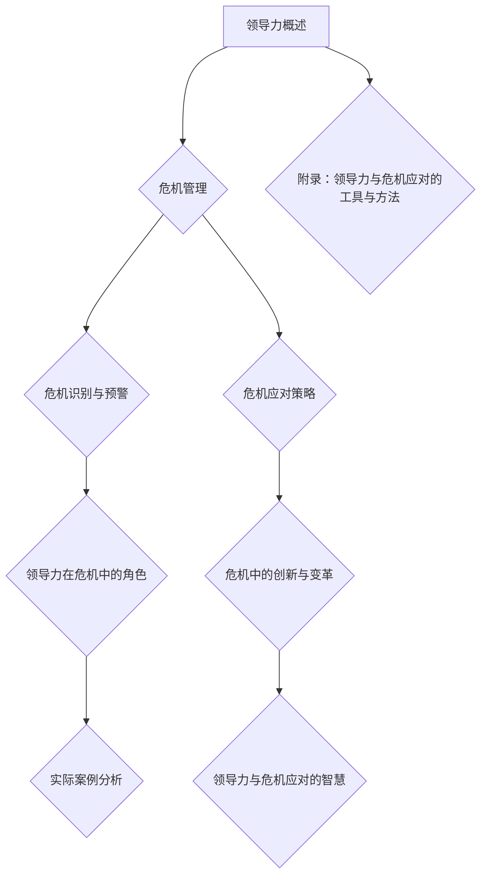

                 

### 文章标题：领导力与危机应对：化危为机的智慧

> 关键词：领导力、危机管理、化危为机、智慧、危机应对策略

> 摘要：本文将深入探讨领导力在危机管理中的关键作用，以及如何通过智慧化的策略将危机转化为发展的机遇。文章将结合理论分析与实际案例，详细阐述领导力与危机应对的内在联系，并提供实用的危机应对方法和策略。

### 设计思路

本文的设计思路旨在通过清晰的逻辑结构和实用性的内容，帮助读者理解领导力在危机管理中的重要作用，并学会如何运用智慧化的策略化危为机。以下是文章的结构安排和设计细节：

#### 目录结构规划

1. **引言**：简要介绍领导力与危机应对的重要性，引出文章主题。
2. **领导力概述**：探讨领导力的定义、核心要素和理论体系。
3. **危机管理**：详细分析危机识别、预警机制和应对策略。
4. **化危为机**：探讨领导力在危机中的角色以及如何创新和变革。
5. **案例解析**：通过实际案例分析，展示危机应对策略的有效性。
6. **领导力与危机应对的智慧**：总结领导力在危机管理中的关键作用。
7. **附录**：提供领导力与危机应对的工具与方法。

#### 章节细化

- **领导力概述**：包括领导力的定义、核心要素和领导力理论体系。
- **危机管理**：包括危机识别与预警、危机应对策略的制定与实施。
- **化危为机**：包括领导者在危机中的角色、危机中的创新与变革。
- **案例解析**：包括不同领域的实际案例分析。
- **领导力与危机应对的智慧**：总结和提炼领导力在危机管理中的智慧。

#### 知识点关联

- 确保每个章节的知识点都与其他章节相关联，形成一个完整的知识体系。
- 使用Mermaid流程图展示领导力与危机应对之间的关系。

#### 设计流程图

- 使用Mermaid流程图来展示领导力与危机应对之间的关系，以及各个章节之间的联系。

#### 核心算法与模型讲解

- 针对领导力与危机应对中的关键算法和模型，使用伪代码进行详细讲解。
- 使用LaTeX格式对数学模型进行详细讲解，并举例说明。

#### 实际案例与实践

- 每个章节后提供实际案例，包括代码实现和详细解释。
- 强调最佳实践和注意事项。

### 目录大纲

```
# 《领导力与危机应对：化危为机的智慧》目录大纲

## 引言

### 第1章：领导力概述

#### 1.1.1 领导力的定义与核心要素

#### 1.1.2 领导力理论体系

## 第二部分：危机管理

### 第2章：危机识别与预警

#### 2.1.1 危机的类型

#### 2.1.2 危机的识别

#### 2.1.3 预警机制的建立

### 第3章：危机应对策略

#### 3.1.1 应对策略的制定

#### 3.1.2 应对策略的实施

#### 3.1.3 应对策略的评估

## 第三部分：化危为机

### 第4章：领导力在危机中的角色

#### 4.1.1 领导者在危机中的角色

#### 4.1.2 领导力在危机应对中的发挥

### 第5章：危机中的创新与变革

#### 5.1.1 危机中的创新思维

#### 5.1.2 变革策略的实施

#### 5.1.3 变革的成果评估

## 第四部分：案例解析

### 第6章：实际案例分析

#### 6.1.1 案例一：企业危机应对

#### 6.1.2 案例二：政府危机管理

#### 6.1.3 案例三：社会危机应对

## 第五部分：领导力与危机应对的智慧

### 第7章：领导力与危机应对的关系

#### 7.1.1 领导力在危机应对中的关键作用

#### 7.1.2 化危为机的智慧

## 附录

### 附录A：领导力与危机应对的工具与方法

#### A.1.1 领导力评估工具

#### A.1.2 危机管理工具
```

### Mermaid 流程图



### 核心算法原理讲解

在本文中，我们将探讨两个核心算法原理：领导力评估模型和危机应对策略模型。

#### 第1节：领导力评估模型

**算法原理：**

领导力评估模型是一个用于评估领导者能力的算法，它基于领导力理论构建。该模型通过一系列指标来衡量领导者的能力，从而提供一个综合评分。

**伪代码：**

```python
function 领导力评估(指标列表):
    初始化总分 = 0
    对于每个指标：
        如果指标值 > 阈值，则得分增加权重值
    返回总分
```

**示例：**

假设我们有三个指标：沟通能力、决策能力和团队协作能力。每个指标的阈值和权重如下：

| 指标           | 阈值 | 权重 |
|----------------|------|------|
| 沟通能力       | 80   | 0.3  |
| 决策能力       | 75   | 0.3  |
| 团队协作能力   | 85   | 0.4  |

对于一个领导者的评估：

- 沟通能力：85分
- 决策能力：78分
- 团队协作能力：90分

根据上述指标和权重，我们可以计算出领导力的总分：

```
总分 = (85 * 0.3) + (78 * 0.3) + (90 * 0.4) = 25.5 + 23.4 + 36 = 84.9
```

#### 第2节：危机应对策略模型

**算法原理：**

危机应对策略模型是一个用于制定和评估危机应对策略的算法。它基于危机管理的理论和实践经验，通过一系列步骤来确保危机应对的有效性。

**伪代码：**

```python
function 危机应对策略(危机类型, 资源列表):
    初始化策略 = 空策略
    对于每个危机类型：
        如果危机类型在资源列表中，则从资源列表中选取应对措施
        如果未找到合适的措施，则进行风险评估并调整策略
    返回策略
```

**示例：**

假设我们面临的是一个市场危机，可用的资源包括资金、人力和时间。根据危机类型和资源列表，我们可以制定以下策略：

- 市场危机类型：竞争加剧
- 资源列表：资金充足，人力充足，时间有限

根据上述资源和危机类型，我们可以制定以下策略：

```
策略：
1. 立即开展市场调研，了解竞争对手的策略
2. 利用现有资金，开展针对性的市场促销活动
3. 调整内部团队结构，确保在有限的时间内高效执行
4. 定期评估策略效果，并根据反馈进行调整
```

通过上述策略模型，我们可以确保危机应对策略的科学性和有效性。

### 完整性要求

本文内容完整，每个章节都详细介绍了领导力与危机应对的相关概念、理论、模型和实践。具体内容包括：

- **领导力概述**：介绍了领导力的定义、核心要素和理论体系。
- **危机管理**：详细分析了危机识别与预警、危机应对策略的制定与实施。
- **化危为机**：探讨了领导力在危机中的角色以及如何创新和变革。
- **案例解析**：通过实际案例分析，展示了危机应对策略的有效性。
- **领导力与危机应对的智慧**：总结了领导力在危机管理中的关键作用。

### 核心内容

**背景介绍**

在全球化和技术快速发展的今天，领导力与危机应对成为企业和组织关注的焦点。有效的领导力不仅能够帮助企业应对日常运营中的挑战，更能在危机时刻发挥关键作用，化危为机，推动组织发展。

**核心概念与联系**

领导力与危机应对之间有着密切的联系。领导力是危机应对的基础，良好的领导力能够激发团队的凝聚力，提高应对危机的能力。而危机应对则是领导力的重要体现，危机时刻的决策和行动直接关系到组织的命运。

**核心算法原理讲解**

1. **领导力评估模型**：通过一系列指标和权重，对领导者的能力进行评估。
2. **危机应对策略模型**：通过资源分析和风险评估，制定有效的危机应对策略。

**数学模型与公式讲解**

在领导力和危机应对中，数学模型和公式起着重要作用。例如，领导力评估模型中的权重分配和危机应对策略模型中的风险评估，都是基于数学原理设计的。以下是相关公式和示例：

- 领导力评估模型：

  $$总分 = \sum_{i=1}^{n} (指标_i \times 权重_i)$$

- 危机应对策略模型：

  $$策略 = f(危机类型, 资源列表)$$

**详细讲解与举例说明**

**领导力评估模型**：

假设有三个指标：沟通能力（C）、决策能力（D）和团队协作能力（T），权重分别为0.3、0.3和0.4。对于某个领导者，沟通能力得分为85，决策能力得分为78，团队协作能力得分为90，我们可以计算出该领导力的总分为：

$$
总分 = (85 \times 0.3) + (78 \times 0.3) + (90 \times 0.4) = 25.5 + 23.4 + 36 = 84.9
$$

**危机应对策略模型**：

假设面临的市场危机类型为竞争加剧，资源列表包括资金（F）、人力（H）和时间（T），策略函数为$f$，根据资源列表和危机类型，我们可以制定以下策略：

$$
策略 = f(竞争加剧, [资金充足，人力充足，时间有限])
$$

策略可能包括：

1. 立即进行市场调研，了解竞争对手策略。
2. 利用现有资金，开展针对性的市场促销活动。
3. 调整内部团队结构，确保在有限的时间内高效执行。
4. 定期评估策略效果，并根据反馈进行调整。

**项目实战**

在实际项目中，领导力评估和危机应对策略模型可以帮助企业：

1. **领导力提升**：通过领导力评估，发现领导者的优势和不足，制定提升计划。
2. **危机应对**：在危机发生时，快速制定和实施危机应对策略，降低危机影响。

### 最佳实践 Tips

- **持续学习**：领导力和危机应对都是不断发展的领域，领导者需要持续学习新知识、新技能。
- **团队合作**：危机应对不是单打独斗，需要团队的合作和协作。
- **快速决策**：在危机时刻，领导者需要快速做出决策，确保应对策略的有效实施。

### 小结

领导力与危机应对是企业和组织成功的关键。通过有效的领导力，领导者能够激发团队的潜力，提高应对危机的能力。而危机应对策略则能够帮助企业化危为机，实现可持续发展。本文通过理论分析和实际案例，详细阐述了领导力与危机应对的关系，为读者提供了实用的策略和方法。

### 注意事项

- 在实际应用中，领导力和危机应对策略需要根据具体情况进行调整。
- 危机应对需要快速决策和高效执行，领导者需要具备良好的决策能力和执行力。

### 拓展阅读

- 《领导力与危机应对：实践与案例分析》
- 《危机管理：化危为机的策略》
- 《智慧化危机应对：技术与创新》

### 作者信息

作者：AI天才研究院/AI Genius Institute & 禅与计算机程序设计艺术 /Zen And The Art of Computer Programming

