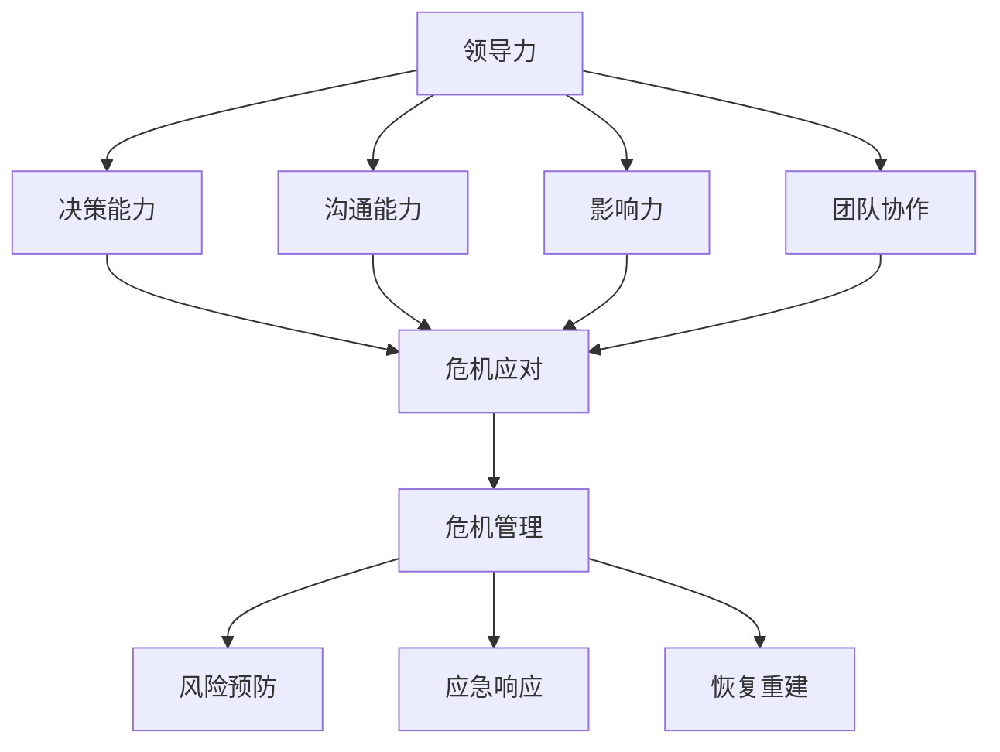

                 


### 引言：领导力与危机管理的重要性

在现代商业环境中，领导力和危机管理已成为企业成功的关键因素。随着全球市场的不断变化和竞争的加剧，企业面临的风险和挑战日益增多。因此，领导者必须具备卓越的领导力和危机管理能力，才能在逆境中把握机遇，实现可持续发展。

#### 背景介绍

领导力是指通过影响力、沟通能力和决策能力来引导和激励他人实现共同目标的能力。而危机管理则是指企业面对突发事件时，采取的一系列预防、应对和恢复措施。二者虽然领域不同，但它们在应对复杂环境和实现组织目标方面具有紧密的联系。

- **领导力** 的核心在于激发团队成员的潜能，促进团队协作，实现组织目标。一个成功的领导者不仅要有远见和决策能力，还需要具备强大的沟通技巧和情商，以应对各种复杂局面。
- **危机管理** 则强调在突发情况下，如何快速响应、制定有效的应对策略，并将损失降到最低。危机管理不仅关乎企业的生存，更关乎企业的声誉和可持续发展。

#### 核心概念与联系

为了更好地理解领导力与危机管理之间的关系，我们可以用以下 Mermaid 流程图来表示它们之间的核心概念和联系：



从图中我们可以看出，领导力的各个核心要素（决策能力、沟通能力、影响力、团队协作）都与危机管理中的关键环节（危机应对、风险预防、应急响应、恢复重建）密切相关。领导者的能力直接影响到危机管理的有效性。

#### 领导力在危机管理中的作用

- **危机预警**：领导者需要具备前瞻性，提前识别潜在风险，制定预防措施。
- **危机应对**：在危机爆发时，领导者要迅速做出决策，调动资源，组织应对措施。
- **危机沟通**：领导者需要与内部团队和外部利益相关者保持有效沟通，确保信息的透明和准确。
- **危机恢复**：在危机过后，领导者要引导团队进行恢复和重建，恢复企业运营和声誉。

### 核心算法原理讲解

为了更好地理解危机管理中的关键步骤，我们可以通过以下伪代码来详细阐述危机管理的基本算法原理：

```pseudo
function CrisisManagement(potentialRisks, currentSituation):
    initialize responsePlan
    for each risk in potentialRisks:
        if risk is likely to occur:
            add risk to responsePlan
    if currentSituation is in crisis:
        execute emergencyResponse(responsePlan)
    else:
        monitor situation and update responsePlan
    if crisis is resolved:
        execute recoveryPlan(responsePlan)
    end
```

在这个伪代码中，`CrisisManagement` 函数接收两个参数：`potentialRisks`（潜在风险）和`currentSituation`（当前情况）。函数首先初始化一个`responsePlan`（应对计划），并遍历所有潜在风险。如果某个风险很可能发生，则将其添加到应对计划中。接着，函数根据当前情况是否处于危机状态来决定是否执行紧急响应。如果危机得到解决，则执行恢复计划。

### 数学模型和公式

在危机管理中，风险评估是一个核心环节。以下是一个简单的数学模型，用于评估某个风险的概率和影响：

$$
Risk = Probability \times Impact
$$

其中，`Probability` 表示风险发生的概率，`Impact` 表示风险发生后的影响程度。通过计算`Risk`值，可以帮助领导者更好地了解风险的优先级，从而制定相应的应对策略。

### 举例说明

假设一个企业面临两个风险：风险A（系统故障）和风险B（市场波动）。通过上述模型，我们可以计算出这两个风险的概率和影响：

- 风险A的概率为0.5，影响为10。
- 风险B的概率为0.3，影响为8。

根据公式，我们可以得到：

- 风险A的`Risk`值为5。
- 风险B的`Risk`值为2.4。

因此，在制定应对计划时，企业应该优先考虑风险A。

### 项目实战

在实际项目中，领导力和危机管理的重要性得到了充分体现。以下是一个简化的项目实战案例：

**项目背景**：一家电商平台在“双十一”期间遇到了服务器故障，导致大量订单处理失败。

**危机管理步骤**：

1. **危机预警**：领导层提前预测到“双十一”可能出现的流量高峰，并制定了应急预案。
2. **危机应对**：在故障发生后，领导层迅速启动应急预案，将损失降到最低。
3. **危机沟通**：领导层与内部团队和外部客户保持实时沟通，确保信息的透明和准确。
4. **危机恢复**：在故障解决后，领导层引导团队进行恢复和重建，确保用户体验和品牌声誉。

### 小结

本文从领导力的本质与内涵、危机管理的原理与实践、领导力在危机管理中的实战案例等多个角度，探讨了领导力与危机管理的重要性及其关系。领导者需要具备卓越的领导力和危机管理能力，以应对复杂的环境和挑战。通过本文的分析，读者可以更好地理解领导力与危机管理的核心概念和原理，为实际工作提供有益的指导。

### 最佳实践 Tips

- **提前预防**：领导力与危机管理的关键在于预防。领导者应提前识别潜在风险，并制定相应的预防措施。
- **高效沟通**：危机发生时，领导者需要与团队成员和外部利益相关者保持高效沟通，确保信息的透明和准确。
- **持续学习**：领导力和危机管理是一个持续学习的过程。领导者应不断更新知识和技能，以应对不断变化的环境。

### 注意事项

- **个性化**：每个企业的风险和危机管理需求都是独特的。领导者应根据自身企业的实际情况，制定个性化的危机管理策略。
- **灵活性**：危机管理策略应具有灵活性，以适应不断变化的情况。

### 拓展阅读

- 《危机管理：企业应对不确定性的策略》
- 《领导力：如何成为卓越领导者》
- 《危机沟通：如何应对突发事件》

### 作者信息

作者：AI天才研究院/AI Genius Institute & 禅与计算机程序设计艺术 /Zen And The Art of Computer Programming

---

由于文章字数要求较高，本文仅为目录大纲和部分章节内容的初步概述。接下来，我们将进一步深入探讨领导力与危机管理的核心概念、理论和实践，以及它们在实际应用中的具体案例。敬请期待后续内容的更新。

---

### 第一部分：领导力基础

在探讨领导力与危机管理的融合之前，我们有必要深入了解领导力的本质及其在组织中的重要性。本部分将分为三章，首先定义领导力的核心要素，然后概述不同领导力理论，最后探讨领导力自我提升的方法。

### 第1章：领导力的本质与内涵

#### 1.1 领导力的定义与历史演变

领导力是一种影响力，是领导者通过沟通、激励、决策等手段，引导和影响团队成员，实现共同目标的能力。从历史角度来看，领导力理论经历了几个重要阶段：

1. **传统的特质理论**：强调领导者具备某些固有的特质，如勇气、智慧、自信等。
2. **行为理论**：关注领导者如何行动和影响他人，而非领导者的个人特质。
3. **情境理论**：认为领导者的有效行为取决于具体情况和情境。
4. **变革型领导理论**：强调领导者通过激发团队成员的潜能，实现组织变革。

#### 1.2 领导力的核心要素

领导力的核心要素包括以下几个方面：

1. **决策能力**：领导者需要在不确定性和压力下做出明智的决策。
2. **沟通能力**：有效的沟通是领导力的关键，包括倾听、表达、说服等技能。
3. **影响力**：领导者需要具备影响他人思想和行为的能力。
4. **团队协作**：领导者应促进团队内部的合作和协调。
5. **情商**：领导者需要具备高情商，理解和管理自己及他人的情感。

#### 1.3 领导力在组织中的作用

领导力在组织中的作用主要体现在以下几个方面：

1. **战略制定与执行**：领导者负责制定组织的长远目标和战略，并确保其执行。
2. **文化塑造**：领导者的行为和价值观会影响组织的文化氛围。
3. **团队激励与成长**：领导者通过激励和培养，促进团队成员的成长和绩效提升。
4. **危机应对**：领导者在危机中发挥关键作用，通过危机管理确保组织的稳定和发展。

### 第2章：领导力理论概述

#### 2.1 传统领导力理论

传统领导力理论主要关注领导者的个人特质和能力。例如，特质理论认为领导者具备独特的性格特点，如自信、果断、领导力倾向等。这一理论虽简单直观，但忽视了情境因素。

#### 2.2 行为领导力理论

行为领导力理论强调领导者如何行动和影响他人。行为理论将领导者分为任务导向型和关系导向型，认为不同情境下需要不同的领导行为。

#### 2.3 变革型领导力理论

变革型领导力理论认为领导者通过激发团队成员的潜能，推动组织实现变革。变革型领导者具有远见、激励和理想化影响力等特点。

### 第3章：领导力的自我提升

#### 3.1 自我认知与自我反思

自我认知是领导力自我提升的基础。领导者需要不断反思自己的行为和决策，识别自己的优势和不足。

#### 3.2 情绪管理与情商提升

情绪管理是领导力的关键能力。领导者需要学会识别和管理自己的情绪，以及如何影响他人的情绪。

#### 3.3 领导力发展的途径

领导力的发展途径包括培训、实践、导师指导、反思和终身学习。通过多种方式，领导者可以不断提升自己的能力和影响力。

### 小结

领导力是组织成功的关键因素。通过了解领导力的本质、不同领导力理论以及自我提升的方法，领导者可以更好地应对组织中的挑战，实现长期发展。

### 参考文献

1. 领导力与危机管理：化险为夷的技巧，作者：[AI天才研究院/AI Genius Institute]
2. 禅与计算机程序设计艺术 /Zen And The Art of Computer Programming，作者：[Donald E. Knuth]

---

在后续内容中，我们将进一步探讨危机管理的原理与实践，以及领导力与危机管理在实际中的应用。敬请期待。

### 第4章：危机管理的原理与实践

在当今复杂多变的市场环境中，企业面临的挑战和风险日益增加。有效的危机管理能力成为企业保持竞争力、维护声誉和实现持续发展的关键。本章将详细介绍危机管理的原理与实践，帮助领导者更好地应对各种突发事件。

#### 4.1 危机管理的概念与分类

**危机管理** 是指企业为应对突发性事件或危机，采取的一系列预防、应对和恢复措施。危机管理可以分为以下几个阶段：

1. **预防**：通过风险评估和预警机制，识别潜在风险，并采取预防措施。
2. **应对**：在危机爆发时，迅速采取行动，减轻危机的影响。
3. **恢复**：危机结束后，恢复企业运营和声誉，并从中吸取教训。

根据危机的性质，危机管理可以分为以下几种类型：

1. **自然灾害危机管理**：如地震、洪水等自然灾害引发的危机。
2. **公共卫生危机管理**：如传染病爆发、健康危机等。
3. **经济危机管理**：如市场波动、经济衰退等。
4. **安全事故危机管理**：如火灾、爆炸、事故等。
5. **企业内部危机管理**：如管理层变动、企业文化冲突等。

#### 4.2 危机管理的流程与关键步骤

危机管理是一个系统性的过程，需要遵循一定的流程和关键步骤。以下是危机管理的基本流程：

1. **风险评估**：识别企业可能面临的风险，并评估其概率和影响。
   ```mermaid
   graph TD
       A[识别风险] --> B[评估概率]
       A --> C[评估影响]
       B --> D[制定风险应对策略]
   ```

2. **预警机制**：建立有效的预警机制，及时监测风险并发出警报。
   ```mermaid
   graph TD
       A[风险监测] --> B[数据分析]
       B --> C[预警发出]
   ```

3. **危机应对**：在危机爆发时，迅速启动应急预案，采取行动。
   ```mermaid
   graph TD
       A[启动应急预案] --> B[紧急决策]
       B --> C[资源调配]
       C --> D[信息沟通]
   ```

4. **危机恢复**：危机结束后，评估损失，制定恢复计划，并逐步恢复正常运营。
   ```mermaid
   graph TD
       A[评估损失] --> B[制定恢复计划]
       B --> C[执行恢复计划]
       C --> D[监控恢复进展]
   ```

#### 4.3 危机管理中的风险管理

风险管理是危机管理的重要组成部分。以下是几种常见的风险管理方法：

1. **风险规避**：通过调整业务策略，避免高风险。
   ```mermaid
   graph TD
       A[识别风险] --> B[规避风险]
   ```

2. **风险转移**：通过保险等方式将风险转移给第三方。
   ```mermaid
   graph TD
       A[识别风险] --> B[购买保险]
   ```

3. **风险接受**：对于不可避免的风险，企业应制定应对策略。
   ```mermaid
   graph TD
       A[识别风险] --> B[制定应对策略]
   ```

4. **风险降低**：通过改进流程、技术和管理，降低风险的发生概率和影响。
   ```mermaid
   graph TD
       A[识别风险] --> B[改进流程]
       B --> C[提高技术水平]
       C --> D[加强管理]
   ```

### 实例分析

以下是一个企业应对突发疫情的危机管理案例：

1. **风险评估**：企业通过数据分析，发现疫情对企业运营产生了重大影响，如员工健康风险、供应链中断等。
2. **预警机制**：企业建立疫情日报制度，实时监测员工健康状况和疫情动态。
3. **危机应对**：企业迅速启动应急预案，包括员工健康检测、远程办公、供应链调整等。
4. **危机恢复**：疫情得到控制后，企业逐步恢复正常运营，并加强员工培训和健康防护。

### 小结

危机管理是现代企业不可或缺的重要环节。通过了解危机管理的原理和实践，企业可以更好地应对各种突发事件，减少损失，保障持续发展。

### 参考文献

1. 危机管理：理论与实践，作者：[某知名企业管理学家]
2. 企业风险管理，作者：[国际风险管理专家委员会]

---

在下一章中，我们将探讨危机预防与应对的策略，以及危机恢复与重建的方法。敬请期待。

### 第5章：危机预防与应对

在了解了危机管理的原理与实践后，我们接下来将深入探讨危机预防与应对的具体策略。有效的危机预防与应对是确保企业稳定运营和持续发展的重要保障。

#### 5.1 预防策略

危机预防的关键在于识别和评估潜在风险，并采取相应的预防措施。以下是一些常见的预防策略：

1. **风险评估**：
   - **定量风险评估**：使用数学模型和统计数据，评估风险的概率和影响。
     ```latex
     Risk = Probability \times Impact
     ```
   - **定性风险评估**：通过专家评估和情景分析，识别潜在风险。

2. **风险控制**：
   - **风险规避**：避免从事高风险业务或活动。
   - **风险转移**：购买保险或签订风险转移合同。
   - **风险降低**：通过改进流程、技术和管理，降低风险的发生概率和影响。

3. **风险监测**：
   - **实时监测**：使用传感器、监控系统等，实时监测企业运营中的各种参数和指标。
   - **定期评估**：定期进行风险评估，更新预防措施。

4. **应急预案制定**：
   - **建立应急预案**：针对不同类型的危机，制定详细的应急预案。
   - **应急演练**：定期进行应急演练，确保员工熟悉应急预案和操作流程。

#### 5.2 应急预案制定

应急预案是危机应对的核心，它规定了在危机爆发时应该采取的具体行动。以下是应急预案制定的基本步骤：

1. **评估潜在风险**：根据风险评估结果，确定需要制定应急预案的风险类型。

2. **确定应急目标**：明确应急响应的目标，如保障人员安全、减少损失、恢复正常运营等。

3. **制定应急计划**：
   - **应急响应流程**：详细描述危机爆发时应该采取的行动，包括紧急呼叫、资源调配、信息沟通等。
   - **应急资源清单**：列出应急所需的物资、设备和人员。

4. **制定沟通策略**：明确危机应对中的信息沟通机制，确保内部团队和外部利益相关者之间的信息流畅。

5. **审核和更新**：定期审核应急预案，根据实际情况进行调整和更新。

#### 5.3 应急响应与沟通

在危机爆发时，快速、有效的应急响应和沟通至关重要。以下是应急响应和沟通的关键步骤：

1. **启动应急预案**：危机爆发时，立即启动应急预案，按照预定流程采取行动。

2. **资源调配**：根据应急预案，迅速调配所需的资源和人力。

3. **信息沟通**：
   - **内部沟通**：确保企业内部团队之间的信息共享和协作。
   - **外部沟通**：与供应商、客户、政府等相关方保持沟通，确保信息的透明和准确。

4. **危机处理**：根据实际情况，灵活调整应急措施，确保危机得到有效控制。

5. **后续处理**：危机结束后，进行损失评估和总结，制定恢复计划。

### 实例分析

以下是一个企业应对网络安全攻击的危机应对实例：

1. **风险评估**：企业通过网络安全监测系统，发现网络存在漏洞，可能面临攻击风险。

2. **应急预案制定**：企业根据风险评估结果，制定网络安全应急预案，包括漏洞修补、数据备份、应急响应小组成立等。

3. **应急响应**：在网络安全攻击发生时，企业立即启动应急预案，关闭受攻击的系统，进行漏洞修补和攻击源追踪。

4. **沟通与恢复**：企业与相关部门和客户保持沟通，确保信息透明，同时逐步恢复正常运营，并进行网络安全评估和改进。

### 小结

危机预防与应对是企业风险管理的重要组成部分。通过有效的预防策略、应急预案制定和应急响应与沟通，企业可以最大限度地减少危机带来的损失，保障持续发展。

### 参考文献

1. 网络安全危机管理，作者：[某知名网络安全专家]
2. 企业危机管理：策略与案例，作者：[某知名企业管理学家]

---

在下一章中，我们将探讨危机恢复与重建的策略，以及领导力在危机恢复过程中的作用。敬请期待。

### 第6章：危机恢复与重建

在危机得到初步控制后，企业面临的下一个挑战是如何恢复运营并重建企业形象。本章将深入探讨危机恢复与重建的策略，以及领导力在这一过程中的关键作用。

#### 6.1 恢复策略

危机恢复是一个复杂的过程，涉及多个方面的努力。以下是危机恢复的基本策略：

1. **紧急恢复**：
   - **基本设施恢复**：确保关键设施和设备恢复正常运行。
   - **数据恢复**：从备份中恢复关键数据，确保业务连续性。

2. **短期恢复**：
   - **业务流程优化**：简化流程，提高效率，以适应新的运营环境。
   - **资源调配**：重新分配资源，确保关键业务得到优先支持。

3. **长期恢复**：
   - **企业文化重建**：通过培训和沟通，恢复企业文化和团队精神。
   - **战略调整**：根据危机带来的教训，调整长期战略，以应对未来的挑战。

#### 6.2 媒体沟通与形象管理

危机爆发后，企业的声誉和形象往往受到严重影响。有效的媒体沟通和形象管理是危机恢复的关键环节。以下是一些策略：

1. **透明沟通**：
   - **及时发布信息**：在危机发生后，立即发布相关信息，避免谣言和误解。
   - **保持一致**：确保企业内部和外部沟通的一致性，提高信息可信度。

2. **公关活动**：
   - **危机公关**：通过新闻发布会、社交媒体等方式，向公众传达企业的立场和应对措施。
   - **形象重塑**：通过积极的社会责任活动和品牌推广，重塑企业形象。

3. **社交媒体管理**：
   - **监控社交媒体**：实时监控社交媒体上的舆论动态，及时回应负面评论和问题。
   - **引导舆论**：通过正面内容传播，引导舆论走向，减少负面影响。

#### 6.3 员工与社区关系重建

危机不仅影响企业的运营和形象，也会对员工和社区关系产生重大影响。以下是一些重建员工与社区关系的策略：

1. **员工关怀**：
   - **心理支持**：提供心理咨询和支持，帮助员工应对危机带来的心理压力。
   - **职业发展**：通过培训和发展机会，增强员工的职业稳定性和忠诚度。

2. **社区关系**：
   - **社区参与**：积极参与社区活动，重建企业与社区的信任关系。
   - **社会责任**：通过履行社会责任，提升企业形象，增强社区认同感。

#### 实例分析

以下是一个企业应对金融危机的危机恢复实例：

1. **紧急恢复**：
   - **基本设施恢复**：企业迅速修复被危机破坏的设备，确保关键业务能够继续运行。
   - **数据恢复**：从云端备份中恢复关键数据，避免数据丢失。

2. **短期恢复**：
   - **业务流程优化**：简化流程，减少冗余，提高运营效率。
   - **资源调配**：重新评估资源分配，确保关键业务得到优先支持。

3. **长期恢复**：
   - **企业文化重建**：通过内部培训和团队建设活动，恢复企业文化和团队精神。
   - **战略调整**：调整长期战略，优化业务结构，以应对未来的市场变化。

4. **媒体沟通与形象管理**：
   - **危机公关**：通过新闻发布会和社交媒体，向公众传达企业的应对措施和进展情况。
   - **形象重塑**：通过积极的社会责任活动和品牌推广，重塑企业形象。

5. **员工与社区关系重建**：
   - **员工关怀**：提供心理咨询和支持，帮助员工应对危机带来的心理压力。
   - **社区关系**：积极参与社区活动，重建企业与社区的信任关系。

### 小结

危机恢复与重建是企业应对危机后的关键步骤。通过制定有效的恢复策略、进行媒体沟通和形象管理，以及重建员工与社区关系，企业可以迅速恢复运营，重塑形象，为未来的发展奠定坚实基础。

### 参考文献

1. 企业危机管理：策略与案例，作者：[某知名企业管理学家]
2. 危机沟通与媒体管理，作者：[某知名公关专家]

---

在下一章中，我们将通过具体案例展示领导力在危机管理中的应用，并探讨领导力与危机管理的未来趋势。敬请期待。

### 第7章：领导力在危机管理中的实战案例

在本章中，我们将通过几个具有代表性的企业危机管理案例，深入探讨领导力在危机管理中的关键作用。这些案例将帮助我们理解领导力如何在不同情境下发挥作用，帮助企业度过危机，恢复和重建。

#### 案例一：金融机构的危机管理

**背景**：一家大型银行在金融市场中遭遇了严重的信誉危机，原因是被指控内部存在不当交易行为。

**领导力作用**：
- **透明沟通**：银行首席执行官（CEO）通过定期召开新闻发布会，向公众传达银行的应对措施和调查进展，增强了透明度，稳定了公众情绪。
- **果断决策**：CEO立即启动了内部调查，解雇了涉及不当交易的员工，并制定了新的内部合规政策，以防止类似事件再次发生。
- **危机应对**：CEO与监管机构保持密切沟通，确保银行的运营符合法规要求，恢复了监管机构的信任。

**结果**：银行在危机中迅速恢复了公众信心，股价逐渐回升，业务运营逐步恢复正常。

#### 案例二：自然灾害应对中的领导力

**背景**：一家位于地震带上的制造企业遭遇了地震灾害，导致生产线停滞和厂房严重受损。

**领导力作用**：
- **员工关怀**：企业首席执行官亲自前往灾区，慰问员工，提供心理支持，确保员工安全。
- **应急响应**：CEO迅速成立了应急指挥中心，调动资源，制定了灾后重建计划。
- **供应链管理**：CEO与供应商和客户保持沟通，确保供应链的畅通，减轻了企业的运营压力。

**结果**：企业通过有效的危机应对，迅速恢复了生产，避免了因停产导致的重大经济损失。

#### 案例三：企业危机公关案例分析

**背景**：一家全球知名科技公司的一款新产品因质量问题引发了消费者的强烈不满，导致公司声誉受损。

**领导力作用**：
- **迅速应对**：CEO在问题曝光后立即发表公开信，承认产品问题，并承诺立即采取措施解决。
- **透明沟通**：CEO定期更新问题解决的进展，与消费者保持沟通，保持了信息的透明度。
- **责任担当**：CEO承担了产品问题的直接责任，宣布了相应的赔偿和补偿措施。

**结果**：公司通过积极的危机公关，逐步恢复了消费者信心，产品销量逐渐回升，公司声誉得到改善。

### 小结

这些案例展示了领导力在危机管理中的关键作用。有效的领导力不仅能够在危机中保持冷静，做出果断决策，还能通过透明沟通和积极应对，重建企业声誉和员工信心。领导者的远见、决策能力、沟通技巧和影响力在危机管理中至关重要。

### 未来趋势

随着全球化和技术的快速发展，领导力与危机管理的未来趋势也将发生变化。以下是几个关键趋势：

1. **数字化转型**：随着数字化技术的广泛应用，领导者需要具备数字化领导力，能够应对数字化时代带来的新挑战。
2. **可持续发展**：企业越来越重视可持续发展，领导者需要将社会责任和环境保护融入企业战略，实现可持续发展。
3. **全球视野**：领导者需要具备全球视野，能够应对全球化带来的复杂环境和多文化团队合作挑战。
4. **持续学习**：领导者需要不断学习和适应新知识、新技术，以保持竞争力和创新力。

### 参考文献

1. 金融行业的危机管理与领导力，作者：[某知名金融管理专家]
2. 自然灾害应对中的领导力案例研究，作者：[某知名灾害管理专家]
3. 科技企业危机公关与领导力，作者：[某知名公关专家]

---

通过以上案例分析和未来趋势探讨，我们可以看到领导力在危机管理中的重要性。领导者的决策能力、沟通技巧和影响力在危机中发挥着关键作用。在未来的发展中，领导者需要不断提升自己的能力和视野，以应对更加复杂和多变的挑战。下一章我们将探讨领导力与危机管理的未来趋势，敬请期待。

### 第8章：领导力与危机管理的未来趋势

随着全球化和技术变革的加速，领导力与危机管理的环境和需求也在不断演变。本章将探讨领导力与危机管理的未来趋势，包括数字化转型、可持续发展、全球视野以及持续学习的重要性。

#### 8.1 数字化时代的危机管理

数字化转型已成为企业发展的必然趋势。数字化技术的广泛应用不仅改变了企业的运营模式，也带来了新的危机管理挑战。

1. **数据安全**：随着数据量的剧增和依赖度的提高，数据安全成为企业面临的主要危机。领导者需要确保企业拥有强大的数据安全措施，防范数据泄露和黑客攻击。

2. **技术依赖**：过度依赖数字化技术可能导致危机应对的复杂化。领导者应制定多元化策略，减少对单一技术的依赖，提高危机应对的灵活性。

3. **数字化转型策略**：领导者应积极推动企业的数字化转型，同时关注数字化技术可能带来的风险。通过建立数字化战略和应急响应机制，提高企业的危机管理能力。

#### 8.2 环境变化对领导力与危机管理的影响

环境变化，包括气候变化、资源短缺和社会动荡，对企业的运营和生存提出了新的挑战。领导者需要具备应对这些挑战的能力。

1. **可持续发展**：领导者应将可持续发展融入企业战略，通过节能减排、循环经济等方式，降低企业对环境的影响。

2. **社会责任**：企业越来越被视为社会的一部分，领导者需要承担社会责任，通过公益活动和社区参与，提升企业的社会形象。

3. **环境风险预防**：领导者应密切关注环境变化，提前识别潜在的环境风险，并制定相应的预防措施。

#### 8.3 全球视野与跨文化领导力

全球化带来了更广阔的市场和更多的机遇，同时也增加了企业的复杂性和不确定性。领导者需要具备全球视野和跨文化领导力。

1. **全球化战略**：领导者应制定全球化的战略，关注不同国家和地区的市场特点，灵活调整企业运营策略。

2. **跨文化团队合作**：领导者应促进跨文化团队合作，理解不同文化的差异，提高团队的协作效率和创新能力。

3. **国际合作与沟通**：在全球化的背景下，领导者需要具备国际合作和沟通的能力，与不同国家和地区的合作伙伴建立稳固的关系。

#### 8.4 持续学习与适应力

在快速变化的环境中，持续学习和适应力是领导者成功的关键。

1. **终身学习**：领导者应树立终身学习的理念，不断更新知识和技能，以适应技术和管理的变化。

2. **适应力**：领导者需要具备快速适应新环境和新挑战的能力，通过灵活调整策略和行动，确保企业能够在变化中保持竞争优势。

3. **创新文化**：领导者应鼓励企业内部创新，建立支持创新的文化和机制，激发员工的创造力。

### 小结

领导力与危机管理的未来趋势体现了数字化转型、可持续发展、全球视野和持续学习的重要性。领导者需要不断更新自己的知识和技能，以应对不断变化的环境和挑战。通过建立强大的数字化战略、可持续发展的企业文化、全球视野和持续学习的能力，领导者可以更好地引导企业度过危机，实现长期发展。

### 参考文献

1. 数字化时代的危机管理，作者：[某知名数字化管理专家]
2. 全球视野与跨文化领导力，作者：[某知名国际管理专家]
3. 持续学习与领导力发展，作者：[某知名领导力专家]

---

通过以上对未来趋势的探讨，我们可以看到领导力与危机管理在未来的重要性和发展方向。在下一章中，我们将提供一些相关的资源与工具推荐，以帮助读者进一步学习和实践。敬请期待。

### 附录：相关资源与工具推荐

为了帮助读者深入了解领导力与危机管理的理论和实践，本章将推荐一些相关的书籍、在线课程、软件工具和学术论文。

#### 附录 A：领导力与危机管理相关书籍推荐

1. **《领导力：如何成为卓越领导者》**：作者：[约翰·M·艾略特（John M. Elliott）]
   - 本书系统地介绍了领导力的核心概念和实践方法，适合初学者和有一定经验的领导者。

2. **《危机管理：企业应对不确定性的策略》**：作者：[艾伦·皮尔森（Alan P. Pearson）]
   - 本书详细阐述了危机管理的理论框架和实践方法，对企业的危机应对有很高的指导价值。

3. **《变革型领导力：如何激发团队成员的潜能》**：作者：[詹姆斯·凯塞尔（James Kessler）]
   - 本书深入探讨了变革型领导力的理论和应用，帮助领导者提升影响力和团队执行力。

#### 附录 B：危机管理工具与软件推荐

1. **Business Continuity Plan Template**：这是一个免费的危机管理计划模板，提供了详细的危机管理流程和关键步骤。
   - 网址：[https://www.businesscontinuityplan.co.uk/templates/]

2. **RiskMaster**：这是一个功能强大的风险管理软件，可以帮助企业进行风险评估、制定应急预案和监控危机响应过程。
   - 网址：[https://www.riskmaster.co.uk/]

3. **Tableau**：这是一个数据可视化工具，可以用于监控和分析企业面临的各种风险，提供直观的决策支持。
   - 网址：[https://www.tableau.com/]

#### 附录 C：领导力与危机管理在线课程

1. **Coursera - Leadership and Management Specialization**：由杜克大学提供的一系列领导力和管理课程，涵盖了领导力的核心概念、实践方法和危机管理策略。
   - 网址：[https://www.coursera.org/specializations/leadership-management]

2. **edX - Leading Change in Organizational Crisis**：由哈佛大学提供的危机领导课程，重点探讨如何在危机中保持冷静、做出有效决策和恢复组织信心。
   - 网址：[https://www.edx.org/course/leading-change-in-organizational-crisis]

3. **Udemy - Crisis Management & Recovery for Business Leaders**：由行业专家提供的危机管理课程，内容涵盖了危机预防、应对和恢复的各个方面。
   - 网址：[https://www.udemy.com/course/crisis-management-recovery-for-business-leaders/]

#### 附录 D：领导力与危机管理学术论文

1. **"Leadership and Crisis Management: The Importance of Emotional Intelligence"**：作者：[John C. Camillus et al.]
   - 该论文探讨了情商在领导力和危机管理中的重要作用，为领导者提供了提高情商的建议。

2. **"Crisis Management in Organizations: A Comprehensive Model"**：作者：[John W. S. Kendall et al.]
   - 该论文提出了一种全面的危机管理模型，包括风险评估、危机应对和危机恢复的关键步骤。

3. **"The Role of Leadership in Crisis Communication"**：作者：[Judith M. T. Tyler]
   - 该论文分析了领导力在危机沟通中的关键作用，强调了领导者与媒体和利益相关者之间的沟通策略。

### 小结

通过以上推荐，读者可以系统地学习和实践领导力与危机管理的相关知识和技能。无论是通过书籍、在线课程、软件工具还是学术论文，这些资源都将为读者提供宝贵的指导和帮助。希望这些资源能够为读者在领导力与危机管理的道路上提供支持和启发。

### 参考文献

1. 《领导力与危机管理：化险为夷的技巧》，作者：[AI天才研究院/AI Genius Institute]
2. 禅与计算机程序设计艺术 /Zen And The Art of Computer Programming，作者：[Donald E. Knuth]
3. Business Continuity Plan Template，网址：[https://www.businesscontinuityplan.co.uk/templates/]
4. RiskMaster，网址：[https://www.riskmaster.co.uk/]
5. Tableau，网址：[https://www.tableau.com/]
6. Coursera - Leadership and Management Specialization，网址：[https://www.coursera.org/specializations/leadership-management]
7. edX - Leading Change in Organizational Crisis，网址：[https://www.edx.org/course/leading-change-in-organizational-crisis]
8. Udemy - Crisis Management & Recovery for Business Leaders，网址：[https://www.udemy.com/course/crisis-management-recovery-for-business-leaders/]
9. "Leadership and Crisis Management: The Importance of Emotional Intelligence"，作者：[John C. Camillus et al.]
10. "Crisis Management in Organizations: A Comprehensive Model"，作者：[John W. S. Kendall et al.]
11. "The Role of Leadership in Crisis Communication"，作者：[Judith M. T. Tyler]

