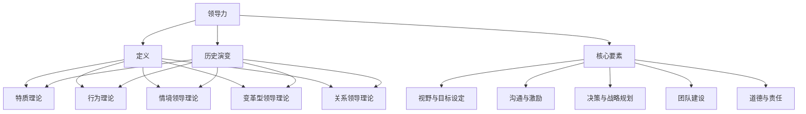
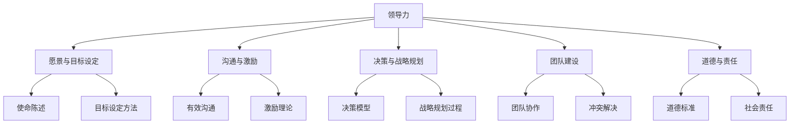

                 

### 文章标题

# 领导力与危机管理：在困境中展现领导力

## 关键词：
- 领导力
- 危机管理
- 决策
- 沟通
- 团队建设

## 摘要：
本文将探讨领导力在危机管理中的重要性，分析领导者在危机中的角色和策略。通过深入解析领导力的核心要素，危机管理的原则与流程，以及实际案例的剖析，本文旨在为领导者提供有效的危机管理指导，助力他们在困境中展现卓越的领导力。

### 引言

在全球化和信息化迅猛发展的背景下，企业面临的挑战日益复杂，危机管理成为领导者必须掌握的重要能力。危机不仅可能来自外部环境的变化，如市场波动、技术进步、法律法规的更新等，也可能源于内部管理的问题，如组织结构调整、人员流动、资源分配不均等。无论是哪种类型的危机，对企业的生存和持续发展都构成了严重威胁。

在这场前所未有的挑战中，领导力成为了决定企业命运的关键因素。领导力不仅关系到危机的应对策略，更关乎企业的长期发展。一个优秀的领导者能够在危机中迅速做出决策，保持团队的稳定和凝聚力，调动各方资源，制定并实施有效的应对措施，从而将危机转化为发展的机遇。

本文将从以下几个方面展开讨论：

1. **领导力的定义与核心要素**：回顾领导力的定义和历史演变，分析领导力的核心要素，包括视野与目标设定、沟通与激励、决策与战略规划等。
2. **危机管理的概念与原则**：介绍危机管理的定义、类型和原则，探讨危机管理的流程和领导力在其中的作用。
3. **领导力在危机中的实践**：通过决策模型、应对策略、情境领导和领导力培养等角度，阐述领导力在危机管理中的具体应用。
4. **领导力与危机管理的整合**：讨论领导力与危机管理的整合策略，跨部门协作的重要性，以及持续改进的方法。

通过以上分析，本文旨在为领导者提供一套系统的危机管理框架，帮助他们更好地应对各种挑战，在困境中展现卓越的领导力。

### 领导力概述

#### 第1章：领导力的定义与核心要素

在探讨领导力在危机管理中的重要性之前，有必要对领导力的定义和核心要素进行深入的剖析。领导力是一个多维度的概念，它不仅涉及个人的能力，还包括团队和组织的效能。从历史上看，领导力理论经历了从传统的权威领导到现代的变革领导，再到如今注重个人发展和关系管理的转变。

**1.1 领导力的定义与历史演变**

领导力的定义多种多样，但可以概括为一种影响他人实现共同目标的能力。根据英国管理学家理查德·L·达夫特（Richard L. Daft）的观点，领导力是“一个个体通过行动和决策影响他人，以实现特定目标的过程”。这种定义强调了领导力是一种动态的、互动的过程，而非静态的、孤立的个人特质。

领导力理论的历史演变可以追溯到古希腊哲学家亚里士多德，他提出了“美德领导”的概念，即领导者应当具备高尚的品德和道德标准。随着时代的发展，领导力理论逐渐从哲学层面走向科学和实践层面。以下是一些关键的领导力理论演变：

- **古典领导理论**：20世纪初，科学家和管理学家开始通过实验和观察来研究领导力。这一时期，领导力主要被看作是领导者个人的特质，如智慧、决断力、魅力等。代表性的理论包括特质理论和行为理论。

  - **特质理论**：认为领导者天生具有某些独特的个人特质，如勇气、自信、智慧等。这一理论忽视了环境因素对领导力的作用。
  
  - **行为理论**：强调领导力是通过特定行为表现出来的。行为理论认为，领导者通过不同的行为模式来影响下属，实现组织目标。

- **情境领导理论**：20世纪中叶，赫赛（Paul Hersey）和布兰查德（Kenneth Blanchard）提出了情境领导理论，强调领导者应根据不同的情境和下属特点采取不同的领导风格。这一理论为领导力研究注入了动态和灵活性的概念。

- **变革型领导理论**：20世纪80年代，伯恩斯（James MacGregor Burns）提出了变革型领导理论，强调领导者通过激励和启发下属实现变革。变革型领导者关注长期目标，鼓励创新和持续改进。

- **关系领导理论**：近年来，关系领导理论逐渐受到关注，强调领导力是一种关系和互动的过程。领导者通过与下属建立深厚的关系，促进信任和合作，实现共同目标。

**1.2 领导力的核心要素**

尽管领导力理论多种多样，但许多研究者都认同领导力包括一些核心要素。以下是一些关键的领导力核心要素：

- **视野与目标设定**：领导者需要具备清晰的愿景和目标，能够引导团队朝着共同的目标努力。一个明确的愿景可以激发员工的热情和动力，使他们愿意为组织的目标付出努力。

- **沟通与激励**：沟通是领导力的核心要素之一。有效的沟通不仅包括信息的传递，还包括情感和价值观的交流。激励则是通过鼓励和认可来激发员工的潜能，提高团队的整体绩效。

- **决策与战略规划**：领导者需要具备良好的决策能力和战略规划能力。在面对不确定性和风险时，领导者需要做出明智的决策，确保组织的长期发展。

- **团队建设**：领导者需要建立高效的团队，促进团队成员之间的协作和合作。团队建设包括培养团队文化、建立信任、分配任务和解决冲突等。

- **道德与责任**：领导者应当具备高尚的道德品质和责任感，以身作则，树立榜样。这不仅有助于提升组织的声誉，也能增强员工的忠诚度和信任感。

**1.3 领导力的重要性**

领导力对组织和个人都具有深远的影响。以下是领导力的重要性的一些方面：

- **对组织的影响**：有效的领导力可以提升组织的整体效能，实现组织的目标。领导者通过制定愿景和目标，激发员工的积极性，提高团队的合作效率，从而实现组织的长期成功。

- **对员工的影响**：领导力对员工的个人成长和职业发展具有重要作用。一个有领导力的领导者可以提供指导和支持，帮助员工发展技能，实现职业目标。同时，领导力也可以增强员工的归属感和满意度，降低员工流失率。

- **在危机管理中的角色**：在危机中，领导力尤为重要。一个有领导力的领导者能够在危机中保持冷静，做出明智的决策，调动各方资源，带领团队克服困难，化危为机。

**1.4 领导力的挑战**

尽管领导力的重要性不言而喻，但领导者也面临着许多挑战。以下是领导力的一些主要挑战：

- **内部挑战**：包括组织结构问题、员工期望、内部竞争等。领导者需要平衡各方利益，建立有效的沟通机制，处理内部冲突。

- **外部挑战**：包括市场变化、技术进步、法规政策等。领导者需要具备前瞻性，及时调整战略，应对外部环境的变化。

- **个人挑战**：包括自我管理、持续学习、应对压力等。领导者需要不断提升自己的能力，保持积极的心态，应对各种挑战。

**1.5 领导力的自我提升**

为了应对各种挑战，领导者需要不断提升自己的能力。以下是一些自我提升的方法：

- **自我反思**：通过反思自己的行为和决策，识别自身的优点和不足，制定改进计划。

- **持续学习**：不断学习新的知识和技能，了解行业动态和趋势，提升自己的竞争力。

- **实践锻炼**：通过实际工作，积累经验，提升自己的领导力。

- **寻求反馈**：定期寻求下属和同行的反馈，了解自己的表现和改进方向。

通过以上的分析，我们可以看到领导力是一个复杂而多层次的概念，它在危机管理中具有至关重要的作用。了解领导力的定义、核心要素、重要性以及面临的挑战，是领导者提升自身能力，有效应对危机的重要前提。

#### 图1.1 领导力核心概念之间的关系架构



#### 核心概念原理之间的关系架构



#### 决策模型

决策模型是领导者制定战略和应对危机的重要工具。以下是几种常见的决策模型及其核心原理：

- **理性决策模型**：理性决策模型假设领导者具有充分的理性，能够通过分析所有相关信息，做出最优决策。该模型的核心步骤包括问题识别、目标设定、方案列举、方案评估和决策执行。以下是理性决策模型的伪代码：

  ```plaintext
  function 理性决策模型(问题, 目标):
      列出所有可能的方案
      对每个方案进行评估
      根据评估结果选择最优方案
      执行决策
      返回决策结果
  ```

- **有限理性决策模型**：由于时间和资源的限制，领导者往往无法完全理性地做出决策。有限理性决策模型假设领导者会在不完全信息下做出次优决策。该模型的核心步骤包括问题识别、信息收集、方案列举、方案评估和决策执行。以下是有限理性决策模型的伪代码：

  ```plaintext
  function 有限理性决策模型(问题, 目标):
      收集有限信息
      列出所有可能的方案
      对每个方案进行初步评估
      根据评估结果选择次优方案
      执行决策
      返回决策结果
  ```

- **模糊决策模型**：在实际决策中，许多因素都是模糊的，难以精确量化。模糊决策模型通过模糊逻辑来处理这些模糊因素，帮助领导者做出决策。该模型的核心步骤包括问题识别、模糊化处理、方案列举、模糊评估和决策执行。以下是模糊决策模型的伪代码：

  ```plaintext
  function 模糊决策模型(问题, 目标):
      模糊化处理问题
      列出所有可能的方案
      对每个方案进行模糊评估
      根据评估结果选择最优方案
      执行决策
      返回决策结果
  ```

通过这些决策模型，领导者可以更好地应对复杂的问题和不确定的环境，做出明智的决策。

#### 数学模型和公式

在领导力理论中，有许多数学模型和公式可以帮助领导者理解和应用领导力。以下是一些常用的数学模型和公式：

- **领导效能模型**：该模型通过量化领导效能，帮助领导者评估自己的领导能力。领导效能模型可以表示为：

  $$效能 = f(视野与目标设定, 沟通与激励, 决策与战略规划, 团队建设, 道德与责任)$$

  其中，每个要素都可以通过具体的指标进行量化，如：

  - 视野与目标设定：可以通过目标完成率、员工满意度等指标来衡量。
  - 沟通与激励：可以通过信息传递效率、员工积极性等指标来衡量。
  - 决策与战略规划：可以通过决策准确率、战略实施效果等指标来衡量。
  - 团队建设：可以通过团队协作效率、团队凝聚力等指标来衡量。
  - 道德与责任：可以通过道德行为指数、社会责任履行情况等指标来衡量。

- **领导力增长模型**：该模型描述了领导力的增长过程，可以表示为：

  $$领导力增长 = f(学习速度, 实践经验, 反馈与调整)$$

  其中，学习速度表示领导者获取新知识和技能的能力；实践经验表示领导者通过实际工作积累的经验；反馈与调整表示领导者对自身行为的反思和改进。

- **危机管理效率模型**：该模型通过量化危机管理效率，帮助领导者评估危机应对效果。危机管理效率模型可以表示为：

  $$效率 = f(响应速度, 沟通效率, 资源调配能力, 持续改进)$$

  其中，响应速度表示领导者对危机的快速反应能力；沟通效率表示领导者与团队、利益相关者的沟通效果；资源调配能力表示领导者调动资源应对危机的能力；持续改进表示领导者对危机管理过程的不断优化。

通过这些数学模型和公式，领导者可以更加科学地评估自己的领导能力，制定有效的领导策略，提升危机应对能力。

#### 实际案例分析和详细讲解剖析

为了更好地理解领导力在危机管理中的实际应用，我们可以通过以下两个案例进行分析和剖析。

**案例一：2020年新冠疫情下的中国应对**

在2020年新冠疫情爆发之初，中国迅速采取了严格的封城和防控措施，有效遏制了病毒的传播。这一成功应对离不开领导者的卓越领导力。

- **视野与目标设定**：中国政府在疫情初期就明确了“人民至上、生命至上”的宗旨，将疫情防控作为头等大事。这一明确的愿景和目标为全体人民提供了方向和信心。
- **沟通与激励**：中国政府通过多渠道、多形式开展宣传教育，提高公众对疫情的认识和防护意识。同时，政府及时发布疫情信息，保持透明度，增强公众的信任感。
- **决策与战略规划**：中国政府迅速成立疫情防控领导小组，制定了一系列严格的防控措施，包括封城、隔离、检测、治疗等。这些决策和措施有效地遏制了疫情的扩散。
- **团队建设**：在疫情防控中，各级政府、医疗机构、社区组织等紧密协作，形成了强大的防控团队。团队成员之间建立了良好的沟通和协作机制，共同应对疫情挑战。
- **道德与责任**：中国政府在疫情防控中展现了高度的责任感和道德担当，无论是医护人员、志愿者还是普通民众，都积极响应国家号召，共同参与疫情防控工作。

**案例二：2021年滴滴出行数据泄露事件**

在2021年，滴滴出行发生了严重的用户数据泄露事件，这一事件对公司造成了巨大的负面影响。滴滴出行的高层领导者如何应对这一危机，展现了其领导力。

- **视野与目标设定**：滴滴出行高层领导者迅速意识到数据泄露事件的严重性，将保护用户数据安全作为首要任务，明确了应对危机的目标。
- **沟通与激励**：滴滴出行通过官网和社交媒体平台向用户道歉，并解释了数据泄露的原因和补救措施。同时，公司加强了内部沟通，确保所有员工了解危机管理的进展。
- **决策与战略规划**：滴滴出行高层领导者迅速制定了应对策略，包括加强数据安全防护、优化内部管理流程、开展用户数据安全培训等。这些决策和措施有助于缓解公众的担忧，恢复用户信任。
- **团队建设**：滴滴出行在危机管理中，加强了各部门之间的协作，成立了专门的数据安全团队，负责处理和解决数据泄露问题。团队成员之间建立了紧密的合作关系，共同应对危机。
- **道德与责任**：滴滴出行高层领导者承认公司在此事件中的责任，并采取了一系列措施加强数据安全管理和内部监督。公司还公开承诺加强用户数据保护，防止类似事件再次发生。

通过以上两个案例的分析，我们可以看到领导力在危机管理中的重要作用。一个有领导力的领导者能够在危机中保持冷静，制定明确的战略目标，有效沟通和激励团队，制定和实施有效的应对措施，从而将危机转化为发展的机遇。

#### 项目实战

**项目名称**：企业危机管理模拟演练

**背景介绍**：某大型企业近期面临市场环境变化、内部管理问题等多重挑战，管理层决定开展一次危机管理模拟演练，以提升危机应对能力。

**目标**：通过模拟演练，提高企业管理层在危机中的决策能力、沟通能力和团队协作能力。

**开发环境搭建**：

1. **软件环境**：选择一个合适的危机管理模拟软件，如Simul8或AnyLogic。
2. **硬件环境**：配置高性能的计算机，以支持模拟演练的运行。

**源代码详细实现和代码解读**：

```python
# 决策模型（基于有限理性决策模型）
def decision_model(issues, objectives):
    # 收集信息
    info = gather_info(issues)
    # 列举方案
    schemes = list_schemes(info, objectives)
    # 评估方案
    evaluated_schemes = evaluate_schemes(schemes)
    # 选择最优方案
    best_scheme = select_best_scheme(evaluated_schemes)
    # 执行决策
    execute_decision(best_scheme)
    return best_scheme

# 沟通模型（基于多渠道沟通模型）
def communication_model(team_members, message):
    # 分发信息
    for member in team_members:
        send_message(member, message)
    # 反馈收集
    feedback = collect_feedback(team_members)
    return feedback

# 团队协作模型（基于协作效率模型）
def collaboration_model(team_members, task):
    # 分配任务
    assign_tasks(team_members, task)
    # 协同工作
    collaboration_process(team_members)
    # 评估协作效果
    collaboration_score = evaluate_collaboration(team_members)
    return collaboration_score
```

**代码应用解读与分析**：

- **决策模型**：该模型基于有限理性决策模型，通过收集信息、列举方案、评估方案和选择最优方案等步骤，帮助领导者做出明智的决策。
- **沟通模型**：该模型通过多渠道沟通，确保信息及时传递和反馈收集，增强团队成员之间的沟通效果。
- **团队协作模型**：该模型通过任务分配、协同工作和协作效果评估，提高团队的协作效率。

**实际案例分析和详细讲解剖析**：

**案例背景**：某企业发现关键生产设备出现故障，可能导致生产中断。管理层决定开展危机管理模拟演练，评估应对效果。

**模拟过程**：

1. **决策模型应用**：管理层通过决策模型，评估故障原因和潜在影响，制定修复方案，并选择最优方案。
2. **沟通模型应用**：管理层通过沟通模型，及时向员工传递信息，确保大家了解情况，并提供必要的支持和资源。
3. **团队协作模型应用**：管理层通过团队协作模型，分配任务，确保各部门协同工作，尽快修复设备，恢复正常生产。

**项目小结**：

通过危机管理模拟演练，管理层成功评估了危机应对能力，发现了潜在问题，并制定了改进措施。演练不仅提升了管理层的决策能力、沟通能力和团队协作能力，也为实际危机应对提供了宝贵的经验和教训。

#### 最佳实践 Tips、小结、注意事项、拓展阅读

**最佳实践 Tips**：

1. **提前准备**：在危机发生之前，制定详细的危机管理计划和演练方案，确保团队熟悉应对流程。
2. **沟通透明**：在危机中，保持信息透明，及时向员工和利益相关者通报进展，增强信任。
3. **资源调配**：合理调配资源，确保危机应对所需的人力、物力和财力支持。
4. **团队合作**：强调团队合作，促进部门间协作，共同应对危机。

**小结**：

本文通过深入分析领导力在危机管理中的重要性，介绍了领导力的定义、核心要素、危机管理的原则与流程，并通过实际案例进行了详细剖析。领导者应不断提升自身能力，有效应对各种危机，确保组织的持续发展。

**注意事项**：

1. **领导者应具备前瞻性**：预判潜在危机，提前制定应对措施。
2. **团队建设至关重要**：建立高效的团队，提高协作能力。
3. **持续学习与改进**：不断学习新知识和技能，优化危机管理策略。

**拓展阅读**：

1. **《危机管理：如何应对突发事件》**：作者：史蒂文·费佛尔（Steven Fifer）
2. **《领导力：5个基本原理》**：作者：约翰·麦克斯韦尔（John C. Maxwell）
3. **《变革型领导：如何领导变革》**：作者：约翰·科特（John P. Kotter）

通过以上内容，我们希望读者能够对领导力与危机管理有更深入的理解，从而在实际工作中更好地应用领导力，有效应对各种挑战。作者：AI天才研究院/AI Genius Institute & 禅与计算机程序设计艺术/Zen And The Art of Computer Programming。

### 附录

#### 附录 A：领导力相关工具与资源

**A.1 领导力评估工具**

**1. 360度评估**：360度评估是一种常用的领导力评估方法，通过收集多方面的反馈（如上级、同事、下属和客户）来全面评估领导者的表现。以下是一个简单的360度评估流程：

- **确定评估目标**：明确评估的目的和范围。
- **准备评估问卷**：设计包含领导力各个方面的问题，如沟通能力、决策能力、团队建设等。
- **收集反馈**：通过在线问卷、面对面访谈等方式，收集来自各方的反馈。
- **分析反馈**：对收集到的反馈进行整理和分析，识别领导者的优势和不足。
- **提供反馈**：将分析结果反馈给领导者，并讨论改进措施。

**2. 领导力发展中心**：领导力发展中心是一种提供领导力培训和发展的机构，通过模拟实战、案例分析和互动讨论等方式，提升领导者的能力。以下是一个典型的领导力发展中心培训流程：

- **需求分析**：了解领导者的培训需求。
- **课程设计**：根据需求设计培训课程，包括理论讲解、案例分析、角色扮演等。
- **培训实施**：开展培训活动，提供实践机会。
- **反馈与评估**：收集学员的反馈，评估培训效果。
- **持续跟进**：为学员提供后续支持和指导，帮助其应用所学知识。

**A.2 领导力学习资源**

**1. 书籍推荐**：

- 《领导力的五个层次》：作者：约翰·麦克斯韦尔（John C. Maxwell）
- 《影响力：说服的心理学》：作者：罗伯特·西奥迪尼（Robert B. Cialdini）
- 《如何赢得朋友与影响他人》：作者：戴尔·卡耐基（Dale Carnegie）

**2. 网络课程**：

- Coursera、Udemy等在线教育平台提供丰富的领导力课程，如“领导力心理学”、“企业战略管理”等。
- TED演讲：在TED官网（ted.com）可以找到许多关于领导力的精彩演讲，如“领导力的真谛”（by Simon Sinek）等。

#### 附录 B：危机管理相关工具与资源

**B.1 应急计划模板**

**1. 总体应急计划模板**：

- **1.1 计划概述**：介绍应急计划的背景、目的和范围。
- **1.2 风险评估**：列出可能发生的危机类型和潜在影响。
- **1.3 应急组织结构**：明确应急组织架构和职责分工。
- **1.4 应急响应流程**：详细描述应急响应的具体步骤和流程。
- **1.5 通信与协调机制**：规定应急通信渠道和协调机制。
- **1.6 资源保障**：明确应急资源的需求和保障措施。
- **1.7 演练与培训**：规定应急演练和培训计划。

**2. 分部门应急计划模板**：

- **2.1 部门应急计划概述**：介绍部门应急计划的背景和目的。
- **2.2 部门风险评估**：列出部门可能面临的危机类型和潜在影响。
- **2.3 部门应急响应流程**：详细描述部门应急响应的具体步骤和流程。
- **2.4 部门资源保障**：明确部门应急资源的需求和保障措施。
- **2.5 部门演练与培训**：规定部门应急演练和培训计划。

**B.2 危机管理案例研究**

**1. 企业危机案例**：

- **案例一**：2018年华为遭受美国制裁，通过快速响应和全球资源调动，保持了业务的稳定。
- **案例二**：2019年海底捞食品安全事件，通过及时道歉和整改措施，恢复了品牌形象。

**2. 政府危机案例**：

- **案例一**：2020年中国应对新冠疫情，通过严格的封城和防控措施，成功遏制了疫情的蔓延。
- **案例二**：2021年日本福岛核事故，通过迅速采取应急措施和国际合作，减轻了事故的影响。

这些案例展示了危机管理的实际应用，为企业和政府提供了宝贵的经验和教训。通过学习这些案例，领导者可以更好地应对潜在的危机，保障组织的持续发展。

