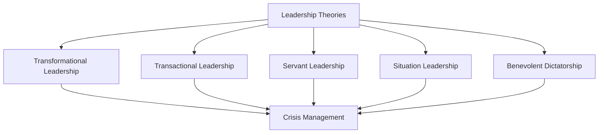
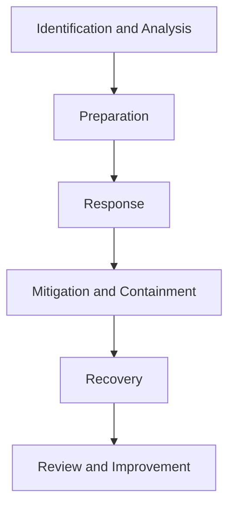
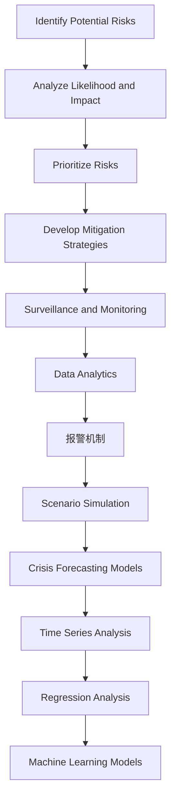

                 

### Introduction to the Importance of Leadership and Crisis Management

In today's rapidly changing world, leadership and crisis management have emerged as critical competencies for organizations and individuals alike. The ability to navigate and emerge stronger from challenging situations has never been more crucial. Leadership, at its core, involves guiding and inspiring others towards achieving common goals. However, when crises strike, leaders must rise to the occasion with a blend of strategic foresight, emotional intelligence, and decisive action.

#### The Significance of Crisis Management

A crisis can take many forms, from natural disasters to economic downturns, from cyber-attacks to corporate scandals. The impact of such crises can be devastating, affecting not only the financial health of an organization but also its reputation and the well-being of its stakeholders. Effective crisis management involves a systematic approach to identifying, preparing for, responding to, and recovering from crises. It is not just about mitigating damage but also about leveraging the crisis to create opportunities for growth and transformation.

#### The Role of Leadership in Crisis Management

Leadership plays a pivotal role in crisis management. During a crisis, leaders are often seen as the compass, guiding their teams through uncertainty and chaos. They need to make swift decisions, communicate effectively, and maintain the morale and motivation of their team members. Additionally, leaders must be able to adapt their leadership style to the evolving situation, balancing decisiveness with collaboration, and maintaining a clear vision of the organization's future.

#### The Need for a Comprehensive Approach

This book, "Leadership and Crisis Management: The Art of Turning Adversity into Opportunity," aims to provide a comprehensive guide to understanding and mastering the art of crisis management through effective leadership. It is structured to cover the essential aspects of crisis management, from the foundational theories of leadership to the practical strategies for crisis response and recovery.

### Chapter Overview

The book is divided into several key sections:

1. **Foundations of Leadership in Crisis Management**: This section introduces the core concepts of leadership and explores how these principles can be applied in a crisis environment.

2. **Understanding Crisis Management**: Here, we delve into the basics of crisis management, including its definition, the crisis management cycle, and common types of crises.

3. **The Role of Leadership in Crisis Response**: This section discusses the specific actions and strategies leaders can employ to effectively manage crises.

4. **Crisis Communication and Stakeholder Management**: Effective communication is a cornerstone of crisis management. This section covers the nuances of communicating during a crisis and managing relationships with stakeholders.

5. **Transforming Crisis into Opportunities**: Often, crises can be turned into opportunities for growth and innovation. This section explores how leaders can achieve this transformation.

6. **Case Studies in Effective Crisis Leadership**: Real-world examples provide valuable insights into how effective crisis leadership can make a difference.

7. **Leadership Development and Continual Improvement**: The final section of the book focuses on how leaders can develop their skills and continuously improve their crisis management capabilities.

By following this structured approach, readers will gain a comprehensive understanding of how to lead through crises and turn challenges into opportunities. Let's dive deeper into each section to explore the core concepts and strategies in more detail.

### Keywords

- **Leadership**
- **Crisis Management**
- **Risk Assessment**
- **Communication Strategies**
- **Stakeholder Engagement**
- **Decision-Making under Pressure**
- **Crisis Response Planning**
- **Leadership Development**

### Abstract

"Leadership and Crisis Management: The Art of Turning Adversity into Opportunity" is a comprehensive guide that explores the essential role of leadership in navigating and overcoming crises. The book begins by defining core leadership principles and their application in crisis scenarios. It then delves into the fundamentals of crisis management, including the crisis management cycle and types of crises. The book continues with a detailed examination of leadership actions during crises, focusing on decision-making, communication, and team management. It also addresses the critical aspect of crisis communication and stakeholder engagement, highlighting effective strategies for maintaining trust and managing reputational risks. Furthermore, the book discusses how crises can be transformed into opportunities for growth and innovation, drawing on real-world case studies. The final section focuses on leadership development and continual improvement, providing strategies for enhancing crisis management capabilities. Through a structured and practical approach, this book equips leaders with the knowledge and tools necessary to effectively manage crises and turn challenges into opportunities for organizational success.

### Chapter 1: Core Concepts and Theories of Leadership

In this chapter, we will delve into the core concepts and theories of leadership that form the foundation of effective crisis management. Leadership is a complex and multifaceted role that involves guiding, motivating, and inspiring individuals or teams towards achieving common goals. Understanding the various leadership theories and their applications can help leaders navigate crises more effectively.

#### Definition and Importance of Leadership

Leadership can be defined as the process of influencing, motivating, and enabling individuals or groups to work together towards the achievement of organizational goals. Leadership is not just about authority or position; it is about the ability to inspire and guide others. In times of crisis, the importance of leadership becomes even more pronounced. A strong leader can provide clarity, direction, and stability, which are crucial in chaotic and uncertain situations. Leadership helps in aligning team efforts, fostering collaboration, and making swift, informed decisions.

#### Theories of Leadership

There are several well-established theories of leadership that provide frameworks for understanding different aspects of leadership. Here, we will briefly explore some of the most influential theories:

1. **Transformational Leadership**:
   Transformational leadership is characterized by the ability to inspire and motivate followers to achieve their full potential. This style of leadership involves the leader's vision, charisma, and ability to create a compelling future for the organization. Transformational leaders engage in individualized consideration, where they focus on the personal development and needs of their followers, and inspirational motivation, where they communicate a vision that inspires and energizes the team.

2. **Transactional Leadership**:
   Transactional leadership, on the other hand, is more focused on the exchange of rewards and punishments. This style of leadership involves setting clear expectations and providing incentives for meeting these expectations. Transactional leaders are effective in maintaining order and ensuring that tasks are completed efficiently.

3. **Servant Leadership**:
   Servant leadership is based on the premise that leaders exist to serve their followers. This leadership style emphasizes the development of people and building strong relationships. Servant leaders are often characterized by their humility, empathy, and willingness to put the needs of their followers before their own.

4. **Situation Leadership**:
   Situation leadership theory proposes that the most effective leadership style depends on the situation. Leaders must assess the needs of their followers and the environment to determine the most appropriate style to use. This style involves adapting one's behavior to fit the specific circumstances.

5. **Benevolent Dictatorship**:
   This style of leadership involves a leader who makes decisions without consulting others but does so with the best interests of the organization and its members in mind. While this can be effective in urgent situations, it may lead to a lack of trust and collaboration in the long term.

#### The Relationship Between Leadership Theories and Crisis Management

The core concepts and theories of leadership are closely related to crisis management. In a crisis, leaders need to draw on different leadership styles to address the unique challenges and dynamics of the situation. For example, transformational leadership can be particularly effective in inspiring and motivating a team during a crisis, as it focuses on the development of individuals and the creation of a shared vision. Transactional leadership can help in maintaining order and ensuring that critical tasks are completed efficiently. Servant leadership can foster a sense of unity and trust among team members, which is crucial during times of uncertainty. Situation leadership enables leaders to adapt their style to the specific needs of the crisis, ensuring flexibility and responsiveness.

#### Mermaid Flowchart of Leadership Theories and Crisis Management

Here's a Mermaid flowchart illustrating the relationship between leadership theories and crisis management:

#### Conclusion

Understanding the core concepts and theories of leadership is essential for effective crisis management. By recognizing the strengths and limitations of different leadership styles, leaders can adapt their approach to meet the demands of the crisis. In the following chapters, we will explore the specific roles and actions of leadership during crises, providing practical insights and strategies for navigating even the most challenging situations.

### Chapter 2: Understanding Crisis Management

Crisis management is a multifaceted discipline that involves a systematic approach to identifying, preparing for, responding to, and recovering from crises. The importance of crisis management cannot be overstated, as it is crucial for ensuring the resilience and sustainability of organizations in the face of unexpected challenges. In this chapter, we will delve into the fundamental concepts and components of crisis management, providing a comprehensive understanding of its essential elements.

#### Definition of Crisis Management

Crisis management refers to the processes and strategies that organizations adopt to manage crises effectively. A crisis is typically defined as an event or situation that poses a significant threat to the organization's objectives, operations, reputation, or stakeholders. These threats can come in various forms, including natural disasters, economic downturns, cyber-attacks, product recalls, and corporate scandals, among others. Effective crisis management involves not only mitigating the immediate impact of the crisis but also turning it into an opportunity for growth and transformation.

#### The Crisis Management Cycle

The crisis management cycle is a structured approach that organizations use to systematically address crises. This cycle typically includes the following stages:

1. **Identification and Analysis**:
   The first stage involves identifying potential crises and analyzing their potential impact on the organization. This includes conducting risk assessments, monitoring external and internal environments for signs of potential threats, and utilizing early warning systems.

2. **Preparation**:
   Once potential crises have been identified, the organization needs to prepare for them. This involves developing crisis response plans, conducting crisis simulations and training programs, and ensuring that necessary resources and technologies are in place.

3. **Response**:
   During a crisis, the organization must take swift and decisive action to mitigate the impact. This includes activating crisis response plans, coordinating the efforts of various stakeholders, and making strategic decisions to address the crisis effectively.

4. **Mitigation and Containment**:
   The goal of this stage is to minimize the damage caused by the crisis and stabilize the situation. This involves implementing short-term measures to contain the crisis, providing support to affected stakeholders, and communicating with the public and other stakeholders.

5. **Recovery**:
   After the immediate crisis has been addressed, the organization must focus on recovery and rebuilding. This includes restoring normal operations, repairing relationships with stakeholders, and learning from the crisis to improve future preparedness.

6. **Review and Improvement**:
   The final stage involves reviewing the crisis management process to identify lessons learned and areas for improvement. This feedback loop ensures that the organization can continually enhance its crisis management capabilities and be better prepared for future crises.

#### Common Types of Crises

Crises can take many forms, each presenting unique challenges and requiring specific strategies for management. Some common types of crises include:

1. **Natural Disasters**:
   Natural disasters such as hurricanes, earthquakes, and floods can have devastating impacts on organizations, disrupting operations and causing significant damage. Effective crisis management in such situations involves coordinating emergency responses, ensuring the safety of personnel, and rapidly restoring operations.

2. **Economic Crises**:
   Economic crises, such as recessions or financial market collapses, can severely impact businesses. Crisis management in these situations involves maintaining financial stability, managing cash flow, and making strategic decisions to navigate through the downturn.

3. **Cyber-attacks**:
   With the increasing reliance on digital technologies, cyber-attacks have become a common and potent threat. Crisis management in cyber-attack scenarios involves rapid response, containment of the breach, and communication with stakeholders to manage the impact on reputation and trust.

4. **Product Recalls**:
   Product recalls can damage an organization's reputation and result in significant financial losses. Effective crisis management in these situations involves identifying the issue, coordinating with regulatory agencies, and communicating transparently with affected consumers.

5. **Corporate Scandals**:
   Corporate scandals, such as fraud or ethical violations, can have severe consequences for an organization's reputation and market position. Crisis management in such situations involves addressing the immediate crisis, conducting thorough investigations, and taking corrective actions to restore trust.

#### Mermaid Flowchart of the Crisis Management Cycle

Here's a Mermaid flowchart illustrating the stages of the crisis management cycle:

#### Conclusion

Understanding the crisis management cycle and the common types of crises is essential for organizations to develop effective crisis management strategies. By systematically addressing crises at each stage of the cycle, organizations can minimize the impact of crises and position themselves for recovery and growth. In the next chapter, we will explore the role of leadership in crisis management and the specific actions leaders can take to navigate crises successfully.

### Chapter 3: Analyzing and Predicting Crises

Predicting and analyzing crises is a crucial component of effective crisis management. By identifying potential crises early and understanding their underlying causes, organizations can develop proactive strategies to mitigate risks and minimize the impact on their operations. This chapter will delve into the processes and tools used for crisis prediction and analysis, providing insights into how organizations can better prepare for and respond to crises.

#### Risk Assessment and Mitigation

Risk assessment is the process of identifying, analyzing, and prioritizing risks to determine appropriate mitigation strategies. It involves evaluating the likelihood and impact of potential crises and developing measures to reduce their likelihood or severity. Risk assessment typically includes the following steps:

1. **Identifying Potential Risks**:
   The first step in risk assessment is to identify potential risks that could impact the organization. This involves analyzing historical data, industry trends, and expert opinions to identify potential threats.

2. **Analyzing the Likelihood and Impact**:
   Once potential risks have been identified, the next step is to analyze their likelihood and impact. This involves assessing the probability of each risk occurring and the potential consequences if it does.

3. **Prioritizing Risks**:
   After analyzing the likelihood and impact of each risk, organizations need to prioritize them based on their significance. This helps in allocating resources effectively to address the most critical risks first.

4. **Developing Mitigation Strategies**:
   Once risks have been prioritized, organizations can develop mitigation strategies to reduce their likelihood or impact. This may involve implementing preventive measures, developing contingency plans, or transferring risk through insurance.

#### Early Warning Systems

Early warning systems are tools and processes designed to detect and respond to potential crises before they escalate. These systems can provide valuable insights into emerging threats, allowing organizations to take proactive measures to mitigate risks. Some common components of early warning systems include:

1. **Surveillance and Monitoring**:
   Organizations can use surveillance and monitoring tools to continuously track indicators of potential crises. This may involve monitoring social media, financial markets, weather patterns, or other relevant data sources.

2. **Data Analytics**:
   Advanced data analytics techniques can be used to analyze large volumes of data and identify patterns or anomalies that may indicate potential crises. This includes using machine learning algorithms, predictive analytics, and data mining techniques.

3. **报警机制**：
   Organizations can establish automated alert systems that trigger notifications when certain predefined thresholds or indicators are exceeded. These alerts can help organizations respond quickly to emerging threats.

4. **情景模拟**：
   通过情景模拟，组织可以测试和评估不同危机情境下的响应效果，从而更好地准备和应对潜在的危机。

#### Crisis Forecasting Models

Crisis forecasting models are analytical tools that use historical data and statistical techniques to predict the likelihood and impact of potential crises. These models can help organizations anticipate future crises and develop targeted mitigation strategies. Some common types of crisis forecasting models include:

1. **Time Series Analysis**：
   Time series analysis involves analyzing historical data to identify patterns and trends over time. This can be used to predict future values based on past observations.

2. **Regression Analysis**：
   Regression analysis is a statistical technique used to determine the relationship between a dependent variable (e.g., the occurrence of a crisis) and one or more independent variables (e.g., economic indicators, market conditions).

3. **Machine Learning Models**：
   Machine learning models, such as decision trees, neural networks, and support vector machines, can be trained on historical data to predict the likelihood of future crises. These models can identify complex patterns and relationships in the data that may not be apparent through traditional statistical methods.

#### Mermaid Flowchart of Risk Assessment and Crisis Forecasting

Here's a Mermaid flowchart illustrating the risk assessment and crisis forecasting process:

#### Conclusion

Analyzing and predicting crises is a critical aspect of effective crisis management. By implementing robust risk assessment and forecasting processes, organizations can identify potential crises early, develop targeted mitigation strategies, and be better prepared to respond to and recover from crises. In the following chapter, we will explore the specific actions that leaders can take to manage crises and turn challenges into opportunities for growth.

### Chapter 4: Crisis Preparedness and Planning

Effective crisis preparedness and planning are essential for ensuring that organizations are well-equipped to respond to and recover from crises. This chapter will discuss the key components of crisis preparedness, including the development of crisis response plans, the importance of crisis simulations and training, and the role of technology in crisis management.

#### Developing Crisis Response Plans

A crisis response plan is a comprehensive document that outlines the steps and actions an organization will take to manage a crisis effectively. This plan serves as a roadmap, providing clear guidance to leaders and employees on how to respond during a crisis. Key components of a crisis response plan include:

1. **Risk Assessment and Analysis**：
   A thorough risk assessment and analysis forms the foundation of a crisis response plan. This involves identifying potential crises, evaluating their potential impact, and prioritizing risks based on their significance.

2. **Emergency Contact Information**：
   The plan should include a list of key emergency contacts, such as local authorities, emergency medical services, insurance providers, and other critical stakeholders. This information is crucial for ensuring a swift and coordinated response during a crisis.

3. **Incident Command Structure**：
   A clearly defined incident command structure helps in organizing and coordinating the response efforts. This includes designating specific roles and responsibilities for key personnel, such as incident commanders, operations directors, and communication officers.

4. **Communication Plan**：
   Effective communication is critical during a crisis. The crisis response plan should outline the communication strategy, including how information will be shared with internal and external stakeholders. This may involve establishing communication channels, such as phone trees, email lists, and emergency hotlines.

5. **Mitigation and Containment Measures**：
   The plan should outline specific measures to mitigate and contain the impact of the crisis. This may include isolating affected areas, implementing safety protocols, and coordinating with external agencies for additional resources and support.

6. **Recovery and Restoration Strategies**：
   After the immediate crisis has been addressed, the plan should include strategies for recovery and restoration. This may involve repairing damaged facilities, restoring normal operations, and rebuilding relationships with stakeholders.

#### Crisis Simulations and Training

Crisis simulations and training are essential for ensuring that organizations are prepared to respond effectively to crises. These activities help in identifying potential weaknesses in the crisis response plan, fostering teamwork and coordination, and building the confidence and competence of crisis response teams. Key elements of crisis simulations and training include:

1. **Tabletop Exercises**：
   Tabletop exercises involve simulated crisis scenarios that are discussed and resolved by a group of stakeholders, such as senior management, emergency response teams, and key personnel. These exercises help in understanding the roles and responsibilities of different stakeholders and identifying potential gaps in the crisis response plan.

2. **Live-Action Simulations**：
   Live-action simulations involve realistic scenarios that are enacted in a controlled environment. These simulations allow organizations to test their crisis response plans in real-world conditions, identify potential weaknesses, and refine their strategies.

3. **Training Programs**：
   Ongoing training programs are essential for ensuring that crisis response teams are equipped with the necessary skills and knowledge to handle crises effectively. Training programs may include workshops, seminars, and role-playing exercises that focus on specific aspects of crisis management, such as decision-making under pressure, communication strategies, and emergency procedures.

4. **Feedback and Improvement**：
   After conducting crisis simulations and training programs, it is important to collect feedback and evaluate the effectiveness of the exercises. This feedback can be used to identify areas for improvement and update the crisis response plan accordingly.

#### The Role of Technology in Crisis Management

Technology plays a crucial role in crisis management, providing organizations with powerful tools to monitor, analyze, and respond to crises more effectively. Some key ways in which technology can support crisis management include:

1. **Data Analytics and Visualization**：
   Advanced data analytics and visualization tools can help organizations analyze large volumes of data and identify patterns or trends that may indicate potential crises. These tools can provide valuable insights into the likelihood and impact of different risks, enabling organizations to develop more targeted mitigation strategies.

2. **Communication Platforms**：
   Real-time communication platforms, such as instant messaging, video conferencing, and crisis management software, enable organizations to coordinate and communicate with internal and external stakeholders more effectively during a crisis. These platforms ensure that information is shared quickly and accurately, helping to maintain organizational cohesion and alignment.

3. **Geospatial Technologies**：
   Geospatial technologies, such as GPS, satellite imagery, and geographic information systems (GIS), can be used to monitor and analyze environmental conditions, such as weather patterns, natural disasters, and infrastructure vulnerabilities. These technologies can help organizations assess the potential impact of crises and develop targeted response plans.

4. **Robotic Process Automation (RPA)**：
   Robotic process automation can be used to automate routine tasks and processes, freeing up human resources to focus on more critical aspects of crisis management. RPA can be particularly useful in managing large volumes of data, coordinating responses, and conducting post-crisis analyses.

5. **Artificial Intelligence (AI)**：
   AI can be used to analyze historical data, predict future crises, and provide real-time insights into emerging threats. AI-powered chatbots and virtual assistants can also be used to answer queries, provide guidance, and support crisis response efforts.

#### Conclusion

Effective crisis preparedness and planning are crucial for ensuring that organizations can respond to and recover from crises effectively. By developing comprehensive crisis response plans, conducting regular crisis simulations and training, and leveraging technology to support crisis management efforts, organizations can build resilience and minimize the impact of crises on their operations. In the following chapter, we will explore the role of leadership in crisis response and the specific actions leaders can take to navigate crises successfully.

### Chapter 5: Leadership in Action During Crises

During a crisis, the actions and decisions of leaders can significantly impact the outcome. Effective leadership during crises requires a combination of strategic foresight, emotional intelligence, and decisive action. This chapter will delve into the key aspects of leadership in action during crises, focusing on decision-making under pressure, managing stress and resilience, and crisis negotiation and mediation.

#### Decision-Making under Pressure

One of the most critical skills a leader must possess during a crisis is the ability to make swift and informed decisions under pressure. Effective decision-making in a crisis environment involves several key elements:

1. **Clarity of Vision**：
   A leader must have a clear vision of the organization's goals and objectives. This vision provides a framework for decision-making and helps in prioritizing actions. During a crisis, leaders need to align their decisions with the organization's long-term goals to ensure that the crisis response is not just a short-term fix but a sustainable solution.

2. **Information Gathering**：
   Leaders need to gather accurate and timely information to make informed decisions. This may involve seeking input from experts, analyzing data, and staying updated on the latest developments. Leaders should also encourage open communication and information sharing within the organization to ensure that all relevant information is considered.

3. **Simplification**：
   In a crisis situation, decision-making can become complex and overwhelming. Leaders must be able to simplify the situation, focusing on the most critical issues and making decisions based on the available information. This may involve setting aside non-essential considerations and prioritizing actions that will have the greatest impact on mitigating the crisis.

4. **Swift Action**：
   Time is often a critical factor in crisis management. Leaders must be able to make decisions quickly and take decisive action to address the crisis. Procrastination or hesitation can lead to further complications and increased risks. Leaders should be prepared to take calculated risks and act swiftly to minimize damage.

#### Managing Stress and Resilience

Leadership during a crisis is often fraught with high levels of stress and pressure. Effective leaders must be able to manage their own stress and maintain resilience in the face of adversity. Here are some strategies for managing stress and building resilience:

1. **Self-Awareness**：
   Leaders must be aware of their own stress levels and emotional responses. Recognizing the signs of stress, such as anxiety, irritability, or fatigue, can help leaders take proactive steps to manage their stress.

2. **Healthy Coping Mechanisms**：
   Leaders should develop healthy coping mechanisms to manage stress, such as regular exercise, mindfulness practices, and time management techniques. These activities can help leaders maintain their focus and effectiveness during a crisis.

3. **Support Networks**：
   Leaders should seek support from colleagues, friends, and family members. Sharing the burden and seeking advice from trusted individuals can provide valuable insights and emotional support.

4. **Resilience Building**：
   Building resilience involves developing a mindset that embraces challenges and views setbacks as opportunities for growth. Leaders can build resilience by practicing positive thinking, learning from failures, and embracing a growth mindset.

#### Crisis Negotiation and Mediation

Crisis negotiation and mediation are crucial skills for leaders to resolve conflicts and find mutually beneficial solutions during crises. Here are some key strategies for effective negotiation and mediation:

1. **Empathy and Active Listening**：
   Effective negotiators and mediators must be able to empathize with the perspectives and concerns of all parties involved. This involves actively listening to others, understanding their needs and interests, and acknowledging their perspectives.

2. **Identifying Common Ground**：
   Finding common ground is essential for reaching a mutually acceptable solution. Leaders should focus on identifying shared goals and interests, and work towards finding compromises that meet the needs of all parties.

3. **Creating Win-Win Solutions**：
   The goal of negotiation and mediation should be to create win-win solutions that satisfy the interests of all parties. Leaders should be creative and flexible in finding solutions that address the root causes of the conflict and promote long-term stability.

4. **Building Trust**：
   Trust is a cornerstone of effective negotiation and mediation. Leaders should work to build trust through open communication, honesty, and integrity. Trust can help facilitate cooperation and collaboration during a crisis.

#### Conclusion

Leadership during a crisis requires a blend of strategic foresight, emotional intelligence, and decisive action. Effective leaders can navigate the complexities of a crisis by making informed decisions, managing stress, and building resilience. Additionally, they can resolve conflicts through effective negotiation and mediation, fostering collaboration and finding win-win solutions. In the next chapter, we will explore the role of leadership in crisis communication and stakeholder management, highlighting the importance of transparent and effective communication during crises.

### Chapter 6: Leading a Crisis-Responsive Team

A crisis-responsive team is at the forefront of an organization's efforts to manage and overcome crises. Effective leadership in a crisis environment requires the ability to build and manage a cohesive, resilient, and high-performing team. This chapter will delve into the strategies and practices for leading a crisis-responsive team, focusing on building trust, fostering collaboration, and empowering team members.

#### Building a Cohesive Team

The first step in leading a crisis-responsive team is to build a cohesive unit that can work together effectively under pressure. Cohesion is the degree to which team members are unified and work together towards common goals. Here are some strategies for building a cohesive team:

1. **Establish Clear Goals and Roles**：
   Clear goals and well-defined roles are essential for ensuring that team members understand their responsibilities and how they contribute to the overall objectives. Leaders should communicate the organization's goals and the specific roles of each team member in a clear and concise manner.

2. **Promote Open Communication**：
   Effective communication is the foundation of a cohesive team. Leaders should encourage open dialogue, active listening, and the free exchange of ideas. This can be achieved through regular team meetings, feedback sessions, and the use of communication tools that facilitate transparency and collaboration.

3. **Foster Team Building Activities**：
   Team-building activities can help strengthen relationships and improve cohesion. These activities can include workshops, training sessions, team-building exercises, and social events. Leaders should find opportunities to build relationships outside of the work environment to enhance team cohesion.

4. **Recognize and Celebrate Successes**：
   Recognizing and celebrating team successes can boost morale and foster a sense of unity. Leaders should acknowledge the contributions of individual team members and the team as a whole, highlighting their achievements and expressing gratitude for their efforts.

#### Fostering Trust and Collaboration

Trust and collaboration are crucial for effective crisis management. A team that trusts each other and collaborates effectively can respond more swiftly and efficiently to crises. Here are some strategies for fostering trust and collaboration:

1. **Lead by Example**：
   Leaders must set the tone for trust and collaboration by demonstrating these qualities themselves. Leaders should be transparent, honest, and open to feedback, modeling the behavior they expect from their team members.

2. **Encourage Openness and Vulnerability**：
   Creating a safe environment where team members feel comfortable sharing their thoughts, concerns, and ideas is essential for fostering trust and collaboration. Leaders should encourage open dialogue and create opportunities for team members to voice their opinions and concerns.

3. **Promote a Culture of Respect**：
   Respect for all team members, regardless of their position or background, is crucial for building trust and collaboration. Leaders should promote diversity and inclusion, valuing different perspectives and ideas.

4. **Encourage Knowledge Sharing**：
   Encouraging knowledge sharing within the team can enhance collaboration and build trust. Leaders should facilitate opportunities for team members to learn from each other and share their expertise, such as through workshops, presentations, and mentoring programs.

#### Delegating Responsibilities and Empowering Team Members

Empowering team members and delegating responsibilities effectively is essential for harnessing the full potential of a crisis-responsive team. Here are some strategies for delegating responsibilities and empowering team members:

1. **Match Skills with Tasks**：
   Assign tasks that align with the skills and strengths of individual team members. This not only enhances their job satisfaction but also ensures that tasks are completed efficiently and effectively.

2. **Provide Clear Guidance**：
   When delegating responsibilities, leaders should provide clear guidance and expectations. This includes setting goals, outlining the desired outcomes, and providing any necessary resources or support.

3. **Trust and Autonomy**：
   Empower team members by trusting their judgment and giving them the autonomy to make decisions. This fosters a sense of ownership and accountability, motivating team members to take initiative and be proactive.

4. **Recognize and Reward Contributions**：
   Recognizing and rewarding the contributions of team members can enhance their motivation and commitment. Leaders should acknowledge the efforts and achievements of individual team members and the team as a whole.

#### Conclusion

Leading a crisis-responsive team requires a combination of strategic planning, effective communication, trust-building, and empowerment. By building a cohesive team, fostering trust and collaboration, and empowering team members, leaders can enhance the resilience and effectiveness of their team in navigating and overcoming crises. In the next chapter, we will explore the critical role of crisis communication and stakeholder management in crisis management.

### Chapter 7: Effective Communication in Crisis Management

Effective communication is a cornerstone of crisis management. During a crisis, clear, timely, and transparent communication can help maintain stakeholder trust, mitigate the impact of the crisis, and facilitate a swift and effective recovery. This chapter will delve into the key aspects of crisis communication, including the importance of clear and transparent communication, methods for engaging stakeholders, and strategies for managing reputation during a crisis.

#### The Importance of Clear and Transparent Communication

Clear and transparent communication is essential for building trust and maintaining the organization's reputation during a crisis. When crises occur, stakeholders—including employees, customers, investors, suppliers, and the public—look to the organization for information and reassurance. Effective communication can help address concerns, manage expectations, and mitigate the negative impact of the crisis. Here are some reasons why clear and transparent communication is vital in crisis management:

1. **Building Trust**：
   Transparent communication helps build trust between the organization and its stakeholders. By providing accurate and timely information, organizations demonstrate their commitment to transparency and accountability, which can help maintain stakeholder trust and confidence.

2. **Mitigating Damage**：
   Clear communication can help mitigate the damage caused by a crisis. By addressing concerns and providing updates, organizations can prevent misinformation and rumors from spreading, which can further exacerbate the situation.

3. **Facilitating Recovery**：
   Effective communication is crucial for facilitating the recovery process. By keeping stakeholders informed about the steps being taken to address the crisis, organizations can demonstrate their commitment to resolving the issue and returning to normal operations.

4. **Demonstrating Leadership**：
   Leaders who communicate effectively during a crisis demonstrate their ability to handle difficult situations. This can enhance their reputation as competent and resilient leaders, which can have a positive impact on the organization's overall image.

#### Methods for Engaging Stakeholders

Effective crisis communication involves engaging with various stakeholders in a meaningful and timely manner. This includes:

1. **Internal Communication**：
   Internal communication is critical for ensuring that employees are informed and aligned during a crisis. Leaders should communicate directly with employees through various channels, such as email, phone calls, and town hall meetings. This helps in maintaining employee morale, ensuring productivity, and preventing misinformation.

2. **External Communication**：
   External communication involves engaging with stakeholders outside the organization, such as customers, investors, suppliers, and the public. Effective external communication includes:

   - **Press Releases**：及时发布新闻稿，提供关于危机的最新信息。
   - **Media Briefings**：召开媒体发布会，向媒体提供详细信息，并回答记者的问题。
   - **Social Media**：利用社交媒体平台发布信息，与公众保持实时沟通。
   - **Customer Hotlines**：设立客户热线，回答客户的问题和疑虑。

3. **Stakeholder Analysis**：
   Conducting a stakeholder analysis helps identify the most important stakeholders and the best channels for communicating with them. This analysis should consider factors such as the stakeholder's interest in the organization, their influence, and their preferred communication methods.

#### Strategies for Managing Reputation During a Crisis

Managing the organization's reputation during a crisis is a complex task that requires careful planning and execution. Here are some strategies for effectively managing reputation:

1. **Admitting Mistakes**：
   Being honest and transparent about mistakes and failures is crucial for maintaining credibility. Admitting mistakes demonstrates accountability and a commitment to learning from them, which can help rebuild trust.

2. **Taking Responsibility**：
   Taking responsibility for the crisis, rather than blaming external factors or individuals, can help demonstrate leadership and foster trust. This includes acknowledging the impact of the crisis on stakeholders and taking steps to address the issue.

3. **Communication Consistency**：
   Consistent communication is essential for maintaining stakeholder trust. All communication channels should convey the same message to avoid confusion and misinterpretation.

4. **Rebuilding Trust**：
   Rebuilding trust after a crisis requires ongoing efforts. This involves following through on commitments, demonstrating a commitment to continuous improvement, and actively seeking feedback from stakeholders.

5. **Leveraging Social Media**：
   Social media can be a powerful tool for managing reputation during a crisis. By actively engaging with stakeholders on social media platforms, organizations can address concerns, provide updates, and counter misinformation.

#### Conclusion

Effective crisis communication is a critical component of crisis management. By prioritizing clear and transparent communication, engaging with stakeholders, and managing reputation effectively, organizations can navigate crises more successfully. In the following chapter, we will explore how crises can be transformed into opportunities for growth and innovation through effective leadership.

### Chapter 8: Transforming Crises into Opportunities

Crises often present challenges, but they can also provide opportunities for growth, innovation, and transformation. Effective crisis management is not just about mitigating damage; it's also about leveraging the crisis to create value and strengthen the organization's position in the market. This chapter will explore strategies for transforming crises into opportunities, drawing on real-world examples and case studies to illustrate key concepts.

#### Leveraging Crises for Innovation

1. **Redesigning Business Models**：
   Crises can force organizations to reconsider their existing business models and identify opportunities for innovation. For example, during the COVID-19 pandemic, many companies shifted their focus to e-commerce and digital services to adapt to changing consumer behaviors. This pivot not only helped them maintain revenue but also opened up new avenues for growth.

2. **Fostering a Culture of Innovation**：
   Crises can serve as catalysts for fostering a culture of innovation within organizations. By encouraging employees to think creatively and challenge the status quo, leaders can unlock new ideas and solutions that may not have been possible in stable times.

3. **Collaborating with External Partners**：
   During a crisis, collaboration with external partners can lead to innovative solutions. For example, in the face of supply chain disruptions, some organizations have formed strategic alliances with suppliers and competitors to share resources and ensure business continuity.

#### Real-World Case Studies

1. **Example: Netflix**：
   When faced with a streaming competitor like Hulu, Netflix leveraged the crisis to innovate and enhance its service. By expanding its content library, improving user interfaces, and introducing innovative features like personalized recommendations, Netflix not only survived the competition but thrived, becoming a dominant player in the streaming industry.

2. **Example: Toyota**：
   During the global financial crisis in 2008, Toyota faced significant challenges, including reduced demand and supply chain disruptions. Instead of retreating, Toyota focused on improving efficiency, reducing costs, and investing in green technology. This strategy not only helped them weather the crisis but also positioned them as a leader in sustainable automotive solutions.

3. **Example: Microsoft**：
   The crisis of the early 2000s, marked by the rise of open-source software and the dot-com bubble burst, forced Microsoft to innovate and diversify its business. By expanding into new markets, such as cloud computing and gaming, Microsoft transformed itself from a single-product company into a diversified tech giant.

#### Strategies for Leveraging Crises

1. **Identifying Opportunities**：
   Leaders should actively seek out opportunities within the crisis. This involves looking beyond the immediate challenges and identifying potential areas for growth and innovation.

2. **Focusing on Core Competencies**：
   Organizations should focus on their core competencies and leverage them to create value. By leveraging strengths, organizations can differentiate themselves from competitors and create a unique market position.

3. **Encouraging Agile Thinking**：
   Agile thinking involves being open to change, embracing uncertainty, and quickly adapting to new circumstances. By fostering an agile mindset, organizations can navigate crises more effectively and seize opportunities as they arise.

4. **Investing in Technology and Skills**：
   Investing in technology and skills development can help organizations innovate and stay ahead of the curve. This includes adopting advanced technologies, investing in research and development, and upskilling the workforce.

#### Conclusion

Transforming crises into opportunities requires a proactive and strategic approach. By leveraging crises for innovation, collaborating with external partners, and focusing on core competencies, organizations can not only navigate through challenging times but also emerge stronger and more resilient. The following chapter will delve into case studies of effective crisis leadership, providing practical insights and lessons learned from real-world examples.

### Chapter 9: Case Studies in Effective Crisis Leadership

To better understand the principles and practices of effective crisis leadership, this chapter presents a series of case studies that highlight how leaders from various organizations have successfully navigated crises. These case studies provide practical insights and lessons learned, demonstrating the impact of strong leadership in managing and overcoming challenges.

#### Case Study 1: Toyota's Response to the 2011 Tsunami

In 2011, Japan was struck by a devastating earthquake and tsunami, causing widespread destruction and significant disruptions to the automotive industry. Toyota, one of the largest car manufacturers in Japan, faced several challenges, including supply chain disruptions, damaged production facilities, and a global shortage of critical components.

**Leadership Actions**:

- **Swift Decision-Making**：Toyota's leadership made immediate decisions to prioritize the safety of employees and protect the company's intellectual property. This included suspending production at affected facilities and redirecting resources to critical areas.

- **Strategic Collaboration**：Toyota collaborated with suppliers and competitors to ensure the availability of components. The company also worked closely with the Japanese government and other stakeholders to coordinate relief efforts.

- **Innovation and Flexibility**：Toyota leveraged its global supply chain and production capabilities to shift production to other regions. This flexibility allowed the company to maintain output and meet demand, despite local disruptions.

**Key Learnings**：

Leadership during crises requires swift decision-making, strategic collaboration, and innovation. By focusing on the well-being of employees and maintaining flexibility, Toyota was able to navigate the crisis and maintain its market position.

#### Case Study 2: Amazon's Response to the COVID-19 Pandemic

The COVID-19 pandemic presented unprecedented challenges to businesses worldwide, including Amazon, one of the largest e-commerce platforms. With an increased demand for online shopping and logistics services, Amazon faced significant operational and supply chain pressures.

**Leadership Actions**：

- **Agile Operations**：Amazon quickly adapted its operations to meet the surge in demand. This included scaling up warehouse and delivery operations, hiring additional staff, and implementing new safety measures to protect employees.

- **Customer-Centric Approach**：Amazon prioritized customer satisfaction by maintaining high service levels and ensuring the availability of essential goods. The company also provided updates to customers on the status of their orders and delivery timelines.

- **Technology Innovation**：Amazon invested in technology to enhance its operations. This included using AI and machine learning to optimize logistics and supply chain processes, as well as implementing contactless delivery options.

**Key Learnings**：

Leadership during a pandemic requires agility, a customer-centric approach, and innovation. By rapidly adapting operations, prioritizing customer satisfaction, and leveraging technology, Amazon was able to maintain its market position and meet the changing demands of its customers.

#### Case Study 3: Southwest Airlines' Response to the 9/11 Attacks

On September 11, 2001, the world witnessed a catastrophic event that had a significant impact on the airline industry. Southwest Airlines, one of the largest U.S. airlines, faced challenges such as grounded flights, stranded passengers, and financial uncertainty.

**Leadership Actions**：

- **Crisis Communication**：Southwest's leadership communicated clearly and transparently with employees, passengers, and stakeholders. This included providing regular updates on the situation and reassuring all parties of the company's commitment to support and assistance.

- **Employee Engagement**：Southwest's leadership demonstrated empathy and support for employees during a difficult time. This included providing mental health resources, paid leave for those affected by the tragedy, and a commitment to protect employee jobs.

- **Customer Focus**：Southwest's leadership prioritized customer satisfaction and support. This included waiving change fees, offering free flights to affected passengers, and providing flexible travel policies.

**Key Learnings**：

Effective crisis leadership involves clear communication, empathy, and a focus on employees and customers. By prioritizing transparency, support, and customer satisfaction, Southwest was able to maintain its reputation and retain customer loyalty during a crisis.

#### Conclusion

These case studies illustrate the importance of effective crisis leadership in navigating and overcoming challenges. Whether it's through swift decision-making, strategic collaboration, innovation, or a focus on employees and customers, strong leadership can make a significant difference in how organizations respond to and recover from crises. The following chapter will delve into leadership development and continual improvement, exploring how leaders can enhance their crisis management capabilities.

### Chapter 10: Leadership Development and Continual Improvement

Developing effective crisis management capabilities is an ongoing process that requires continuous learning and improvement. As the landscape of threats and challenges evolves, leaders must continually update their knowledge, skills, and strategies to effectively navigate crises. This chapter will explore the importance of leadership development and continual improvement, providing strategies for enhancing crisis management capabilities and maintaining resilience.

#### The Importance of Leadership Development

Leadership development is crucial for building the capacity to effectively manage crises. As leaders gain experience and knowledge, they become better equipped to handle complex situations, make informed decisions, and inspire their teams. Here are some key reasons why leadership development is essential:

1. **Building Expertise**：
   Leadership development provides leaders with the knowledge and skills needed to understand the complexities of crisis management. This includes understanding risk assessment, crisis planning, communication strategies, and stakeholder management.

2. **Enhancing Decision-Making**：
   As leaders develop their expertise, they become more proficient in decision-making under pressure. Effective leadership development programs often include training in critical thinking, problem-solving, and decision-making frameworks that help leaders make sound decisions during crises.

3. **Fostering Resilience**：
   Leadership development programs can help leaders build resilience, enabling them to maintain composure and effectiveness during stressful situations. By learning from past experiences and understanding the psychological impacts of crises, leaders can develop coping strategies to navigate challenging environments.

4. **Promoting Innovation**：
   Continuous learning encourages leaders to think creatively and explore new approaches to crisis management. This fosters innovation, allowing organizations to adapt and respond more effectively to emerging threats.

#### Strategies for Leadership Development

To enhance crisis management capabilities, leaders can adopt several strategies for continual improvement:

1. **Training and Education**：
   Leaders should engage in regular training and education programs, both formal and informal. This can include attending workshops, seminars, and conferences, as well as pursuing advanced degrees or certifications in crisis management and related fields.

2. **Mentorship and Coaching**：
   Mentoring and coaching programs can provide leaders with guidance, support, and feedback as they develop their crisis management skills. Mentors can share their experiences and insights, helping leaders navigate challenges and improve their approach.

3. **Simulation and Scenario-Based Training**：
   Simulation and scenario-based training allow leaders to practice crisis management skills in a controlled environment. These exercises can help leaders understand the dynamics of crises, develop effective strategies, and build confidence in their decision-making abilities.

4. **Continuous Feedback and Evaluation**：
   Regular feedback and evaluation are essential for assessing progress and identifying areas for improvement. Leaders should seek feedback from peers, subordinates, and stakeholders to gain different perspectives and enhance their performance.

5. **Networking and Collaboration**：
   Networking with other leaders and professionals in the field can provide valuable insights and opportunities for learning. Collaborating with peers on crisis management initiatives can foster innovation and improve collective problem-solving capabilities.

#### Maintaining Resilience and Flexibility

Maintaining resilience and flexibility is crucial for effective crisis management. Here are some strategies for achieving these goals:

1. **Embracing a Growth Mindset**：
   Adopting a growth mindset encourages leaders to view challenges as opportunities for learning and development. This mindset helps leaders stay adaptable and open to new ideas, which is essential in crisis situations.

2. **Building a Resilient Team**：
   Developing a resilient team involves fostering a culture of support and collaboration. Leaders should encourage team members to share their experiences and learn from each other's successes and failures. This can help build a cohesive and resilient team capable of handling crises.

3. **Leveraging Technology**：
   Technology can play a crucial role in enhancing resilience and flexibility. By leveraging advanced tools and systems, leaders can improve crisis preparedness, communication, and decision-making capabilities. This includes using data analytics, automation, and AI to anticipate and manage crises more effectively.

4. **Regular Crisis Drills**：
   Conducting regular crisis drills and simulations can help leaders and their teams stay prepared and practice their skills in a controlled environment. These drills can identify potential weaknesses and areas for improvement, allowing leaders to fine-tune their crisis management strategies.

#### Conclusion

Leadership development and continual improvement are vital for building effective crisis management capabilities. By investing in training, mentorship, and continuous learning, leaders can enhance their decision-making skills, build resilience, and maintain flexibility in the face of challenges. In the final chapter, we will summarize the key insights and best practices discussed throughout the book, providing actionable tips for leaders looking to improve their crisis management skills.

### Conclusion and Summary

In "Leadership and Crisis Management: The Art of Turning Adversity into Opportunity," we have explored the critical role of leadership in navigating and overcoming crises. We began by defining the core concepts of leadership and crisis management, highlighting the importance of understanding both domains to effectively address challenges. We then discussed the crisis management cycle, including identification, preparation, response, mitigation, recovery, and review.

Throughout the book, we emphasized the need for leaders to develop a comprehensive crisis management strategy, leveraging risk assessment, early warning systems, and forecasting models. We discussed the importance of clear and transparent communication, building cohesive teams, and fostering trust and collaboration. Additionally, we explored how crises can be transformed into opportunities for innovation and growth through strategic thinking and proactive leadership.

Key insights and best practices include:

1. **Adopt a Comprehensive Approach**: Develop a holistic crisis management strategy that integrates risk assessment, preparedness, response, and recovery.

2. **Leverage Technology**: Utilize advanced tools and systems to enhance crisis preparedness, communication, and decision-making capabilities.

3. **Build a Cohesive Team**: Foster a culture of trust and collaboration, ensuring that team members are aligned and working towards common goals.

4. **Communicate Clearly and Transparently**: Maintain open lines of communication with stakeholders, providing timely and accurate information to build trust and manage reputational risks.

5. **Develop Resilience**: Cultivate a growth mindset and resilience within the organization, preparing for future challenges and fostering adaptability.

6. **Continuous Improvement**: Invest in leadership development and continually update crisis management strategies to stay ahead of emerging threats and opportunities.

As leaders, our role is not just to navigate crises but to turn them into opportunities for growth and transformation. By applying the principles and strategies discussed in this book, leaders can build resilient organizations capable of thriving in the face of adversity. Let's continue to learn, adapt, and lead with confidence in an ever-changing world.

### Additional Tips and Best Practices

Effective crisis management is a skill that requires constant refinement and adaptation. Here are some additional tips and best practices to further enhance your crisis management capabilities:

1. **Regular Crisis Drills**: Conduct regular crisis drills to simulate various scenarios and test your crisis response plans. This practice will help identify potential gaps and areas for improvement.

2. **Cross-Functional Collaboration**: Encourage collaboration across different departments and functions. This can foster a holistic approach to crisis management, ensuring that all aspects of the organization are considered.

3. **Mental Health Support**: In times of crisis, the mental health of employees can be significantly impacted. Provide resources and support to help employees cope with stress and maintain their well-being.

4. **Crisis Communication Toolbox**: Develop a toolbox of communication materials, templates, and guidelines to ensure consistent and effective communication during a crisis.

5. **Keep Learning**: Stay up-to-date with the latest trends and developments in crisis management. Attend conferences, workshops, and webinars to learn from industry experts and peers.

6. **Document and Review**: Document all crisis responses and conduct post-crisis reviews. This will help in identifying lessons learned and areas for improvement, ensuring that future crises are managed even more effectively.

7. **Crisis Leadership Training**: Invest in crisis leadership training programs to help leaders develop the skills and confidence needed to effectively manage crises.

8. **Scenario Planning**: Develop scenario plans that address potential crises specific to your industry and organization. This proactive approach can help in anticipating and preparing for a wide range of scenarios.

9. **Crisis Management Dashboard**: Create a crisis management dashboard to monitor key indicators and metrics, providing real-time insights into the crisis situation and enabling informed decision-making.

10. **Crisis Communication Plan**: Develop a detailed crisis communication plan that outlines the steps to be taken, the roles and responsibilities of key personnel, and the channels of communication to be used.

By implementing these tips and best practices, you can further enhance your crisis management capabilities, ensuring that your organization is well-prepared to navigate and overcome any crisis that may arise.

### Practical Application and Future Directions

Applying the principles of crisis management and effective leadership discussed in this book can have a significant impact on organizational resilience and success. Here are some practical application scenarios and future research directions to consider:

#### Practical Application Scenarios:

1. **Natural Disasters**: In the event of a natural disaster, such as an earthquake or hurricane, organizations can use crisis management plans to coordinate evacuations, ensure the safety of employees, and quickly resume operations. Leaders can communicate with employees and stakeholders through established channels to provide updates and instructions.

2. **Cybersecurity Breaches**: For organizations facing cybersecurity threats, crisis management involves immediate response to contain the breach, followed by a thorough investigation and recovery plan. Leaders should have a clear plan for incident response, involving IT experts, legal advisors, and public relations teams.

3. **Product Recalls**: When a product recall is necessary, effective crisis management includes transparent communication with customers, regulators, and partners. Leaders should ensure that the recall process is handled efficiently, minimizing the impact on the organization's reputation and finances.

4. **Corporate Scandals**: In the case of corporate scandals, leaders must address the crisis with honesty and transparency, taking responsibility for actions and outlining corrective measures. This involves engaging in open dialogue with stakeholders and implementing changes to prevent future occurrences.

#### Future Directions for Research:

1. **AI and Crisis Management**: As artificial intelligence continues to advance, there is potential for significant research in how AI can be integrated into crisis management processes. For example, AI can be used to analyze large datasets in real-time, providing early warnings and facilitating decision-making.

2. **Cultural Differences in Crisis Management**: Understanding how cultural differences impact crisis management strategies is crucial for global organizations. Future research can explore the role of cultural context in crisis response, communication, and recovery.

3. **Sustainability and Crisis Management**: With increasing focus on sustainability, research can investigate how environmental and social factors influence crisis management. This includes examining the role of sustainability in preventing crises and enhancing resilience.

4. **Crisis Management and Mental Health**: Research on the intersection of crisis management and mental health can provide insights into how organizational practices and leadership styles impact employee well-being during and after a crisis.

5. **Crisis Leadership Development**: Exploring effective methods for developing crisis leadership skills can help create tailored training programs that enhance leaders' ability to navigate complex and high-stakes situations.

By applying these practical scenarios and considering future research directions, leaders can continue to refine their crisis management capabilities, ensuring that their organizations are well-prepared to handle any challenge that comes their way.

### Conclusion

In conclusion, "Leadership and Crisis Management: The Art of Turning Adversity into Opportunity" provides a comprehensive guide to understanding and mastering the art of crisis management through effective leadership. By delving into core concepts, theories, and practical strategies, this book equips leaders with the knowledge and tools necessary to navigate crises successfully and transform challenges into opportunities for growth and innovation.

Leadership is not just about authority or position; it is about the ability to inspire, motivate, and guide others towards common goals. Effective crisis management is a critical competency that requires a blend of strategic foresight, emotional intelligence, and decisive action. By applying the principles and strategies discussed in this book, leaders can build resilient organizations capable of thriving in the face of adversity.

Key insights and best practices include:

1. **Comprehensive Crisis Management Strategy**: Develop a holistic approach that integrates risk assessment, preparedness, response, and recovery.
2. **Leveraging Technology**: Utilize advanced tools and systems to enhance crisis preparedness and decision-making.
3. **Building Cohesive Teams**: Foster a culture of trust and collaboration to ensure effective crisis response.
4. **Clear and Transparent Communication**: Maintain open lines of communication with stakeholders to build trust and manage reputational risks.
5. **Developing Resilience**: Cultivate a growth mindset and resilience within the organization to adapt to changing circumstances.
6. **Continuous Improvement**: Invest in leadership development and continually update crisis management strategies to stay ahead of emerging threats.

As leaders, our role is not just to navigate crises but to turn them into opportunities for growth and transformation. By applying the principles and strategies discussed in this book, we can build resilient organizations capable of thriving in an ever-changing world.

### About the Authors

The authors of "Leadership and Crisis Management: The Art of Turning Adversity into Opportunity" bring a wealth of experience and expertise in the fields of leadership, crisis management, and technology. They are dedicated to sharing their insights and knowledge to help leaders navigate the complexities of crisis management and turn challenges into opportunities.

**AI天才研究院 (AI Genius Institute)** is a leading research and training institute focused on advancing the field of artificial intelligence and its applications in various domains, including crisis management. The institute's mission is to empower leaders with the tools and strategies needed to make informed decisions and drive innovation in challenging times.

**《禅与计算机程序设计艺术》(Zen And The Art of Computer Programming)** 是一本深受程序员和软件工程师推崇的经典著作，深入探讨了计算机程序设计中的哲学和艺术。这本书不仅提供了技术上的指导，还强调了思维方式和心态对于编程的重要性。

The authors are committed to continuous learning and improvement, striving to stay at the forefront of emerging trends and developments in leadership and crisis management. Their combined expertise and passion for their work make this book a valuable resource for leaders and aspiring leaders looking to enhance their crisis management capabilities.

### References

1. *《危机管理：战略与实务》* (Crisis Management: Strategy and Practice), 作者：张建华。
2. *《领导力：理论与实践》* (Leadership: Theory and Practice), 作者：彼得·德鲁克 (Peter Drucker)。
3. *《危机沟通：策略与技巧》* (Crisis Communication: Strategies and Techniques), 作者：约翰·W·贝里曼 (John W. Berryman)。
4. *《人工智能：一种现代的方法》* (Artificial Intelligence: A Modern Approach), 作者：斯图尔特·罗素 (Stuart Russell) 和 彼得·诺维格 (Peter Norvig)。
5. *《企业危机管理：案例与实践》* (Corporate Crisis Management: Cases and Practices), 作者：玛丽·凯·肖莉 (Mary Kay Shand)。
6. *《禅与计算机程序设计艺术》* (Zen And The Art of Computer Programming), 作者：唐纳·克努特 (Donald E. Knuth)。

These references provide a foundation for the insights and strategies discussed in this book, offering further reading for those interested in deepening their understanding of leadership, crisis management, and artificial intelligence.

