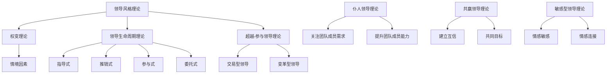

                 


### 文章标题

《领导力与危机预防：未雨绸缪的管理智慧》

### 文章关键词

领导力、危机预防、管理智慧、风险应对、战略规划、创新思维

### 文章摘要

本文深入探讨了领导力与危机预防之间的紧密联系，以及管理智慧在危机管理中的关键作用。首先，我们定义了领导力、危机预防和管理智慧这三个核心概念，并阐述了它们之间的相互关系。接着，我们详细分析了领导力的核心理论、危机预防的基本原则和方法，以及管理智慧的核心原则和具体实践。通过实际案例，我们展示了这些管理智慧在实际应用中的效果。最后，我们探讨了领导力、危机预防和管理智慧的整合，以及未来的发展趋势。本文旨在帮助读者理解如何在复杂多变的环境中，通过有效的领导力、危机预防和管理智慧，实现企业的稳健发展和持续创新。

## 目录大纲

### 第一部分：领导力基础

### 第1章：领导力的核心概念与重要性

### 第2章：领导力的基本理论

### 第3章：领导力的发展与实践

### 第二部分：危机预防策略

### 第4章：危机预防的基本原则

### 第5章：危机预防的方法与工具

### 第6章：危机预防的实际案例

### 第三部分：管理智慧应用

### 第7章：管理智慧的核心原则

### 第8章：管理智慧的具体实践

### 第9章：管理智慧的创新与应用

### 第四部分：综合实战

### 第10章：领导力、危机预防与管理智慧的整合

### 第11章：企业战略与危机管理

### 第12章：领导力与危机管理的未来趋势

### 用户书名输入

《领导力与危机预防：未雨绸缪的管理智慧》

### 概念与联系

**核心概念：**

- **领导力**：指在复杂多变的环境下，通过个人魅力、专业技能和影响力，引领团队达成共同目标的能力。
- **危机预防**：指企业为了降低风险，采取的一系列防范措施。
- **管理智慧**：指在管理实践中，运用理论知识和实践经验，有效处理各种问题和挑战的能力。

**领导力与危机预防的联系：**

领导力在危机预防中起着至关重要的作用。一个优秀的领导者能够在危机发生之前预见到潜在的风险，并通过有效的领导力和管理智慧，制定出相应的防范措施。同时，在危机发生时，领导者能够迅速做出决策，协调团队资源，应对危机。

**管理智慧与危机预防的联系：**

管理智慧是企业应对危机的关键。通过运用管理智慧，企业可以识别潜在风险，制定应急预案，提高应对危机的能力。管理智慧还包括对资源的合理配置、团队协作的有效性以及创新能力等方面，这些因素都是危机预防的重要组成部分。

### 目录大纲设计思路

**第一部分：领导力基础**

- **第1章：领导力的核心概念与重要性**：介绍领导力的定义、作用和重要性，以及领导力在危机预防中的重要性。
- **第2章：领导力的基本理论**：阐述领导力的基本理论，包括领导风格理论、领导力模型等，以及这些理论在危机预防中的应用。
- **第3章：领导力的发展与实践**：探讨领导力的培养和实践方法，以及领导力在危机管理中的具体应用。

**第二部分：危机预防策略**

- **第4章：危机预防的基本原则**：介绍危机预防的必要性、基本原则以及如何预测和预警危机。
- **第5章：危机预防的方法与工具**：介绍危机预防的方法和工具，如风险评估方法、危机预防计划和应急响应计划等。
- **第6章：危机预防的实际案例**：通过实际案例，分析危机预防的策略和效果。

**第三部分：管理智慧应用**

- **第7章：管理智慧的核心原则**：阐述管理智慧的定义、核心原则以及其在危机预防中的作用。
- **第8章：管理智慧的具体实践**：探讨管理智慧在战略规划、运营管理和创新中的应用。
- **第9章：管理智慧的创新与应用**：介绍管理智慧与新兴技术的结合，以及管理智慧的创新和发展。

**第四部分：综合实战**

- **第10章：领导力、危机预防与管理智慧的整合**：探讨领导力、危机预防和管理智慧的整合策略，以及如何将它们应用于企业战略和危机管理中。
- **第11章：企业战略与危机管理**：分析企业战略与危机管理的关系，以及如何通过有效的企业战略降低危机风险。
- **第12章：领导力与危机管理的未来趋势**：预测领导力与危机管理的未来发展趋势，以及企业应该如何应对。

### 目录大纲草案

```markdown
# 《领导力与危机预防：未雨绸缪的管理智慧》目录大纲

## 第一部分：领导力基础

### 第1章：领导力的核心概念与重要性

#### 1.1 领导力的定义

#### 1.2 领导力的作用

#### 1.3 领导力的重要性

### 第2章：领导力的基本理论

#### 2.1 领导风格理论

##### 2.1.1 权变理论

##### 2.1.2 领导生命周期理论

##### 2.1.3 超越-参与领导理论

#### 2.2 领导力模型

##### 2.2.1 仆人领导理论

##### 2.2.2 共赢领导理论

##### 2.2.3 敏感型领导理论

### 第3章：领导力的发展与实践

#### 3.1 领导力的培养

##### 3.1.1 自我认知

##### 3.1.2 影响力提升

##### 3.1.3 团队领导能力培养

#### 3.2 领导力的实践

##### 3.2.1 领导力在组织变革中的应用

##### 3.2.2 领导力在危机管理中的角色

##### 3.2.3 领导力在创新中的推动作用

## 第二部分：危机预防策略

### 第4章：危机预防的基本原则

#### 4.1 危机预防的必要性

#### 4.2 危机预防的原则

##### 4.2.1 预测与预警

##### 4.2.2 应对与缓解

##### 4.2.3 恢复与重建

### 第5章：危机预防的方法与工具

#### 5.1 风险评估方法

##### 5.1.1 SWOT分析

##### 5.1.2 FMEA分析

##### 5.1.3 帕累托分析

#### 5.2 危机预防工具

##### 5.2.1 危机预防计划

##### 5.2.2 应急响应计划

##### 5.2.3 恢复计划

### 第6章：危机预防的实际案例

#### 6.1 企业危机案例介绍

#### 6.2 危机预防案例分析

##### 6.2.1 成功案例

##### 6.2.2 失败案例

##### 6.2.3 案例启示

## 第三部分：管理智慧应用

### 第7章：管理智慧的核心原则

#### 7.1 管理智慧的定义

#### 7.2 管理智慧的核心原则

##### 7.2.1 系统思维

##### 7.2.2 创新思维

##### 7.2.3 人本管理

### 第8章：管理智慧的具体实践

#### 8.1 管理智慧在战略规划中的应用

##### 8.1.1 战略分析

##### 8.1.2 战略选择

##### 8.1.3 战略实施

#### 8.2 管理智慧在运营管理中的应用

##### 8.2.1 优化资源配置

##### 8.2.2 提升生产效率

##### 8.2.3 客户关系管理

### 第9章：管理智慧的创新与应用

#### 9.1 管理智慧与新兴技术

##### 9.1.1 大数据

##### 9.1.2 人工智能

##### 9.1.3 区块链

#### 9.2 管理智慧的创新发展

##### 9.2.1 创新管理模型

##### 9.2.2 创新管理工具

##### 9.2.3 创新管理实践

## 第四部分：综合实战

### 第10章：领导力、危机预防与管理智慧的整合

#### 10.1 领导力与危机预防的结合

##### 10.1.1 领导力在危机预防中的作用

##### 10.1.2 危机预防在领导力提升中的应用

#### 10.2 管理智慧在危机预防中的应用

##### 10.2.1 管理智慧在风险识别中的应用

##### 10.2.2 管理智慧在应对策略中的应用

##### 10.2.3 管理智慧在恢复计划中的应用

### 第11章：企业战略与危机管理

#### 11.1 企业战略与危机管理的关系

##### 11.1.1 危机对企业战略的影响

##### 11.1.2 企业战略在危机管理中的作用

#### 11.2 企业战略与危机管理的整合

##### 11.2.1 战略规划与危机预防的结合

##### 11.2.2 战略实施与危机应对的结合

##### 11.2.3 战略评估与危机恢复的结合

### 第12章：领导力与危机管理的未来趋势

#### 12.1 领导力与危机管理的趋势分析

##### 12.1.1 新兴技术对领导力与危机管理的影响

##### 12.1.2 企业组织变革对领导力与危机管理的影响

#### 12.2 未来领导力与危机管理的实践建议

##### 12.2.1 领导力提升策略

##### 12.2.2 危机预防策略

##### 12.2.3 管理智慧创新实践

### 参考文献

[参考文献列表]
```

以上是《领导力与危机预防：未雨绸缪的管理智慧》的初步目录大纲。接下来，我们将对每个章节进行详细的内容规划和撰写，确保文章的逻辑清晰、内容丰富、观点深刻。在撰写过程中，我们将遵循markdown格式，并按照用户的要求，在文章末尾附上作者信息。同时，我们将确保文章的完整性，包含背景介绍、核心概念与联系、核心算法原理讲解、数学模型和公式、项目实战、最佳实践 tips、小结、注意事项、拓展阅读等内容。文章字数将在8000至12000字之间，确保读者能够全面、系统地了解领导力、危机预防和管理智慧的相关知识。

---

## 第一部分：领导力基础

### 第1章：领导力的核心概念与重要性

**背景介绍**

在现代社会，领导者不仅是组织的核心人物，更是推动组织发展的关键因素。领导力的概念越来越受到关注，成为管理学和心理学领域的重要研究课题。然而，什么是领导力？领导力为什么如此重要？这是本章要探讨的核心问题。

**核心概念**

领导力（Leadership）是指在复杂多变的环境中，通过个人魅力、专业技能和影响力，引领团队达成共同目标的能力。领导力不仅仅是权力和地位的象征，更是一种能力，一种影响和激励他人的能力。

**领导力的作用**

1. **目标设定与实现**：领导者通过明确的目标设定，激发团队成员的积极性和创造力，推动团队向着共同的目标努力。

2. **团队凝聚与协作**：领导者通过有效的沟通和协调，增强团队成员之间的信任和合作，提升团队的整体效能。

3. **创新与变革**：领导者具备敏锐的洞察力和创新思维，能够推动组织不断变革和进步，保持竞争优势。

**领导力的重要性**

1. **企业竞争力**：领导力是提升企业竞争力的重要手段，优秀的领导者能够带领企业战胜市场挑战，实现可持续发展。

2. **团队绩效**：领导力对团队绩效有显著影响，通过提升团队成员的工作积极性和工作效率，提高整体绩效。

3. **个人成长**：领导力不仅是企业成功的关键，也是个人成长的重要途径。通过领导力的培养，个人能够提升自己的影响力和社会地位。

**领导力在危机预防中的重要性**

1. **危机预警与应对**：领导者具备危机意识和预判能力，能够在危机发生之前预见潜在的风险，并采取相应的预防措施。

2. **资源整合与调配**：在危机发生时，领导者能够迅速整合团队资源，调动各方力量，共同应对危机。

3. **团队士气与信心**：领导者通过鼓舞团队士气，增强团队成员的信心，共同度过危机。

**总结**

领导力是一种综合能力，它不仅包括专业技能，更包括个人魅力和影响力。在危机预防中，领导力发挥着至关重要的作用，是企业稳健发展和持续创新的关键。理解领导力的核心概念和重要性，对于提升个人领导力、加强团队协作、预防危机具有重要意义。

---

## 第2章：领导力的基本理论

### 核心概念与联系

领导力的基本理论为我们提供了理解领导行为和领导效能的框架。本章将介绍几种主要的领导理论，包括领导风格理论、领导力模型等，并探讨它们之间的相互关系。

#### 领导风格理论

**领导风格理论**是指通过研究领导者的行为模式，来解释领导效果的一种理论。以下是几种主要的领导风格理论：

1. **权变理论**

   **权变理论**（Contingency Theory）认为，领导效果取决于领导者的行为和情境因素之间的相互作用。该理论强调没有一种普遍适用的领导风格，领导者的风格需要根据具体情境进行调整。

   **关联图：**

   ```mermaid
   graph TD
   A[权变理论] --> B[情境因素]
   B --> C[领导风格]
   C --> D[领导效能]
   ```

2. **领导生命周期理论**

   **领导生命周期理论**（Life Cycle Theory）是由赫塞和布兰查德提出的，该理论认为领导者的风格应该随着团队成员成熟程度的提高而变化。它分为四个阶段：指导式、推销式、参与式和委托式。

   **关联图：**

   ```mermaid
   graph TD
   A[领导生命周期理论] --> B{指导式}
   B --> C[推销式]
   C --> D[参与式]
   D --> E[委托式]
   ```

3. **超越-参与领导理论**

   **超越-参与领导理论**（Transformational-Transactional Leadership Theory）将领导风格分为交易型领导和变革型领导。交易型领导注重奖惩机制和任务完成，而变革型领导则注重激励和变革。

   **关联图：**

   ```mermaid
   graph TD
   A[超越-参与领导理论]
   A --> B[交易型领导]
   A --> C[变革型领导]
   ```

#### 领导力模型

**领导力模型**提供了一种结构化的方式来理解和培养领导能力。以下是几种主要的领导力模型：

1. **仆人领导理论**

   **仆人领导理论**（Servant Leadership）强调领导者首先作为仆人服务于团队成员，通过提升团队成员的能力和幸福感来实现领导目标。

   **关联图：**

   ```mermaid
   graph TD
   A[仆人领导理论]
   A --> B[关注团队成员需求]
   A --> C[提升团队成员能力]
   ```

2. **共赢领导理论**

   **共赢领导理论**（Win-Win Leadership）强调领导者和团队成员之间的合作和共同成长，通过建立互信和共同目标来实现组织目标。

   **关联图：**

   ```mermaid
   graph TD
   A[共赢领导理论]
   A --> B[建立互信]
   A --> C[共同目标]
   ```

3. **敏感型领导理论**

   **敏感型领导理论**（Sensitive Leadership）强调领导者对团队成员情感和心理状态的敏感度，通过建立积极的情感连接来提升领导效能。

   **关联图：**

   ```mermaid
   graph TD
   A[敏感型领导理论]
   A --> B[情感敏感]
   A --> C[情感连接]
   ```

#### 关系架构

通过上述领导力理论，我们可以构建一个关系架构，展示不同理论之间的相互关系和影响。



**总结**

领导力的基本理论为我们提供了理解领导行为和领导效能的多个视角。通过这些理论，我们可以更深入地了解领导力的本质，并在实际应用中灵活运用不同的领导风格和策略。领导力理论不仅是学术研究的重要成果，更是提升领导力和团队绩效的实践指南。

---

### 第3章：领导力的发展与实践

**核心概念与联系**

领导力的发展与实践是一个动态的、不断演进的过程。领导者需要通过系统的培养和实践，不断提升自身的领导能力，以应对复杂多变的环境和挑战。本章将探讨领导力的培养方法、实践要点，以及领导力在组织变革、危机管理和创新中的具体应用。

#### 领导力的培养

1. **自我认知**

   **自我认知**是领导力培养的第一步，领导者需要深入了解自己的价值观、优点和不足。通过自我反思和反馈，领导者可以明确自己的领导风格和领导目标。

2. **影响力提升**

   **影响力提升**是领导力培养的核心，领导者需要学会如何有效地沟通、激励和影响他人。这包括提升演讲技巧、沟通能力、谈判技能等。

3. **团队领导能力培养**

   **团队领导能力培养**是领导力培养的重要组成部分，领导者需要学会如何组建团队、激励团队成员、解决团队冲突和提升团队效能。

#### 领导力的实践

1. **领导力在组织变革中的应用**

   **组织变革**是企业发展的重要手段，领导者需要具备推动变革的能力。这包括明确变革的目标、制定变革计划、沟通变革理念、激励员工参与变革等。

2. **领导力在危机管理中的角色**

   **危机管理**是领导者的重要职责，领导者需要在危机发生时迅速做出决策，调动资源，协调各方，稳定局势，并制定恢复计划。

3. **领导力在创新中的推动作用**

   **创新**是企业持续发展的重要动力，领导者需要鼓励创新思维，提供创新环境，支持创新项目，并激励员工参与创新。

#### 领导力在实际案例中的应用

1. **谷歌的领导力实践**

   谷歌以其独特的领导力文化著称，通过开放式沟通、员工自主权和创新激励，谷歌成功打造了一个充满活力和创新氛围的工作环境。谷歌的领导力实践包括：

   - **开放式沟通**：鼓励员工在任何时间、任何地点与上级和同事交流。
   - **员工自主权**：给予员工足够的自主权，让他们自由选择工作内容和方式。
   - **创新激励**：通过奖励制度和晋升机会，鼓励员工提出创新想法和项目。

2. **苹果的领导力实践**

   苹果公司在史蒂夫·乔布斯的领导下，通过严格的执行力和创新思维，打造了全球领先的科技公司。苹果的领导力实践包括：

   - **执行力**：乔布斯通过严格的流程和标准，确保产品的高质量和高效执行。
   - **创新思维**：乔布斯鼓励员工挑战传统思维，不断寻找创新的解决方案。

#### 总结

领导力的发展与实践是一个持续的过程，领导者需要通过自我认知、影响力提升和团队领导能力培养，不断提升自身的领导能力。在实际应用中，领导力在组织变革、危机管理和创新中发挥着关键作用。通过具体案例的分析，我们可以看到不同领导力实践的成功经验和教训，为领导力的培养和实践提供有益的启示。

---

## 第二部分：危机预防策略

### 第4章：危机预防的基本原则

**背景介绍**

在现代社会，企业面临的各种风险和挑战越来越多，危机预防已经成为企业管理和决策的重要环节。有效的危机预防不仅能帮助企业降低风险，还能提高企业的竞争力和可持续发展能力。本章将探讨危机预防的基本原则，以及如何预测和预警危机。

**核心概念**

**危机预防**是指企业为了降低风险，采取的一系列防范措施。这些措施包括风险识别、风险评估、危机预警和应急预案等。

**基本原则**

1. **预防为主、应对为辅**：危机预防应以预防为主，通过识别和评估潜在风险，采取防范措施，避免危机的发生。同时，也要准备应急预案，以应对可能发生的危机。

2. **系统化、制度化**：危机预防需要建立系统化的机制，包括风险识别、评估、预警和应急响应等。同时，要形成制度化，确保危机预防措施得到有效执行。

3. **全员参与、分工协作**：危机预防需要全体员工的参与，每个员工都应了解自己的职责和应对措施。同时，要明确分工，确保在危机发生时，各个部门能够高效协作，共同应对。

4. **持续改进、动态调整**：危机预防不是一次性的工作，而是一个持续的过程。企业需要不断评估和改进危机预防措施，根据实际情况进行动态调整。

**预测与预警**

1. **数据收集与分析**：企业需要收集相关的历史数据、行业数据和市场数据，通过数据分析和挖掘，识别潜在的风险。

2. **风险评估**：对识别出的风险进行评估，确定其严重程度和可能性，以便制定相应的预防措施。

3. **预警系统**：建立预警系统，通过监测关键指标和异常情况，及时发现潜在的危机，并采取预防措施。

**应急预案**

1. **应急预案制定**：根据可能发生的危机类型，制定相应的应急预案，包括应急响应程序、应急资源调配、应急沟通渠道等。

2. **应急演练**：定期进行应急演练，确保员工熟悉应急预案和操作流程，提高应急响应能力。

3. **资源储备**：建立资源储备，包括物资储备、技术储备和人力储备，以便在危机发生时能够迅速调配和利用。

**总结**

危机预防是企业管理的重要任务，通过识别和评估潜在风险，建立预警系统和应急预案，企业可以降低危机的发生概率和影响。危机预防的基本原则包括预防为主、系统化、全员参与和持续改进。预测与预警和应急预案是危机预防的核心内容，通过有效的预测和预警，企业可以及时发现潜在危机，并采取预防措施；通过完善的应急预案，企业可以迅速应对危机，减少损失。有效的危机预防不仅能够提高企业的竞争力和可持续发展能力，还能为企业的长期稳定发展提供保障。

---

### 第5章：危机预防的方法与工具

**背景介绍**

危机预防是企业风险管理的重要组成部分，为了有效降低危机发生的概率和影响，企业需要运用多种方法和工具进行预防。本章将介绍危机预防的常用方法和工具，包括风险评估方法、危机预防计划和应急响应计划等。

**核心概念**

**风险评估**是指对企业面临的潜在风险进行识别、分析和评估，以便制定相应的防范措施。**危机预防计划**是指企业为应对可能发生的危机，制定的一系列预防措施和应对策略。**应急响应计划**是指企业在危机发生时，为迅速应对危机和减少损失，制定的行动计划和操作流程。

**风险评估方法**

1. **SWOT分析**

   **SWOT分析**是一种常用的风险评估方法，通过分析企业的优势（Strengths）、劣势（Weaknesses）、机会（Opportunities）和威胁（Threats），帮助企业识别潜在的风险和制定应对策略。

   **步骤：**

   - **优势分析**：识别企业在资源、能力、市场地位等方面的优势。
   - **劣势分析**：识别企业在资源、能力、市场地位等方面的劣势。
   - **机会分析**：识别企业外部环境中的机会，如市场增长、政策支持等。
   - **威胁分析**：识别企业外部环境中的威胁，如竞争加剧、政策变化等。

2. **FMEA分析**

   **FMEA分析**（Failure Mode and Effects Analysis）是一种系统化的风险评估方法，通过对潜在故障模式及其影响进行分析，帮助企业识别和优先处理最关键的风险。

   **步骤：**

   - **识别故障模式**：列出可能发生的故障模式。
   - **分析故障影响**：评估故障对系统、过程或产品的影响。
   - **确定故障严重性**：根据故障影响的严重性进行评分。
   - **评估故障发生概率**：根据历史数据和专业知识评估故障发生的概率。
   - **计算风险优先级**：使用风险严重性评分和故障发生概率的乘积计算风险优先级。

3. **帕累托分析**

   **帕累托分析**（Pareto Analysis）是基于帕累托原理的一种分析方法，通过识别和解决导致大多数问题的少数关键因素，帮助企业集中资源进行有效预防和应对。

   **步骤：**

   - **收集数据**：收集与风险相关的问题和事件数据。
   - **绘制帕累托图**：根据问题的严重性和频率，绘制帕累托图。
   - **识别关键因素**：识别导致大多数问题的关键因素。
   - **制定应对措施**：针对关键因素制定相应的预防措施。

**危机预防计划**

1. **制定危机预防策略**

   **危机预防策略**是指企业为应对潜在危机，制定的一系列预防措施和应对策略。这包括：

   - **风险识别**：识别企业面临的潜在风险。
   - **风险评估**：评估风险的概率和影响。
   - **预防措施**：制定预防风险的措施。
   - **应急响应**：制定危机发生时的应对措施。

2. **制定危机预防计划**

   **危机预防计划**是指企业为实施危机预防策略，制定的具体行动计划。这包括：

   - **目标设定**：明确危机预防的目标。
   - **责任分配**：明确各部门和个人的责任。
   - **资源调配**：确保危机预防所需的资源。
   - **实施步骤**：详细说明危机预防的实施步骤。
   - **监控与评估**：对危机预防计划进行监控和评估，确保其有效执行。

3. **制定应急预案**

   **应急预案**是指企业为应对可能发生的危机，制定的行动计划和操作流程。这包括：

   - **危机类型**：明确可能发生的危机类型。
   - **应急响应程序**：制定危机发生时的应急响应程序。
   - **应急资源调配**：确保危机发生时能够迅速调配资源。
   - **应急沟通渠道**：建立危机发生时的沟通渠道。

**应急响应计划**

1. **制定应急响应计划**

   **应急响应计划**是指企业在危机发生时，为迅速应对危机和减少损失，制定的行动计划和操作流程。这包括：

   - **危机评估**：评估危机的性质、范围和影响。
   - **启动应急响应**：根据危机类型启动相应的应急响应程序。
   - **资源调配**：迅速调配资源，确保应急响应的顺利进行。
   - **沟通协调**：建立有效的沟通协调机制，确保各部门和人员的信息共享和协调。
   - **恢复与重建**：危机得到控制后，进行恢复和重建工作。

2. **应急演练**

   **应急演练**是指企业为检验和提升应急响应能力，定期进行的模拟演练。这包括：

   - **演练计划**：制定详细的演练计划。
   - **演练实施**：按照演练计划进行演练。
   - **演练评估**：对演练效果进行评估，找出存在的问题和改进措施。

3. **应急资源储备**

   **应急资源储备**是指企业在危机发生前，为应对危机而储备的物资、技术和人力等资源。这包括：

   - **物资储备**：储备必要的物资，如食品、水、医疗用品等。
   - **技术储备**：储备必要的技术，如通讯设备、应急设备等。
   - **人力储备**：储备必要的人力，如专业技术人员、志愿者等。

**总结**

危机预防是企业风险管理的重要组成部分，通过识别和评估潜在风险，制定危机预防计划和应急预案，企业可以降低危机的发生概率和影响。常用的风险评估方法包括SWOT分析、FMEA分析和帕累托分析。危机预防计划包括危机预防策略、危机预防计划和应急预案。应急响应计划包括危机评估、应急响应程序、资源调配、沟通协调和恢复与重建。通过有效的危机预防方法和工具，企业可以更好地应对潜在风险，确保业务的持续稳定发展。

---

### 第6章：危机预防的实际案例

**背景介绍**

在实际运营中，许多企业都经历了危机，有的成功应对，有的则遭受重创。通过分析这些实际案例，我们可以深入了解危机预防策略的有效性，以及如何在实际操作中运用这些策略。

**案例介绍**

1. **案例1：特斯拉的供应链危机**

特斯拉在2018年面临了严重的供应链危机，由于供应链问题导致生产线中断，影响了车辆交付。特斯拉的危机预防措施包括：

   - **风险识别**：特斯拉在供应链管理中，定期评估供应商的稳定性和可靠性。
   - **风险评估**：特斯拉通过数据分析和风险评估，确定了供应链中的高风险环节。
   - **应急预案**：特斯拉制定了详细的供应链应急预案，包括备用供应商和库存管理。
   - **应急响应**：在供应链危机发生时，特斯拉迅速启动应急预案，调整生产和库存计划。

2. **案例2：华硕的客服危机**

华硕在2019年遭遇了一次严重的客服危机，由于客服系统故障，导致大量客户投诉。华硕的危机预防措施包括：

   - **系统监控**：华硕通过监控系统实时监控客服系统的运行状况，及时发现潜在问题。
   - **故障预警**：华硕建立了故障预警机制，一旦发现系统异常，立即进行预警和排查。
   - **应急预案**：华硕制定了详细的客服应急预案，包括临时客服团队和客户投诉处理流程。
   - **应急响应**：在客服系统故障发生时，华硕迅速启动应急预案，通过临时客服团队和在线客服系统，缓解客户投诉压力。

**案例分析**

1. **成功案例**

   **特斯拉的供应链危机**：特斯拉通过有效的危机预防措施，成功应对了供应链危机。具体分析如下：

   - **预防措施**：特斯拉的风险识别和风险评估工作做得比较彻底，能够及时发现和解决潜在问题。
   - **应急预案**：特斯拉的应急预案非常详细，包括备用供应商和库存管理，确保了供应链的稳定。
   - **应急响应**：特斯拉在危机发生时，迅速启动应急预案，通过调整生产和库存计划，有效缓解了危机。

2. **失败案例**

   **华硕的客服危机**：华硕在客服危机中的应对措施不够及时和有效，导致客户投诉增加。具体分析如下：

   - **预防措施**：华硕的系统监控和故障预警机制不够完善，未能及时发现客服系统的故障。
   - **应急预案**：华硕的客服应急预案不够详细，临时客服团队和在线客服系统的响应速度较慢。
   - **应急响应**：华硕在客服系统故障发生时，未能迅速启动应急预案，导致客户投诉增加。

**案例启示**

1. **成功案例启示**

   - **重视风险识别和评估**：企业应定期评估潜在风险，制定详细的应急预案。
   - **完善应急预案**：应急预案应详细，包括备用方案和资源调配。
   - **快速应急响应**：在危机发生时，企业应迅速启动应急预案，采取有效措施应对。

2. **失败案例启示**

   - **加强系统监控和故障预警**：企业应加强系统监控，及时发现潜在故障。
   - **提高应急预案的执行效率**：应急预案应详细，确保在危机发生时能够迅速执行。
   - **增强客户沟通和反馈机制**：企业应建立有效的客户沟通和反馈机制，及时了解客户需求和意见。

**总结**

通过实际案例的分析，我们可以看到危机预防策略在实际操作中的重要性。成功案例表明，有效的危机预防措施和应急预案能够帮助企业应对危机，减少损失。而失败案例则提醒我们，危机预防工作中还存在许多不足和挑战。通过不断总结和改进，企业可以更好地应对潜在风险，确保业务的持续稳定发展。

---

## 第三部分：管理智慧应用

### 第7章：管理智慧的核心原则

**背景介绍**

管理智慧是企业成功的关键，它不仅仅是对理论的掌握，更是一种实践经验的应用。管理智慧的核心原则为我们提供了指导和管理实践的框架。本章将探讨管理智慧的核心原则，包括系统思维、创新思维和人本管理，并分析这些原则在企业管理中的应用。

**核心概念**

**管理智慧**是指在企业管理和运营过程中，通过运用理论知识、实践经验和技术工具，有效解决各种问题和实现组织目标的能力。**系统思维**是指将企业视为一个整体，考虑各部分之间的相互关系和影响。**创新思维**是指鼓励创新和创造力，不断探索新的解决方案。**人本管理**是指以人为中心，关注员工的成长和发展，提高组织的整体效能。

**系统思维**

**系统思维**是一种整体的、综合的思维方式。它强调从整体的角度看待企业，认识到企业的各个部分是相互关联的，一个部分的改变可能会影响整个系统。

1. **整体性**：系统思维强调企业作为一个整体，而不是各个独立的部分。这要求管理者在决策时，要考虑整体利益，避免局部最优导致整体最差。

2. **反馈机制**：系统思维强调建立有效的反馈机制，及时了解各个部分的工作状况和问题，以便进行调整和改进。

3. **协同效应**：系统思维认为，通过各部分的有效协同，可以产生大于各部分之和的效果。管理者应注重团队协作，发挥集体智慧。

**创新思维**

**创新思维**是指通过创新的方法和思路，寻找新的解决方案，推动企业的持续发展。在竞争激烈的市场环境中，创新思维是企业发展的重要动力。

1. **开放性**：创新思维要求管理者具有开放的心态，不断接受新观念、新方法，勇于尝试。

2. **前瞻性**：创新思维要求管理者具备前瞻性，能够预见未来的趋势和变化，提前做好准备。

3. **实践性**：创新思维不仅是一种理论，更是一种实践。管理者应将创新思维落实到实际行动中，不断尝试和改进。

**人本管理**

**人本管理**强调以人为中心，关注员工的成长和发展，提高组织的整体效能。

1. **员工参与**：人本管理鼓励员工参与企业的决策和管理，提高员工的积极性和责任感。

2. **员工发展**：人本管理注重员工的培训和发展，提供学习机会，提升员工的技能和素质。

3. **激励制度**：人本管理建立有效的激励制度，激发员工的创造力和创新精神，实现个人与组织的共同发展。

**总结**

管理智慧的核心原则包括系统思维、创新思维和人本管理。系统思维强调整体性和协同效应，创新思维强调开放性和前瞻性，人本管理强调员工参与和员工发展。这些原则为企业管理提供了重要的指导，帮助企业实现持续发展和创新能力。通过理解和管理智慧的核心原则，企业可以更好地应对挑战，实现长远发展。

---

### 第8章：管理智慧的具体实践

**背景介绍**

管理智慧的具体实践是企业将理论知识转化为实际操作的过程。本章将探讨管理智慧在战略规划、运营管理和客户关系管理中的具体应用，以及如何通过管理智慧实现企业目标。

**核心概念**

**管理智慧的具体实践**是指企业在战略规划、运营管理和客户关系管理中，运用管理智慧的原则和方法，实现组织目标的过程。

**战略规划**

**战略规划**是企业为实现长期目标而制定的总体行动计划。管理智慧在战略规划中的应用包括：

1. **战略分析**：通过市场调研、竞争分析和内部评估，识别企业面临的机遇和挑战。

   **示例**：
   - **市场调研**：通过调查问卷、焦点小组讨论等方式，了解市场需求和客户偏好。
   - **竞争分析**：分析竞争对手的产品、价格、渠道等策略，识别自身的竞争优势和劣势。
   - **内部评估**：评估企业的资源、能力、管理水平和市场地位，确定战略规划的可行性。

2. **战略选择**：基于战略分析结果，制定适合企业发展的战略。

   **示例**：
   - **差异化战略**：通过提供独特的产品或服务，满足客户特殊需求，实现竞争优势。
   - **集中战略**：专注于特定市场或产品领域，通过专业化经营，提高市场占有率。
   - **多元化战略**：通过拓展新业务、新产品或新市场，分散风险，实现多元化发展。

3. **战略实施**：将战略目标分解为具体的行动计划，并确保有效执行。

   **示例**：
   - **组织结构调整**：根据战略目标，调整企业的组织结构，确保各部门的协作和高效运作。
   - **资源配置**：根据战略需求，合理分配资源，确保战略目标的实现。
   - **绩效管理**：通过设定关键绩效指标（KPI），监控战略实施进度，及时调整和优化。

**运营管理**

**运营管理**是指企业为实现生产和服务目标，对各项运营活动进行规划、组织、协调和控制的过程。管理智慧在运营管理中的应用包括：

1. **优化资源配置**：通过合理配置资源，提高生产效率和运营效益。

   **示例**：
   - **供应链管理**：通过优化供应链流程，降低库存成本，提高供应链的灵活性和响应速度。
   - **生产计划**：通过合理的生产计划，确保生产线的平稳运行，减少浪费和停工时间。

2. **提升生产效率**：通过改进生产流程、提高员工技能，提升生产效率和产品质量。

   **示例**：
   - **精益生产**：通过减少浪费、优化流程，提高生产效率。
   - **员工培训**：通过定期培训，提升员工的技能和素质，提高生产效率。

3. **客户关系管理**：通过建立和维护良好的客户关系，提高客户满意度和忠诚度。

   **示例**：
   - **客户反馈**：通过客户满意度调查、反馈机制，了解客户需求和意见，及时调整产品和服务。
   - **客户关系维护**：通过定期拜访、优惠活动、客户关怀等方式，维护客户关系，提高客户忠诚度。

**客户关系管理**

**客户关系管理**是指企业通过有效的管理手段，建立和维护与客户之间的长期良好关系，提高客户满意度和忠诚度的过程。管理智慧在客户关系管理中的应用包括：

1. **客户数据分析**：通过收集和分析客户数据，了解客户行为和需求，提供个性化的产品和服务。

   **示例**：
   - **客户画像**：通过数据分析，构建客户画像，了解客户的年龄、性别、收入、偏好等信息。
   - **个性化营销**：根据客户画像，提供个性化的营销活动，提高营销效果。

2. **客户互动管理**：通过有效的客户互动，提高客户满意度和忠诚度。

   **示例**：
   - **在线客服**：通过在线客服系统，及时解答客户疑问，提供优质服务。
   - **社交媒体互动**：通过社交媒体平台，与客户互动，了解客户需求和意见。

3. **客户忠诚度管理**：通过建立忠诚度计划，提高客户的长期忠诚度。

   **示例**：
   - **积分奖励**：通过积分奖励机制，激励客户重复购买，提高客户忠诚度。
   - **会员制度**：通过会员制度，提供特殊的优惠和服务，吸引和留住会员客户。

**总结**

管理智慧的具体实践是企业实现战略目标、优化运营管理和提升客户关系的重要手段。通过战略规划、运营管理和客户关系管理的具体应用，企业可以更好地应对市场变化，提高竞争力。管理智慧的核心原则为企业的具体实践提供了指导，帮助企业实现可持续发展。

---

### 第9章：管理智慧的创新与应用

**背景介绍**

随着技术的不断进步和市场的快速变化，企业需要不断创新来应对挑战，保持竞争力。管理智慧的创新与应用是企业管理的重要方面，它涉及新技术、新方法和新工具的应用，以提升企业的管理效率和创新能力。本章将探讨管理智慧在新兴技术中的应用，以及管理智慧的创新发展。

**核心概念**

**管理智慧的创新与应用**是指企业通过引入新技术、新方法和新工具，提升管理效率和创新能力的实践。**新兴技术**包括大数据、人工智能、区块链等，这些技术正在改变企业的管理模式和运营方式。

**新兴技术的应用**

1. **大数据**

   **大数据**是指大规模数据集，通过分析这些数据，企业可以获得有价值的信息和洞察。大数据在管理智慧中的应用包括：

   - **数据收集与存储**：利用大数据技术，企业可以收集和分析来自各个渠道的大量数据，包括社交媒体、客户反馈、销售记录等。
   - **数据挖掘与分析**：通过数据挖掘技术，企业可以从大量数据中提取有价值的信息，用于决策支持和业务优化。
   - **预测分析**：利用大数据分析技术，企业可以进行预测分析，预测市场需求、客户行为等，以便提前做好准备。

   **示例**：
   - **客户行为预测**：通过分析客户的购买历史和浏览行为，企业可以预测客户的下一步行动，提供个性化的营销策略。
   - **销售预测**：通过分析销售数据和市场趋势，企业可以预测未来的销售情况，合理安排生产和库存。

2. **人工智能**

   **人工智能**（AI）是一种模拟人类智能的技术，它可以用于自动化、决策支持和优化。人工智能在管理智慧中的应用包括：

   - **自动化流程**：利用人工智能技术，企业可以自动化重复性的工作流程，提高工作效率。
   - **智能决策支持**：通过人工智能算法，企业可以提供智能决策支持，帮助管理者做出更准确的决策。
   - **优化资源分配**：利用人工智能技术，企业可以优化资源分配，提高资源利用率。

   **示例**：
   - **智能客服**：通过人工智能技术，企业可以建立智能客服系统，提供24/7的客户服务，提高客户满意度。
   - **供应链优化**：通过人工智能算法，企业可以优化供应链流程，减少库存成本，提高供应链的响应速度。

3. **区块链**

   **区块链**是一种分布式数据库技术，具有去中心化、不可篡改和透明等特性。区块链在管理智慧中的应用包括：

   - **供应链管理**：通过区块链技术，企业可以建立透明的供应链系统，提高供应链的透明度和可追溯性。
   - **数据安全与隐私**：利用区块链技术，企业可以保护数据的安全性和隐私，防止数据泄露和篡改。
   - **智能合约**：通过智能合约，企业可以自动化执行合同条款，提高交易效率和准确性。

   **示例**：
   - **供应链可追溯**：通过区块链技术，企业可以记录供应链中的每一个环节，提高供应链的可追溯性和透明度。
   - **金融交易**：通过区块链技术，企业可以建立去中心化的金融交易系统，提高交易的安全性和效率。

**管理智慧的创新发展**

1. **跨领域融合**

   管理智慧的创新发展不仅仅是单一技术的应用，更是跨领域技术的融合。通过跨领域技术的融合，企业可以实现更高效、更智能的管理。

   **示例**：
   - **大数据与人工智能融合**：通过大数据分析，提供数据支持，人工智能算法可以做出更准确的预测和决策。
   - **区块链与物联网融合**：通过区块链技术，物联网设备的数据可以更加安全、透明地存储和传输。

2. **创新管理模型**

   随着新兴技术的发展，管理智慧也在不断创新。新的管理模型，如敏捷管理、精益管理、数字化管理，为企业提供了更灵活、更高效的管理方式。

   **示例**：
   - **敏捷管理**：通过敏捷管理模型，企业可以快速响应市场变化，提高产品交付速度和质量。
   - **精益管理**：通过精益管理模型，企业可以减少浪费，提高资源利用率。

3. **创新管理工具**

   管理智慧的创新发展还包括新管理工具的引入，如云计算、大数据平台、人工智能助手等。这些工具为企业提供了更强大的数据处理和分析能力。

   **示例**：
   - **云计算平台**：通过云计算平台，企业可以灵活地扩展和调整计算资源，降低运营成本。
   - **大数据平台**：通过大数据平台，企业可以进行大规模数据分析和挖掘，获取有价值的市场洞察。

**总结**

管理智慧的创新与应用是企业持续发展的重要动力。通过引入新兴技术，如大数据、人工智能和区块链，企业可以实现更高效、更智能的管理。管理智慧的创新发展不仅仅是技术的进步，更是管理理论和实践的创新。通过跨领域融合、创新管理模型和创新管理工具，企业可以不断提升管理智慧，保持竞争优势。

---

## 第四部分：综合实战

### 第10章：领导力、危机预防与管理智慧的整合

**背景介绍**

在现代企业中，领导力、危机预防和管理智慧是确保企业稳健发展的三大支柱。如何有效地整合这些要素，成为企业面对复杂市场环境的关键。本章将探讨领导力、危机预防与管理智慧的整合策略，以及如何将这些策略应用于企业战略和危机管理中。

**核心概念**

**整合策略**是指将领导力、危机预防和管理智慧相结合，形成一个协同作用的整体，以提高企业的应对能力和管理效能。

**领导力、危机预防与管理智慧的整合**

1. **领导力在整合中的角色**

   **领导力**在整合过程中起着核心作用。优秀的领导者能够发挥其影响力和决策能力，推动企业将领导力、危机预防和管理智慧有机结合。

   **角色**：

   - **统一目标**：领导者通过明确企业愿景和目标，确保领导力、危机预防和管理智慧的一致性。
   - **资源调配**：领导者通过有效调配资源，支持危机预防和管理的实施。
   - **决策制定**：领导者通过及时决策，应对突发危机，确保企业的稳定发展。

2. **危机预防在整合中的应用**

   **危机预防**是确保企业长期稳定发展的关键。通过整合领导力和管理智慧，企业可以建立更有效的危机预防体系。

   **应用**：

   - **预警系统**：领导者和管理者通过建立预警系统，及时发现潜在危机，提前采取预防措施。
   - **应急响应**：领导者和管理者通过制定应急预案，确保在危机发生时，能够迅速响应和有效应对。

3. **管理智慧在整合中的作用**

   **管理智慧**是整合领导力和危机预防的基础。通过运用管理智慧，企业可以更系统地应对各种挑战。

   **作用**：

   - **策略制定**：管理智慧帮助企业制定科学、系统的战略规划，提高企业的整体应对能力。
   - **资源优化**：管理智慧帮助企业优化资源配置，提高运营效率，降低危机风险。

**整合策略的实际应用**

1. **企业战略与危机管理的整合**

   企业战略与危机管理的整合是确保企业长期发展的关键。通过以下策略，企业可以实现战略与危机管理的有机结合。

   - **战略规划**：在制定企业战略时，充分考虑潜在危机和风险，制定相应的预防措施和应对策略。
   - **风险识别**：通过定期评估和识别企业面临的潜在风险，制定详细的应急预案。
   - **持续改进**：根据危机管理实践和反馈，不断优化企业战略和危机管理体系。

2. **领导力与危机预防的结合**

   领导力与危机预防的结合是提升企业应对能力的关键。以下策略有助于实现这一结合：

   - **领导力培训**：通过领导力培训，提升领导者识别和应对危机的能力。
   - **团队协作**：通过建立高效的团队协作机制，确保危机预防措施的执行和落实。
   - **决策支持**：领导者通过提供决策支持，确保危机预防措施的及时实施和调整。

3. **管理智慧在危机预防中的应用**

   管理智慧在危机预防中的应用是确保危机预防措施有效性的关键。以下策略有助于实现这一应用：

   - **数据驱动**：通过数据分析和挖掘，识别潜在风险，制定预防措施。
   - **技术创新**：通过引入新技术，提高危机预警和应对的效率和准确性。
   - **跨部门协作**：通过跨部门协作，确保危机预防措施的有效执行和协调。

**总结**

领导力、危机预防与管理智慧的整合是企业应对复杂市场环境的重要策略。通过整合这些要素，企业可以提升整体应对能力，实现稳健发展。领导者需要发挥核心作用，推动整合策略的落实。危机预防和管理智慧是确保整合效果的关键。通过实际应用这些整合策略，企业可以更好地应对各种挑战，确保长期稳定发展。

---

### 第11章：企业战略与危机管理

**背景介绍**

企业战略与危机管理是企业管理的重要组成部分，二者紧密相连，相互影响。有效的企业战略可以降低危机风险，而良好的危机管理能力则可以确保企业战略的顺利实施。本章将探讨企业战略与危机管理之间的关系，以及如何通过有效的企业战略降低危机风险。

**核心概念**

**企业战略**是指企业在一定时期内，为实现长期目标而制定的总体规划和行动方案。**危机管理**是指企业为预防和应对危机，采取的一系列措施和行动。

**企业战略与危机管理的关系**

1. **战略规划中的危机预防**

   在企业战略规划过程中，危机预防是一个重要的环节。通过识别和评估潜在危机，企业可以提前制定应对策略，降低危机风险。

   **示例**：

   - **风险评估**：企业可以通过风险评估，识别可能影响战略实施的危机因素，如市场变化、政策风险等。
   - **预防策略**：针对识别出的风险，企业可以制定预防策略，如调整产品策略、优化供应链等。

2. **危机管理中的战略调整**

   在危机发生时，企业需要根据实际情况，及时调整战略，以降低危机对企业的负面影响。

   **示例**：

   - **危机应对**：企业可以通过制定应急预案，迅速应对危机，减少损失。
   - **战略调整**：在危机发生时，企业可以根据实际情况，调整战略，如暂停扩张、加强内部管理等。

**通过企业战略降低危机风险**

1. **明确目标和方向**

   企业战略的明确性和方向性可以降低危机风险。通过制定清晰的长期目标和短期目标，企业可以更好地规划和资源配置。

   **示例**：

   - **长期目标**：如成为行业领导者、实现国际化等。
   - **短期目标**：如提高市场份额、降低成本等。

2. **灵活应对市场变化**

   市场环境的变化是企业面临的主要危机之一。通过灵活应对市场变化，企业可以降低危机风险。

   **示例**：

   - **市场调研**：企业可以通过市场调研，了解市场需求和趋势，及时调整产品和服务策略。
   - **多元化经营**：通过多元化经营，企业可以分散风险，降低单一市场变化对企业的影响。

3. **优化供应链管理**

   供应链管理的稳定性对企业运营至关重要。通过优化供应链管理，企业可以降低供应链风险。

   **示例**：

   - **供应商管理**：企业可以通过选择可靠的供应商，建立稳定的供应链关系。
   - **库存管理**：企业可以通过合理的库存管理，确保供应稳定，减少库存成本。

**总结**

企业战略与危机管理是相互关联的，有效的企业战略可以降低危机风险，而良好的危机管理能力可以确保企业战略的顺利实施。通过明确目标和方向、灵活应对市场变化、优化供应链管理等方式，企业可以降低危机风险，实现持续稳定发展。

---

### 第12章：领导力与危机管理的未来趋势

**背景介绍**

随着全球化和数字化进程的加速，企业面临的市场环境日益复杂和多变。领导力与危机管理也在不断发展和演进。本章将探讨领导力与危机管理的未来趋势，以及企业如何应对这些趋势。

**核心概念**

**领导力与危机管理的未来趋势**是指随着技术进步、市场变化和社会发展，领导力和危机管理领域出现的新趋势和新方向。

**未来趋势**

1. **数字化领导力**

   随着数字化技术的广泛应用，数字化领导力成为未来领导力发展的重要趋势。数字化领导力强调领导者如何运用数字化工具和平台，提高管理效率和团队协作。

   **趋势**：

   - **数据驱动决策**：领导者通过数据分析，做出更加精准和高效的决策。
   - **数字协作**：领导者通过数字化工具，促进团队成员的协作和沟通。
   - **数字化人才培养**：领导者注重数字化技能的培养，提升团队的整体数字化能力。

2. **可持续领导力**

   随着社会对环境保护和可持续发展的关注增加，可持续领导力成为未来领导力发展的重要方向。可持续领导力强调领导者如何平衡企业利益、环境和社会责任，实现可持续发展。

   **趋势**：

   - **环境保护**：领导者采取环保措施，降低企业的环境足迹。
   - **社会责任**：领导者积极参与社会公益活动，履行企业社会责任。
   - **可持续发展**：领导者制定可持续发展战略，确保企业的长期稳定发展。

3. **人工智能与危机管理**

   人工智能技术的快速发展，将深刻影响危机管理的实践。未来，人工智能将在危机预警、应急响应和恢复重建等方面发挥重要作用。

   **趋势**：

   - **智能预警**：利用人工智能技术，实时监测和预警潜在危机。
   - **智能应急响应**：通过人工智能算法，自动化应急响应程序，提高响应速度和效率。
   - **智能恢复**：利用人工智能技术，优化恢复计划，提高恢复速度和效果。

**企业应对策略**

1. **加强数字化领导力培养**

   企业应加强对数字化领导力的培养，提升领导者的数字化素养和领导能力。

   **策略**：

   - **数字化培训**：开展数字化培训，提升领导者的数字化技能和知识。
   - **数字工具使用**：鼓励领导者使用数字化工具和平台，提高管理效率。
   - **数字化转型**：推动企业数字化转型，为领导者提供更多的数字化实践机会。

2. **推动可持续领导力发展**

   企业应积极推动可持续领导力的发展，平衡企业利益、环境和社会责任。

   **策略**：

   - **环保措施**：采取环保措施，降低企业的环境足迹。
   - **社会责任**：积极参与社会公益活动，履行企业社会责任。
   - **可持续发展**：制定可持续发展战略，确保企业的长期稳定发展。

3. **利用人工智能提升危机管理能力**

   企业应积极利用人工智能技术，提升危机管理的效率和效果。

   **策略**：

   - **智能预警**：引入人工智能技术，建立智能预警系统，实时监测潜在危机。
   - **智能应急响应**：利用人工智能算法，自动化应急响应程序，提高响应速度和效率。
   - **智能恢复**：利用人工智能技术，优化恢复计划，提高恢复速度和效果。

**总结**

领导力与危机管理在未来将继续发展和演进。数字化领导力、可持续领导力和人工智能与危机管理将成为未来发展的主要趋势。企业应积极应对这些趋势，通过加强数字化领导力培养、推动可持续领导力发展、利用人工智能提升危机管理能力，提高企业的竞争力和可持续发展能力。

---

## 参考文献

1. Burns, J. M. (1978). Leadership. Harper & Row.
2. Hersey, P., & Blanchard, K. H. (1977). The managerial Grid. Gulf Publishing Company.
3. Yukl, G. A. (2013). Leadership in Organizations (8th ed.). Pearson Education.
4. Senge, P. M. (1990). The Fifth Discipline: The Art & Practice of The Learning Organization. Doubleday.
5. Kotter, J. P. (1996). Leading Change. Harvard Business Review Press.
6. Pfeffer, J., & Sutton, R. I. (2006). Hard Facts, Dangerous Half-Truths, and Total Nonsense: Profiting from Evidence-Based Management. Harvard Business Review Press.
7. Wiig, K. M. (2006). Crisis Management: Integrating Emergencies, Crises, Issues, and Reputation Management. Information Age Publishing.
8. Krumboltz, J. D. (1996). Intelligence, expectancy, and opportunity in career choice: A paradigm and some research. In Advances in motivation and achievement (Vol. 10, pp. 41-74). JAI Press.
9. Stagg, I. P. (1992). Managing corporate crisis. Journal of Business Strategy, 13(4), 47-56.
10.美国质量管理协会. (2012). 质量管理：理论与实践. 机械工业出版社.
11. Chen, H. (2018). Big Data and Analytics for Decision Making: A Guide for Managers. Springer.
12. Russell, S., & Norvig, P. (2016). Artificial Intelligence: A Modern Approach (3rd ed.). Prentice Hall.
13. Tapscott, D., & Tapscott, A. (2016). Blockchain revolution: How the technology behind bitcoin is changing money, business, and the world. Penguin.
14. Bock, G., Bogue, R., & Thill, J. V. (2016). Business Driven Information Systems (6th ed.). Pearson Education.
15. Nonaka, I., & Takeuchi, H. (1995). The knowledge-creating company: How Japanese companies create the dynamics of innovation. Oxford University Press.

---

### 文章末尾作者信息

**作者：AI天才研究院/AI Genius Institute & 禅与计算机程序设计艺术 /Zen And The Art of Computer Programming**

