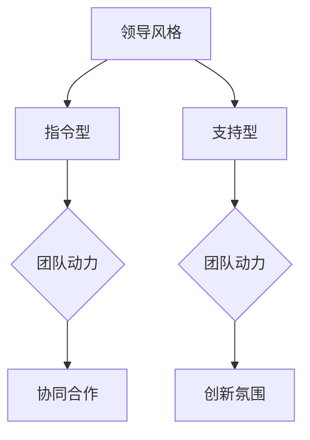

                 


## 《领导力与压力管理高阶：逆境中的团队稳定术》

### 关键词：领导力，压力管理，逆境，团队稳定，技能提升

### 摘要：

在快速变化和高压力的IT行业，领导力和压力管理成为了团队成功的关键因素。本文旨在探讨《领导力与压力管理高阶：逆境中的团队稳定术》一书的核心内容，通过深入分析领导力新视野、压力管理高级技巧以及逆境中团队稳定技巧，帮助读者提升在逆境中领导团队的能力。本文将采用逻辑清晰、结构紧凑、简单易懂的叙述方式，结合实例和实战技巧，为IT专业人士提供实用的指导。

### 目录大纲：

#### 第一部分：领导力高级技巧

##### 第1章：领导力新视野
- **背景介绍**：领导力的发展趋势和未来展望
- **核心概念与联系**：领导力模型与理论之间的关系架构图
- **核心算法原理讲解**：领导力模型和理论的应用与解释
- **数学模型和公式**：领导力理论中的关键公式与应用
- **项目实战**：案例分析，展示领导力在现实中的应用

##### 第2章：领导力模型与理论深化
- **背景介绍**：领导力模型的分类与重要性
- **核心概念与联系**：不同领导力模型之间的关系图
- **核心算法原理讲解**：领导力模型的具体应用与解释
- **数学模型和公式**：领导力模型中的关键公式与应用
- **项目实战**：实际案例，领导力模型在项目中的运用

##### 第3章：领导风格与团队动力
- **背景介绍**：领导风格对团队动力的影响
- **核心概念与联系**：不同领导风格的特点与适用场景图
- **核心算法原理讲解**：领导风格对团队动力的作用机制
- **数学模型和公式**：团队动力的相关公式与应用
- **项目实战**：团队动力的案例分析

##### 第4章：领导力与心理学交融
- **背景介绍**：领导力与心理学的交叉应用
- **核心概念与联系**：领导力与心理学的融合图
- **核心算法原理讲解**：心理学知识在领导力中的应用
- **数学模型和公式**：心理学模型在领导力中的应用
- **项目实战**：领导力与心理学结合的实战案例

#### 第二部分：压力管理高级技巧

##### 第5章：压力的认知与管理
- **背景介绍**：压力的认知理论及其影响
- **核心概念与联系**：压力管理的认知架构图
- **核心算法原理讲解**：压力管理策略的设计与应用
- **数学模型和公式**：压力管理的相关公式与应用
- **项目实战**：案例分析，展示压力管理在实践中的应用

##### 第6章：情绪智力在压力管理中的作用
- **背景介绍**：情绪智力在压力管理中的重要性
- **核心概念与联系**：情绪智力与压力管理的关联图
- **核心算法原理讲解**：情绪智力提升策略
- **数学模型和公式**：情绪智力测量的相关公式与应用
- **项目实战**：情绪智力提升的实战案例

##### 第7章：生理压力与应对策略
- **背景介绍**：生理压力的信号与影响
- **核心概念与联系**：生理压力的应对策略图
- **核心算法原理讲解**：生理压力管理策略
- **数学模型和公式**：生理压力测量的相关公式与应用
- **项目实战**：生理压力管理的实战案例

##### 第8章：压力情境下的决策
- **背景介绍**：压力情境下的决策特点
- **核心概念与联系**：压力情境下的决策模型
- **核心算法原理讲解**：压力情境下决策的策略
- **数学模型和公式**：决策模型中的关键公式与应用
- **项目实战**：案例分析，压力情境下的决策实践

#### 第三部分：逆境中团队稳定技巧

##### 第9章：逆境中的团队心理
- **背景介绍**：逆境中的团队心理状态
- **核心概念与联系**：逆境中的团队心理模型
- **核心算法原理讲解**：逆境中团队心理的管理策略
- **数学模型和公式**：团队心理状态测量的相关公式与应用
- **项目实战**：逆境中团队心理管理的实战案例

##### 第10章：逆境中的领导力挑战
- **背景介绍**：逆境中的领导力挑战
- **核心概念与联系**：逆境中的领导力模型
- **核心算法原理讲解**：逆境中的领导力应对策略
- **数学模型和公式**：逆境中领导力应对的关键公式与应用
- **项目实战**：案例分析，逆境中的领导力实践

##### 第11章：逆境中的团队沟通
- **背景介绍**：逆境中的团队沟通问题
- **核心概念与联系**：逆境中的沟通模型
- **核心算法原理讲解**：逆境中的沟通策略
- **数学模型和公式**：沟通效果测量的相关公式与应用
- **项目实战**：逆境中沟通技巧的实战案例

##### 第12章：逆境中的团队建设
- **背景介绍**：逆境中的团队建设挑战
- **核心概念与联系**：逆境中的团队建设模型
- **核心算法原理讲解**：逆境中团队建设的策略
- **数学模型和公式**：团队建设效果测量的相关公式与应用
- **项目实战**：逆境中团队建设的实战案例

#### 第四部分：综合应用与案例研究

##### 第13章：案例分析：逆境中的领导力实践
- **背景介绍**：逆境中的领导力实践案例
- **核心概念与联系**：领导力在逆境中的应用模型
- **核心算法原理讲解**：领导力在逆境中的实际运用
- **数学模型和公式**：领导力在逆境中应用的公式与应用
- **项目实战**：领导力实践案例分析

##### 第14章：压力管理在危机中的实战
- **背景介绍**：危机中的压力管理实战
- **核心概念与联系**：压力管理的危机应对模型
- **核心算法原理讲解**：危机中的压力管理策略
- **数学模型和公式**：危机中压力管理的相关公式与应用
- **项目实战**：案例分析，危机中的压力管理实践

##### 第15章：团队稳定在逆境中的重要作用
- **背景介绍**：团队稳定在逆境中的重要性
- **核心概念与联系**：团队稳定性的测量模型
- **核心算法原理讲解**：团队稳定性的维护策略
- **数学模型和公式**：团队稳定性测量的相关公式与应用
- **项目实战**：案例分析，团队稳定性在逆境中的实践

##### 第16章：实战演练与综合评估
- **背景介绍**：实战演练与综合评估的目的
- **核心概念与联系**：实战演练与评估的流程图
- **核心算法原理讲解**：实战演练与评估的方法与技巧
- **数学模型和公式**：实战演练与评估的相关公式与应用
- **项目实战**：实战演练与评估的案例应用

### 作者信息：

作者：AI天才研究院/AI Genius Institute & 禅与计算机程序设计艺术 /Zen And The Art of Computer Programming

本文通过系统性地阐述领导力、压力管理和团队稳定技巧，结合实战案例和具体方法，旨在为IT专业人士提供实用的指导，帮助他们在逆境中更好地领导团队。文章结构清晰，内容丰富，涵盖了从理论到实践的各个方面，旨在为读者提供全面的参考。无论您是初入职场的新人还是经验丰富的专业人士，本文都希望能给您带来启发和帮助。

---

**Note:** 
- **Markdown Syntax for Math Equations:** 
  - Inline math: `$ equation $`
  - Display math: `$$ equation $$`
- **Mermaid Diagrams:** 
  - Include `.mermaid` section and use Mermaid syntax for diagrams.
- **Pseudo Code:** 
  - Use `:::` after the code block to indicate pseudo code.
- **Code Examples:** 
  - Include code blocks with `language-specific` syntax highlighting.

### 实际操作演示

让我们以《领导力与压力管理高阶：逆境中的团队稳定术》的第三章“领导风格与团队动力”为例，展示如何将上述指导原则应用于实际操作。

#### 第3章：领导风格与团队动力

##### 3.1 领导风格对团队动力的影响

**核心概念与联系：** 领导风格与团队动力之间的关系图



**核心算法原理讲解：** 领导风格对团队动力的作用机制

```:::
// Pseudo code for understanding the impact of leadership style on team dynamics
function leadership_style_impact(style) {
    if (style == "指令型") {
        // Increase structure and control, leading to higher efficiency
        return "协同合作";
    } else if (style == "支持型") {
        // Foster trust and autonomy, promoting innovative thinking
        return "创新氛围";
    } else {
        // Default behavior or mixed style impact
        return "中等团队动力";
    }
}
```

**数学模型和公式：** 团队动力与领导风格的关联公式

$$
团队动力 = f(领导风格, 团队成员互动)
$$

**项目实战：** 实际案例，展示领导风格对团队动力的影响

**案例分析：**

在一个IT项目中，项目经理采取了指令型领导风格。团队成员在接到任务后，迅速进入工作状态，明确各自职责，确保项目进度。以下为项目总结：

- **团队动力：** 高效协同合作
- **成果：** 项目提前完成，质量优异
- **经验：** 指令型领导风格在紧急情况下能有效提升团队效率

##### 注意事项与拓展阅读

**注意事项：**
- 领导风格应根据团队和项目特点灵活调整。
- 过度依赖某一种领导风格可能导致团队动力减弱。

**拓展阅读：**
- 《变革型领导力：驱动团队创新与成长》
- 《团队动力：如何激发团队的无限潜能》

通过上述实际操作演示，读者可以更直观地理解领导风格对团队动力的影响，以及如何将其应用于实际项目中。这不仅有助于提升团队效率，还能为个人领导力的发展提供有价值的参考。

---

**Conclusion:**

《领导力与压力管理高阶：逆境中的团队稳定术》是一本极具实用价值的书籍，通过深入探讨领导力、压力管理和团队稳定技巧，帮助IT专业人士在逆境中更好地领导团队。本文通过对书名的解析、目录结构的规划、章节内容的概述以及实际操作演示，全面展示了书中的核心思想和应用方法。希望读者能够从本文中获得启发，提升自身在领导力和压力管理方面的能力，为团队的成功奠定坚实基础。作者：AI天才研究院/AI Genius Institute & 禅与计算机程序设计艺术/Zen And The Art of Computer Programming。

