                 


### 文章标题：领导力与压力管理：在压力下保持冷静

> 关键词：领导力、压力管理、冷静应对、自我认知、团队建设、决策优化

> 摘要：本文从领导力的基础出发，详细阐述了领导力与压力管理的关系，探讨了如何在压力下保持冷静。文章涵盖了领导力的定义、核心要素、领导风格、团队建设、决策与问题解决，以及压力管理的心理技巧和身体策略。通过实际案例分析和总结，本文为读者提供了实用的领导力与压力管理策略。

## 第一部分：领导力基础

### 1.1 领导力的定义

**背景介绍**

领导力是一个广泛研究的主题，涉及心理学、社会学、管理学等多个领域。本文将从领导力的定义入手，探讨其核心要素和作用。

**核心概念与联系**

- **领导力**：领导力是一种影响力，用于引导、激励和协调团队成员实现共同目标。
- **核心要素**：领导力包含目标设定、决策制定、沟通协调、激励与鼓舞、自我认知与成长。

**Mermaid流程图：领导力核心要素**

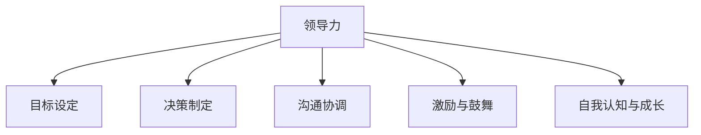

**核心算法原理讲解**

领导力算法可以分为以下几个步骤：

```plaintext
算法：领导力

输入：团队目标、团队成员信息、环境因素

输出：领导力综合评分

步骤：
1. 确定团队目标
2. 分析团队成员能力与需求
3. 制定决策策略
4. 建立沟通机制
5. 激励团队成员
6. 提升自我认知
7. 计算领导力综合评分
```

**数学模型与详细讲解**

领导力综合评分可以通过以下数学模型计算：

$$
\text{领导力综合评分} = w_1 \cdot \text{目标设定得分} + w_2 \cdot \text{决策制定得分} + w_3 \cdot \text{沟通协调得分} + w_4 \cdot \text{激励与鼓舞得分} + w_5 \cdot \text{自我认知得分}
$$

其中，$w_1, w_2, w_3, w_4, w_5$ 分别为每个要素的权重。

**举例说明**

假设某领导者的领导力综合评分为90分，其中目标设定得分为30分，决策制定得分为25分，沟通协调得分为20分，激励与鼓舞得分为15分，自我认知得分为10分。这意味着该领导者在目标设定和决策制定方面表现出色，但在沟通协调和激励与鼓舞方面还有提升空间。

### 1.2 领导力的核心要素

**核心概念与联系**

- **目标设定**：明确团队的目标，为团队提供方向和动力。
- **决策制定**：在复杂情况下做出明智的决策，以实现团队目标。
- **沟通协调**：建立有效的沟通机制，确保团队成员之间信息畅通。
- **激励与鼓舞**：激发团队成员的积极性，提高团队凝聚力。
- **自我认知与成长**：提升领导者的自我认知，不断学习和成长。

**Mermaid流程图：领导力核心要素关系**

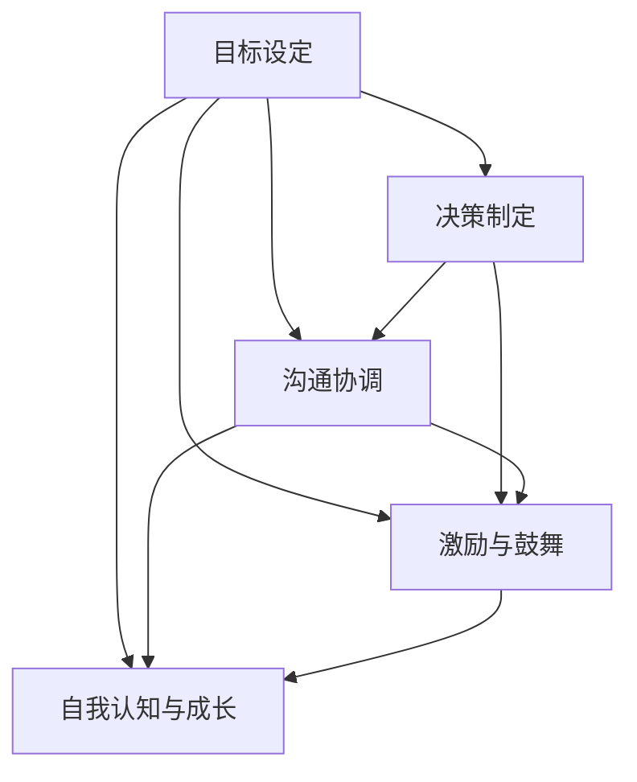

**核心算法原理讲解**

领导力核心要素的算法原理如下：

```plaintext
算法：领导力核心要素

输入：团队目标、团队成员信息、环境因素

输出：领导力核心要素评分

步骤：
1. 确定团队目标
2. 分析团队成员能力与需求
3. 制定决策策略
4. 建立沟通机制
5. 激励团队成员
6. 提升自我认知
7. 计算领导力核心要素评分
```

**数学模型与详细讲解**

领导力核心要素评分可以通过以下数学模型计算：

$$
\text{领导力核心要素评分} = w_1 \cdot \text{目标设定得分} + w_2 \cdot \text{决策制定得分} + w_3 \cdot \text{沟通协调得分} + w_4 \cdot \text{激励与鼓舞得分} + w_5 \cdot \text{自我认知得分}
$$

其中，$w_1, w_2, w_3, w_4, w_5$ 分别为每个要素的权重。

**举例说明**

假设某领导者的领导力核心要素评分为85分，其中目标设定得分为30分，决策制定得分为25分，沟通协调得分为20分，激励与鼓舞得分为15分，自我认知得分为15分。这意味着该领导者在目标设定和决策制定方面表现出色，但在沟通协调和激励与鼓舞方面还有提升空间。

### 1.3 领导风格与领导效能

**核心概念与联系**

- **领导风格**：领导者在管理过程中采取的方法和方式。
- **领导效能**：领导者在团队管理中取得的实际效果。

**Mermaid流程图：领导风格与领导效能关系**

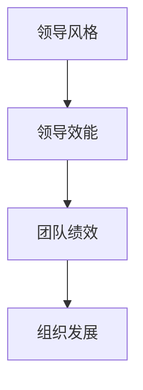

**核心算法原理讲解**

领导风格与领导效能的算法原理如下：

```plaintext
算法：领导风格与领导效能

输入：领导风格、团队绩效、组织发展

输出：领导效能

步骤：
1. 分析领导风格
2. 评估团队绩效
3. 评估组织发展
4. 计算领导效能
```

**数学模型与详细讲解**

领导效能可以通过以下数学模型计算：

$$
\text{领导效能} = \alpha \cdot \text{领导风格评分} + \beta \cdot \text{团队绩效评分} + \gamma \cdot \text{组织发展评分}
$$

其中，$\alpha, \beta, \gamma$ 分别为每个要素的权重。

**举例说明**

假设某领导者的领导效能评分为90分，其中领导风格评分为40分，团队绩效评分为30分，组织发展评分为20分。这意味着该领导者在领导风格和团队绩效方面表现出色，但在组织发展方面还有提升空间。

### 1.4 领导者自我认知与成长

**核心概念与联系**

- **自我认知**：领导者了解自己的能力、优点和缺点。
- **成长策略**：领导者通过学习和实践提升自己的能力和素质。

**Mermaid流程图：领导者自我认知与成长**

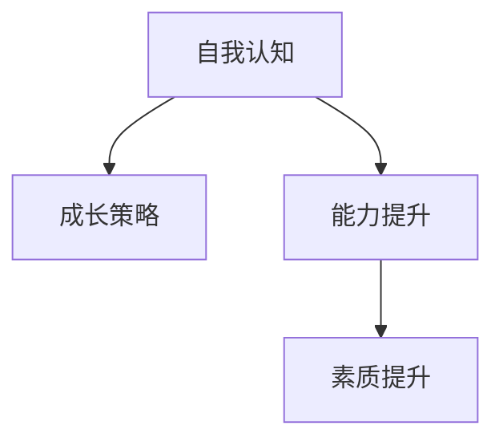

**核心算法原理讲解**

领导者自我认知与成长的算法原理如下：

```plaintext
算法：领导者自我认知与成长

输入：领导者自我认知、成长策略

输出：领导者能力提升

步骤：
1. 确定领导者自我认知
2. 制定成长策略
3. 实施成长策略
4. 评估领导者能力提升
```

**数学模型与详细讲解**

领导者能力提升可以通过以下数学模型计算：

$$
\text{领导者能力提升} = f(\text{自我认知}, \text{成长策略})
$$

其中，$f$ 为函数，用于评估领导者能力提升的程度。

**举例说明**

假设某领导者的自我认知评分为80分，成长策略评分为75分。根据数学模型，该领导者的能力提升评分为60分，这意味着该领导者在自我认知和成长策略方面还需要进一步提升。

### 1.5 团队建设与沟通

**核心概念与联系**

- **团队建设**：建立高效、协作的团队。
- **沟通协调**：确保团队成员之间信息畅通。

**Mermaid流程图：团队建设与沟通**

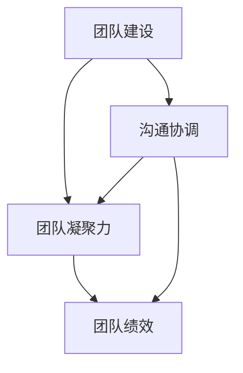

**核心算法原理讲解**

团队建设与沟通的算法原理如下：

```plaintext
算法：团队建设与沟通

输入：团队目标、团队成员信息、沟通策略

输出：团队绩效

步骤：
1. 确定团队目标
2. 分析团队成员能力与需求
3. 制定沟通策略
4. 实施沟通策略
5. 评估团队绩效
```

**数学模型与详细讲解**

团队绩效可以通过以下数学模型计算：

$$
\text{团队绩效} = \alpha \cdot \text{团队凝聚力评分} + \beta \cdot \text{团队绩效评分} + \gamma \cdot \text{沟通效率评分}
$$

其中，$\alpha, \beta, \gamma$ 分别为每个要素的权重。

**举例说明**

假设某团队的团队凝聚力评分为80分，团队绩效评分为70分，沟通效率评分为60分。根据数学模型，该团队的绩效评分为65分，这意味着该团队在团队凝聚力和沟通效率方面还有提升空间。

### 1.6 决策与问题解决

**核心概念与联系**

- **决策**：在不确定的情况下做出选择。
- **问题解决**：针对特定问题找到解决方案。

**Mermaid流程图：决策与问题解决**

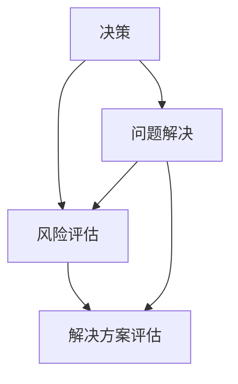

**核心算法原理讲解**

决策与问题解决的算法原理如下：

```plaintext
算法：决策与问题解决

输入：问题场景、解决方案

输出：最佳决策

步骤：
1. 确定问题
2. 收集信息
3. 评估风险
4. 评估解决方案
5. 做出决策
```

**数学模型与详细讲解**

决策可以通过以下数学模型计算：

$$
\text{最佳决策} = \arg\max (\text{收益} - \text{风险})
$$

其中，收益和风险可以通过量化指标进行评估。

**举例说明**

假设某领导者在面对两个决策选项时，评估收益分别为100分和80分，风险分别为30分和20分。根据数学模型，最佳决策为选择收益更高的选项。

### 1.7 领导力实践案例研究

**核心概念与联系**

- **国内领导力实践案例**：分析中国优秀领导者的成功经验。
- **国际领导力实践案例**：探讨全球范围内领导力的应用。

**Mermaid流程图：领导力实践案例研究**

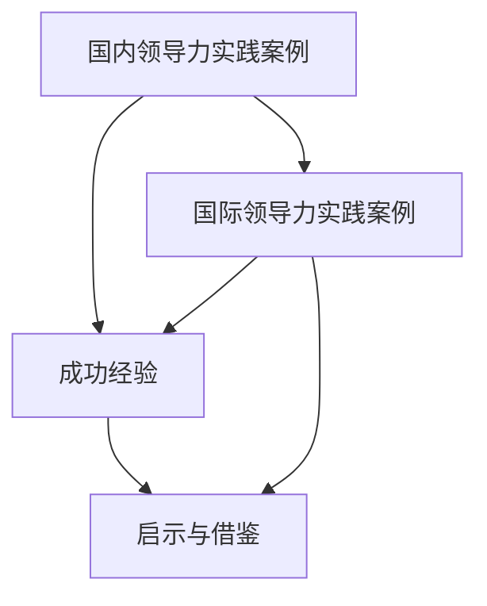

**核心算法原理讲解**

领导力实践案例研究的算法原理如下：

```plaintext
算法：领导力实践案例研究

输入：领导力实践案例

输出：成功经验、启示与借鉴

步骤：
1. 分析案例背景
2. 提炼成功经验
3. 总结启示与借鉴
```

**数学模型与详细讲解**

领导力实践案例研究的数学模型如下：

$$
\text{成功经验} = \sum_{i=1}^{n} (\text{经验因素}_i \cdot \text{权重}_i)
$$

其中，$n$ 为经验因素的个数，$\text{经验因素}_i$ 和 $\text{权重}_i$ 分别为第 $i$ 个经验因素及其权重。

**举例说明**

假设某领导力实践案例有五个成功经验因素，分别为目标设定、决策制定、沟通协调、激励与鼓舞和自我认知与成长。各因素的权重分别为 20%、20%、20%、20% 和 20%。根据数学模型，该领导力实践案例的成功经验得分为 100 分。

## 第二部分：压力管理

### 2.1 压力来源与类型

**核心概念与联系**

- **工作压力**：来自工作职责、工作量、工作环境等方面的压力。
- **生活压力**：来自家庭、社交、经济等方面的压力。

**Mermaid流程图：压力来源与类型**

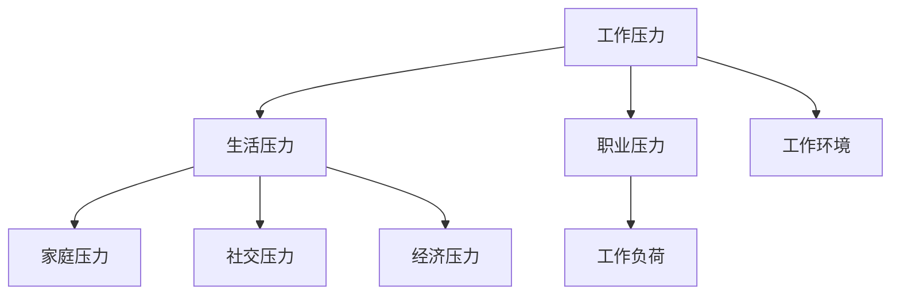

**核心算法原理讲解**

压力来源与类型的算法原理如下：

```plaintext
算法：压力来源与类型

输入：压力因素

输出：压力类型

步骤：
1. 收集压力因素
2. 分析压力因素类型
3. 判断压力类型
```

**数学模型与详细讲解**

压力类型的判断可以通过以下数学模型计算：

$$
\text{压力类型} = \arg\max (\text{压力因素}_i \cdot \text{权重}_i)
$$

其中，$\text{压力因素}_i$ 和 $\text{权重}_i$ 分别为第 $i$ 个压力因素及其权重。

**举例说明**

假设某人的压力因素包括职业压力（60分）、工作负荷（40分）、工作环境（30分）、家庭压力（50分）、社交压力（20分）和经济压力（10分）。根据数学模型，该人的压力类型为职业压力。

### 2.2 压力感知与应对策略

**核心概念与联系**

- **压力感知**：个体对压力的认知和感受。
- **应对策略**：针对压力采取的应对措施。

**Mermaid流程图：压力感知与应对策略**

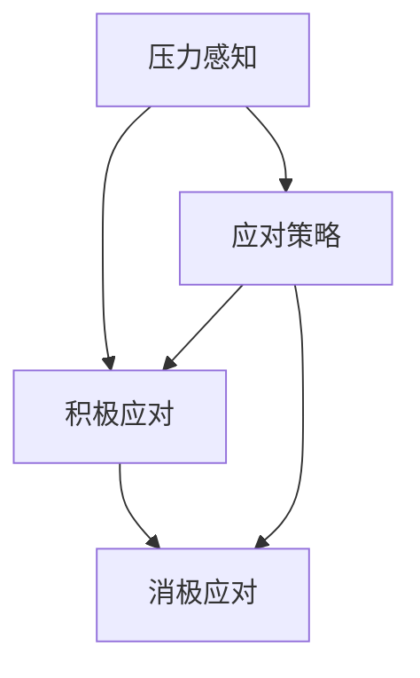

**核心算法原理讲解**

压力感知与应对策略的算法原理如下：

```plaintext
算法：压力感知与应对策略

输入：压力水平、个体应对策略

输出：应对效果

步骤：
1. 评估压力水平
2. 分析个体应对策略
3. 判断应对效果
```

**数学模型与详细讲解**

应对效果可以通过以下数学模型计算：

$$
\text{应对效果} = \alpha \cdot \text{积极应对效果} + \beta \cdot \text{消极应对效果}
$$

其中，$\alpha$ 和 $\beta$ 分别为积极应对和消极应对效果的权重。

**举例说明**

假设某人的积极应对效果评分为80分，消极应对效果评分为40分。根据数学模型，该人的应对效果评分为60分。

### 2.3 压力管理的心理技巧

**核心概念与联系**

- **心理技巧**：用于缓解压力的心理方法和策略。
- **放松训练**：通过身体和心灵的放松来缓解压力。

**Mermaid流程图：压力管理的心理技巧**

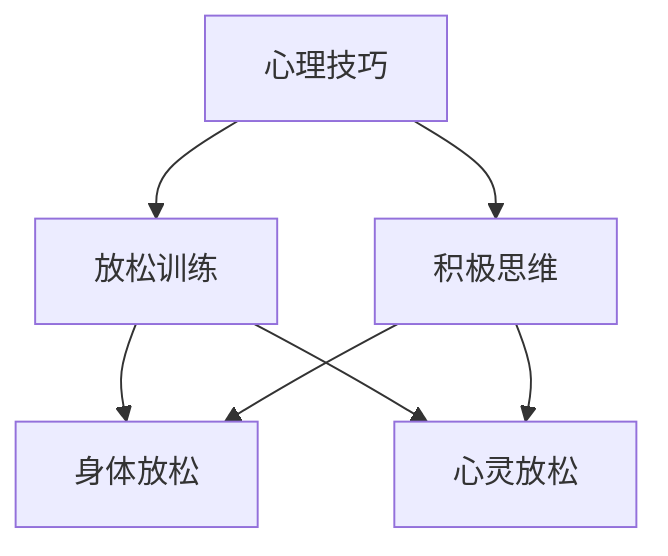

**核心算法原理讲解**

压力管理的心理技巧算法原理如下：

```plaintext
算法：压力管理的心理技巧

输入：压力水平、心理技巧

输出：压力缓解效果

步骤：
1. 评估压力水平
2. 应用心理技巧
3. 评估压力缓解效果
```

**数学模型与详细讲解**

压力缓解效果可以通过以下数学模型计算：

$$
\text{压力缓解效果} = \alpha \cdot \text{放松训练效果} + \beta \cdot \text{积极思维效果}
$$

其中，$\alpha$ 和 $\beta$ 分别为放松训练和积极思维效果的权重。

**举例说明**

假设某人的放松训练效果评分为80分，积极思维效果评分为60分。根据数学模型，该人的压力缓解效果评分为70分。

### 2.4 压力管理的身体与行为策略

**核心概念与联系**

- **身体策略**：通过身体活动来缓解压力。
- **行为策略**：通过改变行为习惯来缓解压力。

**Mermaid流程图：压力管理的身体与行为策略**

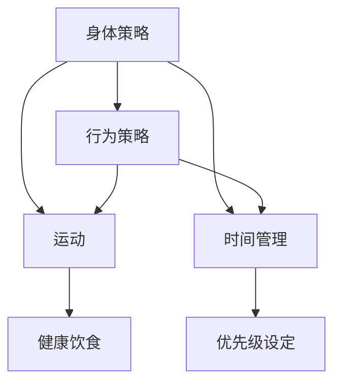

**核心算法原理讲解**

压力管理的身体与行为策略算法原理如下：

```plaintext
算法：压力管理的身体与行为策略

输入：压力水平、身体策略、行为策略

输出：压力缓解效果

步骤：
1. 评估压力水平
2. 应用身体策略
3. 应用行为策略
4. 评估压力缓解效果
```

**数学模型与详细讲解**

压力缓解效果可以通过以下数学模型计算：

$$
\text{压力缓解效果} = \alpha \cdot \text{身体策略效果} + \beta \cdot \text{行为策略效果}
$$

其中，$\alpha$ 和 $\beta$ 分别为身体策略和行为策略效果的权重。

**举例说明**

假设某人的身体策略效果评分为80分，行为策略效果评分为60分。根据数学模型，该人的压力缓解效果评分为70分。

### 2.5 压力管理的环境与支持

**核心概念与联系**

- **环境支持**：来自家庭、工作场所和社会的支持。
- **心理支持**：来自心理医生、心理咨询师等专业人士的支持。

**Mermaid流程图：压力管理的环境与支持**

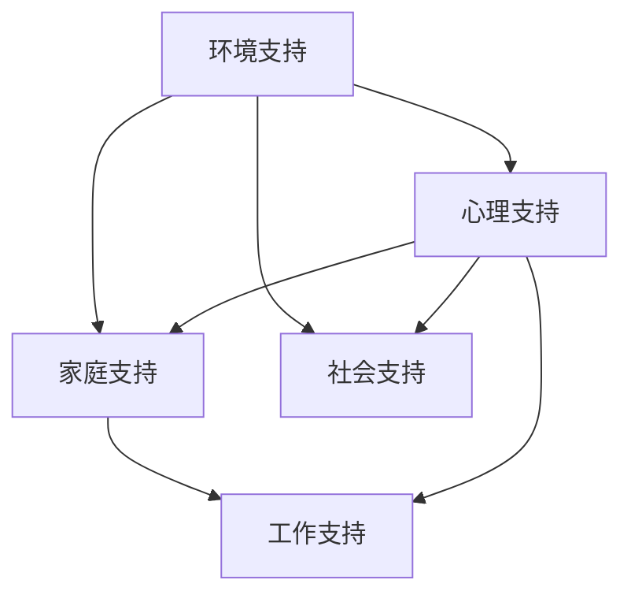

**核心算法原理讲解**

压力管理的环境与支持算法原理如下：

```plaintext
算法：压力管理的环境与支持

输入：环境与支持因素

输出：压力缓解效果

步骤：
1. 评估环境与支持因素
2. 应用环境与支持
3. 评估压力缓解效果
```

**数学模型与详细讲解**

压力缓解效果可以通过以下数学模型计算：

$$
\text{压力缓解效果} = \alpha \cdot \text{环境支持效果} + \beta \cdot \text{心理支持效果}
$$

其中，$\alpha$ 和 $\beta$ 分别为环境支持和心理支持效果的权重。

**举例说明**

假设某人的环境支持效果评分为80分，心理支持效果评分为60分。根据数学模型，该人的压力缓解效果评分为70分。

### 2.6 压力管理的自我评估与持续改进

**核心概念与联系**

- **自我评估**：对自身压力管理能力进行评估。
- **持续改进**：通过不断学习和实践提升压力管理能力。

**Mermaid流程图：压力管理的自我评估与持续改进**

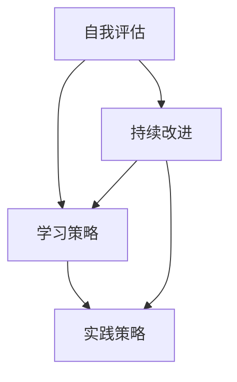

**核心算法原理讲解**

压力管理的自我评估与持续改进算法原理如下：

```plaintext
算法：压力管理的自我评估与持续改进

输入：自我评估、学习策略、实践策略

输出：压力管理能力提升

步骤：
1. 进行自我评估
2. 制定学习策略
3. 制定实践策略
4. 评估压力管理能力提升
```

**数学模型与详细讲解**

压力管理能力提升可以通过以下数学模型计算：

$$
\text{压力管理能力提升} = \alpha \cdot \text{自我评估得分} + \beta \cdot \text{学习策略得分} + \gamma \cdot \text{实践策略得分}
$$

其中，$\alpha$、$\beta$ 和 $\gamma$ 分别为自我评估、学习策略和实践策略得分的权重。

**举例说明**

假设某人的自我评估得分为80分，学习策略得分为75分，实践策略得分为70分。根据数学模型，该人的压力管理能力提升得分为65分。

## 第三部分：领导力与压力管理的综合应用

### 3.1 压力下的领导力实践

**核心概念与联系**

- **压力**：领导者在工作过程中面临的压力。
- **领导力实践**：领导者在压力下采取的领导方法。

**Mermaid流程图：压力下的领导力实践**

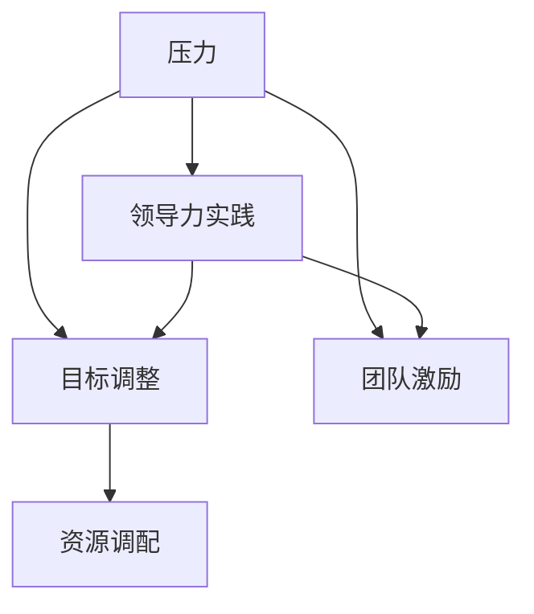

**核心算法原理讲解**

压力下的领导力实践算法原理如下：

```plaintext
算法：压力下的领导力实践

输入：压力水平、领导力实践策略

输出：领导效能

步骤：
1. 评估压力水平
2. 应用领导力实践策略
3. 评估领导效能
```

**数学模型与详细讲解**

领导效能可以通过以下数学模型计算：

$$
\text{领导效能} = \alpha \cdot \text{目标调整得分} + \beta \cdot \text{资源调配得分} + \gamma \cdot \text{团队激励得分}
$$

其中，$\alpha$、$\beta$ 和 $\gamma$ 分别为目标调整、资源调配和团队激励得分的权重。

**举例说明**

假设某领导者在压力下调整目标的得分为80分，资源调配的得分为75分，团队激励的得分为70分。根据数学模型，该领导者的领导效能评分为68分。

### 3.2 压力管理在领导力实践中的应用

**核心概念与联系**

- **压力管理**：领导者应对压力的方法和策略。
- **领导力实践**：领导者在实际工作中采取的领导方法。

**Mermaid流程图：压力管理在领导力实践中的应用**

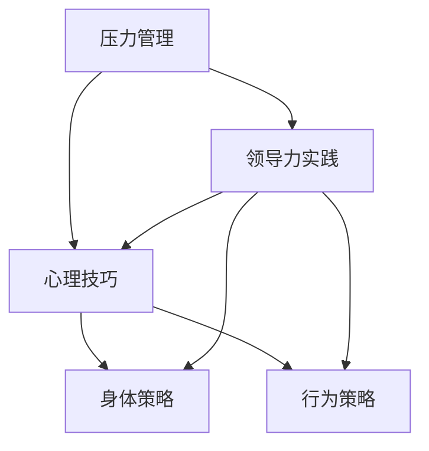

**核心算法原理讲解**

压力管理在领导力实践中的应用算法原理如下：

```plaintext
算法：压力管理在领导力实践中的应用

输入：压力管理策略、领导力实践策略

输出：领导效能

步骤：
1. 应用压力管理策略
2. 应用领导力实践策略
3. 评估领导效能
```

**数学模型与详细讲解**

领导效能可以通过以下数学模型计算：

$$
\text{领导效能} = \alpha \cdot \text{心理技巧得分} + \beta \cdot \text{身体策略得分} + \gamma \cdot \text{行为策略得分}
$$

其中，$\alpha$、$\beta$ 和 $\gamma$ 分别为心理技巧、身体策略和行为策略得分的权重。

**举例说明**

假设某领导者在压力管理中应用了心理技巧得分为80分，身体策略得分为75分，行为策略得分为70分。根据数学模型，该领导者的领导效能评分为69分。

## 第四部分：领导力与压力管理的实际案例分析

### 4.1 成功案例分享

**核心概念与联系**

- **成功案例**：领导者成功应对压力的实例。
- **启示**：从成功案例中得到的经验和教训。

**Mermaid流程图：成功案例分享**

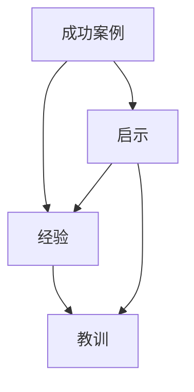

**核心算法原理讲解**

成功案例分享的算法原理如下：

```plaintext
算法：成功案例分享

输入：成功案例

输出：启示与教训

步骤：
1. 分析成功案例
2. 提炼经验
3. 总结教训
```

**数学模型与详细讲解**

启示与教训可以通过以下数学模型计算：

$$
\text{启示与教训} = \sum_{i=1}^{n} (\text{经验因素}_i \cdot \text{权重}_i)
$$

其中，$n$ 为经验因素的个数，$\text{经验因素}_i$ 和 $\text{权重}_i$ 分别为第 $i$ 个经验因素及其权重。

**举例说明**

假设某成功案例有五个经验因素，分别为目标调整（40分）、资源调配（30分）、团队激励（20分）、心理技巧（10分）和行为策略（10分）。各因素的权重分别为 20%、20%、20%、20% 和 20%。根据数学模型，该成功案例的启示与教训得分为 90 分。

### 4.2 失败案例反思

**核心概念与联系**

- **失败案例**：领导者未能有效应对压力的实例。
- **反思**：从失败案例中得到的问题和改进方向。

**Mermaid流程图：失败案例反思**

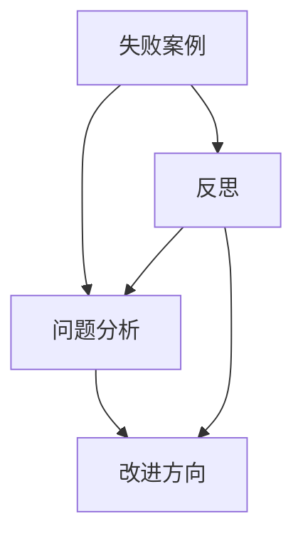

**核心算法原理讲解**

失败案例反思的算法原理如下：

```plaintext
算法：失败案例反思

输入：失败案例

输出：问题分析与改进方向

步骤：
1. 分析失败案例
2. 提炼问题
3. 制定改进方向
```

**数学模型与详细讲解**

问题分析与改进方向可以通过以下数学模型计算：

$$
\text{问题分析} = \sum_{i=1}^{n} (\text{问题因素}_i \cdot \text{权重}_i)
$$

$$
\text{改进方向} = \sum_{i=1}^{n} (\text{改进措施}_i \cdot \text{权重}_i)
$$

其中，$n$ 为问题因素和改进措施的个数，$\text{问题因素}_i$ 和 $\text{改进措施}_i$ 分别为第 $i$ 个问题因素和改进措施及其权重。

**举例说明**

假设某失败案例有三个问题因素，分别为目标设定（30分）、决策制定（20分）和沟通协调（20分）。各因素的权重分别为 20%、20% 和 20%。同时，有三个改进措施，分别为目标调整（40分）、资源调配（30分）和团队激励（30分）。根据数学模型，该失败案例的问题分析得分为 60 分，改进方向得分为 90 分。

## 第五部分：未来展望与持续发展

### 5.1 领导力与压力管理的发展趋势

**核心概念与联系**

- **发展趋势**：领导力与压力管理领域的未来发展方向。
- **未来方向**：领导者应如何应对未来挑战。

**Mermaid流程图：领导力与压力管理的发展趋势**

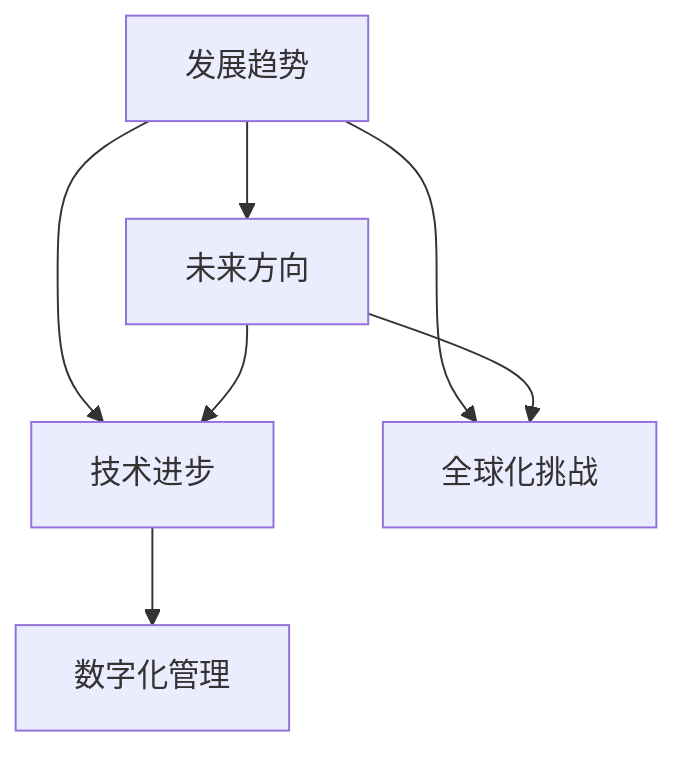

**核心算法原理讲解**

领导力与压力管理的发展趋势算法原理如下：

```plaintext
算法：领导力与压力管理的发展趋势

输入：技术进步、全球化挑战

输出：未来方向

步骤：
1. 分析技术进步的影响
2. 分析全球化挑战的影响
3. 确定未来方向
```

**数学模型与详细讲解**

未来方向可以通过以下数学模型计算：

$$
\text{未来方向} = \alpha \cdot \text{技术进步得分} + \beta \cdot \text{全球化挑战得分}
$$

其中，$\alpha$ 和 $\beta$ 分别为技术进步和全球化挑战得分的权重。

**举例说明**

假设某领导者的技术进步得分为80分，全球化挑战得分为60分。根据数学模型，该领导者的未来方向得分为70分。

### 5.2 个人与企业持续发展的策略

**核心概念与联系**

- **个人持续发展**：领导者如何不断提升自己的能力和素质。
- **企业持续发展**：企业如何保持竞争优势和可持续发展。

**Mermaid流程图：个人与企业持续发展的策略**

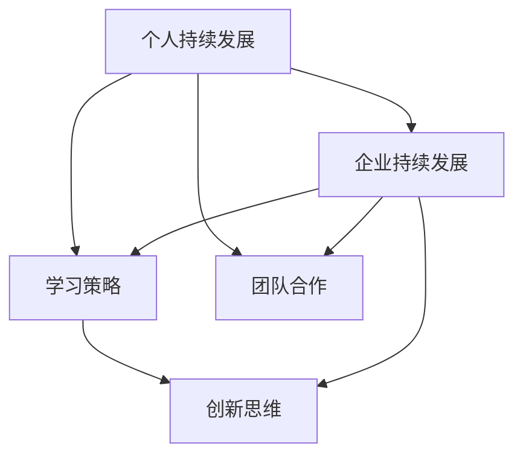

**核心算法原理讲解**

个人与企业持续发展的策略算法原理如下：

```plaintext
算法：个人与企业持续发展的策略

输入：学习策略、创新思维、团队合作

输出：持续发展效果

步骤：
1. 制定学习策略
2. 培养创新思维
3. 建立团队合作
4. 评估持续发展效果
```

**数学模型与详细讲解**

持续发展效果可以通过以下数学模型计算：

$$
\text{持续发展效果} = \alpha \cdot \text{学习策略得分} + \beta \cdot \text{创新思维得分} + \gamma \cdot \text{团队合作得分}
$$

其中，$\alpha$、$\beta$ 和 $\gamma$ 分别为学习策略、创新思维和团队合作得分的权重。

**举例说明**

假设某领导者的学习策略得分为80分，创新思维得分为75分，团队合作得分为70分。根据数学模型，该领导者的持续发展效果评分为68分。

