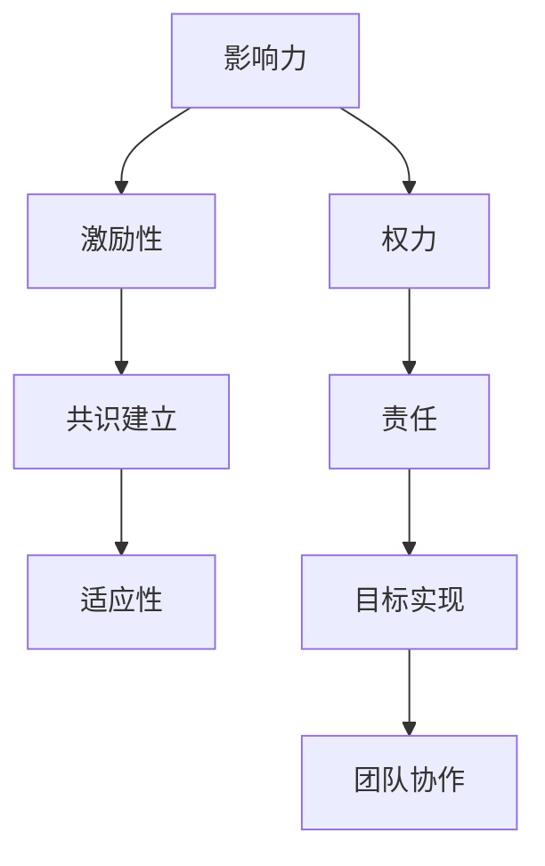

                 

### 文章标题
《领导力与压力管理：应对工作压力》

### 文章关键词
领导力，压力管理，工作压力，心理调适，高效团队建设，组织文化

### 文章摘要
本文旨在探讨领导力与压力管理的紧密联系，以及如何通过有效的领导力策略来减轻工作压力，提高团队和工作效率。文章首先概述了领导力和压力管理的核心概念，接着分析了压力的来源与类型，并提出了相应的管理策略与方法。通过个人、团队和组织的案例分析，本文展示了领导力与压力管理的实际应用，并展望了未来的发展趋势。文章最后总结了领导力与压力管理的重要性，并提出了一些最佳实践建议。

---

### 引言

在当今快节奏、高竞争的工作环境中，领导力与压力管理已经成为每个企业和组织的核心议题。领导力不仅关乎个人能力的提升，更涉及团队和整个组织的长远发展。同时，工作压力的普遍存在也对员工的心理健康和生产力提出了严峻挑战。因此，理解如何有效地管理压力、提升领导力，对于个人成长和组织成功都具有重要意义。

本文的读者对象主要是企业高管、团队领导者、人力资源专家以及所有关注自身职业发展和心理健康的人士。通过对领导力与压力管理的深入探讨，本文希望为读者提供实用的策略和方法，以应对工作中的各种压力，从而提升个人和团队的表现。

本文将首先定义领导力和压力管理的核心概念，并分析它们之间的联系。接着，我们将探讨压力的来源与类型，并介绍有效的压力管理策略。随后，通过个人、团队和组织的案例分析，我们将展示领导力与压力管理的实际应用。最后，我们将展望领导力与压力管理的未来趋势，并提出一些最佳实践建议。

---

### 第一部分：领导力的基础

#### 1. 领导力的核心概念与联系

**领导力的定义与特征**

领导力是一种影响和激励他人一起实现目标的能力。它不仅仅是职位赋予的权力，更是一种能够激发团队成员潜能、促进团队协作的特质。领导力具有以下特征：

- **影响力**：领导者通过言语、行动或榜样来影响他人。
- **激励性**：领导者能够激发团队成员的积极性和创造力。
- **共识建立**：领导者能够在团队中建立共同的目标和价值观。
- **适应性**：领导者能够根据环境和团队的变化灵活调整领导风格。

**领导力的核心概念与联系图**

使用Mermaid流程图，我们可以清晰地展示领导力的核心概念与联系：

**领导力的分类与模型**

在领导力理论的研究中，有多种不同的领导力模型，每种模型都有其独特的应用场景：

- **领导者—成员交换理论（LMX理论）**：认为领导者与团队成员之间形成不同的关系质量水平，分为“内群”和“外群”。
- **情境领导理论**：根据团队成员的心理成熟度，领导者采取不同的领导风格，如指导式、支持式、参与式等。
- **变革型领导理论**：强调领导者通过愿景激励和个性化关怀，推动团队实现变革。

每种模型都有其适用性，领导者需要根据具体情境灵活运用。

---

### 2. 领导力的发展与实践

**领导力的自我认知与提升**

领导力的提升首先需要自我认知。以下是一些自我评估工具和方法：

- **360度反馈**：通过同事、下属和上级的反馈，全面了解自己的领导风格和影响范围。
- **自我评估问卷**：如MLQ（多维度领导问卷），帮助领导者识别自己的领导行为和特质。

**领导力发展的路径**

- **持续学习**：阅读领导力相关书籍、参加培训课程，不断提升自己的知识和技能。
- **实践与反思**：通过实际工作中的实践，不断总结经验，并反思和调整自己的领导方式。

**领导力实践**

领导者应具备以下技能和素质：

- **沟通能力**：有效沟通是领导力的核心，领导者需要能够清晰地传达信息，并倾听团队成员的意见。
- **决策能力**：领导者需要能够在压力下做出明智的决策。
- **团队建设**：领导者应致力于建立高效的团队，培养团队成员的协作精神和创新能力。

实际案例分享与讨论可以帮助我们更好地理解领导力的发展与实践。例如，某公司领导通过实施“开放办公”政策，鼓励团队成员之间的交流与合作，显著提高了团队效率和创新能力。

---

### 第二部分：压力管理的原理

#### 3. 压力的来源与类型

**压力的来源**

压力的来源可以分为内部和外部两个方面：

- **内部压力**：来自个人的责任感、自我期望和个性特点。
- **外部压力**：来自工作环境、人际关系、组织结构和市场变化等。

**压力的类型**

- **短期压力**：通常与特定事件或挑战相关，如项目截止日期、客户投诉等。
- **长期压力**：通常与工作环境或生活方式相关，如高工作负荷、工作与家庭平衡问题等。

---

#### 4. 压力管理的策略与方法

**压力管理的策略**

压力管理可以分为预防策略和应对策略：

- **预防策略**：通过改善工作环境和生活方式，减少压力源。例如，通过合理的时间管理和工作分配，减少工作负荷。
- **应对策略**：在压力发生时，采取有效的方法来应对和缓解压力。例如，通过放松训练、心理调适和健康生活方式来缓解压力。

**压力管理的方法**

- **管理技巧**：例如，通过有效的时间管理和任务优先级排序，减轻工作压力。
- **心理调适**：例如，通过冥想、正念和认知行为疗法，调整心态和应对压力。
- **健康生活方式**：例如，保持良好的饮食、适量的运动和充足的睡眠，有助于减轻压力。

---

### 第三部分：结合案例的领导力与压力管理

#### 5. 个人案例

**个人领导力的发展与压力管理**

- **案例一**：某工程师通过不断提升自己的技能和沟通能力，成为团队的核心成员。在面对高工作压力时，他通过合理的任务分配和时间管理，有效缓解了压力，并带领团队成功完成了项目。
- **案例二**：某项目经理在面对项目延期和团队冲突时，运用变革型领导理论，通过激励团队成员和建立共同目标，成功解决了问题，提高了团队士气和生产力。

#### 6. 团队案例

**团队领导力与压力管理**

- **案例一**：某团队通过实施敏捷开发方法，提高了团队的协作效率和响应速度。团队领导者通过积极的沟通和冲突管理，建立了高效的工作氛围，减轻了团队成员的工作压力。
- **案例二**：某团队在面对市场变化和竞争压力时，通过团队建设活动，增强了团队凝聚力和创新能力，成功应对了挑战。

#### 7. 组织案例

**组织领导力与压力管理**

- **案例一**：某公司通过建立支持性的组织文化，鼓励员工提出建议和参与决策，提高了员工的满意度和工作效率。公司领导者通过实施灵活的工作安排和心理健康支持政策，有效缓解了员工的工作压力。
- **案例二**：某公司在面对外部经济压力时，通过领导层的战略调整和员工培训，提高了员工的适应能力和创新能力，成功渡过了难关。

---

### 第四部分：领导力与压力管理的未来趋势

#### 8. 新技术的应用

**人工智能与领导力管理**

- **AI在领导力评估中的应用**：通过数据分析，AI可以帮助领导者更准确地评估团队成员的表现，并提供个性化的领导建议。
- **AI在压力管理中的应用**：例如，通过智能手环和健康监测设备，AI可以实时监测员工的健康状况，提供个性化的压力管理方案。

**新兴趋势对领导力与压力管理的影响**

- **灵活工作安排**：随着远程工作和远程管理的普及，领导者需要适应新的工作模式，提高远程团队的领导力和沟通能力。
- **远程工作与领导力管理**：领导者需要掌握如何在远程环境中建立团队关系、激励员工和解决冲突。

---

### 总结

**领导力与压力管理的重要性**

领导力与压力管理对个人和组织的成功至关重要。有效的领导力可以帮助团队克服挑战，实现目标；而有效的压力管理可以提升员工的工作满意度和生产力。

**未来展望**

领导力与压力管理将随着新技术和社会环境的变化不断发展。领导者需要不断学习和适应新的趋势，以应对未来的挑战。

**进一步阅读建议**

读者可以参考以下书籍和资源，以深入了解领导力与压力管理的理论和实践：

- 《领导力五项修炼》
- 《压力管理》
- 《敏捷团队管理》

---

### 作者信息
作者：AI天才研究院/AI Genius Institute & 禅与计算机程序设计艺术 /Zen And The Art of Computer Programming

---

### 结论

领导力与压力管理是每个领导者都应关注的重要领域。通过有效的领导力策略，可以减轻工作压力，提高团队和工作效率。本文通过详细的案例分析，展示了领导力与压力管理的实际应用，并探讨了未来发展趋势。希望读者能够从中获得启示，并将其应用于实践中，实现个人和组织的共同成长。让我们一起努力，成为更加出色的领导者！

