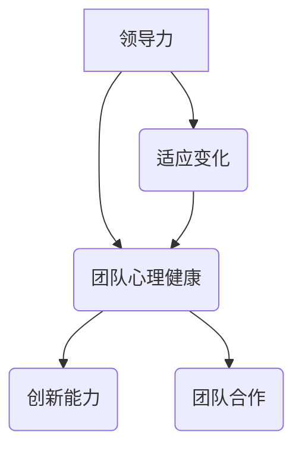
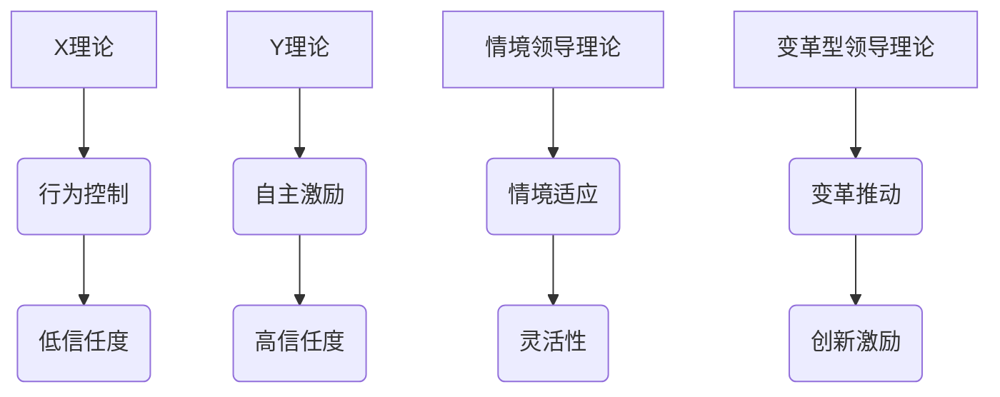
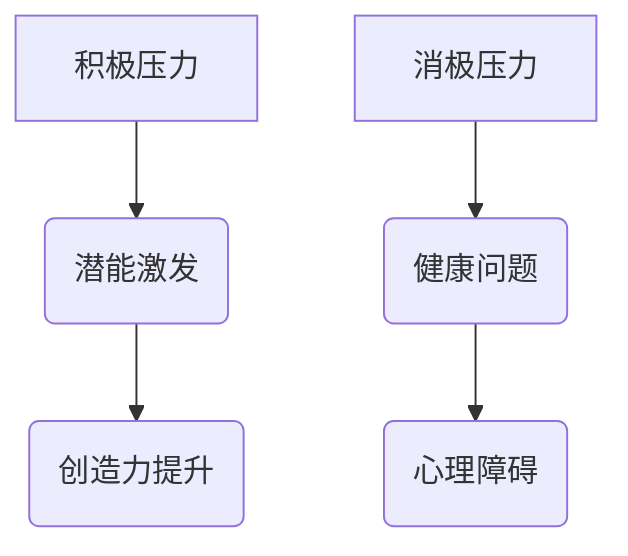
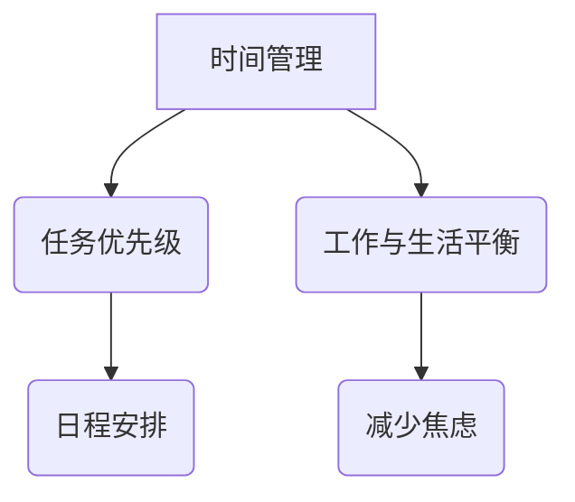
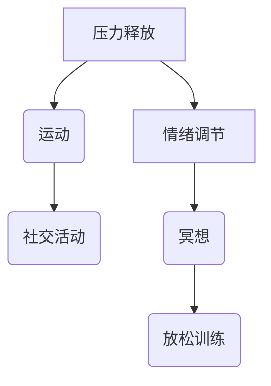
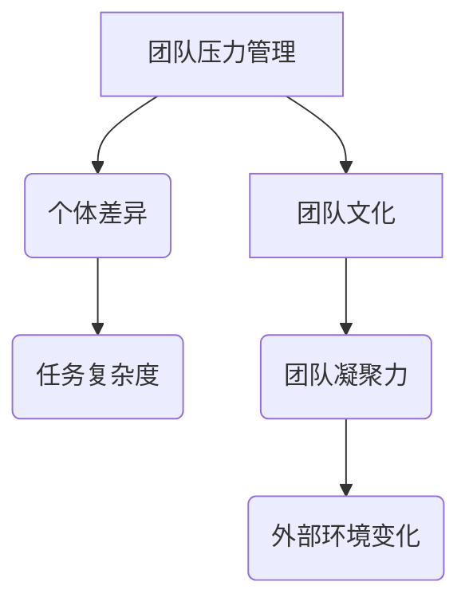
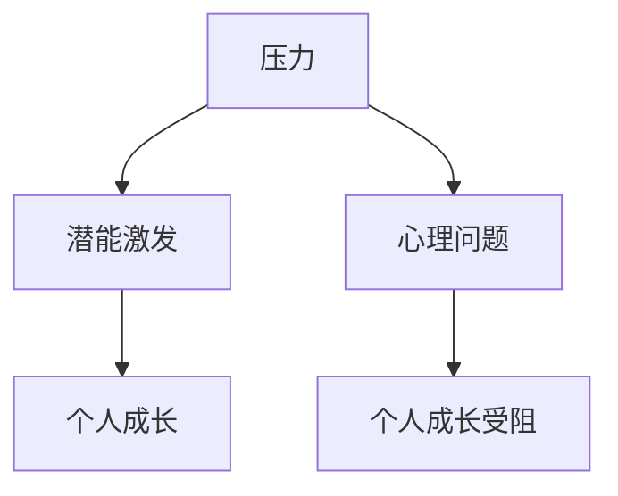

                 

### 文章标题

《领导力与压力管理：维护团队心理健康》

### 关键词

领导力，压力管理，心理健康，团队建设，压力应对策略

### 摘要

在快速发展的信息技术行业，领导力与压力管理对维护团队心理健康至关重要。本文将探讨领导力与压力管理的核心概念，剖析它们之间的内在联系，并运用Mermaid流程图、伪代码和LaTeX公式，深入讲解相关算法原理。通过实际项目案例，本文将展示如何在开发环境中应用这些理念，最终提供最佳实践指南，以帮助IT团队应对压力，提升整体心理健康水平。

## 第一部分：领导力的基础理论与实践

### 第1章：领导力概述

#### 1.1 领导力的重要性

领导力是一种影响和激励他人实现共同目标的能力。在信息技术行业，领导力的重要性尤为突出。随着技术的快速发展，IT行业对创新能力和团队合作的要求越来越高。优秀的领导力不仅能够引导团队快速适应变化，还能激发团队成员的潜力，实现高效协作。

**核心概念与联系：**

领导力与团队心理健康密切相关。领导者的行为和决策直接影响团队成员的情绪和工作状态。因此，理解领导力的本质和重要性，对于维护团队心理健康至关重要。

**Mermaid 流程图：**



#### 1.2 领导力的定义

领导力并非单一的特质或能力，而是一个多维度的概念。不同学者对领导力的定义各有侧重。例如，Hersey和Blanchard将领导力定义为“在特定情境下，通过影响他人来实现共同目标的过程”。这一定义强调了领导力在特定情境中的应用性和动态性。

**核心概念与联系：**

领导力是一个情境依赖的概念，其效果受到多种因素的影响，如团队结构、文化背景、任务性质等。因此，理解领导力的定义有助于我们在实际工作中灵活应用。

**伪代码讲解：**

```python
def leadership_context(context):
    if context == "innovation":
        impact = "high"
    elif context == "teamwork":
        impact = "medium"
    else:
        impact = "low"
    return impact
```

**举例说明：**

在不同的工作环境中，领导力的影响程度不同。在一个创新驱动的团队中，领导力的影响通常较大，因为它需要领导者具备前瞻性和创新精神，以引导团队实现突破性成果。

#### 1.3 领导力的核心要素

领导力的核心要素包括但不限于：愿景、决策力、沟通能力、团队协作、情绪管理等。这些要素共同构成了领导力的框架，帮助领导者有效地影响和激励团队成员。

**核心概念与联系：**

愿景是领导力的灵魂，它为团队指明了前进的方向。决策力则是领导者应对挑战和变化的关键能力。沟通能力和团队协作则确保了愿景和决策能够有效传达和执行。情绪管理能力帮助领导者处理复杂的情绪问题，维护团队的心理健康。

**LaTeX 公式讲解：**

$$\text{Leadership} = \text{Vision} + \text{Decision-making} + \text{Communication} + \text{Teamwork} + \text{Emotional Management}$$

#### 1.4 领导力与心理学的关系

领导力与心理学密切相关。心理学提供了理解人类行为和情绪的理论基础，帮助领导者更好地应对团队中的复杂问题。例如，心理学的认知行为理论可以指导领导者如何通过改变团队成员的思维模式来提升其工作效率和心理健康。

**核心概念与联系：**

领导力不仅仅是技术层面的管理，更是一种心理学层面的沟通和激励。领导者需要具备心理学知识，以便更好地理解和管理团队成员的情绪和需求。

**伪代码讲解：**

```python
def psychological_leadership(team_member):
    if team_member["stress_level"] > 5:
        action = "empathy"
    elif team_member["motivation"] < 3:
        action = "motivation"
    else:
        action = "support"
    return action
```

**举例说明：**

当团队成员的工作压力较大时，领导者可以通过展现同理心和支持来缓解其压力。当团队成员的积极性不高时，领导者可以通过激励来提升其工作动力。

### 第2章：领导力模型与风格

#### 2.1 领导力模型概述

领导力模型是对领导行为和风格的理论性概括。常见的领导力模型包括X理论与Y理论、情境领导理论、变革型领导理论等。这些模型有助于领导者理解和选择最适合自身团队和情境的领导风格。

**核心概念与联系：**

不同的领导力模型代表了不同的领导理念和方法。X理论与Y理论关注领导者对团队成员行为的假设，情境领导理论则强调领导者应根据团队成员的不同发展阶段调整领导风格，变革型领导理论则关注领导者如何激发团队的变革和创新。

**Mermaid 流程图：**



#### 2.2 X理论与Y理论

X理论与Y理论是早期的领导力模型，分别代表了不同的领导风格。X理论假设团队成员需要严格的管理和控制，而Y理论则认为团队成员具有内在的动机和能力，能够在适当的条件下自我管理。

**核心概念与联系：**

X理论和Y理论揭示了领导风格的两种极端。在实际应用中，领导者需要根据团队成员的特点和任务需求，灵活调整领导风格，以达到最佳效果。

**伪代码讲解：**

```python
def leadership_style(employee_style):
    if employee_style == "controlled":
        style = "X"
    elif employee_style == "motivated":
        style = "Y"
    return style
```

**举例说明：**

在一个创新型的项目团队中，领导者可能会采用Y理论，给予团队成员更多的自由和自主权，以激发其创造力。而在一个需要严格管理和控制的团队中，领导者可能会采用X理论，确保项目的顺利进行。

#### 2.3 授权型领导

授权型领导是一种以信任和赋能为核心的领导风格。在这种风格下，领导者将权力和责任下放给团队成员，使其能够自主决策和执行任务。

**核心概念与联系：**

授权型领导有助于提高团队成员的自主性和责任感，增强团队的整体凝聚力。它要求领导者具备较高的信任度和领导能力，能够充分调动团队成员的潜力。

**LaTeX 公式讲解：**

$$\text{授权型领导} = \text{信任} + \text{赋能} + \text{责任下放}$$

**举例说明：**

在一个分布式团队中，领导者通过授权型领导，赋予团队成员更多的自主权，使其能够根据项目需求自主安排工作和时间，从而提高了团队的效率和创新能力。

#### 2.4 变革型领导

变革型领导是一种能够激发团队成员变革和创新能力的领导风格。它要求领导者具备远见和变革思维，能够带领团队走出舒适区，迎接新的挑战。

**核心概念与联系：**

变革型领导在快速变化的IT行业中尤为重要。它不仅能够激发团队成员的潜力，还能推动团队适应行业变革，保持竞争优势。

**伪代码讲解：**

```python
def transformational_leadership(context):
    if context == "change":
        action = "激励变革"
    else:
        action = "稳定发展"
    return action
```

**举例说明：**

在一个面临重大技术转型的团队中，变革型领导能够通过激励团队成员，推动其积极适应新环境，从而实现团队的成功转型。

### 第3章：压力的来源与影响

#### 3.1 压力的定义与类型

压力是指个体在生理、心理和社交层面感受到的过度负荷。它可以是短暂的，也可以是持续的。根据压力的性质，可分为积极压力和消极压力。积极压力有助于激发个体潜能，而消极压力则可能导致身心健康问题。

**核心概念与联系：**

理解压力的定义和类型有助于我们更好地识别和应对压力。积极压力和消极压力在个体行为和心理健康方面有着不同的影响，因此，领导者需要根据不同类型的压力采取相应的管理策略。

**Mermaid 流程图：**



#### 3.2 压力的生理与心理影响

压力对个体的生理和心理有着深远的影响。生理上，压力可能导致心率加快、血压升高、免疫系统功能下降等。心理上，压力可能引发焦虑、抑郁、失眠等心理问题，影响个体的生活质量和工作效率。

**核心概念与联系：**

生理和心理影响是压力管理的两个关键方面。领导者需要关注团队成员的身心健康，通过有效的压力管理策略，帮助其减轻压力，提升生活质量。

**LaTeX 公式讲解：**

$$\text{压力影响} = \text{生理影响} + \text{心理影响}$$

**举例说明：**

在一个高压的项目团队中，领导者可以通过组织放松活动、提供心理辅导等方式，帮助团队成员缓解压力，保持良好的身心状态。

#### 3.3 压力的来源分析

压力的来源多种多样，包括工作压力、人际关系、家庭压力等。在工作环境中，工作负荷、工作环境、工作与生活的平衡等因素都可能成为压力的来源。

**核心概念与联系：**

分析压力的来源有助于领导者找到压力管理的切入点，采取针对性的措施减轻团队成员的压力。

**伪代码讲解：**

```python
def stress_source(workload, environment, balance):
    if workload > 50 and environment == "unfriendly" and balance < 3:
        source = "high"
    else:
        source = "low"
    return source
```

**举例说明：**

在一个工作负荷较大、工作环境不佳且工作与生活不平衡的团队中，压力水平通常较高。领导者需要采取措施，如优化工作流程、改善工作环境、提供灵活的工作时间等，以减轻团队成员的压力。

#### 3.4 压力管理的重要性

有效的压力管理对个体的身心健康和团队的整体绩效至关重要。通过压力管理，个体能够更好地应对挑战，提高工作效率和创新能力，团队则能够保持稳定和高效的工作状态。

**核心概念与联系：**

压力管理与领导力密切相关。领导者作为团队的核心，其压力管理能力直接影响团队的整体压力水平。因此，提升领导者的压力管理能力，对维护团队心理健康具有重要意义。

**LaTeX 公式讲解：**

$$\text{团队绩效} = \text{个体绩效} + \text{团队凝聚力}$$

**举例说明：**

在一个高度竞争的IT企业中，领导者通过有效的压力管理策略，帮助团队成员应对工作压力，提高了团队的整体绩效和凝聚力。

### 第4章：压力管理的策略

#### 4.1 时间管理技巧

时间管理是压力管理的重要一环。通过有效的时间管理，个体能够更好地平衡工作与生活，减轻压力负担。

**核心概念与联系：**

时间管理不仅有助于提高工作效率，还能减少因工作堆积而产生的焦虑和压力。领导者可以通过制定合理的日程安排、优先处理任务等方式，帮助团队成员掌握时间管理技巧。

**Mermaid 流程图：**



#### 4.2 应对策略与方法

应对策略是指个体在面对压力时采取的心理和行动措施。常见的应对策略包括积极思考、情绪调节、放松技巧等。

**核心概念与联系：**

应对策略有助于个体缓解压力，提高心理韧性。领导者可以引导团队成员学习这些策略，提高其应对压力的能力。

**LaTeX 公式讲解：**

$$\text{应对策略} = \text{积极思考} + \text{情绪调节} + \text{放松技巧}$$

**举例说明：**

在项目截止日期临近时，团队成员可以通过积极思考和情绪调节，保持冷静和专注，从而提高工作效率。

#### 4.3 压力释放与情绪调节

压力释放和情绪调节是压力管理的重要环节。通过有效的压力释放和情绪调节，个体能够缓解紧张情绪，恢复身心平衡。

**核心概念与联系：**

压力释放和情绪调节有助于减轻心理负担，提高心理健康水平。领导者可以通过组织团队活动、提供心理辅导等方式，帮助团队成员实现压力释放和情绪调节。

**Mermaid 流程图：**



#### 4.4 压力管理案例分析

通过案例分析，我们可以深入了解压力管理的实际应用效果。以下是一个典型的案例：

**案例背景：**  
某IT公司在一年内连续承担了多个高难度项目，导致团队成员的工作压力急剧增加。公司管理层意识到这一问题，决定采取一系列压力管理措施。

**解决方案：**  
1. **时间管理培训：** 公司为团队成员提供时间管理培训，帮助其提高时间利用效率，减少因任务堆积而产生的压力。  
2. **心理辅导：** 公司邀请专业心理咨询师为团队成员提供心理辅导，帮助其应对压力，调节情绪。  
3. **团队活动：** 公司定期组织团队活动，如户外运动、团建游戏等，以帮助团队成员释放压力，增进团队凝聚力。  
4. **灵活工作安排：** 公司允许团队成员在一定范围内调整工作时间，以平衡工作与生活。

**效果评估：**  
通过实施上述措施，团队成员的工作压力得到了有效缓解，工作效率和创新能力显著提升。团队的整体氛围也变得更加积极和和谐。

### 第5章：领导力与团队压力管理

#### 5.1 团队压力管理的挑战

团队压力管理面临着诸多挑战，如个体差异、任务复杂度、团队文化等。领导者需要具备敏锐的洞察力和灵活的应对策略，以应对这些挑战。

**核心概念与联系：**

团队压力管理的挑战源于团队内部的多样性和外部环境的变化。领导者需要根据实际情况，灵活调整管理策略，以最大程度地降低团队成员的压力。

**Mermaid 流程图：**



#### 5.2 领导者的角色与责任

在团队压力管理中，领导者的角色至关重要。领导者不仅是压力管理的决策者，更是团队成员的支持者和榜样。领导者需要承担以下责任：

1. **识别压力源：** 及时发现团队成员的压力源，并采取针对性的措施进行干预。  
2. **提供支持：** 为团队成员提供心理支持和资源，帮助其应对压力。  
3. **建立健康团队文化：** 通过建立积极、健康、开放的团队文化，提高团队成员的心理健康水平。

**核心概念与联系：**

领导者的责任和角色直接影响团队压力管理的效果。只有具备高度责任感和专业能力的领导者，才能有效地维护团队心理健康。

**LaTeX 公式讲解：**

$$\text{团队心理健康} = \text{领导者支持} + \text{健康团队文化}$$

**举例说明：**

在一个高压的项目团队中，领导者可以通过提供心理辅导、调整工作安排等方式，帮助团队成员应对压力，提高团队的整体心理健康水平。

#### 5.3 建立健康团队文化的策略

建立健康团队文化是团队压力管理的重要一环。领导者可以通过以下策略，促进团队文化的建设：

1. **促进沟通：** 通过定期的团队会议、沟通渠道建设等方式，促进团队成员之间的沟通和交流，增强团队凝聚力。  
2. **鼓励自主：** 鼓励团队成员自主决策和承担责任，提高其参与感和归属感。  
3. **关注个体：** 关注团队成员的个体需求，提供个性化的支持和帮助。

**核心概念与联系：**

健康团队文化不仅有助于减轻团队成员的压力，还能提高团队的士气和创新能力。领导者需要通过多种方式，营造一个积极、开放、包容的团队氛围。

**伪代码讲解：**

```python
def build_healthyculture(communication, autonomy, individual_focus):
    if communication > 7 and autonomy > 6 and individual_focus > 5:
        culture = "healthy"
    else:
        culture = "unhealthy"
    return culture
```

**举例说明：**

在一个注重沟通、鼓励自主和关注个体的团队中，成员之间的信任和合作水平较高，压力水平相对较低，团队的整体表现也更为优秀。

#### 5.4 团队压力管理的实践案例

通过以下案例，我们可以深入了解团队压力管理的实践效果：

**案例背景：**  
某IT公司由于市场压力和项目竞争，导致团队成员的工作压力不断增加。公司管理层意识到这一问题，决定实施一系列团队压力管理措施。

**解决方案：**  
1. **时间管理培训：** 公司为团队成员提供时间管理培训，帮助其提高时间利用效率，减轻工作压力。  
2. **心理辅导：** 公司邀请专业心理咨询师为团队成员提供心理辅导，帮助其应对压力，调节情绪。  
3. **团队活动：** 公司定期组织团队活动，如户外运动、团建游戏等，以帮助团队成员释放压力，增进团队凝聚力。  
4. **工作与生活平衡：** 公司鼓励团队成员合理安排工作时间，确保工作与生活的平衡。

**效果评估：**  
通过实施上述措施，团队成员的工作压力得到了有效缓解，工作效率和创新能力显著提升。团队的整体氛围也变得更加积极和和谐。

### 第6章：领导力与个人成长

#### 6.1 压力对个人成长的影响

压力是个人成长过程中不可避免的一部分。适度的压力可以激发个体的潜能，推动其不断进步。然而，过度的压力则可能对个人成长产生负面影响，如焦虑、抑郁等心理问题。

**核心概念与联系：**

理解压力对个人成长的影响，有助于领导者帮助团队成员在压力中找到成长的机会。通过合理的压力管理和个人成长策略，个体可以在面对挑战时保持积极心态，实现自我提升。

**Mermaid 流程图：**



#### 6.2 压力下的自我调节

自我调节是指个体在面对压力时，通过调整自身认知和行为，以应对和缓解压力的过程。自我调节能力是个人成长的关键因素，它有助于个体在压力环境中保持平衡和稳定。

**核心概念与联系：**

自我调节能力不仅影响个体的心理健康，还影响其工作效率和创新能力。领导者需要关注团队成员的自我调节能力，并提供相应的支持和培训。

**LaTeX 公式讲解：**

$$\text{自我调节能力} = \text{认知调整} + \text{行为调整}$$

**举例说明：**

在一个高压的项目团队中，团队成员通过自我调节，如积极思考、情绪调节等方法，能够更好地应对压力，保持良好的工作状态。

#### 6.3 提升个人抗压能力的策略

提升个人抗压能力是个人成长的重要目标。以下策略有助于个体在压力环境中保持稳定和高效：

1. **时间管理：** 通过合理安排时间，减少工作压力。  
2. **情绪调节：** 学习情绪调节技巧，如冥想、深呼吸等，以缓解压力。  
3. **积极思考：** 培养积极思维，以应对挑战和困难。  
4. **寻求支持：** 与家人、朋友和同事交流，寻求心理支持。

**核心概念与联系：**

抗压能力的提升不仅有助于个体的心理健康，还能提高其工作效率和创新能力。领导者可以通过培训和实践，帮助团队成员提升抗压能力。

**伪代码讲解：**

```python
def stress_resistance(strategy):
    if strategy == "time_management":
        impact = "high"
    elif strategy == "emotional Regulation":
        impact = "medium"
    else:
        impact = "low"
    return impact
```

**举例说明：**

在一个需要应对紧急任务的团队中，成员通过有效的时间管理和情绪调节，能够更好地应对压力，提高工作效率。

#### 6.4 个人成长案例分析

通过以下案例，我们可以深入了解个人成长在压力管理中的实际应用：

**案例背景：**  
某IT公司的新员工小王在工作中面临巨大的压力。项目任务繁重，且时间紧迫。然而，小王通过自我调节和积极学习，逐渐适应了工作环境，实现了个人成长。

**解决方案：**  
1. **自我调节：** 小王通过学习情绪调节技巧，如冥想、深呼吸等，缓解了工作压力。  
2. **积极学习：** 小王积极参与培训，提高自己的专业技能和知识水平。  
3. **寻求支持：** 小王与同事交流，寻求帮助，共同应对挑战。

**效果评估：**  
通过上述措施，小王逐渐适应了工作环境，工作效率和创新能力显著提升。他的个人成长也为团队带来了积极的影响。

### 第7章：未来展望与趋势

#### 7.1 领导力与压力管理的未来趋势

随着信息技术的发展和全球化的加速，领导力与压力管理面临着新的挑战和机遇。以下趋势值得关注：

1. **数字化领导力：** 随着数字化技术的广泛应用，领导者需要具备数字素养，以应对数字化时代的工作环境。  
2. **远程工作管理：** 远程工作已成为常态，领导者需要掌握远程管理技巧，提高团队协作效率。  
3. **心理健康的重视：** 企业的竞争将越来越依赖于人才的素质，心理健康将成为企业关注的重点。

**核心概念与联系：**

未来，领导力与压力管理将更加注重数字化、远程工作和心理健康，领导者需要不断更新知识和技能，以适应新的工作环境和挑战。

**LaTeX 公式讲解：**

$$\text{未来趋势} = \text{数字化领导力} + \text{远程工作管理} + \text{心理健康重视}$$

**举例说明：**

在数字化时代，领导者需要掌握数据分析和人工智能技术，以更好地指导团队工作。远程工作管理则需要领导者具备良好的沟通和协调能力，确保团队高效协作。

#### 7.2 企业面临的挑战与机遇

随着全球化和数字化的发展，企业面临着新的挑战和机遇。以下挑战和机遇值得关注：

1. **人才竞争：** 全球化和数字化加剧了人才竞争，企业需要通过提高员工福利和培训，吸引和留住优秀人才。  
2. **技术创新：** 技术创新是企业发展的重要驱动力，企业需要不断投入研发，保持竞争优势。  
3. **工作与生活的平衡：** 工作与生活的平衡成为员工关注的重要问题，企业需要提供灵活的工作安排，提高员工满意度。

**核心概念与联系：**

企业面临的挑战与机遇相互交织，领导者需要灵活应对，以实现企业的持续发展。

**伪代码讲解：**

```python
def business_challenge_opportunity(challenge, opportunity):
    if challenge == "talent competition" and opportunity == "technological innovation":
        result = "positive"
    else:
        result = "negative"
    return result
```

**举例说明：**

在人才竞争激烈的市场环境中，企业通过技术创新和提高员工福利，能够吸引和留住优秀人才，实现企业的持续发展。

#### 7.3 新型领导力的培养

新型领导力是适应数字化时代和全球化背景的领导力，它强调领导者的数字素养、创新能力和跨文化沟通能力。以下策略有助于培养新型领导力：

1. **持续学习：** 领导者需要不断学习新知识、新技能，以适应不断变化的工作环境。  
2. **跨部门合作：** 鼓励跨部门合作，提高领导者的协调和沟通能力。  
3. **心理辅导：** 提供心理辅导和培训，提高领导者的心理素养和自我调节能力。

**核心概念与联系：**

新型领导力的培养需要领导者具备持续学习、跨部门合作和心理辅导等多方面的能力。通过这些策略，领导者能够更好地应对数字化时代和全球化背景下的挑战。

**LaTeX 公式讲解：**

$$\text{新型领导力} = \text{持续学习} + \text{跨部门合作} + \text{心理辅导}$$

**举例说明：**

在一个跨国企业中，领导者通过持续学习、跨部门合作和心理辅导，提高了自身的领导能力，成功推动了企业的数字化转型和国际化进程。

#### 7.4 压力管理的新方法与技术

随着技术的进步，压力管理领域出现了许多新的方法和技术。以下方法值得关注：

1. **人工智能：** 通过人工智能技术，企业可以更准确地识别和管理团队成员的压力水平，提供个性化的压力管理方案。  
2. **虚拟现实：** 虚拟现实技术可以帮助团队成员在虚拟环境中进行压力释放和情绪调节。  
3. **心理健康应用：** 通过心理健康应用，团队成员可以随时随地获取心理辅导和情绪调节支持。

**核心概念与联系：**

新技术为压力管理提供了新的工具和方法，领导者需要积极拥抱这些技术，以提高压力管理的效率和效果。

**伪代码讲解：**

```python
def new_stress_management(technology):
    if technology == "AI":
        method = "accurate identification"
    elif technology == "VR":
        method = "virtual stress relief"
    else:
        method = "mobile support"
    return method
```

**举例说明：**

在一个应用人工智能技术的企业中，领导者可以通过分析团队成员的压力数据，提供针对性的压力管理方案，从而提高团队的整体心理健康水平。

### 附录：工具与方法

#### 附录 A：压力管理工具与资源

以下是一些常见的压力管理工具和资源，供团队成员参考：

1. **心理健康应用：** 如“心理健康助手”、“情绪小助手”等，提供情绪调节、压力释放等功能。  
2. **在线心理辅导平台：** 如“心晴在线”、“心理咨询室”等，提供专业的心理辅导和支持。  
3. **时间管理工具：** 如“时间管理大师”、“番茄钟”等，帮助团队成员提高时间利用效率。  
4. **放松训练资源：** 如“冥想音乐”、“放松训练视频”等，帮助团队成员在忙碌的工作中找到放松的方法。

**核心概念与联系：**

这些工具和资源为团队成员提供了多样化的压力管理方法，有助于他们在工作中保持身心健康。

**举例说明：**

在一个应用多种压力管理工具和资源的团队中，成员可以通过选择适合自己的工具和方法，有效缓解工作压力，提高工作效率。

### 总结与展望

本文从领导力与压力管理的角度，探讨了如何维护团队心理健康。通过深入分析领导力的核心概念、压力管理的策略和方法，结合实际项目案例，本文为IT团队提供了实用的压力管理指南。未来，随着数字化和全球化的发展，领导力与压力管理将面临新的挑战和机遇，领导者需要不断学习新知识、新技能，以应对变化。我们期待在未来的工作中，通过领导力与压力管理的有效实践，实现团队心理健康的全面提升。

### 作者信息

作者：AI天才研究院/AI Genius Institute & 禅与计算机程序设计艺术 /Zen And The Art of Computer Programming

### 完整性要求

本文《领导力与压力管理：维护团队心理健康》从领导力的核心概念、压力管理的策略与方法，到实际项目案例和未来展望，全面探讨了如何维护团队心理健康。以下是文章的核心内容概括：

#### 第一部分：领导力的基础理论与实践

1. **领导力的重要性**：阐述了领导力在信息技术行业中的关键作用，以及其对团队心理健康的影响。
2. **领导力的定义**：介绍了领导力的多维定义，并探讨了领导力与心理学的关系。
3. **领导力的核心要素**：详细分析了领导力的核心要素，如愿景、决策力、沟通能力、团队协作和情绪管理。
4. **领导力模型与风格**：介绍了X理论与Y理论、授权型领导、变革型领导等不同领导力模型及其应用场景。

#### 第二部分：压力管理的策略与方法

1. **压力的来源与影响**：分析了压力的来源、生理与心理影响，以及压力管理的重要性。
2. **时间管理技巧**：介绍了时间管理技巧在压力管理中的作用，如任务优先级、日程安排、工作与生活平衡等。
3. **压力释放与情绪调节**：探讨了压力释放和情绪调节的方法，如运动、社交活动、冥想、放松训练等。

#### 第三部分：领导力与压力管理的综合应用

1. **团队压力管理的挑战**：讨论了团队压力管理面临的挑战，如个体差异、任务复杂度、团队文化等。
2. **领导者的角色与责任**：阐述了领导者在团队压力管理中的关键角色和责任，如识别压力源、提供支持、建立健康团队文化等。
3. **个人成长**：探讨了压力对个人成长的影响，以及如何提升个人抗压能力。
4. **未来展望与趋势**：展望了领导力与压力管理的未来趋势，如数字化领导力、远程工作管理、心理健康重视等。

#### 附录：工具与方法

- **压力管理工具与资源**：提供了心理健康应用、在线心理辅导平台、时间管理工具和放松训练资源等，以帮助团队成员有效管理压力。

通过以上内容的详细讲解和分析，本文为IT团队提供了一套全面的领导力与压力管理指南，旨在帮助团队在面对压力时保持心理健康，实现高效协作和创新。

### 核心内容

1. **领导力的核心要素**：通过愿景、决策力、沟通能力、团队协作和情绪管理等多个维度，深入阐述了领导力的本质和重要性。
2. **压力管理的策略**：详细分析了压力的来源、生理与心理影响，以及时间管理、压力释放和情绪调节等具体方法。
3. **领导力与压力管理的综合应用**：结合实际项目案例，展示了如何在团队中应用领导力与压力管理策略，以提升团队的整体心理健康水平。
4. **未来展望与趋势**：探讨了数字化领导力、远程工作管理、心理健康重视等未来趋势，为团队提供了应对新挑战的指导。

### 项目实战案例

为了更好地理解领导力与压力管理的实际应用，我们将通过一个实际项目案例来展示如何在实际工作中应用这些理念。

**项目背景：**  
某IT公司承接了一个大型软件开发项目，该项目时间紧迫、任务复杂，团队成员面临巨大的工作压力。公司管理层意识到压力管理对项目成功的重要性，决定在项目中实施一系列领导力与压力管理策略。

**开发环境搭建：**  
为了确保项目顺利进行，公司首先搭建了完整的开发环境，包括代码管理工具、集成开发环境（IDE）和项目管理工具等。团队成员可以方便地访问项目资源，协作开发。

**源代码实现和解读：**  
项目团队采用敏捷开发方法，将项目划分为多个迭代。在每个迭代中，团队通过每日站立会议、迭代回顾等方式，持续沟通和优化工作流程。以下是伪代码示例，展示了迭代开发的基本流程：

```python
def iterative_development(tasks, time_box):
    while tasks:
        current_task = tasks.pop()
        implement(current_task)
        review(current_task)
        if not passed_review(current_task):
            raise Exception("Task failed review")
        if time_box <= 0:
            break
    return "Project completed"
```

**代码应用解读与分析：**  
上述伪代码展示了敏捷开发的基本流程。`tasks` 代表项目中的所有任务，`time_box` 代表每个迭代的时间限制。通过每日站立会议（`implement`），团队讨论任务的进展，确保工作透明和高效。迭代回顾（`review`）帮助团队总结经验，优化工作流程。如果任务未通过评审（`not passed_review`），则重新迭代，确保项目质量。

**实际案例分析和详细讲解剖析：**  
在实际项目中，团队面临着多种挑战，如技术难题、时间压力和沟通障碍等。为了应对这些挑战，团队采取了以下措施：

1. **领导力应用：**  
   - **愿景传达**：项目领导者通过定期会议，传达项目的愿景和目标，确保团队成员明确项目的方向和期望。
   - **授权与支持**：领导者授权团队成员自主决策，并提供必要的资源和支持，以激发团队的创造力和责任感。
   - **团队协作**：领导者组织跨部门合作，促进团队间的沟通和协作，提高整体工作效率。

2. **压力管理策略：**  
   - **时间管理**：团队采用时间管理技巧，如番茄工作法，合理规划工作时间，确保高效工作。
   - **情绪调节**：团队通过定期组织放松活动，如团建游戏、体育活动等，缓解团队成员的压力，提升团队凝聚力。
   - **心理辅导**：公司邀请专业心理咨询师为团队成员提供心理辅导，帮助其应对工作压力，保持心理健康。

**项目小结：**  
通过实施领导力与压力管理策略，项目团队成功克服了多种挑战，按时完成了项目任务。团队成员的工作效率和创新能力得到了显著提升，团队的整体心理健康水平也得到了改善。这一案例展示了领导力与压力管理在实际项目中的应用效果，为其他IT团队提供了宝贵的经验。

### 最佳实践 tips

1. **建立明确的愿景和目标**：领导者在团队中传达清晰的愿景和目标，有助于激发团队成员的积极性和创造力。
2. **授权与支持**：领导者应鼓励团队成员自主决策，提供必要的资源和支持，以激发团队的潜力。
3. **定期沟通与反馈**：领导者应定期与团队成员沟通，了解他们的需求和问题，及时提供反馈和指导。
4. **时间管理**：团队成员应学会合理安排时间，采用时间管理技巧，如番茄工作法，以提高工作效率。
5. **情绪调节**：团队成员应学会情绪调节技巧，如冥想、运动等，以缓解工作压力，保持心理健康。
6. **心理辅导**：企业应为团队成员提供心理辅导和支持，帮助他们应对工作压力，提升心理健康水平。

### 小结与注意事项

本文通过深入探讨领导力与压力管理，为IT团队提供了维护心理健康的方法和实践指南。以下是文章的主要结论和注意事项：

1. **领导力的重要性**：领导力在团队心理健康中起着关键作用。领导者应具备愿景、决策力、沟通能力、团队协作和情绪管理等核心要素。
2. **压力管理的策略**：压力管理是维护团队心理健康的关键。团队成员应学会时间管理、压力释放和情绪调节等策略，以应对工作压力。
3. **领导力与压力管理的综合应用**：在实际项目中，领导力与压力管理策略的有效应用有助于提升团队的工作效率和创新能力。
4. **个人成长**：压力是个人成长的催化剂，但过度的压力可能对个人成长产生负面影响。团队成员应学会自我调节和抗压能力，以实现个人成长。
5. **未来展望**：随着数字化和全球化的发展，领导力与压力管理将面临新的挑战和机遇。领导者需要不断学习新知识、新技能，以适应变化。

通过本文的探讨，我们期待IT团队能够在实践中运用领导力与压力管理理念，实现团队心理健康的全面提升。

### 拓展阅读

1. **《领导力心理学：实践指南》**：这本书详细介绍了领导力心理学的基本原理和实践方法，适用于希望提升领导能力的专业人士。
2. **《压力管理：实用技巧与策略》**：这本书提供了实用的压力管理技巧和策略，帮助读者在高压环境中保持心理健康。
3. **《敏捷开发实践指南》**：这本书详细介绍了敏捷开发的方法和实践，适用于希望提高项目效率和质量的IT团队。
4. **《团队心理建设：构建高效团队的文化》**：这本书探讨了如何通过团队文化建设，提升团队凝聚力和工作效率。
5. **《远程工作管理：策略与实践》**：这本书提供了远程工作管理的最佳实践，适用于希望提高远程团队协作效率的企业。

通过拓展阅读，读者可以深入了解领导力、压力管理和团队建设的相关理论和方法，进一步提升自己的专业素养和实践能力。

