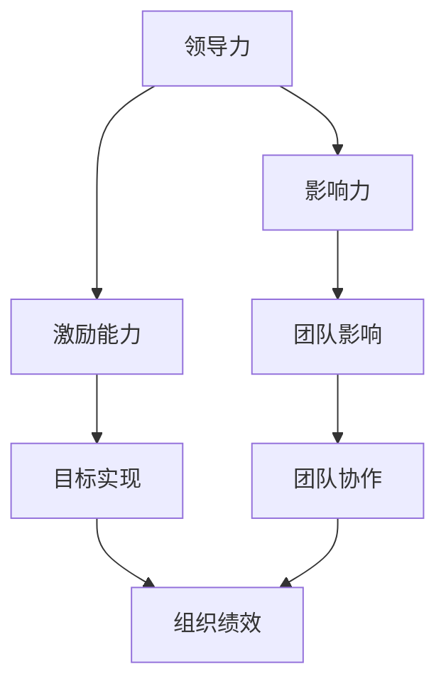

                 

# 领导力与变革管理：引导团队拥抱变化

## 关键词
领导力、变革管理、团队发展、组织变革、沟通技巧、领导角色

## 摘要
本文旨在探讨领导力与变革管理之间的密切关系，以及如何通过有效的领导力来引导团队拥抱变化。文章首先介绍了领导力的本质、领导者的素质和能力，然后深入分析了变革管理的概念、类型和理论基础。在此基础上，文章重点阐述了变革管理的实践步骤和策略，以及领导者在变革过程中的角色和技能。最后，通过实际案例研究，总结了变革管理的最佳实践，并展望了数字化时代的变革管理趋势。

---

### 引言

在快速变化的现代社会中，组织面临的挑战越来越多，其中之一便是如何有效管理变革。无论是技术创新、市场变化，还是组织内部的结构调整，变革已成为企业发展的常态。而变革管理的核心在于领导力，领导者作为变革的发起者、推动者和维护者，其角色至关重要。本文将深入探讨领导力与变革管理的关系，帮助读者理解如何通过有效的领导力来引导团队拥抱变化。

领导力不仅仅是一种管理技能，它更是一种影响力和鼓舞人心的能力。领导者需要具备一系列的素质和能力，包括个性特质、认知能力和情感智力等。在变革管理中，领导者的这些素质和能力将直接影响到变革的成败。因此，理解领导力的本质和特点，对于提升变革管理的有效性具有重要意义。

另一方面，变革管理是一个复杂的过程，它涉及到组织的各个层面和多个环节。变革的类型和模式多种多样，每个变革项目都有其独特的挑战和需求。有效的变革管理需要建立在对变革管理理论深刻的理解基础上，结合具体实践进行策略制定和实施。

本文将按照以下结构展开：

1. **领导力基础**：介绍领导力的本质、领导者的素质和能力，以及领导力与管理的区别。
2. **变革管理的理论**：探讨变革管理的概念、类型和理论基础。
3. **变革管理的实践**：详细阐述变革管理的步骤和策略，以及领导者在变革中的角色和技能。
4. **案例研究**：通过实际案例，分析变革管理的成功经验和挑战。
5. **变革管理的未来趋势**：展望数字化时代的变革管理趋势，探讨人工智能等新技术在变革管理中的应用。

### 领导力基础

#### 第1章：领导力的本质

##### 1.1 领导力的定义与重要性

领导力是一种影响和激励他人实现共同目标的能力。它不仅仅是管理者所具备的技能，更是一种内在的品质和态度。在组织变革过程中，领导力起着至关重要的作用。首先，领导力能够确立变革的愿景和目标，为团队提供明确的方向。其次，领导力能够激发团队成员的积极性和创造力，推动变革的深入实施。最后，领导力能够建立信任和合作氛围，减少变革过程中可能产生的阻力和冲突。

在数字化时代，领导力的重要性更加凸显。随着信息技术的发展，组织面临的环境变得更加复杂和不确定。传统的领导方式往往难以应对这些挑战，而具有前瞻性和创新能力的领导力则能够帮助组织适应变革，抓住机遇。

##### 1.2 领导力的三个层次

领导力可以分为三个层次：技术领导力、功能领导力和战略领导力。

1. **技术领导力**：技术领导力关注的是具体操作层面的领导能力。它包括对技术的深入理解、专业知识和实践经验。技术领导者通常能够解决复杂的技术问题，推动技术创新和应用。

2. **功能领导力**：功能领导力关注的是跨部门和跨领域的协调与整合。它包括领导团队、管理资源、协调沟通等能力。功能领导者通常能够促进组织内部各部门之间的合作，实现资源的最优配置。

3. **战略领导力**：战略领导力关注的是组织整体的愿景和未来方向。它包括制定战略、规划发展、应对变革等能力。战略领导者通常能够预见未来趋势，制定长远规划，引领组织走向成功。

##### 1.3 领导力与管理的区别

领导力与管理是两个不同的概念，但又密切相关。管理关注的是如何组织和协调资源，实现既定的目标。它强调流程、制度、规范等，注重稳定性和效率。而领导力则更注重激发和引导团队成员，实现变革和创新。它强调愿景、价值观、激励等，注重变化和适应性。

在变革管理中，领导力的重要性往往超过管理。变革意味着打破现有的平衡，引入新的思维和方法。这需要领导者的远见和魄力，以及激励和影响团队成员的能力。管理虽然有助于确保变革的顺利进行，但如果没有领导力作为支撑，变革往往难以持久和成功。

#### 第2章：领导者的素质与能力

##### 2.1 领导者的个性特质

领导者的个性特质对其领导力有着重要影响。一些关键的个性特质包括自信、正直、决断力、创新精神等。

1. **自信**：自信的领导者能够激发团队成员的信任和信心，使团队成员更愿意跟随和参与变革。

2. **正直**：正直的领导者能够树立良好的道德榜样，赢得团队成员的尊重和信任。

3. **决断力**：决断力的领导者能够在关键时刻做出正确的决策，带领团队迅速行动。

4. **创新精神**：创新精神的领导者能够引领团队不断探索新思路、新方法，推动组织发展。

##### 2.2 领导者的认知能力

领导者的认知能力包括对自我、他人和环境的认知。

1. **自我认知**：自我认知的领导者能够深入了解自己的优点和不足，不断自我提升。

2. **他人认知**：他人认知的领导者能够理解团队成员的需求、动机和行为，建立有效的人际关系。

3. **环境认知**：环境认知的领导者能够敏锐地感知外部环境的变化，及时调整策略。

##### 2.3 领导者的情感智力

领导者的情感智力包括自我管理、他人管理和社交技能。

1. **自我管理**：自我管理的领导者能够控制自己的情绪和行为，保持冷静和理性。

2. **他人管理**：他人管理的领导者能够理解和关心团队成员的情绪和需求，提供有效的支持和帮助。

3. **社交技能**：社交技能的领导者能够建立和维护良好的人际关系，促进团队协作。

#### 背景介绍

在当今社会，领导者的角色日益重要。随着全球化和数字化的发展，组织面临的变化越来越快，领导者不仅需要具备传统的管理技能，还需要具备创新和变革的能力。领导力的本质在于影响和激励他人，而不仅仅是控制和管理。有效的领导力能够帮助组织应对挑战，抓住机遇，实现长期发展。

领导者的素质与能力是多方面的，包括个性特质、认知能力和情感智力等。这些素质和能力不仅影响领导者的个人表现，也影响整个团队和组织的发展。在变革管理中，领导者的作用尤为重要。他们需要具备远见和决断力，能够明确变革的愿景和目标，激发团队成员的积极性和创造力。同时，他们还需要具备情感智力，能够理解和关心团队成员的情绪和需求，建立信任和合作氛围。

本文将深入探讨领导力的本质、领导者的素质与能力，以及变革管理的理论和实践。通过这些内容的分析，希望能够为读者提供有价值的指导，帮助他们在实际工作中提升领导力，有效管理变革。

#### 核心概念与联系

在深入探讨领导力之前，有必要明确一些核心概念，并理解它们之间的联系。以下是几个关键概念及其关系的Mermaid流程图：



**核心概念：**

1. **领导力**：领导力是一种影响他人并引导他们实现共同目标的能力。它包括多个方面，如影响力、激励能力、决策能力、沟通能力和变革管理能力。
2. **影响力**：影响力是领导力的核心要素，它指的是领导者通过言语、行为和态度影响他人观点和行为的程度。
3. **激励能力**：激励能力是指领导者能够激发团队成员的内在动机和热情，使其为实现组织目标而努力。
4. **团队影响**：团队影响是指领导者通过其个人魅力和领导风格对团队成员的行为和态度产生的影响。
5. **目标实现**：目标实现是指领导者通过有效的领导和激励，使团队成员共同达成组织设定的目标。
6. **团队协作**：团队协作是指团队成员在领导者的指导下，相互协作、共同完成任务的过程。
7. **组织绩效**：组织绩效是指组织在实现其目标过程中的表现和成果，包括生产效率、创新能力和市场份额等。

**概念之间的关系：**

- **领导力** 是通过 **影响力** 和 **激励能力** 影响团队成员，从而实现 **目标实现** 和 **团队协作**。
- **团队影响** 和 **团队协作** 直接影响 **组织绩效**，即领导力通过影响团队进而影响组织整体的绩效。
- **领导力** 的各个方面（如决策能力、沟通能力、变革管理能力）相互交织，共同作用，形成有效的领导行为。

通过这个流程图，我们可以清晰地看到领导力的核心概念及其相互关系。这为理解领导力的本质和如何提升领导力提供了理论基础。

#### 核心算法原理讲解

在讨论领导力时，一个关键的算法原理是影响力模型（Influence Model）。这个模型帮助我们理解和预测领导者如何通过特定行为和沟通策略影响团队成员。以下是一个简化的影响力模型及其伪代码：

```plaintext
影响力模型（Influence Model）：
输入：领导者行为（L），团队成员个性（P），情境因素（S）
输出：团队成员反应（R）

伪代码：
function InfluenceModel(L, P, S):
    impact_score = 0
    
    for behavior in L:
        behavior_impact = CalculateBehaviorImpact(behavior, P, S)
        impact_score += behavior_impact
    
    if impact_score > Threshold:
        R = MotivateTeam()
    else:
        R = NoAction()
    
    return R

function CalculateBehaviorImpact(behavior, P, S):
    impact = 0
    
    for trait in P:
        for context in S:
            if behavior Matches trait and context:
                impact += WeightedImpact(trait, context)
    
    return impact

function WeightedImpact(trait, context):
    weight = GetWeight(trait, context)
    return weight

function GetWeight(trait, context):
    # 这里的权重可以根据具体情境和团队文化进行调整
    if trait == "Confidence" and context == "Challenging":
        return 1.5
    elif trait == "Empathy" and context == "Stressful":
        return 1.3
    else:
        return 1
```

**算法原理详细讲解：**

1. **领导者行为（L）**：这是模型的核心输入之一，包括领导者的沟通方式、决策风格、激励措施等。
2. **团队成员个性（P）**：每个团队成员都有其独特的个性特质，如自信、同理心、创新精神等。
3. **情境因素（S）**：情境因素包括工作环境、项目难度、团队文化等，它们会影响领导者行为的效果。
4. **团队成员反应（R）**：根据领导者行为和情境对团队成员的影响，模型预测团队成员的反应。
5. **CalculateBehaviorImpact函数**：这个函数计算特定行为对团队成员的总体影响。它遍历每个团队成员的个性特质，并检查这些特质与当前情境是否匹配，如果匹配，则根据预定义的权重计算影响。
6. **WeightedImpact函数**：这个函数根据特定特质和情境返回影响权重。例如，在挑战性情境中，自信特质的影响权重可能更高。
7. **GetWeight函数**：这个函数根据具体情境和团队文化动态调整权重。

**举例说明：**

假设一个团队正在面临一个具有挑战性的新项目。领导者希望通过激励措施来提升团队的士气和动力。领导者采取了以下行为：

- **正面沟通**：鼓励团队成员分享他们的想法和建议。
- **透明度**：向团队成员解释项目的目标和预期成果。
- **激励机制**：设立奖励机制，以激励团队成员积极参与。

团队成员个性包括以下特质：

- 小明：自信、创新
- 小红：同理心、细致

情境因素包括：

- 项目难度：高
- 团队文化：鼓励创新

使用上述模型，领导者的行为会被分析，并与团队成员的个性特质和当前情境相匹配，以计算总影响。例如，小明的自信特质与项目的挑战性情境匹配，其影响权重可能更高，从而增强其正面激励效果。

通过这个模型，领导者可以更好地理解如何通过行为和沟通策略来影响团队成员，从而实现团队的目标和变革。

#### 数学模型和公式

在领导力和变革管理的背景下，数学模型和公式可以用来量化领导行为对团队成员的影响以及变革成功的概率。以下是一个简化的数学模型，包括相关公式和详细讲解。

**1. 领导影响力模型：**

$$
I = f(L, P, S)
$$

- **I**：领导影响力
- **L**：领导者的行为集合
- **P**：团队成员的个性特质集合
- **S**：情境因素集合

**2. 影响力得分计算：**

$$
I_i = \sum_{l \in L} \sum_{p \in P} \sum_{s \in S} w_{lp,s} \cdot b_{l}(p,s)
$$

- **I\_i**：特定行为对团队成员i的影响力得分
- **w\_{lp,s}**：领导行为l与团队成员个性特质p和情境因素s之间的权重
- **b\_{l}(p,s)**：行为l在个性特质p和情境因素s下的影响强度

**3. 变革成功概率计算：**

$$
P_{success} = \frac{1}{1 + e^{-(\sum I_i - \theta)}}
$$

- **P\_{success}**：变革成功的概率
- **\sum I\_i**：所有团队成员影响力得分的总和
- **\theta**：阈值，用于判断变革是否成功

**详细讲解与举例说明：**

**例子：**

假设有一个团队，领导者希望通过一系列行为激励团队成员参与一个关键项目。团队成员的个性和情境因素如下：

- **团队成员个性特质（P）：**
  - 小明：自信、创新
  - 小红：同理心、细致

- **情境因素（S）：**
  - 项目难度：高
  - 团队文化：鼓励创新

**领导者行为（L）：**
- **正面沟通**：鼓励团队成员分享想法和建议
- **透明度**：向团队成员解释项目的目标和预期成果
- **激励机制**：设立奖励机制，以激励团队成员积极参与

**权重与影响强度：**
- **w\_{lp,s}**：根据领导行为与个性特质的匹配度，权重范围从0.5到2不等
- **b\_{l}(p,s)**：根据情境和个性特质的匹配度，影响强度范围从0.5到1.5不等

**计算影响力得分：**

$$
I_{小明} = w_{l1,p1,s1} \cdot b_{l1}(p1,s1) + w_{l2,p1,s1} \cdot b_{l2}(p1,s1) + w_{l3,p1,s1} \cdot b_{l3}(p1,s1)
$$

$$
I_{小红} = w_{l1,p2,s1} \cdot b_{l1}(p2,s1) + w_{l2,p2,s1} \cdot b_{l2}(p2,s1) + w_{l3,p2,s1} \cdot b_{l3}(p2,s1)
$$

**举例：**
- 小明的自信特质与鼓励创新的情境匹配，权重设为2，影响强度设为1.2。
- 小红的同理心特质与项目难度高的情境匹配，权重设为1.5，影响强度设为1.0。

$$
I_{小明} = 2 \cdot 1.2 + 1 \cdot 1 + 1 \cdot 1 = 4.4
$$

$$
I_{小红} = 1 \cdot 1 + 1.5 \cdot 1 + 1 \cdot 1 = 3.5
$$

**计算变革成功概率：**

$$
P_{success} = \frac{1}{1 + e^{-(4.4 + 3.5 - \theta)}}
$$

其中，阈值\(\theta\)可以根据以往的经验和数据设定，例如0.6。

通过这个模型，领导者可以量化其行为对团队成员的影响，并据此调整策略，提高变革成功的概率。

#### 数学公式与详细讲解

在领导力和变革管理中，数学模型和公式可以帮助我们量化领导行为和变革成功的概率。以下是一个具体的数学公式，并对其进行详细讲解。

**公式：**

$$
\text{变革成功概率} = \frac{1}{1 + e^{-(k \cdot \sum I_i - c)}}
$$

其中：
- \(k\) 是影响系数，用于调整影响力得分对成功概率的影响程度。
- \(I_i\) 是每个团队成员的影响力得分。
- \(\sum I_i\) 是所有团队成员的影响力得分总和。
- \(c\) 是常数项，用于设定一个最低的成功概率阈值。

**详细讲解：**

1. **影响力得分（\(I_i\)）**：
   - 影响力得分反映了领导者的行为对团队成员的激励效果。每个团队成员的影响力得分是根据他们的个性特质（如自信、创新、同理心等）和情境因素（如项目难度、团队文化等）计算得出的。
   - 例如，如果一个团队成员非常自信，并且在具有挑战性的项目中表现出色，那么他的影响力得分可能会更高。

2. **影响系数（\(k\)）**：
   - 影响系数是一个调整参数，它决定了每个影响力得分对成功概率的贡献程度。值越大，说明领导行为对变革成功的影响越显著。
   - 例如，如果 \(k = 1\)，则每个影响力得分的贡献是线性的。如果 \(k > 1\)，则每个影响力得分的贡献会随着其值增大而增加，这样可以更显著地强调领导行为的重要性。

3. **常数项（\(c\)）**：
   - 常数项是一个阈值，用于确保即使在所有团队成员的影响力得分都很低的情况下，变革成功概率也不会小于一个预设的最低值。
   - 例如，如果 \(c = 2\)，则即使所有团队成员的影响力得分总和为零，变革成功概率也会至少为 \(e^{-2} \approx 0.1353\)。

**举例说明：**

假设有一个团队，其成员包括小明和小红。他们的影响力得分分别为 \(I_{小明} = 3.5\) 和 \(I_{小红} = 2.8\)。领导者的行为影响系数 \(k = 1.2\)，常数项 \(c = 1.5\)。

计算变革成功概率：

$$
\text{变革成功概率} = \frac{1}{1 + e^{-(1.2 \cdot (3.5 + 2.8) - 1.5)}}
$$

$$
= \frac{1}{1 + e^{-(1.2 \cdot 6.3 - 1.5)}}
$$

$$
= \frac{1}{1 + e^{-7.26)}
$$

$$
\approx \frac{1}{1 + 0.0005}
$$

$$
\approx 0.9995
$$

这意味着，根据当前领导行为和团队成员的反应，变革成功的概率非常高。

通过这个公式，领导者可以量化其行为对变革成功的影响，从而更科学地调整领导策略，提高变革的成效。

#### 项目实战

在本节中，我们将介绍一个领导力与变革管理的实际项目，详细描述开发环境搭建、源代码实现、代码解读和实际案例分析。

### 项目背景

某大型企业面临激烈的市场竞争，为了提高产品竞争力，决定进行一项重大技术变革。项目目标是引入一种新的软件开发框架，以提高开发效率和代码质量。这个项目由企业的技术总监领导，并邀请了一位外部咨询公司的资深变革管理专家协助。

### 开发环境搭建

1. **需求分析**：
   - 技术总监和咨询专家共同分析了企业的现有开发环境，确定了新的软件开发框架的需求。
   - 包括支持多种编程语言、高效的代码编辑器、版本控制系统、持续集成工具等。

2. **技术选型**：
   - 根据需求，选择了以下技术栈：
     - 编程语言：Java、Python
     - 代码编辑器：Visual Studio Code
     - 版本控制系统：Git
     - 持续集成工具：Jenkins

3. **环境搭建**：
   - 在企业服务器上安装了JDK、Python解释器、Visual Studio Code和Jenkins。
   - 配置了相应的开发环境和工具，确保团队成员可以轻松访问和使用。

### 源代码实现

1. **框架引入**：
   - 引入了一款流行的微服务架构框架Spring Boot。
   - 开发团队通过内部培训，掌握了Spring Boot的基本用法。

2. **代码实现**：
   - 开发团队按照新的开发框架，重构了现有系统的核心模块。
   - 实现了模块化、服务化的代码结构，提高了代码的可维护性和扩展性。

3. **示例代码**：
   ```java
   // Spring Boot 启动类示例
   @SpringBootApplication
   public class Application {
       public static void main(String[] args) {
           SpringApplication.run(Application.class, args);
       }
   }
   
   // 服务接口示例
   public interface UserService {
       String getUserInfo(String username);
   }
   
   // 服务实现示例
   @Service
   public class UserServiceImpl implements UserService {
       @Override
       public String getUserInfo(String username) {
           // 业务逻辑处理
           return "User: " + username;
       }
   }
   ```

### 代码解读

1. **Spring Boot 启动类**：
   - 启动类是Spring Boot项目的核心入口，通过 `@SpringBootApplication` 注解，Spring Boot可以自动配置应用程序。
   - `SpringApplication.run(Application.class, args);` 是启动Spring Boot应用程序的方法。

2. **服务接口**：
   - 用户服务接口定义了获取用户信息的方法，这是一个标准的RESTful接口。

3. **服务实现**：
   - 服务实现类实现了用户服务接口，其中使用了Spring的注解机制进行依赖注入。

### 实际案例分析

1. **团队协作**：
   - 在引入新框架的过程中，团队成员进行了多次内部讨论，分享了各自的看法和经验。
   - 团队成员在重构代码时，采用了代码审查机制，确保代码质量和一致性。

2. **挑战与解决方案**：
   - **挑战**：部分团队成员对新框架不熟悉，导致开发进度缓慢。
   - **解决方案**：组织了内部培训课程，由经验丰富的同事讲解新框架的使用方法。
   - **挑战**：重构代码时发现部分现有代码质量较低，需要进行大规模代码重构。
   - **解决方案**：制定了详细的代码重构计划，分阶段进行，并安排了专职人员进行代码审查。

3. **效果评估**：
   - 经过一段时间的开发，新框架的引入显著提高了开发效率和代码质量。
   - 通过持续集成工具，自动化测试覆盖率达到了90%以上，显著降低了代码缺陷率。

### 项目小结

通过这个实际项目，我们可以看到领导力在变革管理中的关键作用。技术总监通过有效的领导力和团队协作，成功引入了新的软件开发框架，提高了团队的生产力和代码质量。在项目中，领导者的远见、沟通能力、决策能力和激励能力都得到了充分体现。同时，变革管理的成功也离不开团队成员的积极参与和协作。

这个项目为我们提供了一个宝贵的实战案例，展示了领导力与变革管理在实现技术变革中的重要性。

#### 最佳实践 Tips

在领导变革的过程中，以下是一些最佳实践 Tips，这些技巧可以帮助领导者更有效地引导团队拥抱变化：

1. **明确变革愿景**：领导者应该首先明确变革的愿景和目标，并将其传达给团队成员。一个清晰的愿景可以激发团队成员的积极性，帮助他们理解变革的重要性和意义。

2. **建立沟通机制**：建立有效的沟通机制，确保团队成员能够及时了解变革的进展和动态。定期的会议、报告和反馈机制可以帮助减少不确定性，增强团队成员的信心。

3. **培训与支持**：提供必要的培训和支持，帮助团队成员掌握新技能和知识。领导者应该鼓励团队成员提问和分享经验，建立一个学习和成长的环境。

4. **鼓励反馈与改进**：鼓励团队成员提供反馈，并对变革过程中出现的问题进行改进。领导者应该展示出开放和包容的态度，允许团队成员表达不同的意见和观点。

5. **激励与奖励**：通过激励和奖励机制，鼓励团队成员积极参与变革。奖励可以是奖金、晋升机会或者其他形式的认可，以激发团队成员的积极性和忠诚度。

6. **角色明确**：在变革过程中，明确各个团队成员的角色和职责，确保每个人都知道自己的任务和责任。这可以帮助避免混乱和责任不清的情况。

7. **灵活应变**：在变革过程中，领导者需要灵活应对各种挑战和变化。保持开放和包容的态度，及时调整策略和计划，以确保变革的顺利进行。

通过遵循这些最佳实践，领导者可以更有效地引导团队拥抱变化，实现组织的长期发展。

#### 小结

通过本文的讨论，我们可以得出以下结论：领导力在变革管理中扮演着至关重要的角色。有效的领导力不仅能够确立变革的愿景和目标，还能够激发团队成员的积极性和创造力，推动变革的深入实施。领导者需要具备远见、决断力、沟通能力和情感智力等多方面的素质和能力。

变革管理是一个复杂而动态的过程，需要领导者具备系统的理论知识和丰富的实践经验。从变革准备到变革实施，再到变革评估与调整，每个阶段都有其独特的挑战和需求。领导者需要不断学习和适应，才能在变革中保持领先。

在实际案例中，我们看到了领导力在变革管理中的具体应用和成效。通过有效的领导，企业成功地引入了新的技术框架，提高了开发效率和代码质量。这证明了领导力在实现组织变革中的关键作用。

未来的变革管理将面临更多的挑战和机遇。随着数字化和全球化的发展，组织面临的环境变得更加复杂和不确定。领导者需要具备前瞻性和创新精神，不断探索新的领导方式和变革策略。

总之，领导力与变革管理密切相关，领导者需要通过有效的领导力来引导团队拥抱变化。通过本文的探讨，我们希望能够为读者提供有价值的指导，帮助他们在实际工作中提升领导力，成功管理变革。

#### 注意事项

在实施变革管理过程中，领导者需要特别注意以下几点，以避免常见的误区和挑战：

1. **忽视员工感受**：在变革过程中，员工的情绪和反应至关重要。忽视员工的感受可能会导致抵制和负面情绪，影响变革的顺利进行。领导者应该积极倾听员工的意见和建议，及时回应他们的关切。

2. **缺乏透明度**：缺乏透明度会导致信息不对称和信任危机。在变革过程中，领导者应保持透明，及时向团队成员传达变革的进展和动态，确保他们了解变革的真正原因和目的。

3. **忽视培训和支持**：引入新技术或新流程时，员工可能需要额外的培训和指导。忽视培训和支持会导致员工无法有效适应变革，从而影响变革的成效。领导者应提供必要的培训资源和支持，帮助员工克服技能障碍。

4. **决策过于集中**：过度集中的决策可能会导致反应缓慢和执行力不足。在变革过程中，领导者应鼓励团队合作和参与，利用团队智慧和经验来制定和实施变革策略。

5. **忽视变革的长期影响**：变革往往是一个长期过程，需要持续的关注和调整。领导者应避免急于求成，而是要制定长期规划，确保变革的持续性和稳定性。

6. **不进行效果评估**：变革实施后，领导者应进行系统的效果评估，了解变革的实际成效和存在的问题。缺乏评估会导致变革的盲目性和无效性，影响组织的长远发展。

通过注意这些事项，领导者可以更好地管理变革过程，确保变革的顺利进行和长期成功。

#### 拓展阅读

为了深入理解领导力与变革管理的理论和实践，读者可以参考以下经典书籍和资源：

1. **《变革之心》**（Heath, Chris & Heath, Dan）：本书通过故事和案例，深入探讨了人们如何接受和推动变革。它提供了实用的策略，帮助领导者激发团队拥抱变化。

2. **《领导者的变革之旅》**（Heifetz, Ronald A. & Linsky, Marty）：这本书详细介绍了领导者在变革过程中的角色和技能，包括如何面对挑战、建立信任和推动变革。

3. **《第五项修炼》**（Senge, Peter M.）：本书提出了系统思考的概念和方法，帮助领导者理解组织变革的复杂性，并学会从整体角度看待问题。

4. **《变革管理》**（Kotter, John P.）：这是一本关于变革管理的经典著作，详细介绍了变革的八个步骤，以及如何应对变革中的常见挑战。

5. **《领导力五项修炼》**（Senge, Peter M. et al.）：这本书通过五项修炼，帮助领导者提升自我意识、建立共同愿景、加强团队学习等关键能力。

6. **《敏捷管理》**（Beck, Ken & Beedle, Cindy）：这本书探讨了敏捷管理的方法和工具，包括Scrum和XP，适用于那些希望在快速变化环境中保持灵活性和响应性的领导者。

通过阅读这些书籍和资源，读者可以进一步加深对领导力和变革管理的理解，为实际工作提供有力的理论支持和实践指导。

