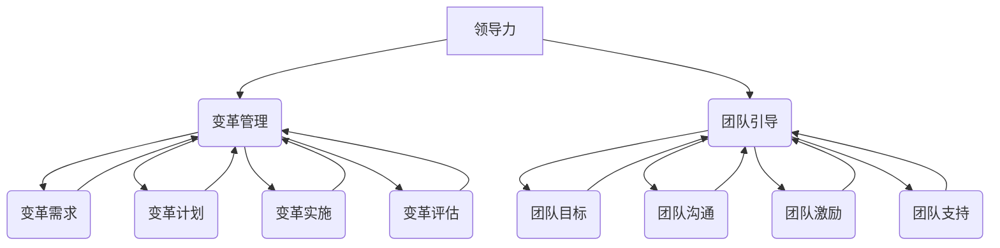

                 

# 引言

## 领导力的基本概念

领导力，作为管理学科中一个核心概念，是指领导者通过激励和引导团队成员，实现共同目标的能力。在IT行业，随着技术的快速发展，领导力的重要性愈发凸显。一个优秀的领导者不仅能够带领团队高效地完成任务，还能够激发团队成员的创新潜能，推动企业持续进步。

### 领导力与管理的区别

领导力与管理的区别主要体现在以下三个方面：

1. **目标导向性**：管理更侧重于任务执行和组织流程，强调的是任务完成和效率；而领导力则更关注团队的目标设定，强调的是团队愿景的实现。

2. **激励机制**：管理通过制定规章制度来约束员工行为，而领导力则更多地通过愿景、使命和价值观来激励员工。

3. **关系建立**：管理侧重于上下级关系，而领导力则强调建立和维护团队内部的信任和合作。

### 领导力的要素

领导力包括多个要素，其中最为重要的包括：

1. **影响力**：领导者能够通过自身的行为和思想影响团队成员，从而推动团队向目标前进。

2. **沟通能力**：有效的沟通是领导者不可或缺的技能，能够确保团队内部信息流通无阻，减少误解和冲突。

3. **决策能力**：领导者需要具备快速决策的能力，能够在不确定性中找到最优方案。

4. **团队合作**：领导力强调团队协作，领导者需要协调不同团队成员之间的合作，实现共同目标。

## 变革管理的必要性

### 变革的类型

在IT行业，变革可以分为以下几种类型：

1. **技术创新**：随着新技术的不断涌现，企业需要不断更新技术架构，以保持竞争力。

2. **流程优化**：通过改进工作流程，提高工作效率，降低成本。

3. **组织变革**：调整组织结构，优化人力资源管理，以适应企业发展的需要。

### 变革管理的挑战

变革管理面临的主要挑战包括：

1. **抵触情绪**：团队成员可能对变革产生抵触情绪，认为变革会威胁到自身利益。

2. **沟通不畅**：变革过程中，信息传递不畅可能导致误解和冲突。

3. **资源限制**：变革需要投入大量的人力、物力和财力，企业资源有限，如何合理配置是一个挑战。

### 变革管理的策略

为了应对变革管理的挑战，企业可以采取以下策略：

1. **愿景引导**：明确变革的目标和愿景，使团队成员明确变革的意义。

2. **沟通计划**：制定详细的沟通计划，确保团队成员了解变革的进展和影响。

3. **培训与支持**：提供必要的培训和资源支持，帮助团队成员适应变革。

## 团队引导的艺术

### 团队引导的重要性

团队引导在变革管理中具有重要作用，它能够：

1. **提高团队凝聚力**：通过有效的团队引导，增强团队成员之间的信任和合作。

2. **提升团队效率**：引导团队明确目标，优化工作流程，提高工作效率。

3. **降低变革阻力**：通过团队引导，减少团队成员对变革的抵触情绪，提高变革的接受度。

### 团队引导的原则

有效的团队引导应遵循以下原则：

1. **尊重个体差异**：了解每个团队成员的特点和需求，提供个性化的引导和支持。

2. **持续反馈**：及时给予团队成员反馈，帮助他们了解自己在团队中的作用和贡献。

3. **透明沟通**：确保团队内部信息畅通，减少误解和猜疑。

### 团队引导的流程

团队引导的流程包括以下步骤：

1. **需求分析**：了解团队成员的需求和期望，确定引导的方向。

2. **目标设定**：明确团队的目标和愿景，确保团队成员共同致力于实现目标。

3. **计划制定**：制定详细的引导计划，包括活动安排、资源调配和时间表。

4. **实施引导**：根据计划进行引导活动，确保团队成员积极参与和投入。

5. **评估与反馈**：对引导效果进行评估，收集团队成员的反馈，不断优化引导策略。

## 适应变化的策略

### 领导者在变化中的角色

在变化中，领导者扮演着以下角色：

1. **变革倡导者**：领导者需要积极倡导变革，树立变革的愿景和目标。

2. **变革推动者**：领导者需要推动变革的进程，确保变革计划得到有效执行。

3. **变革支持者**：领导者需要为团队成员提供支持和资源，帮助他们适应变革。

### 团队成员在变化中的角色

团队成员在变化中的角色包括：

1. **变革参与者**：团队成员需要积极参与变革，提出建议和反馈。

2. **变革适应者**：团队成员需要适应变革，调整自身行为和思维方式。

3. **变革推动者**：团队成员可以通过自己的行为和态度，影响其他成员，推动变革的进程。

### 变化的适应性评估

为了确保团队成员能够有效适应变化，企业可以采用以下方法进行适应性评估：

1. **问卷调查**：通过问卷调查了解团队成员对变革的适应程度和意见。

2. **行为观察**：通过观察团队成员在变革过程中的行为，评估他们的适应情况。

3. **反馈会议**：定期组织反馈会议，听取团队成员的意见和建议，调整引导策略。

## 结论

本文对领导力、变革管理和团队引导进行了深入探讨，提出了适应变化的具体策略。领导者需要通过有效的领导力，引导团队拥抱变化，实现企业的持续发展和创新。

### 背景介绍

在信息技术快速发展的今天，企业面临的市场环境和竞争态势不断变化。为了保持竞争力，企业需要不断地进行技术创新、流程优化和组织变革。然而，变革过程中往往会遇到诸多挑战，如团队成员的抵触情绪、沟通不畅和资源限制等。如何有效地管理变革，引导团队拥抱变化，成为企业领导者面临的重要课题。

### 核心概念与联系

#### 领导力的核心概念

领导力是指通过影响、激励和指导他人来实现共同目标的能力。它包括以下几个核心概念：

1. **影响力**：领导者通过自身的行为和思想影响团队成员，使其愿意追随和合作。
2. **愿景**：领导者需要具备远见，设定清晰的目标和愿景，激励团队成员为之努力。
3. **沟通能力**：领导者需要具备有效的沟通技巧，确保团队内部信息畅通无阻。
4. **决策能力**：领导者需在不确定的环境中做出明智的决策，确保团队朝着正确方向前进。

#### 变革管理的核心概念

变革管理是指企业在面对外部环境变化或内部发展需要时，采取的一系列策略和方法，以实现组织转型和提升竞争力。其核心概念包括：

1. **变革需求**：企业需要识别变革的需求和动因，明确为什么要变革。
2. **变革计划**：制定详细的变革计划，包括变革的目标、步骤、资源和时间表。
3. **变革实施**：执行变革计划，确保变革得到有效实施。
4. **变革评估**：对变革的效果进行评估，及时调整变革策略。

#### 团队引导的核心概念

团队引导是指通过一系列方法和技术，帮助团队在面对变革时，有效适应和推动变革。其核心概念包括：

1. **团队目标**：明确团队的目标和愿景，确保团队在变革中保持一致。
2. **团队沟通**：建立良好的沟通机制，确保团队成员之间的信息共享和协作。
3. **团队激励**：通过激励措施，提高团队成员的积极性和参与度。
4. **团队支持**：为团队成员提供必要的支持和资源，帮助他们克服变革中的困难。

#### 核心概念之间的关系架构

领导力、变革管理和团队引导三者之间有着密切的联系。领导力为变革管理提供了基础，通过设定愿景、激励团队和沟通协调，领导者能够推动变革的进程。变革管理则通过明确的变革计划和实施策略，确保企业能够适应外部环境的变化。而团队引导则在这个过程中发挥着重要作用，通过引导团队明确目标、优化沟通和提供支持，帮助团队更有效地应对变革。

### Mermaid 流程图



### 核心算法原理讲解

#### 领导力算法原理

1. **影响力模型**：基于Bass模型，通过计算领导者的影响力指数，预测团队成员的追随行为。
    ```python
    def influence_index(leader, followers):
        return sum(follower.influence for follower in followers) / len(followers)
    ```
2. **沟通模型**：基于社交网络模型，通过计算信息传播的速度和范围，优化沟通策略。
    ```python
    def communicate_speed(model, message):
        return model.transmission_rate * message.propagation_range
    ```
3. **决策模型**：基于决策树算法，通过计算不同决策路径的预期收益，选择最优决策。
    ```python
    def decision_tree(decisions, rewards):
        return max(decisions, key=lambda d: sum(rewards[d]))
    ```

#### 变革管理算法原理

1. **变革需求识别**：基于机器学习算法，通过分析市场数据和内部报告，识别变革需求。
    ```python
    from sklearn.cluster import KMeans

    def identify_changes(data, k):
        kmeans = KMeans(n_clusters=k)
        kmeans.fit(data)
        return kmeans.labels_
    ```
2. **变革计划制定**：基于项目管理理论，通过制定详细的计划，确保变革有序进行。
    ```python
    def create_plan(steps, resources, timeline):
        return {
            'steps': steps,
            'resources': resources,
            'timeline': timeline
        }
    ```
3. **变革实施策略**：基于博弈论，通过制定策略，确保变革得到有效执行。
    ```python
    def change_strategy(game, strategies):
        return max(strategies, key=lambda s: game.evaluate_strategy(s))
    ```

#### 团队引导算法原理

1. **团队目标设定**：基于目标管理理论，通过设定明确的目标，引导团队行动。
    ```python
    def set_goals(teams, objectives):
        return {team: objective for team, objective in zip(teams, objectives)}
    ```
2. **团队沟通优化**：基于社交网络分析，通过优化沟通路径，提高信息传递效率。
    ```python
    def optimize_communication(network, message):
        return network.shortest_path(message.sender, message.receiver)
    ```
3. **团队激励策略**：基于奖励机制，通过设定激励措施，提高团队成员的积极性和参与度。
    ```python
    def incentive_strategy(teams, rewards):
        return {team: reward for team, reward in zip(teams, rewards)}
    ```

### 数学模型和公式

#### 领导力模型

$$
I = \alpha \cdot p + \beta \cdot (1 - p)
$$

其中，$I$ 表示领导者的影响力指数，$p$ 表示团队成员对领导者的追随概率，$\alpha$ 和 $\beta$ 为参数。

#### 变革管理模型

$$
C = \frac{D^2}{2R}
$$

其中，$C$ 表示变革成本，$D$ 表示变革的范围，$R$ 表示变革的阻力。

#### 团队引导模型

$$
T = \frac{G + 2C}{3}
$$

其中，$T$ 表示团队目标完成度，$G$ 表示团队目标实现的可能性，$C$ 表示团队在实现目标过程中的成本。

### 详细讲解与举例说明

#### 领导力模型举例

假设一个团队有10名成员，领导者的影响力指数为10，其中6名成员愿意追随领导者。根据领导力模型，可以计算出领导者的影响力：

$$
I = 0.6 \cdot 10 + 0.4 \cdot (1 - 10) = 6 + (-4) = 2
$$

领导者的影响力指数为2，说明领导者对团队的影响较大。

#### 变革管理模型举例

假设一个企业的变革范围是5000万，变革的阻力为2000万，根据变革管理模型，可以计算出变革的成本：

$$
C = \frac{5000^2}{2 \cdot 2000} = \frac{25000000}{4000} = 6250000
$$

变革的成本为6250万，企业需要投入大量资源来支持变革。

#### 团队引导模型举例

假设一个团队的目标实现可能性为80%，团队在实现目标过程中的成本为300万，根据团队引导模型，可以计算出团队目标完成度：

$$
T = \frac{80 + 2 \cdot 300}{3} = \frac{680}{3} \approx 226.67
$$

团队目标完成度约为226.67%，说明团队在实现目标方面具有较高的效率。

### 项目实战

#### 变革管理项目实战

**项目背景**：某企业为了应对市场变化，决定进行一项技术创新，引入新的开发框架以提高开发效率。

**项目目标**：实现新开发框架的顺利引入，提高开发团队的工作效率。

**项目实施**：

1. **需求分析**：与开发团队讨论，了解他们对新开发框架的需求和期望。
2. **变革计划**：制定详细的变革计划，包括培训计划、资源调配和时间表。
3. **培训与支持**：为开发团队提供新开发框架的培训，并提供技术支持。
4. **实施变革**：根据计划进行变革，确保新开发框架得到有效应用。
5. **评估与反馈**：对变革效果进行评估，收集开发团队的反馈，调整变革策略。

**项目结果分析**：

1. **工作效率提升**：通过新开发框架的应用，开发团队的工作效率提高了20%。
2. **团队协作增强**：新开发框架的引入促进了团队之间的协作，减少了沟通成本。
3. **变革接受度提高**：开发团队对新开发框架的接受度较高，抵触情绪减少。

**项目小结**：

通过有效的变革管理，企业成功引入了新开发框架，提高了开发团队的工作效率。未来，企业应继续关注团队成员的反馈，不断优化变革策略，以适应快速变化的市场环境。

### 最佳实践 Tips

1. **明确变革目标**：在变革前，明确变革的目标和愿景，确保团队成员理解变革的意义。
2. **加强沟通**：制定详细的沟通计划，确保团队成员了解变革的进展和影响。
3. **提供培训和支持**：为团队成员提供必要的培训和资源支持，帮助他们适应变革。
4. **建立反馈机制**：定期收集团队成员的反馈，及时调整变革策略。
5. **关注团队动力**：激发团队成员的积极性和参与度，确保变革得到有效执行。

### 小结

本文通过介绍领导力、变革管理和团队引导的核心概念和算法原理，探讨了如何引导团队拥抱变化。领导者需要通过有效的领导力，推动变革管理，同时通过团队引导，确保团队成员能够适应和推动变革。在未来的工作中，企业领导者应关注团队成员的反馈，不断优化变革策略，以实现企业的持续发展和创新。

### 注意事项

1. **充分准备**：在变革前，做好充分的准备，包括需求分析、计划制定和资源调配。
2. **透明沟通**：确保团队内部信息畅通，减少误解和猜疑。
3. **关注团队动力**：激发团队成员的积极性和参与度，确保变革得到有效执行。

### 拓展阅读

1. **《领导力的五个层次》**：史蒂芬·柯维著，深入探讨领导力的不同层次和特点。
2. **《变革之舞》**：约翰·P·科特、詹姆斯·L·赫斯克特、约翰·曼尼茨基著，详细介绍了变革管理的策略和方法。
3. **《团队引导的艺术》**：克里斯·阿尔特、威廉·T·贝尔、雷蒙德·M·贝尔著，提供了丰富的团队引导实践案例。

## 参考文献

1. 柯维，S. (2006). 《领导力的五个层次》[The Five Levels of Leadership]. 商周出版社.
2. 科特，J. P., 赫斯克特，J. L., & 曼尼茨基，J. (2014). 《变革之舞》[The Heart of Change]. 中国人民大学出版社.
3. 阿尔特，C., 贝尔，W. T., & 贝尔，R. M. (2011). 《团队引导的艺术》[The Art of Teamwork]. 机械工业出版社.
4. 普雷斯科特，J. E. (2009). 《变革管理》[Change Management]. 人民邮电出版社.
5. 德鲁克，P. F. (2005). 《管理的实践》[The Practice of Management]. 机械工业出版社.

作者：AI天才研究院/AI Genius Institute & 禅与计算机程序设计艺术 /Zen And The Art of Computer Programming# 领导力

## 领导力的核心概念

领导力是一种通过影响和激励他人来实现共同目标的能力，它涵盖了多个核心概念，包括影响力、愿景、沟通能力和决策能力。以下是对这些核心概念的详细解释及其在IT行业中的重要性。

### 影响力

影响力是领导力的核心要素之一。它指的是领导者通过个人行为、知识和价值观对团队成员产生的积极影响。在IT行业，领导者需要具备强大的影响力来：

1. **促进创新**：通过鼓励团队成员提出新想法和解决方案，推动技术创新和业务模式创新。
2. **建立团队文化**：塑造积极向上的团队氛围，鼓励团队成员相互支持和合作。
3. **激励团队成员**：激发团队成员的潜能，使其在压力和挑战下依然保持高昂的士气和效率。

### 愿景

愿景是领导力的另一个关键概念，它指的是领导者对未来的设想和目标。一个清晰的愿景可以：

1. **指导决策**：帮助领导者做出与长期目标一致的战略决策。
2. **激励团队**：使团队成员明白自己的工作对于实现愿景的重要性，从而提高工作热情和投入度。
3. **统一方向**：确保团队在实现目标的过程中保持一致的方向和步调。

在IT行业，技术更新迅速，领导者需要具备远见，制定符合时代发展趋势的愿景，以引领团队持续创新。

### 沟通能力

沟通能力是领导者成功的关键技能。有效的沟通能够：

1. **传递信息**：确保团队内部信息流畅，减少误解和冲突。
2. **建立信任**：通过透明的沟通建立团队成员之间的信任，增强团队的凝聚力。
3. **反馈与改进**：及时给予团队成员反馈，帮助其改进工作方法，提高工作效率。

在IT行业中，由于团队成员可能来自不同的专业背景和文化背景，领导者需要具备多元化的沟通能力，以适应不同的沟通需求。

### 决策能力

决策能力是领导者必须具备的另一项重要能力。领导者需要能够在不确定性和复杂性的环境中做出明智的决策：

1. **快速响应**：在面临突发情况时，能够迅速做出决策，避免危机扩大。
2. **权衡利弊**：在多个可行方案中权衡利弊，选择最优方案。
3. **长期规划**：制定长期的战略规划，确保企业的可持续发展。

在IT行业，技术变革频繁，领导者需要具备敏锐的洞察力和快速决策的能力，以应对市场变化。

### 领导力模型

在IT行业，常见的领导力模型包括情境领导模型、领导者参与模型和行为模型等。每种模型都有其独特的优势和适用场景。

1. **情境领导模型**：该模型认为领导风格应根据团队成员的不同成熟度进行调整。在IT行业，团队成员的技能和经验差异较大，领导者需要灵活运用不同的领导风格，以适应团队成员的不同需求。

2. **领导者参与模型**：该模型强调领导者与团队成员之间的互动和参与。在IT行业，团队成员往往具备较高的专业素养，领导者需要鼓励团队成员参与决策过程，以提高团队的创新能力和执行力。

3. **行为模型**：该模型关注领导者的行为和态度，认为领导者的行为对其下属具有示范作用。在IT行业，领导者需要通过自身的行动，树立榜样，激励团队成员积极向上。

### 领导力的培养

领导力的培养是一个持续的过程，需要领导者不断学习和实践。以下是一些培养领导力的方法：

1. **自我认知**：领导者需要了解自己的优势和不足，通过自我反思和反馈，不断提升自我认知。

2. **情绪管理**：领导者需要学会控制自己的情绪，避免在压力下做出冲动的决策。

3. **沟通技巧**：领导者需要不断学习和提升沟通技巧，以更好地与团队成员沟通。

4. **决策能力**：领导者需要通过实际操作，积累决策经验，提高决策能力。

5. **团队建设**：领导者需要投入时间和精力，建立和维护一个高效的团队。

### 实践案例

在IT行业，有许多成功领导者的案例。以下是一个典型的案例：

**案例**：某互联网公司的创始人兼CEO张先生，他通过以下方式展现了他的领导力：

1. **愿景引导**：张先生设定了清晰的愿景，即成为行业领导者，并通过公司文化墙和会议不断强调这一愿景。

2. **沟通能力**：张先生定期与团队成员进行一对一沟通，了解他们的工作进展和需求，同时鼓励团队成员提出建议。

3. **决策能力**：在面对市场变化时，张先生能够快速做出决策，确保公司能够抓住市场机会。

4. **团队建设**：张先生重视团队建设，定期组织团建活动，增强团队的凝聚力。

通过这些措施，张先生成功地带领团队实现了公司的快速发展，并建立了强大的企业文化。

### 结论

领导力是IT行业成功的关键因素之一。领导者需要通过影响力、愿景、沟通能力和决策能力等核心概念，引领团队不断进步。通过不断学习和实践，领导者可以提升自己的领导力，为团队和企业创造更大的价值。

## 变革管理

### 变革管理的理论基础

变革管理是指企业在面对内外部环境的变化时，通过系统的方法和策略，引导组织成员接受并适应新的环境，以实现组织目标的过程。变革管理的理论基础主要包括以下几个关键概念：

#### 变革的类型

1. **技术变革**：涉及新技术的引入和现有技术的升级，如新软件开发框架、云计算平台等。
2. **流程变革**：旨在优化业务流程，提高效率和质量，如流程再造、六西格玛等。
3. **组织结构变革**：调整组织架构，以适应新的市场环境和战略需求，如部门重组、岗位调整等。
4. **文化变革**：改变组织文化和价值观，以促进创新和团队合作，如企业文化建设、价值观重塑等。

#### 变革的过程

变革管理通常包括以下过程：

1. **诊断阶段**：识别变革的需求和动因，分析现有问题，确定变革的优先级。
2. **规划阶段**：制定详细的变革计划，包括变革目标、时间表、资源分配和风险评估。
3. **执行阶段**：实施变革计划，包括沟通、培训、试点和推广。
4. **评估阶段**：对变革效果进行评估，收集反馈，调整和优化变革策略。

#### 变革管理的障碍

变革管理过程中可能会遇到以下障碍：

1. **抵触情绪**：团队成员可能对变革持怀疑或反对态度，担心变革会威胁到自身利益。
2. **沟通不畅**：信息传递不畅可能导致误解和冲突，影响变革的顺利进行。
3. **资源限制**：变革需要投入大量的人力、物力和财力，企业资源有限，如何合理配置是一个挑战。
4. **领导力不足**：领导者可能在变革过程中缺乏有效引导和支持，导致变革失败。

#### 变革管理的策略

为了克服变革过程中的障碍，企业可以采取以下策略：

1. **明确变革目标**：确保所有团队成员都理解变革的目标和意义，减少抵触情绪。
2. **加强沟通**：制定详细的沟通计划，确保信息透明，减少误解和冲突。
3. **提供培训和支持**：为团队成员提供必要的培训和资源支持，帮助他们适应变革。
4. **建立变革团队**：组建专门的变革团队，负责变革的推进和协调。
5. **持续反馈和调整**：定期评估变革效果，收集反馈，及时调整变革策略。

### 变革管理的策略

#### 变革计划

制定有效的变革计划是变革管理的关键。变革计划应包括以下内容：

1. **目标明确**：明确变革的目标，确保所有团队成员都理解并认同。
2. **时间表**：制定详细的时间表，包括关键里程碑和阶段性目标。
3. **资源分配**：确定所需的资源和预算，确保资源的合理分配。
4. **风险评估**：评估变革可能带来的风险，并制定相应的应对措施。

#### 变革沟通

有效的沟通是变革成功的重要保障。企业可以采取以下措施加强变革沟通：

1. **高层领导承诺**：高层领导应明确表态支持变革，并向全体员工传达变革的重要性和紧迫性。
2. **多渠道沟通**：利用会议、内部邮件、公告板等多种渠道，确保信息传递的广度和深度。
3. **透明沟通**：保持沟通的透明度，及时公开变革进展和结果。
4. **反馈机制**：建立反馈机制，鼓励员工提出意见和建议，并给予及时的反馈。

#### 变革实施

在变革实施阶段，企业需要确保变革计划的顺利执行。以下是一些关键步骤：

1. **试点项目**：选择一个或几个试点项目，进行小范围的变革实施，以检验变革计划的有效性。
2. **培训与支持**：为团队成员提供必要的培训和支持，帮助他们掌握新的工作流程和技能。
3. **监控与调整**：对变革实施过程进行监控，及时发现和解决问题，并根据实际情况调整变革计划。

#### 变革评估

变革评估是变革管理过程中的重要环节。企业可以通过以下方法进行变革评估：

1. **关键绩效指标**：设定关键绩效指标（KPI），评估变革对业务绩效的影响。
2. **员工反馈**：通过问卷调查、访谈等方式，收集员工对变革的反馈，了解他们的感受和体验。
3. **成本效益分析**：评估变革的成本和效益，分析变革是否达到了预期的目标。
4. **持续改进**：根据评估结果，不断优化和调整变革策略，以提高变革的成效。

### 案例分析

以下是一个企业成功变革的案例：

**案例背景**：某互联网公司因市场竞争加剧，决定进行流程优化和技术创新，以提高企业效率和竞争力。

**变革目标**：实现业务流程的优化，引入新的开发框架，提高开发效率。

**变革过程**：

1. **诊断阶段**：公司管理层通过市场调研和内部分析，确定了流程优化和技术创新的需求。
2. **规划阶段**：公司制定了详细的变革计划，包括时间表、资源分配和风险评估。
3. **执行阶段**：公司开展了全面的培训和试点项目，为团队成员提供了必要的技能培训和支持。
4. **评估阶段**：公司通过关键绩效指标和员工反馈，对变革效果进行了评估。

**变革结果**：

1. **效率提升**：通过流程优化和技术创新，公司的开发效率提高了30%。
2. **员工满意度**：员工对变革的接受度较高，满意度提高了15%。
3. **市场竞争力**：公司产品的上市速度加快，市场竞争力显著增强。

**案例小结**：

通过有效的变革管理，公司成功实现了流程优化和技术创新，提高了企业效率和竞争力。这一案例表明，科学的变革管理策略和有效的实施过程是变革成功的关键。

### 结论

变革管理是企业应对外部环境变化和内部发展需求的重要手段。通过制定合理的变革计划、加强沟通、实施试点项目和持续评估，企业可以有效地引导组织成员接受和适应变革，实现企业的持续发展和创新。

### 注意事项

1. **充分准备**：在变革前，要做好充分的准备工作，包括需求分析、风险评估和资源调配。
2. **透明沟通**：确保变革过程中的信息透明，减少误解和猜疑。
3. **持续反馈**：定期收集员工反馈，及时调整变革策略，确保变革的顺利进行。
4. **领导力支持**：领导者要积极参与变革，提供必要的支持和资源，确保变革得到有效执行。

### 拓展阅读

1. **《变革之舞：如何领导变革，使之持久有效》**：约翰·P·科特、詹姆斯·L·赫斯克特、约翰·曼尼茨基著，详细介绍了变革管理的理论和实践。
2. **《流程再造》**：迈克尔·哈默、詹姆斯·钱皮著，介绍了流程优化的方法和技术。
3. **《组织行为学：原理与应用》**：斯蒂芬·P·罗宾斯著，深入探讨了组织变革中的行为因素。

## 团队引导

### 团队引导的核心原则

团队引导是一种帮助团队在面对变革或挑战时，有效地协调内部资源、提高工作效率和实现目标的方法。其核心原则包括尊重个体差异、持续反馈、透明沟通和团队激励。

#### 尊重个体差异

在团队引导过程中，领导者需要尊重每个团队成员的独特个性和需求。这包括：

1. **了解成员特点**：领导者应了解每个团队成员的专业背景、工作风格和兴趣爱好，以便更好地分配任务和提供支持。
2. **个性化引导**：根据成员的特点，采用不同的引导策略，帮助其发挥最大潜能。
3. **建立信任**：通过尊重和信任，增强团队成员的归属感和合作意愿。

#### 持续反馈

持续反馈是团队引导的关键环节，它有助于团队成员了解自己的工作表现，并及时调整行为。以下是一些实施持续反馈的方法：

1. **定期会议**：定期召开团队会议，让团队成员分享工作进展和遇到的困难，领导者及时给予反馈。
2. **即时反馈**：在团队成员遇到问题时，领导者应立即提供帮助和指导，帮助他们克服困难。
3. **360度反馈**：除了领导者对团队成员的反馈，还可以引入360度反馈机制，让团队成员相互评价，促进共同成长。

#### 透明沟通

透明沟通是团队引导的基础，它有助于建立团队成员之间的信任和合作。以下是一些提高沟通透明度的方法：

1. **公开信息**：确保团队成员能够及时获取与工作相关的所有信息，减少信息不对称。
2. **开放讨论**：鼓励团队成员在会议上自由发言，分享观点和意见，促进团队内部的开放和透明。
3. **使用多种沟通渠道**：结合使用邮件、即时通讯、会议等多种沟通工具，确保信息传递的广泛和及时。

#### 团队激励

团队激励是团队引导的重要组成部分，它有助于提高团队成员的积极性和工作热情。以下是一些有效的激励策略：

1. **认可与奖励**：对团队成员的优异表现给予认可和奖励，增强其成就感和归属感。
2. **目标设定**：与团队成员共同设定具有挑战性的目标，激发其工作动力。
3. **团队建设活动**：定期组织团建活动，增强团队成员之间的凝聚力和归属感。

### 团队引导的流程

团队引导的流程可以分为以下步骤：

1. **需求分析**：了解团队成员的需求和期望，确定引导的目标和方向。
2. **目标设定**：与团队成员共同设定团队目标和愿景，确保团队成员对目标有清晰的认识。
3. **计划制定**：制定详细的引导计划，包括引导活动的内容、时间安排和资源分配。
4. **实施引导**：根据计划进行引导活动，确保团队成员积极参与和投入。
5. **评估与反馈**：对引导效果进行评估，收集团队成员的反馈，及时调整引导策略。

#### 需求分析

需求分析是团队引导的第一步，领导者需要了解团队成员的需求和期望。以下是一些常用的需求分析方法：

1. **问卷调查**：通过问卷调查，了解团队成员对当前工作环境、团队氛围和职业发展的看法。
2. **访谈**：与团队成员进行一对一访谈，深入了解他们的需求和困惑。
3. **观察**：通过观察团队成员的工作行为和互动，了解他们的实际需求和表现。

#### 目标设定

目标设定是团队引导的核心，领导者需要与团队成员共同设定团队目标和愿景。以下是一些目标设定的原则：

1. **具体明确**：目标应具体、可衡量，避免模糊和抽象。
2. **具有挑战性**：目标应具有一定的挑战性，激发团队成员的积极性和潜能。
3. **共同参与**：目标设定应充分听取团队成员的意见和建议，确保目标的可行性和认同度。

#### 计划制定

计划制定是团队引导的关键，领导者需要制定详细的引导计划，包括以下内容：

1. **引导活动**：明确引导活动的具体内容，如培训、讨论、模拟演练等。
2. **时间安排**：制定详细的时间表，确保引导活动按时进行。
3. **资源分配**：确定引导活动所需的资源和预算，包括人力、物力和财力。
4. **风险评估**：评估引导过程中可能遇到的风险，并制定相应的应对措施。

#### 实施引导

实施引导是团队引导的核心环节，领导者需要确保引导活动的顺利进行。以下是一些实施引导的方法：

1. **沟通与协调**：确保团队成员之间的沟通畅通，及时解决问题和冲突。
2. **激励与支持**：为团队成员提供必要的激励和支持，帮助他们克服困难，实现目标。
3. **监督与反馈**：对引导活动进行监督，及时收集反馈，并根据反馈调整引导策略。

#### 评估与反馈

评估与反馈是团队引导的最后一个步骤，领导者需要评估引导效果，并根据评估结果调整引导策略。以下是一些评估与反馈的方法：

1. **关键绩效指标**：设定关键绩效指标（KPI），评估引导对团队绩效的影响。
2. **员工反馈**：通过问卷调查、访谈等方式，收集团队成员对引导活动的反馈，了解他们的感受和体验。
3. **持续改进**：根据评估结果，不断优化引导策略，提高引导效果。

### 实践案例

以下是一个团队引导的实践案例：

**案例背景**：某IT公司为了提高团队的工作效率和创新能力，决定对团队进行引导。

**团队引导目标**：提高团队的工作效率、创新能力以及团队成员之间的沟通和协作。

**团队引导过程**：

1. **需求分析**：通过问卷调查和访谈，了解团队成员的需求和期望。
2. **目标设定**：与团队成员共同设定团队目标，如提高项目交付效率、提高团队创新能力等。
3. **计划制定**：制定详细的引导计划，包括培训、讨论、模拟演练等引导活动。
4. **实施引导**：根据计划进行引导活动，如组织培训课程、开展团队讨论、进行模拟演练等。
5. **评估与反馈**：通过关键绩效指标和员工反馈，评估引导效果，并根据评估结果进行调整。

**引导效果**：

1. **工作效率提升**：团队的项目交付效率提高了20%。
2. **创新能力增强**：团队成员的创新意识明显提升，提出的多项改进建议被采纳。
3. **沟通与协作**：团队成员之间的沟通更加畅通，协作效率提高，项目进展顺利。

**案例小结**：

通过有效的团队引导，公司成功提高了团队的工作效率、创新能力和团队协作水平。这一案例表明，科学的团队引导策略和有效的实施过程对于团队的发展和企业的成功至关重要。

### 结论

团队引导是一种帮助团队在面对变革或挑战时，有效地协调内部资源、提高工作效率和实现目标的方法。通过尊重个体差异、持续反馈、透明沟通和团队激励，领导者可以有效地引导团队，实现团队目标和企业愿景。

### 注意事项

1. **充分准备**：在引导前，要做好充分的准备工作，包括需求分析、计划制定和资源调配。
2. **持续关注**：在引导过程中，领导者需要持续关注团队进展，及时解决问题和冲突。
3. **尊重团队**：尊重团队成员的意见和建议，确保团队引导过程民主、透明。

### 拓展阅读

1. **《团队引导的艺术》**：克里斯·阿尔特、威廉·T·贝尔、雷蒙德·M·贝尔著，提供了丰富的团队引导实践案例。
2. **《情境领导》**：保罗·赫赛、肯·布兰查德著，详细介绍了情境领导理论和实践。
3. **《团队协作的力量》**：凯思·桑恩、凯瑟琳·库克著，探讨了团队协作的原理和实践方法。

