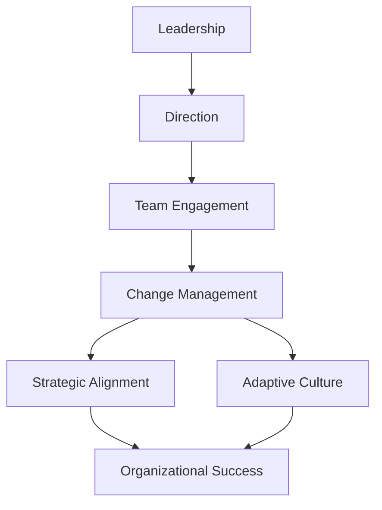

                 

## Title: Leadership and Change Management: Leading Teams Forward

### Keywords: Leadership, Change Management, Team Leadership, Team Transition, Organizational Change

#### Abstract:
In a fast-paced digital age, the ability to lead and manage change is crucial for organizational success. This article delves into the core themes of leadership and change management, presenting a comprehensive guide for leaders aiming to guide their teams through transformative periods. We will explore the foundational concepts of leadership, the principles of change management, and how these two disciplines can be synergized to lead teams effectively. Practical strategies, real-world case studies, and the development of leadership and change management competencies will be discussed, offering valuable insights and actionable advice for leaders at all levels.

### Introduction: The Importance of Leadership and Change Management

In the ever-evolving landscape of business and technology, the role of leaders has become increasingly pivotal. Effective leadership is not just about guiding teams to achieve goals but also about navigating them through periods of change. Organizations are constantly faced with the need to adapt to new market conditions, technological advancements, and shifting customer expectations. This is where change management comes into play.

### Core Concepts and Their Relationship

To understand the synergy between leadership and change management, let's visualize the relationship using a Mermaid flowchart:

In this diagram, leadership sets the direction and fosters team engagement, which then interfaces with change management. Strategic alignment and an adaptive culture are essential for ensuring that the organization can effectively manage and leverage change, ultimately leading to success.

### Chapter 1: Leadership Fundamentals

#### 1.1 Leadership Definitions and Theories

Leadership can be defined as the process of influencing, motivating, and enabling others to work towards achieving a common goal. Various leadership theories exist, each offering a unique perspective on what it means to be an effective leader.

**- Transformational Leadership:** This theory emphasizes the role of leaders in inspiring and transforming their followers. Transformational leaders are visionaries who articulate a clear vision and inspire others to embrace and work towards it.

**- Situational Leadership:** This theory posits that effective leadership depends on the situation at hand. Leaders must adapt their leadership style to match the needs of their team and the demands of the situation.

#### 1.2 Core Leadership Skills

Effective leadership requires a set of core skills. These include:

- **Communication:** Leaders must be able to clearly articulate their vision, provide constructive feedback, and actively listen to their team members.
- **Decision-making:** Leaders need to make informed, timely decisions that align with the organization's goals and values.
- **Problem-solving:** The ability to identify and address challenges is critical for leaders. This involves analyzing problems, generating solutions, and implementing effective strategies.

#### 1.3 Leadership Styles

Different leadership styles can be effective in different situations. Here are some common leadership styles:

- **Autocratic:** Leaders make decisions without input from others. This style can be effective in urgent situations or when clear direction is needed.
- **Democratic:** Leaders involve team members in decision-making processes. This style promotes collaboration and a sense of ownership among team members.

### Chapter 2: Change Management Basics

#### 2.1 Change Management Principles

Change management is the process of planning, implementing, and managing changes within an organization to meet strategic objectives. Key principles include:

- **Involving stakeholders:** Ensuring that all relevant stakeholders are involved in the change process helps to build support and address concerns.
- **Communication:** Clear and consistent communication is crucial for managing change effectively. This includes sharing the reasons for change, the expected benefits, and the steps involved.
- **Managing resistance:** Change can be met with resistance. Leaders must understand the root causes of resistance and develop strategies to address it.

#### 2.2 Change Management Models

Several models exist for managing change, each offering a structured approach to navigating organizational transformation. Some popular models include:

- **Kotter's Eight-Step Process:** A widely recognized framework that includes creating a sense of urgency, building a guiding coalition, and engaging and empowering employees.
- **ADKAR Model:** A five-step model that focuses on awareness, desire, knowledge, ability, and reinforcement.

#### 2.3 The Impact of Change on Teams

Change can have a significant impact on teams. It may lead to increased stress, uncertainty, and resistance. Leaders must be prepared to address these challenges and support their teams through the transition.

### Chapter 3: The Synergy of Leadership and Change Management

#### 3.1 Integrating Leadership with Change Initiatives

Effective leaders understand that leading change requires a blend of strategic vision and practical execution. They integrate leadership principles into change management processes to guide their teams through transitions successfully.

#### 3.2 Aligning Leadership with Change Management Strategies

Leaders must align their leadership strategies with change management initiatives to ensure that the organization's goals are met. This involves setting a clear vision, fostering an adaptive culture, and providing the necessary support and resources.

#### 3.3 Case Studies Illustrating the Synergy

Case studies of organizations that have successfully integrated leadership and change management will be presented to highlight best practices and provide practical insights.

### Chapter 4: Developing Leadership and Change Management Competencies

#### 4.1 Skills Development for Effective Leadership

Leaders must continuously develop their skills to effectively navigate change. This includes enhancing communication, decision-making, and problem-solving abilities.

#### 4.2 Strategies for Fostering a Change-Ready Mindset

Building a change-ready mindset requires strategies such as promoting a growth culture, encouraging innovation, and providing opportunities for continuous learning.

#### 4.3 Training and Development Programs

Organizations can implement training and development programs to build leadership and change management competencies. These programs may include workshops, coaching, and mentorship.

### Chapter 5: Practical Strategies for Leading Change

#### 5.1 Overcoming Resistance

Resistance to change is a common challenge. Leaders must understand the root causes of resistance and develop strategies to address them. This includes effective communication, involvement of stakeholders, and addressing concerns.

#### 5.2 Engaging and Empowering Teams

Engaging and empowering teams is crucial for successful change implementation. Leaders must involve their teams in the change process, provide them with the necessary resources, and support their development.

#### 5.3 Aligning Incentives

Aligning incentives with organizational goals can help drive change. Leaders must ensure that rewards and recognition systems support the desired behaviors and outcomes.

### Chapter 6: Leadership and Change Management Challenges and Solutions

#### 6.1 Common Challenges

Leaders may face common challenges such as resistance to change, lack of resources, and uncertainty. Understanding these challenges is crucial for developing effective solutions.

#### 6.2 Solutions

Solutions to common challenges include building a strong leadership coalition, leveraging technology, and fostering a culture of innovation.

### Chapter 7: Case Studies

#### 7.1 Case Study 1: A Technology Company's Digital Transformation

A case study of a technology company's successful digital transformation will be presented to highlight the role of leadership and change management in navigating complex transitions.

#### 7.2 Case Study 2: A Healthcare Organization's Agile Transformation

A case study of a healthcare organization's agile transformation will be discussed to demonstrate how leadership and change management principles can be applied in diverse industries.

### Chapter 8: Leadership and Change Management Tools and Methods

#### 8.1 Tools for Leading Change

Various tools and methods can support effective leadership and change management. These include project management tools, communication platforms, and performance management systems.

#### 8.2 Methods for Managing Change

Change management methods such as Kotter's Eight-Step Process and the ADKAR Model will be explored in detail.

### Chapter 9: Leadership and Change Management in a Digital Age

#### 9.1 The Impact of Digital Transformation

The impact of digital transformation on leadership and change management will be examined. Leaders must adapt their strategies to leverage digital tools and technologies.

#### 9.2 Navigating the Digital Landscape

Strategies for navigating the digital landscape will be discussed, including the importance of agility, innovation, and continuous learning.

### Chapter 10: Leadership and Change Management in a Remote Work Environment

#### 10.1 The Challenges of Remote Leadership

The challenges of leading remote teams will be explored, including communication barriers and maintaining team cohesion.

#### 10.2 Strategies for Effective Remote Leadership

Strategies for effective remote leadership will be presented, such as leveraging technology for communication and fostering a sense of community.

### Chapter 11: Leadership and Change Management for the Future

#### 11.1 The Future of Work

The future of work will be discussed, including trends such as automation, artificial intelligence, and remote work. Leaders must be prepared to navigate these changes.

#### 11.2 Future-Proofing Leadership

Leaders must continuously evolve their skills and strategies to lead effectively in an uncertain future. This involves fostering adaptability, resilience, and a growth mindset.

### Conclusion

In conclusion, effective leadership and change management are essential for navigating the complexities of today's business environment. Leaders must understand the interplay between leadership principles and change management practices to guide their teams through transformative periods successfully. By developing their competencies, leveraging tools and methods, and learning from real-world case studies, leaders can become adept at leading change and driving organizational success.

### Appendix

- **Appendix A: Leadership and Change Management Theories**
  - Transformational Leadership
  - Situational Leadership
  - Kotter's Eight-Step Process
  - ADKAR Model

- **Appendix B: Key Terms in Leadership and Change Management**
  - Leadership
  - Change Management
  - Resistance
  - Stakeholder Involvement

- **Appendix C: Practical Tools and Resources**
  - Project management tools
  - Communication platforms
  - Change management software

### About the Author

**作者：AI天才研究院/AI Genius Institute & 禅与计算机程序设计艺术 /Zen And The Art of Computer Programming**

作者介绍：AI天才研究院致力于推动人工智能技术的发展和应用，培养新一代的人工智能专家。同时，作者也是《禅与计算机程序设计艺术》的资深大师，精通计算机编程和人工智能领域，拥有丰富的教学和研究经验。在这篇文章中，作者结合领导力与变革管理的核心概念，为广大IT领导者提供了一套全面实用的策略和思路，帮助他们在不断变化的环境中引领团队取得成功。

### References

1. Kotter, J. P. (1996). Leading Change. Harvard Business Press.
2. Hersey, P., & Blanchard, K. H. (1982). Management of Organizational Change. Gulf Publishing Company.
3. Bell, S. (2013). Leading Change in Challenging Times. Jossey-Bass.
4. Hamel, G., & Prusak, L. (2001). The Future of Leadership. Harvard Business Review.
5. Beer, M., Spector, B., & Yesalonia, P. (2010). Change Management: The People Side of Change. John Wiley & Sons.

