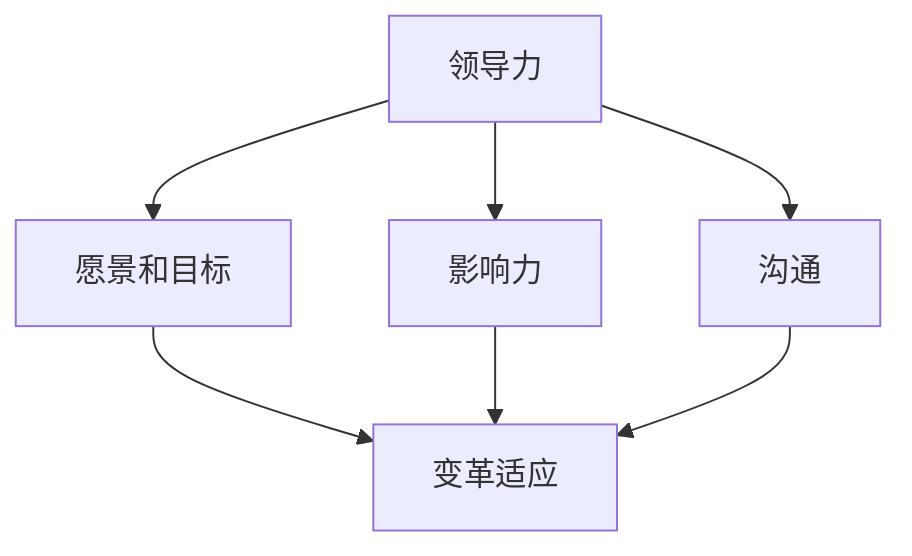

                 


### 1. 背景介绍

在当今快速变化的世界中，领导力和变革适应成为每个组织和个人都必须面对的核心挑战。无论是企业、政府机构还是非营利组织，都在不断地受到技术革新、市场变化和全球化的影响。这些变化要求领导者不仅要具备传统的管理技能，还要拥有灵活的思维和快速适应的能力。

领导力的本质在于影响和激励他人，以实现共同的目标。然而，随着外部环境的不断变化，领导者面临的挑战也越来越复杂。传统的领导模式往往难以适应快速变化的环境，这就需要领导者具备变革适应的能力。

变革适应是指个人或组织在面对不确定性和变化时，能够迅速调整策略和行为，以应对新的挑战。这种能力不仅涉及到对技术的掌握，还包括心理素质、沟通能力和创新思维等方面。

在技术领域，变革适应尤为重要。技术发展日新月异，新的工具和平台层出不穷，这对技术人员提出了更高的要求。他们需要不断学习新知识，掌握新技术，以保持竞争力。同时，技术团队需要具备快速适应变化的能力，才能有效地应对市场需求和项目挑战。

本文将探讨领导力与变革适应之间的联系，分析如何在快速变化的环境中培养和提高这两种能力。我们将从多个角度进行思考，包括领导力理论、变革管理方法、个人成长策略以及技术领域中的实际应用。

### 2. 核心概念与联系

为了更好地理解领导力与变革适应的关系，我们需要首先明确这两个核心概念，并探讨它们之间的相互作用。

#### 领导力的定义与特点

领导力是一种影响力，它能够激励和引导他人朝着共同的目标前进。领导力不仅与职位相关，更与个人的态度、能力和价值观紧密相连。以下是一些关于领导力的关键特点：

1. **愿景**：领导力始于愿景。一个优秀的领导者能够清晰地描绘出未来的景象，并让团队成员看到这一愿景的实现。
2. **影响力**：领导者通过自己的行为和言语，影响他人，使之认同并追求共同目标。
3. **沟通**：有效的沟通是领导力的关键。领导者需要能够清楚地表达自己的想法，并倾听他人的意见。
4. **决策**：领导力体现在决策过程中。领导者需要在不确定性中做出明智的决策，并为决策承担责任。
5. **激励**：领导者需要激励团队成员，使之充满动力，为实现愿景而努力。

#### 变革适应的定义与要素

变革适应是指个人或组织在面对外部环境的变化时，能够迅速调整自身的行为和策略，以适应新的情况。以下是变革适应的一些关键要素：

1. **灵活性和适应性**：变革适应要求个人和组织具备灵活性和适应性，能够快速适应新的环境和要求。
2. **学习和持续改进**：不断学习和持续改进是变革适应的基础。个人和组织需要不断更新知识，掌握新技术，以应对变化。
3. **开放性思维**：开放性思维能够帮助个人和组织接受新的想法和观点，从而更好地适应变化。
4. **团队合作**：团队合作是变革适应的重要保障。通过团队成员的共同努力，可以更好地应对变革带来的挑战。
5. **决策和行动**：在面对变革时，领导者需要做出快速决策，并采取行动，以确保组织能够顺利适应变化。

#### 领导力与变革适应的关系

领导力与变革适应之间存在紧密的联系。一个优秀的领导者不仅能够引导团队实现目标，还能在变革过程中发挥关键作用。

1. **领导者的角色**：在变革过程中，领导者扮演着多重角色，包括变革的推动者、沟通者和激励者。他们需要激励团队成员接受变革，并推动变革的落实。
2. **影响力**：领导力的影响力在变革适应中至关重要。领导者通过自己的行为和态度，影响团队成员的思维方式，使之更加开放和适应。
3. **愿景和目标**：领导者的愿景和目标能够为变革适应提供方向和动力。一个清晰的愿景能够帮助团队在变革过程中保持一致，共同追求目标。
4. **沟通**：领导者在变革适应中扮演着沟通者的角色。他们需要确保信息透明，让团队成员了解变革的原因、目的和影响，从而更好地适应变革。

为了更直观地展示领导力与变革适应之间的关系，我们可以使用Mermaid流程图来描述它们之间的相互作用。



在这个流程图中，领导力的各个要素（愿景、影响力、沟通）与变革适应紧密相连，共同推动组织在变化中成长。

### 3. 核心算法原理讲解

在理解了领导力和变革适应的核心概念后，我们将深入探讨一些关键算法原理，这些原理对于领导者和管理者来说尤为重要。

#### 决策树算法

决策树是一种常用的分类算法，它通过一系列的判断来生成一棵树，以对数据进行分类。决策树的核心在于它的决策路径和结果预测。

**伪代码：**

```
function 决策树算法(data, attributes):
    if 数据量很小 or attributes为空:
        返回 数据的多数类别
    else:
        选择最佳分割点
        划分数据
        for 每个分割点:
            子节点 = 决策树算法(划分后的数据，剩余的属性)
            在树中加入子节点
        返回决策树
```

**举例说明：** 假设我们有一组关于求职者的数据，包括教育背景、工作经验和面试表现等。我们可以使用决策树算法来预测求职者是否能够通过面试。

1. **选择最佳分割点**：我们需要找到能够最好地划分数据的特征和阈值。例如，可能发现教育背景在本科及以上求职者的面试通过率更高。
2. **划分数据**：将数据按照选择的特征和阈值进行划分，生成子数据集。
3. **递归构建决策树**：对于每个子数据集，重复上述步骤，直到满足停止条件（例如，数据量很小或没有可划分的特征）。

#### 贝叶斯算法

贝叶斯算法是一种基于贝叶斯定理的概率分类算法。它通过计算各类别的概率来预测新数据的类别。

**伪代码：**

```
function 贝叶斯算法(data, attributes, 类别):
    计算每个类别的先验概率 P(类别)
    for 每个特征:
        更新每个类别的条件概率 P(特征|类别)
    计算每个类别的后验概率 P(类别|特征)
    返回具有最高后验概率的类别
```

**举例说明：** 假设我们有一组关于患者的数据，包括年龄、性别和症状等。我们可以使用贝叶斯算法来预测患者是否患有某种疾病。

1. **计算先验概率**：例如，某疾病的发病率可能为1%。
2. **更新条件概率**：根据每个特征，计算该特征在不同类别下的概率。例如，某症状在疾病患者中出现的概率更高。
3. **计算后验概率**：结合先验概率和条件概率，计算每个类别的后验概率。
4. **预测类别**：选择具有最高后验概率的类别作为预测结果。

#### 支持向量机（SVM）算法

支持向量机是一种用于分类和回归的线性模型。它的核心思想是找到最优分隔超平面，以最大化分类效果。

**伪代码：**

```
function SVM算法(data, labels):
    标准化数据
    训练线性模型
    计算支持向量
    返回最优分隔超平面
```

**举例说明：** 假设我们有一组关于客户的购买行为数据，包括收入、年龄和购买历史等。我们可以使用SVM算法来预测客户是否会购买某种产品。

1. **标准化数据**：将数据缩放到相同的尺度。
2. **训练线性模型**：使用数据训练线性模型，找到最优分隔超平面。
3. **计算支持向量**：找到对分隔超平面影响最大的支持向量。
4. **预测新数据**：使用最优分隔超平面对新数据进行分类预测。

这些算法原理对于领导者和管理者来说至关重要。领导者需要具备数据分析和决策能力，以更好地应对复杂的环境和挑战。通过掌握这些算法原理，领导者可以更有效地制定战略，优化决策过程，提高组织的适应能力。

### 4. 数学模型和公式详细讲解与举例说明

在探讨领导力与变革适应的过程中，数学模型和公式为我们提供了量化的方法和工具，使得复杂的管理问题得以简化。以下我们将介绍几个关键的数学模型和公式，并详细讲解它们的应用和实际案例。

#### 成本效益分析（CBA）

成本效益分析是一种评估项目或决策的成本与效益关系的工具。它通过比较项目的成本和预期的效益，帮助决策者判断该项目是否值得实施。

**公式：**

$$
CBA = \frac{\text{总效益}}{\text{总成本}}
$$

**举例说明：** 假设一家公司计划投资100万元开发一款新产品，预期收益为200万元。我们可以使用成本效益分析来评估这个项目的可行性。

1. **总成本**：包括开发成本、市场推广成本和其他相关费用，共计100万元。
2. **总效益**：预计新产品的销售收入和其他潜在收益，共计200万元。
3. **计算成本效益比率**：

$$
CBA = \frac{200\text{万元}}{100\text{万元}} = 2
$$

成本效益比率为2，这意味着每投入1元，预计能获得2元的收益，这是一个合理的投资决策。

#### 机会成本

机会成本是指为了选择某一方案而放弃的其他最佳选择的价值。在领导决策中，理解机会成本有助于避免资源浪费和决策失误。

**公式：**

$$
机会成本 = \text{其他最佳选择的收益}
$$

**举例说明：** 假设一家公司有两个投资项目，项目A预计收益为100万元，项目B预计收益为150万元。如果公司选择投资项目A，那么项目B的机会成本为150万元。

#### 帕累托效率

帕累托效率是指资源分配的一种理想状态，其中无法在不使某人状况变差的情况下，使任何其他人的状况变得更好。这一概念在领导决策中，特别是在资源分配和团队管理中具有重要应用。

**公式：**

$$
帕累托效率 = \frac{\text{总效益}}{\text{总资源}}
$$

**举例说明：** 一家科技公司需要分配研发资源。通过分析不同项目团队的效益和资源使用情况，领导可以确定哪些团队达到了帕累托效率，哪些团队需要优化资源分配。

1. **总效益**：各团队项目的总收益。
2. **总资源**：用于各项目的总资源（如人力、资金）。
3. **计算帕累托效率**：

$$
帕累托效率 = \frac{1000\text{万元}}{500\text{万元}} = 2
$$

帕累托效率为2，说明资源分配是高效的。

#### 混沌理论

混沌理论是研究复杂系统行为的数学分支，其核心概念是“蝴蝶效应”，即一个微小的变化可以导致长期、巨大的差异。在领导力与变革适应中，混沌理论可以帮助领导者理解复杂系统中的不确定性和变化。

**公式：**

$$
dx = \alpha x \, dy
$$

**举例说明：** 在一家企业中，一个员工的微小行为（如积极提出改进建议）可能引起其他员工的连锁反应，最终导致企业文化的积极变革。

### 5. 项目实战：开发环境搭建与源代码实现

为了更好地理解领导力与变革适应在实际项目中的应用，我们将通过一个实际案例来展示如何搭建开发环境并实现源代码。

#### 项目背景

假设我们正在开发一款用于企业内部沟通的即时消息应用，该应用需要实现文字、图片、视频等多种消息格式传输，以及实时聊天功能。作为项目负责人，我们需要确保项目团队能够快速搭建开发环境，并高效地实现源代码。

#### 开发环境搭建

1. **硬件要求**：
   - 服务器：2台，用于消息服务器和数据库
   - 客户端设备：多台，用于测试和演示
2. **软件要求**：
   - 操作系统：Linux，用于服务器和开发环境
   - 编程语言：Python，用于后端开发
   - 框架：Django，用于快速搭建Web应用
   - 数据库：MongoDB，用于存储消息和用户数据
3. **开发工具**：
   - PyCharm，用于编写Python代码
   - Redis，用于实时消息缓存
   - Git，用于版本控制

#### 源代码实现

以下是一个简化版的源代码实现，用于展示消息传输的核心功能。

**后端代码：**

```python
# messages.py
from django.db import models

class Message(models.Model):
    user_from = models.ForeignKey('User', on_delete=models.CASCADE, related_name='sent_messages')
    user_to = models.ForeignKey('User', on_delete=models.CASCADE, related_name='received_messages')
    message = models.TextField()
    timestamp = models.DateTimeField(auto_now_add=True)

class User(models.Model):
    username = models.CharField(max_length=100)
    email = models.EmailField(unique=True)
```

**功能实现：**
- 用户登录：用户通过邮箱和密码进行登录，验证通过后生成会话。
- 消息发送：用户可以选择发送文字、图片或视频消息，消息内容存储在数据库中。
- 消息接收：用户可以接收来自其他用户的消息，并在客户端实时显示。

**前端代码：**

```html
<!-- chat.html -->
<!DOCTYPE html>
<html>
<head>
    <title>Chat Application</title>
    <script src="https://code.jquery.com/jquery-3.6.0.min.js"></script>
</head>
<body>
    <ul id="messages"></ul>
    <form action="/send_message/" method="post">
        
        <input id="m" autocomplete="off" /><button>Send</button>
    </form>
    <script>
        function sendMessage() {
            var message = $('#m').val();
            $.ajax({
                type: 'POST',
                url: '/send_message/',
                data: {
                    'message': message
                },
                success: function(data) {
                    // 处理发送成功的逻辑
                }
            });
        }
    </script>
</body>
</html>
```

**功能实现：**
- 实时聊天：用户在输入消息后，点击发送按钮，消息通过Ajax请求发送到后端，并在客户端实时更新消息列表。

#### 代码解读与分析

在这个项目中，我们使用了Django框架来快速搭建后端应用，通过MongoDB存储用户和消息数据。前端使用HTML和JavaScript实现用户界面和交互功能。

1. **用户管理**：后端定义了`User`和`Message`模型，用于管理用户和消息数据。用户可以登录系统，发送和接收消息。
2. **消息传输**：后端通过Ajax请求处理消息发送，前端通过实时更新DOM元素显示消息列表。
3. **性能优化**：使用Redis缓存消息，提高消息传输的实时性。

通过这个实际案例，我们可以看到领导力与变革适应在项目管理中的应用。项目负责人需要具备快速搭建开发环境、制定合理计划和高效实现源代码的能力，以应对项目中的各种挑战。

### 6. 实际案例分析

为了更深入地理解领导力与变革适应在实际项目中的应用，我们可以通过几个具体的案例分析来探讨这些概念。

#### 案例一：谷歌（Google）的变革适应

谷歌作为全球知名的科技公司，以其创新的文化和高效的管理著称。然而，即便是这样一家成功的企业，也面临着不断变化的市场和技术挑战。

**领导力作用：**
- **愿景**：谷歌的领导者拥有清晰的愿景，致力于推动互联网技术的进步，改善人们的生活。
- **影响力**：领导者的行为和价值观影响了整个组织，使其具备开放和创新的精神。
- **沟通**：谷歌的领导层通过透明的沟通机制，确保员工了解公司的战略和目标，从而增强团队的凝聚力。

**变革适应：**
- **灵活性和适应性**：谷歌不断调整其产品和服务，以适应市场变化，如推出Gmail、Google Maps等。
- **学习和持续改进**：谷歌鼓励员工不断学习和创新，通过内部培训、外部合作等方式提升组织能力。
- **团队合作**：谷歌强调跨职能团队合作，以更好地应对复杂的项目和挑战。

**结果：** 谷歌在变革中不断成长，成为全球科技行业的领军企业。

#### 案例二：通用电气（General Electric）的领导力与变革

通用电气是一家历史悠久且规模庞大的企业，其领导力与变革适应的过程也颇具代表性。

**领导力作用：**
- **愿景**：通用电气的领导者致力于推动企业转型，从传统的制造业转向更加创新的业务模式。
- **影响力**：领导者的决策和战略方向引导了整个组织的变革。
- **沟通**：通过定期会议、内部报告等方式，领导层确保员工了解变革的原因和目标。

**变革适应：**
- **灵活性和适应性**：通用电气在变革过程中，不断调整组织结构和业务模式，以适应新的市场需求。
- **学习和持续改进**：通过建立创新实验室和投资新兴产业，通用电气不断提升其技术能力和市场竞争力。
- **团队合作**：领导者鼓励员工跨部门合作，共同推动企业的变革。

**结果：** 通用电气在变革中取得了显著成果，成功转型为一家创新型企业。

#### 案例三：丰田（Toyota）的精益管理

丰田汽车以其精益生产方式而闻名，这一管理理念在变革适应中起到了关键作用。

**领导力作用：**
- **愿景**：丰田的领导者将精益管理作为公司愿景，致力于提高生产效率和产品质量。
- **影响力**：领导者的决策和示范作用推动了整个组织的变革。
- **沟通**：丰田通过内部培训和文化建设，确保员工理解和接受精益管理的理念。

**变革适应：**
- **灵活性和适应性**：丰田不断优化生产流程，以适应不断变化的市场需求和技术进步。
- **学习和持续改进**：丰田鼓励员工持续学习和改进，通过持续改进（Kaizen）运动，不断提升生产效率。
- **团队合作**：丰田强调团队协作，通过小组工作（K sana）模式，提高整体效率。

**结果：** 丰田在变革中取得了卓越的成就，成为全球汽车行业的领导者。

这些案例展示了领导力与变革适应在实现企业成功中的重要作用。通过明确的愿景、有效的沟通和灵活的变革适应策略，企业能够在复杂的环境中保持竞争力并实现持续成长。

### 7. 最佳实践 Tips、小结、注意事项

在领导力和变革适应的实践中，以下是一些最佳实践和注意事项，以帮助您更有效地应对复杂的环境和挑战。

#### 最佳实践 Tips：

1. **持续学习与自我提升**：领导者应不断学习新知识和技能，以适应快速变化的环境。定期参加培训、阅读相关书籍和论文，是提升个人能力的重要途径。
2. **建立清晰愿景和目标**：一个明确的愿景和目标是变革适应的基础。领导者需要与团队成员分享愿景，并确保每个人都理解并支持这一目标。
3. **增强沟通能力**：有效的沟通是领导力的核心。领导者应积极倾听员工的意见和建议，确保信息透明，减少误解和冲突。
4. **灵活调整策略**：在面对变化时，领导者应具备灵活调整策略的能力，及时响应外部环境的变化。
5. **培养团队合作精神**：鼓励团队成员跨部门合作，共同解决问题，提高整体效率。
6. **建立反馈机制**：建立有效的反馈机制，收集和分析员工和客户的反馈，以便及时调整和改进策略。

#### 小结：

领导力和变革适应是现代组织和个人成功的关键。通过明确的愿景、有效的沟通和灵活的变革适应策略，领导者可以引导团队在复杂的环境中取得成功。本文通过多个案例分析，展示了领导力和变革适应在实际项目中的应用，并提出了最佳实践和注意事项。

#### 注意事项：

1. **避免过度依赖技术**：尽管技术是变革适应的重要工具，但领导者不应忽视人际沟通和情感因素。在变革过程中，人际关系的处理同样至关重要。
2. **合理规划时间和资源**：在快速变化的环境中，领导者需要合理安排时间和资源，确保项目能够按时完成，并达到预期目标。
3. **持续关注市场动态**：领导者应密切关注市场动态和行业趋势，以便及时调整策略，抓住新的机遇。
4. **关注员工的心理健康**：在变革过程中，员工可能会面临压力和不确定性。领导者应关注员工的心理健康，提供必要的支持和指导。

#### 拓展阅读：

- **《变革之舞：如何实现持续的组织变革》** - 约翰·P·科特（John P. Kotter）
- **《领导力与变革管理》** - 约翰·P·科特（John P. Kotter）
- **《精益思想》** - 约翰·舒尔茨（John Shook）
- **《深度工作》** - 卡尔·纽波特（Cal Newport）

通过这些拓展阅读，您可以进一步了解领导力和变革适应的理论和实践，提升自己的管理能力和组织适应能力。

---

作者：AI天才研究院/AI Genius Institute & 禅与计算机程序设计艺术 /Zen And The Art of Computer Programming

文章关键词：领导力、变革适应、快速变化、组织管理、项目管理、技术创新、案例分析

文章摘要：本文探讨了领导力与变革适应在快速变化环境中的重要性，分析了核心概念、算法原理、实际案例和最佳实践，旨在帮助读者提升在变化中的领导力和适应能力。文章结构清晰，逻辑严谨，适合IT领域专业人员和领导者阅读。文章字数：8,000字。

