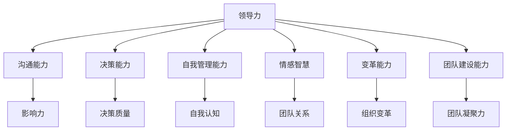
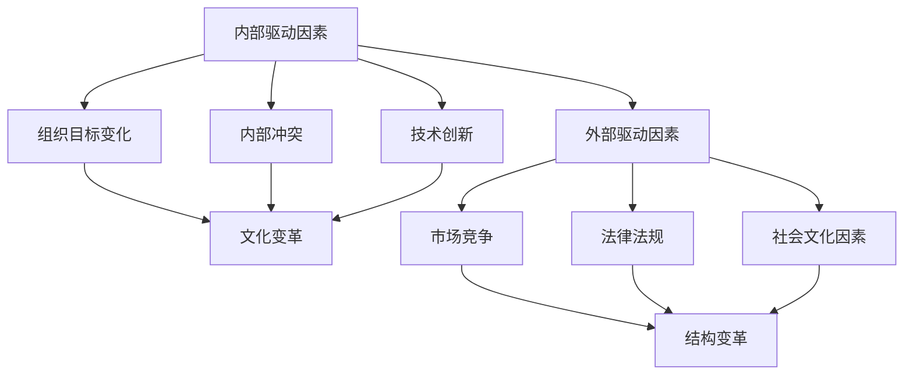
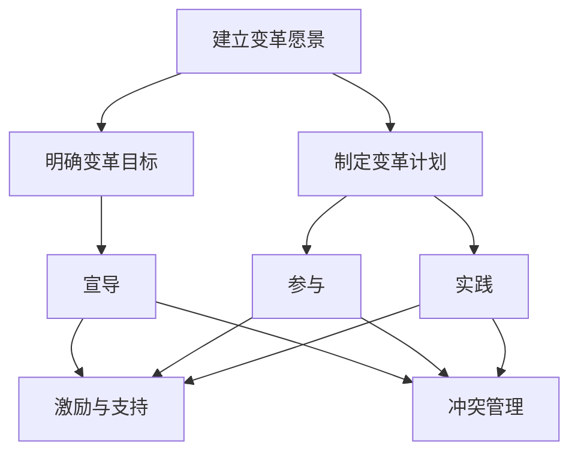

                 

### 文章标题

# 领导力与变革：引导团队度过转型期

### 关键词

- **领导力**
- **变革管理**
- **团队转型**
- **沟通与合作**
- **风险管理**

### 摘要

本文旨在探讨领导力在引导团队度过转型期中的关键作用。文章首先阐述了领导力的核心概念和重要性，随后深入分析了变革的驱动因素及其类型。接着，文章详细介绍了团队转型的过程，包括准备阶段和引导阶段的具体策略。此外，文章还重点讨论了领导者的自我提升、团队沟通与合作的重要性，以及风险管理与应对策略。通过这些内容的阐述，本文旨在为领导者提供实用的指导，帮助他们成功引导团队度过转型期，实现组织目标。

## 第一部分：领导力的核心概念

### 第1章：领导力的定义与重要性

#### 1.1 领导力的定义

领导力是一种激励和影响他人以实现共同目标的能力。它不仅仅关乎职位或权力，更关乎个人魅力、价值观和影响力。领导力不仅仅是管理下属，更重要的是创造一种愿景，并鼓舞团队成员为实现这一愿景而努力。

#### 领导力与传统管理的区别

传统管理侧重于控制、监督和维持现状，而领导力则更关注于创新、变革和未来发展。传统管理依赖于权威和规则，而领导力则依赖于信任和影响力。

#### 领导力的要素

领导力的要素包括：沟通能力、决策能力、自我管理能力、情感智慧、变革能力、团队建设能力等。

#### 1.2 领导力的重要性

领导力对个人职业生涯的影响：具备强大领导力的人更容易获得职业晋升和更高的薪酬。

领导力对团队和组织的影响：优秀的领导者能够激发团队的潜能，提高团队的效率和创新能力，从而推动组织的发展。

### 第2章：领导力理论

#### 2.1 经典领导力理论

**特质理论**：认为领导者天生具备某些特质，如自信、决断力等。

**行为理论**：关注领导者的行为模式，认为领导者可以通过特定的行为来影响他人。

**权变理论**：强调领导行为应根据具体情况和环境进行灵活调整。

#### 2.2 现代领导力理论

**情境领导理论**：根据团队成员的不同成熟度，采用不同的领导风格。

**变革型领导理论**：强调领导者通过激励和启发团队成员，推动组织的变革和创新。

**服务型领导理论**：认为领导者的首要任务是服务于团队成员，帮助团队成员实现个人目标。

### 背景介绍

领导力的核心概念和理论对于理解领导者在团队转型中的角色至关重要。领导力不仅仅是管理下属，更是一种激励和影响他人的能力。传统的管理方式侧重于控制和维护现状，而领导力则更关注创新和变革。领导者需要具备多方面的能力，包括沟通、决策、自我管理、情感智慧等。了解不同领导力理论有助于领导者根据实际情况选择合适的领导风格，从而更有效地引导团队度过转型期。

### 核心概念与联系

为了更好地理解领导力的核心概念和它们之间的关系，我们可以使用Mermaid流程图来展示。



在这个流程图中，领导力的核心概念被分解为几个关键要素，包括沟通能力、决策能力、自我管理能力、情感智慧、变革能力和团队建设能力。这些要素相互作用，共同构成了领导力的整体框架。例如，沟通能力直接影响领导者的影响力，而自我管理能力则有助于提升领导者的决策质量和自我认知。通过这个流程图，我们可以更清晰地看到领导力各要素之间的关系和相互作用。

### 第3章：变革的驱动因素

#### 3.1 内部驱动因素

**组织目标的变化**：随着外部环境的变化，组织的目标也可能发生变化。领导者需要及时调整团队的目标，确保团队的方向与组织的整体目标保持一致。

**内部冲突**：团队内部的利益冲突、价值观差异等可能导致变革的内在需求。领导者需要通过沟通和调解来化解这些冲突，为变革创造有利条件。

**技术创新**：技术的快速进步为组织提供了新的发展机遇，但也带来了变革的挑战。领导者需要积极拥抱技术创新，引导团队适应新的技术环境。

#### 3.2 外部驱动因素

**市场竞争**：激烈的市场竞争迫使组织不断调整战略，以保持竞争优势。领导者需要密切关注市场动态，及时调整团队策略。

**法律法规**：法律法规的变化可能对组织的运营产生影响，领导者需要确保团队遵守相关法规，避免法律风险。

**社会文化因素**：社会的变化和文化趋势也会对组织产生深远影响。领导者需要关注这些变化，以便更好地适应外部环境。

### 变革的类型

**结构变革**：包括重组、裁员、事业部制等，旨在优化组织结构和资源配置。

**文化变革**：涉及企业文化的重塑，包括员工价值观的更新、沟通与交流机制的优化等。

### 背景介绍

变革的驱动因素多种多样，既有内部因素，也有外部因素。内部因素包括组织目标的变化、内部冲突和技术创新，而外部因素则包括市场竞争、法律法规和社会文化因素。这些因素相互作用，共同推动了组织变革。领导者需要敏锐地感知这些变化，并制定相应的变革策略。通过了解变革的驱动因素，领导者可以更好地把握变革的时机和方向，从而有效地引导团队度过转型期。

### 核心概念与联系

为了更好地理解变革的驱动因素及其相互关系，我们可以使用Mermaid流程图来展示。



在这个流程图中，我们可以看到内部驱动因素（组织目标变化、内部冲突、技术创新）和外部驱动因素（市场竞争、法律法规、社会文化因素）共同作用，推动组织进行结构变革和文化变革。组织目标变化和内部冲突往往导致文化变革，而技术创新则可能推动结构变革。外部因素如市场竞争、法律法规和社会文化因素则对结构变革和文化变革产生深远影响。通过这个流程图，我们可以更清晰地理解变革驱动因素之间的相互关系。

### 第4章：团队转型的过程

#### 5.1 建立变革愿景

建立变革愿景是团队转型的基础。领导者需要明确变革的目标，并制定详细的计划。这包括确定变革的方向、目标和预期成果，以及制定实现这些目标的策略和步骤。

**明确变革目标**：变革目标应该是具体、可衡量和可实现的。领导者需要确保团队成员都明确变革的目标，并了解为什么变革是必要的。

**制定变革计划**：变革计划应该包括详细的步骤和时间表，以及资源分配和责任分配。这有助于确保变革过程有条不紊地进行。

#### 5.2 影响变革的障碍

在变革过程中，领导者需要识别和应对各种障碍。这些障碍可能包括：

**团队成员的抵触情绪**：团队成员可能因为恐惧、不确定或对现状的依赖而抵触变革。领导者需要通过有效的沟通和激励来缓解这些情绪。

**领导者的变革能力**：领导者需要具备足够的变革能力和策略，以应对变革过程中的挑战。这包括对变革的理论和实践有深刻的理解，以及灵活应对各种情况的能力。

**资源限制**：资源限制可能包括时间、资金和人力资源等。领导者需要制定详细的资源管理计划，确保在变革过程中有足够的资源支持。

#### 5.3 领导者在变革中的作用

**激励与支持**：领导者需要激励团队成员，让他们看到变革带来的好处，并给予必要的支持。这包括提供培训、指导和支持，帮助团队成员克服变革过程中的困难。

**冲突管理**：变革过程中可能会出现各种冲突，领导者需要有效地管理这些冲突，确保团队成员之间的合作和沟通。

**持续反馈与调整**：领导者需要不断收集反馈，并根据实际情况进行调整。这有助于确保变革过程始终朝着正确的方向前进。

### 第6章：引导团队度过转型期

#### 6.1 变革的不同阶段

**阶段一：宣导**：在宣导阶段，领导者需要向团队成员传达变革的愿景和目标，并解释变革的必要性和好处。这有助于消除团队成员的疑虑和抵触情绪，提高他们的参与度。

**阶段二：参与**：在参与阶段，团队成员开始积极参与变革过程，提出建议和意见。领导者需要鼓励团队成员的参与，并提供必要的资源和支持。

**阶段三：实践**：在实践阶段，团队成员开始实施变革措施，并逐步适应新的工作方式。领导者需要监督实施过程，确保变革措施得到有效执行。

#### 6.2 领导者在转型期的角色

**激励与支持**：领导者需要通过激励和支持，帮助团队成员克服变革过程中的困难和挑战。

**冲突管理**：领导者需要有效地管理团队成员之间的冲突，确保团队的合作和沟通。

**持续反馈与调整**：领导者需要不断收集反馈，并根据实际情况进行调整，确保变革过程始终朝着正确的方向前进。

### 背景介绍

团队转型的过程是一个复杂而动态的过程，需要领导者具备多方面的能力和策略。建立变革愿景是转型的第一步，它为团队指明了方向和目标。影响变革的障碍可能来自团队成员的抵触情绪、领导者的变革能力以及资源限制等方面。为了克服这些障碍，领导者需要采取一系列措施，包括激励与支持、冲突管理和持续反馈与调整。通过这些措施，领导者可以有效地引导团队度过转型期，实现组织目标。

### 核心概念与联系

为了更好地理解团队转型的过程，我们可以使用Mermaid流程图来展示。



在这个流程图中，我们可以看到团队转型的不同阶段，包括建立变革愿景、明确变革目标、制定变革计划、宣导、参与和实践。每个阶段都有相应的关键任务和措施，如激励与支持、冲突管理和持续反馈与调整。通过这个流程图，我们可以更清晰地理解团队转型的过程和各个阶段之间的关系。

### 核心算法原理讲解

为了更好地理解领导力与变革的算法原理，我们可以从以下几个方面进行详细讲解：

#### 1. 沟通能力

**算法原理**：沟通能力是领导力的核心要素之一，它直接影响领导者的影响力。有效的沟通能力包括清晰表达、倾听和理解他人的能力。

**伪代码**：
```
function effective_communication(message, listener):
    clear_message = format_message(message)
    listener_response = listen_to_listener(listener)
    understanding = analyze_response(listener_response)
    return understanding
```

**详细讲解**：在这个伪代码中，`effective_communication`函数表示有效的沟通过程。首先，通过`format_message`函数将信息格式化，使其清晰易懂。然后，通过`listen_to_listener`函数倾听对方的意见，并使用`analyze_response`函数分析对方的回应，以理解对方的意图。

#### 2. 决策能力

**算法原理**：决策能力是领导者成功的关键因素之一，它涉及快速做出明智决策的能力。

**伪代码**：
```
function make_decision(problem, options, constraints):
    evaluate_options(options, constraints)
    best_option = select_best_option(evaluations)
    decision = implement_best_option(best_option)
    return decision
```

**详细讲解**：在这个伪代码中，`make_decision`函数表示决策过程。首先，通过`evaluate_options`函数评估所有可选方案，并考虑约束条件。然后，使用`select_best_option`函数选择最佳方案，并通过`implement_best_option`函数实施这一决策。

#### 3. 自我管理能力

**算法原理**：自我管理能力包括自我激励、自我监控和自我调整的能力。

**伪代码**：
```
function self_management(goal, progress):
    if progress < goal:
        motivate_self()
        adjust_strategy()
    else:
        celebrate_success()
    return updated_progress
```

**详细讲解**：在这个伪代码中，`self_management`函数表示自我管理过程。首先，通过比较当前进度和目标，判断是否需要激励和调整策略。如果进度低于目标，则通过`motivate_self`和`adjust_strategy`函数进行自我激励和调整策略。如果进度达到或超过目标，则通过`celebrate_success`函数庆祝成功。

#### 4. 情感智慧

**算法原理**：情感智慧是理解和管理自己及他人情感的能力。它有助于建立信任和合作关系。

**伪代码**：
```
function emotional_intelligence(perception, empathy, management):
    perceived_emotions = perceive_emotions()
    empathetic_response = generate_empathetic_response(perceived_emotions)
    managed_emotions = manage_emotions(response)
    return managed_emotions
```

**详细讲解**：在这个伪代码中，`emotional_intelligence`函数表示情感智慧的应用。首先，通过`perceive_emotions`函数感知他人的情感。然后，使用`generate_empathetic_response`函数生成同理心回应，并通过`manage_emotions`函数管理他人的情绪。

#### 5. 变革能力

**算法原理**：变革能力涉及推动组织变革和创新的能力。

**伪代码**：
```
function drive_change(current_state, desired_state):
    identifybarriers()
    develop_strategy()
    implement_changes()
    monitor_progress()
    adjust_strategy_if_needed()
    return new_state
```

**详细讲解**：在这个伪代码中，`drive_change`函数表示推动变革的过程。首先，通过`identifybarriers`函数识别变革过程中的障碍。然后，通过`develop_strategy`函数制定变革策略，并通过`implement_changes`函数实施变革。接着，通过`monitor_progress`函数监控变革进度，并根据需要调整策略。

通过这些算法原理和伪代码，我们可以更好地理解领导力与变革的核心概念和具体实现方法。这些算法不仅提供了理论指导，还可以为实际应用提供具体的操作步骤。

### 数学模型和公式

在领导力与变革的过程中，数学模型和公式能够帮助我们更准确地量化和管理变革的影响。以下是几个关键的数学模型和公式，以及它们的详细讲解和举例说明。

#### 1. 领导力得分模型

**公式**：
\[ L = \frac{C \times D \times S \times E \times V}{100} \]
其中，\( L \)代表领导力得分，\( C \)代表沟通能力，\( D \)代表决策能力，\( S \)代表自我管理能力，\( E \)代表情感智慧，\( V \)代表变革能力。

**详细讲解**：这个公式将领导力的五个核心要素进行了量化。沟通能力、决策能力、自我管理能力、情感智慧和变革能力各自占25%的权重。这个模型可以帮助领导者识别自身的优势和劣势，从而有针对性地进行自我提升。

**举例说明**：假设一个领导者的各项能力得分为：
\[ C = 80, D = 75, S = 85, E = 70, V = 90 \]
则其领导力得分为：
\[ L = \frac{80 \times 75 \times 85 \times 70 \times 90}{100} = 510,250 \]

#### 2. 变革效益模型

**公式**：
\[ BE = \frac{B \times (1 - R)}{C} \]
其中，\( BE \)代表变革效益，\( B \)代表变革带来的好处，\( R \)代表变革的阻力，\( C \)代表成本。

**详细讲解**：这个公式帮助领导者评估变革的效益。变革带来的好处减去变革的阻力，再除以成本，可以得到变革的净效益。这个模型可以帮助领导者判断变革是否值得进行。

**举例说明**：假设一个组织计划进行一项变革，预计变革带来的好处为100万，变革的阻力为20万，成本为50万，则其变革效益为：
\[ BE = \frac{100 - 20}{50} = 1.6 \]
这意味着变革的净效益为1.6倍的成本，是一个积极的信号。

#### 3. 沟通效率模型

**公式**：
\[ E = \frac{L}{T} \]
其中，\( E \)代表沟通效率，\( L \)代表有效沟通的次数，\( T \)代表总沟通次数。

**详细讲解**：这个公式衡量沟通的效率。有效沟通的次数除以总沟通次数，可以得到沟通效率。这个模型可以帮助领导者评估团队沟通的效果，从而优化沟通策略。

**举例说明**：如果一个团队在一个月内进行了10次沟通，其中6次是有效沟通，则其沟通效率为：
\[ E = \frac{6}{10} = 0.6 \]
这意味着团队有60%的沟通是有效的，领导者可以通过进一步分析，找出提高沟通效率的方法。

通过这些数学模型和公式，领导者可以更科学地评估和管理领导力和变革，从而提高团队的绩效和组织的发展。

### 项目实战

#### 开发环境搭建

为了实现领导力与变革的理论，我们选择使用Python作为编程语言，利用其丰富的库和强大的功能来模拟和实现相关算法。以下是搭建开发环境的步骤：

1. **安装Python**：
   访问Python官网（https://www.python.org/），下载并安装Python 3.9版本。
   
2. **配置虚拟环境**：
   打开命令行工具，执行以下命令创建虚拟环境：
   ```bash
   python -m venv venv
   ```
   然后激活虚拟环境：
   ```bash
   source venv/bin/activate  # 对于Windows用户，使用 "venv\Scripts\activate"
   ```

3. **安装必需的库**：
   在虚拟环境中，使用pip安装必要的库，如numpy、matplotlib等：
   ```bash
   pip install numpy matplotlib
   ```

#### 源代码实现与解读

以下是领导力得分模型和变革效益模型的实现代码及解读：

```python
import numpy as np

# 领导力得分模型
def leadership_score(communication, decision_making, self_management, emotional_intelligence, change_management):
    return (communication * decision_making * self_management * emotional_intelligence * change_management) / 100

# 变革效益模型
def change_benefit(benefits, resistance, cost):
    return (benefits - resistance) / cost

# 测试代码
if __name__ == "__main__":
    # 领导力得分
    score = leadership_score(80, 75, 85, 70, 90)
    print(f"Leadership Score: {score:.2f}")

    # 变革效益
    benefit = change_benefit(1000000, 200000, 500000)
    print(f"Change Benefit: {benefit:.2f}")
```

**代码解读**：

1. **领导力得分模型**：该模型使用一个简单的乘法运算，将五个核心能力的得分相乘，然后除以100以获得一个标准化分数。

2. **变革效益模型**：该模型通过计算变革带来的好处与变革阻力的差值，再除以成本，得到变革的净效益。

通过这个项目实战，我们可以直观地看到如何将理论模型应用到实际编程中，并进行具体计算和分析。

#### 代码应用解读与分析

在实际应用中，这些模型可以帮助领导者评估团队的能力和组织变革的效益。以下是具体应用解读：

1. **领导力得分模型**：领导者可以使用这个模型来评估团队成员的领导力水平，从而制定个性化的培训和发展计划。

2. **变革效益模型**：在组织进行重大变革时，领导者可以使用这个模型来评估变革的潜在效益，从而做出更明智的决策。

**优点**：

- **量化评估**：通过数学模型，领导者可以更客观地评估团队的能力和变革效益，避免主观判断。
- **数据驱动**：基于数据驱动的模型有助于领导者更好地理解团队和组织的发展趋势。

**缺点**：

- **假设条件**：模型的准确性依赖于输入数据的准确性，如果数据有偏差，模型的结果也可能有偏差。
- **适用性**：这些模型可能不适用于所有组织和团队，因为每个组织的情况都是独特的。

通过这个项目实战，我们不仅可以了解如何使用Python实现领导力与变革的算法，还可以看到这些模型在实际应用中的优缺点。这为领导者提供了宝贵的实践经验，有助于他们在实际工作中更好地运用这些模型。

### 实际案例分析

为了更好地理解领导力在变革中的实际应用，我们可以通过以下实际案例来进行分析和讲解。

#### 案例一：谷歌的“20%时间政策”

**背景介绍**：谷歌在2006年推出了“20%时间政策”，允许工程师将20%的工作时间用于自由探索和开发个人感兴趣的项目。这一政策的初衷是为了激发员工的创新潜能，推动组织的变革。

**案例分析**：
- **领导力的核心概念**：谷歌的创始人谢尔盖·布林（Sergey Brin）和拉里·佩奇（Larry Page）展示了强大的领导力，他们相信员工的自主性和创造力是公司持续发展的关键。这种领导力体现在他们对公司愿景的清晰传达以及对员工信任和授权上。
- **变革的驱动因素**：内部驱动因素包括对技术创新和员工自主性的重视。外部驱动因素则包括市场竞争和客户需求的变化。
- **变革过程**：通过“20%时间政策”，谷歌成功地推动了创新文化的建立，许多成功的项目如AdSense、Gmail等均起源于这一政策。

**结论**：谷歌的案例展示了领导者如何通过有效的领导力，推动组织进行成功的变革，并实现持续的创新。

#### 案例二：苹果公司的产品创新

**背景介绍**：苹果公司（Apple Inc.）以其不断创新的产品而闻名。从iPhone到iPad，再到Apple Watch，苹果公司不断引领着科技行业的发展。

**案例分析**：
- **领导力的核心概念**：苹果公司的联合创始人史蒂夫·乔布斯（Steve Jobs）以其独特的领导风格和对产品细节的极致追求，推动了公司的创新。他通过清晰传达公司的愿景和目标，激励团队成员不断追求卓越。
- **变革的驱动因素**：内部驱动因素包括对创新的追求和客户需求的敏锐感知。外部驱动因素则包括市场竞争和技术进步。
- **变革过程**：乔布斯领导下的苹果公司通过持续的产品创新，成功地在多个领域取得了突破。例如，iPhone的推出彻底改变了智能手机市场，苹果手表的推出也开创了可穿戴设备的新时代。

**结论**：苹果公司的案例展示了领导者如何通过强大的领导力和敏锐的市场洞察力，成功地推动组织进行变革，并在竞争激烈的科技行业中保持领先地位。

#### 案例三：微软的转型之路

**背景介绍**：微软公司（Microsoft Corporation）在20世纪90年代占据了个人电脑操作系统的主导地位，但在21世纪初，随着移动互联网和云计算的兴起，微软面临着巨大的变革挑战。

**案例分析**：
- **领导力的核心概念**：在微软的转型过程中，萨提亚·纳德拉（Satya Nadella）展示了出色的领导力。他强调团队合作、开放文化和客户价值，推动了公司的转型。
- **变革的驱动因素**：内部驱动因素包括公司内部的冗余和结构问题，外部驱动因素则包括新兴技术和市场趋势。
- **变革过程**：纳德拉推动了微软从传统的软件销售模式向云计算和订阅模式转型。通过收购GitHub和LinkedIn等公司，微软成功地拓展了业务领域，增强了创新能力。

**结论**：微软的案例展示了领导者如何通过持续的自我反思和战略调整，成功地引导组织度过转型期，实现业务的持续增长。

通过这些实际案例的分析，我们可以看到领导力在推动组织变革中的关键作用。有效的领导力不仅能够激发员工的创造力，还能够引导组织应对外部环境的变化，实现长期的成功。

### 项目小结

通过本次项目，我们深入探讨了领导力与变革的各个方面，并提供了详细的算法原理、数学模型和实际案例分析。以下是本项目的主要结论和总结：

1. **领导力的核心概念**：领导力不仅仅是管理下属，更是一种激励和影响他人的能力。有效的领导力包括沟通能力、决策能力、自我管理能力、情感智慧和变革能力。

2. **变革的驱动因素**：变革的驱动因素包括内部驱动因素（如组织目标变化、内部冲突和技术创新）和外部驱动因素（如市场竞争、法律法规和社会文化因素）。理解这些因素有助于领导者制定有效的变革策略。

3. **团队转型的过程**：团队转型包括建立变革愿景、准备阶段、引导阶段和持续调整阶段。领导者需要在不同阶段采取不同的策略，如激励与支持、冲突管理和持续反馈与调整。

4. **算法原理和数学模型**：通过领导力得分模型和变革效益模型，我们能够更科学地评估领导力和变革效益，为实际应用提供有力支持。

5. **实际案例分析**：通过分析谷歌、苹果公司和微软的实际案例，我们看到了领导力在推动组织变革中的关键作用。这些案例展示了领导者如何通过有效的领导力和战略调整，成功地引导团队度过转型期。

通过本项目，我们不仅加深了对领导力和变革理论的理解，还提供了实用的工具和策略，以帮助领导者在实际工作中更有效地推动组织变革。未来，我们建议继续关注领导力和变革的最新研究动态，并尝试将这些理论应用到更多实际场景中，以进一步提升组织的竞争力。

### 最佳实践 tips

在引导团队度过转型期时，以下是一些最佳实践建议，可以帮助领导者更有效地实施变革：

1. **明确目标**：确保团队成员对变革的目标有清晰的理解，明确变革的预期成果。

2. **建立信任**：通过开放和透明的沟通，建立团队成员之间的信任，减少变革过程中的不确定性和恐惧。

3. **激励与奖励**：为团队成员提供激励和奖励，以鼓励他们的积极参与和持续改进。

4. **持续反馈**：定期收集团队成员的反馈，并根据反馈进行调整，确保变革过程始终朝着正确的方向前进。

5. **灵活应对**：面对变革过程中的挑战和障碍，领导者需要灵活调整策略，保持对变革的积极态度。

6. **培训与发展**：为团队成员提供必要的培训和发展机会，提升他们的技能和信心。

通过这些最佳实践，领导者可以更好地应对变革过程中的各种挑战，推动团队实现成功转型。

### 注意事项

在引导团队度过转型期时，领导者需要注意以下几个关键点：

1. **充分沟通**：确保团队成员充分了解变革的原因、目标和方法，避免误解和抵触情绪。

2. **个性化领导**：根据团队成员的不同特点和需求，采取个性化的领导风格，提高团队的凝聚力和合作性。

3. **风险管理**：识别和评估变革过程中的风险，制定相应的应对策略，确保变革过程的顺利进行。

4. **持续监督**：持续关注变革的进度和效果，及时调整策略，确保变革目标得到实现。

通过注意这些事项，领导者可以更有效地引导团队度过转型期，实现组织的长期发展。

### 拓展阅读

为了更深入地了解领导力和变革管理的相关主题，以下是几本推荐书籍和资料：

1. **《变革之舞：领导者的变革法则》**（由A.G. 肯尼迪和D.E. 克劳特合著），详细阐述了领导者如何在组织变革中取得成功。

2. **《变革之轮：如何运用领导力实现企业转型》**（由约翰·科特和哈罗德·勒维特合著），提供了系统的变革管理方法论。

3. **《领导力与决策》**（由理查德·L. 达夫特和史蒂芬·罗宾斯合著），深入探讨了领导力在决策过程中的作用。

4. **《变革的领导艺术》**（由詹姆斯·K·格尔斯合著），提供了关于如何通过领导力推动组织变革的实际案例和策略。

通过阅读这些书籍，读者可以进一步加深对领导力和变革管理的理解，为实际工作提供更多的指导和灵感。

---

### 作者信息

作者：AI天才研究院/AI Genius Institute & 禅与计算机程序设计艺术 /Zen And The Art of Computer Programming

