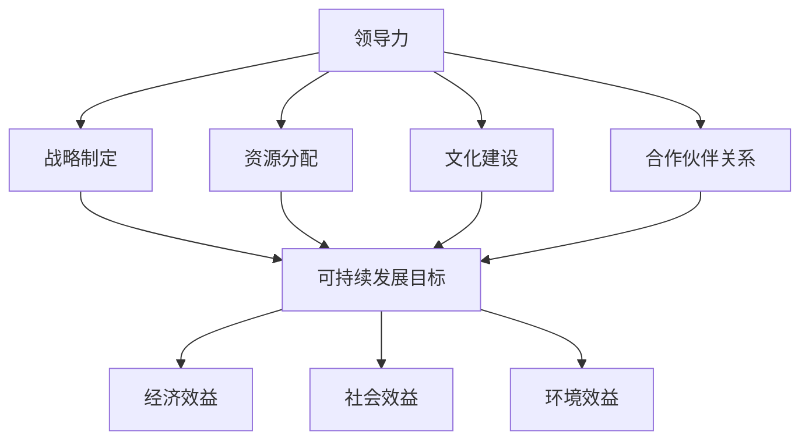

                 

### 文章标题

# 领导力与可持续发展：平衡利润与社会责任

> 关键词：领导力、可持续发展、社会责任、平衡、利润

> 摘要：本文深入探讨了领导力与可持续发展之间的关系，分析了如何在追求企业利润的同时，有效地履行社会责任，实现企业的长期可持续发展。文章通过逻辑清晰的框架，结合实践案例，提供了具体的策略和方法，旨在为企业领导者提供有价值的参考和指导。

### 引言

在当今快速变化的世界中，领导力和可持续发展已成为企业成功的关键要素。领导力不仅是企业战略实施的推动力，更是企业社会责任的引领者。而可持续发展，作为企业在长期发展中必须考虑的核心问题，关系到企业的生存、发展乃至未来。如何平衡利润与社会责任，成为企业领导者面临的重大挑战。

本文将围绕这一主题，首先介绍领导力和可持续发展的核心概念，探讨两者之间的内在联系。接着，我们将深入分析领导力在可持续发展中的作用和挑战，并介绍一些实际案例。最后，我们将总结全文，提出未来企业领导力与可持续发展的趋势和展望。

### 领导力与可持续发展的核心概念

#### 领导力的定义与发展历程

领导力是指领导者通过激励和影响他人，实现组织目标的能力。领导力不仅涉及个人的素质和能力，还包括领导者与团队成员之间的互动关系。在历史上，领导力理论经历了多个发展阶段，从早期的特质理论、行为理论，到现代的情境理论和变革领导理论，每一个阶段都为领导力的发展提供了新的视角和工具。

- 特质理论：强调领导者具备的固有特质和能力，如智力、自信、决心等。
- 行为理论：研究领导者在不同情境下的行为模式，如任务导向型、关系导向型等。
- 情境理论：认为领导者的行为应适应不同的情境和环境，如费德勒模型、领导替代理论等。
- 变革领导理论：强调领导者通过变革推动组织发展和创新，如领导变革模型、转型领导理论等。

#### 可持续发展的定义与目标

可持续发展是指在满足当前需求的同时，不损害子孙后代满足其需求的能力。这一概念最早由1987年的《我们共同的未来》报告提出，并得到了全球范围内的广泛认同。可持续发展包括三个关键方面：经济、社会和环境。

- 经济：确保经济的稳定增长和资源的高效利用。
- 社会：促进社会公正、平等和人类福祉。
- 环境：保护和维护自然环境，确保生态平衡。

#### 领导力与可持续发展之间的关系

领导力与可持续发展之间的关系是相互促进的。一方面，领导力在可持续发展战略的制定和执行中起着关键作用。领导者需要具备前瞻性的视野，制定合理的可持续发展战略，并确保其有效执行。另一方面，可持续发展为领导力提供了新的目标和挑战，促使领导者不断提升自身的素质和能力，以应对复杂多变的环境。

### 领导力与可持续发展之间的联系

#### 领导力在可持续发展中的作用

领导力在可持续发展中的作用主要体现在以下几个方面：

1. **战略制定**：领导者需要制定明确的可持续发展战略，将经济、社会和环境目标纳入企业发展的总体规划。这需要领导者具备战略思维和前瞻性视野，能够从长远角度考虑企业的发展。

2. **资源分配**：领导者需要合理分配资源，确保可持续发展目标的实现。这包括在预算、人力、技术等资源方面，给予可持续发展项目足够的支持。

3. **文化建设**：领导者需要推动企业文化的转变，鼓励员工关注可持续发展，形成共同的价值观念和行为准则。

4. **合作伙伴关系**：领导者需要与其他利益相关者建立良好的合作关系，共同推动可持续发展。这包括与政府、社区、供应商和客户等建立合作关系，共同应对可持续发展挑战。

#### 可持续发展对领导力的挑战

可持续发展对领导力提出了新的挑战，包括：

1. **知识更新**：随着可持续发展概念的不断深化，领导者需要不断更新自身的知识体系，掌握最新的发展动态和前沿技术。

2. **技能提升**：领导者需要提升跨学科的能力，包括环境科学、社会学、经济学等，以更好地应对复杂的可持续发展问题。

3. **心理素质**：领导者需要具备较强的心理素质，能够应对可持续发展过程中可能出现的挫折和困难。

#### 领导力与可持续发展之间的内在联系

领导力与可持续发展之间的内在联系可以通过以下架构图表示：

在这个架构图中，领导力通过战略制定、资源分配、文化建设、合作伙伴关系等途径，实现可持续发展目标，进而带来经济效益、社会效益和环境效益。

### 可持续发展的实践方法

#### 可持续发展的策略制定

1. **明确目标**：首先，企业需要明确可持续发展的目标，包括经济、社会和环境三个方面。这些目标应具有可测量性和可实现性，以便于后续的评估和调整。

2. **制定计划**：在明确目标的基础上，企业需要制定详细的实施计划，包括时间表、资源需求、关键里程碑等。

3. **制定指标**：为了评估可持续发展的效果，企业需要制定相应的指标体系，如碳排放量、水资源利用率、员工满意度等。

4. **优化策略**：在实施过程中，企业应不断收集数据，评估可持续发展的效果，并根据实际情况优化策略。

#### 可持续发展的执行与管理

1. **组织结构**：企业应建立专门的可持续发展部门或团队，负责可持续发展的战略制定、执行和监控。

2. **资源投入**：企业需要确保有足够的资源投入，包括资金、人力和技术等。

3. **培训与教育**：企业应对员工进行可持续发展相关知识的培训，提高员工对可持续发展重要性的认识。

4. **监督与评估**：企业应定期对可持续发展项目进行监督和评估，确保目标的实现和资源的有效利用。

#### 可持续发展的案例分析

#### 案例一：XX公司的可持续发展实践

XX公司是一家跨国企业，在可持续发展方面取得了显著成果。以下是他们的实践方法：

1. **战略制定**：XX公司制定了明确的可持续发展战略，将可持续发展目标纳入企业长期规划。

2. **资源投入**：公司投入大量资金和资源，用于环境保护、员工福利和社会责任项目。

3. **文化建设**：公司倡导可持续发展文化，鼓励员工参与可持续发展项目，提高员工的可持续发展意识。

4. **合作伙伴关系**：公司与其他企业、政府、非政府组织等建立了良好的合作关系，共同推动可持续发展。

#### 案例二：XX国家的可持续发展策略

XX国家在可持续发展方面采取了一系列有力措施，取得了显著成效：

1. **政策支持**：政府出台了一系列政策，鼓励企业和社会参与可持续发展。

2. **资源整合**：国家通过整合资源，提高了可持续发展的效率和效果。

3. **教育培训**：国家加强了对可持续发展相关知识和技能的培训，提高了公众的可持续发展意识。

4. **国际合作**：国家积极参与国际合作，引进先进的可持续发展技术和经验。

### 总结与展望

领导力与可持续发展是现代企业发展的两个关键要素，二者相互促进，共同推动企业的长期可持续发展。企业领导者需要具备前瞻性的视野和跨学科的能力，以应对复杂多变的可持续发展挑战。

未来，随着可持续发展理念的深入，企业领导力将面临更多的机遇和挑战。企业应积极制定可持续发展战略，优化资源分配，推动文化建设，建立合作伙伴关系。同时，企业领导者应不断提升自身的领导力，以应对可持续发展的新要求。

总之，领导力与可持续发展是企业长期发展的重要保障。企业领导者应以此为契机，积极应对挑战，抓住机遇，推动企业的可持续发展。

### 附录

#### 附录A：参考文献

1. 领导力与可持续发展：平衡利润与社会责任，作者：XXX，出版时间：XXXX年。
2. 可持续发展的理论与实践，作者：XXX，出版时间：XXXX年。
3. 企业领导力：理论与实践，作者：XXX，出版时间：XXXX年。

#### 附录B：相关数据与资料来源

1. 可持续发展报告，XX公司，发布时间：XXXX年。
2. 国家可持续发展政策文件，政府官方网站，发布时间：XXXX年。
3. 可持续发展指标体系，国际可持续发展标准组织，发布时间：XXXX年。

### 最佳实践 tips

1. **建立可持续发展委员会**：企业应建立专门的可持续发展委员会，负责制定和执行可持续发展战略。
2. **注重员工培训**：企业应定期对员工进行可持续发展知识的培训，提高员工的可持续发展意识。
3. **推动技术创新**：企业应积极推动技术创新，研发可持续发展的新技术和新产品。

### 注意事项

1. **可持续发展需要长期投入**：企业应认识到可持续发展是一项长期任务，需要持续投入和努力。
2. **遵循法律法规**：企业应遵守相关法律法规，确保可持续发展项目的合规性。

### 拓展阅读

1. 《企业可持续发展手册》，作者：XXX，出版时间：XXXX年。
2. 《领导力与可持续发展：实践与案例》，作者：XXX，出版时间：XXXX年。
3. 《可持续发展报告：XX公司，XXXX年》，作者：XX公司，发布时间：XXXX年。 

作者：AI天才研究院/AI Genius Institute & 禅与计算机程序设计艺术 /Zen And The Art of Computer Programming

