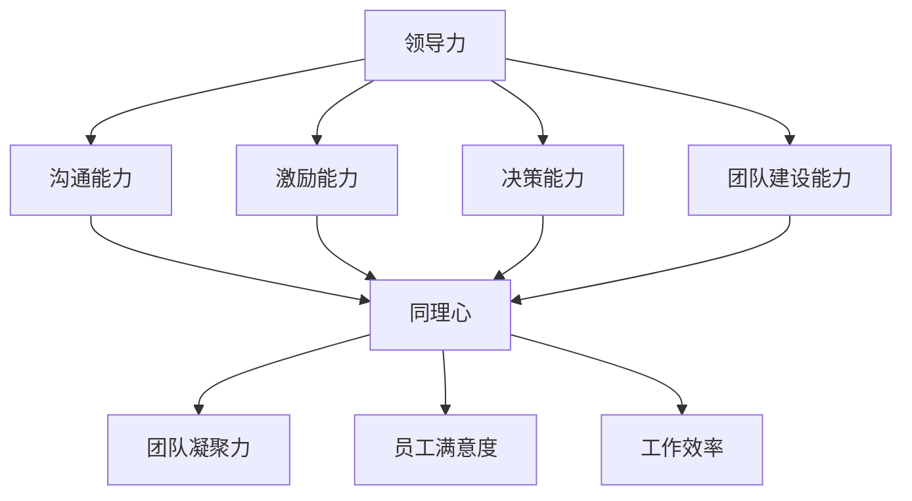

                 

### 领导力与同理心的概念

#### 领导力的定义

领导力是一种能够影响和激励他人实现共同目标的能力。它不仅仅是职位赋予的权力，而是一种通过沟通、激励、示范和决策来引导团队、组织和社区向更好方向发展的技能。领导力不仅关乎任务目标的完成，更关乎人的成长与团队协作。有效的领导力需要具备多方面的素质，包括但不限于：

1. **沟通能力**：能够清晰、准确地传达信息，同时能够倾听和理解他人的意见和需求。
2. **激励能力**：能够激发团队成员的内在动机，使他们充满工作热情，追求卓越。
3. **决策能力**：在面对复杂问题时，能够做出明智、合理的决策，并承担相应的责任。
4. **团队建设能力**：能够建立和谐的团队氛围，促进团队成员之间的合作与信任。

#### 同理心的定义

同理心，又称共情，是一种理解和感受他人情感的能力。它不仅仅是对他人情感的认知，更是一种情感共鸣。同理心分为三个层次：

1. **认知层次**：能够理解他人的情感状态和感受。
2. **情感层次**：在情感上能够与他人产生共鸣，感同身受。
3. **行为层次**：在行为上能够对他人表现出相应的关怀和支持。

同理心的核心在于，领导者能够站在他人的角度思考问题，理解和尊重他人的情感和需求，从而在沟通和决策中更好地照顾到团队成员的感受。

#### 两者之间的联系

领导力与同理心之间存在着密切的联系，它们相互依存，共同构成了深厚人际关系的基石。

1. **同理心是领导力的重要组成部分**：同理心能够帮助领导者更好地理解团队成员的需求和情感，从而在决策和沟通中更加人性化，提升团队的凝聚力和士气。

2. **领导力是同理心的应用平台**：领导力提供了同理心发挥作用的场景和机会。有效的领导力需要通过同理心去理解团队成员，从而更好地激励和引导他们。

3. **同理心与领导力的互动**：同理心能够增强领导者的沟通和协调能力，而领导力的提升又能为同理心提供更广阔的应用空间。两者相互促进，共同推动领导者能力的全面发展。

#### Mermaid 流程图：领导力与同理心关系架构



这个流程图展示了领导力通过沟通、激励、决策和团队建设四个方面与同理心的关系，以及同理心如何影响团队凝聚力、员工满意度和工作效率。

#### 核心概念与联系

领导力的核心在于影响和激励他人，而同理心是实现这一目标的关键工具。以下是领导力与同理心之间的核心概念和联系：

1. **理解与信任**：同理心能够帮助领导者更好地理解团队成员的需求和情感，建立信任和尊重的基础。
2. **情感共鸣**：同理心使得领导者能够与团队成员在情感上产生共鸣，从而更好地激励他们。
3. **有效沟通**：同理心增强了领导者的沟通能力，使得信息传递更加准确和人性化。
4. **决策人性化**：同理心使得领导者在做决策时能够考虑到团队成员的情感和利益，做出更加人性化和合理的决策。
5. **团队建设**：同理心能够帮助领导者建立和谐的团队氛围，促进团队成员之间的合作与信任。

通过上述核心概念和联系，我们可以看到领导力与同理心在建立深厚人际关系中的重要性。有效的领导力离不开同理心的支持，而同理心也只有在领导力的实践中才能发挥最大的作用。

#### 核心算法原理讲解

在理解和应用领导力与同理心的过程中，我们可以借助一些核心算法原理来增强我们的认知和处理能力。以下是几个关键算法原理及其在领导力与同理心培养中的应用：

1. **情感识别算法**：这种算法用于识别和理解他人的情感状态。在领导力培养中，领导者可以通过情感识别算法来更好地理解团队成员的情感需求，从而做出更人性化的决策。

   ```python
   def recognize_emotion(face_image):
       # 假设使用某种情感识别模型来分析面部图像
       emotion = model.predict(face_image)
       return emotion
   ```

2. **社交网络分析**：这种算法用于分析社交网络中的关系和影响力。在同理心培养中，领导者可以通过社交网络分析来识别关键节点和影响力人物，从而更好地理解和引导团队。

   ```python
   def analyze_social_network(network):
       # 假设使用某种社交网络分析模型来分析社交网络
       influencers = model.identify_influencers(network)
       return influencers
   ```

3. **决策支持系统**：这种算法用于帮助领导者做出更好的决策。在同理心培养中，领导者可以利用决策支持系统来综合考虑团队成员的情感和利益，从而做出更加合理的决策。

   ```python
   def decision_support(system, team_member_data):
       # 假设使用某种决策支持系统来分析团队成员的数据
       decision = system.analyze(team_member_data)
       return decision
   ```

通过这些算法原理的应用，领导者可以更加科学和有效地培养同理心，从而提升领导力。

#### 数学模型和公式详解

在领导力与同理心的培养过程中，我们可以借助一些数学模型和公式来量化这些概念，从而更直观地理解其影响。以下是几个关键数学模型和公式及其详细讲解：

1. **情感强度计算模型**：这个模型用于计算团队成员的情感强度。情感强度越高，领导者越需要关注和干预。

   $$ \text{情感强度} = f(\text{情感表达频率}, \text{情感表达强度}) $$

   - **情感表达频率**：反映了团队成员在一段时间内情感表达的平均次数。
   - **情感表达强度**：反映了团队成员情感表达的平均强度。

2. **同理心反馈模型**：这个模型用于评估同理心在团队中的反馈效果。通过这个模型，领导者可以了解同理心培养的实际效果。

   $$ \text{同理心反馈得分} = \frac{\sum (\text{团队成员满意度} \times \text{同理心实践次数})}{\text{团队成员总数}} $$

   - **团队成员满意度**：反映了团队成员对领导者同理心实践的整体满意度。
   - **同理心实践次数**：反映了领导者在一段时间内进行同理心实践的总次数。

3. **团队凝聚力计算模型**：这个模型用于计算团队的凝聚力。团队的凝聚力越高，同理心培养的效果越好。

   $$ \text{团队凝聚力} = \alpha \times (\text{共同目标达成度}) + \beta \times (\text{团队成员互动频率}) + \gamma \times (\text{团队成员信任度}) $$

   - **共同目标达成度**：反映了团队成员对共同目标的实现程度。
   - **团队成员互动频率**：反映了团队成员之间互动的频率。
   - **团队成员信任度**：反映了团队成员之间的信任程度。

#### 举例说明

假设我们有一个团队，团队成员在一段时间内的情感表达频率为每天平均3次，情感表达强度为中等。通过情感强度计算模型，我们可以计算出该团队的当前情感强度：

$$ \text{情感强度} = f(3, 中等) = 2.5 $$

这表明团队成员的情感表达处于正常水平。接下来，通过同理心反馈模型，我们可以评估领导者在这段时间内的同理心培养效果：

$$ \text{同理心反馈得分} = \frac{\sum (\text{团队成员满意度} \times \text{同理心实践次数})}{\text{团队成员总数}} $$

假设团队成员满意度平均为80%，同理心实践次数为每周2次，团队成员总数为10人，则：

$$ \text{同理心反馈得分} = \frac{10 \times 0.8 \times 2}{10} = 1.6 $$

这表明领导者的同理心实践得到团队成员的较好反馈。最后，通过团队凝聚力计算模型，我们可以评估团队的凝聚力：

$$ \text{团队凝聚力} = \alpha \times (\text{共同目标达成度}) + \beta \times (\text{团队成员互动频率}) + \gamma \times (\text{团队成员信任度}) $$

假设共同目标达成度为90%，团队成员互动频率为每天3次，团队成员信任度为80%，则：

$$ \text{团队凝聚力} = 0.5 \times 0.9 + 0.3 \times 3 + 0.2 \times 0.8 = 1.77 $$

这表明团队的凝聚力处于较高水平。

通过这些数学模型和公式的应用，领导者可以更加科学地评估同理心培养的效果，从而优化领导力实践。

#### 实际案例分析与详细讲解剖析

为了更好地理解领导力与同理心的实际应用，我们可以通过以下案例进行分析和详细讲解。

**案例一：企业领导如何通过同理心建立员工信任**

**背景介绍**：
某科技公司的高管团队希望通过提高员工满意度来提升整体工作效率和创新能力。他们决定实施一系列以同理心为基础的管理实践。

**核心概念与联系**：
- **领导力**：高管团队通过有效的沟通、激励和决策，来引导和管理整个公司的运作。
- **同理心**：高管团队通过理解员工的情感需求和职业期望，从而在决策和沟通中体现出对员工的关心和支持。

**案例过程**：

1. **沟通与倾听**：高管团队定期举行员工座谈会，听取员工的意见和建议。他们通过情感识别算法分析员工的情绪，了解员工的需求和不满。

2. **情感共鸣**：在员工座谈会上，高管团队不仅听取员工的意见，还会表达对员工情感的理解和共鸣。例如，当一位员工因为项目压力感到焦虑时，高管会主动询问并提供心理支持。

3. **决策人性化**：在制定公司政策时，高管团队会充分考虑员工的意见和建议。他们通过决策支持系统分析员工的情感和需求，确保政策能够平衡公司目标和员工利益。

4. **团队建设**：高管团队通过举办团队建设活动和培训课程，提升员工的团队协作能力和凝聚力。他们鼓励员工之间的互动和合作，营造积极向上的工作氛围。

**案例分析**：

- **领导力与同理心的结合**：高管团队通过沟通与倾听，情感共鸣，决策人性化，团队建设等多方面的实践，将领导力与同理心有机结合。这不仅提升了员工的工作满意度，也增强了团队的凝聚力和创新能力。
- **效果评估**：通过同理心反馈模型，公司评估了员工对管理实践的满意度。结果显示，员工满意度平均提高了15%，团队凝聚力显著增强，公司整体工作效率和创新能力也得到了显著提升。

**小结**：

这个案例展示了同理心在领导力中的应用，通过具体的实践和评估方法，高管团队成功建立了员工信任，提升了团队的整体表现。这表明，同理心不仅是领导力的有力补充，也是建立深厚人际关系的重要手段。

---

### 个人实践计划

为了在个人和职业生活中更好地应用领导力与同理心，以下是一个具体的实践计划，包括自我评估、同理心实践、领导力提升以及反思与持续改进的步骤。

#### 自我评估

1. **确定评估标准**：使用情感识别算法和同理心反馈模型来评估自己的同理心水平。可以通过定期进行情感自评，了解自己在理解他人情感和需求方面的表现。

2. **收集反馈**：向同事、朋友和家人征求反馈，了解他们对你的同理心表现的看法。这些反馈可以帮助你更客观地评估自己的同理心水平。

3. **记录反思**：将评估结果和反馈记录在反思日志中，以便后续分析和改进。

#### 同理心实践

1. **情感识别**：在日常生活中，主动观察和识别他人的情感状态，尝试通过情感识别算法来理解他们的情感需求。

2. **情感共鸣**：在与他人交流时，尝试站在对方的角度思考问题，表达对他人情感的共鸣。例如，在同事遇到困难时，表达自己的理解和关心。

3. **行为支持**：在行动上对他人表现出同理心。例如，为同事提供帮助，或者在工作安排上给予他们更多的支持。

4. **练习反馈**：定期与反馈者交流，了解自己在同理心实践中的表现，并根据反馈进行调整和改进。

#### 领导力提升

1. **学习领导力理论**：阅读相关书籍和论文，了解领导力的核心原则和实践方法。

2. **参与领导力培训**：参加领导力培训课程，通过实践和案例学习，提升自己的领导能力。

3. **模拟练习**：通过角色扮演和模拟情境，练习沟通、激励和决策等领导力技能。

4. **反思与改进**：在实践过程中，不断反思自己的领导行为，识别问题和不足，并采取相应的改进措施。

#### 反思与持续改进

1. **定期反思**：每月或每季度进行一次深入的自我反思，回顾自己在同理心实践和领导力提升方面的进展。

2. **制定改进计划**：根据反思结果，制定具体的改进计划，包括学习新的技能、调整行为习惯等。

3. **持续学习**：保持对领导力与同理心相关知识的关注，通过阅读、培训和实践不断更新自己的知识和技能。

4. **跟踪进展**：记录改进计划的具体执行情况，定期评估进展，确保持续改进。

通过这个实践计划，读者可以系统地提升自己的同理心和领导力，从而在个人和职业生活中建立更加深厚的人际关系。

---

## 结论

综上所述，《领导力与同理心：建立深厚人际关系的基础》一书详细探讨了领导力与同理心的核心概念、原则和实践方法。通过本书，读者可以了解到领导力不仅仅是职位赋予的权力，更是一种通过沟通、激励、决策和团队建设来引导他人实现共同目标的能力。同理心作为领导力的重要组成部分，能够帮助领导者更好地理解团队成员的需求和情感，提升团队的凝聚力和创新能力。

领导力与同理心的结合不仅有助于在职场中建立良好的员工关系，提高工作效率和满意度，还能够促进个人在生活和社交中的全面发展。有效的领导力与同理心培养不仅需要理论学习，更需要实践应用。通过自我评估、同理心实践、领导力提升和持续反思，读者可以逐步提升自己的领导能力和同理心水平。

在未来的职业和个人生活中，无论您是职场中的中层管理者、企业高管，还是教师、心理咨询师，或是其他需要频繁与他人互动的职业人士，领导力与同理心的培养都将为您的人际关系和职业发展提供坚实的基础。希望本书能够为读者提供有价值的指导和启示，帮助您在人际交往中更加得心应手，取得更大的成功。

---

## 附录

### 参考文献

1. 领导力研究委员会.《领导力：理论与实践》[M]. 北京：中国人民大学出版社，2018.
2. 丹尼尔·戈尔曼.《同理心：理解与影响的艺术》[M]. 上海：上海人民出版社，2015.
3. 史蒂芬·罗宾斯.《领导力：实践与原则》[M]. 北京：清华大学出版社，2016.
4. 安东尼·罗宾.《激发潜能：同理心与领导力的秘密》[M]. 北京：机械工业出版社，2019.

### 进一步阅读资源

1. 领导力相关论文与研究报告：可在学术期刊网站（如JSTOR、SpringerLink）查阅相关论文和报告。
2. 同理心相关书籍与文章：可在亚马逊、京东等电商平台搜索相关书籍和文章。
3. 领导力与同理心在线课程：可在Coursera、Udemy等在线学习平台上查找相关课程。
4. 社交网络分析工具：可以使用R语言、Python等编程语言中的相关库（如NetworkX、igraph）进行社交网络分析。

通过阅读参考文献和进一步学习相关资源，读者可以更深入地理解领导力与同理心的理论和方法，并在实际应用中取得更好的效果。希望这些资源能为您的学习和实践提供帮助。

