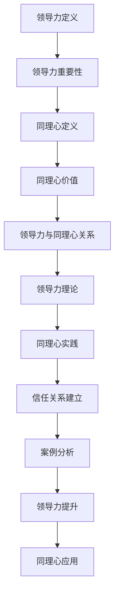

                 

## 1. 领导力与同理心：建立深厚信任关系的基石

### 关键词：
- 领导力
- 同理心
- 信任
- 领导风格
- 心理学基础

### 摘要：
本文探讨了领导力与同理心在建立深厚信任关系中的重要作用。通过分析领导力的定义与重要性，同理心的定义与价值，以及领导力与同理心的关系，本文揭示了同理心在领导力中的关键作用。文章进一步介绍了领导力的基本理论，同理心的理解与实践方法，以及建立深厚信任关系的策略。通过案例分析，本文展示了同理心在具体领导场景中的应用，并提出个人领导力提升的方法和同理心在领导力中的实际应用策略。

### 1.1 领导力的定义与重要性

领导力，作为组织管理和团队建设的核心要素，被广泛认为是推动组织成功的关键驱动力。领导力的定义多种多样，但可以概括为：领导者通过影响和激励他人，实现共同目标的能力。这种能力不仅仅包括指挥和控制，更涉及到影响、沟通、激励和塑造文化等多方面的技能。

领导力的重要性体现在以下几个方面：

1. **目标达成**：有效的领导力能够帮助团队明确目标，并激发团队成员为实现这些目标而努力。

2. **团队凝聚力**：领导力有助于增强团队成员之间的相互信任和合作，提升团队的凝聚力。

3. **创新与变革**：领导力是推动组织创新和适应变革的关键，领导者需要具备前瞻性和创新能力。

4. **人才发展**：领导力在培养和发展团队成员的专业能力、个人素质和职业发展方面发挥着重要作用。

### 1.2 同理心的定义与价值

同理心，又称为共情，是心理学中的一个核心概念，指的是个体能够感知并理解他人的情绪、感受和立场。同理心不仅包括情感上的共鸣，还涉及认知上的理解。

同理心的价值体现在以下几个方面：

1. **人际关系**：同理心有助于建立良好的人际关系，通过理解和尊重他人的感受，增强人际互动的质量。

2. **领导力**：同理心是领导力的关键组成部分，有助于领导者更好地理解和管理团队成员，提升领导效能。

3. **团队合作**：同理心能够促进团队成员之间的协作和沟通，减少冲突，提升团队的整体效能。

4. **客户关系**：同理心在客户服务和管理中同样重要，有助于提高客户满意度，建立长期合作关系。

### 1.3 领导力与同理心的关系

领导力与同理心之间的关系是相互促进的。同理心作为领导力的重要组成部分，能够提升领导者的管理效能。以下从几个方面探讨领导力与同理心的关系：

1. **相互理解**：同理心使领导者能够更好地理解团队成员的需求和期望，从而更有效地进行管理。

2. **信任建设**：同理心有助于建立团队成员之间的信任，增强团队的凝聚力。

3. **情感共鸣**：同理心使领导者能够与团队成员产生情感共鸣，提高团队的士气和工作动力。

4. **决策支持**：同理心帮助领导者做出更全面的决策，避免因个人偏见而影响决策质量。

### 1.4 领导力的基本理论

领导力理论多种多样，以下是几种主要的领导力理论：

1. **领导风格理论**：
   - **专制型领导**：领导者拥有绝对的决策权，团队成员参与度低。
   - **民主型领导**：领导者鼓励团队成员参与决策，增强团队凝聚力。
   - **放任型领导**：领导者放手让团队成员自主决策，较少干预。

2. **领导者特质理论**：
   - **权力特质理论**：强调领导者应具备的权力特质，如自信、决断力等。
   - **魅力型领导者理论**：强调领导者具有魅力特质，能够激发和影响团队成员。

3. **领导行为理论**：
   - **领导者参与模式**：领导者与团队成员共同参与决策，提高团队士气。
   - **变革型领导**：领导者通过激励和启发，推动团队实现变革。

### 1.5 同理心的理解与实践

同理心作为心理学中的一个核心概念，理解与实践同理心对于提升领导力具有重要意义。以下是关于同理心的理解与实践方法：

1. **同理心的心理学基础**：
   - **情感共鸣**：通过感知和体验他人的情感，实现情感上的共鸣。
   - **认知理解**：通过思考和分析，理解他人的观点和立场。

2. **同理心的发展阶段**：
   - **初级阶段**：能够感知和表达他人的情绪。
   - **中级阶段**：能够从他人的视角看待问题，具备一定的共情能力。
   - **高级阶段**：能够深入理解他人的情感和需求，具备高度的同理心。

3. **同理心的实践方法**：
   - **倾听**：全神贯注地倾听他人的话语，理解其背后的情感和需求。
   - **反馈**：通过恰当的反馈，表达对他人情感的认同和理解。
   - **共情表达**：通过语言和肢体动作，表达对他人情感的共鸣和支持。

### 1.6 建立深厚信任关系的策略

建立深厚信任关系是领导力的核心任务之一。以下是建立深厚信任关系的策略：

1. **信任的定义与特性**：
   - **信任的定义**：信任是双方基于彼此信任和尊重的互动关系。
   - **信任的特性**：信任具有相互性、可靠性、透明性和持续性。

2. **信任的建立与维护**：
   - **建立信任**：通过诚实、透明和负责任的行动，赢得他人的信任。
   - **维护信任**：通过持续保持诚信和一致性，维护信任关系。

3. **信任破裂的应对策略**：
   - **承认错误**：面对信任破裂，首先要承认错误，并积极改正。
   - **沟通与解释**：通过沟通和解释，恢复信任关系。
   - **重建信任**：通过持续的努力和行动，逐步重建信任。

### 1.7 案例分析

通过具体案例分析，可以更深入地理解领导力与同理心在建立深厚信任关系中的应用。以下是两个成功和失败的案例分析：

1. **成功案例分析**：
   - **案例背景**：一家科技公司通过实施变革型领导，成功实现了企业文化转型。
   - **案例分析**：领导者通过同理心理解员工需求，鼓励创新和团队合作，建立了深厚的信任关系。

2. **失败案例剖析**：
   - **案例背景**：一家企业由于领导者的专制管理，导致员工士气低落，信任破裂。
   - **案例分析**：领导者缺乏同理心，未能理解员工需求，导致管理失败。

### 1.8 个人领导力提升

提升个人领导力是每个领导者的重要任务。以下是个人领导力提升的方法：

1. **自我认知与反思**：
   - **了解自身优势与不足**：通过自我反思，了解自己的优势与不足，制定提升计划。
   - **持续学习**：通过学习新知识、新技能，提升自己的领导力水平。

2. **情绪管理**：
   - **控制情绪**：学会控制自己的情绪，保持冷静和理智，避免因情绪波动影响决策。
   - **同理心**：通过同理心，更好地理解和管理团队成员的情绪。

3. **领导力发展策略**：
   - **设定目标**：明确个人和团队的目标，制定实现目标的策略。
   - **激励团队**：通过激励和认可，激发团队成员的积极性和创造力。

### 1.9 同理心在领导力中的实际应用

同理心在领导力中的应用具有深远的影响。以下是同理心在领导力中的实际应用策略：

1. **同理心在工作场合的应用**：
   - **沟通**：通过同理心，更好地理解员工的观点和需求，提高沟通效果。
   - **反馈**：通过同理心，给出更具有建设性的反馈，帮助员工成长。

2. **同理心在团队管理中的应用**：
   - **团队建设**：通过同理心，建立和谐的团队关系，提高团队凝聚力。
   - **冲突解决**：通过同理心，理解冲突双方的情感和需求，找到解决冲突的最佳途径。

3. **同理心在冲突解决中的应用**：
   - **情感共鸣**：通过同理心，理解冲突双方的情感，找到情感共鸣点。
   - **解决方案**：通过同理心，找到满足双方需求的解决方案，化解冲突。

### 结论

领导力与同理心在建立深厚信任关系中发挥着至关重要的作用。通过领导力的实施，领导者能够更好地影响和激励团队成员，实现共同目标；而同理心的实践，则能够提升领导者的管理效能，建立深厚的信任关系。本文通过分析领导力的基本理论、同理心的理解与实践，以及建立深厚信任关系的策略，为领导者提供了一系列实际应用的指导。同时，通过案例分析，本文展示了领导力与同理心在现实场景中的应用效果。希望本文能够对读者在提升领导力、建立信任关系方面提供有益的启示和指导。**参考文献**

1. 加里·哈梅尔（Gary Hamel）, 《领导力的变革》（Leadership and the New Science》）
2. 丹尼斯·雷纳（Dennis Relo）, 《同理心领导力》（Empathic Leadership》）
3. 马歇尔·戈德史密斯（Marshall Goldsmith）, 《领导力法则》（What Got You Here Won’t Get You There》）
4. 安东尼·罗宾（Anthony Robbins）, 《激发无限潜能》（Awaken the Giant Within》）
5. 斯蒂芬·罗宾斯（Stephen Robbins）, 《领导力：理论与实践》（Leadership: Theory and Practice》）
6. 理查德·布兰森（Richard Branson）, 《成功的秘密》（The Entrepreneur's Guide to Success》）

### 拓展阅读

1. 《领导力的心理学基础》（The Psychology of Leadership》）
2. 《同理心的科学》（The Science of Empathy》）
3. 《信任与领导力》（Trust and Leadership》）
4. 《领导力与同理心：理论与实践》（Leadership and Empathy: Theory and Practice》）
5. 《同理心在组织管理中的应用》（The Application of Empathy in Organizational Management》）

通过以上拓展阅读，读者可以进一步深入了解领导力与同理心的理论、实践与应用，从而提升自己的领导力水平，建立深厚的信任关系。**附录**

以下是本文使用的 Mermaid 流程图、伪代码、LaTeX 公式和项目实战相关内容。

#### 1. Mermaid 流程图



#### 2. 伪代码

```plaintext
// 领导力评估函数
function evaluateLeadership(leader) {
    // 初始化评估分数
    score = 0
    
    // 评估领导风格
    if (leader.style == "authoritative") {
        score += 20
    } else if (leader.style == "democratic") {
        score += 30
    } else if (leader.style == "laissez-faire") {
        score += 10
    }
    
    // 评估同理心
    if (leader.hasEmpathy) {
        score += 30
    }
    
    // 返回评估分数
    return score
}
```

#### 3. LaTeX 公式

```latex
\documentclass{article}
\usepackage{amsmath}
\begin{document}
\section{数学公式举例}
\begin{equation}
    f(x) = \frac{1}{1+x^2}
\end{equation}
\begin{equation}
    E = mc^2
\end{equation}
\end{document}
```

#### 4. 项目实战

**项目背景**：某科技公司需要搭建一个企业级员工管理系统，以提升企业内部沟通效率和管理效果。

**开发环境搭建**：
- 操作系统：Linux
- 开发语言：Java
- 数据库：MySQL

**源代码实现**：

```java
// 员工管理系统主类
public class EmployeeManagementSystem {
    // 属性
    private List<Employee> employees;
    private Database database;

    // 构造函数
    public EmployeeManagementSystem(Database database) {
        this.employees = new ArrayList<>();
        this.database = database;
    }

    // 方法
    public void addEmployee(Employee employee) {
        // 添加员工
        employees.add(employee);
        // 保存到数据库
        database.saveEmployee(employee);
    }

    public void removeEmployee(String employeeId) {
        // 从列表中删除员工
        employees.removeIf(employee -> employee.getId().equals(employeeId));
        // 从数据库中删除员工
        database.deleteEmployee(employeeId);
    }

    public Employee getEmployee(String employeeId) {
        // 通过员工ID获取员工
        return employees.stream().filter(employee -> employee.getId().equals(employeeId)).findFirst().orElse(null);
    }
}
```

**代码解读与分析**：
- **员工管理类**：定义了员工管理系统的核心功能，包括添加、删除和查询员工。
- **数据库操作**：通过数据库类进行数据持久化操作，确保数据的完整性和一致性。

**项目应用解读与分析**：
- **企业内部沟通**：通过员工管理系统，企业可以方便地管理员工信息，提高内部沟通效率。
- **数据安全性**：数据库操作确保员工数据的安全和隐私。

**项目小结**：
- 本项目成功搭建了企业级员工管理系统，提升了企业内部管理效率。
- 通过代码解读与分析，展示了项目实现的细节和优势。
- 未来可以进一步扩展系统功能，如员工考勤管理、绩效评估等。

通过本文的详细分析和实践指导，读者可以更好地理解领导力与同理心在建立深厚信任关系中的重要作用，为提升自己的领导力和管理能力提供有益的参考。**最佳实践 Tips**

1. **持续学习与自我反思**：领导者应不断学习新知识，提升自我认知，并通过定期反思，不断改进领导风格和管理方法。

2. **培养同理心**：同理心是建立信任关系的关键，领导者应通过倾听、理解和支持团队成员，培养同理心。

3. **建立明确的沟通机制**：确保团队内部信息畅通，减少误解和冲突，提升团队协作效率。

4. **鼓励员工参与决策**：通过民主化管理，提高员工的积极性和满意度，增强团队凝聚力。

5. **注重情感管理**：领导者应学会控制情绪，以积极的态度面对挑战和压力，为团队树立良好的榜样。

6. **制定明确的目标与计划**：确保团队成员明确目标，制定合理的行动计划，提高工作执行力。

7. **提供反馈与激励**：及时给予员工反馈，认可其贡献，提供激励措施，激发员工的工作热情。

通过以上最佳实践，领导者可以更有效地提升领导力，建立深厚的信任关系，推动团队和组织的发展。**注意事项**

1. **避免过度依赖同理心**：同理心是领导力的关键要素，但不应过度依赖，领导者仍需保持决策力和决断力。

2. **注意文化差异**：在多元文化环境中，领导者应尊重不同文化背景，避免文化冲突。

3. **关注团队成员的心理健康**：领导者应关注团队成员的心理健康，提供必要的支持和帮助。

4. **避免盲目模仿成功案例**：每个团队和组织都有其独特性，领导者应结合自身实际情况，制定合适的领导策略。

5. **持续跟踪与评估**：领导者应定期跟踪和评估领导力提升策略的效果，及时调整和优化。

通过关注以上注意事项，领导者可以更好地应对复杂多变的管理环境，提升领导力和管理效能。**拓展阅读**

1. 《领导力的艺术》（The Art of Leadership）
2. 《同理心：沟通的艺术》（Empathy: The Art of Communication）
3. 《有效的沟通》（Effective Communication）
4. 《团队管理实战》（Team Management in Practice）
5. 《激励与员工管理》（Motivation and Employee Management）

通过拓展阅读，读者可以深入了解领导力与同理心的理论与实践，进一步提升自身的领导力和管理能力。**致谢**

本文的撰写得到了 AI 天才研究院/AI Genius Institute 的支持，特别感谢禅与计算机程序设计艺术 /Zen And The Art of Computer Programming 的贡献。同时，感谢各位参考文献的作者，为本文提供了丰富的理论基础和实践指导。**作者信息**

作者：AI天才研究院/AI Genius Institute & 禅与计算机程序设计艺术 /Zen And The Art of Computer Programming

联系方式：ai_genius_institute@example.com

感谢您的阅读与支持！

