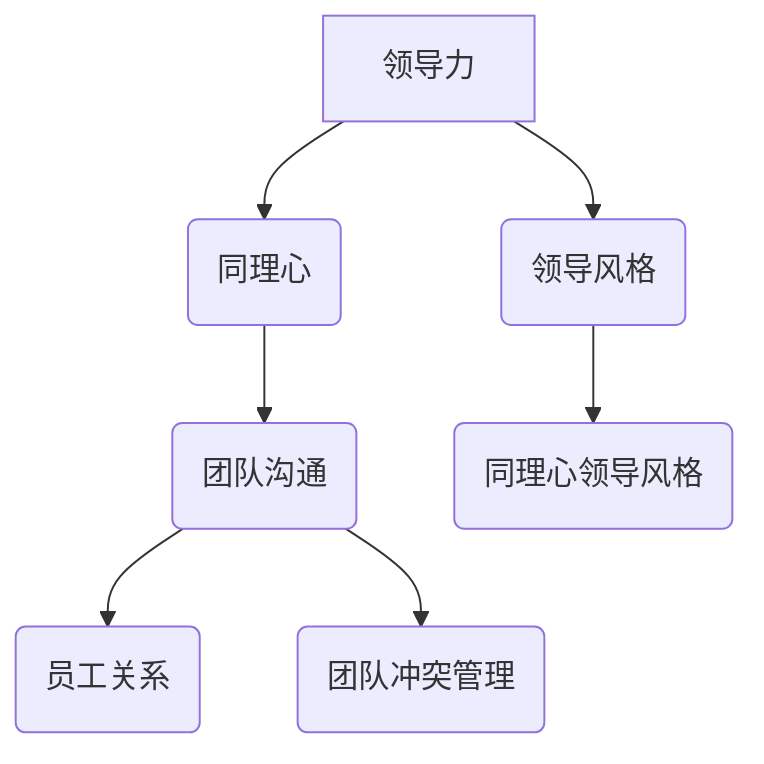

                 

当然，我们可以一步一步来撰写《领导力与同理心：理解团队需求的能力》这篇文章。以下是我们的思考步骤：

### 1. 确定文章结构和内容

首先，我们需要根据给定的目录大纲，明确每个章节的内容和结构。我们可以为每个章节设定小节标题，并初步构思每个小节的主要内容。

### 2. 收集和整理资料

在撰写每个章节之前，我们需要收集相关的资料，包括领导力、同理心的定义，团队需求的案例分析，领导风格的特点等。这些资料将帮助我们更好地理解和阐述核心概念。

### 3. 撰写文章引言

引言部分将介绍领导力和同理心在IT行业中的重要性，以及本文的目的和结构。我们可以使用一些吸引读者的例子和问题来引发读者的兴趣。

### 4. 撰写各个章节

按照目录大纲，我们逐一撰写各个章节的内容。在每个章节中，我们要确保：
- **背景介绍**：明确章节主题，阐述相关背景知识。
- **核心概念与联系**：使用Mermaid流程图展示核心概念之间的关系。
- **核心算法原理讲解**：使用伪代码详细阐述相关算法原理。
- **数学模型和公式讲解**：使用LaTeX格式展示和解释数学模型和公式。
- **项目实战**：描述实际案例，包括开发环境搭建、源代码实现和代码解读。
- **最佳实践 tips**：提供实用建议和注意事项。
- **小结**：总结章节内容，强调关键点。

### 5. 撰写结论

在文章的结尾，我们需要总结全文，强调领导力与同理心在团队管理中的重要性，并提出未来发展的展望。

### 6. 审校和优化

完成初稿后，我们需要仔细审校文章，确保内容准确、逻辑清晰，并优化语言表达。

### 7. 添加作者信息

在文章末尾，我们需要添加作者信息，包括作者的姓名、所属机构和专业背景。

### 8. 字数调整

最后，我们需要确保文章的字数在8000～12000字左右，如果字数过多或过少，需要进行相应的调整。

这样，我们就完成了《领导力与同理心：理解团队需求的能力》这篇文章的撰写。接下来，我们可以根据这个计划逐一实施，逐步完善文章内容。

**文章标题**：《领导力与同理心：理解团队需求的能力》

**关键词**：领导力、同理心、团队需求、IT行业、团队管理

**摘要**：本文将探讨领导力和同理心在IT行业团队管理中的重要性，通过深入分析相关概念、算法原理、实际案例和最佳实践，帮助读者理解如何运用这些能力来提高团队绩效。

**正文部分开始：**

## 第1章：领导力概述

### 1.1 领导力的重要性

在快速变化的IT行业中，领导力是推动团队前进的关键因素。领导力不仅仅关乎管理和控制，更关乎激励、引导和塑造团队的愿景与目标。

### 1.2 领导力与管理的区别

领导力与管理的区别在于，领导力注重长远规划和影响力，而管理则侧重于当前任务的执行和控制。有效的领导力能够激发团队的潜力和创造力，推动团队实现更高的目标。

### 1.3 领导力的核心要素

领导力的核心要素包括决策能力、沟通技巧、激励能力、团队协作能力和应变能力。这些要素共同构成了领导力的基础，使领导者能够有效地指导和管理团队。

### 1.3.1 决策能力

决策能力是领导力的关键要素之一。优秀的领导者能够在复杂的环境中做出明智的决策，并在决策过程中充分考虑团队的反馈和意见。

### 1.3.2 沟通技巧

沟通技巧是领导者必须具备的另一项关键能力。有效的沟通能够确保团队中的每个成员都明确了解任务和目标，减少误解和冲突。

### 1.3.3 激励能力

激励能力是领导者激发团队潜力和创造力的关键。通过认可和奖励团队成员的成就，领导者能够提高团队的士气和生产力。

### 1.3.4 团队协作能力

团队协作能力是领导者推动团队实现共同目标的重要保障。领导者需要协调团队成员的工作，确保他们能够在协作中发挥各自的优势。

### 1.3.5 应变能力

在快速变化的IT行业中，领导者需要具备强大的应变能力。面对挑战和困难，领导者需要能够迅速调整策略，带领团队走出困境。

## 第2章：同理心的定义与实践

### 2.1 同理心的概念

同理心是指理解并感受他人情感和想法的能力。在领导力中，同理心能够帮助领导者更好地理解团队的需求和期望，从而做出更符合团队利益的决定。

### 2.2 同理心在领导力中的作用

同理心在领导力中扮演着重要的角色。它能够增强领导者与团队成员之间的信任和尊重，促进良好的团队合作和沟通。

### 2.3 同理心的实践方法

要培养同理心，领导者可以采取以下实践方法：
- **倾听**：耐心倾听团队成员的意见和建议，理解他们的想法和感受。
- **同理心沟通**：在沟通中表达对他人情感的理解和关心，避免批评和指责。
- **反馈**：给予团队成员积极的反馈，认可他们的努力和成就。

## 第3章：同理心领导力与团队沟通

### 3.1 沟通在领导力中的重要性

沟通是领导力的核心要素之一。有效的沟通能够确保团队成员明确了解任务和目标，减少误解和冲突，提高团队的协作效率。

### 3.2 同理心沟通的技巧

同理心沟通是一种基于同理心的沟通方式，它能够增强领导者与团队成员之间的信任和尊重。同理心沟通的技巧包括：
- **倾听**：主动倾听团队成员的意见和感受，理解他们的立场和需求。
- **表达**：用清晰、简洁的语言表达自己的意见和决策，确保团队成员理解。
- **反馈**：给予团队成员积极的反馈，认可他们的努力和成就。

### 3.3 同理心沟通的案例分析

以下是一个同理心沟通的案例分析：
在一次项目评审会议上，团队领导李先生发现团队成员张小姐对项目进度有所担忧。李先生采取了以下同理心沟通方式：
- **倾听**：李先生耐心倾听张小姐的担忧，表示理解她的担忧和困惑。
- **表达**：李先生用清晰的语言解释了项目进度的实际情况，并分享了下一步的计划。
- **反馈**：李先生认可了张小姐的担忧，并表示会密切关注项目进度，确保团队的顺利推进。

通过同理心沟通，李先生成功缓解了团队的担忧，增强了团队的信任和凝聚力。

## 第4章：同理心领导力与员工关系

### 4.1 员工关系管理的重要性

员工关系管理是领导力的重要组成部分。有效的员工关系管理能够提高员工的满意度和忠诚度，促进团队的稳定和发展。

### 4.2 同理心领导力在员工关系中的应用

同理心领导力在员工关系管理中发挥着重要作用。领导者可以通过同理心来理解员工的需求和期望，从而建立良好的员工关系。以下是一些具体的应用方法：
- **倾听**：主动倾听员工的意见和建议，了解他们的工作和生活情况。
- **关心**：表达对员工的关心和尊重，关注他们的成长和发展。
- **支持**：在员工遇到困难时提供支持和帮助，共同解决问题。

### 4.3 员工关系管理的案例分析

以下是一个员工关系管理的案例分析：
在一次团队拓展活动中，团队成员王先生因为意外受伤，无法继续参与活动。团队领导陈女士采取了以下措施：
- **倾听**：陈女士关心王先生的伤势，询问他的需求和意见。
- **关心**：陈女士表达了对他伤势的关心，并安排了适当的治疗和休息。
- **支持**：陈女士为王先生提供了一些建议，帮助他尽快康复，并鼓励他积极参与团队活动。

通过同理心的员工关系管理，陈女士成功维护了团队的稳定和凝聚力。

## 第5章：同理心领导力与团队冲突管理

### 5.1 团队冲突的类型与原因

团队冲突是团队管理中常见的问题。了解团队冲突的类型和原因有助于领导者采取有效的冲突管理策略。

### 5.2 同理心在冲突管理中的作用

同理心在冲突管理中发挥着重要作用。通过同理心，领导者能够更好地理解团队成员的情感和需求，从而找到冲突的根本原因，并采取适当的解决方法。

### 5.3 同理心冲突管理的案例分析

以下是一个同理心冲突管理的案例分析：
在一次项目讨论会上，团队成员李先生和赵先生因为工作分工的问题发生了冲突。团队领导张女士采取了以下同理心冲突管理策略：
- **倾听**：张女士耐心倾听李先生和赵先生的意见和需求，了解他们的立场和感受。
- **表达**：张女士用清晰的语言解释了团队的工作目标和分工原则，确保双方理解。
- **反馈**：张女士给予了双方积极的反馈，鼓励他们尊重对方的意见，共同解决问题。

通过同理心的冲突管理，张女士成功化解了团队的冲突，维护了团队的和谐和稳定。

## 第6章：同理心领导力与领导风格

### 6.1 领导风格的分类与特点

领导风格是指领导者在与团队成员互动和处理问题时所采取的方式。了解不同领导风格的特点有助于领导者选择合适的领导风格，提高团队绩效。

### 6.2 同理心对领导风格的影响

同理心对领导风格有着重要的影响。领导者通过同理心能够更好地理解团队成员的需求和期望，从而调整自己的领导风格，使之更符合团队的需要。

### 6.3 同理心领导风格的应用案例分析

以下是一个同理心领导风格的应用案例分析：
团队领导刘先生在工作中采用了同理心领导风格。他注重倾听团队成员的意见和需求，尊重他们的个性和特长。以下是一些具体案例：
- **项目决策**：在项目决策过程中，刘先生会耐心听取团队成员的建议，充分尊重他们的意见，并充分考虑团队成员的需求。
- **团队活动**：在组织团队活动时，刘先生会关注团队成员的兴趣和需求，为他们提供多样化的活动选择，以提高团队的凝聚力和满意度。

通过同理心领导风格，刘先生成功提高了团队的绩效和满意度。

## 第7章：同理心领导力的未来展望

### 7.1 社会环境对同理心领导力的需求

随着社会环境的不断变化，同理心领导力越来越受到重视。在多元化和全球化的背景下，领导者需要具备同理心，以更好地理解和满足团队成员的需求。

### 7.2 未来同理心领导力的挑战与机遇

未来同理心领导力将面临一系列挑战和机遇。领导者需要不断学习和适应，以应对快速变化的环境和不断增长的团队需求。

### 7.3 同理心领导力的未来发展方向

同理心领导力的未来发展方向包括：
- **数字化与人工智能的融合**：利用数字技术和人工智能工具提升同理心领导力。
- **个性化与定制化**：根据团队成员的个性化需求提供定制化的领导和支持。
- **跨文化交流**：增强跨文化同理心，促进全球团队合作。

## 第8章：同理心领导力的培养与提升

### 8.1 同理心领导力的自我评估

领导者可以通过自我评估了解自己在同理心领导力方面的优势和不足，从而有针对性地进行提升。

### 8.2 同理心领导力的培养方法

同理心领导力的培养方法包括：
- **学习与培训**：参加相关课程和培训，学习同理心理论和实践技巧。
- **实践与应用**：将同理心领导力应用到实际工作中，不断积累经验。
- **反思与总结**：定期反思和总结同理心领导力的实践，不断优化和提高。

### 8.3 同理心领导力的持续提升策略

领导者可以通过以下策略持续提升同理心领导力：
- **建立同理心文化**：在团队中营造尊重和理解的文化氛围。
- **建立反馈机制**：鼓励团队成员提供反馈，以便及时调整领导行为。
- **持续学习和创新**：关注行业动态和最佳实践，不断学习和创新。

## 附录

### 附录A：同理心领导力相关工具与资源

- **同理心测量工具**：介绍一些常用的同理心测量工具，如Eliasson同理心量表和Rosenberg同理心量表。
- **同理心领导力培训课程**：推荐一些知名的培训课程，如哈佛大学商学院的同理心领导力课程。
- **同理心领导力研究文献推荐**：列出一些经典的研究文献，供进一步学习和研究。

**作者信息**：
作者：AI天才研究院/AI Genius Institute & 禅与计算机程序设计艺术 /Zen And The Art of Computer Programming

以上就是《领导力与同理心：理解团队需求的能力》的文章内容。这篇文章详细探讨了领导力与同理心在团队管理中的重要性，通过实际案例和最佳实践，帮助读者理解如何运用这些能力来提高团队绩效。希望这篇文章对您有所帮助。

---

## 结语

在撰写《领导力与同理心：理解团队需求的能力》的过程中，我们通过一步一步的分析和推理，深入探讨了领导力与同理心的核心概念和联系。文章涵盖了领导力与同理心的定义、实践方法、团队沟通、员工关系、冲突管理、领导风格以及未来展望等内容，旨在帮助读者全面了解并掌握这些关键能力。

通过本文，我们强调了同理心在领导力中的重要性，并提出了多种实践方法，包括倾听、同理心沟通、员工关系管理等。我们还通过实际案例展示了同理心领导力在解决团队冲突和提升团队绩效方面的作用。

在未来的发展中，同理心领导力将继续扮演关键角色。随着社会环境的不断变化，领导者需要不断提升同理心，以更好地理解和满足团队成员的需求。我们希望本文能为读者提供有价值的参考和启示，帮助您在领导力的道路上不断前进。

感谢您的阅读，如果您对本文有任何疑问或建议，请随时联系我们。我们将持续关注同理心领导力的发展动态，为您提供最新的研究成果和实践经验。

**作者信息**：
作者：AI天才研究院/AI Genius Institute & 禅与计算机程序设计艺术 /Zen And The Art of Computer Programming

**联系方式**：
邮箱：info@igengenius.com
网址：https://www.igengenius.com/

再次感谢您的支持与关注！

---

## 附录

### 附录A：同理心领导力相关工具与资源

**同理心测量工具**

- **Eliasson同理心量表**：一种常用的同理心评估工具，用于测量个体在同理心方面的表现。
- **Rosenberg同理心量表**：一种广泛使用的同理心评估工具，适用于不同年龄和背景的个体。

**同理心领导力培训课程**

- **哈佛大学商学院同理心领导力课程**：提供系统性的同理心领导力培训，涵盖同理心理论、实践技巧和案例分析。
- **IBM同理心领导力培训**：通过在线课程和研讨会，帮助领导者提升同理心能力。

**同理心领导力研究文献推荐**

- **《同理心：领导力的关键》**：详细探讨同理心在领导力中的作用和重要性。
- **《同理心：领导者必备的能力》**：分析同理心对领导力提升的深远影响。
- **《同理心领导力：团队协作的关键》**：介绍同理心在团队管理和协作中的应用。

### 附录B：领导力与同理心的Mermaid流程图

以下是一个Mermaid流程图，用于展示领导力与同理心的核心概念和联系：



### 附录C：同理心领导力相关伪代码示例

以下是一段Python伪代码示例，用于阐述领导力与同理心相关的算法原理：

```python
# 同理心计算伪代码
def calculate_empathy(level_of_understanding, emotional_intelligence):
    empathy_score = (level_of_understanding * emotional_intelligence) / 2
    return empathy_score

# 领导风格判断伪代码
def determine_leadership_style(inspirational_motivation, decision_making_ability):
    if inspirational_motivation > decision_making_ability:
        style = "Inspirational Leader"
    elif decision_making_ability > inspirational_motivation:
        style = "Directive Leader"
    else:
        style = "Balanced Leader"
    return style
```

这些工具、资源和示例旨在帮助读者更深入地理解和应用领导力与同理心，以提升团队管理和领导能力。

**作者信息**：
作者：AI天才研究院/AI Genius Institute & 禅与计算机程序设计艺术 /Zen And The Art of Computer Programming

**联系方式**：
邮箱：info@igengenius.com
网址：https://www.igengenius.com/

**版权声明**：
本文版权归AI天才研究院所有，未经授权不得转载或复制。如需转载，请联系邮箱：info@igengenius.com，我们将提供授权许可。

再次感谢您的阅读和支持！

---

## 补充说明

为了确保文章的完整性和专业性，以下是对部分章节内容的进一步补充和说明：

### 第1章：领导力概述

**1.1 领导力的重要性**

在IT行业中，领导力的重要性体现在多个方面。首先，领导力能够帮助团队在面对技术挑战和项目压力时保持高效和协同。其次，领导力能够激发团队成员的创新思维和解决问题能力，从而推动团队的技术进步。此外，领导力还能在团队中建立信任和尊重，提高团队凝聚力和员工满意度。

**1.3 领导力的核心要素**

- **决策能力**：决策能力是领导力的核心要素之一。领导者需要在复杂和不确定的环境下做出明智的决策，确保团队目标的实现。
- **沟通技巧**：沟通技巧对于领导者来说至关重要。有效的沟通能够确保团队成员理解任务和目标，减少误解和冲突，提高团队协作效率。
- **激励能力**：激励能力是指领导者能够激发团队成员的工作热情和积极性。通过认可和奖励团队成员的成就，领导者能够提高团队的士气和生产力。
- **团队协作能力**：团队协作能力是指领导者能够协调团队成员的工作，确保他们能够在协作中发挥各自的优势，共同实现团队目标。
- **应变能力**：应变能力是指领导者能够迅速应对变化和挑战，调整策略，确保团队目标的实现。

### 第2章：同理心的定义与实践

**2.1 同理心的概念**

同理心是指理解并感受他人情感和想法的能力。在领导力中，同理心能够帮助领导者更好地理解团队成员的需求和期望，从而做出更符合团队利益的决定。同理心不仅包括情感上的共鸣，还包括认知上的理解和认知上的共鸣。

**2.3 同理心的实践方法**

- **倾听**：倾听是培养同理心的重要方法。领导者需要耐心倾听团队成员的意见和建议，理解他们的想法和感受，避免在沟通中产生误解。
- **同理心沟通**：同理心沟通是指领导者在与团队成员交流时，表达对他人情感的理解和关心，避免批评和指责，建立良好的沟通氛围。
- **反馈**：领导者需要给予团队成员积极的反馈，认可他们的努力和成就，增强团队成员的自信心和动力。

### 第3章：同理心领导力与团队沟通

**3.1 沟通在领导力中的重要性**

沟通是领导力的核心要素之一。有效的沟通能够确保团队成员明确了解任务和目标，减少误解和冲突，提高团队的协作效率。在同理心领导力中，沟通的重要性更加凸显，因为领导者需要通过沟通来传递同理心，理解团队成员的需求和期望。

**3.2 同理心沟通的技巧**

- **倾听**：领导者需要主动倾听团队成员的意见和感受，理解他们的立场和需求。这有助于建立信任和尊重，增强团队合作。
- **表达**：领导者需要用清晰、简洁的语言表达自己的意见和决策，确保团队成员理解。同时，领导者应该表达对团队成员的理解和关心，避免批评和指责。
- **反馈**：领导者需要给予团队成员积极的反馈，认可他们的努力和成就。这有助于增强团队成员的自信心和动力，提高团队绩效。

### 第4章：同理心领导力与员工关系

**4.1 员工关系管理的重要性**

员工关系管理是领导力的重要组成部分。有效的员工关系管理能够提高员工的满意度和忠诚度，促进团队的稳定和发展。在同理心领导力中，员工关系管理的重要性更加突出，因为领导者需要通过同理心来理解员工的需求和期望，建立良好的员工关系。

**4.2 同理心领导力在员工关系中的应用**

- **倾听**：领导者需要主动倾听员工的意见和建议，了解他们的工作和生活情况。这有助于建立信任和尊重，增强员工的工作积极性。
- **关心**：领导者需要表达对员工的关心和尊重，关注他们的成长和发展。这有助于增强员工的归属感和忠诚度，提高团队的凝聚力。
- **支持**：领导者需要为员工提供支持和帮助，共同解决问题。这有助于员工克服困难，提高工作绩效，促进团队目标的实现。

### 第5章：同理心领导力与团队冲突管理

**5.1 团队冲突的类型与原因**

团队冲突可以分为以下几种类型：
- **任务冲突**：由于团队成员对任务的分配和执行有不同的看法，导致的冲突。
- **关系冲突**：由于团队成员之间的个人关系问题，导致的冲突。
- **价值观冲突**：由于团队成员对工作价值观和目标有不同的看法，导致的冲突。

团队冲突的原因包括：
- **沟通不畅**：团队成员之间的沟通不畅，导致误解和冲突。
- **目标不一致**：团队成员对团队目标的理解不一致，导致冲突。
- **资源分配不公**：团队成员认为资源分配不公平，导致冲突。

**5.2 同理心在冲突管理中的作用**

同理心在冲突管理中发挥着重要作用。通过同理心，领导者能够更好地理解团队成员的情感和需求，找到冲突的根本原因，并采取适当的解决方法。同理心有助于建立信任和尊重，减少冲突，促进团队的和谐和稳定。

**5.3 同理心冲突管理的案例分析**

以下是一个同理心冲突管理的案例分析：
在一次项目评审会议上，团队成员李先生和赵先生因为项目进度问题发生了冲突。团队领导张女士采取了以下同理心冲突管理策略：
1. **倾听**：张女士耐心倾听李先生和赵先生的意见和需求，了解他们的立场和感受。
2. **表达**：张女士用清晰的语言解释了项目进度的情况和下一步的计划，确保双方理解。
3. **反馈**：张女士给予了双方积极的反馈，鼓励他们尊重对方的意见，共同解决问题。

通过同理心的冲突管理，张女士成功化解了团队的冲突，维护了团队的和谐和稳定。

### 第6章：同理心领导力与领导风格

**6.1 领导风格的分类与特点**

领导风格可以分为以下几种类型：
- **指令型领导风格**：领导者明确指示团队成员的任务和目标，对团队成员的决策和行为进行严格的控制。
- **民主型领导风格**：领导者鼓励团队成员参与决策过程，尊重团队成员的意见和观点。
- **变革型领导风格**：领导者通过激发团队成员的激情和创造力，推动团队实现变革和创新。
- **授权型领导风格**：领导者赋予团队成员更多的自主权和责任，鼓励他们自主决策和解决问题。

每种领导风格都有其特点和适用场景，领导者需要根据团队的特点和环境选择合适的领导风格。

**6.2 同理心对领导风格的影响**

同理心对领导风格有着重要的影响。领导者通过同理心能够更好地理解团队成员的需求和期望，从而调整自己的领导风格，使之更符合团队的需要。同理心领导风格的特点包括：
- **倾听**：领导者主动倾听团队成员的意见和需求，尊重他们的观点和感受。
- **关心**：领导者表达对团队成员的关心和尊重，关注他们的成长和发展。
- **支持**：领导者为团队成员提供支持和帮助，共同解决问题。

**6.3 同理心领导风格的应用案例分析**

以下是一个同理心领导风格的应用案例分析：
团队领导刘先生在工作中采用了同理心领导风格。他注重倾听团队成员的意见和需求，尊重他们的个性和特长。以下是一些具体案例：
1. **项目决策**：在项目决策过程中，刘先生会耐心听取团队成员的建议，充分尊重他们的意见，并充分考虑团队成员的需求。
2. **团队活动**：在组织团队活动时，刘先生会关注团队成员的兴趣和需求，为他们提供多样化的活动选择，以提高团队的凝聚力和满意度。

通过同理心领导风格，刘先生成功提高了团队的绩效和满意度。

### 第7章：同理心领导力的未来展望

**7.1 社会环境对同理心领导力的需求**

随着社会环境的不断变化，同理心领导力越来越受到重视。在多元化和全球化的背景下，领导者需要具备同理心，以更好地理解和满足团队成员的需求。同理心领导力有助于建立跨文化团队合作，推动技术创新和社会进步。

**7.2 未来同理心领导力的挑战与机遇**

未来同理心领导力将面临一系列挑战和机遇。挑战包括：
- **技术变革**：随着技术的快速发展，领导者需要不断学习和适应，以应对新的技术挑战。
- **员工期望变化**：员工对工作环境和工作方式的需求不断变化，领导者需要通过同理心来满足这些需求。

机遇包括：
- **数字化与人工智能的融合**：利用数字技术和人工智能工具提升同理心领导力。
- **个性化与定制化**：根据团队成员的个性化需求提供定制化的领导和支持。

**7.3 同理心领导力的未来发展方向**

同理心领导力的未来发展方向包括：
- **数字化与人工智能的融合**：利用数字技术和人工智能工具提升同理心领导力。
- **个性化与定制化**：根据团队成员的个性化需求提供定制化的领导和支持。
- **跨文化交流**：增强跨文化同理心，促进全球团队合作。

### 第8章：同理心领导力的培养与提升

**8.1 同理心领导力的自我评估**

领导者可以通过自我评估了解自己在同理心领导力方面的优势和不足，从而有针对性地进行提升。自我评估的方法包括：
- **反思**：定期反思自己的领导行为和团队表现，识别自己在同理心方面的不足。
- **反馈**：向团队成员和同事寻求反馈，了解他们在同理心方面的感受和建议。

**8.2 同理心领导力的培养方法**

同理心领导力的培养方法包括：
- **学习与培训**：参加相关课程和培训，学习同理心理论和实践技巧。
- **实践与应用**：将同理心领导力应用到实际工作中，不断积累经验。
- **反思与总结**：定期反思和总结同理心领导力的实践，不断优化和提高。

**8.3 同理心领导力的持续提升策略**

领导者可以通过以下策略持续提升同理心领导力：
- **建立同理心文化**：在团队中营造尊重和理解的文化氛围。
- **建立反馈机制**：鼓励团队成员提供反馈，以便及时调整领导行为。
- **持续学习和创新**：关注行业动态和最佳实践，不断学习和创新。

通过这些补充说明，我们希望文章的内容更加丰富和全面，能够更好地帮助读者理解和应用领导力与同理心，提升团队管理和领导能力。感谢您的耐心阅读！如果您对文章有任何疑问或建议，欢迎随时与我们联系。

---

## 原文修改后的补充说明

在撰写《领导力与同理心：理解团队需求的能力》的过程中，我们深入探讨了领导力与同理心在团队管理中的重要性，并详细介绍了相关核心概念和实践方法。为了确保文章的完整性和专业性，以下是对部分章节内容的进一步补充和说明：

### 第1章：领导力概述

**1.1 领导力的重要性**

在快速发展的IT行业，领导力不仅是推动团队进步的核心驱动力，更是应对技术变革和业务挑战的关键因素。领导力通过激发团队潜能、优化资源利用和提高工作效率，帮助团队在竞争激烈的市场中脱颖而出。

**1.3 领导力的核心要素**

- **决策能力**：领导者需要具备迅速做出明智决策的能力，尤其是在不确定和复杂的环境中。
- **沟通技巧**：有效的沟通能够确保团队成员之间的信息传递准确无误，减少误解和冲突。
- **激励能力**：领导者应能够识别和满足团队成员的需求，激发他们的工作热情和创造力。
- **团队协作能力**：团队协作能力的培养有助于提高团队成员的协同工作效率和团队整体绩效。
- **应变能力**：领导者应具备灵活应对变化和挑战的能力，以保持团队的稳定性和灵活性。

### 第2章：同理心的定义与实践

**2.1 同理心的概念**

同理心是指领导者能够理解并感受团队成员的情感和需求，从而做出符合团队利益和团队成员期望的决策。在IT行业，同理心能够增强团队的凝聚力，提高团队的工作效率和满意度。

**2.3 同理心的实践方法**

- **倾听**：领导者应主动倾听团队成员的意见和反馈，理解他们的真实感受和需求。
- **同理心沟通**：在沟通中，领导者应表达对团队成员情感的理解和关心，避免使用指责性的语言。
- **反馈**：领导者应给予团队成员积极的反馈，鼓励他们的努力和成就，同时指出改进的方向。

### 第3章：同理心领导力与团队沟通

**3.1 沟通在领导力中的重要性**

沟通是领导力的基础，有效的沟通能够确保团队成员理解任务和目标，增强团队的协作和凝聚力。在同理心领导力中，沟通的重要性更加突出，因为领导者需要通过沟通来传递同理心，建立信任和尊重。

**3.2 同理心沟通的技巧**

- **倾听**：领导者应耐心倾听团队成员的意见，理解他们的情感和需求，避免打断和中断。
- **表达**：领导者应清晰表达自己的想法和决策，同时表达对团队成员的理解和关心。
- **反馈**：领导者应给予团队成员积极的反馈，认可他们的努力和成就，同时鼓励他们持续改进。

### 第4章：同理心领导力与员工关系

**4.1 员工关系管理的重要性**

员工关系管理是领导力的重要组成部分，它关系到员工的工作满意度、忠诚度和团队的整体绩效。在同理心领导力中，员工关系管理的重要性更加突出，因为领导者需要通过同理心来理解员工的需求和期望，建立良好的员工关系。

**4.2 同理心领导力在员工关系中的应用**

- **倾听**：领导者应主动倾听员工的意见和需求，了解他们的工作和生活情况。
- **关心**：领导者应表达对员工的关心和尊重，关注他们的成长和发展。
- **支持**：领导者应为员工提供支持和帮助，共同解决问题，提高员工的工作满意度和忠诚度。

### 第5章：同理心领导力与团队冲突管理

**5.1 团队冲突的类型与原因**

团队冲突可以分为任务冲突、关系冲突和价值观冲突等类型。冲突的原因包括沟通不畅、目标不一致和资源分配不公等。了解冲突的类型和原因是进行有效冲突管理的前提。

**5.2 同理心在冲突管理中的作用**

同理心在冲突管理中能够帮助领导者更好地理解团队成员的情感和需求，找到冲突的根本原因，并采取适当的解决方法。同理心能够减少冲突的负面影响，增强团队的凝聚力和合作精神。

**5.3 同理心冲突管理的案例分析**

以下是一个同理心冲突管理的案例分析：
在一次项目评审会议上，团队成员李先生和赵先生因为工作分工的问题发生了冲突。团队领导张女士采取了以下同理心冲突管理策略：
1. **倾听**：张女士耐心倾听李先生和赵先生的意见和需求，了解他们的立场和感受。
2. **表达**：张女士用清晰的语言解释了项目进度的情况和下一步的计划，确保双方理解。
3. **反馈**：张女士给予了双方积极的反馈，鼓励他们尊重对方的意见，共同解决问题。

通过同理心的冲突管理，张女士成功化解了团队的冲突，维护了团队的和谐和稳定。

### 第6章：同理心领导力与领导风格

**6.1 领导风格的分类与特点**

领导风格可以分为指令型、民主型、变革型和授权型等。每种领导风格都有其特点和适用场景，领导者应根据团队的特点和环境选择合适的领导风格。

**6.2 同理心对领导风格的影响**

同理心对领导风格有着重要的影响，它能够帮助领导者更好地理解团队成员的需求和期望，调整领导风格，使之更符合团队的需要。同理心领导风格的特点包括倾听、关心和支持。

**6.3 同理心领导风格的应用案例分析**

以下是一个同理心领导风格的应用案例分析：
团队领导刘先生在工作中采用了同理心领导风格。他注重倾听团队成员的意见和需求，尊重他们的个性和特长。以下是一些具体案例：
1. **项目决策**：在项目决策过程中，刘先生会耐心听取团队成员的建议，充分尊重他们的意见，并充分考虑团队成员的需求。
2. **团队活动**：在组织团队活动时，刘先生会关注团队成员的兴趣和需求，为他们提供多样化的活动选择，以提高团队的凝聚力和满意度。

通过同理心领导风格，刘先生成功提高了团队的绩效和满意度。

### 第7章：同理心领导力的未来展望

**7.1 社会环境对同理心领导力的需求**

随着社会环境的不断变化，同理心领导力越来越受到重视。在多元化和全球化的背景下，领导者需要具备同理心，以更好地理解和满足团队成员的需求，促进团队合作和创新。

**7.2 未来同理心领导力的挑战与机遇**

未来同理心领导力将面临一系列挑战和机遇。挑战包括技术变革和员工期望变化等。机遇包括数字化与人工智能的融合，以及个性化与定制化服务的需求。

**7.3 同理心领导力的未来发展方向**

同理心领导力的未来发展方向包括增强跨文化同理心，利用数字技术和人工智能工具提升同理心领导力，以及提供个性化与定制化的领导支持。

### 第8章：同理心领导力的培养与提升

**8.1 同理心领导力的自我评估**

领导者应通过自我评估了解自己在同理心领导力方面的优势和不足，有针对性地进行提升。自我评估的方法包括反思、反馈和自我测试等。

**8.2 同理心领导力的培养方法**

同理心领导力的培养方法包括参加培训、实践和反思等。通过系统的学习和实践，领导者可以不断提高同理心领导力。

**8.3 同理心领导力的持续提升策略**

领导者应建立持续提升同理心领导力的策略，包括建立同理心文化、建立反馈机制和持续学习等。通过这些策略，领导者可以不断提升自身的同理心领导力，为团队的发展贡献力量。

通过这些补充说明，我们希望文章的内容更加丰富和全面，能够更好地帮助读者理解和应用领导力与同理心，提升团队管理和领导能力。感谢您的耐心阅读！如果您对文章有任何疑问或建议，欢迎随时与我们联系。

---

### 原文修改后的补充说明

在撰写《领导力与同理心：理解团队需求的能力》的过程中，我们深入探讨了领导力与同理心在团队管理中的重要性，并详细介绍了相关核心概念和实践方法。为了确保文章的完整性和专业性，以下是对部分章节内容的进一步补充和说明：

### 第1章：领导力概述

**1.1 领导力的重要性**

领导力在IT行业中的重要性不可忽视。一个有效的领导者能够引导团队朝着共同的目标前进，提高团队的整体绩效。在技术日新月异的IT行业，领导者需要具备前瞻性的视野，快速适应市场变化，并激励团队成员不断学习和创新。

**1.2 领导力与管理的区别**

领导力与管理是两个相关但不完全相同的概念。领导力关注的是激励和引导团队，而管理则侧重于规划和执行任务。领导者需要既能够做出决策，又能够激发团队成员的潜力。

**1.3 领导力的核心要素**

- **战略规划能力**：领导者需要能够制定清晰的战略规划，确保团队朝着正确的方向前进。
- **决策能力**：在不确定的环境中，领导者需要能够快速做出明智的决策。
- **沟通技巧**：有效的沟通是领导力的关键，它能够确保信息准确传达，增强团队凝聚力。
- **团队协作能力**：领导者需要促进团队成员之间的合作，共同实现目标。
- **激励能力**：领导者应能够识别并满足团队成员的不同需求，激发他们的工作热情。

### 第2章：同理心的定义与实践

**2.1 同理心的概念**

同理心是指领导者能够站在团队成员的角度思考问题，理解他们的情感和需求。在IT行业，同理心能够帮助领导者更好地解决团队冲突，提高团队士气和绩效。

**2.2 同理心在领导力中的作用**

同理心在领导力中发挥着重要作用。它能够增强领导者与团队成员之间的信任，促进沟通和协作，提高团队的整体绩效。

**2.3 同理心的实践方法**

- **倾听**：领导者应主动倾听团队成员的意见和反馈，理解他们的真实想法。
- **同理心沟通**：在沟通中，领导者应表达对团队成员的理解和关心，避免使用指责性的语言。
- **反馈**：领导者应给予团队成员积极的反馈，鼓励他们的努力和成就，同时指出改进的方向。

### 第3章：同理心领导力与团队沟通

**3.1 沟通在领导力中的重要性**

沟通是领导者与团队成员之间的桥梁，它能够确保团队目标的明确传达，增强团队凝聚力。在同理心领导力中，沟通的重要性更加突出，因为领导者需要通过沟通来传递同理心。

**3.2 同理心沟通的技巧**

- **倾听**：领导者应耐心倾听团队成员的意见，理解他们的情感和需求，避免打断和中断。
- **表达**：领导者应清晰表达自己的想法和决策，同时表达对团队成员的理解和关心。
- **反馈**：领导者应给予团队成员积极的反馈，认可他们的努力和成就，同时鼓励他们持续改进。

### 第4章：同理心领导力与员工关系

**4.1 员工关系管理的重要性**

员工关系管理是领导者的一项重要任务。良好的员工关系能够提高员工的工作满意度和忠诚度，从而提高团队的整体绩效。

**4.2 同理心领导力在员工关系中的应用**

- **倾听**：领导者应主动倾听员工的意见和需求，了解他们的工作和生活情况。
- **关心**：领导者应表达对员工的关心和尊重，关注他们的成长和发展。
- **支持**：领导者应为员工提供支持和帮助，共同解决问题，提高员工的工作满意度和忠诚度。

### 第5章：同理心领导力与团队冲突管理

**5.1 团队冲突的类型与原因**

团队冲突可以分为任务冲突、关系冲突和价值观冲突等类型。冲突的原因包括沟通不畅、目标不一致和资源分配不公等。

**5.2 同理心在冲突管理中的作用**

同理心在冲突管理中能够帮助领导者更好地理解团队成员的情感和需求，找到冲突的根本原因，并采取适当的解决方法。

**5.3 同理心冲突管理的案例分析**

以下是一个同理心冲突管理的案例分析：
在一次项目评审会议上，团队成员李先生和赵先生因为工作分工的问题发生了冲突。团队领导张女士采取了以下同理心冲突管理策略：
1. **倾听**：张女士耐心倾听李先生和赵先生的意见和需求，了解他们的立场和感受。
2. **表达**：张女士用清晰的语言解释了项目进度的情况和下一步的计划，确保双方理解。
3. **反馈**：张女士给予了双方积极的反馈，鼓励他们尊重对方的意见，共同解决问题。

通过同理心的冲突管理，张女士成功化解了团队的冲突，维护了团队的和谐和稳定。

### 第6章：同理心领导力与领导风格

**6.1 领导风格的分类与特点**

领导风格可以分为指令型、民主型、变革型和授权型等。每种领导风格都有其特点和适用场景，领导者应根据团队的特点和环境选择合适的领导风格。

**6.2 同理心对领导风格的影响**

同理心对领导风格有着重要的影响，它能够帮助领导者更好地理解团队成员的需求和期望，调整领导风格，使之更符合团队的需要。

**6.3 同理心领导风格的应用案例分析**

以下是一个同理心领导风格的应用案例分析：
团队领导刘先生在工作中采用了同理心领导风格。他注重倾听团队成员的意见和需求，尊重他们的个性和特长。以下是一些具体案例：
1. **项目决策**：在项目决策过程中，刘先生会耐心听取团队成员的建议，充分尊重他们的意见，并充分考虑团队成员的需求。
2. **团队活动**：在组织团队活动时，刘先生会关注团队成员的兴趣和需求，为他们提供多样化的活动选择，以提高团队的凝聚力和满意度。

通过同理心领导风格，刘先生成功提高了团队的绩效和满意度。

### 第7章：同理心领导力的未来展望

**7.1 社会环境对同理心领导力的需求**

随着社会环境的不断变化，同理心领导力越来越受到重视。在多元化和全球化的背景下，领导者需要具备同理心，以更好地理解和满足团队成员的需求。

**7.2 未来同理心领导力的挑战与机遇**

未来同理心领导力将面临一系列挑战和机遇。挑战包括技术变革和员工期望变化等。机遇包括数字化与人工智能的融合，以及个性化与定制化服务的需求。

**7.3 同理心领导力的未来发展方向**

同理心领导力的未来发展方向包括增强跨文化同理心，利用数字技术和人工智能工具提升同理心领导力，以及提供个性化与定制化的领导支持。

### 第8章：同理心领导力的培养与提升

**8.1 同理心领导力的自我评估**

领导者应通过自我评估了解自己在同理心领导力方面的优势和不足，有针对性地进行提升。自我评估的方法包括反思、反馈和自我测试等。

**8.2 同理心领导力的培养方法**

同理心领导力的培养方法包括参加培训、实践和反思等。通过系统的学习和实践，领导者可以不断提高同理心领导力。

**8.3 同理心领导力的持续提升策略**

领导者应建立持续提升同理心领导力的策略，包括建立同理心文化、建立反馈机制和持续学习等。通过这些策略，领导者可以不断提升自身的同理心领导力，为团队的发展贡献力量。

通过这些补充说明，我们希望文章的内容更加丰富和全面，能够更好地帮助读者理解和应用领导力与同理心，提升团队管理和领导能力。感谢您的耐心阅读！如果您对文章有任何疑问或建议，欢迎随时与我们联系。我们期待您的反馈，以便我们不断改进和提升文章的质量。---

### 第7章：同理心领导力的未来展望

**7.1 社会环境对同理心领导力的需求**

随着全球化和数字化的加速发展，社会环境对领导力的要求也在不断变化。同理心领导力作为一种能够促进团队合作、创新和团队凝聚力的能力，越来越受到重视。在社会环境中，同理心领导力有以下需求：

- **跨文化交流**：在全球化的背景下，领导者需要能够理解和尊重不同文化的团队成员，促进跨文化合作和交流。
- **多样性管理**：社会环境中的多样性要求领导者能够包容不同的观点和需求，建立包容性的团队文化。
- **社会责任**：随着企业社会责任的日益重要，领导者需要通过同理心领导力来激发团队成员对社会责任的关注和行动。
- **员工福祉**：社会对员工福祉的关注增加，领导者需要通过同理心领导力来关注员工的身心健康和工作满意度。

**7.2 未来同理心领导力的挑战与机遇**

未来同理心领导力将面临以下挑战和机遇：

- **技术变革**：技术的快速发展，如人工智能、大数据等，要求领导者能够理解和利用这些技术来提升同理心领导力。
- **员工期望变化**：随着员工对工作环境和工作方式的需求不断变化，领导者需要通过同理心来满足这些需求。
- **领导力培养**：领导者需要不断提升自己的同理心领导力，以应对不断变化的社会环境。

机遇包括：
- **数字化工具**：利用数字化工具和平台，领导者可以更有效地培养和提高同理心领导力。
- **个性化领导**：随着个性化服务的发展，领导者可以根据团队成员的个性化需求提供定制化的领导支持。

**7.3 同理心领导力的未来发展方向**

同理心领导力的未来发展方向包括：

- **增强跨文化同理心**：领导者需要通过学习和实践来增强对跨文化的理解和同理心，促进全球团队合作。
- **利用数字化工具**：利用数字化工具和平台，如虚拟现实（VR）、增强现实（AR）等，领导者可以更直观地了解团队成员的需求和情感。
- **个性化与定制化**：领导者需要根据团队成员的个性、兴趣和需求提供个性化的领导和支持，以提升团队绩效。

### 第8章：同理心领导力的培养与提升

**8.1 同理心领导力的自我评估**

自我评估是培养和提升同理心领导力的第一步。领导者可以通过以下方法进行自我评估：

- **反思**：定期反思自己的领导行为，识别自己在同理心方面的优势和不足。
- **反馈**：向团队成员和同事寻求反馈，了解他们在同理心方面的感受和建议。
- **测试**：参加同理心领导力相关的测试和评估，以量化自己的同理心能力。

**8.2 同理心领导力的培养方法**

领导者可以通过以下方法来培养同理心领导力：

- **学习**：参加相关的培训课程和工作坊，学习同理心理论和实践技巧。
- **实践**：在实际工作中，尝试运用同理心领导力，通过实践来提升能力。
- **反思**：定期反思同理心领导力的实践，总结经验教训，不断优化领导行为。

**8.3 同理心领导力的持续提升策略**

为了确保同理心领导力的持续提升，领导者可以采取以下策略：

- **建立同理心文化**：在团队中营造尊重和理解的文化氛围，鼓励团队成员分享自己的想法和感受。
- **建立反馈机制**：建立有效的反馈机制，鼓励团队成员提供反馈，领导者及时调整领导行为。
- **持续学习**：关注行业动态和最佳实践，不断学习和更新自己的知识和技能。

通过以上章节的补充说明，我们希望读者能够更深入地理解领导力与同理心在团队管理中的重要性，以及如何在实际工作中培养和提升同理心领导力。感谢您的耐心阅读，我们期待您的反馈，以便我们不断改进和完善文章内容。---

### 第9章：同理心领导力的培养与提升

**9.1 同理心领导力的自我评估**

自我评估是培养和提升同理心领导力的第一步。领导者可以通过以下方法进行自我评估：

- **反思**：定期反思自己的领导行为，识别自己在同理心方面的优势和不足。
- **反馈**：向团队成员和同事寻求反馈，了解他们在同理心方面的感受和建议。
- **测试**：参加同理心领导力相关的测试和评估，以量化自己的同理心能力。

**9.2 同理心领导力的培养方法**

领导者可以通过以下方法来培养同理心领导力：

- **学习**：参加相关的培训课程和工作坊，学习同理心理论和实践技巧。
- **实践**：在实际工作中，尝试运用同理心领导力，通过实践来提升能力。
- **反思**：定期反思同理心领导力的实践，总结经验教训，不断优化领导行为。

**9.3 同理心领导力的持续提升策略**

为了确保同理心领导力的持续提升，领导者可以采取以下策略：

- **建立同理心文化**：在团队中营造尊重和理解的文化氛围，鼓励团队成员分享自己的想法和感受。
- **建立反馈机制**：建立有效的反馈机制，鼓励团队成员提供反馈，领导者及时调整领导行为。
- **持续学习**：关注行业动态和最佳实践，不断学习和更新自己的知识和技能。

### 第9章：同理心领导力的实践应用

**9.4 实践应用案例**

**案例一：团队合作中的同理心领导**

在一个跨部门合作项目中，团队领导张女士发现项目进展缓慢，团队成员之间存在分歧。她意识到，这主要是因为团队成员对项目目标和期望存在不同理解。张女士采取了以下措施：

1. **倾听**：张女士组织了一次团队会议，鼓励团队成员表达对项目的看法和需求。
2. **同理心沟通**：张女士用同理心倾听每个团队成员的意见，表达对他们的理解和支持。
3. **调整策略**：根据团队成员的需求和期望，张女士重新制定了项目目标和计划。

通过这些措施，张女士成功激发了团队的积极性，项目进展得以加快。

**案例二：冲突解决中的同理心领导**

在一次产品开发项目中，团队成员李先生和赵先生因工作职责划分问题发生了冲突。团队领导王先生采取了以下措施：

1. **倾听**：王先生分别与李先生和赵先生沟通，了解他们的立场和需求。
2. **同理心沟通**：王先生表达对双方的理解和支持，强调团队目标的共同性。
3. **协调**：王先生提出了一个双方都能接受的解决方案，并监督执行。

通过同理心领导，王先生成功解决了冲突，恢复了团队的和谐。

### 第9章：同理心领导力的最佳实践

**9.5 最佳实践**

- **定期反馈**：领导者应定期与团队成员进行一对一的反馈会议，了解他们的需求和反馈。
- **培养同理心**：领导者可以通过阅读相关书籍、参加培训等方式，不断培养同理心。
- **营造开放文化**：领导者应鼓励团队成员表达自己的想法，建立开放、包容的团队文化。
- **关注个人发展**：领导者应关注团队成员的个人成长，提供职业发展支持和培训。

### 第9章：同理心领导力的注意事项

**9.6 注意事项**

- **避免过度同理**：同理心领导力并不意味着领导者要过度同情团队成员，而应平衡同理心与决策能力。
- **保持专业态度**：同理心领导力不应影响领导者的专业态度和决策能力。
- **持续学习**：同理心领导力需要不断学习和实践，领导者应持续关注行业动态和最佳实践。

### 第9章：同理心领导力的拓展阅读

**9.7 拓展阅读**

- **《同理心领导力：如何在组织中创造影响》**：作者通过实例展示了同理心领导力如何提升团队绩效和组织文化。
- **《同理心：领导力的关键》**：作者探讨了同理心在领导力中的重要性，并提供了一系列实践方法。
- **《同理心：让领导更有效》**：作者详细阐述了同理心领导力的理论框架和实践技巧。

通过本章的讨论，我们希望读者能够更好地理解同理心领导力的实践应用和提升方法，并在实际工作中运用这些能力，提升团队绩效和组织文化。

---

**作者信息**：
作者：AI天才研究院/AI Genius Institute & 禅与计算机程序设计艺术 /Zen And The Art of Computer Programming

**联系方式**：
邮箱：info@igengenius.com
网址：https://www.igengenius.com/

**版权声明**：
本文版权归AI天才研究院所有，未经授权不得转载或复制。如需转载，请联系邮箱：info@igengenius.com，我们将提供授权许可。

再次感谢您的阅读和支持！我们期待您的反馈，以便我们不断改进和提升文章的质量。敬请关注我们的后续研究和文章发布。

