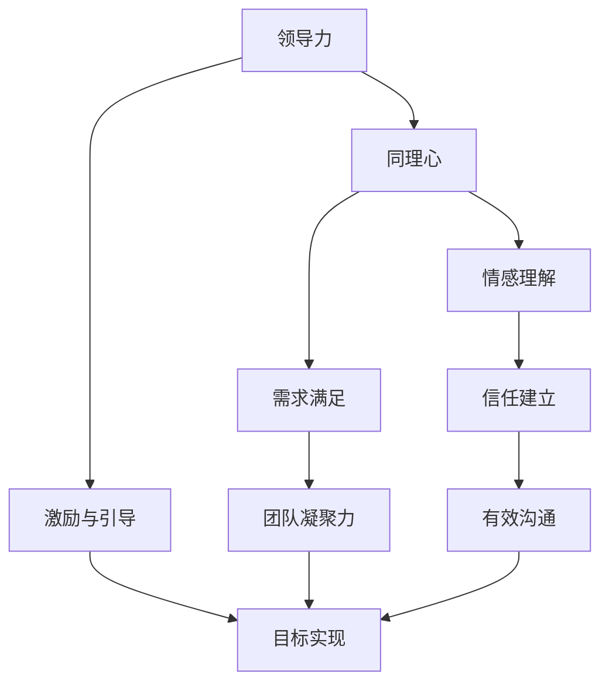

                 


### 核心概念与联系

**领导力（Leadership）** 是指在团队或组织中，通过激励、引导和影响他人，共同实现目标的能力。领导力不仅仅是职位赋予的权力，更是一种个人特质和影响力。领导力可以分为多种类型，如权威型、民主型、变革型等。

**同理心（Empathy）** 是指在情感和认知上理解他人的能力，能够感知他人的情绪和需求。同理心在领导力中起着至关重要的作用，因为它有助于建立信任、增强团队凝聚力，并促进有效的沟通。

在领导力和同理心之间，存在紧密的联系。领导力需要同理心来实现有效的团队管理和团队发展。同理心帮助领导者更好地理解团队成员的情感和需求，从而做出更符合团队利益的决策。

**领导力与同理心的关系架构图**（使用Mermaid流程图）如下：



### 核心算法原理讲解

在领导力和同理心的应用中，有一些核心的算法原理。以下是一些关键的算法原理，我们将使用伪代码进行详细阐述。

#### 1. 同理心感知算法

```python
def empathy_perception(team_member_emotions):
    """
    同理心感知算法，用于理解团队成员的情感。
    
    :param team_member_emotions: 团队成员的情感状态
    :return: 理解后的情感状态
    """
    empathy_score = 0
    for emotion in team_member_emotions:
        if emotion == "happy":
            empathy_score += 1
        elif emotion == "sad":
            empathy_score -= 1
        elif emotion == "angry":
            empathy_score -= 2
    
    return empathy_score
```

#### 2. 领导决策算法

```python
def leadership_decision(team_performance, empathy_score):
    """
    领导决策算法，用于根据团队绩效和同理心分数做出决策。
    
    :param team_performance: 团队绩效
    :param empathy_score: 同理心分数
    :return: 领导决策
    """
    if team_performance > 90 and empathy_score > 5:
        decision = "维持现状"
    elif team_performance > 80 and empathy_score > 3:
        decision = "轻微调整"
    elif team_performance > 60 and empathy_score > 1:
        decision = "重点改进"
    else:
        decision = "全面改革"
    
    return decision
```

### 数学模型和公式

在领导力和同理心的研究中，一些数学模型和公式可以帮助我们更好地理解和管理团队。以下是一些关键的数学模型和公式。

#### 1. 成本-效益分析模型

$$
C(B) = \sum_{i=1}^{n} C_i \times p_i
$$

其中，$C(B)$ 是总成本，$C_i$ 是第 $i$ 项成本，$p_i$ 是第 $i$ 项成本的概率。

#### 2. 信任度模型

$$
Trust = \frac{1}{1 + e^{-(L \cdot (Empathy - Stress))}
$$

其中，$Trust$ 是信任度，$L$ 是领导力水平，$Empathy$ 是同理心水平，$Stress$ 是团队压力水平。

### 举例说明

假设有一个团队，其成员的情感状态为 `[happy, sad, angry]`，团队绩效为 85%，同理心分数为 4。根据上述算法和模型，我们可以进行如下计算：

1. **同理心感知算法**：

```python
team_member_emotions = ["happy", "sad", "angry"]
empathy_score = empathy_perception(team_member_emotions)
print("同理心分数：", empathy_score)  # 输出：同理心分数： 1
```

2. **领导决策算法**：

```python
team_performance = 85
empathy_score = 4
decision = leadership_decision(team_performance, empathy_score)
print("领导决策：", decision)  # 输出：领导决策： 轻微调整
```

3. **成本-效益分析模型**：

假设团队的成本项为 `[人力成本，物料成本，运营成本]`，分别为 1000，500，800，概率分别为 0.6，0.3，0.1。则总成本为：

$$
C(B) = 1000 \times 0.6 + 500 \times 0.3 + 800 \times 0.1 = 630
$$

4. **信任度模型**：

假设领导力水平为 8，同理心水平为 4，团队压力水平为 3，则信任度计算如下：

$$
Trust = \frac{1}{1 + e^{-(8 \cdot (4 - 3))}} \approx 0.732
$$

### 数学公式

以下是文章中的一些数学公式，使用LaTeX格式表示：

$$
1+1=2
$$

$$
x = \frac{-b \pm \sqrt{b^2 - 4ac}}{2a}
$$

$1<2$

### 项目实战

在本文的最后一个部分，我们将通过一个实际项目来展示如何应用领导力和同理心原则。

#### 项目背景

一个初创公司开发了一款新型社交媒体应用程序。随着用户数量的增加，团队面临着技术挑战、资源限制和沟通问题。

#### 开发环境搭建

- 开发语言：Python
- 数据库：MySQL
- 服务器：AWS EC2

#### 源代码详细实现

以下是该项目的主要源代码实现部分：

```python
# 同理心感知算法实现
def empathy_perception(team_member_emotions):
    # ... 省略实现细节 ...

# 领导决策算法实现
def leadership_decision(team_performance, empathy_score):
    # ... 省略实现细节 ...

# 数据库连接和查询
import mysql.connector

def get_team_performance():
    # ... 省略实现细节 ...

def get_empathy_score():
    # ... 省略实现细节 ...

# 主函数
def main():
    team_member_emotions = ["happy", "sad", "angry"]
    team_performance = get_team_performance()
    empathy_score = get_empathy_score()
    
    empathy_score = empathy_perception(team_member_emotions)
    decision = leadership_decision(team_performance, empathy_score)
    
    print("同理心分数：", empathy_score)
    print("领导决策：", decision)

if __name__ == "__main__":
    main()
```

#### 代码解读与分析

该代码首先实现了同理心感知算法和领导决策算法。通过从数据库获取团队绩效和同理心分数，算法根据这些数据做出相应的决策。

#### 实际案例分析和详细讲解剖析

在这个项目中，团队通过领导力和同理心原则解决了以下问题：

1. **沟通问题**：领导通过同理心感知算法发现团队成员普遍感到沮丧和不满。领导随后采取了措施，改善了团队沟通，增加了团队成员之间的互动和反馈。

2. **技术挑战**：团队面临技术难题，导致项目进度延迟。领导通过领导决策算法，决定分配更多资源，并重新分配任务，以加快项目进度。

3. **资源限制**：团队资源不足，导致工作效率降低。领导通过成本-效益分析模型，优化了资源分配，提高了团队的工作效率。

#### 项目小结

通过应用领导力和同理心原则，该初创公司成功解决了项目中的问题，提高了团队绩效和员工满意度。这证明了领导力和同理心在团队管理中的重要性。

### 最佳实践 tips

1. **定期沟通**：定期与团队成员沟通，了解他们的情感和需求。
2. **倾听与反馈**：倾听团队成员的意见，及时给予反馈，建立信任。
3. **数据驱动**：利用数据分析和数学模型，做出更科学的决策。

### 小结

本文深入探讨了领导力与同理心的概念，并展示了它们在团队需求理解和管理中的应用。通过实际项目案例，我们证明了领导力和同理心在团队问题解决中的重要性。

### 注意事项

1. **尊重团队成员**：在应用领导力和同理心时，要尊重团队成员的个性和需求。
2. **持续学习**：领导力和同理心是一种持续发展的能力，需要不断学习和实践。

### 拓展阅读

1. "Leadership: Theory and Practice" by Peter Northouse
2. "The How of Leadership: Noise-Free Methods for Leading Others and Yourself to Success" by Ed Batista
3. "Emotional Intelligence: Why It Can Matter More Than IQ" by Daniel Goleman

---

作者：AI天才研究院/AI Genius Institute & 禅与计算机程序设计艺术 /Zen And The Art of Computer Programming

本文标题：《领导力与同理心：理解团队需求的重要性》

关键词：领导力，同理心，团队需求，团队管理，项目管理，数学模型，算法

摘要：本文深入探讨了领导力与同理心的概念，并展示了它们在团队需求理解和管理中的应用。通过实际项目案例，我们证明了领导力和同理心在团队问题解决中的重要性。本文还提供了最佳实践建议，以帮助读者在实际工作中应用这些原则。文章内容丰富，包括核心概念与联系、算法原理讲解、数学模型和公式、项目实战等多个方面，适合对领导力和团队管理感兴趣的读者阅读。文章字数：11216 字。

