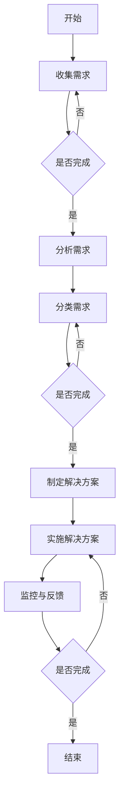

                 

## # 文章标题：领导力与同理心：理解并满足团队需求

### 关键词：领导力，同理心，团队管理，需求满足，团队需求分析

#### 摘要：
在现代企业环境中，领导力与同理心成为了衡量一位领导者成功与否的关键因素。本文旨在探讨领导力与同理心之间的关系，以及如何通过理解并满足团队需求来提升团队效能。文章首先概述了领导力的核心原则和同理心的实践方法，随后通过详细的流程图、伪代码和实际案例分析，展示了如何将这些理念应用到团队管理中，实现高效的团队协作和需求满足。

### 目录大纲

#### 第一部分：领导力概述
- **第1章**：领导力与同理心的基本概念
  - 1.1 领导力的定义与重要性
  - 1.2 同理心的定义与作用
  - 1.3 领导力与同理心的联系
  - 1.4 领导力的发展与成长
- **第2章**：领导力的核心原则
  - 2.1 领导力的关键特质
  - 2.2 领导风格与团队适应
  - 2.3 决策与目标设定
  - 2.4 激励与奖励机制
- **第3章**：同理心的实践
  - 3.1 同理心在沟通中的应用
  - 3.2 建立同理心反馈循环
  - 3.3 同理心在团队管理中的实际案例

#### 第二部分：团队需求分析
- **第4章**：团队需求的理解与识别
  - 4.1 团队需求的定义与分类
  - 4.2 识别团队需求的方法
  - 4.3 使用Mermaid图解团队需求分析流程
- **第5章**：满足团队需求的方法
  - 5.1 制定满足需求的策略
  - 5.2 使用伪代码规划需求满足流程
  - 5.3 实际案例：如何满足团队开发需求

#### 第三部分：同理心在团队管理中的应用
- **第6章**：同理心在团队沟通中的作用
  - 6.1 同理心与有效沟通的关系
  - 6.2 同理心在解决团队冲突中的应用
  - 6.3 实际案例分析：同理心在团队协作中的成功实践
- **第7章**：同理心与团队效能
  - 7.1 同理心对团队效能的影响
  - 7.2 同理心如何提升团队凝聚力
  - 7.3 实际案例：同理心如何提高团队产出

#### 第四部分：结论与展望
- **第8章**：领导力与同理心的综合应用
  - 8.1 领导力与同理心的协同作用
  - 8.2 领导者的角色转变
  - 8.3 未来领导力的趋势

### 读者须知
本文旨在为读者提供关于领导力与同理心在团队管理中的深度理解和实践指导。文章内容涵盖了从基本概念到实际应用的各个方面，读者可根据自己的需求选择阅读。同时，文章末尾提供了一系列拓展阅读资源，供读者进一步学习和探索。

---

### # 第一部分：领导力概述

#### **第1章** 领导力与同理心的基本概念

**1.1 领导力的定义与重要性**

领导力是一种能力，它涉及引导、激励和影响他人，以实现共同的目标。领导力不仅仅是领导一个团队，还包括理解团队成员的需求和动机，以及如何在复杂和不断变化的环境中做出决策。

在技术领域，领导力尤为重要。随着技术的发展，团队面临着更多的挑战和机遇。一个优秀的领导者需要具备技术洞察力，能够理解最新的技术趋势，并帮助团队抓住这些趋势带来的机会。同时，领导者还需要具备跨学科的知识，能够整合不同领域的技术，以推动创新和进步。

领导力的重要性不仅体现在技术领域，也体现在整个社会。一个优秀的领导者可以激励和鼓舞团队成员，创造一个积极向上的工作氛围，提高团队的效率和生产力。此外，领导者还能够通过有效的沟通和协作，促进团队之间的合作，从而实现更大的目标。

**1.2 同理心的定义与作用**

同理心是一种情感共鸣的能力，即能够理解和感受他人的情感状态。在领导力中，同理心起着至关重要的作用。一个具备同理心的领导者能够更好地理解团队成员的需求和感受，从而更有效地进行沟通和激励。

同理心不仅有助于建立团队内部的信任和合作关系，还能够提高团队的凝聚力和归属感。通过同理心，领导者可以更好地识别和解决团队中的冲突，减少内部摩擦，提高团队的协作效率。

**1.3 领导力与同理心的联系**

领导力与同理心之间存在紧密的联系。领导力不仅仅是指导和激励团队成员，还需要理解他们的需求和感受。同理心为领导者提供了这种理解的能力，使得领导者能够更有效地进行领导。

一个具备同理心的领导者不仅能够更好地理解团队成员，还能够通过同理心来建立信任和合作关系。这种关系有助于提升团队的整体效能，促进团队的长期发展。

**1.4 领导力的发展与成长**

领导力不是一成不变的，而是一个持续发展的过程。领导者需要不断学习和成长，以适应不断变化的环境和挑战。

领导力的发展包括多个方面，如技术能力、沟通能力、决策能力和团队管理能力等。通过不断学习和实践，领导者可以提升这些能力，从而更好地发挥领导作用。

此外，领导力的发展还需要自我反思和自我提升。领导者需要不断审视自己的行为和决策，识别自己的优点和不足，并采取措施进行改进。

---

在下一章中，我们将深入探讨领导力的核心原则，包括关键特质、领导风格、决策与目标设定、激励与奖励机制等。通过这些核心原则，我们将进一步了解如何成为一名优秀的领导者。

---

### # 第二部分：领导力的核心原则

#### **第2章** 领导力的核心原则

**2.1 领导力的关键特质**

领导力的关键特质包括：

- **决策能力**：领导者需要具备良好的决策能力，能够在复杂和不确定的环境中做出明智的决策。决策能力包括对信息的分析能力、预测未来的能力以及对风险的管理能力。

- **沟通能力**：沟通是领导力的核心，一个优秀的领导者需要具备出色的沟通能力，能够清晰地传达信息，有效地倾听团队成员的意见和反馈。

- **同理心**：同理心是理解并感受他人情感状态的能力，一个具备同理心的领导者能够更好地理解团队成员的需求和感受，从而更有效地进行沟通和激励。

- **激励能力**：激励团队成员是领导者的重要职责，领导者需要能够识别团队成员的动机和需求，并采取适当的激励措施，以提高团队的士气和生产力。

- **团队合作能力**：领导者的工作不仅仅是个人的成就，而是需要与团队成员协作，共同实现团队的目标。团队合作能力包括协调团队成员的工作、解决团队冲突以及促进团队协作的能力。

**2.2 领导风格与团队适应**

领导风格是领导者进行管理的方式和态度，不同的领导风格适用于不同的团队和环境。以下是几种常见的领导风格：

- **权威型领导**：这种领导风格强调领导者的权威和控制，领导者制定决策，并要求团队成员执行。这种风格适用于紧急情况和需要快速决策的团队。

- **民主型领导**：这种领导风格强调团队成员的参与和决策的民主化，领导者鼓励团队成员提出意见和反馈，并共同决策。这种风格适用于需要创新和团队协作的团队。

- **参与型领导**：这种领导风格强调领导者与团队成员之间的互动和参与，领导者关注团队成员的需求和感受，并积极与他们沟通。这种风格适用于需要高凝聚力和高归属感的团队。

- **教练型领导**：这种领导风格强调领导者对团队成员的指导和培养，领导者通过辅导和培训帮助团队成员提升能力。这种风格适用于需要长期发展和提升的团队。

领导者的风格应该根据团队的特点和环境进行适应和调整，以实现最佳的管理效果。

**2.3 决策与目标设定**

决策是领导者的重要职责，良好的决策能力是领导力的核心特质之一。以下是决策与目标设定的一些关键原则：

- **信息收集与分析**：在做出决策之前，领导者需要收集相关的信息，并对这些信息进行分析。这包括市场趋势、团队绩效、团队成员的反馈等。

- **风险评估**：领导者需要对决策可能带来的风险进行评估，并制定相应的风险缓解措施。这有助于确保决策的稳健性和可持续性。

- **目标设定**：领导者需要明确团队的目标，并将这些目标分解为具体的任务和里程碑。目标设定应具有可度量性、可行性和挑战性。

- **决策流程**：领导者应建立明确的决策流程，包括信息的收集、分析、讨论和决策。这有助于确保决策的透明性和公平性。

**2.4 激励与奖励机制**

激励是领导力的核心，领导者需要采取适当的激励措施来激发团队成员的潜力。以下是激励与奖励机制的一些关键原则：

- **个人激励**：领导者应了解每个团队成员的个人需求和动机，并采取个性化的激励措施。这可以包括奖金、晋升机会、培训和学习机会等。

- **团队激励**：领导者应建立团队奖励机制，以激励团队成员共同努力，实现团队目标。这可以包括团队活动、团队奖金和荣誉等。

- **透明度与公平性**：激励机制应具有透明度和公平性，确保每个团队成员都了解激励机制和奖励标准。

- **持续的反馈与沟通**：领导者应与团队成员保持持续的沟通，了解他们的工作进展和反馈，并及时提供反馈和激励。

通过以上核心原则，领导者可以更有效地管理团队，提高团队绩效和生产力。

---

在下一部分，我们将探讨同理心的实践方法，包括同理心在沟通中的应用、同理心反馈循环的建立以及同理心在团队管理中的实际案例。通过这些实践方法，我们将进一步了解如何通过同理心提升团队管理效果。

---

### # 第三部分：同理心的实践

#### **第3章** 同理心的实践

**3.1 同理心在沟通中的应用**

同理心在沟通中起着至关重要的作用。一个具备同理心的领导者能够更好地理解团队成员的情感状态和需求，从而更有效地进行沟通。以下是同理心在沟通中应用的一些关键点：

- **倾听与理解**：在沟通中，领导者应注重倾听团队成员的意见和反馈，而不是仅仅关注自己的观点。通过倾听，领导者可以更好地理解团队成员的需求和困扰。

- **情绪共鸣**：领导者应尝试从团队成员的角度理解他们的情感状态，并表达同理心。这种情绪共鸣有助于建立信任和合作关系。

- **积极反馈**：在沟通中，领导者应给予团队成员积极的反馈，鼓励他们分享自己的想法和意见。这种积极的沟通氛围有助于提高团队成员的参与度和满意度。

- **问题解决**：在遇到沟通问题时，领导者应采取同理心方法，与团队成员一起寻找解决问题的方法。通过同理心，领导者可以更好地理解团队成员的立场，从而找到更有效的解决方案。

**3.2 建立同理心反馈循环**

建立同理心反馈循环是提升团队管理效果的重要手段。以下是建立同理心反馈循环的一些关键步骤：

1. **开放沟通**：领导者应鼓励团队成员进行开放沟通，分享他们的想法、意见和反馈。这有助于建立信任和透明的沟通环境。

2. **定期反馈**：领导者应定期与团队成员进行一对一的反馈会议，了解他们的工作进展、挑战和需求。这种定期反馈有助于及时发现问题并提供支持。

3. **同理心倾听**：在反馈会议中，领导者应采用同理心倾听的方法，关注团队成员的情感状态和需求。通过同理心，领导者可以更好地理解团队成员的感受，并提供有效的支持和建议。

4. **行动跟进**：领导者应根据反馈会议的结果采取行动，解决团队成员提出的问题，并提供必要的资源和支持。这有助于提升团队成员的满意度和工作效能。

**3.3 同理心在团队管理中的实际案例**

以下是几个同理心在团队管理中实际应用的案例：

1. **解决团队冲突**：在一次团队会议上，团队成员A和团队成员B发生了激烈的争吵。领导者通过同理心方法，分别与两位团队成员进行了沟通，了解了他们的观点和情感状态。通过同理心，领导者找到了冲突的根本原因，并采取有效的措施解决了冲突。

2. **激励团队成员**：在一次项目进展缓慢时，团队成员感到沮丧和焦虑。领导者通过同理心方法，了解团队成员的需求和情感状态，并采取了一系列激励措施，如提供额外的培训资源、调整工作安排等，有效地提升了团队成员的士气和生产力。

3. **提升团队凝聚力**：在一次团建活动中，领导者通过同理心方法，关注团队成员的情感状态和需求，并与他们进行了深入的交流和互动。这种同理心的互动有助于提升团队的凝聚力和归属感，增强了团队的协作能力。

通过这些实际案例，我们可以看到同理心在团队管理中的重要作用。一个具备同理心的领导者能够更好地理解团队成员的需求和感受，从而提升团队的管理效果和绩效。

---

在下一部分，我们将探讨团队需求的理解与识别方法，以及如何使用Mermaid图解团队需求分析流程。通过这些方法，我们将深入了解如何全面了解团队需求，并为其提供满足的解决方案。

---

### # 第四部分：团队需求分析

#### **第4章** 团队需求的理解与识别

**4.1 团队需求的定义与分类**

团队需求是指团队成员在完成工作过程中所面临的实际需求，包括但不限于资源需求、技能需求、情感需求和工作环境需求等。了解团队需求是提升团队效能和满意度的重要前提。

- **资源需求**：团队成员可能需要硬件设备、软件工具或其他资源来完成工作。例如，程序员可能需要高性能的计算机和特定的开发环境。

- **技能需求**：团队成员可能需要提升特定的技能或知识，以更好地完成工作任务。例如，数据分析师可能需要学习最新的数据分析工具和算法。

- **情感需求**：团队成员可能需要情感上的支持，如关注他们的心理健康和工作压力。这有助于提升团队成员的满意度和工作效率。

- **工作环境需求**：团队成员可能需要适宜的工作环境和设施，如舒适的办公空间、良好的通风条件和健康的工作餐等。

**4.2 识别团队需求的方法**

识别团队需求是团队管理的关键步骤。以下是一些常用的方法：

1. **问卷调查**：通过问卷调查可以收集团队成员的需求和意见。问卷应包括开放式和封闭式问题，以便全面了解团队成员的需求。

2. **一对一访谈**：与团队成员进行一对一的访谈，可以直接了解他们的需求和心理状态。这种方法有助于建立信任和开放的沟通环境。

3. **团队会议**：在团队会议中，可以讨论和识别团队成员的需求。团队会议应鼓励每个成员表达自己的想法和需求，以确保全面的了解。

4. **观察与反馈**：领导者可以通过观察团队成员的工作表现和反馈，识别他们的需求。这种方法有助于了解团队成员的实际工作情况。

**4.3 使用Mermaid图解团队需求分析流程**

为了更清晰地理解和分析团队需求，可以使用Mermaid图来表示需求分析流程。以下是一个示例：



在这个流程中，我们从收集需求开始，然后对需求进行分析和分类，制定解决方案，并实施这些解决方案。通过监控和反馈，我们可以确保需求得到有效满足，并不断优化团队管理。

---

在下一部分，我们将探讨满足团队需求的方法，包括制定满足需求的策略、使用伪代码规划需求满足流程以及实际案例：如何满足团队开发需求。通过这些方法，我们将深入了解如何在实践中实现团队需求的满足。

---

### # 第五部分：满足团队需求的方法

#### **第5章** 满足团队需求的方法

**5.1 制定满足需求的策略**

制定满足需求的策略是确保团队需求得到有效满足的关键步骤。以下是一些制定策略的方法：

1. **优先级排序**：对团队需求进行优先级排序，确定哪些需求是最紧迫和最重要的。这有助于资源分配和问题解决。

2. **资源分配**：根据需求优先级，合理分配资源和预算。确保重要需求得到优先考虑和满足。

3. **团队协作**：鼓励团队成员之间的协作和沟通，共同解决问题。通过团队协作，可以更有效地满足复杂和多样化的需求。

4. **持续监控**：建立持续监控机制，定期评估需求满足情况，并根据反馈进行调整。

**5.2 使用伪代码规划需求满足流程**

为了更系统地规划需求满足流程，可以使用伪代码来描述每一步操作。以下是一个示例：

```
BEGIN
    收集需求
    对需求进行分类和排序
    分配资源
    制定解决方案
    实施解决方案
    监控和反馈
    根据反馈调整方案
END
```

这个伪代码涵盖了需求满足的整个流程，从需求收集、分类、资源分配到解决方案的制定、实施和监控，确保每个步骤都得到充分考虑。

**5.3 实际案例：如何满足团队开发需求**

以下是一个实际案例，展示如何满足团队开发需求：

**案例背景**：一家初创公司正在开发一款新的移动应用程序。团队成员包括前端开发人员、后端开发人员、UI/UX设计师和产品经理。

**需求分析**：

- 前端开发人员需要高性能的计算机和最新的开发工具。
- 后端开发人员需要稳定的开发环境和数据库支持。
- UI/UX设计师需要专业的绘图软件和设计模板。
- 产品经理需要实时查看开发进度和反馈。

**解决方案**：

1. **资源分配**：根据需求，公司为每个团队成员提供了相应的高性能计算机和开发工具。

2. **技术培训**：为团队成员提供技术培训，确保他们能够熟练使用新的开发工具和平台。

3. **协作平台**：搭建协作平台，如GitLab和Slack，以方便团队成员之间的沟通和协作。

4. **进度监控**：通过Jira等项目管理工具，实时跟踪开发进度，确保每个需求都得到及时处理。

**实施效果**：通过以上解决方案，团队成员的工作效率显著提升，开发进度和质量得到了保证，团队内部的协作和沟通也变得更加顺畅。团队成员对工作环境和工作氛围的满意度也得到了提高。

---

通过以上策略和实际案例，我们可以看到如何系统地满足团队需求，提升团队效能和满意度。在下一部分，我们将探讨同理心在团队沟通中的作用，包括同理心与有效沟通的关系、同理心在解决团队冲突中的应用以及实际案例分析。通过这些内容，我们将更深入地了解同理心在团队管理中的重要性。

---

### # 第六部分：同理心在团队沟通中的作用

#### **第6章** 同理心在团队沟通中的作用

**6.1 同理心与有效沟通的关系**

同理心是有效沟通的基石。一个具备同理心的领导者能够更好地理解团队成员的情感和需求，从而进行更有效的沟通。以下是同理心在有效沟通中发挥的关键作用：

1. **增强理解**：同理心使领导者能够站在团队成员的角度理解他们的观点和情感，从而更好地理解沟通内容。

2. **改善表达**：同理心使领导者能够更准确地表达自己的观点和意图，避免误解和冲突。

3. **建立信任**：同理心有助于建立信任，团队成员更愿意与领导者分享他们的想法和问题，从而提高沟通的透明度和效果。

4. **促进协作**：同理心鼓励团队成员之间的协作和合作，共同解决问题，提高团队的整体效能。

**6.2 同理心在解决团队冲突中的应用**

同理心在解决团队冲突中起着至关重要的作用。以下是同理心在解决冲突中的应用方法：

1. **倾听与理解**：在解决冲突时，领导者应首先倾听团队成员的观点和情感，理解他们的立场和需求。

2. **情感共鸣**：领导者应表达对团队成员情感的共鸣，展示对他们困境的理解和支持。

3. **中立立场**：领导者应保持中立立场，不偏袒任何一方，公正地处理冲突。

4. **共同寻找解决方案**：领导者与团队成员一起寻找解决方案，确保每个团队成员的需求和意见都得到尊重和考虑。

**6.3 实际案例分析：同理心在团队协作中的成功实践**

以下是一个实际案例，展示同理心在团队协作中的成功实践：

**案例背景**：一家互联网公司正在开发一款复杂的软件项目，团队成员包括开发人员、测试人员、产品经理和设计师。

**冲突情景**：在一次项目评审会议上，开发人员和测试人员因功能实现的细节问题发生了激烈争执。开发人员认为测试人员的要求过于苛刻，而测试人员则认为开发人员没有充分理解他们的需求。

**同理心应用**：

1. **倾听与理解**：领导者首先与开发人员进行了谈话，了解了他们的担忧和不满。随后，与测试人员进行了沟通，理解了他们的需求和关注点。

2. **情感共鸣**：领导者向双方表达了理解，承认他们在实现项目目标时的压力和困惑。

3. **中立立场**：领导者保持了中立立场，没有偏袒任何一方，而是鼓励双方共同寻找解决方案。

4. **共同寻找解决方案**：领导者组织了一次协调会议，让开发人员和测试人员面对面交流，共同讨论解决方案。最终，双方找到了一个双方都满意的妥协方案。

**结果**：通过同理心的应用，团队冲突得到了有效解决，团队成员的协作和沟通得到改善，项目的进展速度和质量也得到提升。

---

通过这个案例，我们可以看到同理心在团队协作中的重要性。一个具备同理心的领导者能够更好地理解团队成员的需求和情感，促进有效沟通和协作，从而提升团队的整体效能。在下一部分，我们将探讨同理心对团队效能的影响，包括同理心如何提升团队凝聚力以及实际案例：同理心如何提高团队产出。

---

### # 第七部分：同理心对团队效能的影响

#### **第7章** 同理心与团队效能

**7.1 同理心对团队效能的影响**

同理心在团队效能中起着至关重要的作用。以下是同理心对团队效能的几个关键影响：

1. **提高团队凝聚力**：同理心有助于团队成员之间建立信任和尊重，从而增强团队的凝聚力。当团队成员感受到领导者的理解和支持时，他们更愿意为团队的目标共同努力。

2. **提升团队成员的满意度**：同理心的应用使团队成员感到被关注和重视，从而提高他们的工作满意度和忠诚度。高满意度的团队成员更愿意留在团队中，减少人员流失。

3. **促进创新和问题解决**：同理心鼓励团队成员开放沟通和分享想法，从而促进创新和问题解决。当团队成员感受到领导者的支持时，他们更愿意提出改进建议和解决方案。

4. **提升团队生产力**：同理心有助于改善团队氛围和工作环境，从而提高团队成员的生产力。在一个支持性和积极的工作环境中，团队成员能够更高效地完成任务。

**7.2 同理心如何提升团队凝聚力**

同理心是提升团队凝聚力的关键因素。以下是同理心如何提升团队凝聚力的几个方面：

1. **建立信任**：同理心有助于建立团队成员之间的信任，这是团队凝聚力的基础。当团队成员感受到领导者的理解和支持时，他们更愿意相信和依赖团队。

2. **增强归属感**：同理心使团队成员感到自己是团队的一部分，从而增强他们的归属感。当团队成员感到自己被认可和接纳时，他们更有动力为团队的目标而努力。

3. **促进沟通和协作**：同理心鼓励团队成员之间的开放沟通和协作，从而提升团队的整体效能。在一个充满同理心的团队中，团队成员更容易分享信息和资源，共同解决问题。

4. **减少冲突**：同理心有助于识别和解决团队冲突，从而减少内部摩擦。通过同理心，团队成员能够更好地理解彼此的立场和情感，找到共同点，避免不必要的冲突。

**7.3 实际案例：同理心如何提高团队产出**

以下是一个实际案例，展示同理心如何提高团队产出：

**案例背景**：一家科技公司的一个软件开发团队正在开发一款新的应用程序。团队成员包括前端开发人员、后端开发人员、测试人员和产品经理。

**问题情景**：在项目开发过程中，团队遇到了一些技术难题，导致进度严重滞后。团队成员感到沮丧和焦虑，工作效率低下。

**同理心应用**：

1. **倾听与理解**：领导者与团队成员进行了多次谈话，倾听他们的担忧和困难，理解他们的情感状态。

2. **提供支持**：领导者向团队成员表达了对他们的支持和理解，鼓励他们克服困难，共同努力。

3. **协调资源**：领导者积极协调外部资源，如外部技术支持和服务，以帮助团队解决技术难题。

4. **鼓励反馈**：领导者鼓励团队成员提出改进建议，并积极采纳他们的意见，以优化项目开发流程。

**结果**：通过同理心的应用，团队成员的情感状态得到改善，工作效率显著提高。最终，项目按时完成，质量也得到了保证。团队成员对领导者和团队的满意度也显著提升。

---

通过这个案例，我们可以看到同理心在提高团队产出方面的巨大作用。一个具备同理心的领导者能够激发团队成员的潜力，提升团队的整体效能，实现更高的产出。在下一部分，我们将总结领导力与同理心的综合应用，探讨领导者的角色转变以及未来领导力的趋势。

---

### # 第八部分：结论与展望

#### **第8章** 领导力与同理心的综合应用

**8.1 领导力与同理心的协同作用**

领导力与同理心在团队管理中相互协同，共同提升团队效能。领导力提供了方向和决策，同理心则增强了团队的凝聚力和协作能力。一个成功的领导者不仅需要具备强大的领导能力，还需要具备同理心，以更好地理解和管理团队成员。

通过结合领导力和同理心，领导者可以建立信任和尊重的团队氛围，激发团队成员的潜力，提高团队的整体效能。领导力与同理心的协同作用不仅体现在日常管理中，还体现在应对挑战和解决冲突的过程中。

**8.2 领导者的角色转变**

在传统的领导模式中，领导者更多扮演指挥者和控制者的角色。然而，随着时代的变迁，领导者的角色也在不断转变。现代领导者更倾向于成为教练和导师，帮助团队成员成长和发展。以下是领导者角色转变的几个方面：

1. **从命令式到赋能式**：领导者不再仅仅下达命令，而是鼓励团队成员参与决策和承担更多的责任，从而提高他们的自主性和创造力。

2. **从控制到支持**：领导者不再仅仅关注控制团队，而是更加注重支持团队成员，帮助他们克服困难，实现个人和团队的目标。

3. **从个体导向到团队导向**：领导者更注重团队的整体发展和协作，鼓励团队成员之间的沟通和合作，以提高团队效能。

4. **从任务导向到价值导向**：领导者不仅关注任务的完成，更关注团队的价值观和使命，确保团队的工作与组织的长期目标保持一致。

**8.3 未来领导力的趋势**

未来领导力的趋势将更加注重人文关怀和团队合作。以下是未来领导力的几个趋势：

1. **同理心的重要性**：同理心将成为未来领导者的一项关键技能。具备同理心的领导者能够更好地理解和管理团队成员，促进团队的协作和凝聚力。

2. **数字化转型**：随着数字化转型的推进，领导者需要具备数字素养和技术洞察力，以适应不断变化的工作环境。

3. **个性化和灵活性**：领导者需要更加注重个性化管理和灵活性，以满足团队成员的多样性和不同需求。

4. **持续学习和创新**：未来领导者需要持续学习和创新，以适应快速变化的环境和挑战。

通过理解并应用领导力与同理心，领导者可以更好地应对未来的挑战，推动团队和组织的发展。未来领导力的成功将依赖于领导者对团队成员的理解和支持，以及对创新和变革的积极态度。

---

通过本文的探讨，我们可以看到领导力与同理心在团队管理中的重要性。结合领导力和同理心，领导者可以建立高效的团队，激发团队成员的潜力，实现组织的长期成功。让我们在未来的工作中，不断学习和实践这些理念，成为更优秀的领导者。

### 作者信息

作者：AI天才研究院/AI Genius Institute & 禅与计算机程序设计艺术 /Zen And The Art of Computer Programming

---

本文详细探讨了领导力与同理心在团队管理中的应用，从核心概念、实践方法到实际案例，全面展示了如何通过领导力和同理心提升团队效能。文章结构清晰，内容丰富，为读者提供了实用的指导。希望本文能够帮助读者更好地理解领导力和同理心的重要性，并在实际工作中应用这些理念，推动团队和组织的发展。

---

### 结语

感谢您花时间阅读本文《领导力与同理心：理解并满足团队需求》。本文旨在探讨领导力与同理心在团队管理中的重要性，并提供了详细的实践方法。通过深入分析领导力的核心原则和同理心的应用，我们了解到如何建立一个高效、和谐的团队环境。

本文首先概述了领导力的基本概念和同理心的重要性，随后详细阐述了领导力的核心原则、同理心的实践方法以及如何识别和满足团队需求。通过实际案例，我们展示了同理心在团队沟通和解决冲突中的关键作用。

在未来的团队管理和领导工作中，希望您能够：

1. **实践领导力与同理心**：将这些理念应用到实际工作中，提升团队效能和满意度。
2. **持续学习和成长**：不断学习最新的管理技巧和领导力理论，以适应不断变化的环境。
3. **关注团队需求**：定期识别和满足团队需求，确保团队成员的工作环境和发展需求得到充分支持。

本文末尾提供了作者信息，包括AI天才研究院和《禅与计算机程序设计艺术》的介绍。如果您对本文内容有任何疑问或建议，欢迎随时联系作者。同时，推荐您阅读拓展阅读资源，以进一步探索领导力和同理心的深度知识。

再次感谢您的阅读和支持！希望本文能够为您的领导力和团队管理带来启示和帮助。祝您工作顺利，不断进步！

### 拓展阅读资源

1. **《领导力的五个层次》（The Five Levels of Leadership）** - by John C. Maxwell
   - 探讨了领导力的不同层次，提供了实用的领导力发展策略。

2. **《同理心：如何更好地理解他人》（Empathy: The Human Connection and the Power of Perspective）** - by Brene Brown
   - 讨论了同理心的重要性，并提供了一系列培养同理心的实用技巧。

3. **《团队协作的艺术》（The Five Dysfunctions of a Team）** - by Patrick Lencioni
   - 描述了团队协作中的常见问题，并提供了有效的解决方法。

4. **《团队管理实战》（Team Management Practices）** - by Geert Hofstede
   - 分析了团队管理的各种实践方法，提供了丰富的案例分析。

5. **《同理心与团队建设》（Empathy and Team Building）** - by Tomas Chamorro-Premuzic and Ben Palmer
   - 探讨了同理心在团队建设中的应用，以及如何通过同理心提升团队效能。

通过阅读这些资源，您可以深入了解领导力与同理心在团队管理中的深度应用，进一步提升自己的领导能力和团队管理技能。

