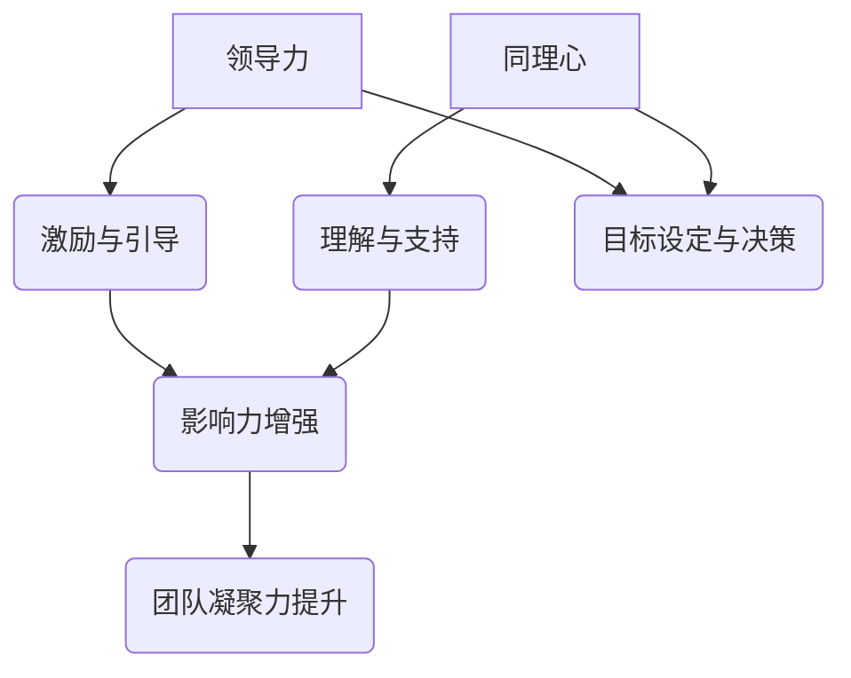

                 

### 引言

在现代IT领域，领导力和同理心成为了衡量优秀领导者能力的重要指标。领导力不仅仅是指管理团队、制定目标、实现目标的能力，更是关于如何激励团队成员、建立团队信任和促进团队协作的综合能力。同理心，则是领导者理解并满足团队成员需求、情感和动机的关键。这两者相辅相成，共同构成了理解并满足团队需求的强大能力。

领导力是一种影响力，它能够激发团队成员的潜力，推动团队达成目标。同理心则是一种感知和理解他人情感和需求的能力，它能够帮助领导者更好地与团队成员沟通、建立信任和减少冲突。在IT领域，技术的快速发展带来了巨大的挑战和机遇，这使得团队需要具备更高的协作能力和更强的创新能力。因此，领导力和同理心的能力在IT团队中显得尤为重要。

本文将深入探讨领导力和同理心的核心概念、基本原理以及它们在团队管理中的应用。首先，我们将定义领导力和同理心，并分析它们之间的联系与区别。接下来，我们将详细讲解领导力的基本原理，包括领导风格、激励理论和沟通技巧。然后，我们将探讨同理心的培养方法，从观察与倾听技巧、情感识别与理解到自我反思与实践。在此基础上，我们将讨论如何识别和满足团队的需求，包括需求识别方法、需求分析与评估以及需求满足策略。最后，我们将通过案例研究和实践指南，提供实用的技巧和方法，帮助领导者在实际工作中提升领导力和同理心。

通过本文的阅读，您将了解到领导力和同理心在IT团队管理中的重要性，掌握相关的基本原理和实践方法，从而成为一位更加出色的领导者。

## 核心概念与联系

领导力与同理心是现代团队管理中至关重要的两个核心概念，它们不仅单独发挥作用，而且在相互配合中展现出了巨大的力量。为了深入理解这两个概念及其关联，我们首先需要明确各自的定义。

### 领导力定义与重要性

领导力是一种通过影响力激励和引导他人实现共同目标的能力。它不仅涉及战略规划和目标设定，更关注如何在复杂多变的环境中激发团队成员的潜力和创造力。领导力的重要性在于，它能够决定一个团队是否能够高效协同工作，达成既定目标。

在IT领域，领导力尤为关键。随着技术的快速发展，IT项目往往涉及复杂的技术栈和多样化的团队成员，领导者需要具备强大的沟通能力、决策能力和协调能力，以确保团队始终保持正确的方向和高效的工作状态。此外，领导力还能够帮助团队在面对挑战和不确定性时保持积极态度，找到解决问题的方法。

### 同理心定义与作用

同理心是一种设身处地为他人着想、理解他人情感和需求的能力。它不仅仅是感性的共鸣，更是一种理性的感知和理解。同理心在领导力中扮演着重要的角色，因为它是建立信任、促进沟通和减少冲突的基础。

在IT团队中，同理心的作用同样不可忽视。通过同理心，领导者能够更好地理解团队成员的困惑、压力和需求，从而提供更加个性化的支持和帮助。这种理解不仅能够提升团队成员的工作满意度，还能够增强团队的凝聚力和协作效率。例如，当团队成员遇到技术难题或面临工作压力时，具备同理心的领导者能够提供情感上的支持和解决方案，帮助他们快速恢复状态。

### 领导力与同理心的联系与区别

领导力与同理心虽然在不同层面上发挥作用，但它们之间有着紧密的联系。具体来说，同理心可以作为领导力的一部分，帮助领导者更好地理解团队成员的需求和情感，从而提高领导效果。同时，领导力也可以通过同理心来增强其影响力，使领导者更具有亲和力和公信力。

然而，领导力与同理心也存在一些区别。领导力主要关注如何通过影响力激励和引导他人，而同理心则更多地关注如何理解和支持他人。在实际应用中，领导者需要平衡这两者，既要保持坚定的目标和决策能力，又要展现出对团队成员的关心和理解。

为了更清晰地理解领导力与同理心的关系，我们可以通过一个Mermaid流程图来展示它们之间的联系与区别：

在这个流程图中，领导力和同理心共同作用，通过激励与引导（B）、理解与支持（D）以及目标设定与决策（F）等环节，最终达到团队凝聚力提升（G）的效果。

通过上述分析，我们可以看到领导力与同理心的紧密联系及其在团队管理中的重要性。在接下来的章节中，我们将进一步探讨领导力的基本原理和同理心的培养方法，帮助读者全面理解和掌握这两个核心概念。

### 领导力的基本原理

领导力是一个复杂且多维度的概念，涉及多个核心原则和实践方法。为了理解并有效运用领导力，我们需要从多个角度进行深入探讨。以下是关于领导力基本原理的详细分析。

#### 领导风格

领导风格是指领导者与团队互动的基本方式，不同风格的领导者会带来不同的管理效果。常见的领导风格包括以下几种：

1. **权威式领导**：领导者具有高度的决策权和控制力，直接指挥团队成员完成任务。这种风格在需要迅速做出决策或应对危机时非常有效，但可能会导致团队成员的自主性和创造力受到限制。
   
2. **民主式领导**：领导者鼓励团队成员参与决策过程，通过集思广益来制定目标和计划。这种风格有助于提升团队的凝聚力和归属感，但决策过程可能较为缓慢。

3. **放任式领导**：领导者放手让团队成员自我管理，不干预具体事务。这种风格适合高度自律和自主性强的团队，但在缺乏指导和监督的情况下可能导致混乱和低效。

4. **变革型领导**：领导者通过激发团队成员的潜力和动机，推动团队实现创新和变革。这种风格在技术快速发展的IT领域中尤为有效，能够激发团队成员的创新精神和团队合作意识。

不同领导风格的选择应根据具体情境和团队特点进行。例如，在紧急情况下，权威式领导可以迅速做出决策；而在需要创新和协作的项目中，变革型领导则能够更好地激发团队的潜力。

#### 激励理论

激励理论是领导力的核心组成部分，用于解释如何通过外部和内部动机激励团队成员。以下是几种重要的激励理论：

1. **马斯洛需求层次理论**：马斯洛将人类需求分为五个层次：生理需求、安全需求、社交需求、尊重需求和自我实现需求。领导者需要根据团队成员的不同需求层次，提供相应的激励措施，如物质奖励、安全保障、团队氛围和职业发展等。

2. **赫茨伯格双因素理论**：赫茨伯格认为，影响员工工作满意度的因素分为两类：一类是“激励因素”（如成就、认可、工作本身），另一类是“保健因素”（如薪酬、工作环境、管理）。只有激励因素得到满足，员工才能获得持续的动力。

3. **期望理论**：期望理论认为，员工的激励程度取决于对努力-绩效、绩效-奖励和奖励-个人目标的期望。领导者需要明确目标、提供清晰的反馈，并确保奖励机制与个人目标相一致，从而激发员工的工作动力。

#### 沟通技巧

沟通技巧是领导力的关键要素之一，有效的沟通能够确保信息准确传递、减少误解和冲突、增强团队凝聚力。以下是几种重要的沟通技巧：

1. **倾听技巧**：倾听不仅仅是听到对方说什么，更重要的是理解对方的意图和情感。领导者需要展现出积极的倾听态度，通过肢体语言和口头反馈来表明自己在认真倾听。

2. **清晰表达**：领导者需要能够清晰、简洁地表达自己的想法和目标，避免使用复杂的技术术语或模糊的语言，确保团队成员能够准确理解。

3. **反馈与反馈技巧**：有效的反馈能够帮助团队成员改进工作、提升能力。领导者需要给予及时、具体、建设性的反馈，同时注意反馈的方式和场合，避免伤害团队成员的自尊心。

4. **冲突管理**：在团队工作中，冲突是不可避免的。领导者需要具备有效的冲突管理技巧，通过沟通、协商和调解，找到解决问题的方法，避免冲突升级。

通过上述分析，我们可以看到领导力基本原理的多样性和复杂性。有效的领导力不仅需要领导者具备一定的理论知识和技能，更需要他们在实际工作中灵活运用，不断调整和优化管理策略。在接下来的章节中，我们将继续探讨同理心的培养方法，帮助领导者更好地理解并满足团队成员的需求。

#### 同理心的培养

同理心是一种复杂的情感和认知过程，它要求领导者不仅能够感知和理解团队成员的情感和需求，还能在此基础上提供适当的反馈和支持。培养同理心需要从观察与倾听技巧、情感识别与理解到自我反思与实践等多个方面进行。以下是详细的培养方法：

### 观察与倾听技巧

1. **观察细节**：领导者需要通过细致的观察，捕捉团队成员的非语言信息，如肢体语言、面部表情和语调变化。这些细微的线索能够提供重要的情感信息，帮助领导者更好地理解团队成员的感受。
   
2. **主动倾听**：倾听不仅仅是听对方说什么，更重要的是理解对方的意图和情感。领导者需要展现出积极的倾听态度，通过肢体语言（如点头、眼神交流）和口头反馈（如“我明白你的意思”）来表明自己在认真倾听。

3. **避免打断**：在团队成员讲话时，领导者应避免打断，给予充分的表达空间。这不仅是对团队成员的尊重，也有助于领导者更全面地了解情况。

### 情感识别与理解

1. **情感识别方法**：领导者可以通过一系列情感识别方法，如情感标签、面部表情识别和语调分析，来识别团队成员的情感状态。例如，当团队成员说话时语调低沉、面部表情严肃，可能表明他们感到沮丧或焦虑。

2. **情感理解**：在识别情感之后，领导者需要进一步理解情感背后的原因和需求。这需要领导者通过提问和讨论，与团队成员建立深入的沟通，从而了解他们的具体需求和问题。

### 自我反思与实践

1. **自我反思**：领导者需要定期进行自我反思，思考自己在同理心培养方面的不足和改进点。这包括回顾过去的互动，分析哪些做法是有效的，哪些需要改进。

2. **实践同理心**：培养同理心需要通过不断的实践来提升。领导者可以在日常工作中，有意识地运用观察与倾听技巧、情感识别与理解等方法，通过具体行动来展示同理心。例如，在团队成员遇到困难时，主动提供帮助和支持。

### 案例分析

为了更好地理解同理心的培养方法，我们可以通过一个实际案例进行详细分析。

**案例背景**：某IT团队正在开发一款复杂的新产品，团队成员张伟负责关键模块的开发。在项目进行到一半时，张伟向团队领导李华反映，自己感到压力巨大，担心无法按时完成任务。

**同理心培养过程**：

1. **观察与倾听**：李华注意到张伟在会议中显得焦虑，语速加快，面部表情紧张。通过主动倾听，李华了解到张伟的具体担忧。

2. **情感识别与理解**：李华通过情感识别方法，意识到张伟可能感到沮丧和焦虑。李华进一步提问，了解到张伟在技术难题上遇到了困难，同时担心会影响整个项目的进度。

3. **自我反思**：李华反思自己在项目管理和沟通中的不足，认识到需要提供更多支持和帮助。

4. **实践同理心**：李华主动与张伟进行了深入的交流，不仅提供了技术上的指导，还鼓励他分享自己的感受。李华表示理解他的困难，并提供了一些建议和资源，帮助他缓解压力。

**结果**：通过同理心的实践，张伟感到受到了尊重和理解，压力得到了缓解。在李华的支持下，他很快找到了解决问题的方法，项目进度也得到了保障。

通过这个案例，我们可以看到同理心在领导力中的重要作用。同理心不仅能够帮助领导者更好地理解团队成员的需求和情感，还能提升团队的凝聚力和工作效率。

#### 团队需求的识别与满足

在团队管理中，识别和满足团队成员的需求是确保团队高效运作和保持成员满意度的关键。以下是识别和满足团队需求的具体方法、步骤以及相关的策略和实践。

### 需求识别方法

1. **调研法**：通过定期的团队调研，收集团队成员的意见和反馈，了解他们的需求和困惑。调研可以采用问卷调查、面对面访谈或小组讨论等形式。

2. **观察法**：领导者通过日常观察团队成员的工作状态和行为，捕捉他们的需求和问题。例如，观察团队成员在工作中的情绪变化、工作效率和协作情况。

3. **反馈机制**：建立有效的反馈机制，鼓励团队成员在遇到问题时及时反馈。这可以是通过邮件、即时通讯工具或团队会议等形式进行。

### 需求分析与评估

1. **需求分类**：对收集到的需求进行分类，区分出紧急需求和长期需求。紧急需求通常涉及当前项目的关键问题，而长期需求则与团队成员的个人发展和职业规划相关。

2. **优先级排序**：根据需求的紧急性和重要性，对需求进行优先级排序。优先解决紧急且重要的需求，同时考虑长期需求和团队成员的长期发展。

3. **可行性评估**：评估每个需求的可实现性，考虑资源、时间和团队的能力。对于不可行或暂时无法满足的需求，制定相应的解决方案或替代方案。

### 需求满足策略

1. **个性化支持**：根据不同团队成员的需求，提供个性化的支持和帮助。例如，对于技术问题，可以安排技术培训或导师指导；对于个人发展需求，可以提供职业规划咨询或推荐参加相关课程。

2. **资源调配**：合理调配团队资源，确保满足关键需求和紧急需求。例如，为项目关键人员提供更多的技术支持或人力资源。

3. **制度设计**：建立和完善相关的制度，为满足团队需求提供制度保障。例如，制定员工福利政策、绩效评估机制和职业发展路径。

### 实践案例

**案例背景**：某IT团队在项目开发过程中，发现团队成员王明在项目初期表现良好，但随着项目深入，他的工作效率和积极性明显下降。经过调研和观察，团队领导李娜发现王明面临的主要问题是技术难题和与同事之间的沟通不畅。

**需求识别与满足过程**：

1. **需求识别**：
   - **调研法**：通过问卷调查，发现王明在技术难题上遇到了困难，且对团队成员的沟通方式感到不满。
   - **观察法**：李娜通过观察，发现王明在会议中经常保持沉默，且在私下与同事交流时语气较为紧张。

2. **需求分析与评估**：
   - **需求分类**：王明的问题属于技术难题和团队沟通问题。
   - **优先级排序**：技术难题是当前项目的关键问题，需要优先解决；团队沟通问题虽然对项目有一定影响，但可以先通过调整沟通方式缓解。

3. **需求满足策略**：
   - **个性化支持**：李娜为王明安排了一次与高级技术专家的一对一技术辅导，帮助他解决技术难题。
   - **沟通支持**：李娜组织了一次团队沟通培训，提高团队成员的沟通技巧，特别是促进王明与同事之间的交流。

**结果**：
- 通过个性化支持和沟通培训，王明的技术难题得到了解决，工作效率和积极性显著提高。
- 团队的沟通氛围得到改善，成员之间的协作更加顺畅，项目进度得到了保障。

通过上述案例，我们可以看到，识别和满足团队需求是一个系统的过程，需要通过调研、分析和实践等多种方法，结合实际情况采取有效的策略。这不仅有助于提升团队成员的工作满意度和工作效率，也能够增强团队的凝聚力和创新能力。

### 领导力与同理心在团队管理中的应用

领导力与同理心在团队管理中的应用至关重要，它们不仅能够提升团队的整体效率，还能够促进团队成员的个人成长和团队文化的建设。以下是关于如何在实际工作中运用领导力和同理心的具体方法。

#### 团队建设

1. **领导力的运用**：团队建设是领导力的重要应用之一。领导者可以通过制定明确的团队目标和愿景，激发团队成员的归属感和使命感。此外，领导者应运用不同的领导风格，根据团队成员的特点和项目需求，灵活调整管理方式。例如，在项目初期，可以采用更权威的领导风格，确保团队快速进入状态；而在项目后期，可以采用更加民主的领导风格，鼓励团队成员的创新和参与。

2. **同理心的运用**：同理心在团队建设中起到关键作用，它能够帮助领导者更好地理解团队成员的需求和情感。通过同理心，领导者可以识别团队成员的动机和期望，从而提供更加个性化的支持和激励。例如，当团队成员感到迷茫或困惑时，领导者可以通过同理心倾听他们的想法，并提供指导和建议，帮助他们找到解决问题的方法。

#### 冲突管理

1. **领导力的运用**：冲突管理是团队领导的重要职责之一。领导者需要具备有效的冲突管理技巧，以减少冲突对团队效率的影响。领导力在这里的应用主要体现在三个方面：首先是公正和透明的决策，其次是有效的沟通和协商，最后是通过榜样作用来树立团队中的正面价值观。例如，当团队出现冲突时，领导者可以通过召开公开会议，听取各方意见，并做出公正的决策。

2. **同理心的运用**：同理心在冲突管理中能够起到润滑作用。通过同理心，领导者能够更好地理解冲突双方的情感和需求，从而找到解决问题的方法。例如，当团队成员因意见不合产生冲突时，领导者可以通过同理心倾听双方的观点，理解他们的立场，并寻找共同点，从而达成共识。

#### 团队激励

1. **领导力的运用**：团队激励是提升团队士气和工作效率的关键。领导者可以通过制定激励政策、奖励优秀表现、提供职业发展机会等方式来激励团队成员。此外，领导力还可以体现在对团队成员的信任和授权上，让他们感受到自己的价值和重要性。例如，当团队成员完成重要任务时，领导者可以通过公开表扬和奖励，增强他们的成就感和自信心。

2. **同理心的运用**：同理心在团队激励中能够增强领导者与团队成员之间的信任和联系。通过同理心，领导者能够更好地理解团队成员的需求和期望，从而提供更加符合他们期望的激励措施。例如，当团队成员感到工作压力较大时，领导者可以通过同理心提供情感上的支持和安慰，帮助他们缓解压力，提高工作效率。

#### 案例研究

**案例一：团队建设的成功实践**

**背景**：某IT公司的研发团队在项目开发初期，由于成员背景和技能差异较大，团队内部存在明显的合作障碍和冲突。

**解决方案**：
- **领导力的应用**：团队领导张总通过召开团队建设会议，明确了团队的目标和愿景，并采用民主式领导风格，鼓励团队成员参与决策。此外，张总还根据团队成员的技能和兴趣，重新分配了工作任务，确保每个成员都能在适合自己的岗位上发挥作用。
- **同理心的应用**：张总通过一对一的交流，倾听每位成员的想法和困惑，理解他们的需求和期望。他不仅提供了技术上的支持，还关心团队成员的个人发展，帮助他们制定职业规划。

**结果**：经过一段时间的团队建设，团队成员之间的合作障碍和冲突明显减少，团队凝聚力显著提升，项目进度也得到顺利推进。

**案例二：冲突管理的成功实践**

**背景**：某IT公司的项目管理团队在项目进度上出现了严重分歧，项目主管李经理和部分成员意见不合，导致项目进展停滞。

**解决方案**：
- **领导力的应用**：李经理通过召开公开会议，听取各方意见，并在会议中保持公正和透明的态度。他还主动与不同意见的成员进行私下沟通，了解他们的观点和担忧。
- **同理心的应用**：李经理通过同理心，理解了成员们的立场和情感，找到了他们的共同点。他通过协商和调解，提出了一个各方都能接受的解决方案。

**结果**：通过冲突管理，团队内部的意见分歧得到解决，项目重新回到了正轨，项目进度得以顺利推进。

**案例三：团队激励的成功实践**

**背景**：某IT公司的销售团队在季度考核中表现不佳，团队成员情绪低落，工作积极性下降。

**解决方案**：
- **领导力的应用**：公司领导王总通过召开团队激励会议，明确了公司的目标和团队的努力方向，并制定了相应的奖励政策，鼓励团队成员争取更好的成绩。
- **同理心的应用**：王总通过一对一的交流，了解每位成员的需求和期望，并提供了个性化的支持和激励。他还关心团队成员的个人成长，为他们提供了职业发展的机会。

**结果**：通过团队激励，销售团队成员的情绪得到了明显改善，工作积极性显著提升，团队在下一个季度取得了优异的成绩。

通过上述案例，我们可以看到领导力和同理心在团队管理中的重要性。有效的领导力和同理心不仅能够提升团队的整体绩效，还能够增强团队成员的满意度和归属感，为组织的长期发展奠定坚实的基础。

### 案例研究

在探讨领导力和同理心的实际应用时，成功和失败的案例都能为我们提供宝贵的经验和教训。以下将分析几个典型的案例，并从中总结经验和反思。

#### 成功案例分析

**案例一：华为团队的创新文化**

**背景**：华为是一家全球知名的科技公司，以其强大的创新能力和卓越的团队管理而著称。

**成功实践**：
- **领导力应用**：华为的创始人任正非采用变革型领导风格，通过设立明确的愿景和目标，激发团队成员的创造力和创新精神。他还强调团队合作，鼓励团队成员提出新的想法和改进建议。
- **同理心应用**：任正非通过同理心倾听员工的需求和想法，关心他们的个人发展，并为员工提供培训和职业晋升的机会。他的领导风格不仅注重业绩，更关心员工的成长和福祉。

**经验总结**：
- **领导力与同理心的结合**：通过领导力与同理心的结合，华为成功培养了一个具有高度创新能力和团队协作精神的团队。这种领导风格不仅促进了公司的快速发展，也增强了员工的忠诚度和满意度。

**反思**：
- 对于其他公司而言，领导力与同理心的结合是一个值得借鉴的成功经验。领导者需要在设定目标的同时，关注团队成员的需求和情感，确保团队的长期稳定和高效运作。

#### 失败案例分析

**案例二：某科技公司的团队解散**

**背景**：一家科技公司因为内部管理不善，导致研发团队在项目开发过程中出现严重问题，最终团队解散。

**失败原因**：
- **领导力不足**：公司的领导者在团队管理中缺乏有效的决策和协调能力，无法及时解决团队内部的问题。领导者的权威不足，导致团队成员缺乏信任和凝聚力。
- **同理心缺失**：领导者在管理过程中，未能有效倾听员工的需求和反馈，忽视了个人的情感和情感需求。这导致了员工的不满和团队士气低落。

**经验总结**：
- **领导力与同理心的双重重要性**：领导者在团队管理中，不仅需要具备决策和协调能力，更需要具备同理心，能够理解和满足团队成员的需求。缺乏领导力和同理心的结合，会导致团队内部矛盾加剧，最终影响项目的成功。

**反思**：
- 领导者需要认识到，团队管理不仅仅是下达指令和制定目标，更需要关注团队成员的内心需求和情感状态。通过培养领导力和同理心，可以预防团队内部的冲突，提升团队的执行力和创新能力。

#### 案例总结

从上述案例中，我们可以得出以下结论：

- **成功的关键在于领导力与同理心的结合**：一个优秀的领导者不仅需要具备强大的决策能力和协调能力，还需要具备同理心，能够理解和支持团队成员的需求和情感。
- **失败的原因往往是领导力与同理心的缺失**：缺乏领导力会导致团队内部矛盾和低效运作，而缺乏同理心则会导致团队成员的不满和士气低落。

通过成功和失败的案例，我们可以看到领导力和同理心在团队管理中的重要性。领导者需要通过不断的实践和学习，提升自身的领导力和同理心，以确保团队的长期稳定和高效运作。

### 实践指南

要提升领导力和同理心，不仅需要理论知识的掌握，更需要具体的实践方法和策略。以下是一些建议和策略，帮助领导者在实际工作中培养这两种能力。

#### 培养同理心的具体方法

1. **倾听与观察**：
   - **倾听**：领导者需要学会倾听，不仅仅是听对方说什么，更要理解对方的意图和情感。通过积极的倾听技巧，如避免打断、保持眼神接触和给予适当的反馈，领导者可以更好地理解团队成员的需求。
   - **观察**：领导者需要通过观察团队成员的行为和表情，捕捉他们的情绪和情感状态。这有助于领导者更准确地了解团队成员的感受，从而提供更有针对性的支持。

2. **情感标签化**：
   - **情感标签化**：领导者可以通过情感标签化来识别和分类团队成员的情感状态。例如，当团队成员情绪低落时，可以标签为“沮丧”，当团队成员感到压力时，可以标签为“焦虑”。这种标签化有助于领导者快速识别情感，并采取相应措施。

3. **情感识别与理解**：
   - **情感识别与理解**：领导者需要通过提问和讨论，深入理解团队成员的情感状态和背后的原因。例如，当团队成员表现出沮丧的情绪时，领导者可以通过提问了解他们在工作或生活中遇到的具体问题，从而提供有效的支持。

#### 领导力提升的实用技巧

1. **有效沟通**：
   - **清晰表达**：领导者需要清晰、简洁地表达自己的想法和目标，避免使用复杂的技术术语或模糊的语言。通过清晰的表达，确保团队成员能够准确理解领导者的意图。
   - **积极反馈**：领导者需要给予团队成员及时的反馈，无论是正面的还是改进的建议。积极的反馈能够增强团队成员的自信心和动力，同时帮助他们改进工作。

2. **授权与信任**：
   - **授权**：领导者需要学会授权，将权力和责任分配给团队成员。这不仅可以减轻领导者的负担，还能提升团队成员的自主性和责任感。
   - **信任**：领导者需要建立对团队成员的信任，给予他们足够的信任和支持。信任能够增强团队成员的信心，促进他们的自主性和创新能力。

3. **团队建设**：
   - **团队合作**：领导者需要推动团队成员之间的合作，通过团队合作实现共同目标。这可以通过定期的团队建设活动、跨部门合作项目等方式实现。
   - **激励与奖励**：领导者需要制定激励政策，对团队成员的优秀表现给予奖励。这可以包括物质奖励和非物质激励，如表彰、培训机会和晋升等。

#### 团队需求满足的实践策略

1. **个性化支持**：
   - **了解需求**：领导者需要通过调研和交流，了解团队成员的具体需求和问题。通过个性化的支持，确保每个成员的需求得到满足。
   - **资源调配**：领导者需要合理调配团队资源，确保满足关键需求和紧急需求。例如，为项目关键人员提供更多的技术支持或人力资源。

2. **制度设计**：
   - **建立反馈机制**：领导者需要建立有效的反馈机制，鼓励团队成员在遇到问题时及时反馈。这可以通过定期的团队会议、问卷调查或即时通讯工具等方式实现。
   - **完善制度**：领导者需要制定和完善相关的制度，为满足团队需求提供制度保障。例如，建立员工福利制度、职业发展路径和绩效评估机制。

通过上述实践指南，领导者可以在实际工作中不断提升自身的领导力和同理心，更好地满足团队需求，促进团队的长期发展和高效运作。

### 附录

#### 常用参考资源

1. **书籍**：
   - 《领导力与同理心：理解并满足团队需求的能力》（本书）
   - 《变革型领导力：如何在复杂环境中激励团队》（John P. Kotter）
   - 《同理心：理解与满足员工需求的艺术》（Daniel Goleman）

2. **在线课程**：
   - Coursera上的《领导力基础》课程
   - LinkedIn Learning的《同理心与沟通技巧》课程
   - Udemy上的《团队管理与领导力》课程

3. **学术论文与研究报告**：
   - 《领导力理论与应用研究》
   - 《同理心在组织管理中的作用》
   - 《激励理论在领导力中的应用》

#### 进一步阅读材料

1. **拓展书籍**：
   - 《五种语言赞美他人》（Gary Chapman）
   - 《如何听，如何说：高效沟通的黄金法则》（Arnold M. Mindell）
   - 《激励心理学：动机与行为的基础》（Robert S. Robert）

2. **专业网站**：
   - 哈佛商业评论（HBR）
   - 麦肯锡全球研究所（McKinsey & Company）
   - 谷歌思维学院（Google Think）

3. **行业报告**：
   - 爱分析（Analyze）
   - 赛迪顾问（CCID）
   - 智鼎研究院（Dell'Omega）

通过这些参考资源，读者可以进一步深入了解领导力与同理心的理论、实践和最新研究，为实际工作提供更加全面的支持和指导。

