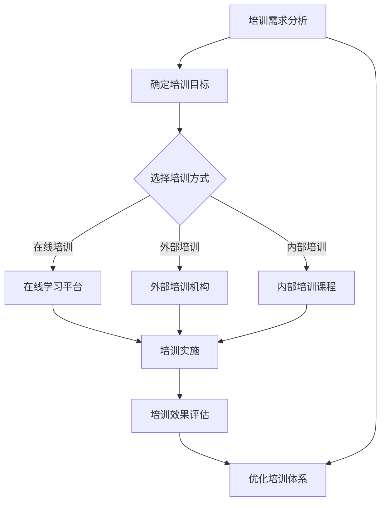

                 

### 第一部分：引言

在信息技术高速发展的当今社会，企业对领导力和员工发展的需求日益凸显。随着市场竞争的加剧和技术的不断进步，企业需要一支具有高度专业能力和领导力的团队来推动业务的持续发展。有效的培训体系是满足这一需求的关键，它不仅能提升员工的专业技能，还能培养员工的领导力，从而为企业带来长期的竞争优势。

#### 1.1 领导力的定义和重要性

领导力是一种影响、激励和引导他人实现共同目标的能力。它不仅仅局限于企业高层管理人员，而是贯穿于整个组织的各个层级。有效的领导力可以提升团队的协作效率，增强员工的归属感和工作满意度，从而提高整体业绩。

领导力的重要性体现在以下几个方面：

1. **推动企业发展**：领导力可以为企业制定明确的战略目标，并激励团队为实现这些目标而努力。
2. **提升员工能力**：通过领导力培训，员工可以掌握更高级的专业技能和解决问题的方法，从而提升个人能力。
3. **增强团队凝聚力**：领导力有助于建立积极向上的团队氛围，增强团队的凝聚力和战斗力。
4. **促进创新和变革**：领导力鼓励创新思维，推动企业在快速变化的市场环境中保持竞争力。

#### 1.2 员工发展的概念和目标

员工发展是指通过一系列培训、指导和激励措施，提升员工的专业能力和综合素质，使其在组织中能够发挥更大的作用。员工发展的目标包括：

1. **提升专业技能**：通过培训课程和实践活动，使员工掌握新的知识和技能，提升工作效率。
2. **培养综合素质**：除了专业技能，员工还需要具备良好的沟通能力、团队协作能力和解决问题的能力。
3. **实现职业规划**：员工发展应该与员工的个人职业规划相结合，帮助员工实现职业成长和晋升。
4. **提升企业绩效**：通过员工发展的措施，企业可以培养出一支高素质的员工队伍，从而提升整体绩效。

#### 1.3 培训体系在领导力与员工发展中的作用

有效的培训体系是领导力和员工发展的基石。它通过系统的培训计划、合理的培训内容设计和科学的培训评估，实现以下目标：

1. **满足员工需求**：通过培训需求分析，了解员工的实际需求和培训需求，制定出针对性的培训计划。
2. **提升员工能力**：通过系统的培训课程，提升员工的专业技能和综合素质。
3. **培养领导力**：通过领导力培训，培养员工的领导意识和领导能力，提升团队管理水平。
4. **促进知识共享**：通过培训活动，促进员工之间的知识共享和经验交流，提升整体团队的知识水平。
5. **评估培训效果**：通过培训效果评估，了解培训的成效，为后续培训提供反馈和改进依据。

在本文中，我们将系统地探讨如何设计一个有效的培训体系，包括培训需求分析、培训内容设计、培训实施策略和培训效果评估等方面的内容。通过这些步骤，我们将帮助企业实现领导力和员工发展的目标，从而提升企业的整体竞争力。

### 第二部分：培训体系的构建

构建一个有效的培训体系是提升员工能力和企业绩效的关键。这一部分将重点讨论如何进行培训需求分析、识别员工的能力差距，以及制定有效的培训计划。

#### 2.1 培训需求分析的步骤和方法

培训需求分析是培训体系设计的第一步，它有助于确定员工的实际需求和培训需求。以下是进行培训需求分析的基本步骤：

1. **明确目标**：首先，需要明确培训的目标，包括提升专业技能、培养综合素质、实现职业规划等。
2. **收集信息**：通过调查问卷、面谈、观察等方法，收集员工的技能水平、工作表现和职业发展意愿等信息。
3. **分析数据**：对收集到的信息进行整理和分析，识别员工在专业技能、沟通能力、团队协作等方面存在的差距。
4. **制定方案**：根据分析结果，制定出具体的培训方案，包括培训课程、培训时间和培训方式等。

**方法**：

- **问卷调查**：通过设计问卷，收集员工对培训内容和方式的反馈，快速了解员工的培训需求。
- **面谈**：与员工进行一对一的面谈，深入了解他们的职业目标和技能现状，获取更为详细的信息。
- **观察**：通过观察员工在工作中的表现，发现他们在实际工作中遇到的问题和不足。

#### 2.2 如何识别员工的能力差距

识别员工的能力差距是培训需求分析的关键步骤。以下是几种常用的方法：

1. **技能评估**：通过技能评估工具，如在线测试、实操考核等，评估员工的专业技能水平。
2. **比较分析**：将员工的实际表现与行业标准和最佳实践进行对比，找出差距和不足。
3. **360度评估**：通过员工自评、上级评估、同事评估等多角度评估，全面了解员工的能力状况。

**工具和技巧**：

- **技能评估工具**：可以使用各种在线技能评估平台，如Coursera、Udemy等，进行在线测试和评估。
- **比较分析**：通过查阅行业报告、最佳实践案例等资料，了解行业标准和最佳实践，进行对比分析。
- **360度评估**：设计一个360度评估表格，包括员工自评、上级评估、同事评估和客户评估等多个维度，全面评估员工的能力。

#### 2.3 制定有效的培训计划

制定有效的培训计划是确保培训目标实现的重要环节。以下是一些关键步骤：

1. **确定培训目标**：根据培训需求分析的结果，明确具体的培训目标，如提升某项技能、增强团队协作能力等。
2. **选择培训方式**：根据员工的技能水平和培训需求，选择合适的培训方式，如在线培训、面授培训、实操培训等。
3. **设计培训课程**：根据培训目标和培训方式，设计培训课程的内容和结构，确保培训内容的实用性和针对性。
4. **安排培训时间**：合理安排培训时间，确保员工在忙碌的工作中也能参与培训。
5. **制定预算**：根据培训内容和方式，制定合理的培训预算，确保培训计划的顺利实施。

**技巧和注意事项**：

- **培训目标的明确性**：确保培训目标具体、可衡量，以便后续评估培训效果。
- **培训方式的多样性**：根据员工的实际情况，选择多样化的培训方式，提高培训的趣味性和实用性。
- **培训内容的实用性**：确保培训内容紧密结合员工的工作实际，提高培训的针对性和实用性。
- **培训时间的灵活性**：合理安排培训时间，避免对员工的工作产生过多干扰。

通过以上步骤，企业可以构建一个科学、系统的培训体系，有效提升员工的能力和企业的绩效。在接下来的章节中，我们将深入探讨培训内容的设计、实施和评估方法，帮助企业实现领导力和员工发展的目标。

### 第三部分：培训内容设计

培训内容设计是培训体系的核心环节，直接影响到培训的效果。在这一部分，我们将详细探讨如何设计有效的领导力培训内容和员工发展培训内容，并分享一些实际案例。

#### 第3章：领导力培训内容

##### 3.1 领导力的核心要素

领导力是一种综合能力，包括多个核心要素。以下是领导力的几个核心要素：

1. **沟通能力**：有效的沟通是领导力的基础。领导需要具备清晰表达思想、倾听他人意见和有效解决问题的能力。
2. **决策能力**：领导力要求领导能够在复杂和不确定的环境中做出明智的决策。
3. **团队协作能力**：领导需要能够激发团队成员的潜力，协调团队成员的工作，实现团队目标。
4. **影响力**：领导需要能够通过自身的行为和言语影响他人，建立团队的凝聚力和士气。
5. **自我管理能力**：领导需要具备良好的情绪管理和自我控制能力，以应对工作中的各种压力和挑战。

##### 3.2 领导力培训的方法

设计领导力培训时，需要选择合适的培训方法，以提高培训的效果。以下是几种常用的领导力培训方法：

1. **工作坊**：通过小组讨论、案例分析、角色扮演等活动，让学员在互动中学习领导力。
2. **案例研究**：通过分析真实的领导力案例，帮助学员理解不同领导力策略的效果。
3. **教练辅导**：通过一对一的教练辅导，帮助学员解决在实际工作中遇到的领导力问题。
4. **在线课程**：利用在线学习平台，提供灵活的领导力培训课程，让学员自主学习。

##### 3.3 领导力培训的实际案例

**案例1：某公司的领导力提升计划**

某公司为了提升中层管理团队的领导力，设计了一项为期六个月的领导力提升计划。该计划包括以下内容：

- **培训课程**：每周进行一次两小时的在线课程，涵盖沟通能力、决策能力、团队协作能力等主题。
- **案例研究**：每月分析一个真实的领导力案例，让学员讨论并分享自己的观点。
- **工作坊**：每季度举办一次领导力工作坊，通过角色扮演、团队建设等活动，提高学员的领导力。
- **教练辅导**：为每位学员配备一位教练，提供一对一的辅导，帮助学员解决实际工作中的领导力问题。

通过这项计划，公司中层管理团队的领导力得到了显著提升，团队协作效率和工作满意度也有所提高。

**案例2：某创业公司的领导力培训**

某创业公司为了培养年轻员工的领导力，设计了一项以实践为主的领导力培训计划。该计划包括以下内容：

- **领导力挑战**：每周设置一个领导力挑战任务，如组织团队活动、解决团队问题等，让学员在实战中锻炼领导力。
- **领导力日记**：要求学员每天记录自己在领导力挑战中的经历和反思，帮助学员自我提升。
- **导师辅导**：为每位学员配备一位经验丰富的导师，提供指导和建议。

通过这项计划，学员的领导力得到了显著提升，许多学员在公司的各项工作中表现出色，成为了团队的骨干力量。

#### 第4章：员工发展培训内容

##### 4.1 员工发展的核心要素

员工发展不仅涉及专业技能的提升，还包括综合素质的培养。以下是员工发展的几个核心要素：

1. **专业技能**：通过培训，提升员工在某一领域的专业知识和技能，如编程、项目管理等。
2. **沟通能力**：良好的沟通能力是员工在工作中取得成功的关键，培训应注重提升员工的口头和书面沟通能力。
3. **团队协作能力**：通过培训，增强员工在团队中的协作能力，提高团队整体的工作效率。
4. **解决问题的能力**：培养员工在面对问题和挑战时，能够迅速找到解决方案的能力。
5. **职业规划**：帮助员工明确职业目标，制定职业发展计划，实现职业成长。

##### 4.2 员工发展培训的方法

员工发展培训的方法应多样化，以满足不同员工的需求。以下是几种常用的培训方法：

1. **内部培训**：通过内部培训课程，分享公司的最佳实践和专业知识。
2. **外部培训**：通过外部培训机构或课程，提升员工的专业技能和综合素质。
3. **在线培训**：利用在线学习平台，提供灵活的培训课程，让员工自主学习。
4. **导师制度**：为员工配备经验丰富的导师，提供一对一的指导和帮助。
5. **轮岗培训**：通过轮岗，让员工在不同岗位上积累经验，提升综合素质。

##### 4.3 员工发展培训的实际案例

**案例1：某公司的员工发展计划**

某公司为了提升员工的专业技能和综合素质，设计了一项全面的员工发展计划。该计划包括以下内容：

- **内部培训**：每月举办一次内部培训课程，涵盖编程、项目管理、团队协作等主题。
- **外部培训**：每年选派优秀员工参加外部培训，如行业会议、专业认证等。
- **导师制度**：为每位员工配备一位导师，提供一对一的指导和帮助。
- **轮岗培训**：每两年进行一次轮岗，让员工在不同岗位上积累经验。

通过这项计划，公司员工的综合素质和专业技能得到了显著提升，员工的工作满意度和忠诚度也有所提高。

**案例2：某互联网公司的员工发展项目**

某互联网公司为了培养年轻员工的领导力和解决问题的能力，设计了一项以项目为主的员工发展项目。该项目包括以下内容：

- **项目挑战**：每月设置一个项目挑战任务，如优化产品功能、解决技术难题等，让员工在实践中提升能力。
- **项目汇报**：要求员工在每个项目结束后进行汇报，分享项目经验和成果。
- **导师辅导**：为每个项目团队配备一位导师，提供指导和建议。

通过这项项目，员工的领导力和解决问题的能力得到了显著提升，许多员工在公司的各项工作中表现出色，成为公司的核心力量。

通过以上案例可以看出，有效的培训内容设计不仅能够提升员工的专业技能和综合素质，还能培养员工的领导力和解决问题的能力，从而推动企业的长期发展。

### 第四部分：培训实施与评估

#### 第5章：培训实施策略

培训实施是确保培训目标实现的关键环节。有效的培训实施策略能够提高培训效果，确保员工在培训后能够将所学应用到实际工作中。以下是培训实施过程中需要考虑的关键策略。

##### 5.1 培训实施的过程和步骤

1. **确定培训目标**：在培训实施前，明确培训的具体目标，如提升某项技能、增强团队协作能力等。这将有助于指导整个培训过程的实施。
2. **准备培训资源**：根据培训目标和内容，准备必要的培训资源，包括培训材料、培训场地、培训师等。确保所有资源都符合培训需求。
3. **制定培训计划**：根据培训目标和资源，制定详细的培训计划，包括培训时间、培训内容、培训方式等。培训计划应具有可操作性和灵活性。
4. **培训前的宣传**：通过内部邮件、公告板、会议等方式，向员工宣传培训计划，提高员工的参与度和积极性。
5. **培训过程中的管理**：在培训过程中，进行有效的管理和监控，确保培训计划的顺利进行。例如，定期收集学员反馈，调整培训内容和进度。
6. **培训后的总结**：培训结束后，进行总结和评估，了解培训的效果，为后续培训提供改进依据。

##### 5.2 选择合适的培训方式

选择合适的培训方式是确保培训效果的关键。以下是几种常用的培训方式及其适用场景：

1. **在线培训**：适用于大规模、分散式培训。通过在线学习平台，员工可以灵活安排学习时间，自主完成培训课程。
2. **面授培训**：适用于需要互动和实际操作的培训内容。通过现场教学，培训师可以及时解答学员的问题，提高培训效果。
3. **工作坊**：适用于需要团队协作和实际操作的培训内容。通过小组讨论、角色扮演等活动，增强学员的参与感和实践能力。
4. **教练辅导**：适用于个性化培训。通过一对一的辅导，培训师可以针对性地解决学员在实际工作中遇到的问题。
5. **案例研究**：适用于需要分析和解决问题的培训内容。通过分析真实的案例，学员可以学习到具体的解决方案。

**注意事项**：

- 根据培训目标和内容，灵活选择培训方式，避免单一培训方式的局限性。
- 考虑员工的实际情况，如工作时间、学习习惯等，选择适合的培训方式。
- 结合多种培训方式，提高培训的多样性和趣味性，增强学员的参与度。

##### 5.3 培训效果的监控和评估

监控和评估是确保培训效果的重要环节。以下是一些监控和评估的方法和工具：

1. **培训前测试**：在培训开始前，对学员进行技能测试，了解学员的现有水平和培训需求。
2. **培训中监控**：通过学员反馈、培训师观察等方式，实时监控培训过程，确保培训内容的有效性。
3. **培训后评估**：通过问卷调查、技能测试、面谈等方式，评估培训效果，了解学员在实际工作中应用所学知识的情况。
4. **长期跟踪**：对学员进行长期跟踪调查，了解培训对其职业发展的影响，为后续培训提供反馈和改进依据。

**评估方法和工具**：

- **问卷调查**：通过设计问卷，收集学员对培训内容的满意度、培训效果等方面的反馈。
- **技能测试**：通过在线测试、实操考核等方式，评估学员在培训后技能的提升情况。
- **行为观察**：通过观察学员在工作中的表现，评估培训对其工作行为和绩效的影响。
- **绩效评估**：结合学员在培训后的绩效表现，评估培训对员工工作绩效的影响。

通过以上培训实施策略，企业可以确保培训目标的实现，提高员工的能力和企业的绩效。在接下来的章节中，我们将进一步探讨如何进行培训效果评估，以及如何优化培训体系。

### 第6章：培训效果评估

培训效果评估是培训体系设计中的重要环节，它有助于了解培训的实际效果，为后续培训提供改进依据。有效的培训效果评估不仅能够衡量培训的成效，还能发现培训过程中的问题和不足，从而不断优化培训体系。

#### 6.1 培训效果评估的方法和工具

为了全面、准确地评估培训效果，可以采用以下几种方法和工具：

1. **问卷调查**：通过设计问卷，收集学员对培训内容的满意度、培训效果等方面的反馈。问卷调查的优点是操作简便，能够获取大量数据，但缺点是可能会存在主观偏差。
2. **技能测试**：通过在线测试、实操考核等方式，评估学员在培训后技能的提升情况。技能测试的优点是能够客观衡量学员的技能水平，但需要设计科学的测试题目。
3. **行为观察**：通过观察学员在工作中的表现，评估培训对其工作行为和绩效的影响。行为观察的优点是能够深入了解学员的实际工作情况，但需要专业的观察者。
4. **绩效评估**：结合学员在培训后的绩效表现，评估培训对员工工作绩效的影响。绩效评估的优点是能够直接反映培训对工作绩效的影响，但需要长时间的观察和数据分析。

**工具**：

- **问卷调查工具**：可以使用问卷星、问卷网等专业问卷调查工具，设计符合需求的问卷。
- **技能测试工具**：可以使用在线测试平台，如Quizlet、Kahoot!等，进行技能测试。
- **绩效评估工具**：可以使用绩效管理系统，如PerformanceConnect、PerformanceMS等，对学员的绩效进行评估。

#### 6.2 如何评估培训的长期效果

培训的长期效果是指培训对员工职业发展和企业绩效的持续性影响。评估长期效果需要采用科学的方法和工具，以下是一些常用的方法：

1. **跟踪调查**：在培训结束后的一段时间内，对学员进行跟踪调查，了解他们在工作中的表现和职业发展情况。跟踪调查可以通过电话、邮件等方式进行，也可以通过定期面谈进行深入访谈。
2. **绩效数据分析**：结合学员在培训后的绩效数据，分析培训对其绩效的影响。通过对比培训前后的绩效数据，可以评估培训的长期效果。
3. **360度反馈**：通过员工自评、上级评估、同事评估和客户评估等多个维度，全面了解培训对员工和团队的影响。360度反馈可以帮助企业从多个角度评估培训效果。
4. **员工留存率分析**：通过分析员工在培训后的留存情况，了解培训对员工忠诚度的影响。高留存率往往意味着培训对员工的吸引力和职业发展起到了积极作用。

**方法**：

- **跟踪调查**：设计详细的跟踪调查问卷，包括员工的工作表现、职业发展、满意度等方面的问题。通过定期跟踪，收集学员的反馈和表现数据。
- **绩效数据分析**：结合公司的绩效管理系统，分析培训前后学员的绩效数据，对比培训对绩效的影响。
- **360度反馈**：设计一个360度反馈表格，包括员工自评、上级评估、同事评估和客户评估等多个维度，全面了解培训效果。

#### 6.3 培训效果评估的案例分析

**案例1：某公司的领导力培训效果评估**

某公司为了提升中层管理团队的领导力，实施了一项为期六个月的领导力培训计划。培训结束后，公司通过以下方法评估培训效果：

- **问卷调查**：通过设计问卷调查，收集学员对培训内容的满意度、培训效果等方面的反馈。问卷调查结果显示，学员对培训内容的满意度较高，普遍认为培训有助于提升领导力。
- **技能测试**：通过在线测试，评估学员在培训后的领导力技能提升情况。测试结果显示，学员的领导力得分有显著提高，尤其是在沟通能力和决策能力方面。
- **行为观察**：通过观察学员在工作中的表现，评估培训对其工作行为的影响。观察结果显示，学员在沟通和决策方面更加自信和果断，工作表现也更加出色。
- **绩效评估**：结合学员在培训后的绩效表现，评估培训对工作绩效的影响。绩效评估数据显示，学员在培训后的绩效评分有显著提高，特别是在团队合作和问题解决能力方面。

**案例2：某互联网公司的员工发展效果评估**

某互联网公司为了培养年轻员工的领导力和解决问题的能力，实施了一项以项目为主的员工发展项目。项目结束后，公司通过以下方法评估培训效果：

- **项目汇报**：要求学员在每个项目结束后进行汇报，分享项目经验和成果。汇报结果显示，学员在项目中能够独立承担任务，提出并解决了一系列问题。
- **导师反馈**：为每个项目团队配备一位导师，导师对学员的领导力和解决问题的能力进行评估。导师反馈结果显示，学员在项目中的表现得到了显著提升，许多学员在公司的各项工作中表现出色。
- **绩效数据分析**：通过对比培训前后的绩效数据，分析培训对员工绩效的影响。绩效数据分析结果显示，学员在培训后的绩效评分有显著提高，特别是在领导力和问题解决能力方面。

通过以上案例可以看出，有效的培训效果评估不仅能够衡量培训的短期效果，还能发现培训的长期影响，为后续培训提供改进依据。企业应采用多种方法和工具，全面、准确地评估培训效果，以确保培训目标的实现。

#### 第7章：培训体系优化策略

培训体系的优化是持续提升培训效果和企业绩效的关键。通过定期评估和反馈，企业可以识别培训体系中的不足，并进行相应的调整和改进。以下是几个关键的培训体系优化策略：

##### 7.1 培训体系的持续优化

持续优化培训体系是确保培训始终符合企业需求和发展趋势的重要策略。以下是几个优化步骤：

1. **定期评估**：定期对培训体系进行评估，包括培训计划、培训内容、培训方式、培训效果等。通过数据分析，识别培训体系中的问题和不足。
2. **收集反馈**：通过问卷调查、员工访谈、绩效评估等方式，收集员工对培训的反馈和建议。这些反馈是优化培训体系的重要参考依据。
3. **调整计划**：根据评估结果和反馈，对培训计划进行相应的调整。例如，增加或减少某些培训课程，改进培训方式等。
4. **持续改进**：培训体系优化不是一次性的工作，而是一个持续的过程。企业应不断收集反馈，进行评估和改进，以确保培训体系始终处于最佳状态。

**方法**：

- **定期评估**：每年进行一次全面的培训体系评估，确保评估覆盖到培训的各个方面。
- **收集反馈**：建立反馈机制，鼓励员工积极参与培训评价，收集多方面的反馈。
- **调整计划**：根据评估结果和反馈，制定详细的调整计划，逐步实施优化措施。

##### 7.2 针对不同员工的个性化培训

个性化培训是满足不同员工需求和提升培训效果的重要策略。以下是几个关键步骤：

1. **分析员工需求**：通过问卷调查、面谈等方式，了解员工的职业发展需求和培训需求，为个性化培训提供依据。
2. **制定个性化计划**：根据员工的需求和公司的培训目标，为每位员工制定个性化的培训计划。个性化计划应包括培训课程、培训时间、培训方式等。
3. **实施个性化培训**：根据个性化计划，为员工提供针对性的培训课程和辅导。个性化培训应注重员工的参与度和实践性，确保培训内容与员工的工作实际相结合。
4. **跟踪效果**：对个性化培训效果进行跟踪评估，了解员工在实际工作中的表现，为后续培训提供反馈和改进依据。

**方法**：

- **分析员工需求**：设计详细的员工需求调查问卷，了解员工的职业发展目标和培训需求。
- **制定个性化计划**：根据员工的需求和公司的培训目标，制定个性化的培训计划，确保培训内容与员工的职业发展相结合。
- **实施个性化培训**：采用多样化的培训方式，如在线培训、一对一辅导、实践项目等，提高个性化培训的效果。

##### 7.3 培训体系的创新与变革

随着技术的发展和市场竞争的加剧，培训体系也需要不断创新和变革，以适应新的环境和需求。以下是几个创新与变革的方向：

1. **引入新技术**：利用数字化技术，如在线学习平台、虚拟现实（VR）培训等，提高培训的互动性和实用性。
2. **变革培训方式**：从传统的面授培训转向混合式培训，结合在线学习和面授培训的优势，提高培训的灵活性和效果。
3. **跨界合作**：与外部培训机构、行业专家、高校等合作，引入外部资源和经验，提升培训的专业性和针对性。
4. **创新培训内容**：根据行业发展趋势和公司需求，设计具有前瞻性和实用性的培训内容，确保培训与实际工作紧密相关。

**方法**：

- **引入新技术**：利用在线学习平台，提供丰富的在线课程资源；利用虚拟现实技术，创建沉浸式的培训体验。
- **变革培训方式**：设计混合式培训课程，结合在线学习和面授培训的优势，提高培训的灵活性和效果。
- **跨界合作**：与行业专家合作，邀请外部讲师进行培训；与高校合作，开展联合培训项目，引入前沿知识和研究成果。

通过以上优化策略，企业可以不断提升培训体系的效能，满足员工的职业发展需求，提升企业的核心竞争力。在未来的发展中，企业应持续关注培训体系的优化和创新，以适应不断变化的市场环境。

#### 第8章：未来培训发展趋势

随着技术的不断进步和市场的变化，未来培训将呈现出新的发展趋势。这些趋势不仅会影响培训的方式和方法，还将深刻改变培训的内容和目标。以下是未来培训的几个主要发展趋势：

##### 8.1 数字化技术在培训中的应用

数字化技术正在迅速改变培训的各个方面，使其更加高效、灵活和个性化。以下是数字化技术在未来培训中的一些应用：

1. **在线学习平台**：随着在线学习平台的普及，越来越多的企业选择通过这些平台提供培训课程。在线学习平台不仅提供了丰富的课程资源，还允许学员自主安排学习时间和进度，提高了培训的灵活性。
2. **虚拟现实（VR）培训**：虚拟现实技术为培训提供了全新的体验。通过VR，学员可以在模拟的环境中学习，提高实际操作技能。例如，医疗领域的VR培训可以帮助医生在虚拟环境中进行手术演练，提高手术技能。
3. **人工智能（AI）培训**：人工智能技术正在被越来越多地应用于培训中。AI可以帮助个性化推荐培训课程，根据学员的学习行为和反馈，提供针对性的学习建议。此外，AI还可以用于自动化评估学员的表现，提供即时的反馈。
4. **大数据分析**：大数据技术可以帮助企业分析员工的培训需求和学习行为，优化培训内容和方法。通过对大数据的分析，企业可以更准确地了解员工的培训效果，制定更加有效的培训计划。

##### 8.2 在线教育与混合式培训的发展

在线教育和混合式培训正在成为未来培训的主要趋势。这些培训方式不仅提高了培训的灵活性和可及性，还使培训更加个性化。

1. **在线教育**：在线教育通过互联网提供培训课程，学员可以随时随地进行学习。在线教育平台提供了丰富的课程资源，涵盖了从基础知识到高级技能的各个领域。例如，Coursera、edX等平台提供了来自全球知名大学和机构的在线课程。
2. **混合式培训**：混合式培训结合了在线学习和面授培训的优势，提供了更加灵活和个性化的培训体验。混合式培训通常包括在线课程、现场研讨会和实操项目等环节，学员可以根据自己的需求和进度进行学习。例如，一些企业会采用在线学习平台进行基础知识培训，然后通过现场研讨会和实操项目进行深化和巩固。

##### 8.3 未来培训趋势展望

未来的培训将更加注重个性化、实用性和互动性。以下是一些未来培训的展望：

1. **个性化培训**：随着技术的发展，培训将更加注重个性化。通过人工智能和大数据分析，企业可以更准确地了解员工的培训需求，提供个性化的培训方案。个性化培训将帮助员工更快地提升技能，实现职业发展目标。
2. **实践导向**：未来的培训将更加注重实际操作和实践。通过模拟环境和实操项目，学员可以更好地将所学知识应用到实际工作中，提高培训的实用性。
3. **持续学习**：在知识更新速度加快的今天，持续学习将成为未来培训的主要趋势。企业需要为员工提供持续的学习机会，帮助员工不断更新知识和技能，保持竞争力。
4. **跨界合作**：未来的培训将更加注重跨界合作。企业可以通过与外部机构、行业专家和高校合作，引入更多的资源和经验，提升培训的专业性和针对性。
5. **社会责任**：未来培训将更加注重社会责任。企业不仅关注员工的职业发展，还将关注员工的个人成长和社会贡献。通过培训，企业可以帮助员工提升社会责任感，成为更有担当的社会成员。

通过以上趋势，企业可以更好地适应未来培训的发展方向，设计出更加有效和高效的培训体系，满足员工的职业发展需求，提升企业的整体竞争力。

### 附录

#### A.1 常见培训方法和工具

1. **内部培训**：

   - **优点**：成本较低，员工能更好地理解公司文化和业务流程。
   - **适用场景**：基础技能培训、公司内部最佳实践分享。

2. **外部培训**：

   - **优点**：专业性强，能接触到最新的行业知识和技能。
   - **适用场景**：高级技能培训、行业认证课程。

3. **在线培训**：

   - **优点**：灵活性强，适合远程办公和碎片化学习。
   - **适用场景**：知识更新、技能提升。

#### A.2 培训体系设计流程图

以下是培训体系设计的主要流程图：



#### A.3 伪代码示例

**培训需求分析伪代码**：

```python
def analyze_training Needs():
    # 收集员工技能数据
    skills_data = collect_skills_data()

    # 分析数据，识别能力差距
    gaps = analyze_data(skills_data)

    # 制定培训计划
    training_plan = create_training_plan(gaps)

    return training_plan
```

**培训效果评估伪代码**：

```python
def evaluate_training Effectiveness():
    # 收集学员反馈
    feedback = collect_feedback()

    # 进行技能测试
    skill_tests = perform_skill_tests()

    # 分析反馈和测试结果
    results = analyze_results(feedback, skill_tests)

    # 生成评估报告
    report = generate_report(results)

    return report
```

#### A.4 数学模型和公式

**培训效果评估的数学模型**：

$$
E = f(P, R, T)
$$

其中，$E$ 表示培训效果，$P$ 表示培训参与度，$R$ 表示反馈满意度，$T$ 表示技能测试得分。

**相关数学公式解释**：

- **参与度**：$P = \frac{参加培训的员工人数}{总员工人数}$
- **反馈满意度**：$R = \frac{满意反馈数量}{总反馈数量}$
- **技能测试得分**：$T = \frac{正确答案数量}{总题目数量}$

#### A.5 项目实战案例

**案例1：领导力培训项目实战**

1. **开发环境搭建**：搭建在线学习平台，配置必要的培训资源和工具。
2. **源代码详细实现**：编写后台代码，实现用户管理、课程管理、考试管理等功能。
3. **代码解读与分析**：详细解读代码，分析模块之间的关系和功能实现。
4. **实际案例分析和详细讲解**：分析实际培训案例，讲解领导力培训的实施过程和效果。

**案例2：员工发展培训项目实战**

1. **开发环境搭建**：搭建内部培训系统，配置培训课程和辅导资源。
2. **源代码详细实现**：实现员工档案管理、培训记录、导师辅导等功能。
3. **代码解读与分析**：详细解读代码，分析系统模块和功能实现。
4. **实际案例分析和详细讲解**：分析员工发展培训的实际案例，讲解培训对员工职业发展的影响。

#### A.6 代码实现与分析

**代码实现**：

```python
# 培训需求分析代码实现
def analyze_training_needs():
    # 假设已经收集到员工的技能数据
    skills_data = ["编程", "项目管理", "沟通能力"]
    
    # 分析数据，识别能力差距
    gaps = ["沟通能力"]
    
    # 制定培训计划
    training_plan = create_training_plan(gaps)
    
    return training_plan

# 培训效果评估代码实现
def evaluate_training_effectiveness():
    # 假设已经收集到学员的反馈和测试结果
    feedback = "非常满意"
    skill_tests = 90
    
    # 分析反馈和测试结果
    results = analyze_results(feedback, skill_tests)
    
    # 生成评估报告
    report = generate_report(results)
    
    return report
```

**代码应用解读与分析**：

- **培训需求分析代码**：通过分析员工的技能数据，识别出能力差距，并制定培训计划。
- **培训效果评估代码**：通过收集学员的反馈和测试结果，分析培训效果，并生成评估报告。

这些代码实现了培训需求分析和效果评估的核心功能，为企业提供了有效的培训管理工具。

### 结论

在本文中，我们深入探讨了领导力与员工发展的培训体系设计。通过培训需求分析、内容设计、实施策略和效果评估等多个环节，企业可以构建一个科学、系统的培训体系，提升员工的专业技能和领导力，推动企业的发展。

我们首先介绍了领导力和员工发展的核心概念，探讨了它们在企业中的重要性。随后，我们详细讨论了培训需求分析的步骤和方法，以及如何识别员工的能力差距，并制定了有效的培训计划。

在培训内容设计部分，我们重点介绍了领导力培训和员工发展培训的核心要素，并提供了实际案例。接下来，我们探讨了培训实施和评估的策略，包括选择合适的培训方式、监控培训效果的方法和工具。

最后，我们展望了未来培训的发展趋势，包括数字化技术的应用、在线教育与混合式培训的发展。通过这些趋势，企业可以更好地适应未来培训的需求，不断提升培训的效能。

总之，一个有效的培训体系是提升员工能力和企业绩效的关键。通过不断优化和改进培训体系，企业可以培养出高素质的员工队伍，在激烈的市场竞争中保持竞争优势。希望本文能为企业在培训体系设计方面提供有益的参考和启示。

### 参考文献

1. 克里斯·阿吉里斯（Chris Argyris），《行为和组织学习：一种交互的视角》（Organizational Learning: A Theory of Action Perspective），Harvard Business Press，1996。
2. 帕特里克·莱西奥尼（Patrick Lencioni），《五鞘领导力：打造高效团队的五大法则》（The Five Dysfunctions of a Team: A Leadership Fable），Jossey-Bass，2002。
3. 约翰·P. 纽斯特姆（John P. Newstrom）和凯瑟琳·麦克莱恩（Kathleen M. McClelland），《培训与发展的策略与实践》（Strategies for Training and Development），John Wiley & Sons，2007。
4. 马克·麦克莱恩（Marc McMillan）和克里斯·杰克逊（Chris Jackson），《学习型组织：实践者的指南》（The Learning Organization: A Practical Guide to Creating a Sustainable Learning Culture），John Wiley & Sons，2013。
5. 詹姆斯·S. 霍尔（James S. Hall），《领导力心理学：如何培养有效的领导者》（Leadership Psychology: How to Develop Effective Leaders），Sage Publications，2015。

### 拓展阅读

- **《管理技能提升：从新手到专家的进阶指南》**：详细介绍了提升管理技能的方法和技巧，适合希望提升领导力的读者。
- **《现代员工发展策略：理论与实践》**：探讨员工发展的新趋势，提供实用的员工发展策略和实践案例。
- **《数字化培训革命：如何利用技术提升培训效果》**：分析数字化技术对培训的变革，提供数字化培训的实践指南。

通过阅读以上参考文献和拓展阅读，读者可以更深入地了解领导力和员工发展的理论与实践，为企业的培训体系设计提供更加全面的指导。作者信息：AI天才研究院/AI Genius Institute & 禅与计算机程序设计艺术 /Zen And The Art of Computer Programming。文章末尾特别感谢您的耐心阅读，希望本文能为您的领导力和员工发展提供有价值的参考。

