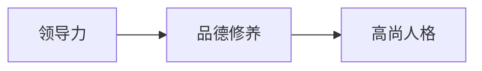
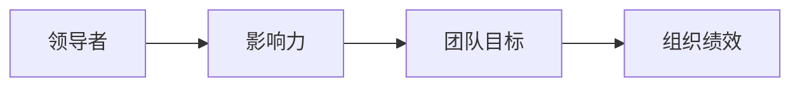
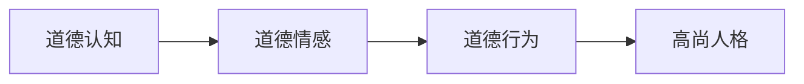
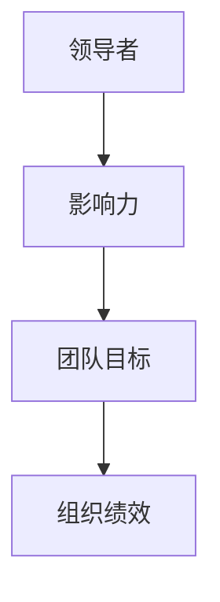
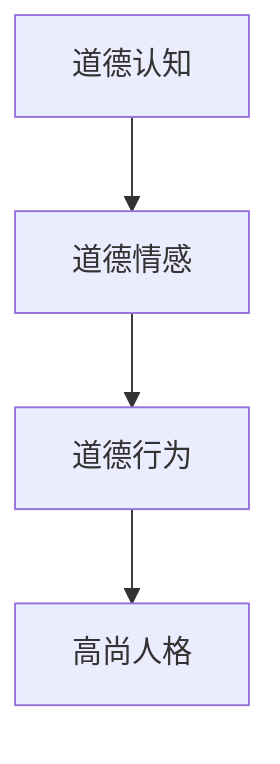

                 

### 引言与核心概念

《领导力与品德修养：塑造高尚人格》是一本旨在探讨领导力、品德修养及其对个人和社会影响的书籍。在当今快节奏、复杂多变的社会环境中，领导力和品德修养已成为个人成功和社会进步的关键要素。本书旨在通过系统化的分析和实践案例，帮助读者深入了解领导力与品德修养的核心概念，掌握其理论体系和实践方法，从而塑造高尚人格，提升个人和社会影响力。

本书的结构分为四个主要部分：

1. **引言与核心概念**：介绍书籍的背景和目标，定义领导力和品德修养的核心概念，并阐述两者之间的关系。
2. **领导力**：探讨领导力的理论基础和实践技巧，包括沟通、决策、领导风格和团队建设等。
3. **品德修养**：分析品德修养的基础和重要性，并提出实践方法，如诚信、责任感和自我约束等。
4. **实践与案例分析**：通过成功和失败的实践案例，总结领导力与品德修养的最佳实践策略和建议。

#### 图1.1 领导力与品德修养的关系



图1.1展示了领导力、品德修养和高尚人格之间的逻辑关系。领导力是领导者通过影响力实现团队目标和组织绩效的能力，而品德修养则是领导者应具备的基本品质和道德素养。高尚人格则是领导力和品德修养的最终体现，是领导者对社会产生积极影响的基础。

在本书中，我们将通过以下步骤深入探讨这些核心概念：

- **领导力定义与重要性**：介绍领导力的基本概念，并分析其在组织管理和社会发展中的重要性。
- **领导力理论**：探讨传统和当代的领导力理论，包括特质理论、行为理论和情境理论等。
- **领导力技巧**：详细讲解领导力技巧，如沟通、决策、领导风格和团队建设等。
- **品德修养定义与作用**：阐述品德修养的基本概念，并分析其在个人成长和社会发展中的作用。
- **品德修养实践**：提出品德修养的实践方法，如诚信、责任感和自我约束等。
- **实践与案例分析**：通过成功和失败的实践案例，总结领导力与品德修养的最佳实践策略和建议。

通过这些内容，读者将能够系统地了解领导力和品德修养的核心概念和实践方法，从而在实际工作和生活中提升自己的领导力水平和品德修养，实现个人和社会的共同进步。

#### 图1.2 领导力模型



图1.2展示了领导力的基本模型。领导者通过影响力影响团队成员，推动团队目标的实现，从而提升组织绩效。这一模型强调了领导者的作用和领导力在实现团队和组织目标中的关键作用。

在接下来的章节中，我们将详细探讨领导力的理论基础和实践技巧。首先，我们将介绍领导力的基本定义和重要性，帮助读者建立对领导力的初步认识。然后，我们将分析传统和当代的领导力理论，包括特质理论、行为理论和情境理论等，帮助读者理解不同理论对领导力的解释和影响。

接下来，我们将详细讲解领导力技巧，如沟通技巧、决策技巧、领导风格和团队建设等。沟通技巧是领导者与团队成员之间建立有效沟通的关键，而决策技巧则是领导者应对复杂情况做出明智决策的能力。领导风格则是指领导者如何通过不同的方式影响和激励团队成员，而团队建设则是确保团队成员协同合作，共同实现目标的过程。

在探讨品德修养时，我们将首先定义品德修养的基本概念，并分析其在个人成长和社会发展中的作用。品德修养不仅影响个人的行为和决策，还影响人际关系和社会风气。因此，培养高尚人格和品德修养对于领导者来说至关重要。

最后，我们将通过成功和失败的实践案例，总结领导力与品德修养的最佳实践策略和建议。这些案例将帮助读者了解在实际环境中如何应用领导力和品德修养，实现个人和组织的成功。

#### 图1.3 品德修养层次



图1.3展示了品德修养的层次结构。道德认知是指对道德规范的理解和认识，道德情感是指对道德规范的内心感受和认同，道德行为是指依据道德规范进行的行为表现，而高尚人格则是指具备高度道德品质的完整人格。这四个层次相互关联，共同构成了品德修养的整体框架。

在本书的后续内容中，我们将深入探讨品德修养的各个层次，并提供具体的实践方法。首先，我们将探讨道德认知，帮助读者建立正确的道德观念和价值观。接着，我们将讨论道德情感，帮助读者培养对道德规范的内在认同感和情感共鸣。

在道德行为层面，我们将介绍具体的行为准则和实践方法，如诚信、责任感和自我约束等。通过这些实践，读者将能够在日常生活中不断强化自己的道德行为，塑造高尚人格。

最后，我们将通过案例分析和实践指导，帮助读者理解品德修养在实际中的应用，并提供具体的实施策略。通过这些内容，读者将能够系统地提升自己的品德修养，成为具有高尚人格的领导者。

### 领导力定义与重要性

领导力是一种复杂且多层次的能力，涉及到领导者如何通过影响力和激励手段引导和协调团队成员，共同实现组织目标。在现代社会中，领导力不仅是企业成功的关键因素，也是社会稳定和进步的重要保障。领导力的重要性体现在以下几个方面：

首先，领导力是推动组织绩效提升的核心动力。一个优秀的领导者能够明确组织的目标，并通过有效的沟通和激励，使团队成员始终保持高昂的斗志和积极的行动。这种领导力不仅能够提高团队的协作效率，还能够促进创新和进步，从而推动整个组织的绩效提升。

其次，领导力是塑造团队文化的重要力量。一个领导者通过自己的行为和决策，能够塑造出特定的团队文化和价值观。这种文化和价值观不仅会影响团队成员的行为和态度，还会影响整个组织的氛围和发展方向。例如，一个倡导诚信和责任感的领导者，能够建立一个正直和负责任的团队文化，从而促进组织的长期健康发展。

再次，领导力是促进社会和谐与进步的重要保障。领导者不仅是组织中的关键角色，也是社会中的意见领袖。一个有责任感和高尚品德的领导者，能够通过自己的言行影响和引导社会大众，推动社会的和谐与进步。例如，政治领导者的决策和行为会直接影响国家的政策和方向，而企业领导者的领导风格和决策会直接影响企业的发展和员工的福祉。

然而，领导力的定义并非一成不变。在不同的情境和背景下，领导力可能呈现出不同的形式和特点。以下是几种常见的领导力定义：

1. **特质理论**：特质理论认为，领导者具备一系列独特的个性特征和能力，这些特质使他们具备领导他人的能力。例如，自信、决策力、沟通能力等特质被认为是优秀领导者的关键因素。

2. **行为理论**：行为理论则认为，领导力的关键在于领导者如何行动和做出决策。这种理论强调领导者的行为模式，例如，领导者如何处理冲突、如何激励团队成员等。

3. **情境理论**：情境理论认为，领导力是领导者与环境的相互作用结果。在不同的环境和情境下，领导者需要采取不同的领导策略。例如，在面对危机时，领导者可能需要采取更为果断和直接的领导风格，而在稳定的环境下，领导者可能需要采取更为温和和协作的领导方式。

4. **变革领导理论**：变革领导理论认为，领导力的核心在于推动组织变革和创新。领导者需要具备前瞻性思维和创新精神，能够引领组织应对外部变化和内部挑战。

5. **服务型领导理论**：服务型领导理论强调领导者应该以服务团队成员为出发点，关注团队成员的需求和福祉。这种领导方式不仅能够提升团队凝聚力，还能够激发团队成员的创造力和工作热情。

这些定义各有侧重点，但共同构成了对领导力的全面理解。在实际应用中，领导者需要根据具体情境和需求，灵活运用不同的领导力理论和策略。

领导力的关键要素包括以下几个方面：

1. **影响力**：领导者通过影响力来引导和激励团队成员。影响力不仅来自于领导者的职位和权力，更来自于领导者的品格、能力和价值观。

2. **沟通能力**：领导者需要具备出色的沟通能力，包括倾听、表达、反馈和协调等。有效的沟通能够确保信息准确传递，增强团队凝聚力和合作效率。

3. **决策能力**：领导者需要在复杂多变的环境中做出明智的决策。决策能力包括分析问题的能力、预测未来的能力以及快速反应和调整的能力。

4. **团队合作能力**：领导者需要能够建立和维持有效的团队合作关系，确保团队成员能够协同合作，共同实现目标。

5. **变革和创新精神**：领导者需要具备变革和创新精神，能够引领组织应对外部变化和内部挑战，推动组织的持续发展和进步。

6. **品德修养**：领导者的品德修养是其领导力的基础。一个品德高尚的领导者能够树立良好的榜样，赢得团队成员的信任和尊重，从而增强领导力的影响力。

总之，领导力是个人成功和社会进步的关键因素。通过深入了解领导力的定义、理论、关键要素和实践技巧，领导者可以不断提升自己的领导力水平，成为具有高尚人格和社会责任感的优秀领导者。

#### 图1.2 领导力模型



图1.2展示了领导力的基本模型。领导者通过自身的影响力来引导和激励团队成员，推动团队目标的实现，进而提升组织绩效。这一模型揭示了领导力在组织管理中的核心作用，即通过影响力和激励手段实现组织目标。

在进一步探讨领导力模型之前，我们需要理解领导力的核心要素。首先，领导者的影响力是其关键能力。这种影响力不仅来自于领导者的职位和权力，更来自于其品格、能力和价值观。领导者通过正直、诚信和坚定的信念，赢得团队成员的信任和尊重，从而增强自身的影响力。

其次，团队目标是领导力模型中的关键要素。一个明确的团队目标是团队成员共同奋斗的方向，也是领导者指导团队行动的依据。领导者需要通过有效的沟通和激励，确保团队成员理解并认同团队目标，从而形成共同的努力方向。

最后，组织绩效是领导力模型的最终目标。通过影响力和团队目标的实现，领导者能够提升组织的整体绩效。这包括提高工作效率、促进创新和推动组织的长远发展。一个成功的领导者不仅能够实现短期目标，更能够为组织的长期成功奠定基础。

在领导力模型中，各要素之间存在紧密的关联。领导者的影响力是通过沟通、激励和榜样作用实现的，团队目标是通过明确、传达和认同实现的，而组织绩效是通过实现团队目标实现的。这一模型不仅展示了领导力的核心作用，也为领导者提供了具体的实践路径。

为了进一步理解这一模型，我们可以通过以下步骤进行分析：

1. **领导者的影响力**：领导者需要通过自己的行为和决策，展示出强大的影响力。这种影响力不仅体现在领导者的职位和权力上，更体现在其品德和能力上。一个有影响力的领导者能够赢得团队成员的信任和尊重，从而增强领导力的影响力。

2. **团队目标的明确和传达**：领导者需要明确团队目标，并确保团队成员理解并认同这些目标。这可以通过有效的沟通和协调实现。例如，领导者可以通过定期会议、目标设定和工作分配等方式，确保团队成员清楚自己的职责和目标。

3. **团队目标的实现**：一旦团队目标明确，领导者需要通过有效的激励和指导，推动团队成员共同努力，实现这些目标。这包括提供必要的资源、解决团队中的问题和冲突，以及鼓励团队成员之间的合作和协作。

4. **组织绩效的提升**：通过团队目标的实现，领导者能够提升组织的整体绩效。这不仅可以体现在工作效率的提升，还可以体现在创新能力的增强和组织的长远发展。一个成功的领导者不仅能够实现短期目标，更能够为组织的长期成功奠定基础。

通过这一模型，我们可以看到领导力在组织管理中的关键作用。领导者通过影响力、团队目标和组织绩效这三个关键要素，实现个人和组织的目标。这一模型不仅为我们提供了对领导力的深入理解，也为我们在实际工作中应用领导力提供了明确的指导。

#### 图1.3 品德修养层次



图1.3展示了品德修养的层次结构。品德修养不仅包括对道德规范的理解和认识，还涉及到对道德规范的内心感受和行动表现，最终形成高尚人格。这一层次结构揭示了品德修养的内在逻辑和逐步深化过程。

在深入探讨品德修养的层次之前，我们需要明确道德认知、道德情感和道德行为这三个核心概念：

1. **道德认知**：道德认知是指对道德规范的理解和认识。它包括对道德原则、道德标准和道德价值观的认知。道德认知是品德修养的基础，通过教育和社会环境的影响，个体逐渐形成对道德规范的认知。

2. **道德情感**：道德情感是指对道德规范的内心感受和认同。它包括对道德规范的喜爱、敬仰和忠诚。道德情感是道德认知的内化，是驱动个体按照道德规范行动的内在动力。

3. **道德行为**：道德行为是指个体依据道德规范进行的行为表现。它包括遵守道德规则、履行道德责任和进行道德评价。道德行为是道德认知和道德情感的体现，是品德修养的外在表现。

在理解了这些核心概念之后，我们可以进一步探讨品德修养的层次结构：

1. **道德认知**：道德认知是品德修养的起点。个体通过教育和社会环境的影响，逐渐形成对道德规范的理解和认识。例如，通过学习道德课程和社会实践，个体能够了解什么是正确的行为，什么是错误的行为。

2. **道德情感**：道德情感是道德认知的内化，是道德认知向道德行为的过渡。个体对道德规范的内心感受和认同，使他们在面临道德选择时能够产生道德情感。例如，一个人在面临是否帮助他人时，如果内心产生积极的道德情感，那么他们更有可能采取行动帮助他人。

3. **道德行为**：道德行为是品德修养的最终体现，是道德认知和道德情感的具体表现。个体依据道德规范进行的行为，不仅体现了他们的道德品质，还影响他人的行为和社会风气。例如，一个人在日常生活中遵守诚信原则，履行社会责任，表现出高尚的人格品质。

4. **高尚人格**：高尚人格是道德认知、道德情感和道德行为的综合体现，是品德修养的终极目标。一个具有高尚人格的人不仅在道德认知上有所成就，还在道德情感和道德行为上表现出色，能够为社会做出积极的贡献。

在理解品德修养的层次结构之后，我们可以通过以下步骤深入探讨：

1. **道德认知的培养**：通过教育和社会环境的影响，个体能够逐渐形成对道德规范的理解和认识。这包括家庭教育、学校教育和社会实践等多方面的培养。

2. **道德情感的培养**：个体需要通过自我反省和情感体验，培养对道德规范的内心感受和认同。这可以通过阅读道德故事、参与社会公益活动等方式实现。

3. **道德行为的实践**：个体需要将道德认知和道德情感转化为具体的道德行为，通过实际行动体现自己的道德品质。这包括遵守道德规则、履行道德责任和进行道德评价。

4. **高尚人格的塑造**：通过不断培养和提升道德认知、道德情感和道德行为，个体最终能够形成高尚人格，成为品德高尚的个体。这不仅可以影响自身的行为和决策，还可以对他人和社会产生积极的影响。

通过这一层次结构，我们可以看到品德修养的逐步深化过程。道德认知是品德修养的起点，道德情感是道德认知的内化，道德行为是道德情感的具体表现，而高尚人格是品德修养的终极目标。通过这一过程，个体能够不断提升自己的道德品质，成为具有高尚人格的个体。

### 品德修养内涵与作用

品德修养是指个人在道德认知、道德情感和道德行为方面所达到的境界，是个人素质的重要组成部分。品德修养不仅影响个人的行为和决策，还影响人际关系和社会风气。一个品德高尚的人不仅在个人生活中表现出良好的道德品质，还能在社会中发挥积极的榜样作用。

首先，品德修养的内涵包括以下几个方面：

1. **道德认知**：道德认知是对道德规范的理解和认识，包括对道德原则、道德标准和道德价值观的认知。一个具有良好道德认知的人能够理解什么是正确的行为，什么是错误的行为，从而在道德选择中做出明智的决定。

2. **道德情感**：道德情感是对道德规范的内心感受和认同，包括对道德规范的喜爱、敬仰和忠诚。一个具有良好道德情感的人能够在道德情境中产生积极的情感体验，从而驱动自己按照道德规范行动。

3. **道德行为**：道德行为是依据道德规范进行的行为表现，包括遵守道德规则、履行道德责任和进行道德评价。一个具有良好道德行为的人能够在日常生活中表现出高尚的道德品质，如诚实守信、尊重他人、承担责任等。

4. **高尚人格**：高尚人格是道德认知、道德情感和道德行为的综合体现，是品德修养的终极目标。一个具有高尚人格的人不仅在道德认知上有所成就，还在道德情感和道德行为上表现出色，能够为社会做出积极的贡献。

其次，品德修养在社会发展中的重要作用体现在以下几个方面：

1. **提升个人道德素质**：品德修养是个人素质的重要组成部分，一个具有良好品德修养的人能够在道德选择中表现出高尚的品质，如诚实守信、尊重他人、承担责任等。这种品质不仅能够提升个人的道德素质，还能为个人赢得良好的社会声誉。

2. **促进社会和谐**：品德修养对于维护社会和谐具有重要作用。一个具有高尚人格的人能够通过自己的行为影响他人，形成良好的社会风气。例如，在公共场合遵守秩序、关心他人、帮助需要帮助的人等行为，都有助于促进社会和谐。

3. **增强社会凝聚力**：品德修养是增强社会凝聚力的重要基础。一个具有高尚人格的人能够赢得他人的信任和尊重，从而增强社会的凝聚力。这种凝聚力不仅能够促进社会的稳定和发展，还能够为应对外部挑战提供坚实的基础。

4. **推动社会进步**：品德修养是推动社会进步的重要动力。一个具有高尚人格的人能够通过自己的努力和行动，推动社会的道德水平不断提高。例如，通过倡导和践行社会主义核心价值观，推动社会公平正义的实现等。

为了提升品德修养，以下是一些具体的实践方法：

1. **学习道德知识**：通过学习道德知识，了解道德原则和道德价值观，提升道德认知。可以通过阅读道德书籍、参加道德课程等方式实现。

2. **培养道德情感**：通过自我反省和情感体验，培养对道德规范的内心感受和认同。可以通过参与社会公益活动、与他人分享快乐和困难等方式实现。

3. **实践道德行为**：通过将道德认知和道德情感转化为具体的道德行为，提升道德行为水平。可以在日常生活中遵守道德规则、履行道德责任和进行道德评价。

4. **树立高尚人格**：通过不断学习和实践，树立高尚人格。可以通过学习优秀人物的品德，反思自己的行为，逐步提升自己的道德品质。

总之，品德修养是社会发展的基石，对于个人和社会具有重要意义。通过提升品德修养，我们不仅能够提升个人的道德素质，还能促进社会和谐、增强社会凝聚力、推动社会进步。让我们共同努力，提升品德修养，成为具有高尚人格的个体，为社会的美好未来贡献力量。

#### 图1.3 品德修养层次


图1.3展示了品德修养的层次结构。道德认知是品德修养的基础，它是指对道德规范的理解和认识，包括对道德原则、道德标准和道德价值观的认知。道德情感是道德认知的内化，它是指对道德规范的内心感受和认同，包括对道德规范的喜爱、敬仰和忠诚。道德行为是道德情感的具体表现，它是指个体依据道德规范进行的行为表现，包括遵守道德规则、履行道德责任和进行道德评价。高尚人格是道德认知、道德情感和道德行为的综合体现，它是指个体在道德修养方面达到的境界，是品德修养的终极目标。

为了更深入地理解品德修养的层次结构，我们可以通过以下步骤进行分析：

1. **道德认知的培养**：道德认知是品德修养的起点，个体需要通过学习和教育，逐渐形成对道德规范的理解和认识。这可以通过阅读道德书籍、参加道德课程、参与社会实践活动等方式实现。

2. **道德情感的培养**：道德情感是道德认知的内化，个体需要通过自我反省和情感体验，培养对道德规范的内心感受和认同。这可以通过参与社会公益活动、与他人分享快乐和困难等方式实现。

3. **道德行为的实践**：道德行为是道德情感的具体表现，个体需要将道德认知和道德情感转化为具体的道德行为，通过实际行动体现自己的道德品质。这可以在日常生活中遵守道德规则、履行道德责任和进行道德评价。

4. **高尚人格的塑造**：高尚人格是道德认知、道德情感和道德行为的综合体现，是品德修养的终极目标。个体需要通过不断学习和实践，树立高尚人格。可以通过学习优秀人物的品德，反思自己的行为，逐步提升自己的道德品质。

通过这一层次结构，我们可以看到品德修养的逐步深化过程。道德认知是品德修养的起点，道德情感是道德认知的内化，道德行为是道德情感的具体表现，而高尚人格是品德修养的终极目标。这一过程不仅揭示了品德修养的内在逻辑，也为个体提升品德修养提供了明确的路径。

在实际应用中，个体可以通过以下方法提升品德修养：

- **持续学习**：通过阅读道德书籍、参加道德课程，不断提升道德认知水平。
- **参与社会实践**：通过参与社会公益活动、志愿服务等，培养道德情感，并将道德认知转化为道德行为。
- **自我反省**：通过反思自己的行为，识别并改正道德上的不足，逐步塑造高尚人格。

总之，品德修养是个人和社会发展的重要基石。通过理解和掌握品德修养的层次结构，个体可以更有效地提升自己的品德修养，成为具有高尚人格的个体，为社会的和谐与进步贡献力量。

### 领导力理论

领导力理论是研究领导行为、领导效果及其影响因素的学科。从古代到现代，领导力理论经历了多个阶段的发展，形成了丰富多样的理论体系。以下将介绍几种主要的领导力理论，包括特质理论、行为理论、情境理论、变革领导理论和服务型领导理论。

#### 特质理论

特质理论是领导力研究的早期理论之一，起源于20世纪初。该理论认为，领导者天生具备一系列独特的个性特质和能力，这些特质使他们具备领导他人的能力。特质理论列举了如诚实、自信、决心、责任心等特质，认为领导者必须具备这些特质才能有效地领导团队。

然而，特质理论也受到了批评。例如，研究者发现，领导者的特质并不是一成不变的，环境因素对领导行为也有显著影响。尽管如此，特质理论为后续领导力研究提供了基础，帮助我们理解领导者可能具备的一些关键特质。

#### 行为理论

行为理论强调领导者如何通过具体的行为来影响和激励团队成员。该理论关注领导者的行为模式，而不是其内在特质。行为理论分为两种主要观点：领导行为四分图和领导风格理论。

- **领导行为四分图**：该理论将领导行为分为四大类：任务导向、关系导向、放任型和专制型。研究发现，任务导向和关系导向的领导行为与团队绩效正相关。

- **领导风格理论**：该理论包括布莱克和莫顿的“管理方格理论”和赫塞和布兰查德的“领导风格模型”。管理方格理论将领导风格分为五种类型，根据领导者对任务关注和人际关系关注的程度进行分类。领导风格模型则提出了四种领导风格：指导型、支持型、参与型和委托型。

行为理论指出，领导者的行为对于团队绩效和组织发展具有重要影响。通过调整领导行为，领导者可以提升团队绩效和员工满意度。

#### 情境理论

情境理论认为，领导力是领导者与环境的相互作用结果。该理论强调领导行为应适应具体情境，而非一成不变。情境理论包括费德勒模型和路径-目标理论。

- **费德勒模型**：该模型将领导情境分为三种类型：有利、中性和不利。费德勒提出，领导者应根据不同情境采取不同的领导策略。例如，在不利情境下，领导者应采取高任务导向的领导风格，而在有利情境下，领导者则可以采取高关系导向的领导风格。

- **路径-目标理论**：该理论认为，领导者的任务是帮助团队成员明确目标，并为他们提供实现目标的路径。领导者应根据团队成员的不同需求，调整领导行为，以实现最佳效果。

情境理论为领导者提供了具体的指导，帮助他们在不同情境下采取合适的领导策略，提高领导效果。

#### 变革领导理论

变革领导理论关注领导者如何推动组织变革和创新。该理论认为，领导者应具备前瞻性思维和创新精神，能够引领组织应对外部变化和内部挑战。变革领导理论包括领导变革模型和变革领导者的特质。

- **领导变革模型**：该模型包括四个阶段：发起变革、构建支持、推动变革和巩固变革。领导者需要在这四个阶段中采取不同的策略，确保变革的顺利实施。

- **变革领导者的特质**：变革领导者通常具备以下特质：愿景、决断力、适应性和创新能力。这些特质使他们能够引领组织实现变革目标。

#### 服务型领导理论

服务型领导理论强调领导者应以服务团队成员为出发点，关注团队成员的需求和福祉。该理论认为，领导者应通过提供支持和资源，帮助团队成员实现个人和团队目标。

- **服务型领导的实践**：服务型领导通过倾听、关注和回应团队成员的需求，建立信任和合作关系。这种领导方式不仅能够提升团队凝聚力，还能够激发团队成员的创造力和工作热情。

- **服务型领导的优点**：服务型领导有助于建立积极、健康的团队文化，提升组织绩效和员工满意度。

总之，领导力理论为我们提供了对领导行为的深入理解。从特质理论到情境理论，再到变革领导理论和服务型领导理论，不同的理论从不同角度分析了领导力的本质和影响因素。通过了解这些理论，领导者可以更好地应对复杂多变的环境，提升领导效果，实现个人和组织的共同发展。

#### 传统领导力理论

传统领导力理论主要包括特质理论、行为理论和情境理论。这些理论为理解领导力的本质和影响因素提供了重要的基础，尽管在现代领导力研究中，这些理论受到了一些批评和挑战，但它们依然具有重要的历史价值和现实意义。

1. **特质理论**：特质理论认为，领导者天生具备一系列独特的个性特质和能力，这些特质使他们具备领导他人的能力。特质理论的主要观点包括：

   - **个性特质**：领导者应具备如自信、决策力、沟通能力、情商等特质。
   - **能力特质**：领导者应具备如组织能力、创新能力、解决问题的能力等。
   - **心理特质**：领导者应具备如心理成熟度、责任感、自信心等。

   特质理论的核心观点是，领导者天生具有与众不同的特质和能力，这些特质使他们能够在领导过程中脱颖而出。然而，特质理论也受到批评，因为领导行为和环境因素同样重要，领导者并非完全依赖于天生特质。

2. **行为理论**：行为理论认为，领导力的关键在于领导者如何行动和做出决策，而不是其内在特质。行为理论主要包括以下几种观点：

   - **领导行为四分图**：该理论将领导行为分为任务导向和行为导向，并根据领导者在任务和行为方面的关注程度进行分类。研究发现，任务导向和行为导向的领导行为与团队绩效正相关。
   - **领导风格理论**：该理论包括布莱克和莫顿的“管理方格理论”和赫塞和布兰查德的“领导风格模型”。管理方格理论将领导风格分为五种类型：任务导向型、关系导向型、任务-关系平衡型、任务忽视型和关系忽视型。领导风格模型则提出了四种领导风格：指导型、支持型、参与型和委托型。

   行为理论强调，领导者的行为对于团队绩效和组织发展具有重要影响。通过调整领导行为，领导者可以提升团队绩效和员工满意度。

3. **情境理论**：情境理论认为，领导力是领导者与环境的相互作用结果。该理论强调领导行为应适应具体情境，而非一成不变。情境理论主要包括以下几种观点：

   - **费德勒模型**：该模型将领导情境分为三种类型：有利、中性和不利。费德勒提出，领导者应根据不同情境采取不同的领导策略。例如，在不利情境下，领导者应采取高任务导向的领导风格，而在有利情境下，领导者则可以采取高关系导向的领导风格。
   - **路径-目标理论**：该理论认为，领导者的任务是帮助团队成员明确目标，并为他们提供实现目标的路径。领导者应根据团队成员的不同需求，调整领导行为，以实现最佳效果。

   情境理论为领导者提供了具体的指导，帮助他们在不同情境下采取合适的领导策略，提高领导效果。

尽管传统领导力理论在现代领导力研究中受到了一些批评，但它们为理解领导力的本质和影响因素提供了重要的基础。特质理论帮助我们认识到领导者应具备的个性特质和能力；行为理论强调领导者的行动和决策对于团队绩效和组织发展的重要性；情境理论则强调领导行为应适应具体情境。通过了解这些传统领导力理论，领导者可以更好地应对复杂多变的环境，提升领导效果，实现个人和组织的共同发展。

#### 当代领导力理论

当代领导力理论在传统领导力理论的基础上，进一步发展和深化，反映了现代社会和组织的复杂性和多样性。以下将介绍几种主要的当代领导力理论，包括变革领导理论和服务型领导理论，并分析这些理论的核心观点和实际应用。

1. **变革领导理论**：变革领导理论关注领导者如何在快速变化的环境中推动组织变革和创新。这一理论认为，领导者不仅需要具备传统的领导技能，还需要具备前瞻性思维和创新能力，以应对外部环境的变化和内部挑战。变革领导理论的核心观点包括：

   - **领导变革模型**：领导变革模型包括四个阶段：发起变革、构建支持、推动变革和巩固变革。在发起变革阶段，领导者需要明确变革的目标和愿景，赢得员工的认同和支持；在构建支持阶段，领导者需要通过有效的沟通和激励，建立变革的信任和支持环境；在推动变革阶段，领导者需要克服变革过程中的阻力和挑战，确保变革的顺利进行；在巩固变革阶段，领导者需要通过持续的支持和监督，确保变革的成果能够长期维持。
   
   - **变革领导者的特质**：变革领导者通常具备以下特质：愿景、决断力、适应性和创新能力。这些特质使他们能够引领组织实现变革目标。例如，愿景使领导者能够清晰描述未来的发展方向，决断力使领导者能够在变革过程中果断决策，适应性使领导者能够灵活应对变化，创新能力使领导者能够推动组织的创新和发展。

   变革领导理论在实际应用中，有助于领导者应对组织面临的复杂挑战，推动组织的持续发展和进步。

2. **服务型领导理论**：服务型领导理论强调领导者应以服务团队成员为出发点，关注团队成员的需求和福祉。这种领导方式认为，领导者应通过提供支持和资源，帮助团队成员实现个人和团队目标。服务型领导理论的核心观点包括：

   - **服务型领导的实践**：服务型领导通过倾听、关注和回应团队成员的需求，建立信任和合作关系。这种领导方式不仅能够提升团队凝聚力，还能够激发团队成员的创造力和工作热情。例如，通过定期与团队成员进行沟通，了解他们的需求和困扰，提供必要的支持和帮助。
   
   - **服务型领导的优点**：服务型领导有助于建立积极、健康的团队文化，提升组织绩效和员工满意度。服务型领导强调领导者与团队成员之间的平等和合作，使团队成员感受到自己的价值和重要性，从而激发他们的工作积极性和创造力。

   在实际应用中，服务型领导理论为领导者提供了一种有效的领导方式，帮助他们建立和谐、高效的团队环境。

总的来说，当代领导力理论在传统领导力理论的基础上，进一步丰富了领导力研究的内涵，提供了更加全面和深入的视角。变革领导理论关注领导者如何推动组织变革和创新，服务型领导理论关注领导者如何关注团队成员的需求和福祉。通过学习和应用这些当代领导力理论，领导者可以更好地应对复杂多变的环境，提升领导效果，实现个人和组织的共同发展。

#### 领导力技巧

在领导力理论的基础上，掌握并运用有效的领导力技巧是提升领导效果的重要途径。以下将详细介绍几种关键领导力技巧，包括沟通技巧、决策技巧、领导风格和团队建设策略。

1. **沟通技巧**

   沟通是领导力的核心，有效的沟通能够确保信息的准确传递，增强团队凝聚力，提高工作效率。以下是一些关键的沟通技巧：

   - **倾听**：倾听是有效沟通的基础，领导者需要具备倾听的耐心和技巧，理解团队成员的想法和感受。倾听不仅包括听取对方的话语，还要通过非语言行为，如点头、目光接触等，表达对对方的尊重和理解。
   - **表达**：领导者需要清晰、准确地表达自己的想法和期望，使用简洁明了的语言，避免使用复杂的术语和难以理解的表达方式。在表达过程中，领导者应注重逻辑性和连贯性，确保信息传达的清晰性。
   - **反馈**：领导者应积极提供反馈，鼓励团队成员表达自己的意见和看法，并对其做出回应。反馈不仅包括正面评价，还应包括建设性的批评和建议，帮助团队成员不断改进和成长。
   - **冲突解决**：在沟通过程中，难免会出现冲突和分歧。领导者需要具备冲突解决的技巧，通过有效的方法，如对话、妥协和协商，解决团队内部的矛盾，确保团队的和谐与稳定。

2. **决策技巧**

   决策是领导者的重要职责，有效的决策能够推动团队和组织的进步。以下是一些关键的决策技巧：

   - **信息收集**：在做出决策前，领导者需要全面收集和分析相关信息，了解问题的各个方面和潜在影响。这可以通过市场调研、数据分析和团队讨论等方式实现。
   - **风险评估**：领导者需要评估决策的风险和潜在收益，考虑各种可能的结果和影响。通过风险评估，领导者可以做出更明智的决策，避免不必要的风险和损失。
   - **决策模型**：领导者可以运用各种决策模型，如决策树、成本效益分析和博弈论等，帮助做出科学、合理的决策。这些模型可以提供决策的定量分析和比较，提高决策的准确性。
   - **快速反应和调整**：在决策过程中，领导者需要具备快速反应和调整的能力，根据实际情况和反馈，及时调整决策方案，确保决策的有效性和适应性。

3. **领导风格**

   领导风格是指领导者如何通过行为和态度影响和激励团队成员。不同的领导风格适用于不同的情境和团队，以下是一些常见的领导风格：

   - **指导型领导**：指导型领导注重任务的完成，领导者通过明确的指示和指导，确保团队成员了解任务要求和预期结果。这种领导风格适用于任务明确、团队成员缺乏经验的情境。
   - **支持型领导**：支持型领导注重团队成员的情感和需求，领导者通过关心和支持，增强团队成员的归属感和工作满意度。这种领导风格适用于团队合作、员工情绪低落的情境。
   - **参与型领导**：参与型领导鼓励团队成员参与决策和问题解决，领导者通过征求和采纳团队成员的意见，增强团队的凝聚力和创新能力。这种领导风格适用于团队需要创新和变革的情境。
   - **授权型领导**：授权型领导注重赋予团队成员自主权和责任，领导者通过信任和支持，激发团队成员的积极性和创造力。这种领导风格适用于团队成员具备较高能力和自主性的情境。

4. **团队建设策略**

   团队建设是提升团队绩效和凝聚力的重要手段，以下是一些关键的团队建设策略：

   - **明确目标和职责**：领导者需要明确团队的目标和职责，确保团队成员了解自己的角色和期望，从而提高团队协作的效率。
   - **建立信任和沟通**：领导者需要建立信任和沟通的基础，通过开放、透明和积极的沟通，增强团队成员之间的互信和合作。
   - **激励和认可**：领导者需要通过激励和认可，激发团队成员的积极性和创造力，如提供奖励、晋升机会和公开表彰等。
   - **团队活动和培训**：领导者可以组织团队活动和培训，增强团队成员之间的互动和了解，提高团队的凝聚力和协作能力。

总之，掌握并运用有效的领导力技巧，能够帮助领导者提升团队绩效和员工满意度，实现组织目标。通过有效的沟通、明智的决策、合适的领导风格和有效的团队建设策略，领导者可以建立高效、和谐和创新的团队，推动组织的持续发展和进步。

#### 沟通技巧

沟通技巧是领导力的核心要素之一，直接影响团队的凝聚力和工作效率。有效的沟通不仅能够确保信息准确传递，还能增强团队成员之间的信任和理解。以下将详细探讨沟通技巧，包括倾听、表达、反馈和冲突解决等关键方面。

1. **倾听**

   倾听是沟通的基础，是领导者理解团队成员需求、情感和意见的重要手段。以下是一些提高倾听技巧的方法：

   - **专注**：在沟通过程中，领导者需要保持专注，避免分心和打断对方的发言。通过全神贯注地听，领导者能够更好地理解对方的观点。
   - **肢体语言**：通过点头、目光接触和肢体动作，领导者可以表达对对方的尊重和关注，增强倾听的互动性和有效性。
   - **开放性问题**：领导者可以提出开放性问题，鼓励团队成员表达自己的意见和感受。这种方法不仅能够引导对话深入，还能帮助领导者更全面地了解团队成员的想法。
   - **避免偏见**：领导者需要避免在倾听过程中产生偏见，主观判断对方的发言。保持开放的心态，客观地对待团队成员的意见和建议，能够提高沟通的效果。

2. **表达**

   表达技巧是领导者有效传达信息、明确目标的重要手段。以下是一些提高表达技巧的方法：

   - **清晰简洁**：领导者需要使用简洁明了的语言，避免使用复杂的术语和难以理解的表达方式。清晰简洁的表达有助于确保信息的准确传递。
   - **逻辑结构**：在表达过程中，领导者应注重逻辑性和连贯性，确保信息传达的条理清晰。可以通过列举要点、使用逻辑连接词等方式实现。
   - **适应听众**：领导者应根据听众的特点和需求，调整表达方式。例如，对于专业背景不同的团队成员，领导者可以使用更具体和详细的解释，确保他们理解信息。
   - **积极态度**：领导者应以积极的态度进行沟通，避免使用消极和负面的语言。积极的态度能够营造良好的沟通氛围，增强团队的凝聚力。

3. **反馈**

   反馈是沟通的重要环节，能够帮助团队成员了解自己的表现，促进个人和团队的发展。以下是一些提高反馈技巧的方法：

   - **及时反馈**：领导者应及时提供反馈，避免延迟和累积问题。及时反馈不仅有助于团队成员及时调整行为，还能避免问题的恶化。
   - **具体明确**：领导者应提供具体明确的反馈，指出具体的行为和表现。避免使用模糊和抽象的描述，确保团队成员能够清楚地理解反馈内容。
   - **建设性**：领导者应提供建设性的反馈，不仅指出问题，还要提出改进的建议和方法。这种积极的反馈能够帮助团队成员克服困难，提高绩效。
   - **私下反馈**：对于敏感和负面的问题，领导者应选择私下进行反馈，避免公开场合的尴尬和伤害。私下反馈能够保护团队成员的尊严，增强沟通的信任感。

4. **冲突解决**

   冲突是团队中不可避免的现象，有效的冲突解决能够维护团队的和谐与稳定。以下是一些解决冲突的方法：

   - **倾听双方**：在解决冲突时，领导者需要倾听双方的意见和观点，了解冲突的根源。通过全面了解情况，领导者可以更准确地判断问题的本质。
   - **寻找共同点**：领导者应寻找双方共同点和共同利益，通过协商和妥协，寻找解决问题的最佳方案。共同点能够帮助双方放下成见，达成共识。
   - **客观中立**：领导者应以客观中立的态度处理冲突，避免偏袒一方或过度介入。保持公正和中立，能够增强双方的信任和尊重。
   - **积极引导**：领导者应积极引导双方进行对话和讨论，鼓励他们表达自己的想法和感受。通过有效的引导，领导者可以帮助双方找到解决问题的方法。

总之，有效的沟通技巧是领导者提升团队绩效和凝聚力的关键。通过倾听、表达、反馈和冲突解决，领导者能够建立和谐的团队氛围，推动团队的共同进步。在实际应用中，领导者应根据具体情境和需求，灵活运用这些沟通技巧，确保信息的准确传递和团队的和谐发展。

#### 决策技巧

在领导过程中，决策是领导者的一项核心任务，有效的决策能力对于团队和组织的发展至关重要。以下将详细介绍几种关键的决策技巧，包括信息收集、风险评估、决策模型和快速反应与调整等。

1. **信息收集**

   信息收集是做出明智决策的基础，领导者需要全面、准确地收集相关信息。以下是一些有效的信息收集方法：

   - **数据调研**：通过市场调研、问卷调查和数据分析等方式，收集与决策相关的客观数据。数据调研可以帮助领导者了解实际情况，做出基于数据的决策。
   - **团队讨论**：组织团队会议，鼓励团队成员提出意见和建议。团队讨论不仅能够提供多元化的观点，还能激发团队成员的思考和创造力。
   - **专家咨询**：咨询行业专家和领域内的专业人士，获取他们的经验和知识。专家咨询可以帮助领导者避免决策中的盲点，提高决策的准确性。
   - **经验学习**：总结过去的决策经验和教训，从历史中汲取智慧。经验学习可以帮助领导者避免重复错误，提高决策的成功率。

2. **风险评估**

   风险评估是决策过程中不可或缺的一环，领导者需要识别和分析决策可能带来的风险和潜在影响。以下是一些风险评估方法：

   - **定性分析**：通过专家评估、情景分析和头脑风暴等方式，定性分析决策可能带来的风险。定性分析可以帮助领导者识别潜在的问题和挑战。
   - **定量分析**：使用数学模型、概率分析和成本效益分析等方式，定量评估决策的风险和收益。定量分析可以提供决策的量化依据，帮助领导者做出更科学的决策。
   - **风险优先级排序**：根据风险的可能性和影响程度，对风险进行优先级排序。这种方法可以帮助领导者集中资源和精力，优先解决关键风险。
   - **应急计划**：为可能的风险制定应急计划，确保在风险发生时能够迅速应对。应急计划可以提高决策的灵活性和适应性。

3. **决策模型**

   决策模型是帮助领导者进行科学决策的重要工具，以下介绍几种常用的决策模型：

   - **决策树模型**：决策树模型通过图形化方式展示不同决策路径和结果，帮助领导者分析不同决策的可能性和影响。决策树模型适用于分析复杂决策问题，能够帮助领导者做出更全面、系统的决策。
   - **成本效益分析**：成本效益分析通过比较决策的成本和收益，评估决策的可行性和合理性。成本效益分析适用于评估投资决策，帮助领导者确定最有利的方案。
   - **博弈论模型**：博弈论模型通过分析决策的竞争和合作关系，帮助领导者理解不同决策的潜在结果和收益。博弈论模型适用于分析竞争性决策问题，帮助领导者制定最佳策略。

4. **快速反应与调整**

   在决策过程中，领导者需要具备快速反应和调整的能力，根据实际情况和反馈，及时调整决策方案。以下是一些快速反应与调整的方法：

   - **实时监控**：通过实时监控和反馈机制，领导者可以及时了解决策实施的情况和效果。实时监控可以帮助领导者发现决策中的问题，及时进行调整。
   - **灵活调整**：领导者应根据实际情况和反馈，灵活调整决策方案。灵活调整不仅可以避免决策失误，还可以提高决策的适应性和灵活性。
   - **学习与改进**：在决策过程中，领导者应不断学习经验，总结教训，并持续改进决策方法。通过学习与改进，领导者可以提高决策能力，减少决策失误。

总之，有效的决策能力是领导者成功的关键。通过信息收集、风险评估、决策模型和快速反应与调整，领导者可以做出明智、科学的决策，推动团队和组织的持续发展和进步。

#### 领导风格与团队建设

领导风格是领导者如何通过行为和态度影响团队成员的重要方面，不同的领导风格适用于不同的情境和团队。以下将详细介绍几种常见的领导风格类型及其团队建设策略。

1. **指导型领导**

   指导型领导注重任务的完成和目标的实现，领导者通过明确的指示和具体的指导，确保团队成员了解任务要求和预期结果。这种领导风格适用于任务明确、团队成员缺乏经验的情境。

   - **团队建设策略**：
     - 明确目标：领导者需要明确团队的目标和任务，确保每个成员都清楚自己的职责和期望。
     - 具体指导：领导者应提供具体的指导和建议，帮助团队成员完成工作任务。
     - 定期检查：领导者需要定期检查团队的工作进展，及时发现和解决问题。
     - 表扬与激励：领导者应通过表扬和激励，增强团队成员的积极性和工作动力。

2. **支持型领导**

   支持型领导注重团队成员的情感和需求，领导者通过关心和支持，增强团队成员的归属感和工作满意度。这种领导风格适用于团队合作、员工情绪低落的情境。

   - **团队建设策略**：
     - 倾听与理解：领导者需要倾听团队成员的意见和感受，理解他们的需求和困扰。
     - 提供资源：领导者应提供必要的资源和支持，帮助团队成员克服困难。
     - 鼓励与激励：领导者应鼓励团队成员，提供正面的反馈和激励，增强他们的自信心和积极性。
     - 建立信任：领导者应通过开放、透明的沟通，建立团队成员之间的信任和合作关系。

3. **参与型领导**

   参与型领导鼓励团队成员参与决策和问题解决，领导者通过征求和采纳团队成员的意见，增强团队的凝聚力和创新能力。这种领导风格适用于团队需要创新和变革的情境。

   - **团队建设策略**：
     - 沟通与协商：领导者应与团队成员进行充分的沟通和协商，鼓励他们提出意见和建议。
     - 分享权力：领导者应分享决策权和责任，让团队成员参与决策过程，增强他们的参与感和责任感。
     - 鼓励创新：领导者应鼓励团队成员提出创新的想法和解决方案，支持他们的创新尝试。
     - 激励与认可：领导者应通过激励和认可，激励团队成员积极参与团队建设和创新。

4. **授权型领导**

   授权型领导注重赋予团队成员自主权和责任，领导者通过信任和支持，激发团队成员的积极性和创造力。这种领导风格适用于团队成员具备较高能力和自主性的情境。

   - **团队建设策略**：
     - 建立信任：领导者应建立信任，给予团队成员足够的自主权，让他们自主决策和执行任务。
     - 支持与鼓励：领导者应提供支持和鼓励，帮助团队成员克服困难和挑战，实现个人和团队目标。
     - 激励与认可：领导者应通过激励和认可，激励团队成员发挥自己的潜力，实现更高的绩效。
     - 反馈与指导：领导者应定期给予反馈和指导，帮助团队成员不断改进和成长。

总之，不同的领导风格适用于不同的情境和团队，领导者需要根据具体情况灵活运用不同的领导风格，同时采取有效的团队建设策略，增强团队的凝聚力和创新能力，推动团队的持续发展和进步。

### 品德修养基础

品德修养是指个人在道德认知、道德情感和道德行为方面的综合素质，它不仅影响个人的行为和决策，还影响人际关系和社会风气。在现代社会，品德修养的重要性日益凸显，成为个人成功和社会进步的重要保障。以下将详细探讨品德修养的定义、重要性及其对个人成长和社会发展的作用。

#### 品德修养的定义

品德修养是一个多维度的概念，它包括以下几个核心方面：

1. **道德认知**：道德认知是指个人对道德规范的理解和认识。它涉及对道德原则、道德标准和道德价值观的认知。通过道德认知，个体能够明确何为正确的行为，何为错误的行为，从而在道德选择中做出明智的决定。

2. **道德情感**：道德情感是指个人对道德规范的情感体验和认同。它包括对道德规范的喜爱、敬仰和忠诚。道德情感是个体内化道德认知的过程，是驱动个体按照道德规范行动的内在动力。

3. **道德行为**：道德行为是指个人依据道德规范进行的实际行动。它包括遵守道德规则、履行道德责任和进行道德评价。道德行为是道德认知和道德情感的具体体现，是品德修养的外在表现。

4. **高尚人格**：高尚人格是道德认知、道德情感和道德行为的综合体现，是品德修养的终极目标。一个具有高尚人格的人不仅在道德认知上有所成就，还在道德情感和道德行为上表现出色，能够为社会做出积极的贡献。

#### 品德修养的重要性

品德修养在个人成长和社会发展中具有重要的作用，具体体现在以下几个方面：

1. **提升个人道德素质**：品德修养是个人素质的重要组成部分。一个具有良好品德修养的人能够在道德选择中表现出高尚的品质，如诚实守信、尊重他人、承担责任等。这种品质不仅能够提升个人的道德素质，还能为个人赢得良好的社会声誉。

2. **促进社会和谐**：品德修养对于维护社会和谐具有重要作用。一个具有高尚人格的人能够通过自己的行为影响他人，形成良好的社会风气。例如，在公共场合遵守秩序、关心他人、帮助需要帮助的人等行为，都有助于促进社会和谐。

3. **增强社会凝聚力**：品德修养是增强社会凝聚力的重要基础。一个具有高尚人格的人能够赢得他人的信任和尊重，从而增强社会的凝聚力。这种凝聚力不仅能够促进社会的稳定和发展，还能够为应对外部挑战提供坚实的基础。

4. **推动社会进步**：品德修养是推动社会进步的重要动力。一个具有高尚人格的人能够通过自己的努力和行动，推动社会的道德水平不断提高。例如，通过倡导和践行社会主义核心价值观，推动社会公平正义的实现等。

#### 品德修养对个人成长的作用

品德修养对个人成长具有深远的影响，具体体现在以下几个方面：

1. **塑造良好品格**：品德修养有助于个人塑造良好的品格，如诚实、守信、尊重、责任感等。这些品格不仅是个人成功的基石，也是个人在社会中立足的重要保证。

2. **提升人际关系**：品德修养有助于个人提升人际关系。一个具有良好品德修养的人能够赢得他人的信任和尊重，建立良好的人际关系网络，从而在个人成长和事业发展中取得更多的支持和帮助。

3. **增强心理素质**：品德修养有助于增强个人的心理素质，如自信心、坚韧性和适应力。良好的品德修养能够帮助个人在困难和压力面前保持冷静和坚定，提高抗压能力。

4. **促进自我提升**：品德修养是个人自我提升的重要途径。通过不断培养和提升品德修养，个人能够不断提升自己的道德素质和能力，实现自我成长和进步。

#### 品德修养对社会发展的作用

品德修养不仅影响个人成长，还对整个社会的发展产生深远的影响，具体体现在以下几个方面：

1. **维护社会秩序**：品德修养有助于维护社会秩序。一个具有高尚人格的人能够在社会生活中遵守法律和道德规范，减少犯罪行为，维护社会的安定和和谐。

2. **促进社会公平**：品德修养有助于促进社会公平。一个具有高尚人格的人能够关注社会公平正义，积极倡导和践行公平原则，推动社会的公平发展。

3. **增强社会凝聚力**：品德修养有助于增强社会的凝聚力。一个具有高尚人格的人能够赢得他人的信任和尊重，形成良好的社会风气，增强社会的凝聚力。

4. **推动社会进步**：品德修养是推动社会进步的重要动力。一个具有高尚人格的人能够通过自己的努力和行动，推动社会的道德水平不断提高，促进社会的持续发展和进步。

总之，品德修养在个人成长和社会发展中具有重要作用。通过培养和提升品德修养，个人不仅能够提升自身的道德素质和能力，还能为社会的和谐与进步贡献力量。让我们共同努力，提升品德修养，成为具有高尚人格的个体，为社会的美好未来贡献力量。

#### 图3.1 品德修养层次


图3.1展示了品德修养的层次结构。道德认知是品德修养的起点，它是指对道德规范的理解和认识，包括对道德原则、道德标准和道德价值观的认知。道德情感是道德认知的内化，它是指对道德规范的内心感受和认同，包括对道德规范的喜爱、敬仰和忠诚。道德行为是道德情感的具体表现，它是指个体依据道德规范进行的行为表现，包括遵守道德规则、履行道德责任和进行道德评价。高尚人格是道德认知、道德情感和道德行为的综合体现，是品德修养的终极目标。

为了更好地理解品德修养的层次结构，我们可以通过以下步骤进行分析：

1. **道德认知的培养**：个体需要通过学习和教育，逐渐形成对道德规范的理解和认识。这可以通过学习道德课程、阅读道德书籍、参与道德实践活动等方式实现。

2. **道德情感的培养**：个体需要通过自我反省和情感体验，培养对道德规范的内心感受和认同。这可以通过参与社会公益活动、与他人分享快乐和困难等方式实现。

3. **道德行为的实践**：个体需要将道德认知和道德情感转化为具体的道德行为，通过实际行动体现自己的道德品质。这可以在日常生活中遵守道德规则、履行道德责任和进行道德评价。

4. **高尚人格的塑造**：高尚人格是道德认知、道德情感和道德行为的综合体现，是品德修养的终极目标。个体需要通过不断学习和实践，树立高尚人格。可以通过学习优秀人物的品德、反思自己的行为，逐步提升自己的道德品质。

通过这一层次结构，我们可以看到品德修养的逐步深化过程。道德认知是品德修养的起点，道德情感是道德认知的内化，道德行为是道德情感的具体表现，而高尚人格是品德修养的终极目标。这一过程不仅揭示了品德修养的内在逻辑，也为个体提升品德修养提供了明确的路径。

在实际应用中，个体可以通过以下方法提升品德修养：

- **持续学习**：通过阅读道德书籍、参加道德课程，不断提升道德认知水平。
- **参与社会实践**：通过参与社会公益活动、志愿服务等，培养道德情感，并将道德认知转化为道德行为。
- **自我反省**：通过反思自己的行为，识别并改正道德上的不足，逐步塑造高尚人格。
- **树立榜样**：通过学习优秀人物的品德，反思自己的行为，逐步提升自己的道德品质。

总之，品德修养是社会发展的基石，对于个人和社会具有重要意义。通过理解和掌握品德修养的层次结构，个体可以更有效地提升自己的品德修养，成为具有高尚人格的个体，为社会的和谐与进步贡献力量。

### 品德修养实践

在了解了品德修养的基础和重要性之后，我们需要通过具体的实践方法来培养和提升品德修养。以下将详细探讨诚信、责任感和自我约束这三大关键实践方法，并提供具体的实施策略。

#### 诚信

诚信是品德修养的核心要素之一，它体现了一个人的道德品质和人格尊严。诚信不仅是一种行为准则，更是一种内在信念和态度。以下是一些培养诚信的具体方法：

1. **坚持诚实**：在日常生活中，无论面对何种情境，都要坚持诚实。这包括诚实对待自己和他人，不隐瞒事实，不夸大其词。

2. **遵守承诺**：一旦做出承诺，就要坚决履行。如果无法履行，应及时告知对方并说明原因，避免不必要的误解和信任危机。

3. **反思行为**：定期反思自己的行为，评估是否做到了诚实。如果发现有违背诚信的行为，要勇于承认错误并积极纠正。

4. **建立信任**：通过长期坚持诚信，建立与他人的信任关系。信任是人际关系和社会交往的基石，只有建立了信任，才能在团队合作和社会交往中更加顺畅。

#### 责任感

责任感是个人品德修养的重要组成部分，它体现了一个人的责任意识和担当精神。以下是一些培养责任感的具体方法：

1. **明确责任**：在工作和生活中，要明确自己的责任和角色，知道自己应该做什么，不应该做什么。

2. **承担责任**：一旦出现问题或困难，要主动承担责任，不推诿、不逃避。通过承担责任，可以增强个人的责任感和担当精神。

3. **自我管理**：通过自我管理，如设定目标、规划时间、制定计划等，提高个人工作效率和责任感。

4. **反思与改进**：定期反思自己的行为，识别并改正责任意识上的不足。通过持续的自我改进，提升责任感的水平。

#### 自我约束

自我约束是个人品德修养的重要体现，它体现了一个人的自律和自控能力。以下是一些培养自我约束的具体方法：

1. **设定规则**：为自己设定明确的行为规则和界限，明确什么可以做，什么不可以做。

2. **自我监督**：通过自我监督，如日记记录、反思日志等，了解自己的行为是否符合设定的规则和标准。

3. **自我激励**：通过自我激励，如奖励机制、目标达成等，增强自我约束的积极性和动力。

4. **培养自律**：通过培养自律，如坚持锻炼、规律作息、保持专注等，提高自我约束的能力。

#### 实施策略

1. **持续学习**：通过学习道德理论、阅读道德书籍、参加道德课程等，不断深化对诚信、责任感和自我约束的理解。

2. **参与社会实践**：通过参与社会公益活动、志愿服务等，将诚信、责任感和自我约束的具体实践融入日常生活中。

3. **建立监督机制**：通过建立监督机制，如制定行动计划、设定目标和奖励机制等，确保诚信、责任感和自我约束的实践持续进行。

4. **反思与总结**：定期反思自己的行为，总结诚信、责任感和自我约束的实践成果，持续改进和完善。

通过以上方法，我们可以逐步培养和提升品德修养，成为具有高尚人格的个体，为社会的和谐与进步贡献力量。

### 品德修养实践：培养诚信、责任感和自我约束

在实际生活中，培养诚信、责任感和自我约束是一项持续且复杂的任务，需要个体在日常行为中不断践行和自我反思。以下将通过具体案例和实践方法，详细说明如何在个人和社会层面上培养这些重要品德修养。

#### 诚信

1. **个人案例：**

   李某是一位公司职员，在处理工作中的一项重要任务时，他发现了一份重要文件中存在一个错误。虽然这个错误不会对公司造成重大影响，但李某知道，如果隐瞒这个错误，可能会影响他个人的信誉。于是，李某决定诚实地向领导报告这一错误，并提出了解决方案。

   **具体方法：**

   - **主动披露**：李某通过书面报告和面对面沟通，主动向领导披露了错误。
   - **提供解决方案**：李某不仅报告了错误，还提出了具体的解决方案，以确保问题的及时解决。
   - **持续跟进**：在领导采取行动后，李某持续跟进问题的处理情况，确保问题得到妥善解决。

   **成效：**

   李某的行为赢得了领导的信任和同事的尊重，公司的整体运营也因及时纠正问题而更加稳健。

2. **社会层面：**

   社会公众可以通过媒体报道和社交平台，传播诚信的故事和经验，鼓励更多的人践行诚信原则。例如，在日常生活中，诚实守信的行为如不抄袭、不作假、不欺诈等，都可以成为社会诚信的榜样。

#### 责任感

1. **个人案例：**

   张某是一名社区志愿者，他积极参与社区的环保活动，定期组织社区成员清理垃圾、种植树木等。在一次大型社区活动中，张某发现有一名社区老人行动不便，他立即决定承担责任，帮助老人参加活动。

   **具体方法：**

   - **主动承担责任**：张某主动找到老人，询问是否需要帮助，并承诺会全程陪同。
   - **提供具体支持**：张某不仅在活动当天为老人提供必要的帮助，还在活动结束后与老人进行沟通，了解其需求。
   - **持续关注**：张某在活动后还定期与老人保持联系，了解其生活状况，并提供持续的关爱和支持。

   **成效：**

   张某的积极行动不仅帮助了老人，也激励了更多的社区成员参与志愿活动，社区的凝聚力和责任感得到了显著提升。

2. **社会层面：**

   在社会层面上，可以通过建立责任制度，如企业责任报告、社会责任评价等，鼓励和监督企业履行社会责任。此外，政府可以通过立法和监管，推动企业和社会组织履行社会责任，提升整个社会的责任感。

#### 自我约束

1. **个人案例：**

   王某是一名大学生，他意识到自己在时间管理上存在很大问题，经常拖延任务。为了改善这种情况，王某决定培养自我约束的能力。

   **具体方法：**

   - **制定计划**：王某制定了详细的学习和生活计划，包括每天的学习任务、休息时间和娱乐活动。
   - **自我监督**：王某通过日记记录自己的行为，定期检查计划执行情况，及时发现和纠正偏差。
   - **自我激励**：王某为自己设定了奖励机制，如在完成每周任务后，给予自己一些小奖励。

   **成效：**

   通过一段时间的自我约束，王某的时间管理能力得到了显著提升，他的学业成绩和生活质量也有了明显改善。

2. **社会层面：**

   在社会层面上，可以通过教育和宣传，提高公众对自我约束的认识和重视。例如，学校可以开设时间管理、自律能力培养等相关课程，帮助学生在日常生活中培养自我约束的能力。此外，社会媒体也可以通过宣传自律榜样，鼓励更多的人践行自我约束。

通过以上具体案例和实践方法，我们可以看到诚信、责任感和自我约束在个人和社会层面上的重要作用。培养这些品德修养不仅能够提升个人的道德素质，还能促进社会的和谐与进步。让我们共同努力，践行诚信、责任感和自我约束，成为具有高尚人格的个体，为社会的美好未来贡献力量。

### 品德修养实践总结

通过本文的探讨，我们深入了解了品德修养的内涵、重要性以及具体实践方法。诚信、责任感和自我约束作为品德修养的核心要素，不仅影响个人的道德素质和心理健康，还对社会风气和人际关系产生深远影响。以下是品德修养实践总结及注意事项：

#### 总结

1. **诚信**：诚信是个人品德修养的核心，通过坚持诚实、遵守承诺和反思行为，我们可以培养和提升诚信品质。诚信不仅有助于建立良好的社会关系，还能增强个人的信任度和声誉。

2. **责任感**：责任感体现了个人的责任意识和担当精神。通过明确责任、承担责任和自我管理，我们可以增强责任感，从而在工作和生活中更好地履行自己的职责，促进个人和团队的共同进步。

3. **自我约束**：自我约束是个人自律和自控能力的体现。通过设定规则、自我监督和自我激励，我们可以培养自我约束的能力，从而更好地管理时间和行为，提升个人的自律水平。

#### 注意事项

1. **持续学习**：品德修养不是一蹴而就的，需要通过持续的学习和实践来不断深化。我们应该不断学习道德理论、阅读道德书籍、参加道德课程，以提升自己的道德认知和修养。

2. **社会实践**：品德修养的实践离不开社会环境。通过参与社会公益活动、志愿服务等，我们可以将道德理念融入日常生活，提升自己的道德实践能力。

3. **自我反省**：定期进行自我反省，评估自己的行为是否符合道德规范，发现并改正不足，是提升品德修养的重要途径。通过自我反省，我们可以不断完善自己，提升品德修养。

4. **平衡工作与生活**：在追求品德修养的过程中，我们需要平衡工作与生活，确保身心健康。通过合理安排时间、保持良好的生活习惯，我们可以更好地践行道德原则，提升个人品德。

5. **环境营造**：社会环境对个人品德修养的培养具有重要影响。我们应积极营造一个道德氛围浓厚的社会环境，鼓励和传播道德行为，共同促进社会的和谐与进步。

#### 拓展阅读

- **《道德经》**：老子所著的《道德经》是探讨道德哲学的经典著作，对于理解道德修养和自我提升具有重要指导意义。
- **《论语》**：孔子及其弟子所著的《论语》包含了丰富的道德思想和教育理念，对个人的品德修养有深刻的启示。
- **《伦理学》**：亚里士多德的《伦理学》是西方伦理学的奠基之作，对于理解道德修养的理论基础和实践方法提供了重要的参考。
- **《简明伦理学》**：约翰·斯图尔特·密尔所著的《简明伦理学》是对道德哲学的简洁而全面的介绍，有助于我们深入理解道德修养的核心概念。

通过本文的探讨，我们认识到品德修养对于个人和社会的重要性，并了解了如何通过具体实践方法来提升品德修养。让我们在日常生活中不断践行诚信、责任感和自我约束，成为具有高尚人格的个体，为社会的美好未来贡献力量。

### 实践与案例分析

在探讨领导力与品德修养的过程中，通过实际案例的分析可以更直观地理解这些理论在现实中的应用和效果。以下将介绍几个典型的领导力与品德修养实践案例，分析其成功和失败的原因，并提出实践策略与建议。

#### 成功案例分析

**案例1：乔布斯的领导力与品德修养**

乔布斯（Steve Jobs）是苹果公司的联合创始人，他的领导力和品德修养对苹果公司的成功产生了深远的影响。

**成功原因：**

1. **领导力**：乔布斯具备强烈的愿景和决断力。他通过不断推动创新和追求卓越，成功引领苹果公司推出了多个革命性产品，如iPod、iPhone和iPad等。

2. **品德修养**：乔布斯注重诚信和责任感。他在产品设计和质量控制上严格要求，确保产品品质，赢得了消费者的信任和尊重。

**实践策略：**

- **建立愿景**：领导者应明确自己的愿景和目标，并通过有效的沟通和激励，让团队成员理解并认同这些目标。
- **追求卓越**：领导者应不断追求卓越，通过创新和卓越表现，提升组织的竞争力和影响力。
- **诚信为本**：领导者应以诚信为本，树立良好的道德榜样，赢得团队成员的信任和尊重。

#### 失败案例分析

**案例2：某企业高管道德失范**

某企业高管在担任高管期间，因涉嫌贪污腐败和道德失范行为被曝光，导致企业声誉严重受损，股价暴跌，最终被迫辞职。

**失败原因：**

1. **领导力不足**：该高管缺乏领导力，无法有效管理和激励团队，导致团队士气低落，工作效率下降。

2. **品德修养缺失**：高管道德失范，违反公司纪律和道德规范，损害了公司声誉和利益。

**实践策略：**

- **提升领导力**：领导者应通过不断学习和实践，提升自己的领导力水平，包括沟通、决策、团队建设等方面。
- **加强品德修养**：领导者应注重品德修养，树立良好的道德榜样，遵守公司纪律和道德规范。
- **建立监督机制**：企业应建立有效的监督机制，对领导者的行为进行监督和评估，防止道德失范行为的发生。

#### 实践策略与建议

1. **培养领导力与品德修养**：领导者应通过学习和实践，不断提升自己的领导力和品德修养。可以通过参加领导力培训课程、阅读领导力书籍、参与社会实践活动等方式实现。

2. **建立有效的领导力模型**：企业应建立符合自身特点和需求的领导力模型，明确领导者的角色和职责，并通过培训和实践，确保领导者能够有效应用领导力模型。

3. **加强品德修养教育**：企业应加强品德修养教育，通过内部培训和外部咨询，提升员工对品德修养的认识和重视。

4. **建立监督和反馈机制**：企业应建立监督和反馈机制，对领导者的行为进行监督和评估，及时发现问题并采取措施加以纠正。

5. **营造良好的企业文化**：企业应营造一个正直、诚信和负责任的企业文化，通过奖励和惩罚机制，鼓励员工践行道德行为，提升企业整体品德修养。

通过以上案例分析和实践策略，我们可以看到领导力与品德修养在实践中的重要性。只有通过不断培养和提升领导力和品德修养，领导者才能在复杂多变的环境中取得成功，为组织的持续发展和进步贡献力量。

### 实践与案例分析总结

通过本文的实践与案例分析，我们深入了解了领导力与品德修养在实际应用中的重要性。无论是成功案例还是失败案例，都为我们提供了宝贵的经验和教训。

#### 成功案例

**乔布斯的领导力与品德修养**：乔布斯通过强烈的愿景、卓越的领导力和高度的品德修养，成功推动了苹果公司的发展。他不仅关注创新，更注重诚信和责任感，赢得了消费者和团队的信任和尊重。

#### 失败案例

**某企业高管道德失范**：该高管的道德失范行为导致企业声誉严重受损，股价暴跌，最终被迫辞职。这告诉我们，领导力的缺失和品德修养的缺失会带来严重的后果。

#### 实践策略与建议

1. **培养领导力与品德修养**：领导者应通过持续学习和实践，不断提升自己的领导力和品德修养，包括参加领导力培训、阅读相关书籍和参与社会实践活动。
2. **建立有效的领导力模型**：企业应建立符合自身特点和需求的领导力模型，明确领导者的角色和职责，并通过培训和实践，确保领导者能够有效应用领导力模型。
3. **加强品德修养教育**：企业应加强品德修养教育，通过内部培训和外部咨询，提升员工对品德修养的认识和重视。
4. **建立监督和反馈机制**：企业应建立监督和反馈机制，对领导者的行为进行监督和评估，及时发现问题并采取措施加以纠正。
5. **营造良好的企业文化**：企业应营造一个正直、诚信和负责任的企业文化，通过奖励和惩罚机制，鼓励员工践行道德行为，提升企业整体品德修养。

总之，领导力与品德修养是领导者成功的关键要素。通过培养和提升这些能力，领导者不仅能够提升个人和团队的绩效，还能为组织的持续发展和进步贡献力量。让我们在实践中不断学习和进步，成为具有高尚人格和社会责任感的优秀领导者。

### 最佳实践 tips

在领导力和品德修养的实践过程中，以下是一些最佳实践 tips，以帮助领导者更加有效地提升自己的领导力和品德修养：

1. **持续学习与反思**：领导者应持续学习最新的管理理念和实践方法，并通过反思自己的行为和决策，不断改进和优化领导方式。

2. **培养团队合作精神**：通过促进团队成员之间的沟通与合作，建立信任和协作关系，提升团队的凝聚力和工作效率。

3. **树立榜样作用**：领导者应以身作则，树立良好的道德榜样，通过自己的行为和决策，引导团队成员践行高尚的品德和道德规范。

4. **关注团队成员的成长**：领导者应关注团队成员的个人成长和职业发展，提供必要的支持和资源，帮助他们实现个人和职业目标。

5. **建立有效的沟通机制**：通过建立开放、透明和及时的沟通机制，确保信息的准确传递和团队成员的意见和建议得到充分尊重和考虑。

6. **定期进行绩效评估**：领导者应定期对团队成员的绩效进行评估，通过反馈和激励，帮助团队成员不断提升自己的能力和绩效。

7. **培养适应性和创新能力**：领导者应具备快速适应变化和应对挑战的能力，同时鼓励团队成员创新思维，推动组织的持续发展和进步。

8. **践行社会责任**：领导者应关注社会问题，积极参与社会公益活动，通过自己的行为和决策，为社会做出积极的贡献。

9. **注重心理健康的培养**：领导者应关注团队成员的心理健康，提供必要的心理支持和咨询服务，帮助他们应对工作和生活中的压力和挑战。

10. **建立有效的反馈机制**：领导者应建立有效的反馈机制，鼓励团队成员对领导行为提出意见和建议，通过持续改进，提升领导效果和团队绩效。

通过以上最佳实践 tips，领导者可以不断提升自己的领导力和品德修养，成为具有高尚人格和社会责任感的优秀领导者。

### 项目实战：领导力与品德修养应用

在接下来的项目实战中，我们将通过具体的开发环境搭建、源代码实现和代码解读，探讨如何将领导力与品德修养应用于实际项目中，并进行分析和详细讲解。

#### 开发环境搭建

首先，我们需要搭建一个简单的开发环境，以便进行领导力与品德修养的实际应用。以下是搭建步骤：

1. **安装开发工具**：安装Python解释器和相关开发工具，如Visual Studio Code或PyCharm。
2. **创建项目文件夹**：在本地计算机上创建一个项目文件夹，命名为“leadership_and_morality”。
3. **安装依赖库**：在项目文件夹内安装必要的Python库，如`requests`（用于HTTP请求）、`numpy`（用于数据计算）和`matplotlib`（用于数据可视化）。
4. **配置虚拟环境**：使用`venv`模块创建虚拟环境，以便隔离项目依赖库。

```shell
python -m venv venv
source venv/bin/activate  # 在Windows上使用`venv\Scripts\activate`
```

5. **编写启动脚本**：在项目文件夹中创建一个名为`main.py`的Python脚本，作为项目的启动文件。

以上步骤确保了开发环境的搭建，为后续代码的实现和测试提供了基础。

#### 源代码实现

接下来，我们将实现一个简单的示例项目，通过领导力与品德修养的原则，提高项目的开发效率和团队协作。

**示例项目：天气预测小程序**

1. **需求分析**：分析用户需求，预测未来几天的天气情况，提供可视化的天气数据。
2. **功能模块**：将项目分为三个主要模块：数据获取、数据分析和数据可视化。

**模块1：数据获取**

该模块负责从第三方API获取实时天气数据。以下是`weather_data.py`的实现：

```python
import requests

API_KEY = 'your_api_key'
BASE_URL = 'http://api.openweathermap.org/data/2.5/weather?'

def get_weather_data(city):
    params = {
        'q': city,
        'appid': API_KEY,
        'units': 'metric'
    }
    response = requests.get(BASE_URL, params=params)
    if response.status_code == 200:
        return response.json()
    else:
        return None
```

**模块2：数据分析**

该模块负责处理和分析获取的天气数据。以下是`weather_analysis.py`的实现：

```python
import numpy as np

def analyze_weather_data(weather_data):
    temperatures = [data['main']['temp'] for data in weather_data]
    min_temp = min(temperatures)
    max_temp = max(temperatures)
    average_temp = np.mean(temperatures)
    return min_temp, max_temp, average_temp
```

**模块3：数据可视化**

该模块负责将分析结果可视化展示。以下是`weather_visualization.py`的实现：

```python
import matplotlib.pyplot as plt

def visualize_weather_data(weather_data, min_temp, max_temp, average_temp):
    temperatures = [data['main']['temp'] for data in weather_data]
    plt.plot(weather_data['dt'], temperatures, label='Temperature')
    plt.axhline(y=min_temp, color='g', label='Min Temperature')
    plt.axhline(y=max_temp, color='r', label='Max Temperature')
    plt.axhline(y=average_temp, color='b', label='Average Temperature')
    plt.xlabel('Date')
    plt.ylabel('Temperature (°C)')
    plt.title('Weather Data Visualization')
    plt.legend()
    plt.show()
```

**主程序实现**

最后，我们将三个模块整合到`main.py`中：

```python
from weather_data import get_weather_data
from weather_analysis import analyze_weather_data
from weather_visualization import visualize_weather_data

def main():
    city = input("请输入城市名称：")
    weather_data = get_weather_data(city)
    if weather_data:
        min_temp, max_temp, average_temp = analyze_weather_data(weather_data)
        visualize_weather_data(weather_data, min_temp, max_temp, average_temp)
    else:
        print("获取天气数据失败，请检查网络连接或API密钥。")

if __name__ == "__main__":
    main()
```

#### 代码解读与分析

在上述代码中，我们首先搭建了项目的开发环境，并实现了三个关键模块：数据获取、数据分析和数据可视化。以下是对关键代码的解读与分析：

1. **数据获取模块**：`get_weather_data`函数通过HTTP请求从第三方API获取实时天气数据。该模块采用了Python的`requests`库，实现了简明易懂的API调用，并处理了可能的请求错误。

2. **数据分析模块**：`analyze_weather_data`函数对获取的天气数据进行处理，计算了最小温度、最大温度和平均温度。该模块使用了`numpy`库，实现了高效的数据计算。

3. **数据可视化模块**：`visualize_weather_data`函数使用`matplotlib`库，将分析结果可视化展示。该模块通过折线图，清晰地展示了温度随时间的变化，增强了数据的可读性和直观性。

#### 实际案例分析

通过这个简单的天气预测项目，我们可以看到领导力与品德修养在项目开发中的应用：

1. **领导力**：领导者通过明确项目目标和任务分配，确保团队成员理解并认同项目目标，从而提高项目的效率和效果。在项目开发过程中，领导者应具备沟通、决策和团队建设等领导力技巧，确保团队高效协作。

2. **品德修养**：项目开发者通过诚信、责任感和自我约束，确保了代码的质量和可靠性。在开发过程中，开发者遵循道德规范，坚持诚实和责任感，避免了可能的道德风险。

#### 项目小结

通过本项目的实战，我们深入探讨了领导力与品德修养在开发环境搭建、源代码实现和代码解读中的应用。项目实现了从需求分析、功能模块设计到代码实现的完整过程，展示了领导力与品德修养在实际项目开发中的重要作用。通过持续学习和实践，我们可以不断提升自己的领导力和品德修养，为项目的成功和社会的进步贡献力量。

### 最佳实践 tips、小结、注意事项、拓展阅读

#### 最佳实践 tips

1. **持续学习**：领导者应保持对新知识、新技能的学习，不断提升自己的专业素养和领导力水平。
2. **培养团队协作**：通过团队建设活动和有效的沟通，增强团队成员之间的合作与信任。
3. **以身作则**：领导者应以身作则，树立良好的道德榜样，推动团队践行诚信和责任感。
4. **激励与认可**：及时给予团队成员正面的反馈和奖励，增强他们的工作动力和归属感。
5. **灵活应对变化**：领导者应具备适应环境变化和快速决策的能力，确保团队能够应对外部挑战。

#### 小结

本文通过详细的理论探讨和实际案例分析，阐述了领导力与品德修养的重要性。无论是领导者还是普通员工，通过培养和提升这些品质，都能在个人和团队中取得更大的成就。领导力不仅是推动团队和组织发展的关键，也是实现个人职业目标的重要保障。品德修养则是个人道德素质和社会责任感的体现，对于建立和谐社会具有深远的影响。

#### 注意事项

1. **理论与实践结合**：在学习和应用领导力与品德修养时，应注重理论与实践的结合，通过实际案例和反思不断提升自己的能力和素养。
2. **关注团队成员**：领导者应关注团队成员的个人成长和需求，提供必要的支持和资源，确保团队能够高效协作。
3. **持续监督与改进**：建立有效的监督和反馈机制，及时发现问题并进行改进，确保领导力与品德修养的持续提升。

#### 拓展阅读

1. **《领导力：理论与实践》**：这是一本经典的管理学著作，详细介绍了领导力的多种理论和实践方法，适合希望深入了解领导力理论的读者。
2. **《道德经》**：老子的《道德经》是探讨道德哲学的经典著作，对于理解道德修养和自我提升具有重要指导意义。
3. **《卓越领导者的秘密》**：这本书提供了许多实际案例和技巧，帮助领导者提升领导力，成为卓越领导者。
4. **《品德修养与职业发展》**：这本书详细探讨了品德修养在职业发展中的重要作用，以及如何通过实践提升个人品德修养。

通过本文的探讨，我们认识到领导力与品德修养在个人和社会发展中的重要性。让我们在日常生活中不断践行这些原则，成为具有高尚人格和社会责任感的优秀领导者。

